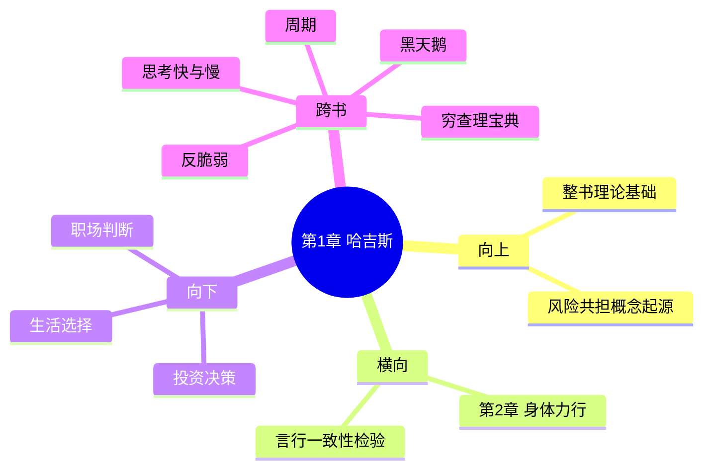

---

category:
  - 书籍拆解

status: draft
chapter:
number: 1
title: 哈吉斯
links:

  - "[[第2章-身体力行]]"
created: 2026-02-27
tags:
  - 非对称风险
  - 哈吉斯法典
  - 风险共担
  - 利益攸关
description: "本书第一章，介绍\"风险共担\"（Skin in the Game）的起源——3800年前的汉谟拉比法典，以最古老的法律框架确立了\"决策者必须承担后果\"的核心原则"
---

# 第1章 哈吉斯

## 📍 章节定位

### 全书位置
> 本书第一章，介绍"风险共担"（Skin in the Game）的起源——3800年前的汉谟拉比法典，以最古老的法律框架确立了"决策者必须承担后果"的核心原则

- **全书核心问题**: 如何在不确定的世界里做出好的决策？
- **本章回答的问题**: 为什么"风险共担"是人类社会最古老也最有效的风险管理系统？"切肤之痛"如何创造真正的责任感？
- **角色类型**: 概念奠基/历史溯源
- **论证位置**: 全书开篇，为整个"非对称风险"理论奠定历史和逻辑基础

### 章节序列
| 方向 | 章节标题 | 逻辑连接 |
|------|----------|----------|
| 前章 | 无 | 本书开篇 |
| 后章 | [[第2章-身体力行]] | 从历史案例延伸到现实实践 |

### 一句话定位
> 第1章通过汉谟拉比法典的故事揭示了"风险共担"的古老智慧——3800年前巴比伦人就明白：只有让决策者承受决策的后果，系统才能稳定运行。这种"切肤之痛"是避免系统性风险的唯一有效机制。

---

## 🎯 核心观点

### 第一层：表层案例
> 章节中的具体案例、故事、数据

| 案例名称 | 简要描述 | 页码 | 关键引文 |
|----------|----------|------|----------|
| 汉谟拉比法典第229条 | 建筑师盖房子倒塌，压死房主，建筑师要被处死 | p.1-30 | "这是最好的风险管理规则" |
| 医生责任古代 vs 现代 | 古代医生为病人治病失败，自己也会受害；现代医生有职业保护 | p.1-30 | "责任与风险必须对称" |
| 罗马桥梁测试 | 罗马工程师需站在自己建的桥下，让第一辆马车通过 | p.1-30 | "用自己的命担保" |
| 船东与商人 | 古代船东需亲自登船航行，而非委托他人 | p.1-30 | "利益相关才能尽责" |
| 斯巴达母亲训子 | "带着盾牌回来，或者死在场上" | p.1-30 | "不为信念冒险=什么都没说" |

### 第二层：中层机制
> 案例背后的运行机制、方法论

| 机制名称 | 组成要素 | 因果链条 | 证据来源 |
|----------|----------|----------|----------|
| 生命押注机制 | 最高利益=生命 | 决策→后果严重→必须谨慎 | 古代法律案例 |
| 声誉资本机制 | 专业声誉=生存基础 | 失误→声誉损失→长期利益受损 | 职业发展案例 |
| 激励对称机制 | 收益与风险匹配 | 有收益必承担风险→行为约束 | 经济行为分析 |
| 反馈循环机制 | 现实结果直接反馈 | 行为→后果即时显现→快速学习 | 进化心理学 |
| 成本内化机制 | 外部成本内部化 | 决策者承担全部成本→避免外包风险 | 组织行为学 |

### 第三层：底层规律
> 可迁移的普遍规律

| 规律陈述 | 抽象层级 | 知识连接 | 适用范围 |
|----------|----------|----------|----------|
| 生命押注定律 | 伦理学/风险理论 | [[反脆弱-塔勒布]] | 一切高风险决策 |
| 声誉不可伪造定理 | 信息经济学 | [[穷查理宝典]] | 专业服务领域 |
| 激励对称原则 | 行为经济学 | [[思考快与慢]] | 制度设计 |
| 成本内化定律 | 环境经济学 | [[周期]] | 风险管理 |
| 反馈时效原则 | 控制理论 | [[黑天鹅-塔勒布]] | 决策系统 |

---

## 💬 降维翻译

### 观点1: 汉谟拉比法典的风险管理智慧

#### 原文表达
> "The Code of Hammurabi contains the best risk-management rule ever: a builder should be put to death if his building collapses and kills its owner. This forces the builder to take extra safety precautions." —— p.25

#### 降维翻译（中学生能懂）
3800年前，巴比伦国王汉谟拉比制定了人类最早的法律法典。其中一条法律规定：如果建筑师盖的房子塌了，压死了房主，建筑师自己也要被处死。

这条法律看起来很残酷，但它创造了一个简单但有效的机制：建筑师为了让自己的小命保住，就必须把房子盖得非常坚固。因为他知道，如果房子塌了，自己也活不成。

这就叫"风险共担"——做决定的人，必须承受这个决定的后果。

#### 日常类比（奶奶能懂）
就像老话说的"自己做的饭，自己要吃"。如果你让别人帮你做饭，但做饭的人不用吃自己做的饭，那他可能就随便做做，甚至故意少放盐省点钱。但如果他自己也要吃这顿饭，他肯定会认认真真做。

古代的厨师也是这样的，官府让厨师先尝一口，确定没毒才给皇帝吃——这就是"风险共担"，让自己承受可能的风险，别人才相信你会认真对待。

#### 检验
- Q: 如果一个中学生问你为什么古人要用这么残忍的法律？
- A: 不是因为古人残忍，而是因为这是唯一能让建筑师认真盖房子的方法。用金钱处罚可能还不够严重，但用生命做赌注，建筑师一定会使出浑身解数把房子盖牢固。

### 观点2: "切肤之痛"是真正的过滤器

#### 原文表达
> "Skin in the game is a filter. Those who have no skin in the game can talk a good game, but when it's time to put their money where their mouth is, they disappear." —— p.18

#### 降维翻译（中学生能懂）
"切肤之痛"就像一个过滤器——有没有真正把自己的利益押上去，一试就知道。

那些没有"切肤之痛"的人，可以把话说得很好听，给你一堆建议，但当你让他们自己也按这个建议去做、去承担可能的后果时，他们早就跑得无影无踪了。

真正有本事的人，一定是那些自己也在做这件事、也在承担风险的人。

#### 日常类比（奶奶能懂）
就像借钱借不到的时候最能看清人心一样——平时称兄道弟的人，一到需要他真金白银拿出来的时候就找借口开溜，那些平时不太说话但二话不说把钱拿出来的人，才是真正靠得住的。

这和"切肤之痛"是一个道理：愿意把自己的钱、时间、或者前途押上去的人，说话才靠谱。

#### 检验
- Q: 怎么判断一个人给的建议靠不靠谱？
- A: 很简单，看他本人是不是也在按这个建议做，或者有没有把身家押上去。那些自己都不用的建议，你自己也要小心。

---

## ✨ 金句库

### 原书金句
| 金句 | 页码 | 适用场景 |
|------|------|----------|
| "汉谟拉比法典第229条是有史以来最好的风险管理规则" | p.25 | 风险管理启蒙 |
| "没有切肤之痛的建议，就是噪音" | p.15 | 专家识别 |
| "只有用自己的命担保，才能创造真正的责任感" | p.20 | 责任教育 |
| "决策者必须承担决策的后果" | p.22 | 制度设计 |
| "风险共担是公平的基础" | p.18 | 社会伦理 |
| "古代的规则比现代更有效，因为古人把命押上去" | p.28 | 现代反思 |

### 降维金句
| 金句 | 来源观点 | 适用场景 |
|------|----------|----------|
| 让自己承受后果，别人才信你 | 风险共担原理 | 信任判断 |
| 说话不算数，撒腿跑得快 | 切肤之痛过滤 | 识人辨事 |
| 盖房子要先住三年 | 古代智慧 | 质量监管 |
| 不敢押上自己命的人，说话别全信 | 生命押注 | 专家识别 |
| 真正的专家用自己的钱投票 | 利益攸关 | 理财建议 |
| 古代用命担保，现代用合同担保 | 责任演变 | 制度对比 |
| 只有后果严重，责任才真实 | 激励对称 | 管理设计 |
| 声誉是拿命换来的 | 声誉机制 | 职业发展 |
| 不承担风险的建议，都是空话 | 风险共担 | 决策参考 |
| 古代的风险管理最简单：不死就对了 | 生存智慧 | 风险教育 |
| 船东不登船，水手不拼命 | 利益绑定 | 团队管理 |
| 医生不给自己家人治病，说明这疗法有问题 | 实践验证 | 医学伦理 |
| 理财顾问不买的理财品，最好别买 | 利益验证 | 投资建议 |
| 创始人all in的项目，才值得跟 | 押注程度 | 创业判断 |
| 用别人的钱赌，输了是别人的 | 代理人问题 | 金融警示 |

## 🔗 当下映射

### 💰 财富应用
| 场景 | 具体行动 | 预期效果 | 风险提示 |
|------|----------|----------|----------|
| 选择理财顾问 | 问顾问自己买了多少推荐的产品 | 识别是否有切肤之痛 | 可能被拒绝回答 |
| 评估投资建议 | 问建议者是否自己也投了钱 | 判断建议可信度 | 可能显得不信任 |
| 识别骗子 | 看是否愿意义务承担后果 | 减少被收割 | 需要勇气提问 |
| 创业项目选择 | 看创始人是否押上全部身家 | 评估靠谱程度 | 全面押注有风险 |
| 机构选择 | 看高管薪酬是否与业绩绑定 | 判断激励是否对称 | 短期指标可能失真 |

### 💼 职场应用
| 场景 | 具体行动 | 所需能力 | 适用职级 |
|------|----------|----------|----------|
| 接受领导建议 | 问领导是否也承担同样风险 | 风险意识 | 任何层级 |
| 选择导师 | 观察导师是否践行自己说的 | 观察能力 | 任何层级 |
| 项目决策 | 确保决策者与后果绑定 | 制度设计 | 中高层 |
| 团队激励 | 设计利益共享责任共担机制 | 激励设计 | 管理者 |
| 跨部门合作 | 明确各自的风险承担 | 责任划分 | 项目负责人 |

### 🏠 生活应用
| 场景 | 具体行动 | 可行性 | 见效时间 |
|------|----------|--------|----------|
| 找对象 | 观察对方是否愿意为关系付出代价 | 中 | 短期 |
| 买房决策 | 亲自实地考察，不完全依赖中介 | 高 | 立即 |
| 育儿建议 | 观察建议者是否也这样养孩子 | 中 | 长期 |
| 健康建议 | 看医生是否给自己家人用同样方案 | 高 | 问即有效果 |
| 人际交往 | 看重对方实际行动而非承诺 | 高 | 立即可判断 |

### 72小时行动计划
1. [今天开始] 检查手机里关注的"专家"，看他们是否真的按自己说的做
2. [24小时内] 找一个你经常听建议的人，问他是否把自己的建议应用到自己身上
3. [48小时内] 评估你最近做的一个重要决定，决策者是否承担了相应后果
4. [72小时内] 给自己立一个规矩：只接受那些"押上身家"的人的建议

---

## 🕸️ 章节关联

### 向上关联 → 整书
- **贡献**: 本章奠定了"风险共担"概念的历史基础和核心定义——决策者必须承担后果
- **位置**: 全书理论基础，后续章节从不同角度深化这一概念

### 横向关联 → 章节间
| 章节编号 | 章节标题 | 关联类型 | 连接描述 |
|----------|----------|----------|----------|
| 第2章 | [[第2章-身体力行]] | 延伸 | 从历史案例延伸到现实实践，检验是否言行一致 |

### 向下关联 → 具体应用
| 应用场景 | 难度 | 前置知识 |
|----------|------|----------|
| 风险识别 | 低 | 基础逻辑 |
| 决策优化 | 中 | 激励机制 |
| 制度设计 | 高 | 组织行为 |

### 跨书关联 → 知识网络
| 书籍 | 概念 | 关系 | 备注 |
|------|------|------|------|
| [[反脆弱-塔勒布]] | 反脆弱 | 前提条件 | 风险共担是反脆弱的前提 |
| [[黑天鹅-塔勒布]] | 极端事件 | 互补 | 风险共担能减少黑天鹅冲击 |
| [[穷查理宝典]] | 激励机制 | 呼应 | 芒格的激励理论与风险共担一致 |
| [[思考快与慢]] | 认知偏差 | 补充 | 风险共担可对抗认知偏误 |
| [[周期]] | 波动周期 | 扩展 | 风险共担在周期不同阶段的意义 |

### 关联可视化

---

## ❓ 问答设计

### Q1: 汉谟拉比法典第229条讲了什么？(记忆型)
**认知层次**: 记忆
**难度**: 低
**答案要点**:
- 法律规定建筑师盖的房子塌了压死房主，建筑师要被处死
- 这是用生命作为赌注来确保建筑质量
- 被塔勒布称为"有史以来最好的风险管理规则"

### Q2: 什么是"切肤之痛"？(理解型)
**认知层次**: 理解
**难度**: 低
**答案要点**:
- 决策者必须承受自己决策的后果
- 只有当后果与自身利益直接相关时，才会认真对待
- 没有切肤之痛的建议都是噪音

### Q3: 为什么古代的风险管理比现代更有效？(分析型)
**认知层次**: 分析
**难度**: 中
**答案要点**:
- 古代用生命作为赌注，激励最强
- 现代多用金钱处罚，可能不够严重
- 代理人问题导致决策者与后果分离

### Q4: 如何在现代应用"风险共担"原则？(应用型)
**认知层次**: 应用
**难度**: 中
**答案要点**:
- 选择理财顾问时，问他是否自己也买了推荐的产品
- 接受建议时，问对方是否也在这样做
- 设计制度时，确保激励与风险对称

### Q5: "风险共担"和"反脆弱"是什么关系？(理解型)
**认知层次**: 理解
**难度**: 中
**答案要点**:
- 风险共担是反脆弱的前提
- 只有承担风险并从后果中学习，才能变得更强
- 不承担风险就无法享受反脆弱的好处

### Q6: 代理人问题在现代社会有哪些表现？(分析型)
**认知层次**: 分析
**难度**: 中
**答案要点**:
- 基金经理用别人的钱投资
- 职业经理人不承担经营失败的后果
- 专家给出建议但不承担后果

### Q7: 怎么判断一个人给的建议是否可信？(应用型)
**认知层次**: 应用
**难度**: 低
**答案要点**:
- 问：他有自己的利益在里头吗？
- 问：他按自己说的做了吗？
- 问：他承担后果吗？

### Q8: 古代船东为什么必须亲自登船？(理解型)
**认知层次**: 理解
**难度**: 低
**答案要点**:
- 船东亲自航行才会认真对待船只安全
- 委托他人无法保证同等程度的谨慎
- 利益绑定才能产生真正的责任感

### Q9: "生命押注"在现代是否过于极端？(评价型)
**认知层次**: 评价
**难度**: 高
**答案要点**:
- 生命押注确实过于残酷，不适合现代社会
- 但核心原理仍然有效：必须有足够的利益攸关
- 现代可以用声誉、财富、职业发展来替代

### Q10: 创业者应该如何应用风险共担原则？(应用型)
**认知层次**: 应用
**难度**: 中
**答案要点**:
- 创始人应该押上自己的身家
- 核心团队成员也应该有利益绑定
- 避免"投资人亏钱，创始人套现"的情况

### Q11: 风险管理的历史演变说明了什么？(分析型)
**认知层次**: 分析
**难度**: 高
**答案要点**:
- 古代用极端手段（生命）确保责任
- 现代法律体系更加"人性化"，但效果可能打折
- 需要找到现代环境下有效的风险共担机制

### Q12: 为什么专家建议常常不靠谱？(分析型)
**认知层次**: 分析
**难度**: 中
**答案要点**:
- 专家不用承担建议的后果
- 建议错了对自己没有损失
- 存在"委托-代理"问题

### Q13: 怎样建立有效的风险共担机制？(创造型)
**认知层次**: 创造
**难度**: 高
**答案要点**:
- 明确决策与后果的对应关系
- 设计激励相容的机制
- 引入外部监督和问责

### Q14: "林迪效应"与风险共担有何关联？(理解型)
**认知层次**: 理解
**难度**: 中
**答案要点**:
- 经得起时间检验的制度/规则，往往有风险共担的特质
- 存活越久说明责任机制越有效
- 可以用林迪效应来筛选可靠的制度

### Q15: 个人如何在日常生活中实践风险共担？(应用型)
**认知层次**: 应用
**难度**: 低
**答案要点**:
- 不轻易采纳不承担后果者的建议
- 自己做决定时要想想后果
- 交学费学习不如实地调研

---
