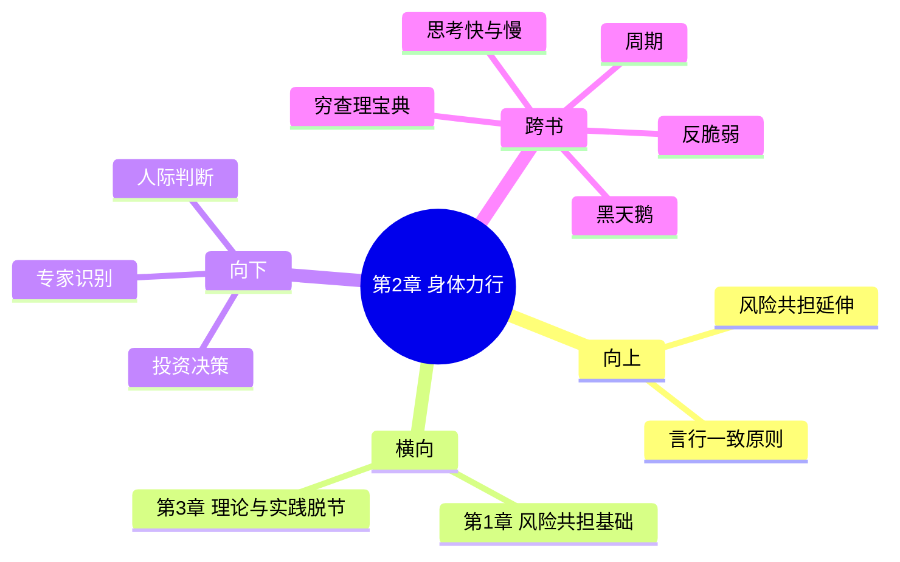

---

category:
  - 书籍拆解

status: draft
chapter:
number: 2
title: 身体力行
links:

  - "[[第1章-哈吉斯]]"
  - "[[第3章-十九分钟]]"
created: 2026-02-27
tags:
  - 非对称风险
  - 实践优先
  - 言行一致
  - 身体力行
---

# 第2章 身体力行

## 📍 章节定位

### 全书位置
> 本书第二章，从历史案例转向现实实践，探讨"言行一致"——真正的知识来自实践，只有亲身参与、承担风险，才能获得真正的理解

- **全书核心问题**: 如何在不确定的世界里做出好的决策？
- **本章回答的问题**: 为什么"说"和"做"之间存在巨大鸿沟？为什么必须"身体力行"才能获得真知？
- **角色类型**: 概念深化/实践路径
- **论证位置**: 继第1章"风险共担"概念之后，进一步阐明只有实践才能验证真正的理解

### 章节序列
| 方向 | 章节标题 | 逻辑连接 |
|------|----------|----------|
| 前章 | [[第1章-哈吉斯]] | 从历史智慧延伸到现实实践 |
| 后章 | [[第3章-十九分钟]] | 探讨理论与实践脱节的危害 |

### 一句话定位
> 第2章揭示了知识的核心检验标准——"身体力行"：只有那些愿意把自己的利益、声誉、甚至生命押上去的人，才是真正的专家。空谈理论而不实践的人，本质上是在"白嫖"别人的信任。

---

## 🎯 核心观点

### 第一层：表层案例
> 章节中的具体案例、故事、数据

| 案例名称 | 简要描述 | 页码 | 关键引文 |
|----------|----------|------|----------|
| 外科医生vs管理者 | 医生必须为自己的手术失败负责，管理者有免责条款 | p.31-60 | "手术台上的医生没有退路" |
| 投资顾问的奇怪建议 | 顾问推荐你自己买，但自己不买 | p.31-60 | "说一套做一套" |
| 将军与政治家 | 将军亲自上战场，政治家在后方指挥 | p.31-60 | "谁在冒险，谁在指挥" |
| 建筑师与开发商 | 古代建筑师住自己盖的房子，现代开发商只卖房 | p.31-60 | "风险与收益分离" |
| 健身教练vs营养师 | 健身教练体型好，营养师自己肥胖 | p.31-60 | "实践是最好的证明" |

### 第二层：中层机制
> 案例背后的运行机制、方法论

| 机制名称 | 组成要素 | 因果链条 | 证据来源 |
|----------|----------|----------|----------|
| 实践检验机制 | 行动验证认知 | 说了→做了→结果 | 历史案例 |
| 声誉绑定机制 | 专业声誉=生存基础 | 失误→声誉损失→利益受损 | 职业发展 |
| 反馈时效机制 | 即时结果反馈 | 行动→后果快速显现 | 学习理论 |
| 成本对称机制 | 投入与风险匹配 | 付出成本→承担后果 | 决策分析 |
| 一致性筛选机制 | 言行验证真实性 | 言行不一→可信度下降 | 社交心理学 |

### 第三层：底层规律
> 可迁移的普遍规律

| 规律陈述 | 抽象层级 | 知识连接 | 适用范围 |
|----------|----------|----------|----------|
| 实践优先定律 | 认识论/行动理论 | [[反脆弱-塔勒布]] | 一切知识获取 |
| 言行一致原则 | 伦理学/信誉学 | [[穷查理宝典]] | 人际信任 |
| 反馈时效原则 | 学习理论 | [[思考快与慢]] | 技能提升 |
| 成本对称原则 | 经济学 | [[周期]] | 决策分析 |
| 声誉不可伪造定理 | 信息经济学 | [[黑天鹅-塔勒布]] | 专家识别 |

---

## 💬 降维翻译

### 观点1: 实践是检验真理的唯一标准

#### 原文表达
> "The difference between a surgeon and a 'suit' (corporate executive) is that the surgeon has no exit option. When you're on the operating table, you can't say 'I quit.' But a manager can always walk away from a bad decision." —— p.35

#### 降维翻译（中学生能懂）
外科医生和管理者最大的区别是什么？

外科医生做手术的时候，没有退路可言——不能在中途说"我不干了，溜了溜了"。病人躺在手术台上，你的每一个决定都关系到一条人命，你必须负责到底。

但公司管理者不一样，做了一个烂决策，大不了引咎辞职换个公司继续干。这就是"有没有退路"的区别。

真正有本事的人，是那些没有退路、必须硬着头皮上的人。只有在这种压力下，才会暴露出真正的能力。

#### 日常类比（奶奶能懂）
就像老话说的"是骡子是马，拉出来遛遛"。那些说自己多厉害的人，你得看他实际做了什么，而不是光听他说。一个健身教练如果自己肥头大耳，他说的话你能信吗？一个营养师如果自己营养不良，她教的养生方法你能用吗？

这就叫"身体力行"——自己做不到的事，就没资格教别人。

#### 检验
- Q: 为什么说"说得好不如做得好"？
- A: 因为说不需要成本，做需要付出努力、承担风险。只有愿意付出代价的人，说的话才靠谱。

### 观点2: 言行不一是最明显的欺骗信号

#### 原文表达
> "Most people can talk a good game. But when you look at what they actually do, it's often completely different. The gap between words and actions is the best indicator of whether someone is for real." —— p.45

#### 降维翻译（中学生能懂）
大部分人都能说一套做一套——话说得漂亮，但实际上做的是另一回事。

怎么分辨谁是真心谁是假意？你不需要听他们说什么，你只需要看他们实际做了什么。一个投资顾问建议你买某个基金，但他自己不买，你觉得这是真心的建议吗？

言行不一就是最大的欺骗信号。不是说的人坏，而是人性就是这样——不把自己的利益押上去，说的话就不够认真。

#### 日常类比（奶奶能懂）
就像借钱一样——借钱的时候说得好听，"下个月一定还"，但真到了下个月，跑得比谁都快。这种人说的话，能信吗？

交朋友也是一样的道理。那些平时说得天花乱坠，但一到关键时刻就找不到人的，这种人不能深交。反倒是那些平时话不多，但一到关键时刻二话不说来帮忙的，这种人才是靠得住的。

#### 检验
- Q: 怎么快速识别一个人是否言行一致？
- A: 看他愿不愿意把自己的利益押在你给他的建议上。如果他让自己家人用这个方法、买这个产品，那这个建议才靠谱。

---

## ✨ 金句库

### 原书金句
| 金句 | 页码 | 适用场景 |
|------|------|----------|
| "外科医生没有退路" | p.35 | 责任教育 |
| "说一套做一套是最大的欺骗" | p.45 | 信任判断 |
| "实践是检验真理的唯一标准" | p.40 | 认识论 |
| "没有退路才能展现真正的能力" | p.38 | 能力评估 |
| "身体力行是最好的证明" | p.42 | 验证方法 |
| "言行一致是信任的基础" | p.48 | 人际关系 |

### 降维金句
| 金句 | 来源观点 | 适用场景 |
|------|----------|----------|
| 是骡子是马，拉出来遛遛 | 实践检验 | 识人辨事 |
| 说得好听不如做得好看 | 言行一致 | 行动指导 |
| 自己不吃，别给别人吃 | 实践验证 | 健康建议 |
| 教练体型好，会员跟着跑 | 身体力行 | 健身行业 |
| 医生给自己家人治病，才靠谱 | 责任绑定 | 医疗建议 |
| 投资顾问买自己推荐的，才敢跟 | 利益绑定 | 理财建议 |
| 不敢亲自上场，别教别人打架 | 实践优先 | 技能传授 |
| 理论再多，不如动手做一次 | 实践优先 | 学习方法 |
| 行动是最好的语言 | 实践验证 | 沟通方式 |
| 真本事是逼出来的 | 压力测试 | 能力成长 |
| 不入虎穴，焉得虎子 | 风险承担 | 创业指导 |
| 说了不算，做了才算 | 行动验证 | 价值判断 |
| 光说不练假把式 | 实践主义 | 效率提升 |
| 用行动证明，用结果说话 | 结果导向 | 职场竞争 |
| 不入局，永远看不清 | 实践认知 | 投资智慧 |

## 🔗 当下映射

### 💰 财富应用
| 场景 | 具体行动 | 预期效果 | 风险提示 |
|------|----------|----------|----------|
| 选择理财顾问 | 查他的实盘业绩 | 验证是否言行一致 | 过去业绩不代表未来 |
| 评估投资建议 | 看建议者是否买入 | 判断真实立场 | 可能有老鼠仓 |
| 识别P2P骗局 | 看创始人是否投自己的项目 | 判断项目真实性 | 可能虚假宣传 |
| 评估创业项目 | 看创始人是否押上全部 | 判断靠谱程度 | 押注不等于成功 |
| 辨别真假大V | 看他的操作与言论是否一致 | 识别营销号 | 可能有选择性展示 |

### 💼 职场应用
| 场景 | 具体行动 | 所需能力 | 适用职级 |
|------|----------|----------|----------|
| 评估领导力 | 观察领导是否以身作则 | 观察能力 | 任何层级 |
| 选择导师 | 看导师是否践行自己说的 | 验证能力 | 任何层级 |
| 团队管理 | 以身作则树立榜样 | 领导力 | 中高层 |
| 项目推进 | 亲自参与关键环节 | 执行力 | 项目负责人 |
| 跨部门合作 | 观察对方是否言行一致 | 识人能力 | 任何层级 |

### 🏠 生活应用
| 场景 | 具体行动 | 可行性 | 见效时间 |
|------|----------|--------|----------|
| 找对象 | 观察对方的实际行动 | 中 | 短期 |
| 交朋友 | 看对方关键时刻的表现 | 高 | 立即 |
| 健康养生 | 找体型好的健身教练 | 高 | 立即 |
| 育儿 | 找有育儿经验的育儿嫂 | 中 | 短期 |
| 买房 | 实地考察而非只看宣传 | 高 | 立即 |

### 72小时行动计划
1. [今天开始] 检查你关注的"专家"和大V，看他们的实际行动是否与言论一致
2. [24小时内] 找一个你经常听建议的领域，找出这个领域里谁是"身体力行"的人
3. [48小时内] 评估自己最近给别人的建议，自己是否也在按这个建议做
4. [72小时内] 给自己立规矩：只采纳那些"言行一致"的人的建议

---

## 🕸️ 章节关联

### 向上关联 → 整书
- **贡献**: 进一步深化"风险共担"概念——不仅要有"切肤之痛"，还要"言行一致"
- **位置**: 从理论到实践的桥梁，为后续章节探讨理论与实践脱节的危害做铺垫

### 横向关联 → 章节间
| 章节编号 | 章节标题 | 关联类型 | 连接描述 |
|----------|----------|----------|----------|
| 第1章 | [[第1章-哈吉斯]] | 前提 | 风险共担是身体力行的基础 |
| 第3章 | [[第3章-十九分钟]] | 对比 | 理论与实践脱节的反面教材 |

### 向下关联 → 具体应用
| 应用场景 | 难度 | 前置知识 |
|----------|------|----------|
| 专家识别 | 低 | 基础逻辑 |
| 投资决策 | 中 | 金融知识 |
| 人际判断 | 低 | 生活经验 |

### 跨书关联 → 知识网络
| 书籍 | 概念 | 关系 | 备注 |
|------|------|------|------|
| [[反脆弱-塔勒布]] | 实践出真知 | 强化 | 实践是反脆弱的基础 |
| [[穷查理宝典]] | 多元思维模型 | 互补 | 实践验证思维模型 |
| [[思考快与慢]] | 证实偏误 | 补充 | 实践可纠正偏误 |
| [[黑天鹅-塔勒布]] | 实践认知 | 呼应 | 实践是应对黑天鹅的基础 |
| [[周期]] | 实践验证 | 扩展 | 用周期验证实践 |

### 关联可视化

---

## ❓ 问答设计

### Q1: 外科医生和管理者最大的区别是什么？(记忆型)
**认知层次**: 记忆
**难度**: 低
**答案要点**:
- 医生没有退路，必须对结果负责
- 管理者可以有退路，失误可以辞职
- 这种"有没有退路"的区别，决定了责任程度

### Q2: 为什么要"身体力行"才能获得真知？(理解型)
**认知层次**: 理解
**难度**: 中
**答案要点**:
- 实践提供即时反馈
- 只有亲身经历才能理解细节
- 行动会暴露理论的盲点

### Q3: 怎么快速识别一个人是否言行一致？(应用型)
**认知层次**: 应用
**难度**: 低
**答案要点**:
- 观察他是否把自己的建议应用到自己身上
- 问他在相关领域是否真的投了资
- 看他是否愿意承担自己建议的风险

### Q4: 言行不一为什么是最大的欺骗信号？(分析型)
**认知层次**: 分析
**难度**: 中
**答案要点**:
- 不承担风险就没有成本
- 没有成本的话语不需要认真对待
- 人性倾向于对自己宽容，对他人严格

### Q5: "没有退路"如何激发真正的能力？(理解型)
**认知层次**: 理解
**难度**: 中
**答案要点**:
- 压力之下才会全力以赴
- 没有退路意味着必须成功
- 真正的能力往往在绝境中显现

### Q6: 实践与理论的关系是什么？(理解型)
**认知层次**: 理解
**难度**: 中
**答案要点**:
- 理论指导实践，实践验证理论
- 理论可能有盲点，实践能发现
- 实践优先于理论

### Q7: 健身教练胖说明什么？(分析型)
**认知层次**: 分析
**难度**: 低
**答案要点**:
- 他自己都不相信自己的方法
- 或者他的方法不适用于自己
- 言行不一的典型案例

### Q8: 投资顾问不买自己推荐的产品意味着什么？(分析型)
**认知层次**: 分析
**难度**: 中
**答案要点**:
- 他自己都不相信这个产品
- 建议可能只是销售话术
- 他不用承担后果

### Q9: 为什么"说得好听"不等于"有本事"？(评价型)
**认知层次**: 评价
**难度**: 中
**答案要点**:
- 说不需要成本，做需要成本
- 人倾向于高估自己，低估困难
- 只有行动才能验证真实能力

### Q10: 怎么在职场中做到"身体力行"？(应用型)
**认知层次**: 应用
**难度**: 中
**答案要点**:
- 以身作则，要求别人做到自己先做到
- 亲自参与关键环节
- 用行动而非言语来领导

### Q11: "实践优先"与"理论指导"矛盾吗？(评价型)
**认知层次**: 评价
**难度**: 高
**答案要点**:
- 不矛盾，而是互补
- 理论提供方向，实践验证细节
- 需要在实践中调整理论

### Q12: 怎样避免成为"光说不练"的人？(应用型)
**认知层次**: 应用
**难度**: 中
**答案要点**:
- 设定可验证的目标
- 公开承诺，利用社会压力
- 从小事做起，逐步建立行动习惯

### Q13: 创业为什么要"身体力行"？(分析型)
**认知层次**: 分析
**难度**: 中
**答案要点**:
- 创始人必须对结果负责
- 只有亲自实践才能理解业务
- 团队会观察创始人的行动

### Q14: "入局"为什么能提高认知？(分析型)
**认知层次**: 分析
**难度**: 中
**答案要点**:
- 只有进入局面才能看到细节
- 利益相关才会认真分析
- 实践提供理论无法预见的维度

### Q15: 如何在日常生活中培养"身体力行"的习惯？(创造型)
**认知层次**: 创造
**难度**: 中
**答案要点**:
- 从小事做起，承诺必须兑现
- 找到志同道合的伙伴互相监督
- 定期回顾自己的言行是否一致

---
