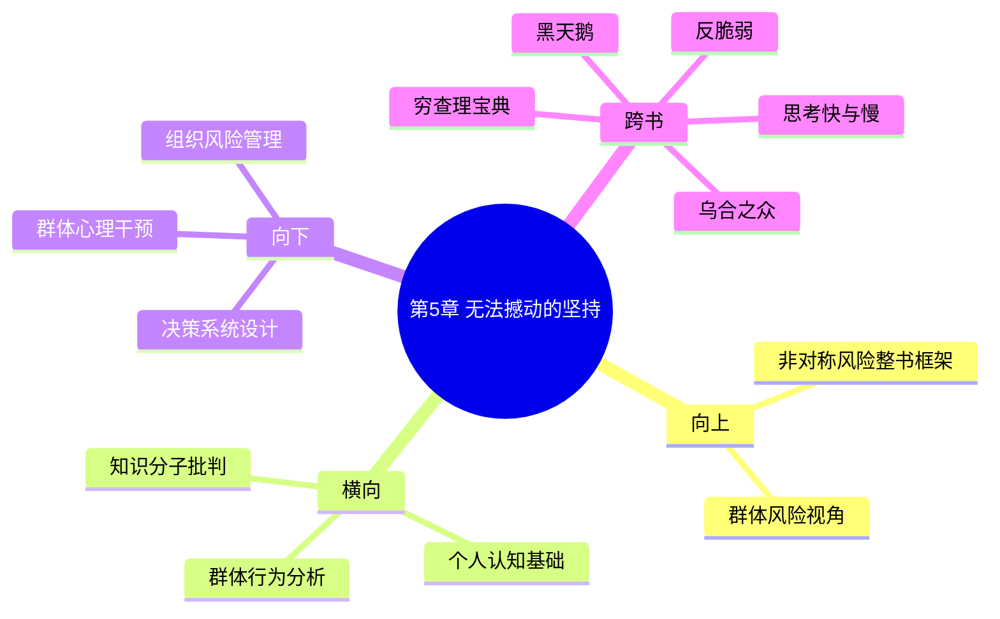

---

category: 
  - 书籍拆解

status: draft
chapter: 
number: 5
title: 无法撼动的坚持
links:

  - "[[第4章-大脑何时认输]]"
  - "[[第6章-合谋者和说谎者]]"
created: 2026-02-27
tags:
  - 非对称风险
  - 信念坚持
  - 意识形态固化
  - 社会心理学
description: "本书第五章，继续探讨信念固化的社会和群体层面表现，揭示为何某些个体和团体即使面对确凿相反证据也不会改变立场——这种坚持如何形成更大的非对称风险"
---

# 第5章 无法撼动的坚持

## 📍 章节定位

### 全书位置
> 本书第五章，继续探讨信念固化的社会和群体层面表现，揭示为何某些个体和团体即使面对确凿相反证据也不会改变立场——这种坚持如何形成更大的非对称风险

- **全书核心问题**: 如何在不确定的世界里做出好的决策？
- **本章回答的问题**: 集体信念固化是如何形成的？为何团体中的个体更难以接受相反的证据？意识形态的坚持如何创造系统风险？
- **角色类型**: 集体心理分析/社会现象解构
- **论证位置**: 从个体认知障碍深化到集体认知障碍，为全书的风险共担理念在社会组织层面提供警示

### 章节序列
| 方向 | 章节标题 | 逻辑连接 |
|------|----------|----------|
| 前章 | [[第4章-大脑何时认输]] | 从生理机制扩展到社会心理层面 |
| 后章 | [[第6章-合谋者和说谎者]] | 集体信念固化是知识分子脱离现实的表现 |

### 一句话定位
> 第5章揭示群体信念僵化的社会机制——当个体身处特定意识形态共同体时，即使证据确凿也难以动摇其信念体系，这种集体认知障碍构成了系统性风险的深层基础。

---

## 🎯 核心观点

### 第一层：表层案例
> 章节中的具体案例、故事、数据

| 案例名称 | 简要描述 | 页码 | 关键引文 |
|----------|----------|------|----------|
| 政治两极分化 | 两党支持者对相同信息的不同解读 | p.151-180 | "意识形态让我们成为盲人" |
| 科学共识的抗拒 | 某些群体拒绝科学共识的案例 | p.151-180 | "知识越明确，反对越强烈" |
| 宗教预言失败后更坚信 | 宗教团体预言落空后的反应 | p.151-180 | "现实的矛盾刺激信念增强" |
| 金融市场泡沫 | 投资群体对预警信号的无视 | p.151-180 | "市场上涨让我们忘记风险" |
| 专家共识固化 | 某些领域专家对新观点的排斥 | p.151-180 | "专业身份绑架独立判断" |

### 第二层：中层机制
> 案例背后的运行机制、方法论

| 机制名称 | 组成要素 | 因果链条 | 证据来源 |
|----------|----------|----------|----------|
| 群体确认增强 | 同类聚集-反复印证 | 相似个体→频率互动→信念强化 | 政治极化研究 |
| 社会认同绑架 | 身份归属-群体压力 | 身份认同→集体立场→个人认知 | 社会心理学研究 |
| 认知负荷转移 | 注意力分散-选择性关注 | 复杂信息→简化标签→刻板印象 | 注意力机制研究 |
| 压力联盟维护 | 对外团结-内部巩固 | 外部威胁→内部一致→共识加固 | 群体动力学 |
| 认知分化极化 | 内部同质化-外部排斥 | 群体内部→强化认同→排斥异己 | 社会分化机制 |

### 第三层：底层规律
> 可迁移的普遍规律

| 规律陈述 | 抽象层级 | 知识连接 | 适用范围 |
|----------|----------|----------|----------|
| 群体极化定律 | 社会心理学 | [[乌合之众-勒庞]] | 组织决策制定 |
| 社会认知锁定定理 | 认知社会学 | [[黑天鹅-塔勒布]] | 集体信念系统 |
| 信念固化的临界点原则 | 复杂系统理论 | [[反脆弱-塔勒布]] | 系统稳定性分析 |
| 群体非理性扩散律 | 行为经济学 | [[思考快与慢]] | 投资与消费行为 |

---

## 💬 降维翻译

### 观点1: 群体环境如何放大个体的认知固化

#### 原文表达
> "Individual stubbornness pales in comparison to group inertia. Once a community coheres around an idea, no matter how ridiculous, evidence becomes secondary to maintaining group cohesion." —— p.165

#### 降维翻译（中学生能懂）
一个人坚持错误观点已经够麻烦了，一群人都坚持错误观点就更难改变了。当一群人因为拥有相似信念而抱团时，他们维护彼此关系的意愿比追求真相还强烈，那个时候即使摆出确凿的证据，他们也更可能会想办法忽视掉或扭曲解释，而不是放弃共同的信念。

就好像一个班级里的同学都相信某个老师的课特别水，当你拿出这位老师在学术界的成就来证明他其实挺棒的，同学们不但不会改变想法，可能还会一起批评你说的不对，觉得你不合群。这就是群体认同的力量，让人为了保持在群体中的归属感而忽视现实。

#### 日常类比（奶奶能懂）
就像在一个村里，如果大家都相信某种迷信说法（比如不能在某个日子出门），哪怕来了很多科学道理都告诉你这只是封建迷信，村民们可能也不会轻易改想法。因为他们长期生活在这样的环境里，大家的意见都一样，谁要说出不同的想法就被大家当"异类"了。为了不被排斥，他们宁愿继续相信可能不对的事情。

股市投资也是一样，如果一伙人平时都买同类型的股票，当市场上出现对这些股票不利的消息时，他们可能会相互鼓励说"这是暂时的大环境问题"，而不去真正面对基本面恶化的现实，因为承认错误意味着要面对自己的损失和周围人的质疑。

#### 检验
- Q: 如果一个中学生问你，怎么看出群体比个人更容易固执己见？
- A: 当一群人抱成团时，承认错误不只是个人面子问题了，还是群体威信问题，所以他们会更加顽固地维护共同的信念。

### 观点2: 社会身份认同对认知的绑架

#### 原文表达
> "People are willing to sacrifice their perception of reality to maintain membership in their chosen ideological tribe. The fear of social exclusion often surpasses rational risk assessment in its intensity." —— p.170

#### 降维翻译（中学生能懂）
人们为了融入自己所属的那个"阵营"，宁愿牺牲对现实的准确理解。害怕被群体排斥的恐惧，往往比担心判断错误的理性担忧更强烈。

就像是某个宗教、政党或者投资群体，一旦加入其中，个人就很难用全新的方式看问题了，因为如果看到了不同的事实，就意味着可能要离开这个团体、失去朋友和认同感。所以他们会情愿继续相信那些已经被证伪的说法，也不愿意承受"被开除群聊"的心理压力。

#### 日常类比（奶奶能懂）
就好像村里的红白喜事理事会，如果里面的人习惯了按照老规矩办事，哪怕有年轻人提出更好的办法，理事们也可能不会采纳，怕一旦改变就显得自己跟不上时代或者不合规矩，失去了在群体中的地位。

再比如一些投资QQ群，群里如果长期都弥漫着看涨的情绪，哪怕外部有很多利空消息，群里的人也会相互安慰说没关系，继续盲目看好。因为谁要是提出不同意见，就可能被踢出群，失去和这些"同道中人"交流的感觉。

#### 检验
- Q: 如果一个中学生问你，如何判断一个人是真信还是为了合群装相信？
- A: 看他离开群体环境后还能不能独立思考和表达不同观点，如果只能在群体中才能维持那种信念，就很可能是为了合群。

---

## ✨ 金句库

### 原书金句
| 金句 | 页码 | 适用场景 |
|------|------|----------|
| "意识形态让我们成为盲人" | p.155 | 批评意识形态绑定 |
| "知识越明确，反对越强烈" | p.160 | 认知固化的悖论 |
| "现实的矛盾刺激信念增强" | p.165 | 矛盾强化效应 |
| "市场上涨让我们忘记风险" | p.170 | 投资心理学 |
| "群体比个人更固执" | p.175 | 群体心理学 |
| "社会身份绑架个人认知" | p.180 | 身份认同分析 |
| "群体共识可能压制理性" | p.168 | 群体决策警示 |
| "身份认同比事实更重要" | p.158 | 社会认知批判 |

### 降维金句
| 金句 | 来源观点 | 适用场景 |
|------|----------|----------|
| 一个人可能改错，一群人的错很难修正 | 群体惯性 | 组织变革 |
| 群体共识比个人理性更顽固 | 集体思维 | 决策审视 |
| 被踢出群比失去真实更可怕 | 身份绑架 | 自我认知 |
| 同温层里找不到真相 | 信息茧房 | 信息获取 |
| 融入群体需要忽视现实 | 社交成本 | 社交选择 |
| 群体归属感超越事实逻辑 | 身份认同 | 决策判断 |
| 被孤立的恐惧战胜了无知的危险 | 安全需求 | 社交警惕 |
| 团体思维让人不敢思考 | 群体压力 | 决策自主 |
| 坚持错误比承认分歧更安全 | 关系维护 | 个人判断 |
| 身份认同阻止理性判断 | 归属需求 | 自我反思 |
| 群体情绪比个人理性更强大 | 共鸣效应 | 决策安全 |
| 团队思维削弱个体判断力 | 集体意识 | 独立决策 |
| 身份风险大于决策风险 | 社会成本 | 选择策略 |

## 🔗 当下映射

### 💰 财富应用
| 场景 | 具体行动 | 预期效果 | 风险提示 |
|------|----------|----------|----------|
| 加入投资社群 | 避免只加入观点一致的投资群 | 增强独立判断力 | 可能短期错过收益 |
| 投资信息获取 | 主动关注市场看空方观点 | 避免群体思维陷阱 | 需要更强的心智处理 |
| 群体决策参考 | 在做重大投资决策时寻求外部专业意见 | 减少群体认同偏差 | 需付出额外咨询成本 |
| 风险管理 | 定期脱离群体讨论独立评估持仓 | 防范群体情绪干扰 | 可能错失短期机会 |
| 信息来源多样化 | 维持至少3个不同倾向的信息来源 | 保障资讯均衡性 | 信息处理负担增加 |

### 💼 职场应用
| 场景 | 具体行动 | 所需能力 | 适用职级 |
|------|----------|----------|----------|
| 团队会议决策 | 设置"异见者"角色或外部意见引入 | 群体决策管理能力 | 任何管理层级 |
| 项目风险评估 | 引入第三方独立评审机制 | 客观评价能力 | 项目负责人及以上 |
| 企业文化塑造 | 鼓励并奖励建设性冲突观点 | 批判性思维推动 | 高级管理层 |
| 战略制定 | 定期进行外部视角分析 | 跨域学习能力 | 执行层以上 |
| 决策优化 | 引入跨部门意见协调机制 | 综合协调能力 | 中高级管理层 |

### 🏠 生活应用
| 场景 | 具体行动 | 可行性 | 见效时间 |
|------|----------|--------|----------|
| 社交圈子反思 | 定期评估社交圈子的信息同质化程度 | 高 | 立即可行 |
| 独立思考培养 | 每周至少接触一种不同观点 | 高 | 2-3周见效 |
| 新闻信息来源多样化 | 有意识地阅读不同的新闻来源 | 高 | 即刻执行 |
| 家庭关系改善 | 避免家族成员的意见趋向统一 | 中 | 2-4周 |
| 兴趣社群评估 | 定期评估兴趣团体的认知同质性 | 高 | 即刻开始 |

### 72小时行动计划
1. [立即行动] 审视自己当前所在的社交群体（微信群、朋友圈、兴趣小组），评估成员观点的一致性
2. [24小时内] 主动寻找并关注至少一个与你主要观点不同的高质量信源
3. [48小时内] 反思在过去一个月中，你是否曾经因为维护群体立场而忽视过相反信息
4. [72小时内] 建立一项个人规则：在面对一致性的集体情绪时，刻意保留一定的理性质疑空间

---

## 🕸️ 章节关联

### 向上关联 → 整书
- **贡献**: 为"风险共担"理念增添集体认知风险视角——当群体脱离实际时，单一的个体风险共担也无法改变结局
- **位置**: 从个体风险意识到集体风险意识，扩大"非对称风险"的适用范围

### 横向关联 → 章节间
| 章节编号 | 章节标题 | 关联类型 | 连接描述 |
|----------|----------|----------|----------|
| 第4章 | [[第4章-大脑何时认输]] | 扩展 | 从个体神经机制发展为群体心理机制 |
| 第6章 | [[第6章-合谋者和说谎者]] | 延伸 | 群体意识形态固化催生了知识分子中的白痴现象 |
| 第3章 | [[第3章-十九分钟]] | 呼应 | 共同探讨信念体系的顽固性及其危害 |

### 向下关联 → 具体应用
| 应用场景 | 难度 | 前置知识 |
|----------|------|----------|
| 组织风险管理 | 高 | 组织行为学基础 |
| 决策系统设计 | 高 | 决策理论 |
| 群体心理干预 | 高 | 社会心理学 |
| 投资风险规避 | 中 | 金融知识基础 |
| 公共政策评估 | 高 | 政策分析基础 |

### 跨书关联 → 知识网络
| 书籍 | 概念 | 关系 | 备注 |
|------|------|------|------|
| [[乌合之众-勒庞]] | 群体非理性 | 理论基础 | 马克·塔勒布关于群体极化的深度分析 |
| [[黑天鹅-塔勒布]] | 概率误判 | 延伸 | 集体认知偏误加剧对黑天鹅事件的忽视 |
| [[反脆弱-塔勒布]] | 非线性效应 | 强化 | 群体层面的反脆弱需要多元性而非一致性 |
| [[思考快与慢]] | 阿比阿奇现象 | 感官验证 | 群体极化对认知偏误的放大效应 |
| [[穷查理宝典]] | 多元思维模型 | 互补 | 倡导多元化认知vs群体思维狭隘 |

### 关联可视化

---

## ❓ 问答设计

### Q1: "无法撼动的坚持"是指什么现象？(记忆型)
**认知层次**: 记忆
**难度**: 低
**答案要点**:
- 指群体或个人对特定信念的顽固坚持
- 即使面对确凿相反证据也不改变立场
- 这种坚持可能与现实认知背道而驰

### Q2: 为什么群体比个体更难以改变错误认知？(理解型)
**认知层次**: 理解
**难度**: 中
**答案要点**:
- 个体认知改变只涉及个人面子，群体改变涉及整个集体尊严
- 群体内部的确认偏误不断强化错误认知
- 脱离群体的社交成本高于认知错误的代价

### Q3: 在投资决策中如何防范集体认知偏误的影响？(应用型)
**认知层次**: 应用
**难度**: 中
**答案要点**:
- 主动寻找持不同观点的投资社群
- 设立独立于投资圈的专业顾问机制
- 在做出决策前征求外来人士意见建议

### Q4: 群体确认增强机制的运作原理是什么？(分析型)
**认知层次**: 分析
**难度**: 中
**答案要点**:
- 相似观点的人自然聚集在一起
- 频繁交流强化彼此原有看法
- 逐渐过滤掉异质信息，形成信息茧房

### Q5: 什么时候群体的认知坚持可能是积极的？(评价型)
**认知层次**: 评价
**难度**: 高
**答案要点**:
- 当群体坚持的信念是正确的且重要的
- 面临外部冲击时保持核心信念稳定
- 但需警惕是否只是为坚持而坚持

### Q6: 社会认同与认知准确性的冲突如何平衡？(理解型)
**认知层次**: 理解
**难度**: 中
**答案要点**:
- 社会需求和认知准确性存在根本张力
- 需要建立支持异质观点的心理安全环境
- 平衡个体归属感和认知追求的需求

### Q7: 如何设计组织结构以减少群体思维的影响？(应用型)
**认知层次**: 应用
**难度**: 中
**答案要点**:
- 设立专门的异议角色或部门
- 定期引入外部专家观点
- 分阶段决策流程，允许反复评估

### Q8: 政治极化现象与群体认知固化的关联如何理解？(分析型)
**认知层次**: 分析
**难度**: 高
**答案要点**:
- 双方强化：极化加剧固化，固化加深极化
- 媒体回音室和算法放大群体分化
- 缺乏面对面沟通加剧误解

### Q9: 金融市场的群体认知误区是如何形成的？(分析型)
**认知层次**: 分析
**难度**: 中
**答案要点**:
- 盈利时的验证偏误
- 相似交易策略的投资者聚集
- 社群内信息传播的单向性

### Q10: 什么样的群体结构最有利于避免认知固化？(应用型)
**认知层次**: 应用
**难度**: 中
**答案要点**:
- 成员多样性高的团体
- 鼓励争议和辩论的文化
- 领导者保持开放态度的组织

### Q11: 如何在日常生活中防范群体认知偏误？(应用型)
**认知层次**: 应用
**难度**: 中
**答案要点**:
- 评估社交圈的多样性
- 主动接触不同观点
- 定期反思自己的群体依赖倾向

### Q12: 在全球化时代如何保持独立批判思维？(创造型)
**认知层次**: 创造
**难度**: 高
**答案要点**:
- 建立多元化信息过滤系统
- 培养跨文化沟通能力
- 提高数字素养以辨别信息质量

### Q13: 教育系统如何培养学生抵抗群体思维的能力？(创造型)
**认知层次**: 创造
**难度**: 高
**答案要点**:
- 教授批判性思维技巧
- 增加辩论和不同意见表达训练
- 提供模拟不同观点场景的经验

### Q14: 群体极化如何影响公共政策制定？(分析型)
**认知层次**: 分析
**难度**: 高
**答案要点**:
- 群体内部观点趋向极端
- 忽视外部利益相关者的声音
- 可能造成社会分化加剧

### Q15: 技术手段如何应对群体认知固化挑战？(创造型)
**认知层次**: 创造
**难度**: 高
**答案要点**:
- 开发多元化信息服务
- 算法推荐平衡多样性
- 创建跨群体对话平台

---
