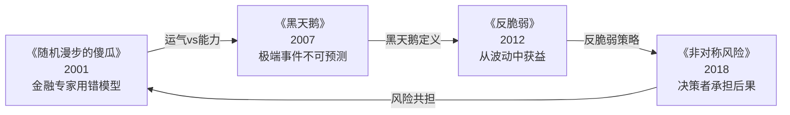

# 《黑天鹅》读书笔记

## 这本书要解决什么问题？

**核心困境**：不是问"如何预测未来？"，而是问"我们为什么总是无法预测极端事件？"人类生活在"平均斯坦"，却忽视"极端斯坦"。我们用过去的经验预测未来，但极端事件总是超出经验。

**一句话定位**：
> 就像欧洲人以为天鹅都是白的，直到发现一只黑天鹅，信念崩溃。我们以为世界是可预测的，直到黑天鹅事件发生，才意识到自己的无知。

### 作者站在什么位置说这些话？

| 维度 | 定位 |
|------|------|
| 主领域 | 风险管理、概率论、认识论、不确定性研究 |
| 跨界领域 | 衍生品交易实践、哲学批判、行为心理学 |
| 作者背景 | 黎巴嫩裔美国学者、前衍生品交易员，"黑天鹅"理论提出者，纽约大学风险工程学教授 |
| 历史语境 | 2007年出版，Incerto（不确定性）五部曲之核心著作。塔勒布站在金融交易一线的经验上，批判整个学术界的概率模型 |

### 和其他书有什么关系？

| 关联书籍 | 关联关系 | 共同底层逻辑 |
|----------|----------|--------------|
| [[反脆弱-塔勒布]] | 同作者·解决方案 | 黑天鹅无法预测→需要反脆弱 |
| [[非对称风险-塔勒布]] | 同作者·风险管理 | 极端事件定义→谁承担后果 |
| [[随机漫步的傻瓜-塔勒布]] | 同作者·批判起点 | 金融专家用错模型→系统性脆弱 |
| [[思考快与慢]] | 跨界补充 | 认知偏误导致低估不确定性 |
| [[原则]] | 风险视角 | 不确定性不是障碍，是进化的机会 |

### 塔勒布四部曲演进图

---

## 作者的核心论点

### 黑天鹅的定义：不可预测但改变一切

2001年9月11日，没人预测到恐怖袭击会改变全球政治格局。2008年，金融模型说"次贷不可能崩盘"，结果全球经济崩溃。2020年，专家说"疫情风险很小"，结果全球停摆。这三件事有一个共同点：事前无人预见，事后人人解释。

塔勒布把这类事件定义为"黑天鹅"，有三个特征：

1. **罕见性**——在预期之外，过去没有类似经验
2. **极端影响**——改变游戏规则，历史从此分为前后
3. **事后可解释**——发生后所有人都觉得"早该想到"

| 案例 | 事前预测 | 实际影响 | 事后解释 |
|------|----------|----------|----------|
| 9·11事件 | 无人预测 | 改变全球政治格局 | "早有迹象" |
| 2008年金融危机 | 模型说"不可能" | 全球经济崩溃 | "次贷问题早该发现" |
| 新冠疫情 | 专家说"风险很小" | 全球停摆 | "野生动物交易早该禁止" |

> **塔勒布黑天鹅定律**：历史不是由常规事件推动的，而是由黑天鹅事件塑造的。

历史不是爬行的，是跳跃的。一次黑天鹅，胜过十年平庸。

### 平均斯坦 vs 极端斯坦

想象一个房间里站了100个普通人，你走进去，房间里的平均身高几乎不变。但如果马云走进去，平均财富会被彻底扭曲。身高属于"平均斯坦"——个体对整体的影响微不足道；财富属于"极端斯坦"——个体可以不成比例地改变整体。

| 特征 | 平均斯坦（薄尾） | 极端斯坦（肥尾） |
|------|------------------|------------------|
| 分布类型 | 高斯/正态分布 | 幂律/肥尾分布 |
| 个体影响 | 对整体微不足道 | 可以不成比例改变整体 |
| 预测可行性 | 可以预测 | 预测几乎不可能 |
| 典型例子 | 身高、体重、考试成绩 | 财富、名声、市场波动、科技突破 |
| 平均值意义 | 有意义 | 被极端值扭曲，无意义 |

为什么这个区分重要？因为我们的教育、管理、预测都基于高斯分布（平均斯坦），但财富、影响力、市场波动都遵循幂律分布（极端斯坦）。用错模型，越努力越偏离现实。

> **极端斯坦定律**：我们生活在极端斯坦，却用平均斯坦的思维。

这个观点打碎了我对"努力=成功"的假设。在平均斯坦，时间和努力成正比；在极端斯坦，一次机会决定一切。打工是用时间换钱，属于平均斯坦——越努力越累，收入线性增长。创作是一次生产无限传播，属于极端斯坦——一次黑天鹅，胜过十年打工。

### 认知谬误：我们为什么会反复犯错？

二战前所有人都说"不可能再发生世界大战"。2008年前都说"房价不会跌"。新冠前都说"全球化不会中断"。我们总是无视那些"看不见的风险"。为什么？塔勒布列出了五大认知谬误：

| 谬误 | 定义 | 案例 | 应对 |
|------|------|------|------|
| 证实谬误 | 只寻找支持自己的证据 | 火鸡1000天被喂养，相信农场主爱它 | 寻找反例，而不是证据 |
| 叙述谬误 | 用故事解释随机事件 | 成功人士的励志故事 | 区分"解释"和"预测" |
| 游戏谬误 | 用游戏规则理解现实 | 用赌场概率理解金融危机 | 承认现实的复杂性 |
| 沉默证据 | 只看幸存者 | 二战幸存者的经验 | 考虑失败者的故事 |
| 认知自大 | 高估自己的知识 | 专家预测翻车 | 承认无知 |

其中最阴险的是叙述谬误。黑天鹅发生后，人们震惊→寻求解释→编造故事→事后诸葛亮→"下次我能预测"。但塔勒布说：你能解释过去，不代表你能预测未来。

> **认知谬误定律**：我们看到的不是真实的，是幸存下来的。

你看到的成功故事都是幸存者偏差。死掉的老鼠不会说话。失败者的经验你永远学不到。社交媒体上别人的精彩生活——只有精彩才会被分享。成功人士的励志故事——成功者的故事不等于可复制的方法。

### 杠铃策略：在不确定的世界里如何生存？

有人把90%的钱存银行，10%买高风险期权。有人本职工作稳定，副业做自媒体。这不矛盾——塔勒布管这叫"杠铃策略"：不把鸡蛋放在一个篮子里，而是极端分化。

为什么"中等风险"最危险？因为极度安全的东西你清楚它安全，极度风险的东西你清楚它危险。但"中等风险"的东西，你以为它安全，实际上你对它的风险一无所知。

| 风险类型 | 你以为 | 实际上 | 结果 |
|----------|--------|--------|------|
| 极度安全 | 安全 | 真的安全 | 不会破产 |
| 极度风险 | 危险 | 已知危险 | 愿赌服输 |
| **中等风险** | 相对安全 | **未知风险** | 最危险 |

> **杠铃定律**：在不确定的世界，极端策略优于中庸策略。

下次做投资决策，我不会再选"看起来稳健"的中等风险产品，而是把资金分成两块：一块极度安全（存款、国债），另一块极度激进（愿赌服输的冒险），完全避开中间地带。

### 可规模化：选择能遇到黑天鹅的赛道

写一本书，可以卖100万册。做咨询服务，一次只能服务一个客户。开发软件，100万人用的成本和1万人差不多。前者属于"可规模化"——一个模式无限复制，可能遇到黑天鹅。后者属于"不可规模化"——有天花板，注定是平均斯坦。

| 特征 | 不可规模化 | 可规模化 |
|------|------------------------|-------------------|
| 例子 | 本职工作、一对一服务 | 软件、媒体、品牌、书 |
| 增长曲线 | 线性增长（天花板） | 指数增长（无上限） |
| 黑天鹅潜力 | 有限 | 无限 |

> **赛道选择定律**：在极端斯坦，选择可规模化的赛道。

想要遇到黑天鹅，必须选择可规模化的领域。打工不可规模化，再努力也只是线性增长。创作可以规模化，一次黑天鹅，胜过十年平庸。

### 火鸡的故事：归纳法的致命陷阱

塔勒布讲了一个寓言：一只火鸡被农场主喂养了1000天。每一天，火鸡的数据都在增加——"农场主在照顾我""农场主爱我""我的信心在增长"。第1000天，火鸡100%确定农场主爱它。第1001天，感恩节到了。

火鸡用1000天的"数据"预测未来，结果在信心最高的时候被消灭。人类也一样——用过去预测未来，在极端斯坦注定失败。在平均斯坦，归纳法有效（太阳每天都升起）；在极端斯坦，归纳法是陷阱（火鸡的第1001天）。

> **归纳法陷阱定律**：用过去预测未来，在极端斯坦注定失败。

你不知道你是一只火鸡，还是农场主。基金过去10年年化8%不代表未来也会如此，房价过去20年只涨不跌不代表永远如此，大厂10年稳定不代表不会裁员。

---

## 这本书的局限

| 批评点 | 谁在批评 | 怎么说 | 实际情况 |
|--------|---------|--------|---------|
| 文风傲慢 | 读者、书评人 | 为说明观点不惜夸大事实，讽刺过多 | 确实有些段落读起来像在骂人，但观点经得起检验 |
| 忽略均值世界 | 统计学家 | 白天鹅的累计效应也很重要，车祸死亡远多于地震死亡 | 高斯分布在物理世界确实有效，但人类社会是极端斯坦 |
| 概念泛化 | 学者 | 部分事件其实可以预测，不是所有意外都是黑天鹅 | 塔勒布有时确实把范围扩大了，但核心洞察依然成立 |
| 实用性不足 | 普通读者 | 普通人难以执行杠铃策略 | 杠铃策略需要一定资金门槛，但思维方式人人可用 |

**一句话总结局限性**：
> 《黑天鹅》的核心价值在于提醒人类"认知的局限性"，而非提供万能公式。它改变的是你看世界的方式，不是你的操作手册。

---

## 最值得记住的话

**原书说的**：
1. "历史不是爬行的，是跳跃的。"
2. "黑天鹅事件有三个特征：罕见性、极端影响、事后可解释。"
3. "我们看到的不是真实的，是幸存下来的。"
4. "在极端斯坦，平均值被极端值扭曲。"
5. "在平均斯坦，时间和努力成正比；在极端斯坦，一次机会决定一切。"
6. "死掉的老鼠不会说话。"
7. "预测越精确，越可能错得离谱。"
8. "我们生活在极端斯坦，却用平均斯坦的思维。"
9. "在极端斯坦，中等风险最危险。"
10. "可规模化的东西才能产生黑天鹅效应。"

**翻译成人话**：
1. 历史不是爬行的，是跳跃的——一次黑天鹅，胜过十年平庸
2. 你看到的不是真实的，是幸存下来的——失败者的故事你永远看不到
3. 我们生活在极端斯坦，却用平均斯坦的思维——世界是跳跃的，不是渐进的
4. 在平均斯坦，时间和努力成正比；在极端斯坦，一次机会决定一切
5. 在极端斯坦，中等风险最危险——极度安全+极度风险，优于"看起来安全"的中庸
6. 预测越精确，越可能错得离谱——承认无知，比假装知道更安全
7. 可规模化的努力，才可能遇到黑天鹅——打工不可规模化，创作可以
8. 黑天鹅有三个特点：你预测不到，但改变一切，事后觉得"早知道"
9. 火鸡1000天被喂养，第1001天被宰——你不知道你是火鸡还是农场主
10. 承认无知，比假装知道更安全——黑天鹅教训我们的第一件事

---

## 讲给没读过的人听

你有没有想过，为什么世界上最重要的事情，都是没人预料到的？

9·11、金融危机、新冠疫情——这些改变历史的事件，没有一个被提前预测到。但事后，所有人都说"早该想到"。

塔勒布管这叫"黑天鹅"。它有三个特点：你预测不到，但它改变一切，事后所有人觉得可以预测。

他举了一个火鸡的例子。一只火鸡被农场主喂了1000天，每天都更加确信"农场主爱我"。第1001天，感恩节到了。

我们就是那只火鸡。用过去预测未来，在信心最高的时候被击倒。

塔勒布说，世界不是平均斯坦——不是努力多少就回报多少。世界是极端斯坦——一次机会决定一切。打工是用时间换钱，属于平均斯坦。创作是一次生产无限传播，属于极端斯坦。

所以他的建议是杠铃策略：90%极度安全，10%极度冒险，完全避开中间地带。因为"看起来安全"的中等风险，其实最危险。

记住一句话：历史不是爬行的，是跳跃的。

---

## 用来检验理解的问题

**基础回忆**：
1. Q: 黑天鹅的三个特征是什么？
   A: 罕见性（在预期之外）、极端影响（改变游戏规则）、事后可解释（发生后觉得可预测）。

2. Q: 平均斯坦和极端斯坦的核心区别是什么？
   A: 平均斯坦遵循高斯分布，个体对整体微不足道，可以预测。极端斯坦遵循幂律分布，个体可以不成比例改变整体，预测几乎不可能。

3. Q: 五大认知谬误是什么？
   A: 证实谬误、叙述谬误、游戏谬误、沉默证据、认知自大。

**理解验证**：
1. Q: 为什么"中等风险"最危险？
   A: 极度安全你知道它安全，极度风险你知道它危险。但中等风险你以为它安全，实际上你对风险一无所知。未知风险才是最大的风险。

2. Q: 杠铃策略的具体结构是什么？
   A: 90%极度安全（存款、国债）+ 10%极度风险（风险投资、创业）+ 0%中间部分（完全避免）。

3. Q: 什么是"可规模化"？为什么重要？
   A: 一个模式可以无限复制（软件、内容、品牌），增长无上限，可能遇到黑天鹅。不可规模化的事物（一对一服务）有天花板，注定是平均斯坦。

**实际应用**：
1. Q: 用杠铃策略规划你的下一年的时间和资金。
   A: 90%时间精力用于极度安全的核心能力（本职工作、人际、创意），10%用于极度冒险的探索（创业、创作、新领域）。

2. Q: 你生活中有没有"火鸡思维"的例子？
   A: 基金过去10年稳定不代表未来稳定；大厂稳定不代表不会裁员；过去的成功方法不代表未来有效。

**深度分析**：
1. Q: 塔勒布和达利欧应对不确定性的本质区别？
   A: 塔勒布构建反脆弱系统——从混乱中获益，哲学高度。达利欧系统化反思——把失败变成原则，操作深度。一个教你活，一个教你长。

2. Q: 为什么成功学大多是"叙述谬误"？
   A: 成功人士的故事看起来像方法，实际上是幸存者偏差+事后编故事。你能看到的只有成功者，失败者的经验你永远学不到。

---

## 和其他书的对话

塔勒布的四部曲是一个完整的思维体系。《随机漫步的傻瓜》是批判起点——金融专家用错了模型；《黑天鹅》是问题识别——极端事件不可预测；《反脆弱》是解决方案——如何从波动中获益；《非对称风险》是风险管理——决策者必须承担后果。先告诉我们问题是什么，再告诉我们怎么解决，最后告诉我们谁来负责。

达利欧和塔勒布都在对抗不确定性，但路径完全不同。塔勒布构建反脆弱系统，从混乱中获益，站在哲学的高度。达利欧建立反思系统，把失败变成原则，站在操作的深度。一个教你在暴风雨中获益，一个教你在暴风雨后进化。两者结合，哲学高度加操作深度，才是完整的应对。

卡尼曼是塔勒布的理论底座。《思考，快与慢》告诉你认知偏误有哪些、为什么会犯错；《黑天鹅》告诉你这些偏误如何让你低估极端事件的风险。卡尼曼诊断病情，塔勒布说这个病可能致命。

---

*拆解日期：2026-02-14*
*下次回访：1周后回顾「讲给没读过的人听」和「检验问题」*