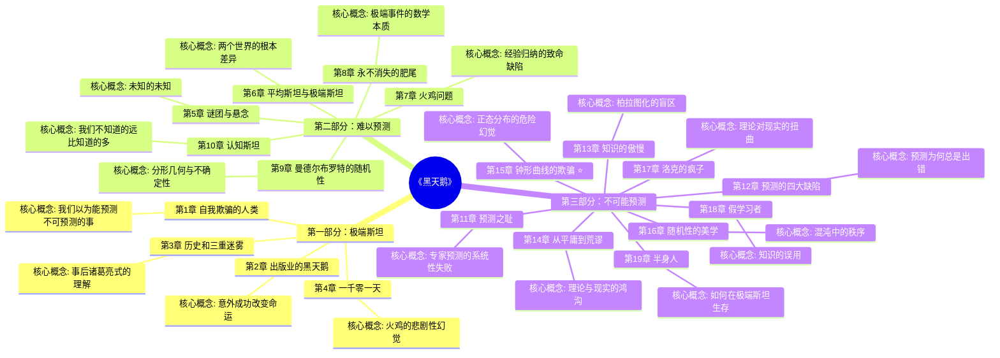

# 《黑天鹅》章节导航

## 📊 基本信息

| 项目 | 内容 |
|------|------|
| 书名 | 《黑天鹅》（The Black Swan） |
| 作者 | 纳西姆·尼古拉斯·塔勒布（Nassim Nicholas Taleb） |
| 总章节 | 19章（三部分） |
已拆解 | 19章
| 整书拆解 | [[黑天鹅-塔勒布-拆解记录]] |

---

## 🗺️ 章节结构图

---

## 📈 拆解进度

### 第一部分：极端斯坦

| 序号 | 章节 | 核心概念 | 状态 | 链接 |
|------|------|----------|------|------|

### 第二部分：难以预测

| 序号 | 章节 | 核心概念 | 状态 | 链接 |
|------|------|----------|------|------|

### 第三部分：不可能预测

| 序号 | 章节 | 核心概念 | 状态 | 链接 |
|------|------|----------|------|------|

**进度**: 19/19 (100%)

⭐ = 优先拆解（核心章节）

---

## 🎯 拆解优先级

根据整书拆解记录和核心概念，优先拆解以下章节：

### 第一优先级（核心概念）
1. **第6章 平均斯坦与极端斯坦** - 全书理论基础，理解两个世界
2. **第7章 火鸡问题** - 经验归纳谬误的经典案例
3. **第15章 钟形曲线的欺骗** - 统计学的核心批判

### 第二优先级（应用层面）
4. **第19章 半身人** - 如何在极端斯坦生存（实用建议）
5. **第11章 预测之耻** - 批判专家预测
6. **第4章 一千零一天** - 火鸡寓言的完整版

### 第三优先级（延伸阅读）
7. 第1-3章 - 认知偏差入门
8. 第8-10章 - 数学与哲学深度
9. 第12-14章 - 预测机制详解
10. 第16-18章 - 美学与认识论

---

## 🔗 快速跳转

### 按部分跳转
- [[#第一部分：极端斯坦]] - 认识黑天鹅的存在
- [[#第二部分：难以预测]] - 为什么我们无法预测
- [[#第三部分：不可能预测]] - 预测的失败与生存之道

### 按章节跳转
- [[第1章-自我欺骗的人类]]
- [[第2章-出版业的黑天鹅]]
- [[第3章-历史和三重迷雾]]
- [[第4章-一千零一天]]
- [[第5章-谜团与悬念]]
- [[第6章-平均斯坦与极端斯坦]]
- [[第7章-火鸡问题]]
- [[第8章-永不消失的肥尾]]
- [[第9章-曼德尔布罗特的随机性]]
- [[第10章-认知斯坦]]
- [[第11章-预测之耻]]
- [[第12章-预测的四大缺陷]]
- [[第13章-知识的傲慢]]
- [[第14章-从平庸到荒谬]]
- [[第15章-钟形曲线的欺骗]]
- [[第16章-随机性的美学]]
- [[第17章-洛克的疯子]]
- [[第18章-假学习者]]
- [[第19章-半身人]]

### 相关资源
- [[黑天鹅-塔勒布-拆解记录]] - 整书拆解笔记
- [[随机漫步的傻瓜-塔勒布-拆解记录]] - 塔勒布前作
- [[反脆弱-塔勒布-拆解记录]] - 塔勒布续作
- [[非对称风险-塔勒布-拆解记录]] - 塔勒布风险理论

---

## 📝 章节拆解说明

每个章节拆解将包含：
- 📍 **章节定位**：在全书中回答的问题
- 🎯 **核心观点**：三层提取（案例→机制→规律）
- 💬 **降维翻译**：原文→中学生能懂→奶奶能懂
- ✨ **金句库**：原书/降维/二创金句
- 🔗 **当下映射**：财富/职场/生活应用
- 🕸️ **章节关联**：前后章+整书+跨书关联
- ❓ **问答设计**：5-10个认知层次问题

---

*创建日期: 2026-02-26*
