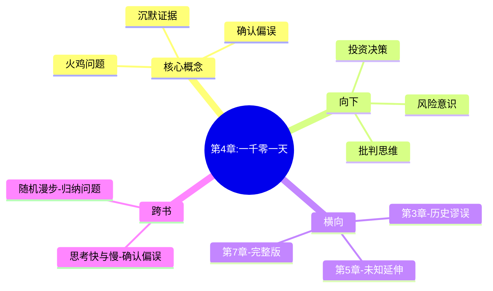

# 第4章 一千零一天

## 📍 章节定位

### 全书位置
> 本章通过"火鸡问题"深入分析经验归纳的致命缺陷——为什么1千天的经验无法预测第1001天？

- **全书核心问题**：我们为什么总是无法预测极端事件？
- **本章回答的问题**：为什么经验归纳是危险的？什么是"火鸡问题"？
- **角色类型**：核心概念型 - 展开经验归纳谬误

### 章节序列
| 方向 | 章节标题 | 逻辑连接 |
|------|----------|----------|
| 前章 | [[第3章-历史和三重迷雾]] | 历史谬误延伸 |
| 后章 | [[第5章-谜团与悬念]] | 未知的未知 |
| 第7章 | [[第7章-火鸡问题]] | 完整版火鸡问题 |

### 一句话定位
> 第4章是核心概念型章节，通过"火鸡寓言"揭示经验归纳的致命缺陷，回答"为什么1千天经验无法预测第1001天"这一关键问题。

---

## 🎯 核心观点

### 观点一：火鸡问题——经验归纳的陷阱

**【表层】现象层**：
- 火鸡被喂养1000天，认为"主人爱我"
- 第1001天是感恩节，它成了盘中餐
- 经验越多，越危险

**【中层】机制层**：
```
火鸡问题机制：
- 经验基于过去推断未来
- 过去没有极端事件不等于未来没有
- 归纳推理无法保证必然性
```

**【底层】规律层**：
> **归纳问题**：从有限经验无法推出普遍结论，过去安全不等于未来安全。

---

### 观点二：确认偏误

**【表层】现象层**：
- 我们寻找支持自己观点的证据
- 忽视反对的证据
- 这使经验更加危险

**【中层】机制层**：
```
确认偏误机制：
- 选择性记忆：记住支持的，忘记反对的
- 选择性观察：寻找支持的信息
- 选择性解释：把信息解释成支持自己
```

**【底层】规律层**：
> **认知偏见**：我们的大脑不是追求真理，而是追求自我验证。

---

### 观点三：沉默的证据

**【表层】现象层**：
- 成功的少数被看到
- 失败的多数被忽略
- 这导致对概率的误判

**【中层】机制层**：
```
沉默证据机制：
- 失败者没有发声机会
- 成功者被过度曝光
- 我们只看到"活下来的"
```

**【底层】规律层**：
> **幸存者诅咒**：我们只研究成功者，这让我们误以为成功很容易。

---

## 💬 降维翻译

### 观点一：火鸡问题

#### 原文表达
> "火鸡被喂养了1000天，它认为这种好日子会永远持续下去。但第1001天是感恩节。"

#### 降维翻译（中学生能懂）
喂了999天都没事，以为永远没事。结果第1000天被杀掉了。经验害死火鸡。

#### 日常类比（奶奶能懂）
就像借钱给朋友，借了99次都还了，以为第100次也会还。结果第100次跑了。经验靠不住。

---

### 观点二：确认偏误

#### 原文表达
> "我们倾向于寻找支持自己观点的证据，忽视反对的证据。这使经验归纳更加危险。"

#### 降维翻译（中学生能懂）
你要是觉得一件事对，就会只看到对的地方，不对的地方你看不见。

#### 日常类比（奶奶能懂）
就像你觉得某人好，他就什么都好。他要是不好，你也自动忽略。这叫"情人眼里出西施"。

---

### 观点三：沉默的证据

#### 原文表达
> "失败者没有机会讲述自己的故事。我们只听到成功者的声音，这导致严重的认知偏差。"

#### 降维翻译（中学生能懂）
死的都不说话，活着的都在说。让你以为成功很容易，其实死了一片。

#### 日常类比（奶奶能懂）
就像电视上都是创业成功的，失败的没人报道。让你以为创业很容易，其实亏本的多了去了。

---

## ✨ 金句库

### 原书金句
| 金句 | 适用场景 |
|------|----------|
| "火鸡被喂养了1000天，第1001天是感恩节。" | 经验归纳陷阱 |
| "我们倾向于寻找支持自己观点的证据。" | 确认偏误 |
| "失败者没有机会讲述自己的故事。" | 沉默证据 |

### 降维金句
| 金句 | 适用场景 |
|------|----------|
| "经验害死火鸡。" | 归纳陷阱 |
| "过去安全不等于未来安全。" | 归纳问题 |
| "确认偏误：只看到想看到的。" | 认知偏见 |
| "1千天经验预测不了第1001天。" | 火鸡问题 |
| "幸存者偏差害死人。" | 认知偏差 |
| "失败者不说话，成功者在说话。" | 沉默证据 |
| "经验是最危险的东西。" | 归纳警告 |
| "你的经验可能只是运气好。" | 归因谬误 |
| "看到的不等于全部。" | 认知局限 |
| "别把运气当能力。" | 归因错误 |

---

## 🔗 当下映射

### 💰 财富应用
| 场景 | 具体行动 | 预期效果 |
|------|----------|----------|
| 投资决策 | 不迷信历史业绩 | 避免"火鸡陷阱" |
| 职业发展 | 警惕"稳定"假设 | 预防行业突变 |
| 创业分析 | 了解失败率 | 避免幸存者偏差 |

### 💼 职场应用
| 场景 | 具体行动 | 所需能力 |
|------|----------|----------|
| 职业安全 | 假设"第1001天"会来 | 危机意识 |
| 团队管理 | 考虑"沉默的证据" | 全面视角 |
| 决策制定 | 质疑"过去一直如此" | 批判思维 |

### 🏠 生活应用
| 场景 | 具体行动 | 可行性 |
|------|----------|--------|
| 人际关系 | 警惕"他一直对我好" | 高 |
| 健康管理 | 不忽视"偶尔"的症状 | 高 |
| 重大决策 | 考虑"万一" | 高 |

### 72小时行动计划
1. **今天**：列出你生活中3个"火鸡问题"的例子
2. **本周内**：调查你行业的"失败率"
3. **准备**：制定"B计划"

---

## 🕸️ 章节关联

### 向上关联 → 整书
- **贡献**：建立"火鸡问题"这个核心隐喻
- **位置**：经验归纳批判的核心章节

### 横向关联 → 章节间
| 章节编号 | 章节标题 | 关联类型 | 连接描述 |
|----------|----------|----------|----------|
| 第3章 | 历史和三重迷雾 | 理论承接 | 历史谬误延伸 |
| 第5章 | 谜团与悬念 | 机制延伸 | 未知的未知 |
| 第7章 | 火鸡问题 | 完整版 | 火鸡寓言完整版 |

### 向下关联 → 具体应用
| 应用场景 | 难度 | 前置知识 |
|----------|------|----------|
| 投资决策 | 中 | 无 |
| 风险意识 | 低 | 无 |
| 批判思维 | 低 | 无 |

### 跨书关联 → 知识网络
| 书籍 | 概念 | 关系 | 备注 |
|------|------|------|------|
| [[思考快与慢-卡尼曼-拆解记录]] | 确认偏误 | 支持 | 系统1解释 |
| [[随机漫步的傻瓜-塔勒布-拆解记录]] | 归纳问题 | 继承 | 随机性基础 |

### 关联可视化


---

## ❓ 问答设计

### Q1: 什么是"火鸡问题"？
**认知层次**: 记忆
**难度**: 低
**答案要点**:
- 经验归纳的危险性
- 1千天经验无法预测第1001天
- 过去安全不等于未来安全

### Q2: 为什么经验归纳是危险的？
**认知层次**: 理解
**难度**: 中
**答案要点**:
- 经验基于有限过去
- 无法覆盖所有可能性
- 极端事件超出经验范围

### Q3: 什么是"确认偏误"？
**认知层次**: 记忆
**难度**: 低
**答案要点**:
- 寻找支持自己观点的证据
- 忽视反对的证据
- 这使经验更加危险

### Q4: 为什么"沉默的证据"很重要？
**认知层次**: 理解
**难度**: 中
**答案要点**:
- 失败者没有发声机会
- 我们只看到成功者
- 导致误判概率

### Q5: 如何避免"火鸡问题"？
**认知层次**: 应用
**难度**: 中
**答案要点**:
- 质疑"过去一直如此"
- 考虑极端情况
- 制定应急预案

### Q6: 什么是"幸存者偏差"？
**认知层次**: 理解
**难度**: 中
**答案要点**:
- 只研究成功者
- 忽略失败者
- 导致错误结论

### Q7: 为什么"经验"可能是危险的？
**认知层次**: 分析
**难度**: 中
**答案要点**:
- 经验可能是运气
- 环境可能变化
- 极端事件超出经验

### Q8: 如何区分"能力"和"运气"？
**认知层次**: 应用
**难度**: 高
**答案要点**:
- 考虑失败的情况
- 分析环境的角色
- 统计长期结果

### Q9: 什么是"归纳问题"？
**认知层次**: 理解
**难度**: 中
**答案要点**:
- 从有限无法推普遍
- 过去无法保证未来
- 这是哲学问题

### Q10: 为什么说"别把运气当能力"？
**认知层次**: 理解
**难度**: 中
**答案要点**:
- 成功可能只是运气好
- 环境因素不可控
- 归因错误导致失败

### Q11: 如何培养"反火鸡"思维？
**认知层次**: 应用
**难度**: 中
**答案要点**:
- 考虑最坏情况
- 质疑经验
- 保持谦虚

### Q12: 什么是"第1001天"思维？
**认知层次**: 理解
**难度**: 中
**答案要点**:
- 假设现在的好日子会结束
- 制定应急预案
- 不把鸡蛋放一个篮子

### Q13: 经验主义有什么危险？
**认知层次**: 分析
**难度**: 高
**答案要点**:
- 经验有局限
- 环境会变化
- 极端事件超出经验

### Q14: 为什么成功学大多没用？
**认知层次**: 分析
**难度**: 高
**答案要点**:
- 幸存者偏差
- 忽略失败者
- 归因错误

### Q15: 如何在不确定的世界中生存？
**认知层次**: 创造
**难度**: 高
**答案要点**:
- 接受不确定性
- 保持冗余
- 培养反脆弱

---
