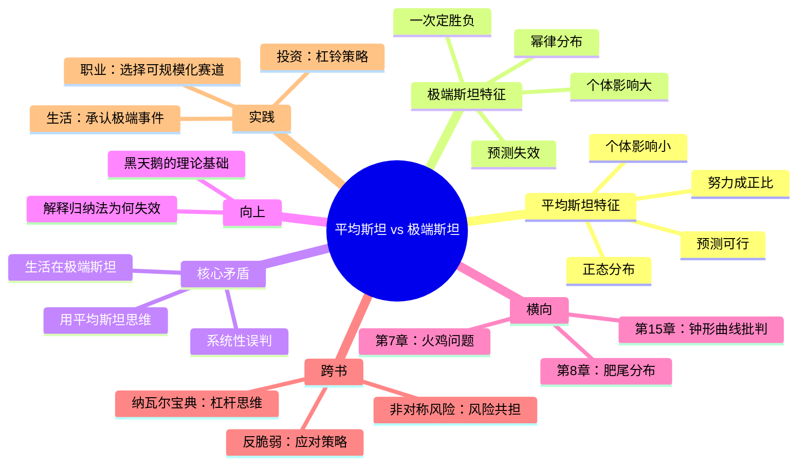

# 第6章 平均斯坦与极端斯坦

## 📍 章节定位

**全书位置**：本章是《黑天鹅》的理论基石，塔勒布用两个核心概念划分世界——平均斯坦（Mediocrestan）与极端斯坦（Extremistan）。

**章节序列**：第6章，第二部分"难以预测"的核心章节，承接前5章的"认知陷阱"，为后续的火鸡问题、肥尾效应奠定概念基础。

**一句话定位**：
> 世界分为两种：一种是个体影响微不足道的平均斯坦，一种是个体可以改变一切的极端斯坦——而我们就生活在极端斯坦里，却用平均斯坦的思维去理解它。

---

## 🎯 核心观点（三层提取）

### 观点1：平均斯坦——个体影响微不足道

| 层次 | 内容 |
|------|------|
| 📖 **表层（案例）** | 你随机找来1000个人，计算他们的平均身高。即使把全世界最高的人（比如2.7米）加进去，平均值也不会有太大变化。一个人的身高无法显著改变整体平均。类似的还有体重、智商、跑步速度。 |
| ⚙️ **中层（机制）** | 在平均斯坦里，个体对整体的影响是"可忽略的"。数据分布呈正态曲线（钟形曲线），极端值罕见且影响有限。大部分事件集中在平均值附近，两端的极端值被"稀释"了。 |
| 🔮 **底层（规律）** | 平均斯坦的本质是**个体独立性**和**规模稀释**——每个人的身高是独立的，不会因为别人高你就高；当样本量足够大时，极端个体的影响被摊薄。这是物理世界的常态。 |

**降维翻译**：
- **原文**：在平均斯坦，单个观察值不会对整体产生重大影响
- **降维**：在平均斯坦，一个人再厉害，也改变不了大局
- **类比**：就像一滴墨水滴进大海——墨水再多，海还是蓝的

**平均斯坦的典型场景**：
- 身高、体重、智商
- 考试成绩、跑步速度
- 餐厅的日常客流量
- 某一天的交通事故数量

---

### 观点2：极端斯坦——个体可以改变一切

| 层次 | 内容 |
|------|------|
| 📖 **表层（案例）** | 你随机找来1000个人，计算他们的平均财富。如果比尔·盖茨走进来，平均财富会瞬间翻几倍。一个人的存在，彻底扭曲了整体。类似的还有书籍销量（一本《哈利波特》抵得上千万本普通书）、社交媒体粉丝量、企业市值。 |
| ⚙️ **中层（机制）** | 在极端斯坦里，个体对整体的影响是"不成比例的"。数据分布呈幂律曲线（肥尾分布），极端值虽然罕见，但一旦出现，就能主导整体。平均值在这里失去了意义。 |
| 🔮 **底层（规律）** | 极端斯坦的本质是**可规模化性**和**赢家通吃**——某些东西可以无限复制（软件、内容、品牌），不需要额外成本；少数头部占据绝大部分资源，形成"马太效应"。这是现代社会的常态。 |

**降维翻译**：
- **原文**：在极端斯坦，单个观察值可以对整体产生不成比例的影响
- **降维**：在极端斯坦，一个人可以改变整个游戏规则
- **类比**：就像一只狼混进羊群——狼再少，羊的命运也由狼决定

**极端斯坦的典型场景**：
- 财富、收入分配
- 书籍销量、音乐播放量
- 社交媒体粉丝、视频播放量
- 企业市值、股票单日涨跌
- 战争伤亡、自然灾害损失

---

### 观点3：我们生活在极端斯坦，却用平均斯坦的思维

| 层次 | 内容 |
|------|------|
| 📖 **表层（案例）** | 银行用正态分布模型计算风险，结果2008年金融危机损失超出模型预测的"不可能值"。企业用历史平均值预测销量，一次爆款产品就让库存系统崩溃。专家说"房价不会跌"，因为过去20年都是涨的。 |
| ⚙️ **中层（机制）** | 我们的教育、管理、决策系统都建立在"平均"的概念上——KPI看平均值，绩效考核看平均绩效，风险评估看历史平均。但现代社会的关键变量（财富、影响力、技术突破）都是极端斯坦的。 |
| 🔮 **底层（规律）** | **用错模型的代价**：把极端斯坦当成平均斯坦，会导致系统性低估风险、高估稳定性。你以为"大概率安全"，其实只是"还没遇到极端值"。 |

**降维翻译**：
- **原文**：我们生活在极端斯坦，却用平均斯坦的思维模型
- **降维**：世界是狼窝，我们却在用养羊的方式生活
- **类比**：就像用日历预测地震——过去100天没地震，就以为第101天也不会有

**用错模型的后果**：

| 场景 | 平均斯坦思维 | 极端斯坦现实 | 后果 |
|------|-------------|-------------|------|
| 投资 | "分散投资降低风险" | 危机时所有资产相关性=1 | 分散失效，一起跌 |
| 职业 | "稳定工作最安全" | 一次裁员改变一生 | 中等风险最危险 |
| 预测 | "历史数据可以预测未来" | 黑天鹅改变游戏规则 | 预测彻底失效 |

---

### 观点4：从平均斯坦到极端斯坦——世界的结构性变化

| 层次 | 内容 |
|------|------|
| 📖 **表层（案例）** | 100年前，一个医生的病人数量有上限，收入有天花板。今天，一个网红的视频可以被亿万人观看，收入没有上限。100年前，一家企业服务一个城市。今天，一家科技公司服务全世界。 |
| ⚙️ **中层（机制）** | 技术进步让"可规模化"成为可能——互联网、软件、媒体让一个人可以同时服务无数人。全球化放大了"赢家通吃"效应——第一名吃肉，第二名喝汤，第三名饿死。 |
| 🔮 **底层（规律）** | **世界正在加速滑向极端斯坦**——信息技术让可规模化变得廉价，全球化让头部效应更加极端。你在哪个世界，决定你的命运曲线是"线性"还是"指数"。 |

**降维翻译**：
- **原文**：现代社会的结构性变化，使极端斯坦领域不断扩大
- **降维**：以前是"勤勤恳恳饿不死"，现在是"要么爆要么凉"
- **类比**：就像直播带货——以前开店服务一条街，现在开播服务全世界

**两个世界的命运曲线**：

```
收益
  ↑
  |              ← 极端斯坦（可规模化）
  |           ★
  |         ★
  |       ★
  |     ★
  |   ★
  | ★
  |★
  +--------------------→ 时间/努力
  |  ← 平均斯坦（不可规模化）
```

---

## 💬 金句库

### 原书金句
> "在平均斯坦，个体对整体的影响微不足道；在极端斯坦，个体可以不成比例地改变整体。"

> "我们生活在极端斯坦，却用平均斯坦的思维。"

> "在平均斯坦，时间和努力成正比；在极端斯坦，一次机会决定一切。"

> "把极端斯坦当成平均斯坦，是认知错误的根源。"

### 降维金句
> "在平均斯坦，一个人再厉害也改变不了大局；在极端斯坦，一个人可以改变整个游戏规则。"

> "世界是狼窝，我们却在用养羊的方式生活。"

> "在极端斯坦，平均值是骗人的——马云进来，你们公司人均财富过亿。"

> "在平均斯坦，勤勤恳恳饿不死；在极端斯坦，要么爆要么凉。"

## 🔗 当下映射

### 💰 财富应用

| 场景 | 平均斯坦思维 | 极端斯坦思维 | 行动建议 |
|------|-------------|-------------|----------|
| 职业选择 | 找稳定工作 | 找可规模化的赛道 | 区分"不可规模化"和"可规模化"的职业 |
| 投资策略 | 均衡配置，追求稳定收益 | 杠铃策略：90%安全+10%极端风险 | 避免"看起来安全"的中等风险 |
| 收入结构 | 单一工资收入 | 多元化+可规模化收入 | 发展可规模化的副业 |
| 理财观念 | 相信历史平均收益 | 承认黑天鹅存在 | 不把极端事件排除在模型之外 |

### 💼 职场应用

| 问题 | 平均斯坦答案 | 极端斯坦答案 |
|------|-------------|-------------|
| 努力和回报成正比吗？ | 是的，多劳多得 | 不一定，一次爆款胜过十年平庸 |
| 稳定工作安全吗？ | 安全 | 中等风险最危险，可能被一次裁员改变 |
| 该不该all in？ | 不应该，分散风险 | 杠铃策略：90%安全+10%豪赌 |
| 怎么选赛道？ | 选热门行业 | 选可规模化的领域（内容、软件、品牌） |

**判断你的职业在哪个世界**：

| 你的职业 | 世界类型 | 特征 |
|----------|---------|------|
| 医生、律师、会计 | 平均斯坦 | 时薪有上限，一天只能服务有限客户 |
| 作家、博主、开发者 | 极端斯坦 | 一次创作可被无限消费，黑天鹅可能降临 |
| 企业高管、销售 | 混合 | 基础收入是平均斯坦，奖金可能是极端斯坦 |
| 创业者、投资人 | 极端斯坦 | 收益无上限，损失有底线（有限责任） |

### 🏠 生活应用

| 场景 | 平均斯坦陷阱 | 极端斯坦认知 |
|------|-------------|-------------|
| 社交媒体 | 看别人的精彩生活觉得自己不行 | 这是极端斯坦——头部1%占据99%的关注 |
| 成功学 | 学习成功人士的经验 | 这是幸存者偏差——失败者不说话 |
| 人生规划 | 线性规划，一步步来 | 预留黑天鹅空间，保持可规模化选项 |
| 风险管理 | 相信"大概率安全" | 承认极端事件存在，做好最坏打算 |

### 72小时应用计划
1. **今天**：列出你的收入来源，判断每个来源属于平均斯坦还是极端斯坦
2. **明天**：思考你的职业是否有"可规模化"的可能性，如果没有，如何创造一个
3. **本周**：审视你的风险管理策略，是否在用平均斯坦思维应对极端斯坦世界

---

## 🕸️ 章节关联

### 向上：整书关联
- **核心问题**：本章回答"为什么我们总是误判世界"——因为我们用错了世界模型
- **论证位置**：是全书的理论基石，后续所有认知谬误、应对策略都基于此

### 横向：章节序列

| 章节编号 | 章节标题 | 关联类型 | 连接描述 |
|----------|----------|----------|----------|
| 第4章 | 一千零一天 | 前置 | 火鸡的故事展示归纳法的陷阱，本章解释为什么归纳法在极端斯坦失效 |
| 第7章 | 火鸡问题 | 深化 | 火鸡问题用具体案例展示极端斯坦的残酷 |
| 第8章 | 永不消失的肥尾 | 数学化 | 肥尾分布是极端斯坦的数学本质 |
| 第15章 | 钟形曲线的欺骗 | 批判 | 批判把极端斯坦强行塞进正态分布的错误 |

### 跨书关联

| 书籍 | 概念 | 关系 | 备注 |
|------|------|------|------|
| [[反脆弱-塔勒布-拆解记录]] | 反脆弱 | 延伸 | 知道自己在极端斯坦，才能构建反脆弱系统 |
| [[非对称风险-塔勒布-拆解记录]] | 风险共担 | 补充 | 极端斯坦里，谁承担风险谁有决策权 |
| [[思考快与慢-丹尼尔·卡尼曼-拆解记录]] | 可得性启发 | 解释 | 我们用"看得到"的平均斯坦，理解"看不到"的极端斯坦 |
| [[纳瓦尔宝典-乔根森-拆解记录]] | 杠杆 | 呼应 | 纳瓦尔的"杠杆"就是极端斯坦的"可规模化" |

### 关联可视化



---

## ❓ 问答设计

### Q1: 什么是平均斯坦？有什么特征？（记忆型）
**认知层次**: 记忆
**难度**: 低
**答案要点**:
- 平均斯坦是个体对整体影响微不足道的世界
- 数据分布呈正态曲线（钟形曲线）
- 典型例子：身高、体重、考试成绩
- 特征：预测可行、努力与回报成正比

### Q2: 什么是极端斯坦？有什么特征？（记忆型）
**认知层次**: 记忆
**难度**: 低
**答案要点**:
- 极端斯坦是个体可以不成比例改变整体的世界
- 数据分布呈幂律曲线（肥尾分布）
- 典型例子：财富、书籍销量、社交媒体粉丝
- 特征：预测几乎不可能、一次机会决定一切

### Q3: 为什么说"我们生活在极端斯坦，却用平均斯坦的思维"？（理解型）
**认知层次**: 理解
**难度**: 中
**答案要点**:
- 现代社会的关键变量（财富、影响力、技术突破）都是极端斯坦的
- 但我们的教育、管理、决策系统都建立在"平均"的概念上
- 用错模型会导致系统性低估风险、高估稳定性

### Q4: 举三个平均斯坦的例子和三个极端斯坦的例子（应用型）
**认知层次**: 应用
**难度**: 中
**答案要点**:
- 平均斯坦：身高、体重、一天餐饮次数、考试分数
- 极端斯坦：财富、书籍销量、企业市值、战争伤亡人数

### Q5: 为什么在极端斯坦，平均值会失去意义？（分析型）
**认知层次**: 分析
**难度**: 中
**答案要点**:
- 在极端斯坦，极端值虽然罕见但可以主导整体
- 一个比尔·盖茨可以改变一城人的平均财富
- 平均值被极端值扭曲，不再代表"典型情况"

### Q6: 判断你的职业属于平均斯坦还是极端斯坦的标准是什么？（应用型）
**认知层次**: 应用
**难度**: 中
**答案要点**:
- 关键问题：你的产出能否被无限复制/消费？
- 不可规模化（平均斯坦）：一对一服务，时薪有上限（医生、律师）
- 可规模化（极端斯坦）：一次生产，无限消费（作家、开发者、网红）

### Q7: 为什么塔勒布说"中等风险最危险"？（分析型）
**认知层次**: 分析
**难度**: 高
**答案要点**:
- "中等风险"本质是"未知风险"——你以为安全，其实不知道风险在哪
- 极度安全：风险已知，不会破产
- 极度风险：风险已知，愿赌服输
- 中等风险：用平均斯坦思维应对极端斯坦，最危险

### Q8: 如何用"平均斯坦vs极端斯坦"的框架选择职业赛道？（综合型）
**认知层次**: 综合
**难度**: 高
**答案要点**:
- 识别你的职业在哪个世界
- 平均斯坦职业：稳定但有限，适合风险厌恶者
- 极端斯坦职业：波动但无限，适合愿意承担波动的人
- 策略：主业在平均斯坦保底，副业在极端斯坦博黑天鹅
- 杠铃策略：90%的稳定+10%的极端尝试

### Q9: 2008年金融危机和"平均斯坦vs极端斯坦"有什么关系？（分析型）
**认知层次**: 分析
**难度**: 高
**答案要点**:
- 银行用正态分布模型计算风险（平均斯坦思维）
- 但金融风险是极端斯坦的——一次极端事件可以摧毁整个系统
- 模型说"百年一遇"，实际上极端事件比模型预测的频繁得多
- 这是用错模型的典型悲剧

### Q10: 理解"平均斯坦vs极端斯坦"对普通人有什么实际价值？（综合型）
**认知层次**: 综合
**难度**: 中
**答案要点**:
- 识别自己所在的"世界"，选择合适的策略
- 在平均斯坦：努力与回报成正比，线性规划可行
- 在极端斯坦：预留黑天鹅空间，保持可规模化选项
- 核心价值：减少"努力无效"的焦虑——不是你不够努力，是世界运行规则不同

---
