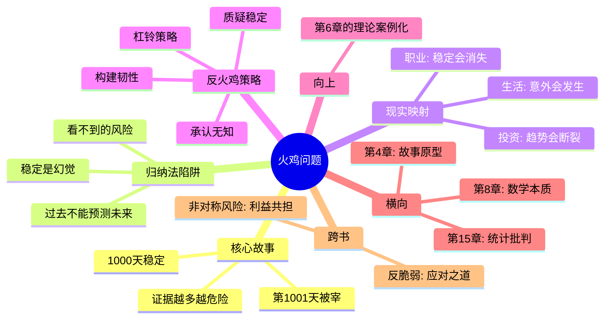

# 第7章 火鸡问题

## 📍 章节定位

**全书位置**：本章是《黑天鹅》中最具冲击力的思想实验，塔勒布用"火鸡"的故事揭示归纳法的致命缺陷。

**章节序列**：第7章，第二部分"难以预测"的核心章节，承接第6章的"两个世界"理论，用火鸡寓言让抽象概念变得血肉丰满。

**一句话定位**：
> 一只火鸡每天被喂食，连续1000天都过得越来越好，第1001天被宰了——归纳法的悲剧在于，它用过去预测未来，却不知道未来可能完全不同。

---

## 🎯 核心观点（三层提取）

### 观点1：火鸡悖论——稳定是最大的幻觉

| 层次 | 内容 |
|------|------|
| 📖 **表层（案例）** | 一只火鸡从出生开始，每天被农场主喂食。第1天得到食物，第2天得到食物，第100天还是得到食物。火鸡通过1000天的观察得出结论："农场主爱我，生活越来越好了。"第1001天是感恩节，火鸡被宰了。 |
| ⚙️ **中层（机制）** | 火鸡的观察样本每天都在增加，信心也每天都在增强。每一天的"正常"都让它更相信"明天也会正常"。但关键信息——感恩节的存在——从未出现在它的样本里。信息的缺失不是随机的，而是系统性的。 |
| 🔮 **底层（规律）** | **归纳法的结构性盲区**：你只能看到发生的事，看不到没发生的事。当关键信息在"未发生"的领域时，再多数据也预测不了未来。稳定本身就是陷阱——越稳定，越危险。 |

**降维翻译**：
- **原文**：火鸡每天都在收集"安全"的证据，但它收集的证据越多，离死亡越近
- **降维**：你以为日子越过越好，其实只是在为收割做准备
- **类比**：就像温水煮青蛙——水越暖，青蛙越舒服，但死亡正在逼近

**火鸡的时间线**：

| 天数 | 火鸡的观察 | 火鸡的信心 | 客观现实 |
|------|-----------|-----------|----------|
| 第1天 | 得到食物 | "今天有吃的" | 被喂养中 |
| 第100天 | 得到食物 | "每天都这样" | 被喂养中 |
| 第500天 | 得到食物 | "生活越来越稳定" | 被喂养中 |
| 第1000天 | 得到食物 | "几乎可以确定，明天也有" | 明天是感恩节 |
| 第1001天 | 被宰杀 | —— | 证据越多，死得越快 |

---

### 观点2：归纳法的陷阱——过去不能预测未来

| 层次 | 内容 |
|------|------|
| 📖 **表层（案例）** | 某只股票连续10年上涨，分析师说"趋势很稳"。某家公司连续20年盈利，投资者说"这是蓝筹"。某国房价连续30年上涨，专家说"房价永远不会跌"。然后，崩盘了。 |
| ⚙️ **中层（机制）** | 归纳法的逻辑是：因为过去N次都这样，所以第N+1次也会这样。问题在于，这个推理隐含一个假设——未来和过去遵循相同的规律。但黑天鹅恰恰是改变规律的事件。 |
| 🔮 **底层（规律）** | **归纳法的结构性失效**：在极端斯坦，过去的数据不仅不能预测未来，反而会误导你。你看到的"规律"可能只是"还没遇到黑天鹅"。样本量越大，你越自信，但你的自信和真实的危险毫无关系。 |

**降维翻译**：
- **原文**：归纳法假设未来是过去的延续，但黑天鹅恰恰打破了延续性
- **降维**：过去1000天都正常，不代表第1001天不翻天
- **类比**：就像赌场里的赌徒——连续赢10把，不代表第11把不会输光

**归纳法失效的场景**：

| 场景 | 归纳法预测 | 实际结果 |
|------|-----------|----------|
| 股市 | 过去10年上涨，继续持有 | 一次崩盘归零 |
| 房价 | 30年只涨不跌 | 泡沫破裂 |
| 职业 | 20年稳定工作 | 一次裁员失业 |
| 企业 | 连续增长10年 | 被颠覆性技术淘汰 |

---

### 观点3：无声的风险——看不见的才是致命的

| 层次 | 内容 |
|------|------|
| 📖 **表层（案例）** | 火鸡的风险不是"明天可能没食物"，而是"明天可能被宰"。后者从未出现在它的经验里。银行的风险模型只计算"看得到的风险"，却忽略了系统性崩盘。 |
| ⚙️ **中层（机制）** | 我们的风险评估基于"发生过什么"，而不是"可能发生什么"。但真正的危险往往在经验之外。你不知道你不知道的事，才是最危险的。 |
| 🔮 **底层（规律）** | **风险的不可见性**：在极端斯坦，最大的风险不是波动，而是结构性断裂。波动是可观察的，断裂是不可预测的。你看不到的风险，才是致命的风险。 |

**降维翻译**：
- **原文**：真正的风险不在历史数据里，而在未知领域
- **降维**：你以为的安全，可能只是还没遇到危险
- **类比**：就像走在薄冰上——每一步都稳，直到最后一步

**可见风险 vs 不可见风险**：

| 类型 | 特征 | 应对方式 |
|------|------|----------|
| 可见风险 | 波动、震荡、小幅回撤 | 风险管理、对冲 |
| 不可见风险 | 结构性断裂、系统性崩盘 | 承认无知、预留冗余 |

---

### 观点4：反火鸡思维——如何不被宰

| 层次 | 内容 |
|------|------|
| 📖 **表层（案例）** | 塔勒布提出"反脆弱"的概念——不是避免风险，而是从风险中获益。杠铃策略：90%极度安全+10%极度冒险。不为"稳定"付出代价，而是拥抱波动。 |
| ⚙️ **中层（机制）** | 火鸡的思维是"相信稳定"，反火鸡的思维是"质疑稳定"。当所有人都觉得安全时，你要问"谁在喂我？"、"为什么对我这么好？"。稳定的背后，往往隐藏着更大的力量。 |
| 🔮 **底层（规律）** | **生存第一原则**：在极端斯坦，活下来比预测对更重要。不要试图预测黑天鹅，而是构建能在黑天鹅中生存的系统。承认无知，保持谦卑，预留空间。 |

**降维翻译**：
- **原文**：不要试图预测黑天鹅，而是让自己在黑天鹅中生存
- **降维**：别问"明天会怎样"，要问"如果明天翻天，我还能活吗"
- **类比**：就像买保险——不是预测灾难，而是灾难来了不会死

**火鸡思维 vs 反火鸡思维**：

| 维度 | 火鸡思维 | 反火鸡思维 |
|------|----------|-----------|
| 对稳定的态度 | 相信稳定，享受稳定 | 质疑稳定，警惕稳定 |
| 风险认知 | 只看得到的风险 | 承认看不到的风险 |
| 策略 | 依赖预测 | 不依赖预测，构建韧性 |
| 面对黑天鹅 | 被动承受 | 从中获益或至少不死 |

---

## 💬 金句库

### 原书金句
> "火鸡问题揭示了一个残酷的真相：你看到的证据越多，可能离灾难越近。"

> "归纳法的悲剧在于，它用过去预测未来，却不知道未来可能完全不同。"

> "稳定不是安全，稳定是陷阱。"

> "真正的风险不在历史数据里，而在你从未想象过的地方。"

### 降维金句
> "火鸡活了1000天，每一天都让它更相信自己是安全的——直到第1001天。"

> "你以为日子越过越好，其实只是在为收割做准备。"

> "过去的1000天证明不了什么，证明的只是你还没遇到第1001天。"

> "稳定本身就是危险信号——越稳定，越要问'为什么'。"

## 🔗 当下映射

### 💰 财富应用

| 场景 | 火鸡陷阱 | 反火鸡策略 |
|------|----------|-----------|
| 理财产品 | 相信"历史业绩不代表未来"是套话 | 这句话是真的——分散投资，不押注单一产品 |
| 股票投资 | 看K线图，相信趋势会延续 | 承认趋势随时可能断裂，设置止损 |
| 房产投资 | "房价30年只涨不跌" | 任何资产都可能崩盘，不all in |
| 养老规划 | 相信社保养老金 | 社保可能改革，多元储备 |

**火鸡检测清单**：
1. 我的投资收益是否依赖"趋势延续"？
2. 如果明天发生系统性崩盘，我还能活吗？
3. 我的"稳定收入"背后，是谁在"喂养"我？
4. 我是否在用过去的成功预测未来？

### 💼 职场应用

| 场景 | 火鸡陷阱 | 反火鸡策略 |
|------|----------|-----------|
| 稳定工作 | 相信"大厂不会裁员" | 大厂会裁员，持续提升可迁移能力 |
| 职业规划 | 线性晋升路径 | 预留跳槽/创业的可能性 |
| 技能投资 | 只学当前岗位需要的技能 | 学习可迁移、可规模化的技能 |
| 行业选择 | 追逐"风口" | 风口会消失，选择有长期价值的领域 |

**职业火鸡风险检测**：
- 你的收入是否完全依赖单一雇主？
- 你的技能是否只在当前公司有价值？
- 你是否相信"努力工作就能一直待下去"？
- 你是否从未考虑过"公司可能倒闭"？

### 🏠 生活应用

| 场景 | 火鸡陷阱 | 反火鸡策略 |
|------|----------|-----------|
| 健康管理 | "一直没病，应该没事" | 定期体检，预防大于治疗 |
| 人际关系 | "关系一直很好" | 关系可能突变，保持独立 |
| 信息获取 | 只看算法推荐的内容 | 主动寻找不同观点 |
| 消费习惯 | "工资够花就行" | 预留应急资金，至少6个月生活费 |

### 72小时应用计划
1. **今天**：检查你的收入来源，是否有"火鸡依赖"（单一来源、依赖趋势延续）
2. **明天**：问自己"如果明天失业/崩盘/被裁员，我能活多久"，制定B计划
3. **本周**：建立"反火鸡"储备——应急资金、可迁移技能、多元人脉

---

## 🕸️ 章节关联

### 向上：整书关联
- **核心问题**：本章回答"为什么我们总是被意外击倒"——因为我们用归纳法理解世界，但归纳法在极端斯坦失效
- **论证位置**：是第6章"两个世界"的具体案例化，让抽象概念变得可感知

### 横向：章节序列

| 章节编号 | 章节标题 | 关联类型 | 连接描述 |
|----------|----------|----------|----------|
| 第4章 | 一千零一天 | 前置 | 火鸡故事的完整版，展示归纳法的诱惑 |
| 第6章 | 平均斯坦与极端斯坦 | 理论基础 | 解释火鸡为什么在极端斯坦必然失败 |
| 第8章 | 永不消失的肥尾 | 数学深化 | 肥尾分布解释为什么极端事件比想象中常见 |
| 第15章 | 钟形曲线的欺骗 | 批判 | 批判用正态分布评估风险的火鸡行为 |

### 跨书关联

| 书籍 | 概念 | 关系 | 备注 |
|------|------|------|------|
| [[反脆弱-塔勒布-拆解记录]] | 反脆弱 | 延伸 | 如何从火鸡变成反脆弱者 |
| [[非对称风险-塔勒布-拆解记录]] | 利益共担 | 解释 | 火鸡的问题在于不承担风险却享受收益 |
| [[思考快与慢-丹尼尔·卡尼曼-拆解记录]] | 可得性启发 | 解释 | 我们只相信"看到"的，忽略"没看到"的 |
| [[随机漫步的傻瓜-塔勒布-拆解记录]] | 幸存者偏差 | 呼应 | 火鸡只看到活着的火鸡，看不到被宰的 |

### 关联可视化

---

## ❓ 问答设计

### Q1: 什么是火鸡问题？（记忆型）
**认知层次**: 记忆
**难度**: 低
**答案要点**:
- 火鸡每天被喂食，连续1000天都过得越来越好
- 火鸡通过归纳法得出"生活越来越好"的结论
- 第1001天是感恩节，火鸡被宰了
- 揭示归纳法在极端斯坦的失效

### Q2: 为什么火鸡的信心越强，离死亡越近？（理解型）
**认知层次**: 理解
**难度**: 中
**答案要点**:
- 火鸡的信心来自"过去1000天都这样"
- 但关键信息（感恩节）从未出现在样本里
- 样本量越大，火鸡越相信归纳法
- 归纳法的盲区是"看不到的信息"，不是样本问题

### Q3: 归纳法为什么在极端斯坦失效？（分析型）
**认知层次**: 分析
**难度**: 中
**答案要点**:
- 归纳法假设未来是过去的延续
- 但黑天鹅恰恰是打破延续性的事件
- 过去的数据只告诉你"没发生什么"，不能告诉你"会发生什么"
- 在极端斯坦，一次极端事件可以抵消所有"正常"的观察

### Q4: 举三个现实中的"火鸡"例子（应用型）
**认知层次**: 应用
**难度**: 中
**答案要点**:
- 股市：连续10年上涨，一次崩盘归零
- 职业：20年稳定工作，一次裁员失业
- 房价：30年只涨不跌，泡沫破裂
- 企业：连续增长，被颠覆性技术淘汰

### Q5: "稳定是陷阱"是什么意思？（理解型）
**认知层次**: 理解
**难度**: 中
**答案要点**:
- 稳定让人放松警惕，相信"会一直这样"
- 但稳定往往是"被喂养"的假象
- 稳定的时间越长，积累的风险可能越大
- 真正的危险在稳定背后，不在稳定表面

### Q6: 如何判断自己是否在"火鸡状态"？（应用型）
**认知层次**: 应用
**难度**: 中
**答案要点**:
- 检查：我的"好日子"是否依赖某个外部力量的持续"喂养"？
- 检查：如果这个力量消失/改变，我能活吗？
- 检查：我是否从未考虑过"最坏情况"？
- 检查：我的信心是来自"过去一直这样"吗？

### Q7: 什么是"反火鸡思维"？（分析型）
**认知层次**: 分析
**难度**: 中
**答案要点**:
- 质疑稳定，而不是享受稳定
- 承认看不到的风险，而不是假装不存在
- 不依赖预测，而是构建韧性
- 在黑天鹅中生存或获益，而不是被动承受

### Q8: 杠铃策略如何帮助避免火鸡命运？（综合型）
**认知层次**: 综合
**难度**: 高
**答案要点**:
- 杠铃策略：90%极度安全+10%极度冒险
- 不押注"中等风险"——那是火鸡的领域
- 90%的安全确保黑天鹅来了不会死
- 10%的冒险让自己有机会从波动中获益
- 核心逻辑：承认预测不可能，但可以控制损失

### Q9: 火鸡问题和第6章"两个世界"有什么关系？（综合型）
**认知层次**: 综合
**难度**: 高
**答案要点**:
- 第6章提出理论框架：平均斯坦vs极端斯坦
- 第7章用火鸡故事展示：在极端斯坦用归纳法会发生什么
- 火鸡的悲剧不是运气不好，而是用错了世界模型
- 火鸡用平均斯坦的思维（归纳法），应对极端斯坦的现实

### Q10: 理解火鸡问题对普通人有什么实际价值？（综合型）
**认知层次**: 综合
**难度**: 中
**答案要点**:
- 警惕"稳定"：稳定可能是陷阱，不是安全
- 承认无知：过去的数据不能预测未来
- 构建韧性：不要押注预测，要确保黑天鹅来了能活
- 核心价值：不是让你焦虑，而是让你清醒——好日子可能随时结束

---
