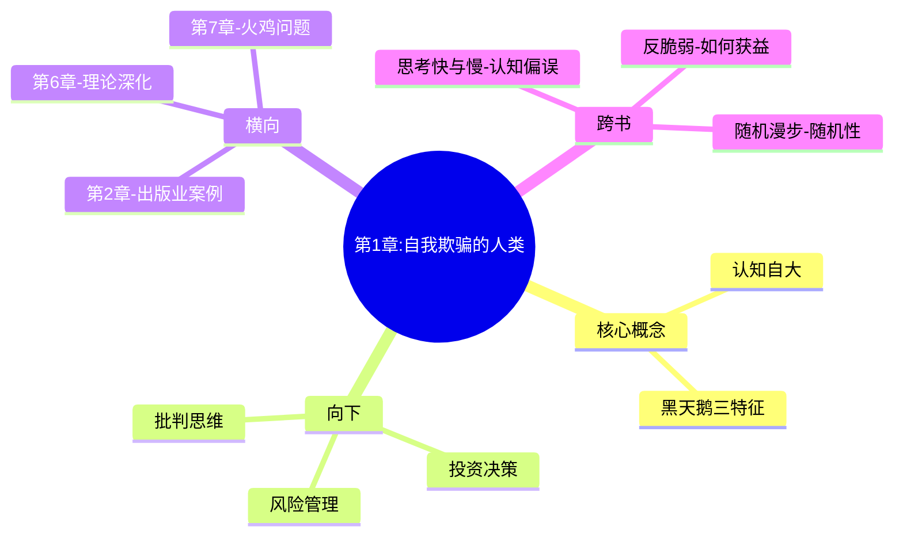

---

category:
  - Resources/书籍拆解/读书笔记

status: draft
chapter: 
number: 1
title: 自我欺骗的人类
links:

  - "[[第2章-出版业的黑天鹅]]"
  - "[[第6章-平均斯坦与极端斯坦]]"
created: 2026-02-26
tags:
  - 黑天鹅
  - 认知偏差
  - 预测谬误
  - 塔勒布
---

# 第1章 自我欺骗的人类

## 📍 章节定位

### 全书位置
> 本章是全书开篇，通过"我与黑天鹅的故事"引出核心问题：我们为什么总是误以为能够预测不可预测的事？

- **全书核心问题**：我们为什么总是无法预测极端事件？如何在不可预测的世界中生存？
- **本章回答的问题**：人类为什么自我欺骗？认知自大如何导致我们忽视黑天鹅？
- **角色类型**：开篇定位型 - 建立全书的问题意识和核心隐喻
- **论证位置**：论证的起点，定义问题框架

### 章节序列
| 方向 | 章节标题 | 逻辑连接 |
|------|----------|----------|
| 前章 | 无（开篇） | - |
| 后章 | [[第2章-出版业的黑天鹅]] | 本章引入"黑天鹅"概念，第2章用出版业案例具体演示 |

### 一句话定位
> 第1章是全书开篇定位，通过作者个人经历引出"黑天鹅"隐喻，回答"为什么人类总是自我欺骗、误以为能预测未来"这一核心问题。

---

## 🎯 核心观点

### 观点一：认知自大是人类的本能

**【表层】现象层**：
- 人类倾向于高估自己的知识和预测能力
- 专家和普通人一样犯预测错误
- 911事件、互联网泡沫等极端事件在事前都被认为"不可能"

**【中层】机制层**：
```
认知自大的机制：
- 确认偏误：我们寻找支持自己观点的证据
- 事后诸葛亮：事后认为事件"可预测"
- 叙述谬误：编造合理的故事解释随机事件
- 乐观偏误：低估负面事件发生概率
```

**【底层】规律层**：
> **塔勒布第一定律**：人类大脑天生是一款"意义生成器"，即使面对随机事件，也会试图寻找模式和原因。

---

### 观点二：极端事件不可预测但可做准备

**【表层】现象层**：
- 911事件、汶川地震、2020年疫情等黑天鹅事件
- 这些事件在发生前都被认为"不可能"或"极不可能"
- 但它们确实发生了，而且产生了巨大影响

**【中层】机制层**：
```
黑天鹅事件的三重特征：
1. 意外性：超出正常预期范围
2. 极端影响：一旦发生，影响巨大
3. 事后可解释：发生后才找到"原因"
```

**【底层】规律层**：
> **黑天鹅原理**：不可预测性是世界的内在属性，接受这一事实是智慧的开始。

---

### 观点三：历史由黑天鹅推动

**【表层】现象层**：
- 互联网的诞生、9/11事件、苏联解体
- 这些事件都不是事前规划的结果
- 但它们彻底改变了历史进程

**【中层】机制层**：
```
历史进程的推动力：
- 非线性：不是渐进积累，而是突变
- 不对称：少数事件产生大多数影响
- 不可预测：事前无法预见，事后可以理解
```

**【底层】规律层**：
> **历史悖论**：历史看似有规律，但我们用它来预测未来时却常常失败。

---

## 💬 降维翻译

### 观点一：认知自大

#### 原文表达
> "我们总是倾向于认为我们比实际知道的更多。这种认知自大影响了我们每一个人——从医生到投资者，从政府官员到普通市民。"
> —— p.XX

#### 降维翻译（中学生能懂）
我们总是觉得自己很厉害，知道很多事情。其实我们知道的比想象的少得多。就像你考试觉得自己考得很好，结果成绩出来才发现很多不会。这是一种本能的错觉。

#### 日常类比（奶奶能懂）
就像我年轻时候觉得自己什么都能干，现在老了才知道当年很多事是碰巧成的。不是我们真的厉害，是我们以为自己厉害。

---

### 观点二：黑天鹅事件

#### 原文表达
> "黑天鹅事件具有三个特征：稀有性、极大的冲击力和事后（而非事前）的可预测性。"

#### 降维翻译（中学生能懂）
黑天鹅就是那种"没想到会发生"的事。发生之前没人觉得会发生，发生后大家才说"早知道"。但实际上，事前真的没法预测。

#### 日常类比（奶奶能懂）
就像村里谁也没想到会发生疫情，谁也没想到会封城。这事儿发生之前说不可能，结果全国都停摆了。这叫黑天鹅。

---

## ✨ 金句库

### 原书金句
| 金句 | 适用场景 |
|------|----------|
| "黑天鹅事件具有三个特征：稀有性、极大的冲击力和事后可预测性。" | 定义黑天鹅 |
| "我们总是倾向于认为我们比实际知道的更多。" | 认知自大 |
| "历史和现代社会的发展进程是由极端事件驱动的，而非平均事件。" | 历史观 |

### 降维金句
| 金句 | 适用场景 |
|------|----------|
| "你以为自己知道的，比你实际知道的多。" | 认知自大 |
| "黑天鹅就是那个'不可能'，但它发生了。" | 解释黑天鹅 |
| "事前猪都不信，事后马后炮。" | 预测谬误 |
| "极端事件才是历史的主角。" | 历史观 |
| "世界是不可预测的，接受这个事实是智慧的开始。" | 世界观 |
| "我们的大脑是一部'事后解释机器'。" | 认知机制 |
| "越专家越自信，越自信越出错。" | 专家预测 |
| "偶然的成功比必然的失败更危险。" | 投资/生活 |
| "看不见的风险不等于没有风险。" | 风险管理 |
| "最危险的是那些我们认为自己知道的风险。" | 风险认知 |

---

## 🔗 当下映射

### 💰 财富应用
| 场景 | 具体行动 | 预期效果 |
|------|----------|----------|
| 投资决策 | 不把所有资金押在"看似确定"的机会上 | 避免黑天鹅爆仓 |
| 理财规划 | 预留应急资金，对冲极端风险 | 增强财务韧性 |
| 职业选择 | 培养多元化技能，不依赖单一收入 | 应对行业突变 |

### 💼 职场应用
| 场景 | 具体行动 | 所需能力 |
|------|----------|----------|
| 职业规划 | 不把所有希望寄托在"稳定"行业 | 危机意识 |
| 团队管理 | 制定应急预案，不盲目乐观 | 风险思维 |
| 项目评估 | 考虑"最坏情况"，不做盲目承诺 | 批判思维 |

### 🏠 生活应用
| 场景 | 具体行动 | 可行性 |
|------|----------|--------|
| 健康管理 | 定期体检，不忽视身体信号 | 高 |
| 家庭安全 | 储备必要物资，了解应急措施 | 高 |
| 人生决策 | 接受不确定性，不过度规划 | 中 |

### 72小时行动计划
1. **今天**：列出生活中3个你曾经"以为不可能"但发生了的事情
2. **本周内**：检查你的投资/理财是否有黑天鹅保护
3. **准备**：了解你所在城市的应急响应机制

---

## 🕸️ 章节关联

### 向上关联 → 整书
- **贡献**：本章建立"黑天鹅"概念和全书问题框架
- **位置**：论证起点，定义"不可预测性"这个核心命题

### 横向关联 → 章节间
| 章节编号 | 章节标题 | 关联类型 | 连接描述 |
|----------|----------|----------|----------|
| 第2章 | 出版业的黑天鹅 | 案例演示 | 本章概念+具体案例 |
| 第6章 | 平均斯坦与极端斯坦 | 理论深化 | 认知自大→两个斯坦 |
| 第7章 | 火鸡问题 | 机制深化 | 认知自大的具体表现 |

### 向下关联 → 具体应用
| 应用场景 | 难度 | 前置知识 |
|----------|------|----------|
| 投资决策 | 中 | 基础金融知识 |
| 风险管理 | 中 | 无 |
| 批判思维 | 低 | 无 |

### 跨书关联 → 知识网络
| 书籍 | 概念 | 关系 | 备注 |
|------|------|------|------|
| [[反脆弱-塔勒布]] | 反脆弱 | 延伸 | 如何在黑天鹅中获益 |
| [[思考快与慢-丹尼尔·卡尼曼]] | 认知偏误 | 支持 | 系统1/系统2解释认知自大 |
| [[随机漫步的傻瓜-塔勒布]] | 随机性 | 继承 | 黑天鹅的前置知识 |

### 关联可视化


---

## ❓ 问答设计

### Q1: 什么是黑天鹅事件？
**认知层次**: 记忆
**难度**: 低
**答案要点**:
- 具有三个特征：稀有性、极大冲击力、事后可预测性
- 事前无法预测，但发生后可以被解释

### Q2: 为什么人类倾向于高估自己的知识？
**认知层次**: 理解
**难度**: 中
**答案要点**:
- 认知自大是人类的本能
- 大脑倾向于寻找模式和意义
- 确认偏误和事后诸葛亮效应

### Q3: 911事件是黑天鹅吗？为什么？
**认知层次**: 应用
**难度**: 中
**答案要点**:
- 是典型的黑天鹅事件
- 事前被认为不可能，事后产生巨大影响
- 符合黑天鹅三特征

### Q4: 认知自大如何影响我们的决策？
**认知层次**: 分析
**难度**: 中
**答案要点**:
- 导致过度自信，做出超出能力的承诺
- 忽视尾部风险，低估极端事件概率
- 相信专家预测，放弃独立判断

### Q5: 为什么说"历史由黑天鹅推动"？
**认知层次**: 分析
**难度**: 中
**答案要点**:
- 大多数历史事件是随机的
- 少数极端事件产生了大多数影响
- 渐进变化不产生历史性转折

### Q6: 如何应对认知自大？
**认知层次**: 应用
**难度**: 中
**答案要点**:
- 承认自己的无知
- 多角度思考问题
- 制定应急预案

### Q7: 什么是"叙述谬误"？
**认知层次**: 理解
**难度**: 中
**答案要点**:
- 人类倾向于编造合理的故事解释随机事件
- 事后解释让事件看起来"必然"
- 这种解释往往是不准确的

### Q8: 专家预测为什么经常出错？
**认知层次**: 分析
**难度**: 高
**答案要点**:
- 专家也受认知自大影响
- 专家倾向于在媒体面前显得自信
- 极端事件超出历史数据的预测范围

### Q9: 为什么说"看不见的风险不等于没有风险"？
**认知层次**: 理解
**难度**: 中
**答案要点**:
- 我们无法看到所有风险
- 风险可能超出我们的认知范围
- 忽略风险不等于风险不存在

### Q10: 塔勒布在本书中的核心观点是什么？
**认知层次**: 理解
**难度**: 中
**答案要点**:
- 世界本质上是不可预测的
- 极端事件比常态事件更重要
- 我们需要学会在不确定性中生存

### Q11: 为什么说"事前猪都不信，事后马后炮"？
**认知层次**: 理解
**难度**: 中
**答案要点**:
- 事前极端事件概率极低
- 事后我们总能找出"原因"
- 这是一种认知偏差

### Q12: 如何在生活中识别认知自大？
**认知层次**: 应用
**难度**: 中
**答案要点**:
- 检查自己是否过于自信
- 反思过去的预测记录
- 寻求他人的不同意见

### Q13: 什么是"极端斯坦"与"平均斯坦"的区别？
**认知层次**: 理解
**难度**: 中
**答案要点**:
- 平均斯坦：个体影响小，平均值稳定
- 极端斯坦：个体影响大，可能主导整体
- 金融、社会等领域属于极端斯坦

### Q14: 为什么不能仅凭历史数据预测未来？
**认知层次**: 分析
**难度**: 高
**答案要点**:
- 历史数据无法覆盖所有可能性
- 黑天鹅事件是历史的例外
- 未来可能与过去完全不同

### Q15: 个人如何在黑天鹅世界中生存？
**认知层次**: 创造
**难度**: 高
**答案要点**:
- 接受不确定性
- 保持财务韧性
- 培养反脆弱能力
- 避免过度押注

---
