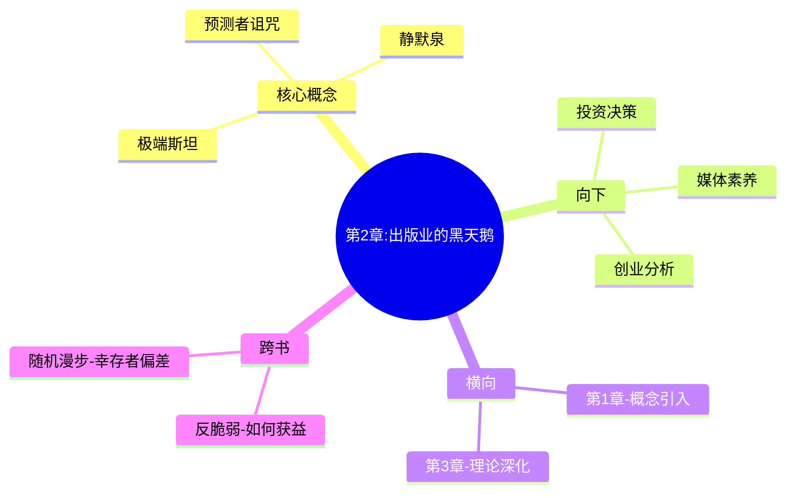

---

category:
  - Resources/书籍拆解/读书笔记

status: draft
chapter: 
number: 2
title: 出版业的黑天鹅
links:

  - "[[第1章-自我欺骗的人类]]"
  - "[[第3章-历史和三重迷雾]]"
created: 2026-02-26
tags:
  - 黑天鹅
  - 出版业
  - 意外成功
  - 塔勒布
description: "本章通过出版业的案例具体演示\"黑天鹅\"如何运作——意外成功如何改变一个行业的命运。"
---

# 第2章 出版业的黑天鹅

## 📍 章节定位

### 全书位置
> 本章通过出版业的案例具体演示"黑天鹅"如何运作——意外成功如何改变一个行业的命运。

- **全书核心问题**：我们为什么总是无法预测极端事件？
- **本章回答的问题**：为什么出版业（和其他行业）的成功无法预测？什么是"静默泉"？
- **角色类型**：案例演示型 - 用具体行业案例演示黑天鹅机制

### 章节序列
| 方向 | 章节标题 | 逻辑连接 |
|------|----------|----------|
| 前章 | [[第1章-自我欺骗的人类]] | 概念引入：什么是黑天鹅 |
| 后章 | [[第3章-历史和三重迷雾]] | 理论深化：历史解读的谬误 |

### 一句话定位
> 第2章是案例演示型章节，通过出版业具体案例演示黑天鹅机制，回答"为什么意外成功无法预测"这一核心问题。

---

## 🎯 核心观点

### 观点一：出版业是典型的极端斯坦

**【表层】现象层**：
- 一本书的成功几乎完全无法预测
- 少数畅销书贡献了大部分利润
- 编辑推荐和读者选择之间几乎没有关联

**【中层】机制层**：
```
出版业的黑天鹅机制：
- 非线性：极少数书决定整个行业命运
- 不可预测：编辑无法预测哪本书会火
- 社交网络效应：口碑传播的偶然性
```

**【底层】规律层**：
> **出版业法则**：在极端斯坦，没有"代表性"样本可以预测未来。

---

### 观点二：被忽视的"静默泉"

**【表层】现象层**：
- 成功者只是少数
- 大多数书籍"静默"地存在，无人问津
- 沉默的失败者不为人知

**【中层】机制层**：
```
静默泉机制：
- 成功案例被过度报道
- 失败案例被系统性地忽略
- 幸存者偏差导致错误认知
```

**【底层】规律层**：
> **沉默证据原理**：我们只看到成功者，看不到失败者，这导致对概率的严重误判。

---

### 观点三：预测者vs观察者

**【表层】现象层**：
- 预测者犯错但不承担后果
- 观察者正确但无法影响决策
- 媒体喜欢自信的预测者

**【中层】机制层**：
```
预测者-观察者不对称：
- 预测者有选择性地发布预测
- 成功归因自己，失败归因外部
- 媒体奖励自信，惩罚诚实
```

**【底层】规律层**：
> **预测者诅咒**：预测越自信的人越容易出错，但社会却奖励这种自信。

---

## 💬 降维翻译

### 观点一：出版业的黑天鹅

#### 原文表达
> "出版业是一个极端斯坦的行业，极少数书籍创造了大部分收入，而大多数书籍几乎无人问津。"

#### 降维翻译（中学生能懂）
出版业就是那种"一本书赚大钱，其他书亏本"的行业。十个编辑觉得会红的书，可能十本都卖不动。反而那些没人看好的书，突然就爆红了。

#### 日常类比（奶奶能懂）
就像种庄稼，有的年份收成好，有的年份颗粒无收。出版业也是这样，大部分书没人看，少数几本赚翻天。没法预测哪本会赚钱。

---

### 观点二：静默泉

#### 原文表达
> "失败的书籍和作者是沉默的，我们只听到成功者的声音，这导致对出版业成功概率的严重高估。"

#### 降维翻译（中学生能懂）
你看到都是成功的人，失败的你不了解。以为成功很容易，其实大多数都失败了，只是你不知道。

#### 日常类比（奶奶能懂）
就像电视上都是明星，底下跑龙套的你看不到。以为当明星很容易，其实千千万万个人里才出一个。

---

### 观点三：预测者诅咒

#### 原文表达
> "那些在媒体上自信预测的专家，往往是错的，但他们不会因为错误预测而受到惩罚。"

#### 降维翻译（中学生能懂）
电视上说得头头是道的人，其实很多是错的。说错了也不用负责，照样继续说。反而那些说"我不知道"的人，没机会上电视。

#### 日常类比（奶奶能懂）
就像村里那个"万事通"，什么事都敢说。结果说错了也不少，但他脸皮厚，照样继续说。反而实诚人不敢乱说。

---

## ✨ 金句库

### 原书金句
| 金句 | 适用场景 |
|------|----------|
| "出版业是一个极端斯坦的行业。" | 定义极端斯坦 |
| "失败的书籍是沉默的。" | 沉默证据 |
| "预测者诅咒：媒体奖励自信，惩罚诚实。" | 预测机制 |

### 降维金句
| 金句 | 适用场景 |
|------|----------|
| "你看到的成功，只是冰山一角。" | 幸存者偏差 |
| "大多数书籍都'静默'地死了。" | 出版业现实 |
| "成功无法复制，失败可以避免。" | 投资/创业 |
| "预测越自信，错的越离谱。" | 专家预测 |
| "少数人赚大钱，大多数人陪跑。" | 极端斯坦 |
| "没成功不是因为你不够努力，是因为运气。" | 归因谬误 |
| "看到的都是活下来的，死掉的你没看到。" | 幸存者偏差 |
| "编辑推荐不如运气重要。" | 出版业 |
| "预测者的成本是零，收益是正的。" | 预测机制 |
| "诚实预测的人上不了电视。" | 媒体机制 |

---

## 🔗 当下映射

### 💰 财富应用
| 场景 | 具体行动 | 预期效果 |
|------|----------|----------|
| 创业投资 | 不要只看成功案例 | 避免被幸存者偏差误导 |
| 股票投资 | 不要迷信专家预测 | 独立判断，控制风险 |
| 职业选择 | 了解行业失败率 | 理性预期 |

### 💼 职场应用
| 场景 | 具体行动 | 所需能力 |
|------|----------|----------|
| 职业规划 | 了解职业的真实成功率 | 批判思维 |
| 团队管理 | 不要盲目模仿"最佳实践" | 系统思维 |
| 项目决策 | 考虑失败的可能性 | 风险意识 |

### 🏠 生活应用
| 场景 | 具体行动 | 可行性 |
|------|----------|--------|
| 教育期望 | 了解成功的真实概率 | 高 |
| 购房决策 | 考虑房价下跌的风险 | 高 |
| 婚姻选择 | 不要被"童话故事"误导 | 中 |

### 72小时行动计划
1. **今天**：回想3个你曾经认为"必定成功"但失败了的计划
2. **本周内**：调查你所在行业的成功率/失败率
3. **准备**：建立"最坏情况"预案

---

## 🕸️ 章节关联

### 向上关联 → 整书
- **贡献**：用出版业案例演示黑天鹅机制
- **位置**：第一个具体案例，为全书提供实证支持

### 横向关联 → 章节间
| 章节编号 | 章节标题 | 关联类型 | 连接描述 |
|----------|----------|----------|----------|
| 第1章 | 自我欺骗的人类 | 概念引入 | 本章案例验证第1章概念 |
| 第3章 | 历史和三重迷雾 | 理论深化 | 延伸到历史解读 |

### 向下关联 → 具体应用
| 应用场景 | 难度 | 前置知识 |
|----------|------|----------|
| 投资决策 | 中 | 无 |
| 创业分析 | 中 | 基础商业知识 |
| 媒体素养 | 低 | 无 |

### 跨书关联 → 知识网络
| 书籍 | 概念 | 关系 | 备注 |
|------|------|------|------|
| [[反脆弱-塔勒布]] | 反脆弱 | 延伸 | 如何在极端斯坦中获益 |
| [[随机漫步的傻瓜-塔勒布]] | 幸存者偏差 | 继承 | 极端斯坦的数学基础 |

### 关联可视化


---

## ❓ 问答设计

### Q1: 为什么出版业是"极端斯坦"？
**认知层次**: 理解
**难度**: 中
**答案要点**:
- 极少数书籍创造大部分收入
- 成功无法预测
- 平均值没有意义

### Q2: 什么是"静默泉"？
**认知层次**: 记忆
**难度**: 低
**答案要点**:
- 失败的书籍和作者是沉默的
- 只听到成功者的声音
- 导致对概率的误判

### Q3: 幸存者偏差如何影响我们对成功的判断？
**认知层次**: 分析
**难度**: 中
**答案要点**:
- 只看到成功者，看不到失败者
- 高估成功概率
- 误以为成功可以复制

### Q4: 为什么媒体喜欢自信的预测者？
**认知层次**: 理解
**难度**: 中
**答案要点**:
- 自信的预测更有戏剧性
- 观众喜欢"确定性"
- 诚实的"我不知道"不受欢迎

### Q5: 什么是"预测者诅咒"？
**认知层次**: 理解
**难度**: 中
**答案要点**:
- 预测者犯错不承担后果
- 成功归因自己，失败归因外部
- 社会奖励自信，惩罚诚实

### Q6: 如何避免幸存者偏差？
**认知层次**: 应用
**难度**: 中
**答案要点**:
- 了解失败者的经历
- 考虑"基率"
- 质疑"成功学"

### Q7: 编辑推荐为什么无法预测畅销书？
**认知层次**: 分析
**难度**: 高
**答案要点**:
- 畅销取决于读者口味的偶然聚合
- 社交网络效应无法预测
- 极端斯坦中不存在"代表性"

### Q8: 为什么成功无法复制？
**认知层次**: 理解
**难度**: 中
**答案要点**:
- 成功很大程度上依赖随机性
- 环境不可复制
- 幸存者偏差

### Q9: 在极端斯坦中应该如何决策？
**认知层次**: 应用
**难度**: 高
**答案要点**:
- 接受不确定性
- 避免过度押注
- 保持冗余

### Q10: 什么是"极端斯坦"与"平均斯坦"的区别？
**认知层次**: 理解
**难度**: 中
**答案要点**:
- 平均斯坦：个体影响小，平均值稳定
- 极端斯坦：个体影响大，可能主导整体

### Q11: 为什么"专家预测"经常出错？
**认知层次**: 分析
**难度**: 中
**答案要点**:
- 预测者诅咒
- 极端事件超出预测范围
- 媒体奖励自信

### Q12: 如何在生活中应用"静默泉"思维？
**认知层次**: 应用
**难度**: 中
**答案要点**:
- 做决定前先了解失败率
- 质疑"成功故事"
- 考虑沉默的失败者

### Q13: 出版业案例对其他行业有什么启示？
**认知层次**: 分析
**难度**: 高
**答案要点**:
- 很多行业都是极端斯坦
- 成功无法预测
- 需要考虑尾部风险

### Q14: 什么是"静默证据"？
**认知层次**: 记忆
**难度**: 低
**答案要点**:
- 失败的案例不为人知
- 只看到成功的样本
- 导致认知偏差

### Q15: 普通人如何应对极端斯坦？
**认知层次**: 创造
**难度**: 高
**答案要点**:
- 接受不确定性
- 分散投资
- 保持财务冗余
- 培养反脆弱能力

---
