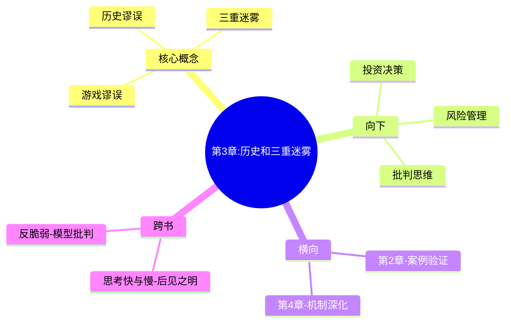

---

category:
  - Resources/书籍拆解/读书笔记

status: draft
chapter: 
number: 3
title: 历史和三重迷雾
links:

  - "[[第2章-出版业的黑天鹅]]"
  - "[[第4章-一千零一天]]"
created: 2026-02-26
tags:
  - 黑天鹅
  - 历史谬误
  - 事后诸葛亮
  - 塔勒布
---

# 第3章 历史和三重迷雾

## 📍 章节定位

### 全书位置
> 本章深入分析"历史谬误"——为什么我们用历史预测未来总是失败？什么是"三重迷雾"？

- **全书核心问题**：我们为什么总是无法预测极端事件？
- **本章回答的问题**：为什么历史理解总是"事后诸葛亮"？什么是影响我们认知的三重迷雾？
- **角色类型**：核心概念型 - 展开认知谬误的核心机制

### 章节序列
| 方向 | 章节标题 | 逻辑连接 |
|------|----------|----------|
| 前章 | [[第2章-出版业的黑天鹅]] | 案例演示：出版业黑天鹅 |
| 后章 | [[第4章-一千零一天]] | 机制深化：火鸡问题 |

### 一句话定位
> 第3章是核心概念型章节，揭示"历史谬误"和"三重迷雾"，回答"为什么我们总是用历史误读未来"这一关键问题。

---

## 🎯 核心观点

### 观点一：历史总是被"事后解释"

**【表层】现象层**：
- 历史事件发生时，人们并没有"预见到"
- 事后总能找到"原因"和"必然性"
- 911事件、苏联解体都是如此

**【中层】机制层**：
```
历史理解的机制：
- 选择性记忆：记住符合叙事的部分
- 因果倒置：把结果当成原因
- 简化解释：复杂的现实被简化为简单故事
```

**【底层】规律层**：
> **历史悖论**：历史看似有规律，但我们用它来预测未来时却常常失败。

---

### 观点二：三重迷雾

**【表层】现象层**：
1. 虚假理解：我们以为理解过去
2.  railroads：历史看起来"必然"
3. 虚构预测：我们以为能预测

**【中层】机制层**：
```
三重迷雾机制：
- 第一重：信息不完整
- 第二重：因果关系误判
- 第三极：概率估计错误
```

**【底层】规律层**：
> **认知迷雾原理**：我们被自己的认知框架所限制，无法看到现实的全部。

---

### 观点三：游戏谬误

**【表层】现象层**：
- 经济学家用"模型"预测经济
- 这些模型经常失败
- 模型越复杂，失败越惨

**【中层】机制层**：
```
游戏谬误机制：
- 简化现实：把复杂系统当作简单系统
- 假设错误：模型基于错误的假设
- 忽视极端：模型不考虑黑天鹅
```

**【底层】规律层**：
> **模型诅咒**：在极端斯坦中，复杂模型比简单模型更危险。

---

## 💬 降维翻译

### 观点一：历史谬误

#### 原文表达
> "我们倾向于用今天的角度解释过去，把历史看作一条必然的河流，而不是一系列偶然事件的集合。"

#### 降维翻译（中学生能懂）
事情发生后，大家都说"我早知道会这样"。其实发生之前没人知道。事后诸葛亮，事前猪一样。

#### 日常类比（奶奶能懂）
就像下棋，输了的人总能说出"当时应该怎么走"。其实下的时候没想到，输了才明白。

---

### 观点二：三重迷雾

#### 原文表达
> "我们有三重迷雾：虚假理解、 railroads 和虚构预测。这些迷雾使我们无法看清现实的本质。"

#### 降维翻译（中学生能懂）
三层迷雾：
1. 以为了解了，其实不了解
2. 以为历史必然，其实偶然
3. 以为能预测，其实不能

#### 日常类比（奶奶能懂）
就像雾里看花，以为看清了，其实全是雾。以为自己懂，其实不懂。以为自己能预测，其实猜错了。

---

### 观点三：游戏谬误

#### 原文表达
> "把现实世界的问题当作'游戏'问题来处理——假设我们可以列出所有可能性——是危险的错误。"

#### 降维翻译（中学生能懂）
那些搞经济模型的人，就像在棋盘上下棋，以为什么情况都能想到。其实现实比棋盘复杂一百倍。

#### 日常类比（奶奶能懂）
就像算命先生，以为什么都能算出来。其实变化太多了，算不到的。

---

## ✨ 金句库

### 原书金句
| 金句 | 适用场景 |
|------|----------|
| "历史总是被事后解释，而非事先预测。" | 历史观 |
| "我们有三重迷雾：虚假理解、历史必然、虚构预测。" | 认知谬误 |
| "游戏谬误：把现实问题当作游戏问题。" | 模型批判 |

### 降维金句
| 金句 | 适用场景 |
|------|----------|
| "事后诸葛亮，事前猪一样。" | 历史谬误 |
| "你以为懂了，其实不懂。" | 虚假理解 |
| "历史不是必然的，是偶然的。" | 历史观 |
| "模型越复杂，死的越惨。" | 游戏谬误 |
| "预测不如承认无知。" | 预测观 |
| "复杂的模型是危险的简化。" | 模型批判 |
| "因果关系是事后的马后炮。" | 因果谬误 |
| "我们以为看到的是全部，其实只是局部。" | 认知局限 |
| "最危险的是不知道自己不知道。" | 认知迷雾 |
| "历史书是幸存者写的。" | 历史观 |

---

## 🔗 当下映射

### 💰 财富应用
| 场景 | 具体行动 | 预期效果 |
|------|----------|----------|
| 投资决策 | 不依赖历史数据做唯一依据 | 避免模型陷阱 |
| 风险评估 | 考虑"模型外"的风险 | 预防黑天鹅 |
| 资产配置 | 保持冗余，不过度优化 | 增强韧性 |

### 💼 职场应用
| 场景 | 具体行动 | 所需能力 |
|------|----------|----------|
| 战略规划 | 不完全依赖历史趋势 | 批判思维 |
| 项目管理 | 考虑"未知风险" | 风险意识 |
| 决策制定 | 质疑"必然性"叙事 | 独立思考 |

### 🏠 生活应用
| 场景 | 具体行动 | 可行性 |
|------|----------|--------|
| 人生规划 | 接受不确定性 | 中 |
| 重大决策 | 考虑"万一" | 高 |
| 看待历史 | 保持怀疑态度 | 高 |

### 72小时行动计划
1. **今天**：回想3个你曾经认为"必然会发生"但没有发生的事
2. **本周内**：检查你的决策是否过度依赖"历史数据"
3. **准备**：学习一门不依赖预测的技能

---

## 🕸️ 章节关联

### 向上关联 → 整书
- **贡献**：建立"历史谬误"和"三重迷雾"概念
- **位置**：核心概念展开，为后续章节奠定基础

### 横向关联 → 章节间
| 章节编号 | 章节标题 | 关联类型 | 连接描述 |
|----------|----------|----------|----------|
| 第2章 | 出版业的黑天鹅 | 案例承接 | 案例验证三重迷雾 |
| 第4章 | 一千零一天 | 机制深化 | 火鸡问题延伸 |

### 向下关联 → 具体应用
| 应用场景 | 难度 | 前置知识 |
|----------|------|----------|
| 投资决策 | 中 | 无 |
| 风险管理 | 中 | 基础统计 |
| 批判思维 | 低 | 无 |

### 跨书关联 → 知识网络
| 书籍 | 概念 | 关系 | 备注 |
|------|------|------|------|
| [[思考快与慢-丹尼尔·卡尼曼]] | 后见之明 | 支持 | 系统2解释事后诸葛亮 |
| [[反脆弱-塔勒布]] | 模型批判 | 继承 | 游戏谬误的延伸 |

### 关联可视化


---

## ❓ 问答设计

### Q1: 什么是"历史谬误"？
**认知层次**: 记忆
**难度**: 低
**答案要点**:
- 用今天的角度解释过去
- 把偶然当作必然
- 事后诸葛亮

### Q2: 三重迷雾是什么？
**认知层次**: 记忆
**难度**: 中
**答案要点**:
- 虚假理解：以为理解其实不理解
- 历史必然：以为历史是必然的
- 虚构预测：以为能预测未来

### Q3: 为什么历史总是被"事后解释"？
**认知层次**: 理解
**难度**: 中
**答案要点**:
- 选择性记忆
- 因果倒置
- 简化解释

### Q4: 什么是"游戏谬误"？
**认知层次**: 理解
**难度**: 中
**答案要点**:
- 把现实问题当作游戏问题
- 假设可以列出所有可能性
- 忽视极端事件

### Q5: 为什么复杂模型比简单模型更危险？
**认知层次**: 分析
**难度**: 高
**答案要点**:
- 复杂模型给出虚假精确感
- 在极端斯坦中失效
- 让人过度自信

### Q6: 如何避免"事后诸葛亮"思维？
**认知层次**: 应用
**难度**: 中
**答案要点**:
- 记录事前预测
- 验证预测准确率
- 保持谦虚

### Q7: 为什么"历史必然"是危险的思维？
**认知层次**: 分析
**难度**: 中
**答案要点**:
- 历史是偶然的，不是必然的
- 必然思维导致预测错误
- 忽视黑天鹅

### Q8: 什么是"因果倒置"？
**认知层次**: 理解
**难度**: 中
**答案要点**:
- 把结果当成原因
- 事后找原因往往是错的
- 复杂事件的因果不简单

### Q9: 为什么经济学模型经常失败？
**认知层次**: 分析
**难度**: 高
**答案要点**:
- 游戏谬误
- 假设错误
- 忽视极端事件

### Q10: 如何在不确定的世界中做决策？
**认知层次**: 应用
**难度**: 高
**答案要点**:
- 接受不确定性
- 保持冗余
- 避免过度依赖模型

### Q11: 什么是"认知迷雾"？
**认知层次**: 理解
**难度**: 中
**答案要点**:
- 我们被自己的认知框架限制
- 无法看到现实的全部
- 需要保持怀疑

### Q12: 为什么说"最危险的是不知道自己不知道"？
**认知层次**: 理解
**难度**: 中
**答案要点**:
- 认知自大导致失败
- 无知者无畏
- 承认无知是智慧

### Q13: 如何培养"反事后诸葛亮"思维？
**认知层次**: 应用
**难度**: 中
**答案要点**:
- 区分"理解"和"以为理解"
- 质疑必然性叙事
- 记录自己的预测

### Q14: 为什么说"历史书是幸存者写的"？
**认知层次**: 理解
**难度**: 中
**答案要点**:
- 只有成功者被记录
- 失败者被忽略
- 幸存者偏差

### Q15: 什么是"虚假的精确"？
**认知层次**: 理解
**难度**: 中
**答案要点**:
- 复杂模型给出精确答案
- 但答案可能是错的
- 精确不等于准确

---
