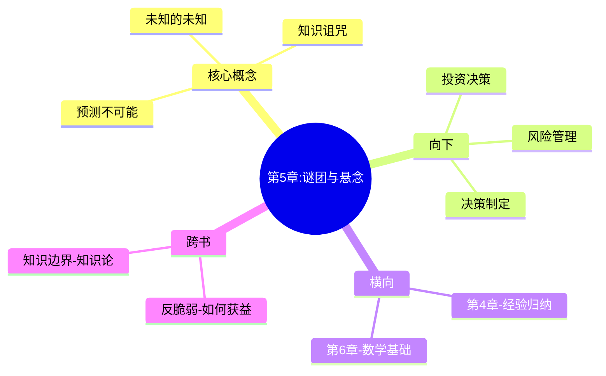

---

category:
  - Resources/书籍拆解/读书笔记

status: draft
chapter: 
number: 5
title: 谜团与悬念
links:

  - "[[第4章-一千零一天]]"
  - "[[第6章-平均斯坦与极端斯坦]]"
created: 2026-02-26
tags:
  - 黑天鹅
  - 未知的未知
  - 认知边界
  - 塔勒布
---

# 第5章 谜团与悬念

## 📍 章节定位

### 全书位置
> 本章深入探讨"未知的未知"——我们不知道我们不知道什么。这是进入"极端斯坦"的关键过渡章节。

- **全书核心问题**：我们为什么总是无法预测极端事件？
- **本章回答的问题**：为什么"未知的未知"比"已知的未知"更危险？什么是知识的边界？
- **角色类型**：核心概念型 - 从认知层面进入数学层面

### 章节序列
| 方向 | 章节标题 | 逻辑连接 |
|------|----------|----------|
| 前章 | [[第4章-一千零一天]] | 经验归纳问题 |
| 后章 | [[第6章-平均斯坦与极端斯坦]] | 数学基础建立 |

### 一句话定位
> 第5章是核心概念型章节，从认知角度过渡到数学角度，回答"为什么我们无法知道我们不知道什么"这一关键问题。

---

## 🎯 核心观点

### 观点一：已知的未知 vs 未知的未知

**【表层】现象层**：
- 我们知道有些事情不知道（已知的未知）
- 但我们不知道我们不知道什么（未知的未知）
- 黑天鹅是"未知的未知"

**【中层】机制层**：
```
知识边界机制：
- 已知的未知：可以列出，可以规划
- 未知的未知：无法列出，无法预测
- 黑天鹅属于后者
```

**【底层】规律层**：
> **认知边界原理**：我们无法突破自己的认知框架，就像鱼不知道水的存在。

---

### 观点二：知识的诅咒

**【表层】现象层**：
- 专家往往不知道自己的无知
- 知识的增加可能增加自信而非智慧
- 博士学位不等于智慧

**【中层】机制层**：
```
知识诅咒机制：
- 知道越多，不懂的也越多
- 但我们倾向于展示知道的
- 隐藏不知道的
```

**【底层】规律层**：
> **专家悖论**：在极端斯坦中，专家比普通人更容易出错。

---

### 观点三：为什么预测不可能

**【表层】现象层**：
- 极端事件无法预测
- 因为它们超出我们的认知框架
- 预测本身就是一种傲慢

**【中层】机制层**：
```
预测不可能机制：
- 预测需要历史数据
- 极端事件是历史的例外
- 例外无法从常规中预测
```

**【底层】规律层**：
> **不可预测性原理**：世界的某些方面本质上不可预测，接受这一事实是智慧的开始。

---

## 💬 降维翻译

### 观点一：未知的未知

#### 原文表达
> "有两种未知：一种是我们知道自己不知道的，另一种是我们不知道自己不知道的。黑天鹅属于后一种。"

#### 降维翻译（中学生能懂）
不知道的事分两种：
一种是"我知道我不知道"，比如我不知道明天彩票号码
一种是"我不知道我不知道"，比如我没想到会有疫情

#### 日常类比（奶奶能懂）
就像你知道自己不会打篮球，这是第一种不知道。但你不知道自己其实有心脏病，这是第二种不知道。第一种还能防备，第二种要命。

---

### 观点二：知识诅咒

#### 原文表达
> "知识的增加往往伴随着无知的增加，但我们倾向于展示知识，隐藏无知。"

#### 降维翻译（中学生能懂）
读的书越多，不懂的东西也越多。但人都喜欢显摆自己懂的，不愿意承认不懂的。

#### 日常类比（奶奶能懂）
就像当老师的，越当越觉得自己不会教。知道的越多，越知道自己不知道的多。但大家都不愿意承认自己不会。

---

### 观点三：预测不可能

#### 原文表达
> "极端事件无法预测，因为它们需要超出我们认知框架的信息。"

#### 降维翻译（中学生能懂）
黑天鹅之所以叫黑天鹅，就是事前没人能想到。想到了就不是黑天鹅了。

#### 日常类比（奶奶能懂）
就像你预测不到明天会出什么意外。能预测到就不是意外了。

---

## ✨ 金句库

### 原书金句
| 金句 | 适用场景 |
|------|----------|
| "有两种未知：已知的未知和未知的未知。" | 知识分类 |
| "知识的增加伴随着无知的增加。" | 知识诅咒 |
| "极端事件无法预测，因为它们超出认知框架。" | 预测不可能 |

### 降维金句
| 金句 | 适用场景 |
|------|----------|
| "你不知道你不知道。" | 未知的未知 |
| "黑天鹅是未知的未知。" | 黑天鹅定义 |
| "知识越多，无知越多。" | 知识诅咒 |
| "专家比普通人更容易出错。" | 专家悖论 |
| "预测是一种傲慢。" | 预测观 |
| "接受不确定性是智慧的开始。" | 世界观 |
| "认知框架限制我们的视野。" | 认知边界 |
| "不知道比知道更重要。" | 知识观 |
| "极端事件属于'未知的未知'。" | 极端事件 |
| "谦虚比自信更重要。" | 认知态度 |

---

## 🔗 当下映射

### 💰 财富应用
| 场景 | 具体行动 | 预期效果 |
|------|----------|----------|
| 投资决策 | 为"不知道"留有余地 | 避免黑天鹅 |
| 风险管理 | 不依赖单一预测 | 增强韧性 |
| 资产配置 | 保持冗余 | 应对未知 |

### 💼 职场应用
| 场景 | 具体行动 | 所需能力 |
|------|----------|----------|
| 职业规划 | 假设会有意外 | 危机意识 |
| 团队管理 | 考虑"未知的未知" | 全面思维 |
| 战略决策 | 保持灵活性 | 适应能力 |

### 🏠 生活应用
| 场景 | 具体行动 | 可行性 |
|------|----------|--------|
| 人生规划 | 接受不确定性 | 高 |
| 健康管理 | 定期全面检查 | 高 |
| 财务管理 | 预留应急资金 | 高 |

### 72小时行动计划
1. **今天**：列出3个你"不知道自己不知道"的事
2. **本周内**：学习"反脆弱"思维
3. **准备**：建立应急储备

---

## 🕸️ 章节关联

### 向上关联 → 整书
- **贡献**：建立"未知的未知"概念
- **位置**：从认知层面过渡到数学层面的桥梁

### 横向关联 → 章节间
| 章节编号 | 章节标题 | 关联类型 | 连接描述 |
|----------|----------|----------|----------|
| 第4章 | 一千零一天 | 经验归纳延伸 | 火鸡问题→知识边界 |
| 第6章 | 平均斯坦与极端斯坦 | 数学基础 | 认知→数学过渡 |

### 向下关联 → 具体应用
| 应用场景 | 难度 | 前置知识 |
|----------|------|----------|
| 投资决策 | 中 | 无 |
| 风险管理 | 中 | 无 |
| 决策制定 | 低 | 无 |

### 跨书关联 → 知识网络
| 书籍 | 概念 | 关系 | 备注 |
|------|------|------|------|
| [[反脆弱-塔勒布]] | 反脆弱 | 延伸 | 如何在未知中获益 |
| 知识的边界-塔勒布 | 知识边界 | 继承 | 知识论基础 |

### 关联可视化


---

## ❓ 问答设计

### Q1: "已知的未知"和"未知的未知"有什么区别？
**认知层次**: 理解
**难度**: 中
**答案要点**:
- 已知的未知：知道自己不知道
- 未知的未知：不知道自己不知道
- 黑天鹅属于后者

### Q2: 什么是"知识诅咒"？
**认知层次**: 记忆
**难度**: 中
**答案要点**:
- 知识增加，无知也增加
- 我们倾向于展示知识
- 隐藏无知

### Q3: 为什么"未知的未知"更危险？
**认知层次**: 理解
**难度**: 中
**答案要点**:
- 无法预防
- 无法规划
- 超出认知框架

### Q4: 专家为什么更容易出错？
**认知层次**: 分析
**难度**: 高
**答案要点**:
- 知识的诅咒
- 过度自信
- 极端斯坦中经验失效

### Q5: 为什么预测不可能？
**认知层次**: 理解
**难度**: 中
**答案要点**:
- 极端事件超出认知框架
- 预测需要历史数据
- 黑天鹅没有历史

### Q6: 如何应对"未知的未知"？
**认知层次**: 应用
**难度**: 中
**答案要点**:
- 接受不确定性
- 保持冗余
- 培养反脆弱

### Q7: 什么是"认知框架"？
**认知层次**: 理解
**难度**: 中
**答案要点**:
- 我们理解世界的思维结构
- 框架决定了能看到什么
- 框架也限制了视野

### Q8: 为什么"接受不确定性是智慧的开始"？
**认知层次**: 理解
**难度**: 中
**答案要点**:
- 世界本质不确定
- 抗拒不确定性导致失败
- 接受才能适应

### Q9: 什么是"专家悖论"？
**认知层次**: 理解
**难度**: 高
**答案要点**:
- 专家在极端斯坦更容易出错
- 专家倾向于过度自信
- 专家承担的风险小

### Q10: 如何突破"认知框架"？
**认知层次**: 应用
**难度**: 高
**答案要点**:
- 保持谦虚
- 多元思维
- 质疑假设

### Q11: 为什么说"不知道比知道更重要"？
**认知层次**: 理解
**难度**: 中
**答案要点**:
- 承认无知才能学习
- 知道错觉导致失败
- 不知道激发谨慎

### Q12: 什么是"黑天鹅思维"？
**认知层次**: 理解
**难度**: 中
**答案要点**:
- 接受不可预测性
- 为极端做准备
- 保持冗余

### Q13: 如何培养"不知道"的智慧？
**认知层次**: 应用
**难度**: 中
**答案要点**:
- 承认无知
- 保持好奇
- 质疑确定性

### Q14: 什么是"认知谦逊"？
**认知层次**: 理解
**难度**: 中
**答案要点**:
- 知道自己不知道
- 不假装知道
- 保持开放

### Q15: 为什么"预测是一种傲慢"？
**认知层次**: 理解
**难度**: 中
**答案要点**:
- 假设未来可预测
- 忽视未知
- 过度自信

---
