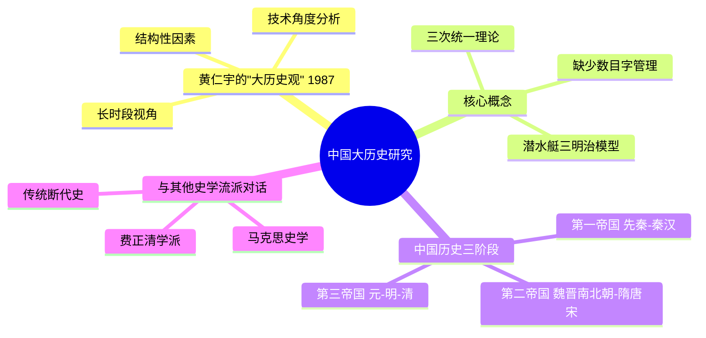

# 《中国大历史》读书笔记

## 这本书要解决什么问题？

**核心困境**：为什么中国这样一个拥有数千年文明的古老帝国，在现代世界中却屡屡受挫？不是道德问题，不是人种问题，那到底是什么问题？

黄仁宇的答案一针见血：**中国传统社会的"潜水艇三明治"结构，缺乏"数目字管理"能力，无法适应现代社会的要求。**

**一句话定位**：
> 中国历史的真相：不是道德问题，不是人种问题，是制度问题——缺少数目字管理能力。

### 作者站在什么位置说这些话？

| 维度 | 定位 |
|------|------|
| 主领域 | 中国通史、大历史观、制度史 |
| 跨界领域 | 经济史、社会史、政治哲学 |
| 作者背景 | 美籍华裔历史学家，"大历史观"倡导者，亲身经历中国近现代动荡 |
| 理论谱系 | 技术治史方法论，与费正清学派对话 |
| 历史语境 | 1987年出版（英文版），1988年中文版。黄仁宇站在一个独特的位置：既是中国历史的亲历者（参加过抗日战争），又是西方学术体系的参与者（在美国任教）。他用"大历史观"跨越东西方视角，提出了一个震撼性的诊断 |

### 和其他书有什么关系？

| 关联书籍 | 关联关系 | 共同底层逻辑 |
|----------|----------|--------------|
| [[万历十五年-黄仁宇]] | 同一作者 | 微观切片 vs 宏观叙事，同一方法论的不同应用 |
| [[历史的教训-杜兰特]] | 互补 | 历史周期规律 vs 制度性崩溃 |
| [[周期]] | 互补 | 历史钟摆 vs 制度钟摆 |
| [[枪炮病菌与钢铁-戴蒙德]] | 互补 | 地理环境决定 vs 制度因素决定 |
| [[人类简史-赫拉利]] | 互补 | 大历史书写方式，认知革命 vs 技术革命 |
| [[论语-孔子]] | 对立与继承 | 道德理想 vs 制度现实 |

### 知识网络图

---

## 作者的核心论点

### 潜水艇三明治模型：中国传统社会的结构性缺陷

黄仁宇提出了一个极其形象的比喻：中国传统社会像"潜水艇三明治"。

上层是什么？庞大的帝国和皇权——巨大但空泛，号称统治天下，但实际控制力有限。下层是什么？分散的小农社会——无数自给自足的家庭，巨大但无组织，没有统一的行动能力。中间是什么？缺失。没有强有力的中间组织把上下连接起来。

这个结构导致一个致命问题：上层想管，管不到；下层想活，没人管。皇帝的旨意传到县一级就失真了，县令的报告送到京城也失真了。中央和基层之间，缺乏有效的信息通道和管理机制。

黄仁宇用一个流程图解释了治理的两难：要么用法制——但代价太高，无法执行，法律条文无法覆盖如此广阔的疆域和如此分散的人口；要么用道德——但无法量化，无法管理，只能靠官员的良知和自觉。

> **三明治结构定律**：当一个社会缺乏中间组织时，上层和下层直接对接，要么过度控制，要么完全失控，无法形成有效的治理体系。

| 读者困惑 | 黄仁宇的答案 |
|----------|----------|
| 为什么中国基层治理这么难？ | 传统社会缺乏中间组织，信息在上下传递中失真 |
| 为什么政策执行总是走样？ | 潜水艇结构导致中央旨意到基层就变了味 |

这个观点打碎了我对"大一统"的迷信。我一直以为"大一统"意味着中央强大、控制有效。但黄仁宇让我看到，"大一统"的表象之下，是上下脱节的实质——中央管不到基层，基层不认识中央。

潜水艇三明治只是结构缺陷的表现。黄仁宇还要解释：为什么这个缺陷会阻碍现代化？

### 缺少数目字管理：中国走向现代的最大障碍

"数目字管理"是黄仁宇的核心概念。什么意思？就是能够精确测量、记录、分析社会经济数据的能力。现代国家必须知道：全国有多少人、有多少地、税收多少合理、财政状况如何。

传统中国呢？不知道。人口统计不准确，土地丈量模糊，税制定额僵化，账目混乱。皇帝不知道自己统治多少人，官员不知道自己管辖多少地，税收按固定定额而非实际产出，财政靠估算而非精确计算。

| 维度 | 现代国家 | 传统中国 |
|------|----------|----------|
| 财政管理 | 精确的会计制度 | 模糊的定额制度 |
| 人口统计 | 定期普查 | 大概估算 |
| 土地丈量 | 精确测量 | 按亩摊派 |
| 税收体系 | 比例税 | 固定税额 |
| 信息流动 | 数字化、透明 | 人情化、不透明 |

为什么缺少数目字管理？因为传统中国用"道德"代替"数字"、用"经验"代替"数据"、用"人情"代替"规则"。官员的考核靠的是"德行"和"资历"，而不是绩效指标。财政的运转靠的是"惯例"和"人情"，而不是精确计算。

> **数目字管理定律**：现代社会的基础是"数目字管理"能力——能够精确测量、记录、分析社会经济数据的能力。缺乏这种能力，就无法进行有效的治理，也无法实现现代化。

| 读者困惑 | 黄仁宇的答案 |
|----------|----------|
| 为什么中国政府数字化改革这么难？ | 传统思维根深蒂固，用道德代替数字 |
| 为什么企业数字化转型这么难？ | 缺少数目字管理文化，用人情代替规则 |

我以前一直觉得"数字化"只是技术问题——买系统、培训人、建流程。但黄仁宇让我看到，数字化是文化问题——从"道德治国"到"数目字管理"的思维转变。

但黄仁宇不只是诊断问题。他还要解释：中国为什么会形成这种结构？这引出了他的历史分期理论。

### 三次统一：中国历史的制度演进

黄仁宇把中国历史分成三个阶段，每次都是"统一"改变了历史走向。

**第一次统一（前221年）**：秦始皇统一六国。建立了中央集权制度、郡县制、官僚系统雏形。形成第一帝国（秦汉）。

**第二次统一（589年）**：隋朝统一南北朝。科举制度开始，让精英可以通过考试进入官僚系统。形成第二帝国（隋唐宋）。

**第三次统一（1279年）**：元朝统一南宋。完成大一统格局，但制度开始固化。形成第三帝国（元明清）。

每次统一的特点：都是武力统一、都带来制度创新、都形成更大的帝国。但都没有解决"数目字管理"的根本问题。反而，每次统一都让制度更僵化、更内向。

> **统一悖论定律**：统一带来稳定和规模，但也带来僵化和内向。中国历史的三次统一，每次都让帝国更强大，但也让制度更僵化，最终走向崩溃。

| 读者困惑 | 黄仁宇的答案 |
|----------|----------|
| 为什么中国总是"分久必合，合久必分"？ | 统一带来僵化，分裂带来活力，钟摆效应 |
| 中国历史上什么时候最开放？ | 宋朝（第二次统一后），制度尚有弹性 |

下次看到"统一"的新闻，我不会简单地欢呼"伟大复兴"。黄仁宇让我意识到，统一是双刃剑——稳定与僵化相伴而生。

黄仁宇还要回答一个更深的问题：为什么传统历史学看不到这些问题？

### 技术角度而非道德角度：重新理解历史

传统历史学怎么分析历史？用"好人"vs"坏人"评价人物，用"明君"vs"昏君"解释兴衰，用"忠臣"vs"奸臣"描述事件。

问题是什么？无法解释规律，只能讲故事。为什么明朝亡了？传统答案：崇祯是昏君、魏忠贤是奸臣、李自成是叛贼。但为什么同样的剧本在每个朝代末尾都会上演？

黄仁宇的新方法：不关注人物的道德品质，关注制度的运作机制；从经济、社会、技术角度分析因果关系；目的是解释规律，而不仅仅是讲故事。

| 分析角度 | 道德角度 | 技术角度 |
|------|----------|----------|
| 王朝衰落 | 昏君当道 | 制度僵化、财政失控 |
| 农民起义 | 奸臣挑拨 | 赋税过重、生存危机 |
| 改革失败 | 奸臣阻挠 | 制度不支持、执行成本高 |
| 外族入侵 | 汉奸卖国 | 军事技术落后、制度低效 |

黄仁宇的核心观点："道德非万能，不能代替技术，尤不可代替法律。但是从没有说道德可以全部不要，只是说道德的观点应当远大。凡能先用法律和技术解决的问题，不要先就扯上了一个道德问题。"

> **技术分析定律**：历史研究应该从技术角度（经济、制度、社会结构）分析因果关系，而不是从道德角度（人物品质、价值判断）评价历史。技术分析能揭示规律，道德分析只能讲故事。

| 读者困惑 | 黄仁宇的答案 |
|----------|----------|
| 为什么明朝亡了？崇祯是昏君吗？ | 不是昏君问题，是制度问题——数目字管理缺失导致财政失控 |
| 为什么改革这么难？ | 好人办不成事，因为制度不支持 |

这个观点打碎了我对"历史人物"的迷信。我一直以为历史是英雄创造的——明君让国家强盛，昏君让国家衰落。但黄仁宇让我看到，历史是制度支撑的——没有数目字管理的制度，明君也无力回天。

但黄仁宇还发现了一个更根本的因素：地理。

### 地理因素：历史的起点与路径

中国历史的地理特点是什么？地域辽阔，适合农业发展；黄河不断泛滥，需要中央集权治理水患；周边游牧民族侵扰，需要统一防御。

这些地理特点塑造了中国的"大一统"格局：广阔疆域 → 农业优势 → 人口密集；黄河泛滥 → 需要统一治理；游牧威胁 → 需要统一防御。三者交汇，形成帝国，中央集权，意识形态统治，道德治国，最终缺少数目字管理。

地理因素的双面性：积极面——促进统一、形成帝国、抵御外敌；消极面——导致制度僵化、难以改革、缺乏弹性。

> **地理宿命定律**：地理环境塑造了中国的统一格局，但也导致了制度的内向化和僵化。地理不是宿命，但它决定了历史的起点和路径。

| 读者困惑 | 黄仁宇的答案 |
|----------|----------|
| 为什么中国总是大一统？ | 地理因素决定的——黄河泛滥需要统一治理、游牧威胁需要统一防御 |
| 中国制度为什么这么难改？ | 地理塑造的制度结构——统一导致僵化、缺乏中间组织 |

---

## 这本书的局限

> 黄仁宇的大历史观提供了一个解释中国历史的新框架，但这个框架有边界。

| 批评点 | 谁在批评 | 怎么说 | 实际情况 |
|--------|---------|--------|---------|
| 过度西化 | 中国史学界 | 用西方的"数目字管理"标准衡量中国传统社会 | 黄仁宇确实站在西方视角，但他的目的是找到差距，而不是否定传统 |
| 忽视文化因素 | 文化学者 | 只讲制度和技术，忽视了文化、思想的作用 | 黄仁宇承认文化重要，但认为制度是更根本的因素 |
| 历史简化 | 史学家 | 把复杂的历史简化为几个概念（潜水艇、数目字管理） | 大历史观的代价是简化细节，但换来的是规律性的洞察 |
| 预测错误 | 批评者 | 预测中国难以现代化，但中国已经实现了部分现代化 | 黄仁宇说的是"缺少数目字管理能力"，不是"不可能现代化" |
| 忽视个体能动性 | 历史学家 | 过度强调制度，忽视了人的选择和努力 | 技术分析强调制度，但黄仁宇也承认人的作用 |

**一句话总结局限性**：
> 黄仁宇的大历史观揭示了中国历史的结构性问题，但不能解释所有细节——文化、思想、个体能动性同样重要。

---

## 最值得记住的话

**原书说的**：
1. "中国数千年来发生的问题，都是缺少了现代社会发展下一些关键元素，我把这些统称为'缺少数目字上管理'。"
2. "道德不是万能的。以道德治国，最终会陷入无休止的道德争论，而实际问题却得不到解决。"
3. "凡能先用法律和技术解决的问题，不要先就扯上了一个道德问题。"
4. "明朝的灭亡，不是亡于崇祯，而是亡于万历。"
5. "大历史就是将宏观及放宽视野这一观念引入到中国历史研究里去。"

**翻译成人话**：
1. 道德说教代替不了制度设计，就像口号代替不了饭菜
2. 最可怕的统治者不是暴君，是被道德绑架的傀儡
3. 一个系统如果只能靠"好人"来运转，那它就是个烂系统
4. 当一个国家连账都算不清楚，它离崩溃就不远了
5. 中国的历史真相：不是道德问题，不是人种问题，是制度问题
6. 统一带来稳定，但也带来僵化
7. 技术角度分析历史，能看见规律；道德角度分析历史，只能看见故事
8. 潜水艇三明治：上下两层大而无当，中间缺少联系
9. 不是你不努力，是制度不支持你
10. 历史不是靠英雄创造的，是靠制度支撑的

---

## 讲给没读过的人听

你有没有想过一个问题：为什么中国拥有数千年文明，却在近代屡屡受挫？

传统历史学给你讲英雄、讲道德：明君让国家强盛，昏君让国家衰落。忠臣让朝廷稳定，奸臣让朝廷腐败。

黄仁宇说：这个视角错了。

他提出了一个比喻：中国传统社会像"潜水艇三明治"。上层是庞大的帝国，下层是分散的小农社会，中间——缺失。没有强有力的中间组织把上下连接起来。

结果是什么？皇帝管不到基层，基层不认识皇帝。政策传到县一级就变味了，报告送到京城也失真了。想用法制，代价太高执行不了；想用道德，无法量化无法管理。

更致命的是，传统中国缺乏"数目字管理"能力——不知道有多少人、有多少地、税收多少合理。用道德代替数字，用人情代替规则。现代国家必须精确测量、记录、分析数据，传统中国做不到。

这不是道德问题，不是人种问题，是制度问题。黄仁宇用5000年中国史验证了这一点：三次统一（秦、隋、元），每次都带来制度创新，但都没解决数目字管理的根本问题，反而越统一越僵化。

---

## 用来检验理解的问题

**基础回忆**：
1. Q: "潜水艇三明治"是什么意思？
   A: 传统中国社会结构：上层是庞大的帝国（巨大但空泛），下层是分散的小农社会（巨大但无组织），中间缺失——没有强有力的中间组织连接上下。

2. Q: "数目字管理"是什么意思？
   A: 能够精确测量、记录、分析社会经济数据的能力——知道有多少人、有多少地、税收多少合理。现代国家的基础。

3. Q: 黄仁宇说中国历史有三次统一，分别是什么？
   A: 第一次（前221年）秦统一六国，形成第一帝国；第二次（589年）隋统一南北朝，形成第二帝国；第三次（1279年）元统一南宋，形成第三帝国。

**理解验证**：
1. Q: 为什么"道德治国"会导致治理失败？
   A: 道德无法量化、无法管理，只能靠官员的良知和自觉。没有绩效指标，没有精确计算，财政靠估算而非数据。

2. Q: 为什么黄仁宇说"明朝亡于万历，不是亡于崇祯"？
   A: 不是人物问题，是制度问题。万历时期制度已经开始僵化，数目字管理缺失导致财政失控。崇祯努力也无力回天。

3. Q: 为什么技术角度分析历史比道德角度更有效？
   A: 技术角度能揭示规律（制度运作机制），道德角度只能讲故事（人物品质）。历史重复的不是人物，是制度。

**实际应用**：
1. Q: 用黄仁宇的理论分析当代中国的数字化改革。
   A: 数字化不只是技术问题，是"数目字管理"的思维转变。从道德治国到数据治理，这个转变比买系统更难。

2. Q: 用"潜水艇三明治"模型分析基层治理困境。
   A: 中央政策传到基层失真，基层情况报到中央也失真——中间组织缺失导致信息断裂。

**深度分析**：
1. Q: 黄仁宇的"大历史观"和传统断代史有什么区别？
   A: 传统断代史关注人物和事件，大历史观关注制度和结构。传统史讲"发生了什么"，大历史讲"为什么会发生"。

2. Q: 地理因素如何塑造了中国的大一统格局？
   A: 黄河泛滥需要统一治理，游牧威胁需要统一防御，广阔疆域适合农业。地理决定了起点，但路径是制度选择的结果。

---

## 和其他书的对话

《万历十五年》和《中国大历史》是黄仁宇的姊妹篇。一本讲1587年这一年，一本讲上下五千年。微观切片和宏观叙事，同一个方法论的不同应用。核心观点一致：道德替代法制导致崩溃，缺少数目字管理导致落后。读了《万历十五年》看细节，读了《中国大历史》看全景。

杜兰特和黄仁宇都在讲历史规律，但视角不同。杜兰特说历史像钟摆，自由与集中来回摆动。黄仁宇说中国历史像潜水艇三明治，上下脱节导致治理失败。杜兰特讲的是普遍规律，黄仁宇讲的是中国特色。两者互补：钟摆是节奏，三明治是结构。

戴蒙德和黄仁宇都在用"大历史"视角。戴蒙德讲地理环境决定文明差异——欧亚大陆的东西向轴线让农业更容易传播。黄仁宇讲制度结构决定中国命运——潜水艇三明治导致数目字管理缺失。地理决定起点，制度决定路径。读了戴蒙德理解中国为什么能统一，读了黄仁宇理解统一为什么带来僵化。

《论语》和《中国大历史》形成道德理想vs制度现实的对话。孔子倡导德治，中国传统实践了德治。结果呢？黄仁宇说失败了——道德治国无法实现数目字管理，无法适应现代社会。孔子的理想是美好的，但现实需要制度支撑。

---

*拆解日期：2026-02-15*
*下次回访：1周后回顾「讲给没读过的人听」和「检验问题」*