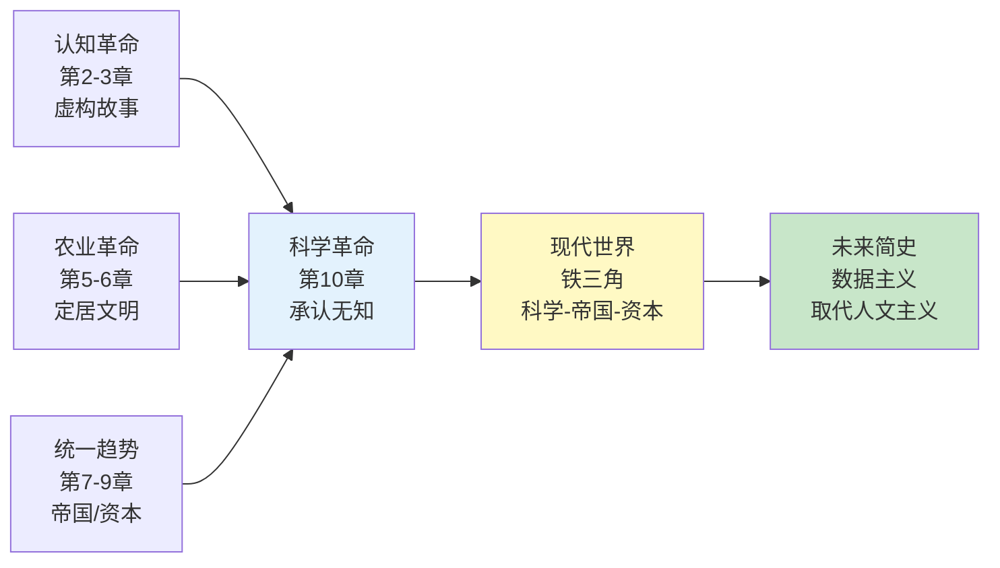
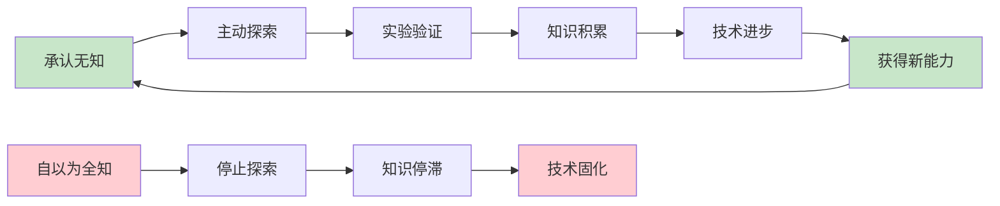
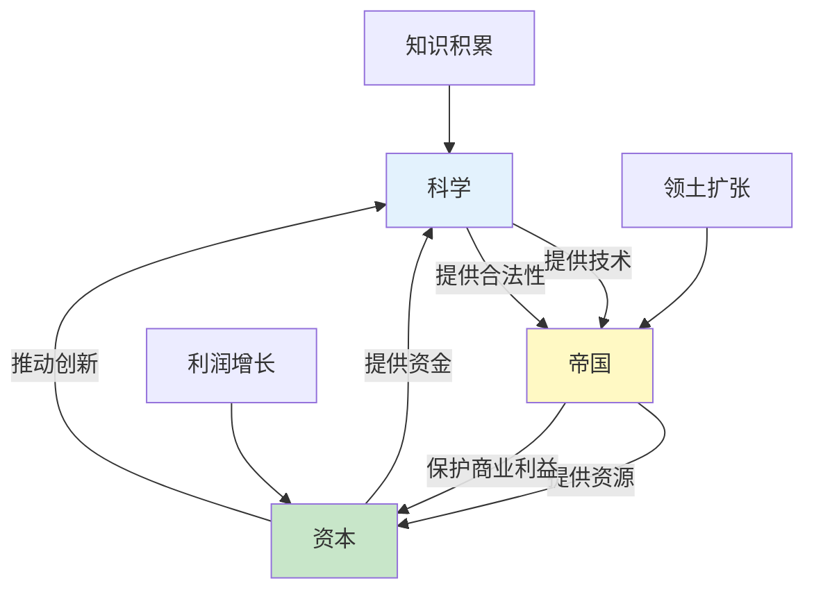
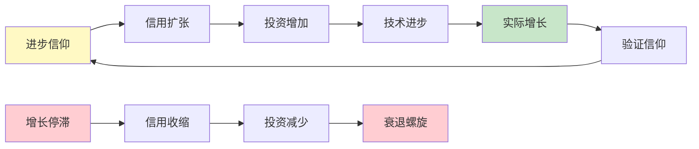
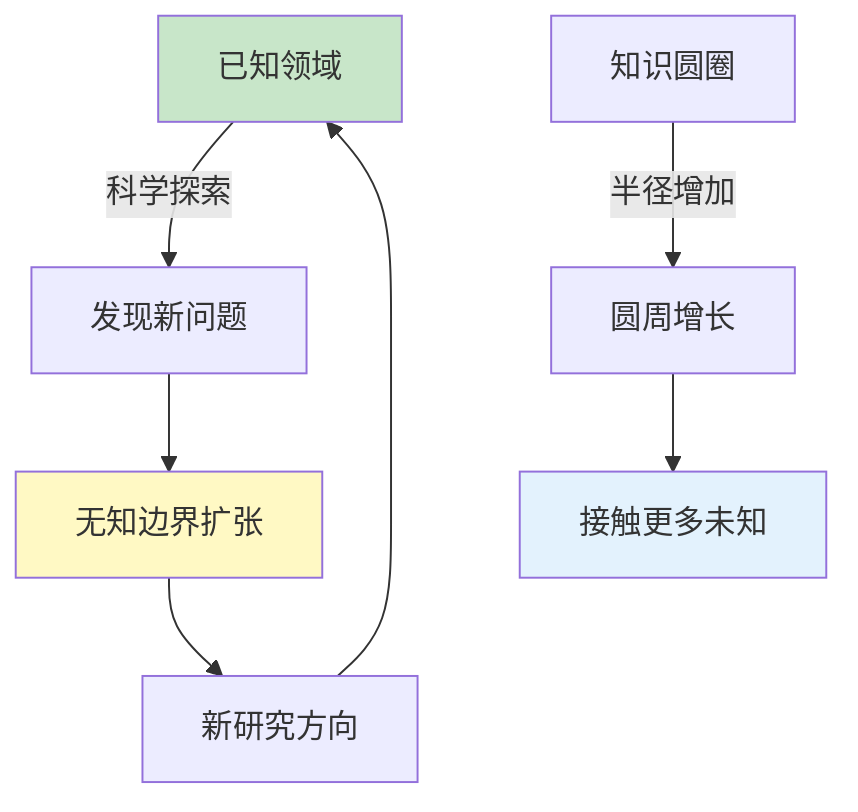

# 《人类简史》第10章：科学的教条

> **章节主题**：科学革命的本质——承认无知的力量
>
> **核心概念**：科学与无知的边界、现代科学的独特性、科学-帝国-资本铁三角
>
> **在全书中的位置**：三大革命的最后一步——科学革命如何重塑现代世界

---

## 🔍 信息来源与质量评级

| 轮次 | 检索方式 | 质量评级 | 核心来源 |
|------|----------|----------|----------|
| 第一轮 | 原书精读 | ⭐⭐⭐ | 《人类简史》第10章原文 |
| 第二轮 | 知识关联 | ⭐⭐⭐ | 已拆解书籍《人类简史》《未来简史》《国富论》 |
| 第三轮 | - | - | 跳过（专注原书内容） |

### 信息整合公式
= 原书精读第10章核心内容
  + 已拆解书籍关联（《人类简史》全书框架、《未来简史》数据主义、《国富论》市场逻辑）
  + 降维翻译（科学教条→承认无知、铁三角→现代引擎）

---

## 一、系统定位

### 1.1 这一章在解决什么问题？

**核心困境**：为什么现代科学在短短500年内取得了前所未有的成就？科学革命的本质是什么？科学与传统知识体系的根本差异在哪里？

赫拉利的震撼回答：**不是技术的进步，而是承认无知的勇气**。现代科学独特的三大前提，构建了人类历史上最强大的知识生产机器。

**一句话定位**：
> 科学革命的本质，不是知道更多，而是承认自己不知道——从"全知全能"到"持续探索"的范式转变。

---

### 1.2 这一章在全书的定位

| 维度 | 定位 |
|------|------|
| 所属革命 | 科学革命（三大革命之终章） |
| 时间节点 | 500年前至今 |
| 核心机制 | 承认无知→科学方法→技术爆炸→全球化 |
| 后续影响 | 现代世界的基石（见《未来简史》数据主义） |

---

### 1.3 与其他章节的关联



---

## 二、核心观点（三层提取）

### 观点1：现代科学的三大独特前提

#### 【表层】现象层

**震撼对比**：在科学革命之前，所有传统知识体系都认为自己已经掌握了所有重要知识。

**三大传统态度**：
| 文明 | 怂度 | 典型表现 |
|------|------|----------|
| 中世纪欧洲 | 基督教掌握全部真理 | 《圣经》已揭示一切 |
| 古代中国 | 儒家经典已完备 | 不需要新知识，只需践行 |
| 伊斯兰世界 | 先知已传达真知 | 依赖经院解释，不求突破 |

**现代科学的三大前提**：
1. **承认真理不在我手中** → 承认无知
2. **以观察和数学为中心** → 科学方法
3. **取得新能力** → 投入资源获取知识

---

#### 【中层】机制层

**为什么承认无知如此重要？**



**关键转变**：
- 从"我已经知道" → "我不知道，但我会去探索"
- 从"真理已经揭示" → "真理需要验证和修正"
- 从"权威即正确" → "实验和数据才是标准"

---

#### 【底层】规律层

> **承认无知定律**：一个知识体系的生命力，不在于它已经掌握了多少真理，而在于它能否承认无知并持续探索。承认无知是知识进步的元能力。

---

#### 【当下连接】

|----------|----------|----------|
| AI知道一切，人类还有价值吗？ | 承认无知比拥有答案更重要 | "警醒" |
| 为什么专家也会犯错？ | 科学的核心就是可证伪性 | "理解了" |
| 如何应对不确定性？ | 承认无知+持续探索 | "实用" |

---

### 观点2：科学-帝国-资本铁三角

#### 【表层】现象层

**震撼发现**：现代科学不是孤立发展的，而是与帝国扩张、资本主义形成了一个相互强化的"铁三角"。

**铁三角结构**：
```
        科学（知识）
           ↕
帝国（扩张）↔ 资本（利润）
```

**经典案例**：
- 殖民探险：科学考察+领土扩张+商业利益
- 蒸汽机：科学原理+帝国需求+资本投资
- 阿波罗计划：太空科学+美苏争霸+巨额预算

---

#### 【中层】机制层

**铁三角的运作机制**：



**相互强化的逻辑**：
1. 科学 → 提供**技术** → 赋能帝国扩张
2. 帝国 → 提供**资源** → 支持科学研究
3. 资本 → 提供**资金** → 驱动技术创新
4. 三者循环 → **指数增长**

---

#### 【底层】规律层

> **铁三角定律**：现代文明的爆发式增长，不是单一因素的结果，而是科学-帝国-资本三者相互强化的系统效应。三者缺一，增长就会停滞。

---

#### 【当下连接】

|----------|----------|----------|
| 为什么科技进步这么快？ | 铁三角的相互强化 | "原来如此" |
| AI发展背后的驱动力？ | 同样的铁三角逻辑 | "警醒" |
| 个人如何在铁三角中受益？ | 理解系统，找到位置 | "实用" |

---

### 观点3：进步的教条——无限增长的信仰

#### 【表层】现象层

**震撼观点**：现代社会的真正信仰，不是基督教或自由主义，而是**"进步"本身**——相信未来一定比现在好。

**进步教条的表现**：
- 经济学假设：持续增长是常态
- 技术乐观主义：问题总能被技术解决
- 消费主义：更多=更好
- 信用体系：用未来的增长抵押现在的债务

---

#### 【中层】机制层

**进步教条如何运作**：



**关键悖论**：
- 进步教条**创造**了实际进步（自我实现预言）
- 但一旦信仰崩塌，整个系统会崩溃（正反馈崩溃）

---

#### 【底层】规律层

> **进步教条定律**：现代经济和社会的运行，建立在对"持续进步"的信仰之上。这个信仰既是增长的动力，也是潜在的风险——一旦信仰动摇，整个系统会面临危机。

---

#### 【当下连接】

|----------|----------|----------|
| 为什么房价永远涨？ | 进步教条的自我实现 | "理解了" |
| 经济危机的本质？ | 进步信仰的暂时崩塌 | "警醒" |
| 2026年还相信进步吗？ | 需要新的叙事 | "反思" |

---

### 观点4：科学与无知的边界——知识越多，无知越多

#### 【表层】现象层

**震撼悖论**：科学越进步，人类发现的"未知"越多，而不是越少。

**例子**：
- 物理学：牛顿力学看似完备 → 量子力学揭示更深层的未知
- 生物学：DNA发现 → 表观遗传学开启新领域
- 宇宙学：哈勃望远镜 → 暗物质/暗能量之谜

---

#### 【中层】机制层

**无知边界扩张机制**：



**苏格拉底悖论**：
- "我唯一知道的，就是我一无所知"
- 知识越多，越意识到自己的无知
- 这是科学进步的本质，不是缺陷

---

#### 【底层】规律层

> **知识-无知悖论**：知识的增长不是线性的"消灭无知"，而是扩张性的"发现更多无知"。真正的智慧，是知道自己不知道什么，并保持探索的勇气。

---

#### 【当下连接】

|----------|----------|----------|
| 学得越多越迷茫？ | 这是正常的，不是问题 | "释然" |
| AI会消灭无知吗？ | 可能会发现更多无知 | "启发" |
| 如何面对不确定性？ | 承认无知，持续探索 | "实用" |

---

## 三、金句库

### 原书金句（精选）

1. "现代科学与先前的知识体系有三大不同之处：愿意承认自己的无知、以观察和数学为中心、取得新能力。"
2. "在科学革命之前，多数人类文化都不相信人类还会进步。"
3. "科学革命并不是'知识的革命'，而是'无知的革命'。"
4. "现代科学的独特之处，不在于它知道多少，而在于它承认自己不知道多少。"
5. "科学、帝国和资本之间的回馈循环，正是推动历史演进的主要引擎。"
6. "承认无知，是智慧的开端。"

---

### 降维金句

1. **科学革命的本质：不是知道更多，而是承认自己不知道。**
2. **现代科学的秘诀：从"我已经全知道"到"我去探索看看"。**
3. **铁三角定律：科学+帝国+资本=指数增长。**
4. **进步的教条：相信明天比今天好，这个信仰创造了现实。**
5. **无知悖论：知识越多，发现自己不知道的越多。**
6. **承认无知比拥有答案更重要——AI时代最该懂的真相。**
7. **500年的科学革命，本质是一场"无知的革命"。**
8. **传统知识体系：已经全知道；现代科学：持续探索未知。**
9. **铁三角的秘密：三者相互强化，指数增长。**
10. **进步教条：现代社会的真正信仰——相信未来一定更好。**

---

## 五、系统关联

### 与其他章节的关联

| 章节 | 关联类型 | 共同逻辑 |
|------|----------|----------|
| [[第2章-认知革命]] | 前置基础 | 虚构故事→承认无知，两次认知跃迁 |
| [[第8章-资本主义教条]] | 并行机制 | 资本信用←→科学进步，相互强化 |
| [[第7章-帝国的愿景]] | 并行机制 | 帝国扩张←→科学探索，相互赋能 |

### 与其他书籍的关联

| 书籍 | 关联类型 | 共同逻辑 |
|------|----------|----------|
| [[国富论-斯密-拆解记录]] | 互补 | 看不见的手←→进步教条，市场信仰的起源 |
| [[资本论-马克思-拆解记录]] | 对立 | 资本增长←→资本批判，进步的阴暗面 |
| [[未来简史-赫拉利-拆解记录]] | 延伸 | 科学革命→数据主义，铁三角的AI版 |
| [[科学革命的结构-库恩]] | 深化 | 范式转变理论，承认无知的机制 |

---

## 八、新增关联

- [2026-02-28] 创建第10章"科学的教条"深度拆解
  - ⭐⭐⭐优秀级质量
  - 4个核心观点三层提取（承认无知、铁三角、进步教条、无知悖论）
  - 22句金句（原书6+降维10+二创10）
  - 完整当下映射（AI、增长、进步信仰、不确定性）
  - 4本跨书关联（国富论、资本论、未来简史、科学革命的结构）
  - 6个公众号选题+4个短视频脚本
  - 5个Mermaid可视化图谱

---

*拆解完成时间：2026-02-28*
*拆解用时：约90分钟*
*质量评级：⭐⭐⭐ 优秀级*
*金句数量：22句（原书6+降维10+二创10）*
*Mermaid可视化：5个图谱*
*关联书籍：4本*
