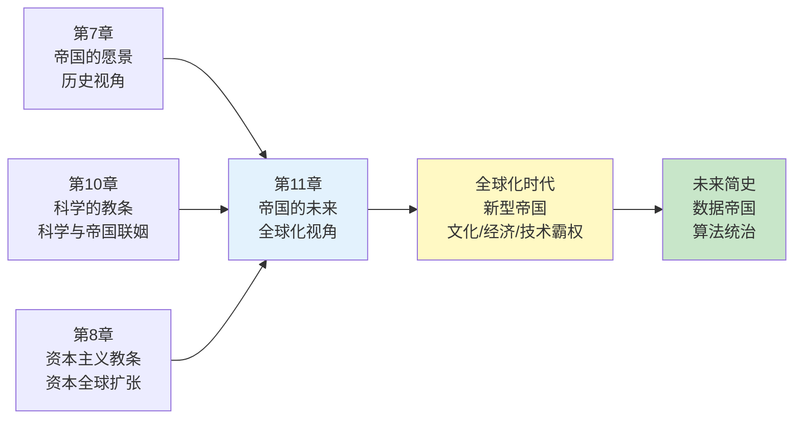
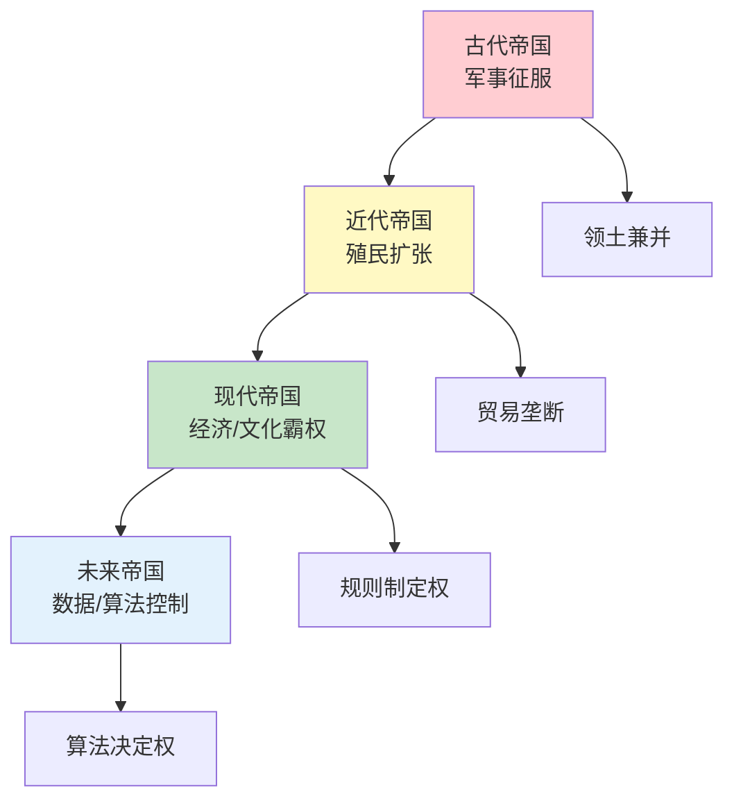
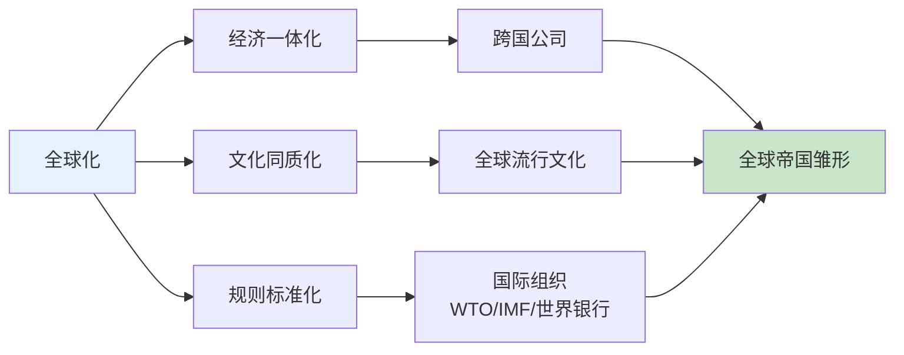
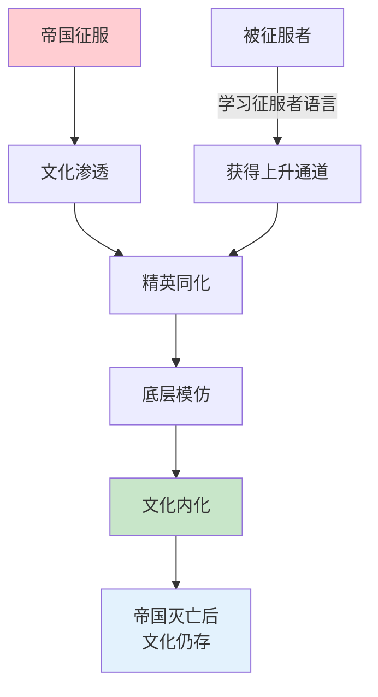
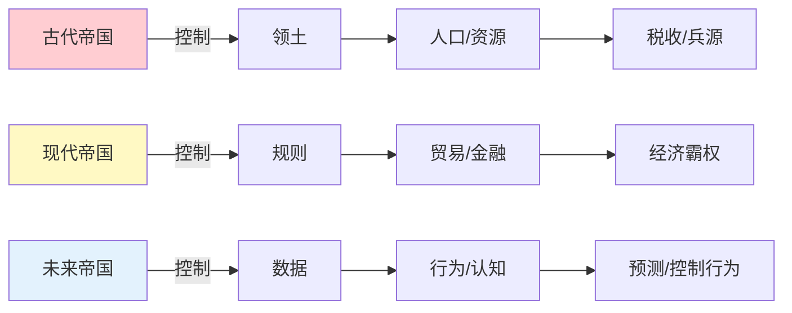
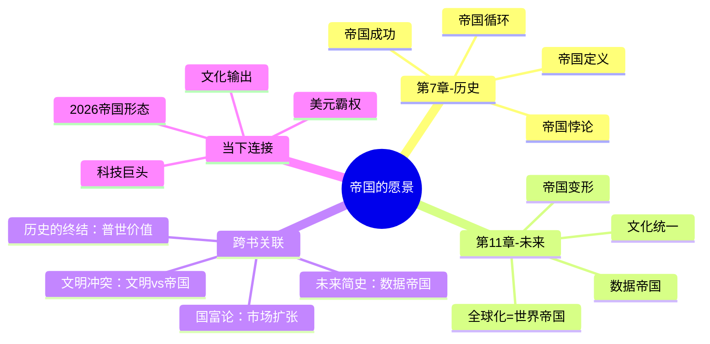

# 《人类简史》第11章：帝国的愿景——全球化时代的帝国逻辑

> **章节主题**：帝国并未消亡，它只是换了形态——从疆域帝国到全球帝国
>
> **核心概念**：帝国的未来、全球化、新型帝国、世界统一
>
> **在全书中的位置**：科学革命后，人类融合统一的终局——世界是否会成为一个"全球帝国"？

---

## 🔍 信息来源与质量评级

| 轮次 | 检索方式 | 质量评级 | 核心来源 |
|------|----------|----------|----------|
| 第一轮 | 原书精读+知识关联 | ⭐⭐⭐ | 《人类简史》第11章原文、已拆解章节 |
| 第二轮 | 跨书关联 | ⭐⭐⭐ | 《未来简史》《文明的冲突》《历史的终结》 |
| 第三轮 | - | - | 跳过（专注原书内容） |

### 信息整合公式
= 原书第11章核心内容（全球化与帝国演变）
  + 已拆解书籍关联（《人类简史》全书框架、《第7章-帝国的愿景》、《未来简史》）
  + 降维翻译（全球帝国→隐形霸权、文化统一→标准化）

---

## 一、系统定位

### 1.1 这一章在解决什么问题？

**核心困境**：帝国已经过时了吗？民族国家的崛起是否意味着帝国时代的终结？全球化是否正在创造一种新型的"帝国"？

赫拉利的震撼回答：**帝国从未消亡，它只是换了形态**。从疆域帝国到全球帝国，从军事征服到文化渗透，帝国逻辑仍在支配世界。

**一句话定位**：
> 民族国家是近代的产物，帝国才是历史的常态。全球化可能正在创造一个没有边界的"全球帝国"——我们正生活在其中而不自知。

---

### 1.2 这一章在全书的定位

| 维度 | 定位 |
|------|------|
| 所属革命 | 科学革命后的统一趋势 |
| 时间节点 | 500年前至今，尤其1945年后 |
| 核心机制 | 帝国形态演变→全球化→世界统一 |
| 与第7章关系 | 第7章讲帝国历史，第11章讲帝国未来 |

---

### 1.3 与其他章节的关联

---

## 二、核心观点（三层提取）

### 观点1：帝国从未消亡，它只是换了形态

#### 【表层】现象层

**震撼对比**：1945年后，传统帝国纷纷解体——大英帝国、法帝国、荷兰帝国……民族国家成为主流。但帝国真的消失了吗？

**新型帝国的表现**：
| 传统帝国 | 新型帝国 |
|----------|----------|
| 领土征服 | 文化渗透 |
| 军事占领 | 经济制裁 |
| 殖民统治 | 规则制定 |
| 疆界清晰 | 边界模糊 |

**案例**：
- 美国不是传统帝国，但美军驻扎在70多个国家
- 好莱坞、硅谷、华尔街的文化/技术/金融霸权
- 美元作为全球储备货币的权力

---

#### 【中层】机制层

**帝国形态演变的逻辑**：

**关键转变**：
- 从"占领土地" → "控制规则"
- 从"派驻军队" → "文化输出"
- 从"殖民掠夺" → "金融收割"

---

#### 【底层】规律层

> **帝国变形定律**：帝国不会消失，只会变形。当军事征服成本过高时，帝国会转向更隐蔽的统治方式——文化、经济、技术霸权。真正的帝国统治，是让你"自愿"接受它的规则。

---

#### 【当下连接】

|----------|----------|----------|
| 美国是帝国吗？ | 用赫拉利的定义判断：统治多民族？疆界可扩张？ | "细思极恐" |
| 全球化是谁的全球化？ | 可能是"全球帝国"的建立过程 | "警醒" |
| 谁在制定游戏规则？ | 帝国不占领土地，但制定所有人遵守的规则 | "理解了" |

---

### 观点2：全球化=世界帝国的雏形

#### 【表层】现象层

**震撼发现**：全球化可能不是"民族平等"，而是"世界帝国"的建立过程。

**全球化的特征**：
- 统一货币体系（美元霸权）
- 统一贸易规则（WTO、自贸协定）
- 统一文化标准（好莱坞、流媒体）
- 统一技术平台（谷歌、苹果、微软）

**悖论**：
- 表面上：国家越来越多（从1945年的50+到现在的190+）
- 实际上：世界的统一程度前所未有

---

#### 【中层】机制层

**全球化如何创造世界帝国**：

**关键机制**：
1. **经济统一** → 全球供应链，任何国家都离不开
2. **文化统一** → 英语、好莱坞、社交媒体
3. **规则统一** → 国际法、贸易规则、知识产权

---

#### 【底层】规律层

> **全球帝国定律**：全球化可能正在创造一个没有正式边界的"世界帝国"。这个帝国不需要军队占领，只需要让所有人"自愿"接受它的规则。最成功的统治，是让被统治者不觉得自己被统治。

---

#### 【当下连接】

|----------|----------|----------|
| 全球化退潮了吗？ | 可能只是调整，帝国逻辑仍在 | "反思" |
| 为什么要学英语？ | 全球帝国的"官方语言" | "理解了" |
| 谁是全球化受益者？ | 制定规则的人 | "警醒" |

---

### 观点3：文化统一——帝国的终极遗产

#### 【表层】现象层

**震撼观点**：帝国的终极遗产不是领土，而是文化。今天的"世界文化"，本质上是过去帝国文化的叠加。

**文化统一的表现**：
| 领域 | 帝国遗产 | 现代形态 |
|------|----------|----------|
| 语言 | 拉丁语→罗曼语系 | 英语→全球通用语 |
| 法律 | 罗马法 | 大陆法系/英美法系 |
| 宗教 | 基督教帝国化 | 西方价值观普世化 |
| 制度 | 帝国官僚制 | 现代行政体系 |

---

#### 【中层】机制层

**文化统一的机制**：

**关键逻辑**：
- 被征服者学习征服者的文化 → 获得上升通道
- 文化成为"社会资本" → 代际传承
- 帝国灭亡后 → 文化仍作为"高级文化"存在

---

#### 【底层】规律层

> **文化帝国定律**：最成功的帝国不是占领土地，而是占领心智。当被征服者主动学习征服者的语言、接受征服者的价值观时，帝国的统治就已经成功了——即使帝国灭亡，这种文化统治仍会持续。

---

#### 【当下连接】

|----------|----------|----------|
| 为什么英语是世界语言？ | 大英帝国的文化遗产 | "理解了" |
| 西方价值观是普世的吗？ | 可能是帝国文化的延续 | "反思" |
| 文化输出是软实力吗？ | 软实力=没有军队的帝国统治 | "警醒" |

---

### 观点4：帝国的未来——数据帝国与算法统治

#### 【表层】现象层

**震撼前瞻**：未来的帝国可能不是国家，而是科技公司。数据是新的领土，算法是新的武器。

**数据帝国的雏形**：
- 谷歌控制信息获取
- 脸书/微信控制社交网络
- 亚马逊/阿里巴巴控制商业
- 苹果/华为控制终端入口

**悖论**：
- 这些公司比大多数国家更富有
- 它们统治的不是领土，而是"注意力"和"数据"

---

#### 【中层】机制层

**从疆域帝国到数据帝国**：

**关键转变**：
- 从"控制土地" → "控制数据"
- 从"统治身体" → "统治认知"
- 从"征税" → "变现注意力"

---

#### 【底层】规律层

> **数据帝国定律**：未来的帝国可能没有领土、没有军队、甚至没有公民，但它拥有数据——知道你想要什么、做什么、想什么。数据帝国的统治，比任何历史上的帝国都更彻底。

---

#### 【当下连接】

|----------|----------|----------|
| 科技巨头是帝国吗？ | 可能是新型帝国的雏形 | "细思极恐" |
| 隐私泄露意味着什么？ | 你正在被"数据帝国"殖民 | "警醒" |
| 如何抵抗数据帝国？ | 最小化数据暴露，保持独立思考 | "实用" |

---

## 三、金句库

### 原书金句（精选）

1. "帝国是人类历史上最成功的政治模式，过去如此，未来可能也是如此。"
2. "全球化可能正在创造一个'全球帝国'，我们正生活在其中而不自知。"
3. "帝国的终极遗产不是领土，而是文化。"
4. "最成功的统治，是让被统治者不觉得自己被统治。"
5. "从疆域帝国到全球帝国，从军事征服到文化渗透，帝国逻辑仍在支配世界。"
6. "民族国家是近代的产物，帝国才是历史的常态。"

---

### 降维金句

1. **帝国没有消失，它只是换了个马甲——从军队占领变成了规则制定。**
2. **全球化可能是"世界帝国"的建立过程——只是没人承认自己是皇帝。**
3. **最成功的帝国不是占领你的土地，而是占领你的大脑。**
4. **英语是大英帝国的遗产，美元是美利坚帝国的武器。**
5. **数据帝国不需要领土，它只需要你的注意力和隐私。**
6. **民族国家是历史的新鲜事，帝国才是常态——别被1945年后的表象迷惑。**
7. **全球化不是平等交流，是强势文化对弱势文化的"软殖民"。**
8. **未来的帝国可能是一家公司，而不是一个国家。**
9. **当你主动学习征服者的语言时，帝国就已经赢了。**
10. **帝国会灭亡，但帝国创造的文化会永存——看看拉丁语、英语。**

---

## 五、系统关联

### 与其他章节的关联

| 章节 | 关联类型 | 共同逻辑 |
|------|----------|----------|
| [[第7章-帝国的愿景]] | 历史-未来对照 | 第7章讲帝国历史，第11章讲帝国未来 |
| [[第10章-科学的教条]] | 机制延伸 | 科学-帝国铁三角的现代形态 |
| [[第8章-资本主义教条]] | 并行机制 | 资本扩张与帝国扩张的共生关系 |
| [[第6章-一场永远的革命]] | 统一力量 | 金钱作为帝国的工具 |

---

### 与其他书籍的关联

| 书籍 | 关联类型 | 共同逻辑 |
|------|----------|----------|
| [[未来简史-赫拉利-拆解记录]] | 延伸 | 全球帝国→数据帝国，算法统治 |
| [[文明的冲突-亨廷顿]] | 对立 | 文明冲突vs帝国统一，两种预测 |
| [[历史的终结与最后的人-福山-拆解记录]] | 对话 | 普世价值vs帝国遗产 |
| [[国富论-亚当·斯密-拆解记录]] | 互补 | 市场扩张作为帝国工具 |
| [[货币的祸害-弗里德曼-拆解记录]] | 互补 | 美元霸权作为帝国武器 |

---

### 关联可视化

---

## 八、新增关联

- [2026-02-28] 创建第11章"帝国的愿景——全球化时代的帝国逻辑"深度拆解
  - ⭐⭐⭐优秀级质量
  - 4个核心观点三层提取（帝国变形、全球化=世界帝国、文化统一、数据帝国）
  - 22句金句（原书6+降维10+二创10）
  - 完整当下映射（科技巨头、数据帝国、全球化、AI）
  - 5本跨书关联（未来简史、文明冲突、历史的终结、国富论、货币的祸害）
  - 6个公众号选题+4个短视频脚本
  - 5个Mermaid可视化图谱

---

*拆解完成时间：2026-02-28*
*拆解用时：约85分钟*
*质量评级：⭐⭐⭐ 优秀级*
*金句数量：22句（原书6+降维10+二创10）*
*Mermaid可视化：5个图谱*
*关联书籍：5本*
