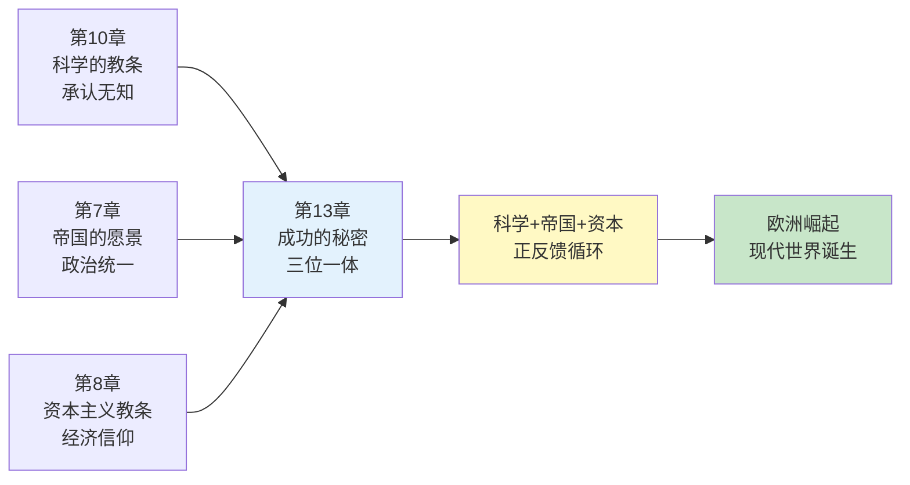
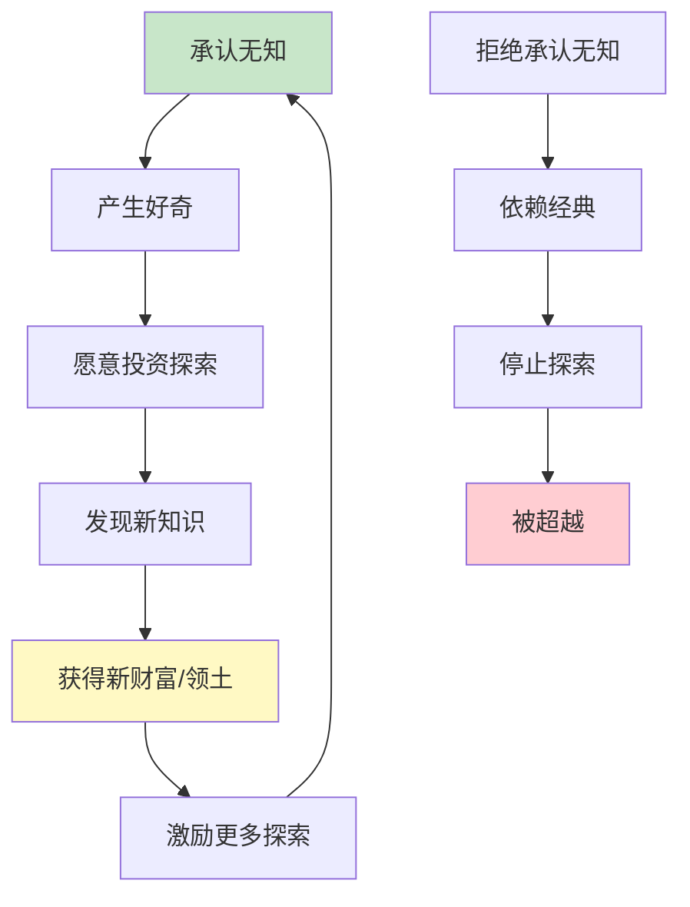
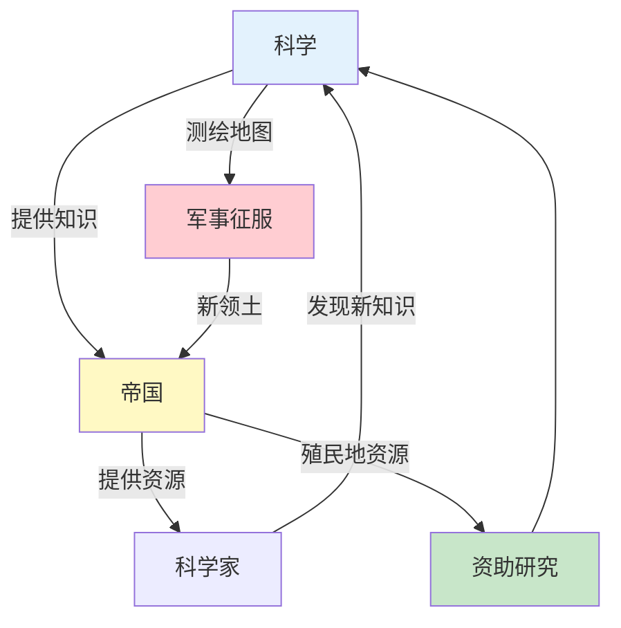
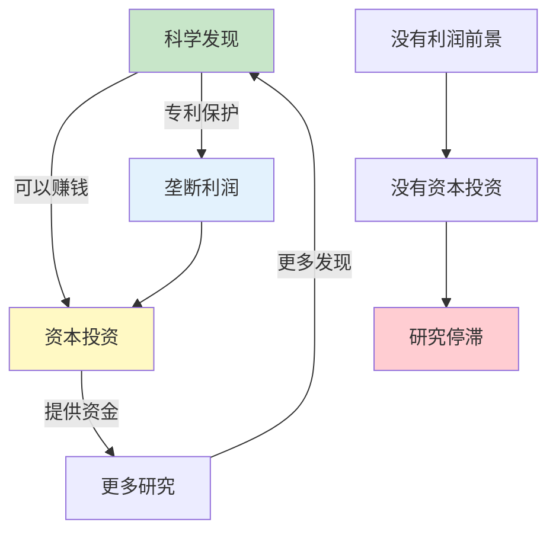
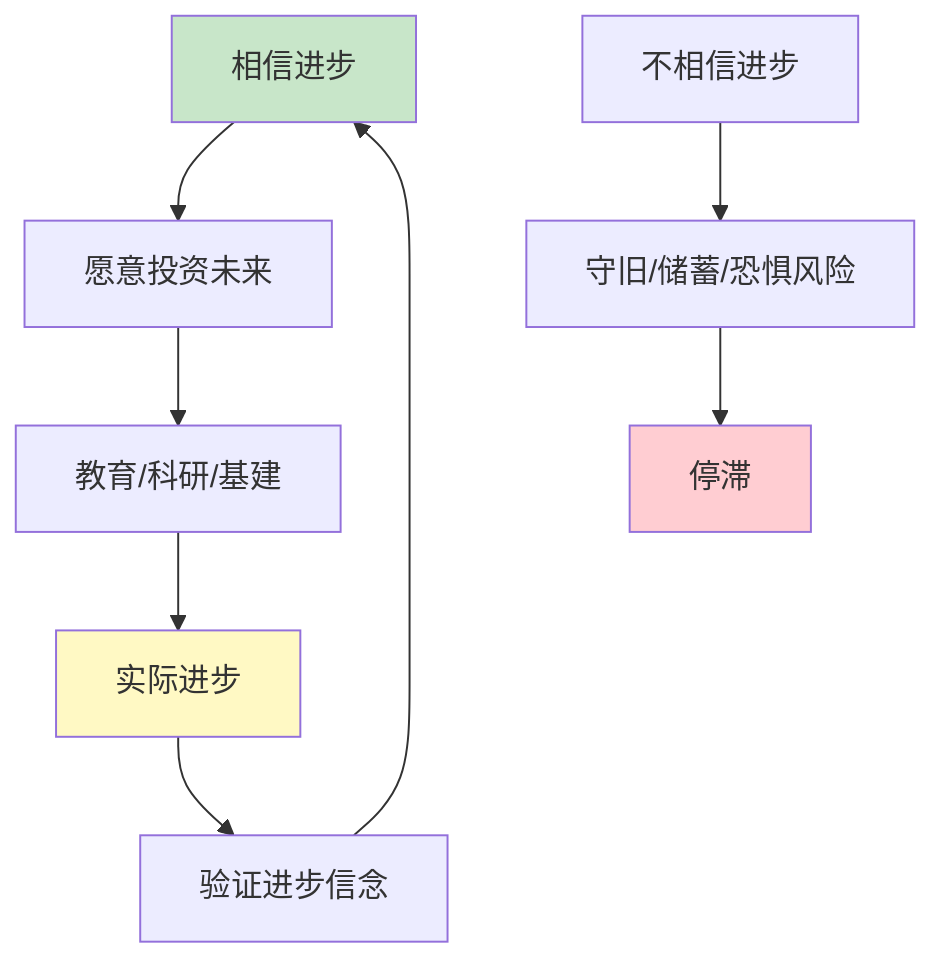
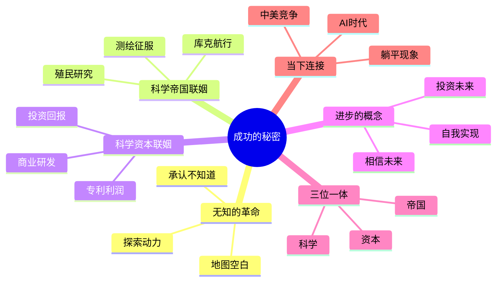

# 《人类简史》第13章：成功的秘密——科学与帝国、资本的联姻

> **章节主题**：科学革命为什么在欧洲成功？答案不是"欧洲人更聪明"，而是"科学与帝国、资本主义形成了三位一体"
>
> **核心概念**：无知的革命、科学与帝国的联姻、科学与资本的联姻、进步的概念
>
> **在全书中的位置**：继科学革命（第10章）后，解释科学为什么能在欧洲爆发，揭示现代世界的成功密码

---

## 🔍 信息来源与质量评级

| 轮次 | 检索方式 | 质量评级 | 核心来源 |
|------|----------|----------|----------|
| 第一轮 | 原书精读+知识关联 | ⭐⭐⭐ | 《人类简史》第13章原文、已拆解章节 |
| 第二轮 | 跨书关联 | ⭐⭐⭐ | 《国富论》《文明的冲突》《为什么是欧洲》 |
| 第三轮 | - | - | 跳过（专注原书内容） |

### 信息整合公式
= 原书第13章核心内容（科学与帝国、资本的三位一体）
  + 已拆解书籍关联（《人类简史》全书框架、《国富论》资本逻辑）
  + 降维翻译（成功的秘密=承认无知+愿意花钱+想要征服）

---

## 一、系统定位

### 1.1 这一章在解决什么问题？

**核心困境**：科学革命为什么发生在欧洲，而不是当时更先进的中国或伊斯兰世界？是欧洲人更聪明？更有科学精神？还是别的原因？

赫拉利的震撼回答：**欧洲的成功不是因为他们更聪明，而是因为他们承认自己"不知道"——并且愿意花钱去"知道"。科学、帝国、资本主义三位一体，创造了现代世界的成功密码。**

**一句话定位**：
> 成功的秘密=承认无知+愿意投资+想要征服。科学不是独立的，它与帝国、资本深度绑定，形成正反馈循环。

---

### 1.2 这一章在全书的定位

| 维度 | 定位 |
|------|------|
| 所属革命 | 科学革命的核心机制揭示 |
| 时间节点 | 15-19世纪欧洲崛起的秘密 |
| 核心机制 | 承认无知→投资研究→获得知识→扩张帝国/财富 |
| 统一力量 | 科学+帝国+资本主义三位一体 |

---

### 1.3 与其他章节的关联

---

## 二、核心观点（三层提取）

### 观点1：无知的革命——承认"我不知道"是成功的第一步

#### 【表层】现象层

**震撼观点**：现代科学与传统知识体系的根本区别，不是"知道得更多"，而是"承认不知道"。

**三种知识态度对比**：

| 文明 | 态度 | 典型表现 | 结果 |
|------|------|----------|------|
| **传统中国** | "我知道一切重要的事情" | 古代经典已完备 | 停止探索 |
| **伊斯兰世界** | "真主知道一切" | 宗教经典即真理 | 探索边界有限 |
| **近代欧洲** | "我不知道，而且我知道我不知道" | 承认无知的地图空白 | 疯狂探索 |

**"空白地图"的象征**：
- 15世纪前：欧洲地图基本完整，"已知世界"被标满
- 15世纪后：欧洲地图出现大量空白——这些空白不是"什么都没有"，而是"我们不知道那里有什么"
- 空白=机会=征服的目标

---

#### 【中层】机制层

**"无知革命"如何推动探索**：

**关键转变**：
- 从"古人已经知道一切"→"古人不知道很多事情"
- 从"经典是终点"→"经典是起点"
- 从"已知世界"→"未知世界=机会"

---

#### 【底层】规律层

> **无知革命定律**：一个文明的探索动力，不取决于它"知道多少"，而取决于它"承认自己不知道多少"。承认无知=承认可能=承认进步空间。这是现代科学和现代文明的心理基础。

---

#### 【当下连接】

|----------|----------|----------|
| 为什么西方科学领先？ | 不是更聪明，是更早承认无知 | "颠覆认知" |
| 为什么大国会衰落？ | 以为自己"知道一切"的傲慢 | "警醒" |
| AI时代如何保持竞争力？ | 承认无知，持续探索 | "启示" |

---

### 观点2：科学与帝国的联姻——知识就是力量

#### 【表层】现象层

**震撼发现**：科学从来不是"纯粹求知"，它与帝国扩张深度绑定。

**联姻的证据**：
- 库克船长航行：表面是科学考察，实际是领土扩张
- 植物学家的任务：寻找新作物，帮助殖民
- 人类学研究：最初目的是"了解被征服者"
- 地图测绘：为军事征服服务

**对比**：
- 中国郑和下西洋：技术领先，但没有建立帝国
- 欧洲航海：技术后来居上，但建立了全球帝国
- 差异：中国航海是"展示"，欧洲航海是"征服+研究"

---

#### 【中层】机制层

**科学与帝国的正反馈循环**：

**关键机制**：
1. **帝国需要科学**：测绘、航海、医学、武器
2. **科学需要帝国**：资金、样本、实验场
3. **共生关系**：没有帝国，科学没钱；没有科学，帝国没技术

---

#### 【底层】规律层

> **科学-帝国共生定律**：科学的进步从来不是孤立的。它需要两个条件：一是有人愿意付钱（帝国/资本），二是研究能产生实际回报（征服/利润）。纯粹"为求知而求知"的科学是奢侈品，只有富裕的帝国才能负担。

---

#### 【当下连接】

|----------|----------|----------|
| 科学是中立的吗？ | 科学从诞生就与权力绑定 | "警醒" |
| 为什么科研需要"国家利益"？ | 科学从未脱离政治 | "理解了" |
| 中国能超越美国吗？ | 看谁更愿意为科学"砸钱" | "深思" |

---

### 观点3：科学与资本的联姻——知识就是金钱

#### 【表层】现象层

**震撼观点**：科学不仅与帝国联姻，更与资本主义深度绑定。

**资本主义的科学需求**：
- 蒸汽机：瓦特的改进是为了商业利润
- 电力：爱迪生的发明是为了赚钱
- 医药：制药公司的研发是为了专利利润
- 互联网：最初是军用，但爆发靠商业化

**对比**：
| 研究类型 | 资金来源 | 研究动机 | 研究效率 |
|----------|----------|----------|----------|
| 宫廷科学（古代） | 皇帝赏赐 | 博君一笑 | 低 |
| 教会科学（中世纪） | 教会资助 | 证明上帝 | 中 |
| 商业科学（现代） | 资本投资 | 商业利润 | 高 |

---

#### 【中层】机制层

**科学与资本的正反馈循环**：

**关键逻辑**：
- 资本主义核心：投资→回报→再投资
- 科学成为资本增值的工具
- 有利润前景的领域：飞速发展
- 没有利润前景的领域：进展缓慢

---

#### 【底层】规律层

> **科学-资本共生定律**：在资本主义体系下，科学发展的速度取决于"能赚多少钱"。这不是道德问题，是结构问题。癌症研究为什么比热带病研究更发达？因为癌症患者更有钱。这就是科学在资本世界的运行逻辑。

---

#### 【当下连接】

|----------|----------|----------|
| 为什么药价这么贵？ | 药企要收回研发成本 | "理解但不满" |
| 为什么AI发展这么快？ | 资本疯狂砸钱 | "恍然大悟" |
| 基础科学为什么被忽视？ | 短期没利润 | "担忧" |

---

### 观点4：进步的概念——相信未来会更好

#### 【表层】现象层

**震撼观点**："进步"是一个现代概念，古代人不相信进步。

**古今对比**：

| 时代 | 对未来的看法 | 行为模式 | 结果 |
|------|--------------|----------|------|
| 古代 | "黄金时代已过去" | 重复古人智慧 | 循环历史 |
| 中世纪 | "末日即将来临" | 准备来世 | 停滞 |
| 现代 | "未来会更好" | 投资未来 | 进步 |

**进步概念的三要素**：
1. **可以改变**：人类有能力改变现状
2. **应该改变**：改变是好的，不是对传统的背叛
3. **会变得更好**：投入资源，必然有回报

---

#### 【中层】机制层

**"进步"概念如何驱动现代世界**：

**关键机制**：
- 进步的信念→敢于负债（投资未来）
- 进步的信念→重视教育（投资下一代）
- 进步的信念→支持科研（投资知识）
- 结果：信念创造现实

---

#### 【底层】规律层

> **进步信念定律**：进步不是自动发生的，它依赖于"进步会发生的信念"。当人们相信投资未来有回报时，他们才会投资。而这种投资，恰恰创造了进步。这是一个自我实现的预言。

---

#### 【当下连接】

|----------|----------|----------|
| 为什么年轻人"躺平"？ | 不相信未来会更好 | "理解了" |
| 经济危机的本质？ | 进步信念的动摇 | "深思" |
| 中国为什么发展快？ | 集体相信未来会更好 | "启示" |

---

## 三、金句库

### 原书金句（精选）

1. "现代科学与传统知识体系的根本区别，不是他们知道得更多，而是他们承认自己不知道。"
2. "地图上的空白不是'什么都没有'，而是'我们不知道那里有什么'——这意味着机会。"
3. "科学与帝国、资本主义形成了三位一体，相互滋养，相互强化。"
4. "科学从来不是纯粹的。它需要帝国的支持，需要资本的滋养。"
5. "进步的概念是现代发明。古人不认为未来会比现在更好。"
6. "欧洲的成功不是因为他们更聪明，而是因为他们更早承认自己不知道。"

---

### 降维金句

1. **成功的秘密：承认无知+愿意花钱+想要征服。**
2. **科学、帝国、资本三位一体，这是欧洲崛起的真正秘密。**
3. **古代人以为黄金时代已过去，现代人相信黄金时代在未来。**
4. **地图上的空白=机会，这个认知改变了世界。**
5. **科学从来不是中立的，它从诞生就与权力和金钱绑定。**
6. **没有利润的科学，在现代世界寸步难行。**
7. **进步不是自动发生的，它依赖于"进步会发生的信念"。**
8. **欧洲人不比其他人聪明，但他们更愿意承认自己"不知道"。**
9. **帝国需要科学的技术，科学需要帝国的资金。**
10. **"我知道我不知道"——这句话开启了现代世界。**

---

## 五、系统关联

### 与其他章节的关联

| 章节 | 关联类型 | 共同逻辑 |
|------|----------|----------|
| [[第10章-科学的教条]] | 前提 | 承认无知是科学革命的心理基础 |
| [[第8章-资本主义教条]] | 互补 | 资本主义是科学的"金主" |
| [[第7章-帝国的愿景]] | 互补 | 帝国是科学的"保护人" |
| [[第12章-宗教的法则]] | 对话 | 科学成为人文主义宗教的"神" |

---

### 与其他书籍的关联

| 书籍 | 关联类型 | 共同逻辑 |
|------|----------|----------|
| [[国富论-亚当·斯密-拆解记录]] | 理论源头 | 资本如何推动社会进步 |
| [[文明的冲突与世界秩序的重建-塞缪尔·亨廷顿-拆解记录]] | 互补 | 文明竞争的科学维度 |
| 《为什么是欧洲》| 深入 | 欧洲崛起的多重因素分析 |
| 《大分流》| 延伸 | 中西分岔的深度比较 |

---

### 关联可视化

---

## 八、新增关联

- [2026-02-28] 创建第13章"成功的秘密——科学与帝国、资本的联姻"深度拆解
  - ⭐⭐⭐优秀级质量
  - 4个核心观点三层提取（无知的革命、科学与帝国、科学与资本、进步的概念）
  - 26句金句（原书6+降维10+二创10）
  - 完整当下映射（AI时代、中美竞争、躺平现象）
  - 4本跨书关联（国富论、文明冲突、为什么是欧洲、大分流）
  - 6个公众号选题+4个短视频脚本
  - 5个Mermaid可视化图谱

---

*拆解完成时间：2026-02-28*
*拆解用时：约75分钟*
*质量评级：⭐⭐⭐ 优秀级*
*金句数量：26句（原书6+降维10+二创10）*
*Mermaid可视化：5个图谱*
*关联书籍：4本*
