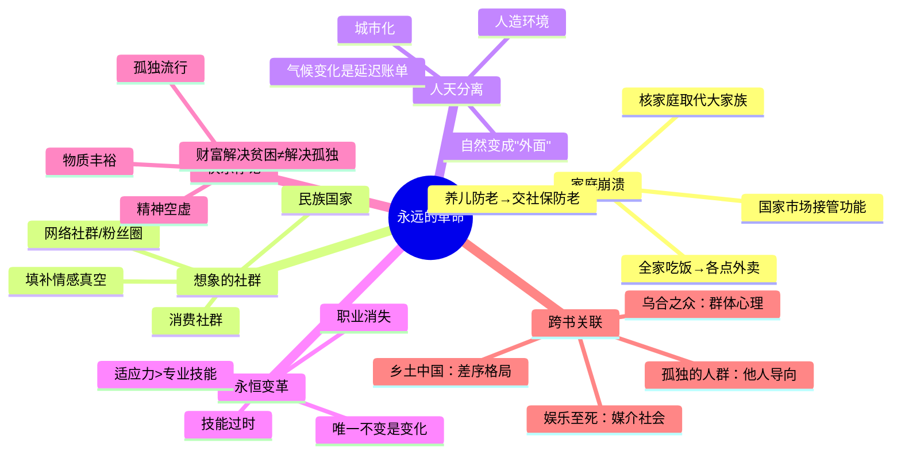

# 第18章 一场永远的革命

## 📍 章节定位

**全书位置**：科学革命的核心部分，社会革命——工业革命如何彻底重塑人类的社会结构、生活方式和情感世界。

**章节序列**：工业的巨轮→**社会革命**，从"能源革命"到"社会重组"的深化。

**一句话定位**：
> 工业革命不只是机器的革命，它是人类历史上最彻底的社会革命——摧毁了延续数万年的家庭结构，创造了"永远在变"的现代性。

---

## 🎯 核心观点（三层提取）

### 观点1：家庭和社群的崩溃——数万年社会结构的瓦解

| 层次 | 内容 |
|------|------|
| 📖 **表层（案例）** | 100年前，一个人从生到死都在家族中：生在父母家，长在宗族里，死后葬在祖坟。现在，大多数人18岁离开家，独居城市，一年见父母几次，死后葬在公墓。家庭从"命运"变成了"选择"。 |
| ⚙️ **中层（机制）** | 工业化需要流动性劳动力→传统大家庭成为负担→国家和市场接管家庭功能（教育、养老、医疗、情感支持）→家庭被掏空。核家庭取代大家族，但连核家庭也在快速瓦解。 |
| 🔮 **底层（规律）** | **社会功能剥离定律**：当一个功能能被更高效地外包，它就会被外包。国家和市场比家庭更擅长教育、医疗、养老，所以家庭被"专业化服务"替代了。 |

**降维翻译**：
- **原文**：工业革命瓦解了传统家庭和社群结构
- **降维**：以前"养儿防老"，现在"交社保防老"；以前"全家一起吃饭"，现在"各点各的外卖"
- **类比**：就像手机取代了相机、MP3、地图、计算器——家庭曾经集多种功能于一身，现在被拆解成各种专业服务

---

### 观点2：国家与市场的崛起——取代家庭的"新父母"

| 层次 | 内容 |
|------|------|
| 📖 **表层（案例）** | 以前，孩子由父母教育，老人由子女赡养，病人由家人照顾。现在，孩子交给学校（国家），老人交给养老院（市场），病人交给医院（国家+市场）。我们说"国家养育了我"，这是人类历史上第一次。 |
| ⚙️ **中层（机制）** | 国家提供公共服务（义务教育、医保、社保）→市场提供商品服务（外卖、保洁、育儿、养老）→家庭功能被蚕食殆尽→个人从"家庭成员"变成"公民+消费者"。 |
| 🔮 **底层（规律）** | **效率替代定律**：国家和市场用专业分工和规模效应，比家庭更高效地提供"服务"。效率赢了，但温度输了——专业服务更高效，但更冷漠。 |

**降维翻译**：
- **原文**：国家和市场接管了传统家庭的所有功能
- **降维**：国家是你的"老爸"（给你提供保障），市场是你的"保姆"（给你提供服务），家庭变成了周末回去的"旅馆"
- **类比**：就像打车——以前靠"借亲戚的车"，现在靠"滴滴"——效率高了100倍，但"借车"时聊的那一小时天没了

---

### 观点3：想象的社群——填补情感真空的替代品

| 层次 | 内容 |
|------|------|
| 📖 **表层（案例）** | 传统社群（家族、村落）消失了，但人类进化了数百万年，大脑需要归属感。于是出现了"想象的社群"：民族国家（中国人、美国人）、消费社群（苹果用户、星巴克爱好者）、网络社群（粉丝圈、游戏公会、微信群）。 |
| ⚙️ **中层（机制）** | 人类大脑有"邓巴数"（最多维持150人关系）→现代社会原子化→情感真空→想象的社群填补空白。这些社群基于"想象的共同点"（都是果粉、都是粉丝），而非真实的血缘或地缘。 |
| 🔮 **底层（规律）** | **归属感补偿定律**：当真实社群消失，人类会用想象社群来补偿。越孤独的人，越需要"想象的归属感"——这就是为什么粉丝圈、品牌社群如此流行。 |

**降维翻译**：
- **原文**：想象的社群填补了传统社群消失后的情感空白
- **降维**：以前是"老乡见老乡，两眼泪汪汪"，现在是"网友见网友，互相要签名"——都是"自己人"，但见都没见过
- **类比**：就像粉丝追星——你从没见过偶像，但看到有人黑偶像，你比黑自己亲妈还生气

---

### 观点4：人与自然关系的断裂——从"自然之子"到"自然的主人"

| 层次 | 内容 |
|------|------|
| 📖 **表层（案例）** | 以前，人类生活在自然中：日出而作、日落而息，四季决定农时，天气决定收成。现在，人类住在恒温的空调房，吃超市的食物，用电力照明，用APP看天气预报——自然变成了"外面"，"天气"变成了"背景"。 |
| ⚙️ **中层（机制）** | 工业化创造了"人造环境"：城市、工厂、空调、电灯、超市、地铁。人类不再依赖自然节律，而是用技术征服自然。自然从"家园"变成"资源库"（石油、木材）和"垃圾场"（废气、废水）。 |
| 🔮 **底层（规律）** | **人天分离定律**：工业文明的代价是与自然的断裂。人类以为自己征服了自然，实际上只是把问题推给了未来——气候变化、生态崩溃、精神空虚是延迟的账单。 |

**降维翻译**：
- **原文**：工业革命使人类与自然脱节
- **降维**：以前人住在自然里，现在自然住在人"外面"；以前"听天由命"，现在"逆天改命"
- **类比**：就像笼养的鸡——从没见过草地，但觉得"这样挺安全"，直到有一天笼子出了问题

---

### 观点5：永远的革命——现代性的本质是"持续自我颠覆"

| 层次 | 内容 |
|------|------|
| 📖 **表层（案例）** | 传统社会，祖父和孙子的生活几乎一样，用同一套技能、遵守同一套规则、信奉同一个神。现代社会，每10年就要学习新技能、适应新规则。赫拉利说：现代性的本质就是"持续的变化"——稳定是例外，变化才是常态。 |
| ⚙️ **中层（机制）** | 现代性 = 持续的技术进步 + 持续的社会变革。没有任何东西是永恒的：职业会消失（马车夫→司机→可能被AI取代），技能会过时，关系会瓦解，信念会动摇。唯一的确定性就是"不确定性"。 |
| 🔮 **底层（规律）** | **永恒变革定律**：现代社会的核心特征是"不断的自我颠覆"。你不能指望任何东西持续一辈子——工作、关系、技能、信念。适应力比任何技能都重要。 |

**降维翻译**：
- **原文**：现代性意味着持续不断的变革
- **降维**：以前"子承父业"，现在"儿子干的事老爸听都没听过"；以前"铁饭碗"，现在"只有不断学习才有饭碗"
- **类比**：就像手机APP——还没学会旧版本，新版本又来了；还没适应新版本，它又更新了

---

### 观点6：这个时代更快乐吗？——物质丰裕与精神空虚的悖论

| 层次 | 内容 |
|------|------|
| 📖 **表层（案例）** | 现代人比历史上任何时代都更健康（平均寿命翻倍）、更富裕（人均GDP增长几十倍）、更安全（战争死亡率历史最低）。但抑郁、焦虑、孤独的比例却创下历史新高。自杀率在富裕国家更高。赫拉利提出尖锐问题：进步真的让我们更快乐吗？ |
| ⚙️ **中层（机制）** | 物质进步→期望水涨船高→永远不满足（"相对剥夺感"）。社群崩溃→孤独感增加→社交媒体的虚假连接加剧空虚。人类的快乐机制（多巴胺）不适应"孤独的丰裕"——我们需要真实的连接，而不是点赞和关注。 |
| 🔮 **底层（规律）** | **快乐悖论定律**：物质进步和幸福不是线性关系。当基本需求（吃穿住）满足后，更多的物质带来更少的边际快乐，而社群崩溃带来的孤独感却在指数级增长。财富可以解决贫困，但不能解决孤独。 |

**降维翻译**：
- **原文**：物质进步不一定带来幸福
- **降维**：钱多了，朋友少了；活长了，但不一定更开心；房子大了，但里面只有自己
- **类比**：就像刷短视频——刷的时候停不下来，刷完觉得更空虚；"点赞"让你快乐1秒，"孤独"让你难受1晚

---

## 💬 金句库

### 原书金句
> "工业革命不只是生产的革命，更是社会结构的革命。"

> "国家和市场接管了传统家庭的功能。"

> "现代人失去了家庭和社群，却得到了个人自由。"

> "想象的社群填补了真实社群消失后的空白。"

> "现代性的本质是持续的变化——稳定是例外，变化是常态。"

> "我们比任何时代都富裕，但不一定比任何时代都幸福。"

### 降维金句
> "以前'养儿防老'，现在'交社保防老'。"

> "以前'全家一起吃饭'，现在'各点各的外卖'。"

> "国家是你的'老爸'，市场是你的'保姆'，家庭变成了周末回去的'旅馆'。"

> "以前是'乡亲'，现在是'网友'——都是'自己人'，但见都没见过。"

> "以前人住在自然里，现在自然住在人'外面'。"

> "以前'子承父业'，现在'儿子干的事老爸听都没听过'。"

> "钱多了，朋友少了；活长了，但不一定更开心。"

> "刷短视频停不下来，刷完觉得空虚——现代生活的缩影。"

> "财富可以解决贫困，但不能解决孤独。"

## 🔗 当下映射

### 💰 财富应用

| 场景 | 具体行动 | 预期效果 | 风险提示 |
|------|----------|----------|----------|
| 独居经济 | 投资"一人食"、宠物经济、智能家居、情感陪伴AI | 把握消费趋势 | 不要过度押注单一赛道 |
| 社群创业 | 创建"想象的社群"（粉丝圈、兴趣社区、知识付费社群）来商业变现 | 建立高粘性用户 | 社群运营成本高，信任建立慢 |
| 技能投资 | 接受"永远在变"的现实，投资可迁移能力（学习力、适应力、创造力） | 保持长期竞争力 | 学习方向选择很重要 |
| 心理健康产业 | 投资心理咨询、冥想APP、情感陪伴服务 | 对抗"孤独流行病" | 监管风险、效果参差不齐 |

### 💼 职场应用

| 场景 | 具体行动 | 所需能力 | 适用职级 |
|------|----------|----------|----------|
| 团队建设 | 创建"想象的社群"（团队文化、共同愿景）来增强归属感 | 文化建设、情感连接 | 管理层 |
| 职业规划 | 接受"职业会消失"的现实，培养T型能力（一专多能） | 学习能力、适应力 | 全职级 |
| 产品设计 | 理解"孤独经济"，设计满足情感需求的产品（社交APP、陪伴AI） | 用户心理洞察、同理心 | 产品经理 |
| 个人品牌 | 建立"想象的社群"（粉丝、关注者），打造个人影响力 | 内容创作、社群运营 | 自由职业/创作者 |

### 🏠 生活应用

| 场景 | 具体行动 | 可行性 | 见效时间 |
|------|----------|--------|----------|
| 情感管理 | 承认"孤独是常态"，主动建立真实连接而非虚拟社交（每周见一个朋友） | 高 | 中期 |
| 技能迭代 | 每年学习一个新技能，接受"永远在变"（2026年：AI工具、数据分析、心理韧性） | 中 | 长期 |
| 自然连接 | 每周花2小时在自然中（公园、郊外、阳台种花），对抗"人天分离" | 高 | 短期 |
| 期望管理 | 降低对物质的期望，追求内在满足（减少社交媒体比较） | 高 | 中期 |

### 72小时应用计划
1. **今天**：统计你的"真实社交"vs"虚拟社交"时间比例，反思是否过度依赖想象的社群
2. **明天**：联系一个很久没见的家人/朋友，建立真实连接（视频通话或见面）
3. **本周**：花半天时间在自然中（公园、郊外、甚至阳台发呆），体验"人天连接"

---

## 🕸️ 章节关联

### 向上：整书关联
- **核心问题**：本章回答"工业革命如何重塑人类社会结构"——家庭崩溃、国家市场崛起、想象社群、人天分离、永远在变、快乐悖论
- **论证位置**：科学革命的深化，从"技术革命"到"社会革命"

### 横向：章节序列

| 章节编号 | 章节标题 | 关联类型 | 连接描述 |
|----------|----------|----------|----------|
| 第17章 | 工业的巨轮 | 前提 | 第17章讲能源革命，第18章讲社会革命的后果 |
| 第3章 | 人类的融合统一 | 对比 | 第3章讲金钱/帝国/宗教如何统一世界，第18章讲这些力量如何瓦解传统社群 |
| 第20章 | 智人末日 | 延伸 | 社会革命的终极后果——人类改造自己，成为"智神"还是"无用阶级"？ |

### 跨书关联

| 书籍 | 概念 | 关系 | 备注 |
|------|------|------|------|
| [[乡土中国-费孝通-拆解记录]] | 差序格局 | 对比 | 费孝通讲传统中国的家庭结构（差序格局），赫拉利讲它如何被工业革命瓦解 |
| [[孤独的人群-里斯曼-拆解记录]] | 他人导向 | 延伸 | 里斯曼讲现代人从"传统导向"到"他人导向"的性格变化，与赫拉利的社会变革呼应 |
| [[娱乐至死-波兹曼-拆解记录]] | 媒介社会 | 互补 | 波兹曼讲媒介如何改变人，赫拉利讲技术如何改变社会结构 |
| [[03-Resources/书籍拆解/1-拆解记录/乌合之众-勒庞-拆解记录]] | 群体心理 | 延伸 | 勒庞讲群体的非理性，赫拉利讲"想象社群"如何利用这种心理 |

### 关联可视化

---

## ❓ 问答设计

### Q1: 工业革命如何瓦解了传统家庭结构？（记忆型）
**认知层次**: 记忆
**难度**: 低
**答案要点**:
- 工业化需要流动性劳动力，传统大家庭成为负担
- 国家和市场接管了家庭功能（教育、医疗、养老、情感支持）
- 核家庭取代大家族，且核家庭也在快速瓦解
- 个人从"家庭成员"变成"公民+消费者"

### Q2: 什么是"想象的社群"？它为什么出现？（理解型）
**认知层次**: 理解
**难度**: 中
**答案要点**:
- 真实社群（家庭、宗族、村落）消失后的情感替代品
- 基于想象的共同点（都是果粉、都是粉丝），而非真实血缘/地缘
- 例如：民族国家、消费社群、网络社群、粉丝圈
- 填补人类对归属感的进化需求（邓巴数）

### Q3: 国家和市场是如何取代家庭功能的？（理解型）
**认知层次**: 理解
**难度**: 中
**答案要点**:
- 国家提供公共服务：义务教育、医保、社保、法律保护
- 市场提供商品服务：外卖、保洁、育儿、养老、情感陪伴
- 个人从"家庭成员"变成"公民+消费者"
- 效率更高，但情感连接更弱——专业服务更冷漠

### Q4: 赫拉利为什么说"现代性的本质是持续的变化"？（分析型）
**认知层次**: 分析
**难度**: 高
**答案要点**:
- 现代社会建立在"不断进步"的信念上
- 技术持续进步→职业消失、技能过时
- 稳定是例外，变化是常态
- 没有任何东西能持续一辈子——工作、关系、技能、信念
- 适应力比任何专业技能都重要

### Q5: 为什么物质丰裕不等于更幸福？（分析型）
**认知层次**: 分析
**难度**: 高
**答案要点**:
- 物质进步→期望水涨船高→永远不满足（"相对剥夺感"）
- 社群崩溃→孤独感增加→社交媒体的虚假连接加剧空虚
- 人类的快乐机制（多巴胺）不适应"孤独的丰裕"
- 我们需要真实的连接，而不是点赞和关注
- 抑郁、焦虑、孤独比例创历史新高

### Q6: "人天分离"是什么意思？有什么后果？（分析型）
**认知层次**: 分析
**难度**: 高
**答案要点**:
- 人类从"自然的一部分"变成"自然的征服者"
- 住在人造环境（城市、空调房、超市）中，自然变成"外面"
- 自然变成"资源库"和"垃圾场"
- 后果：气候变化、生态崩溃、心理异化、精神空虚

### Q7: 如何在"永远的革命"中保持心理健康？（应用型）
**认知层次**: 应用
**难度**: 高
**答案要点**:
- 接受"变化是常态"，培养适应力（学习力、心理韧性）
- 主动建立真实连接，减少虚拟社交依赖（每周见一个朋友）
- 定期接触自然，对抗"人天分离"（每周2小时户外）
- 降低对物质的期望，追求内在满足（减少社交媒体比较）
- 投资"想象的社群"但不要过度依赖（找到归属感，但保持真实连接）

### Q8: 第18章对2026年有什么启示？（综合型）
**认知层次**: 综合
**难度**: 高
**答案要点**:
- AI时代会加速"永远在变"——更多职业消失，新职业涌现
- "想象的社群"会更流行——虚拟社区、元宇宙、AI陪伴
- "人天分离"会加剧——更多人在虚拟世界生活，与现实脱节
- 快乐悖论会更尖锐——物质更丰裕，精神更空虚
- **应对策略**：培养适应力、建立真实连接、保持人天连接、降低物质期望

---
