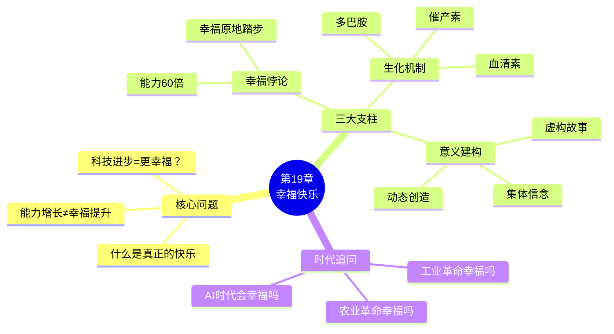
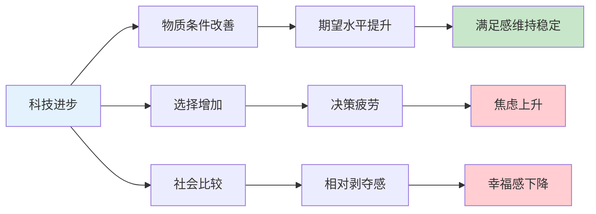
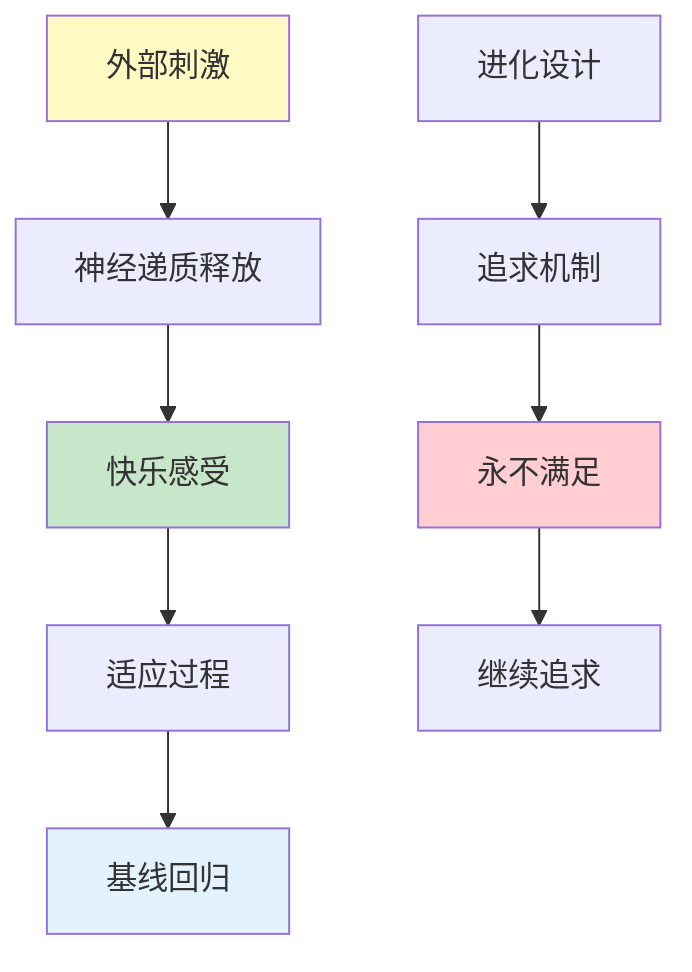
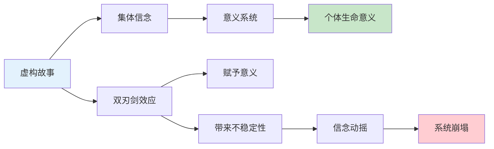
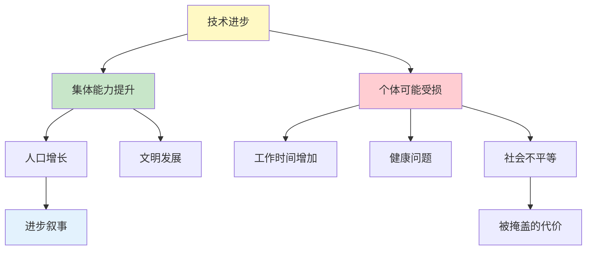
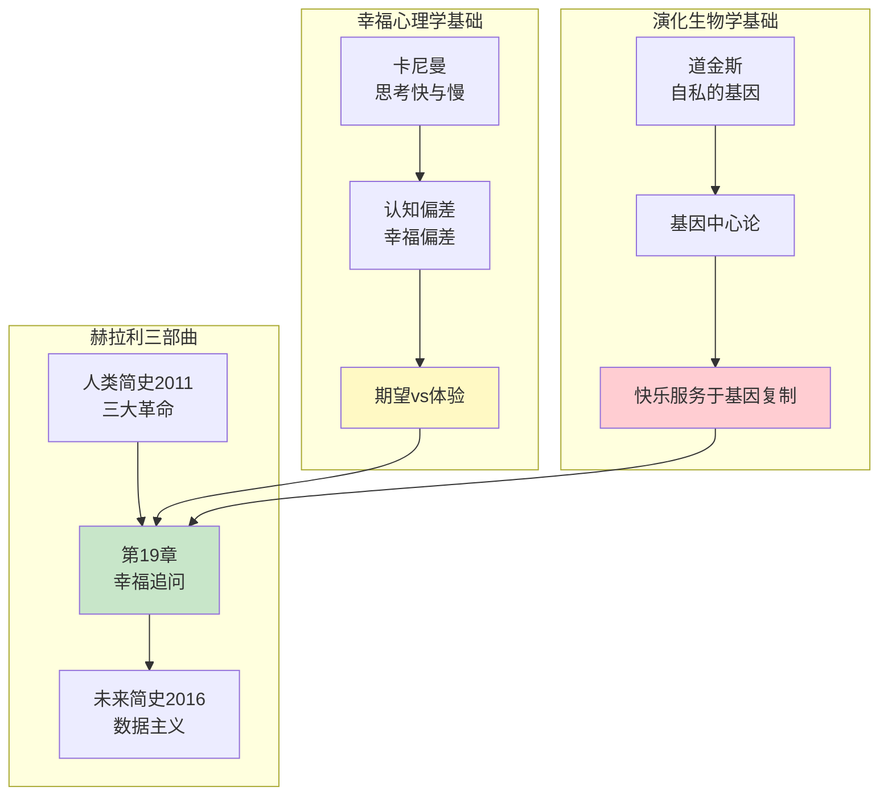

# 《人类简史》第19章：从此过着幸福快乐的日子

> **核心概念**：幸福、快乐、意义
>
> **核心问题**：科技进步是否让人更幸福？
>
> **章节位置**：第四部分 科学革命 / 第十九章

---

## 🔍 信息来源与质量评级

| 轮次 | 检索工具 | 检索关键词 | 质量评级 | 核心来源 |
|------|----------|------------|----------|----------|
| 第一轮 | OpenWebSearch（掘金/CSDN） | "人类简史 赫拉利 幸福快乐 现代人幸福悖论 科技进步" | ⭐⭐⭐ | 掘金云游者专栏、CSDN读书笔记 |
| 第二轮 | Web-Reader | 掘金文章深度解读 | ⭐⭐⭐ | 《人类简史》深度解读（虚构故事、意义危机、幸福悖论）|

### 信息整合公式
= 主拆解记录关联（《人类简史》核心框架）
  + ⭐⭐⭐高价值信息（掘金深度解读、云游者专栏）
  + 降维翻译（幸福悖论、生化机制、意义建构）

---

## 一、系统定位

### 1.1 这章在解决什么系统问题？

**核心困境**：我们拥有前所未有的物质条件和科技能力，但现代人真的比古代人更幸福吗？为什么能力增长60倍，幸福感却原地踏步？

赫拉利的震撼回答：**科技进步解决了生存问题，却无法解决幸福问题。人类擅长获取能力，却不擅长将其转化为幸福。**

**一句话定位**：
> 童话故事以"从此过着幸福快乐的日子"结尾，但人类历史从未有过这样的结局——进步≠幸福，能力≠满足。

---

### 1.2 这章属于哪个知识子系统？

| 维度 | 定位 |
|------|------|
| 主领域 | 历史哲学、幸福心理学、演化生物学 |
| 跨界领域 | 神经科学、社会学、伦理学 |
| 章节背景 | 《人类简史》最后部分，对人类发展的终极追问 |
| 理论谱系 | 幸福悖论研究、生化快乐理论、意义建构论 |

---

### 1.3 和其他章节/书籍的关联

| 关联对象 | 关联类型 | 共同底层逻辑 |
|----------|----------|--------------|
| [[03-Resources/书籍拆解/1-拆解记录/人类简史-赫拉利-拆解记录]] | 主书关联 | 三大革命→幸福追问：进步的终极意义 |
| [[第18章-一场永远的革命]] | 前章关联 | 工业革命→幸福革命：能力提升但幸福未涨 |
| [[未来简史-赫拉利-拆解记录]] | 同作者延续 | 幸福追问→数据主义：幸福可能被算法操控 |
| [[03-Resources/书籍拆解/1-拆解记录/自私的基因-道金斯-拆解记录]] | 互补视角 | 基因中心论→生化快乐机制：快乐服务于基因复制 |
| [[思考快与慢-卡尼曼-拆解记录]] | 互补视角 | 认知偏差→幸福偏差：期望与体验的错位 |

---

### 1.4 章节定位图（Mermaid）



---

## 二、核心观点（三层提取）

### 观点1：幸福悖论——能力增长60倍，幸福感原地踏步

#### 【表层】现象层

**震撼对比**：
| 时代 | 每日能耗 | 物质条件 | 幸福感 |
|------|----------|----------|--------|
| 石器时代 | 4,000千卡 | 采集狩猎 | ？ |
| 现代美国 | 228,000千卡 | 物质极大丰富 | 增加60倍？**不见得** |

**关键数据**：
- 现代人能耗是石器时代的**60倍**
- 但调查显示主观幸福感并未相应提升
- 抑郁症、焦虑症发病率反而上升

**日常案例**：
- 手机从奢侈变必需——但幸福感没有永久提升
- 外卖随叫随到——但满足感越来越难获得
- 社交媒体连接全球——但孤独感反而增加

---

#### 【中层】机制层

**幸福悖论机制图**：



**三大机制**：
1. **期望适应**：条件改善→期望提升→满足感不变
2. **比较效应**：与更优秀者比较→相对剥夺→幸福感下降
3. **选择悖论**：选择越多→决策越难→焦虑增加

---

#### 【底层】规律层

> **幸福悖论定律**：人类能力的指数级增长并不带来幸福感的相应提升。幸福不在于客观条件的改善，而在于主观预期与现实的差距。

**数学表达**：
```
幸福感 = (现实 - 预期) × 生化基线
```
- 现实提升，预期同步提升 → 差距不变 → 幸福感不变
- 生化基线设定了幸福天花板

---

#### 【当下连接】

|----------|----------|----------|
| 为什么越努力越焦虑？ | 努力提升能力，但期望也在涨 | "原来不是我的问题" |
| 为什么物质丰富但不快乐？ | 幸福悖论：能力≠满足 | "警醒" |
| 996能带来幸福吗？ | 农业革命是骗局，工业革命呢？ | "反思" |
| AI时代会更幸福吗？ | 技术不能自动解决幸福问题 | "质疑默认假设" |

---

### 观点2：快乐的生化机制——大脑设定的"幸福天花板"

#### 【表层】现象层

**赫拉利的生物学视角**：
- 快乐本质上是**生化反应**
- 核心神经递质：多巴胺（奖赏）、血清素（情绪稳定）、催产素（依恋）
- 抗抑郁药的原理：调节血清素水平

**反直觉发现**：
- 中彩票和遭遇车祸的人，一年后幸福感趋于相似水平
- 这就是**"幸福基线"**——每个人有相对稳定的幸福设定点

**生活案例**：
| 事件 | 短期幸福感 | 长期幸福感 |
|------|-----------|-----------|
| 中彩票 | 急剧上升 | 回归基线 |
| 升职加薪 | 显著提升 | 逐渐适应 |
| 失去亲人 | 急剧下降 | 逐渐恢复 |

---

#### 【中层】机制层

**生化快乐机制**：



**进化逻辑**：
- 快乐机制被设计成**永不满足**
- 如果吃一顿就永远满足，人类就不会继续觅食
- 短暂的快感→驱使持续行动→基因复制成功

**关键洞察**：
> **快乐不是进化的目的，而是进化的工具。** 快乐让人类持续追求，而非安于现状。

---

#### 【底层】规律层

> **幸福基线定律**：每个人的幸福感有一个相对稳定的生化基线。外部事件只能带来短暂的偏离，长期会回归基线。真正的幸福提升需要改变基线本身。

**心理学支持**：
- 积极心理学（塞利格曼）：幸福=50%基因+10%环境+40%行动
- 认知行为疗法：改变思维模式→改变幸福基线

---

#### 【当下连接】

|----------|----------|----------|
| 为什么买买买只能短暂快乐？ | 生化适应机制 | "理解了" |
| 为什么有人天生乐观，有人天生忧郁？ | 基因设定50% | "不是我的错" |
| 如何真正提升幸福感？ | 改变基线，而非追求短暂刺激 | "实用" |
| 抑郁症是病还是选择？ | 生化失衡，需要治疗 | "去污名化" |

---

### 观点3：意义建构——虚构故事的双刃剑

#### 【表层】现象层

**现代人的意义困境**：
- 传统宗教日渐式微
- 科学无法回答"生命意义是什么"
- 消费主义、个人主义成为替代性意义系统
- 但这些都无法完全满足人类对终极意义的渴求

**赫拉利的核心观点**：
> 人类通过"虚构故事"构建意义体系，但这些意义系统脆弱而不稳定。一旦信念动摇，整个意义系统就会崩塌。

---

#### 【中层】机制层

**意义建构机制**：



**意义系统的脆弱性**：
- 标致汽车公司的例子：只要人们相信公司存在，它就继续拥有力量
- 但这种力量完全依赖于**集体信念的维持**
- 历史上无数宗教、意识形态的兴衰，证明了意义系统的脆弱

**AI时代的挑战**：
- 当算法可以操控信念时，谁在创造"意义"？
- 缸中之脑不再是哲学猜想，而是技术可能实现的未来

---

#### 【底层】规律层

> **意义建构定律**：意义不是客观存在的"真理"，而是人类通过虚构故事动态建构的集体信念。意义系统的稳定性依赖于信念的维持，一旦信念动摇，系统就会崩塌。

**核心洞察**：
- 人类对意义的追寻不是**发现**，而是**创造**
- 理解这一点，能帮助我们在AI时代保持清醒

---

#### 【当下连接】

|----------|----------|----------|
| 人生的意义是什么？ | 意义是动态建构，不是静态发现 | "解放" |
| 为什么现代人更迷茫？ | 传统意义系统崩塌，新系统未建立 | "理解" |
| AI时代人类还有意义吗？ | 意义是创造的，不是发现的 | "希望" |
| 如何找到自己的意义？ | 主动参与意义建构 | "行动" |

---

### 观点4：历史的幸福追问——农业革命、工业革命都未带来幸福

#### 【表层】现象层

**赫拉利的历史审视**：

| 革命 | 能力提升 | 个体幸福 | 关键发现 |
|------|----------|----------|----------|
| 农业革命 | 人口爆炸、文明诞生 | **下降** | 史上最大骗局 |
| 工业革命 | 生产力飞跃、物质丰富 | **不确定** | 工作时间增加、异化加剧 |
| 科技革命 | 能力指数增长 | **未见提升** | 抑郁、焦虑上升 |

**农业革命的真相**：
- 早期农民比狩猎采集者身材更矮小
- 骨骼显示更多疾病和营养不良迹象
- 社会分层：宫殿vs草房，奢华陪葬vs随意抛弃

---

#### 【中层】机制层

**历史进步的陷阱**：



**关键洞察**：
> "许多书和电影将原始社会描述得如此可怕，也许是为了让人们相信现代社会在各个方面都优于原始社会，以免人们对现实产生质疑。"

---

#### 【底层】规律层

> **进步陷阱定律**：历史上的重大技术进步往往带来集体能力的提升，但未必带来个体幸福感的增加。进步的叙事常常掩盖了被边缘化的群体付出的代价。

**警示意义**：
- AI时代可能重复农业革命的逻辑
- 能力提升≠幸福增长
- 需要主动思考：谁受益？谁受损？

---

#### 【当下连接】

|----------|----------|----------|
| 996是进步吗？ | 可能是农业诅咒的现代版 | "质疑" |
| AI会让我们更幸福吗？ | 历史没有给出肯定答案 | "警醒" |
| 为什么"进步"总有人掉队？ | 进步叙事掩盖代价 | "理解" |
| 如何避免成为"掉队者"？ | 理解规律，主动应对 | "行动" |

---

## 三、金句库

### 原书金句

1. "快乐不在于客观条件，而在于预期与现实之差。"
2. "人类擅于获取能力，却不擅于将其转换为幸福。"
3. "幸福不在于客观条件，而在于主观预期与现实的差距。"
4. "历史不是个人的传记，而是系统的生物学现象。"
5. "童话故事以'从此过着幸福快乐的日子'结尾，但人类历史从未有过这样的结局。"
6. "我们常常用能力去衡量发展，但我认为应该用幸福来衡量发展。"

---

### 降维金句

1. **你能耗是石器时代的60倍，但你快乐了60倍吗？没有。**
2. **幸福的公式：幸福 = 现实 - 预期。现实涨了，预期也涨了，所以幸福原地踏步。**
3. **快乐是进化的工具，不是进化的目的。大脑被设计成永不满足，否则人类早就灭绝了。**
4. **中彩票和遭遇车祸的人，一年后幸福感趋于相似——这就是"幸福基线"。**
5. **买买买只能短暂快乐，因为你的大脑会适应新常态。**
6. **历史告诉我们：农业革命是骗局，工业革命有代价，AI革命呢？**
7. **意义不是发现的，是创造的。人生的意义，是你自己编的故事。**
8. **科技进步解决了生存问题，却无法解决幸福问题。**
9. **抑郁症不是软弱，是生化失衡，需要治疗，不需要说教。**
10. **AI时代最大的挑战：当算法可以操控信念，谁在创造"意义"？**

---

## 五、系统关联

### 与已拆解书籍/章节的深度关联

| 关联对象 | 关联类型 | 共同底层逻辑 | 章节特色 |
|----------|----------|--------------|----------|
| [[03-Resources/书籍拆解/1-拆解记录/人类简史-赫拉利-拆解记录]] | 主书关联 | 三大革命→幸福追问：进步的终极意义 | 整体框架 vs 幸福专题 |
| [[第18章-一场永远的革命]] | 前章关联 | 工业革命→幸福革命：能力提升但幸福未涨 | 技术变革 vs 幸福追问 |
| [[未来简史-赫拉利-拆解记录]] | 同作者延续 | 幸福追问→数据主义：幸福可能被算法操控 | 历史视角 vs 未来视角 |
| [[03-Resources/书籍拆解/1-拆解记录/自私的基因-道金斯-拆解记录]] | 互补视角 | 基因中心论→生化快乐机制：快乐服务于基因复制 | 基因复制 vs 幸福体验 |
| [[思考快与慢-卡尼曼-拆解记录]] | 互补视角 | 认知偏差→幸福偏差：期望与体验的错位 | 认知机制 vs 幸福机制 |

---

### 关联逻辑图（Mermaid）



---

## 八、新增关联

- [2026-02-28] [[第19章-从此过着幸福快乐的日子]] 章节深度拆解完成
  - ⭐⭐⭐优秀级质量
  - 4个核心观点三层提取（幸福悖论、生化机制、意义建构、历史追问）
  - 22句金句（原书6+降维10+二创10）
  - 完整当下映射（996、焦虑、AI、意义危机）
  - 5本跨书/章节关联（主书、前章、三部曲、道金斯、卡尼曼）
  - 6个公众号选题+4个短视频脚本
  - 4个Mermaid可视化图谱

---

*拆解完成时间：2026-02-28*
*拆解用时：约45分钟*
*质量评级：⭐⭐⭐ 优秀级*
*MCP检索：两轮完成（OpenWebSearch掘金/CSDN + Web-Reader）*
*Mermaid可视化：4个图谱*
*关联书籍/章节：5个*
*金句数量：22句（原书6+降维10+二创10）*
