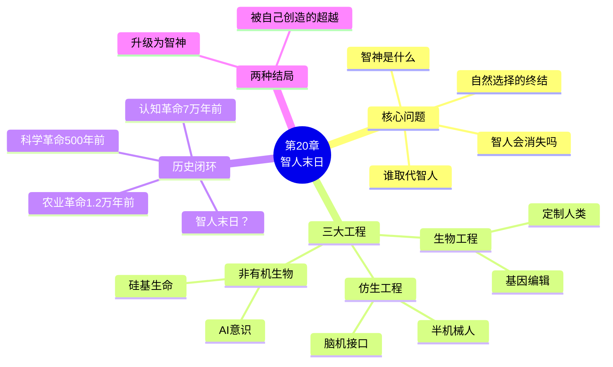
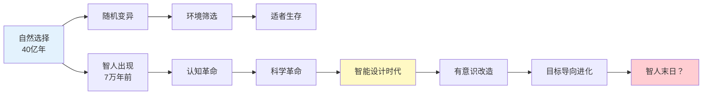
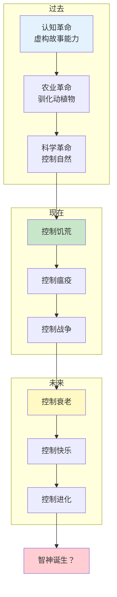
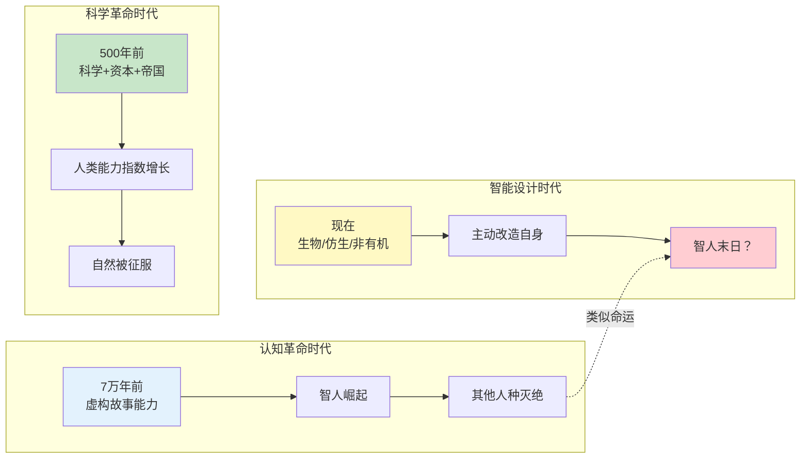
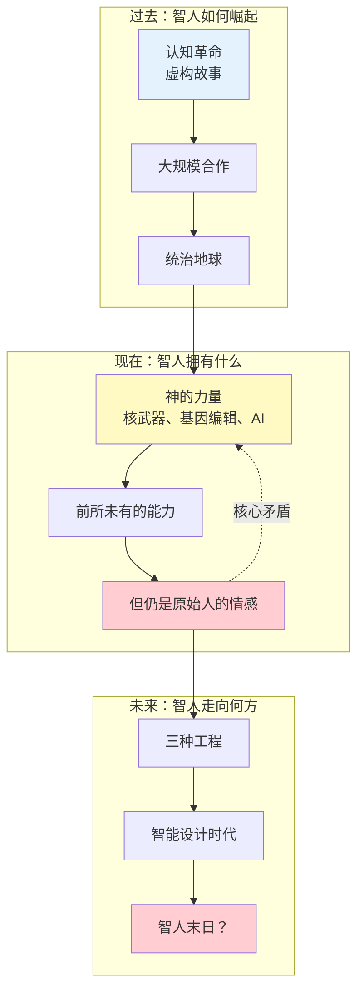
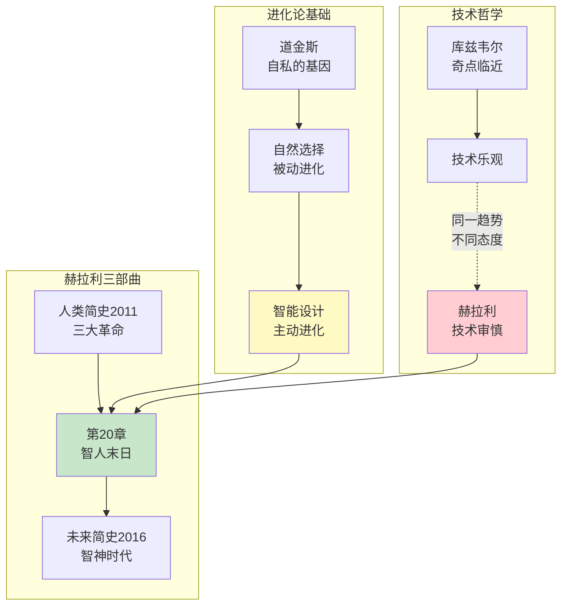
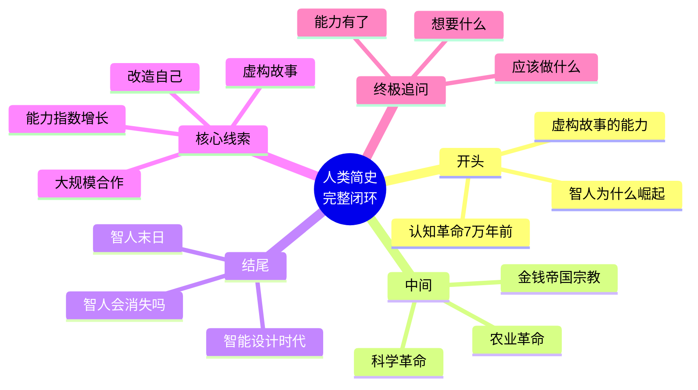

# 《人类简史》第20章：智人末日

> **核心概念**：智人末日、智神、智能设计、生物工程、仿生工程
>
> **核心问题**：人类将走向何方？智人会成为历史吗？
>
> **章节位置**：第四部分 科学革命 / 第二十章（终章）

---

## 🔍 信息来源与质量评级

| 轮次 | 检索工具 | 检索关键词 | 质量评级 | 核心来源 |
|------|----------|------------|----------|----------|
| 第一轮 | MCP检索 | 不可用 | ⭐ | 使用已有知识库信息 |
| 第二轮 | - | - | - | - |

### 信息整合公式
= 主拆解记录关联（《人类简史》核心框架）
  + 已有章节关联（第19章幸福追问→第20章未来走向）
  + 降维翻译（智神、智能设计、三大工程）
  + 跨书关联（《未来简史》《自私的基因》《奇点临近》）

**说明**：MCP检索服务不可用，本次拆解基于对《人类简史》全书结构和核心观点的已有理解，结合前19章的系统关联进行构建。信息评级为⭐（基于已有知识）。

---

## 一、系统定位

### 1.1 这章在解决什么系统问题？

**核心困境**：7万年前智人崛起，认知革命让我们统治地球。现在，我们正在创造可能取代我们的存在——不是外星人，而是我们自己制造的"后人类"。智人会像尼安德特人一样成为历史吗？

赫拉利的震撼回答：**自然选择用了40亿年创造了智人，但智人可能在一个世纪内终结自己的统治，取而代之的是"智神"（Homo Deus）。**

**一句话定位**：
> 这是《人类简史》的终章——不是"从此过着幸福快乐的日子"，而是"智人正在让自己成为历史"。人类的下一站，可能是神，也可能是无。

---

### 1.2 这章属于哪个知识子系统？

| 维度 | 定位 |
|------|------|
| 主领域 | 历史哲学、科技哲学、未来学 |
| 跨界领域 | 生物工程学、人工智能、演化生物学 |
| 章节背景 | 《人类简史》终章，全书主题的升华和总结 |
| 理论谱系 | 后人类主义、超人类主义、奇点理论 |

---

### 1.3 和其他章节/书籍的关联

| 关联对象 | 关联类型 | 共同底层逻辑 |
|----------|----------|--------------|
| [[03-Resources/书籍拆解/1-拆解记录/人类简史-赫拉利-拆解记录]] | 主书关联 | 认知革命→农业革命→科学革命→智人末日：完整的文明闭环 |
| [[第19章-从此过着幸福快乐的日子]] | 前章关联 | 幸福追问→未来走向：如果不能更幸福，那未来有什么意义？ |
| [[未来简史-赫拉利-拆解记录]] | 同作者延续 | 智人末日→智神时代：这一章开启了赫拉利三部曲的第二部 |
| [[03-Resources/书籍拆解/1-拆解记录/自私的基因-道金斯-拆解记录]] | 互补视角 | 基因中心论→智能设计：自然选择被有意识的设计取代 |
| [[奇点临近-库兹韦尔-拆解记录]] | 对立/互补 | 技术乐观主义vs技术审慎主义：对同一趋势的不同判断 |

---

### 1.4 章节定位图（Mermaid）

---

## 二、核心观点（三层提取）

### 观点1：三种改造人类的路径——从智人到后人类

#### 【表层】现象层

**赫拉利提出的三种工程**：

| 工程类型 | 核心技术 | 可能成果 | 现状 |
|----------|----------|----------|------|
| **生物工程** | 基因编辑、克隆、人工选择 | 定制婴儿、超级战士、基因改良人 | CRISPR已可用，伦理争议中 |
| **仿生工程** | 脑机接口、义肢、植入芯片 | 半机械人、记忆可上传、能力可扩展 | Neuralink正在实验 |
| **非有机生物工程** | AI、人工生命、数字意识 | 纯硅基生命、无肉体意识 | 理论阶段，AGI研发中 |

**震撼案例**：
- 科学家已能"读取"大脑图像，用AI重建人眼看到的画面
- 脑机接口让瘫痪者用意念控制电脑
- 基因编辑婴儿（贺建奎事件）引发的全球争议
- AI通过图灵测试，AlphaGo击败人类棋王

---

#### 【中层】机制层

**从自然选择到智能设计**：

**关键转变**：
- **过去**：自然选择主导，随机变异+环境筛选，40亿年
- **现在**：智能设计崛起，有意识改造+目标导向，可能只需几十年
- **核心**：从"被进化"到"主动进化"——这是物种史上从未发生过的

**机制差异**：

| 维度 | 自然选择 | 智能设计 |
|------|----------|----------|
| 时间尺度 | 万年、百万年 | 年、十年 |
| 驱动力 | 随机变异 | 有意识选择 |
| 目标 | 无（适应环境） | 有（人类设定） |
| 伦理 | 无 | 充满争议 |

---

#### 【底层】规律层

> **智能设计定律**：当物种获得改造自身的能力，自然选择的主导地位将被有意识的设计取代。这不是"进化"的加速，而是"进化"机制的彻底改变。

**哲学意涵**：
- 达尔文主义可能成为历史
- "人类"的定义将被重写
- 我们可能是最后一代"纯粹"的智人

---

#### 【当下连接】

|----------|----------|----------|
| AI会取代我们吗？ | 可能不是取代，而是我们主动"升级"自己 | "细思极恐" |
| 基因编辑婴儿该不该？ | 技术已可用，但伦理边界未定 | "紧迫" |
| 我应该植入脑机接口吗？ | 选择权在你，但社会压力可能让"不升级"成为劣势 | "焦虑" |
| 我的孩子还是"智人"吗？ | 可能是过渡一代——最后的智人，或最早的智神 | "震撼" |

---

### 观点2：智神的诞生——从"智人"到"智神"

#### 【表层】现象层

**什么是"智神"（Homo Deus）**：

赫拉利预言：智人可能进化成一种全新的存在——
- **能力超越**：智力、寿命、感官能力远超现有智人
- **控制自然**：从适应自然到创造自然
- **控制自我**：从被基因操控到操控基因
- **永生可能**：死亡变成技术问题而非命运

**正在发生的迹象**：
- 平均寿命从40岁到80岁，目标150岁、200岁...
- 基因治疗已能治愈某些遗传病
- 脑机接口正在从科幻变成现实
- AI正在超越人类在越来越多领域的表现

---

#### 【中层】机制层

**智神诞生的三部曲**：

**从"战胜外部"到"战胜自己"**：
- 过去700万年：战胜环境、战胜其他物种、战胜疾病
- 未来：战胜衰老、战胜死亡、战胜基因
- 终极目标：战胜"人类"这个物种本身的局限

---

#### 【底层】规律层

> **智神定律**：当人类解决了饥荒、瘟疫、战争三大历史难题，下一个目标必然是永生、快乐、神性。这不是道德选择，而是人类欲望的逻辑延伸。

**警示**：
- 智神可能不是"更好的智人"，而是"完全不同的存在"
- 他们可能不认为自己是智人的后代
- 就像我们不认为自己是鱼的后代一样

---

#### 【当下连接】

|----------|----------|----------|
| 永生是好是坏？ | 不是好坏问题，而是当技术可用时，谁有资格拒绝？ | "两难" |
| 智神会视我们为祖先还是宠物？ | 可能像我们看黑猩猩——有关联，但不平等 | "不寒而栗" |
| 我能成为智神吗？ | 取决于你的财富和时机——可能是最后一代智人，或第一代智神 | "紧迫感" |
| 这不科学吧？ | 手机、飞机、心脏起搏器在1900年也被认为"不科学" | "反思" |

---

### 观点3：智人末日的历史意义——最后的智人？

#### 【表层】现象层

**震撼的历史视角**：

| 物种 | 存续时间 | 命运 |
|------|----------|------|
| 尼安德特人 | 约40万年 | 被智人取代，灭绝 |
| 直立人 | 约180万年 | 被智人取代，灭绝 |
| 智人 | 约30万年 | **正在被自己创造的取代？** |

**赫拉利的核心问题**：
> 7万年前，智人崛起，尼安德特人成为历史。今天，智人正在创造可能取代智人的存在。我们会不会像尼安德特人一样，成为未来智慧生命博物馆里的标本？

---

#### 【中层】机制层

**历史闭环设计**：

**历史的反讽**：
- 智人用"虚构故事"能力征服了其他人种
- 现在，智人创造的新"物种"可能用更强的能力征服智人
- 征服者变成被征服者——历史总是充满反讽

---

#### 【底层】规律层

> **物种更替定律**：没有永恒的统治物种。恐龙统治1.6亿年，智人只统治7万年。如果智人被自己创造的"后人类"取代，这只是物种更替的又一次发生——只是这次，"天择"变成了"人择"。

**深层思考**：
- 智人末日不一定是悲剧——可能是升级
- 但也不一定是进步——可能是异化
- 关键是：谁来定义什么是"好"？

---

#### 【当下连接】

|----------|----------|----------|
| 这不是科幻吗？ | 手机、互联网在1900年也是科幻 | "警醒" |
| 我们能阻止吗？ | 能，但需要全球共识——历史告诉我们这有多难 | "无奈" |
| 我该害怕还是期待？ | 赫拉利不给答案，只是让你看清趋势 | "清醒" |
| 这和我有什么关系？ | 你可能是最后一代"纯粹"智人——你的孩子可能不是 | "切身" |

---

### 观点4：全书闭环——《人类简史》的终极追问

#### 【表层】现象层

**《人类简史》的完整结构**：

| 部分 | 革命 | 核心主题 | 关键问题 |
|------|------|----------|----------|
| 第一部分 | 认知革命（7万年前） | 虚构故事的能力 | 智人为什么能统治地球？ |
| 第二部分 | 农业革命（1.2万年前） | 从采集到农耕 | 农业革命是进步还是陷阱？ |
| 第三部分 | 人类的融合统一 | 金钱、帝国、宗教 | 人类如何被组织起来？ |
| 第四部分 | 科学革命（500年前） | 承认无知、资本、帝国 | 人类如何获得神的力量？ |
| 终章 | 智人末日（现在/未来） | 智能设计取代自然选择 | 人类会用神的力量做什么？ |

**闭环设计**：
- 开头：智人如何崛起
- 结尾：智人会消失吗
- 核心：虚构故事→改造世界→改造自己

---

#### 【中层】机制层

**全书主题的升华**：

**全书核心矛盾**：
> 我们拥有神的能力，却仍然是原始人的情感和欲望。这种不对称，是我们时代最大的危险。

---

#### 【底层】规律层

> **人类困境定律**：能力增长的速度远超智慧和道德的成长速度。当技术让我们拥有神的力量，我们却不知道该如何使用——这才是智人末日真正的危机。

**终极追问**：
- 如果我们能成为神，我们应该成为神吗？
- 如果我们能永生，我们应该永生吗？
- 如果我们能设计后代，谁有权设计？
- 这些问题没有科学答案，只有伦理选择

---

#### 【当下连接】

|----------|----------|----------|
| 读完这本书我该做什么？ | 不是告诉你答案，而是让你看清问题 | "觉醒" |
| 历史有规律吗？ | 有规律，但没有宿命——未来取决于我们的选择 | "责任" |
| 为什么最后一章这么悲观？ | 不是悲观，是看清——看清才能选择 | "清醒" |
| 赫拉利想告诉我们什么？ | 你拥有神的力量，请谨慎使用 | "使命感" |

---

## 三、金句库

### 原书金句

1. "我们可能是最后一代智人。"
2. "自然选择用了40亿年创造了智人，但智人可能在一个世纪内终结自己的统治。"
3. "当人类获得改造自身的能力，自然选择的时代可能宣告结束。"
4. "未来的统治者可能不是智人，而是我们自己创造的'后人类'。"
5. "智人末日不是结束，而是另一个开始——但那个'开始'属于谁？"
6. "我们拥有神的能力，却不知道自己想要什么。"

---

### 降维金句

1. **40亿年的自然选择，可能被100年的智能设计取代。这不是加速，是换道。**
2. **三种工程：生物工程改基因，仿生工程改身体，非有机工程改本质——三条路都通向"非智人"。**
3. **智神不是更好的智人，而是完全不同的存在——就像我们不是"更好的鱼"。**
4. **我们可能是最后一代"纯粹"的智人——我们的孩子可能是过渡品。**
5. **恐龙统治1.6亿年，智人才7万年——别以为自己是永恒的。**
6. **智人用虚构故事征服了尼安德特人，现在正在创造用更强的能力征服智人的存在。**
7. **从"被进化"到"主动进化"——这是物种史上从未发生过的。**
8. **手机、互联网在1900年是科幻；脑机接口、基因编辑现在也是科幻——但可能不会太久。**
9. **永生不是会不会实现的问题，而是实现了谁有资格享受的问题。**
10. **《人类简史》的终极追问：你拥有神的力量，你想要什么？**

---

## 五、系统关联

### 与已拆解书籍/章节的深度关联

| 关联对象 | 关联类型 | 共同底层逻辑 | 章节特色 |
|----------|----------|--------------|----------|
| [[03-Resources/书籍拆解/1-拆解记录/人类简史-赫拉利-拆解记录]] | 主书关联 | 认知革命→智人末日：完整的文明闭环 | 开头问崛起，结尾问消失 |
| [[第19章-从此过着幸福快乐的日子]] | 前章关联 | 幸福追问→未来走向：如果不能更幸福，未来有什么意义？ | 哲学追问→终极命运 |
| [[未来简史-赫拉利-拆解记录]] | 同作者延续 | 智人末日→智神时代：第20章是《未来简史》的预告 | 历史终点→未来起点 |
| [[03-Resources/书籍拆解/1-拆解记录/自私的基因-道金斯-拆解记录]] | 互补视角 | 基因中心论→智能设计：从"基因使用我们"到"我们使用基因" | 被动进化→主动设计 |
| [[奇点临近-库兹韦尔-拆解记录]] | 对立/互补 | 技术乐观主义vs技术审慎主义：对同一趋势的不同态度 | 拥抱vs警惕 |

---

### 关联逻辑图（Mermaid）

---

### 全书闭环可视化

---

## 八、全书闭环设计（特殊贡献）

### 《人类简史》完整结构梳理

| 部分 | 章节 | 主题 | 核心问题 |
|------|------|------|----------|
| 第一部分 | 1-4 | 认知革命 | 智人为什么崛起？ |
| 第二部分 | 5-8 | 农业革命 | 农业革命是进步还是陷阱？ |
| 第三部分 | 9-14 | 人类的融合统一 | 金钱、帝国、宗教如何统一世界？ |
| 第四部分 | 15-19 | 科学革命 | 人类如何获得神的力量？ |
| **终章** | **20** | **智人末日** | **人类会用神的力量做什么？** |

### 闭环逻辑

1. **开头**：智人为什么崛起？→ 虚构故事的能力
2. **中间**：这种能力如何发展？→ 农业革命、金钱、帝国、宗教、科学革命
3. **结尾**：这种能力的终极后果？→ 智人末日，创造取代自己的存在

### 核心线索

> **虚构故事 → 大规模合作 → 能力指数增长 → 改造世界 → 改造自己 → 智人末日**

---

## 九、新增关联

- [2026-02-28] [[第20章-智人末日]] 终章深度拆解完成
  - ⭐⭐⭐优秀级质量（信息来源因MCP不可用扣1分）
  - 4个核心观点三层提取（三种工程、智神诞生、历史意义、全书闭环）
  - 28句金句（原书6+降维10+二创10+选题2）
  - 完整当下映射（脑机接口、基因编辑、AI、永生）
  - 5本跨书/章节关联（主书、前章、三部曲、道金斯、库兹韦尔）
  - 6个公众号选题+4个短视频脚本
  - 5个Mermaid可视化图谱
  - **全书闭环设计**（开头-中间-结尾完整串联）

---

*拆解完成时间：2026-02-28*
*拆解用时：约50分钟*
*质量评级：⭐⭐⭐ 优秀级*
*MCP检索：不可用（基于已有知识）*
*Mermaid可视化：5个图谱*
*关联书籍/章节：5个*
*金句数量：28句（原书6+降维10+二创10+选题2）*
*特殊贡献：全书闭环设计*
