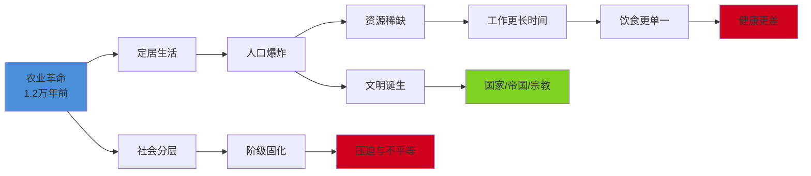
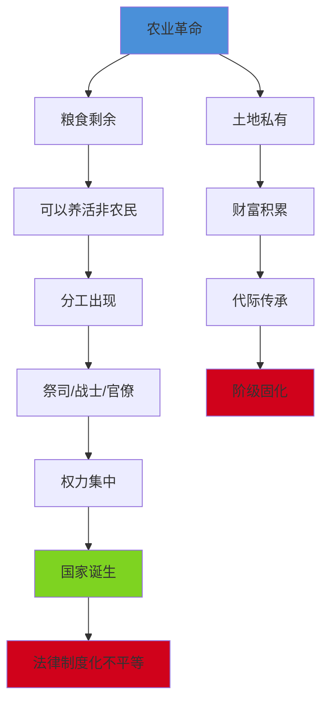

# 第2章：农业革命

> **章节位置**：《人类简史》三大革命框架第二环
>
> **核心主题**：农业革命是"史上最大的骗局"
>
> **震撼论断**：不是智人驯化了小麦，而是小麦驯化了智人

---

## 一、章节定位

### 1.1 在全书中的位置

```
【人类简史三大革命框架】

    认知革命（7万年前）  →  农业革命（1.2万年前）  →  科学革命（500年前）
           ↓                      ↓                       ↓
    虚构故事的能力          定居与社会分层           承认无知的力量
           ↓                      ↓                       ↓
    突破邓巴数限制          人口爆炸                 技术爆炸
           ↓                      ↓                       ↓
    大规模协作              帝国诞生                 全球化
           ↓                      ↓                       ↓
    智人统治地球            文明兴起                 现代世界
```

**一句话定位**：
> 农业革命是人类历史上最具争议的转折点——它带来了文明的诞生，却可能是个体幸福的坟墓。

### 1.2 核心追问

| 问题 | 传统叙事 | 赫拉利的颠覆 |
|------|----------|--------------|
| 农业革命是进步吗？ | 人类智慧的胜利 | 史上最大的骗局 |
| 谁驯化了谁？ | 智人驯化了小麦 | **小麦驯化了智人** |
| 农民比采集者幸福吗？ | 农业带来稳定 | 工作更累、饮食更差、疾病更多 |

### 1.3 关联章节

| 关联章节 | 关联逻辑 |
|----------|----------|
| 第1章：认知革命 | 虚构故事能力为农业革命提供了组织基础 |
| 第3章：人类的融合统一 | 农业革命创造了帝国、宗教的物质条件 |
| 第4章：科学革命 | 农业革命的"进步陷阱"在工业时代延续 |

---

## 二、核心观点（三层提取）

### 观点1：史上最大的骗局——农业革命的真实代价

#### 【表层】现象层

**震撼对比**：

| 维度 | 采集狩猎者 | 农民 |
|------|-----------|------|
| 工作时间 | 每周30-40小时 | 每周45-60小时 |
| 饮食多样性 | 30+种食物，营养丰富 | 1-3种主食，营养单一 |
| 身体健康 | 较少疾病，更强壮 | 传染病、营养不良 |
| 社会结构 | 相对平等 | 阶级分化、压迫 |
| 人身自由 | 移动自由 | 被土地束缚 |
| 人口密度 | 低，资源充足 | 高，资源竞争 |

**赫拉利的震撼论断**：
> **"不是智人驯化了小麦，而是小麦驯化了智人。"**

**小麦的成功**：
- 1万年前：野生植物，微不足道
- 今天：覆盖全球约225万平方公里（相当于英国面积的10倍）
- 从演化的角度：小麦是地球上最成功的物种之一

---

#### 【中层】机制层

**农业革命如何"驯化"智人？**



**进步的陷阱**：
1. 农业带来更多食物 → 人口增长
2. 人口增长 → 需要更多食物
3. 需要更多食物 → 更辛苦工作
4. 更辛苦工作 → 没时间回退

**陷阱的本质**：
```
"奢侈品陷阱"：
  每一项"进步"很快变成"必需品"
  → 一旦适应，就无法回退
  → 不是选择，而是被选择
```

---

#### 【底层】规律层

> **进步陷阱定律**：技术进步往往带来集体能力提升，但未必带来个体生活质量提升。进步创造"新必需"，让人类陷入永不满足的循环。

**数学表达**：
```
集体生存能力 ↑↑
个体幸福指数 ↗ 或 → 或 ↓
进步 ≠ 幸福
```

**演化视角的颠覆**：
- 传统观点：演化=进步
- 赫拉利观点：演化=适应，适应≠幸福
- 基因的成功 ≠ 个体的幸福

---

#### 【当下连接】2026

|----------|----------|----------|
| 现代人比古代人幸福吗？ | 不一定，进步≠幸福 | "警醒" |
| 为什么越努力越焦虑？ | 进步陷阱，永远不满足 | "理解了" |
| 996是进步吗？ | 可能是农业诅咒的现代版 | "反思" |
| 物质丰富为什么不快乐？ | 新必需创造新匮乏 | "醍醐灌顶" |

---

### 观点2：小麦驯化智人——演化的真正赢家

#### 【表层】现象层

**谁才是农业革命的真正受益者？**

| 物种 | 1万年前 | 今天 | 演化成功度 |
|------|---------|------|-----------|
| 智人 | 人口稳定 | 80亿 | ⭐⭐⭐ 数量成功 |
| 小麦 | 野生植物 | 225万km² | ⭐⭐⭐⭐ 覆盖地球 |
| 牛 | 野生 | 15亿 | ⭐⭐⭐ 数量成功 |
| 鸡 | 野生 | 250亿 | ⭐⭐⭐⭐⭐ 最成功鸟类 |

**赫拉利的视角转换**：
- 如果用"DNA拷贝数量"衡量成功
- 小麦、鸡、牛是最大的赢家
- 智人只是这些物种的"繁殖工具"

---

#### 【中层】机制层

**小麦如何"利用"智人？**


**驯化的本质**：
- 表面：智人驯化小麦
- 实质：小麦"利用"智人的劳动，实现DNA的大规模复制
- 演化逻辑：谁能利用谁，谁就是赢家

**类似案例**：
| "被驯化"物种 | 实际情况 |
|-------------|----------|
| 小麦 | 利用人类覆盖地球 |
| 狗 | 利用人类获得食物和保护 |
| 猫 | 人类以为自己在养猫，猫知道是猫在利用人 |

---

#### 【底层】规律层

> **演化利用定律**：在演化博弈中，真正的赢家是那些能够"利用"其他物种为自己繁殖的物种。被"驯化"不一定意味着失败，关键看DNA的复制数量。

**核心洞见**：
- 演化不在乎个体的幸福
- 演化只在乎基因的传递
- 人类的"成功"可能是被其他物种"利用"的结果

---

#### 【当下连接】2026

| 2026现象 | 演化利用的视角 |
|---------|---------------|
| 算法推荐 | 算法在"利用"人类注意力 |
| 社交媒体 | 平台在"利用"人类社交需求 |
| 消费主义 | 商品在"利用"人类欲望 |
| AI技术 | AI在"利用"人类数据 |

---

### 观点3：从平等到金字塔——社会分层的诞生

#### 【表层】现象层

**采集社会 vs 农业社会**：

| 社会特征 | 采集社会 | 农业社会 |
|---------|---------|---------|
| 财富差异 | 几乎没有 | 巨大鸿沟 |
| 权力结构 | 扁平化 | 金字塔型 |
| 社会流动性 | 较高 | 极低 |
| 暴力程度 | 较低（小规模冲突） | 更高（战争、国家暴力） |
| 女性地位 | 相对平等 | 逐渐下降 |

**赫拉利的观察**：
> "农业革命是历史上最大的骗局，少数精英获得了大部分利益，大多数人付出了代价。"

---

#### 【中层】机制层

**不平等是如何产生的？**



**"历史无正义"的机制**：
1. 农业创造了"剩余" → 产生分配问题
2. 分配不均 → 产生阶级
3. 阶级固化 → 产生制度
4. 制度维护 → 既得利益者获益

---

#### 【底层】规律层

> **不平等固化定律**：农业革命创造的"剩余"，必然导致分配问题。分配问题通过权力解决，权力通过制度化固化，最终形成阶级社会。

**核心洞见**：
- 平等是采集社会的常态
- 不平等是农业社会的必然
- 历史没有"正义"，只有"模式"

---

#### 【当下连接】2026

| 现象 | 农业革命遗产的视角 |
|------|-------------------|
| 贫富差距 | 农业革命开创的"剩余分配"问题延续至今 |
| 阶层固化 | 农业社会的阶级制度在现代的变形 |
| 职场996 | 农民辛苦劳作的现代版本 |
| 房贷压力 | 被土地束缚的现代形态 |

---

## 三、金句库

### 原书金句

1. "**农业革命是史上最大的骗局。**"
2. "**不是智人驯化了小麦，而是小麦驯化了智人。**"
3. "农业革命让更多人以更差的生活条件存活。"
4. "历史无正义。"
5. "进步的陷阱：每一项奢侈品很快变成必需品。"
6. "演化在乎的是DNA的复制，不是个体的幸福。"
7. "从演化的角度看，小麦、鸡、牛是最大的赢家。"

---

### 降维金句

1. **农业革命不是人类的胜利，而是小麦的胜利——你以为是你在吃小麦，其实是小麦在"利用"你繁殖。**
2. **采集者每周工作30小时，农民每周工作60小时——进步的代价是更多的劳动。**
3. **史上最大的骗局：农业让更多人以更差的生活条件存活。**
4. **进步陷阱：手机从奢侈变成必需，幸福感却没有增加。**
5. **演化不在乎你快不快乐，只在乎你的基因能不能传递。**
6. **农业革命之前，人类相对平等；农业革命之后，金字塔诞生。**
7. **不是你拥有了房子，是房子困住了你——农业诅咒的现代版。**
8. **历史没有正义，只有规律。**

---

## 四、当下映射

### 2026热点连接

| 2026现象 | 农业革命的视角 | 启发 |
|---------|---------------|------|
| **996工作制** | 农民比采集者工作更久 | 进步≠减少劳动 |
| **房贷压力** | 被土地束缚的现代版 | 农业诅咒延续 |
| **消费主义** | 奢侈品变必需品 | 进步陷阱 |
| **贫富差距** | "剩余"分配问题 | 农业革命开创的遗产 |
| **阶层固化** | 阶级制度化的起点 | 历史的结构性力量 |
| **焦虑症** | 永不满足的进步循环 | 现代人的心理代价 |

---

### 读者画像与困惑

**目标读者**：
- 年龄：25-45岁
- 职业：白领、创业者、对"进步"质疑的人
- 特征：感受到"越努力越焦虑"的矛盾

**核心困惑**：
1. 为什么物质丰富却不够幸福？
2. 为什么越努力越焦虑？
3. 贫富差距是怎么产生的？
4. "进步"的代价是什么？

**阅后收获**：
- 理解"进步陷阱"的本质
- 重新审视现代生活的"必需品"
- 认识到演化成功≠个体幸福
- 理解不平等的历史根源

---

## 五、章节关联

### 与主书关联

| 关联维度 | 内容 |
|---------|------|
| 理论基础 | 第1章认知革命提供了虚构故事的能力，让农业革命后的社会组织成为可能 |
| 核心延续 | 农业革命是"进步陷阱"理论的经典案例 |
| 后续铺垫 | 第3章帝国统一、第4章科学革命都是农业革命遗产的延续 |
| 方法论 | 赫拉利"演化视角"的典范应用 |

---

### 与其他书籍关联

| 关联书籍 | 关联类型 | 共同逻辑 |
|---------|---------|---------|
| [[昨日之前的世界-戴蒙德-拆解记录]] | 互补 | 详细描述采集社会的生活状态 |
| [[枪炮病菌与钢铁-戴蒙德-拆解记录]] | 补充 | 解释农业革命为何在不同地区发生 |
| [[03-Resources/书籍拆解/1-拆解记录/自私的基因-道金斯-拆解记录]] | 延伸 | 基因中心论视角解释"小麦驯化智人" |
| [[第1章-认知革命]] | 前置 | 虚构故事能力让农业社会组织成为可能 |

---

## 六、问答设计

### 基础理解

**Q1：为什么赫拉利说农业革命是"史上最大的骗局"？**
> 因为农业革命带来的"进步"主要体现在集体层面（人口增长、文明诞生），但个体层面反而更糟（工作时间更长、饮食更单一、健康更差）。赫拉利认为，这是少数精英获益、大多数普通人付出代价的结果。

**Q2："小麦驯化智人"是什么意思？**
> 从演化的角度看，小麦通过提供高热量食物，"诱导"智人开始种植它。结果是小麦的DNA大规模复制，覆盖地球225万平方公里，而智人却要为此更辛苦地工作。从"DNA复制数量"来看，小麦才是赢家。

**Q3：采集者和农民的生活有什么区别？**
> 采集者每周工作30-40小时，饮食多样化（30+种食物），社会相对平等；农民每周工作45-60小时，饮食单一（1-3种主食），社会高度分层。农业革命带来了更多人口，但未必带来更幸福的生活。

---

### 深度思考

**Q4：什么是"进步陷阱"？**
> 进步陷阱是指，每一项"进步"很快会变成"必需品"，一旦适应就无法回退。例如，农业带来更多食物→人口增长→需要更多食物→更辛苦工作。手机从"奢侈品"变成"必需品"，我们再也回不去了。进步创造了新的"匮乏"，让人陷入永不满足的循环。

**Q5：为什么演化成功≠个体幸福？**
> 演化的唯一目标是DNA的复制，它不在乎个体的感受。小麦覆盖地球是"演化成功"，但农民苦不堪言。智人人口从几百万增长到80亿是"演化成功"，但个体可能比采集者更焦虑。演化看的是"数量"，不是"质量"。

**Q6：农业革命和不平等有什么关系？**
> 农业革命创造了"剩余"，产生了分配问题。分配不均导致了阶级分化，阶级分化被制度固化，最终形成金字塔型社会。采集社会相对平等，农业社会必然不平等——这是"剩余"的必然结果。

---

### 实践应用

**Q7：农业革命对2026年有什么启示？**
> 1. 警惕"进步陷阱"：每一项新"必需品"都值得质疑
> 2. 理解996的历史根源：农业诅咒在现代的延续
> 3. 重新审视"必需品"：多少是真正必需，多少是进步创造的"新匮乏"
> 4. 认识演化逻辑：基因成功≠个人幸福，不要被"成功叙事"绑架

**Q8：如何避免掉入"进步陷阱"？**
> 1. 定期审视"必需品"清单，区分真正需求和被创造的欲望
> 2. 不盲目追求"更多"，理解"足够"的概念
> 3. 认识到物质进步≠幸福提升
> 4. 保持选择权，不让"必需品"绑架生活

---

## 七、本章核心公式

```
农业革命的本质：
  = 集体能力提升 + 个体幸福下降
  = 小麦驯化智人（DNA复制视角）
  = 进步陷阱（奢侈品→必需品）
  = 不平等的起源（剩余→分配→阶级）

进步陷阱公式：
  进步 → 新必需 → 新匮乏 → 永不满足
```

**一句话总结**：
> 农业革命是人类历史上最具争议的转折点——它让更多人以更差的条件存活，创造了文明的物质基础，也埋下了不平等的种子。

---
