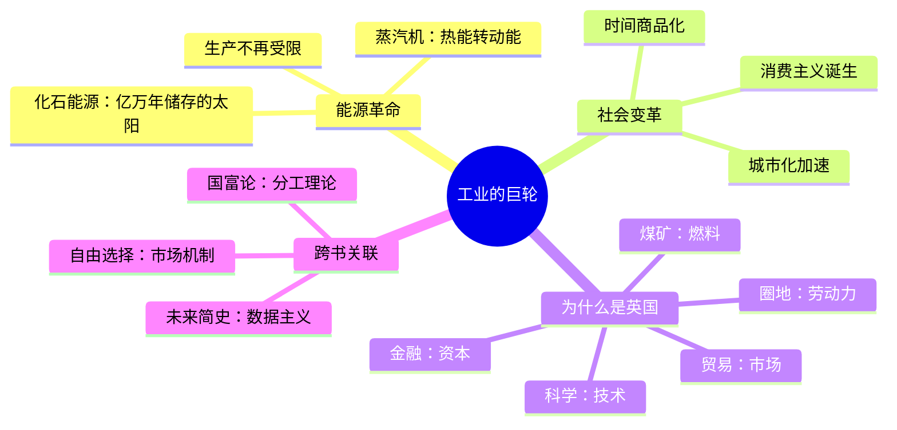

# 第5章 工业的巨轮

## 📍 章节定位

**全书位置**：科学革命之后，人类如何利用能源革命重塑世界。

**章节序列**：科学革命→**工业革命**，从"承认无知"到"驾驭能量"的跃迁。

**一句话定位**：
> 工业革命的核心不是蒸汽机，而是人类学会了如何高效地转换能量——从此，生产不再受限于人力和畜力。

---

## 🎯 核心观点（三层提取）

### 观点1：能源革命——人类突破了"能量天花板"

| 层次 | 内容 |
|------|------|
| 📖 **表层（案例）** | 以前，你想要运输100吨货物，需要养100匹马，每匹马要吃草、要休息。现在，你只需要一台蒸汽机，加几铲煤，就能日夜不停。 |
| ⚙️ **中层（机制）** | 传统社会：能量来源=太阳能→植物→动物/人力。工业社会：能量来源=化石能源（煤/石油）→蒸汽机/内燃机→机械动力。 |
| 🔮 **底层（规律）** | **能量转换定律**：人类历史的每一次跃迁，本质上都是能量利用效率的革命。谁能更高效地转换能量，谁就能主宰世界。 |

**降维翻译**：
- **原文**：工业革命使人类能够将热能转化为动能
- **降维**：以前靠"吃草的马"，现在靠"吃煤的铁马"
- **类比**：就像从"人力三轮车"升级到"电动三轮车"——同样的活，能量来源变了，效率翻了几十倍

---

### 观点2：蒸汽机——工业革命的第一颗火种

| 层次 | 内容 |
|------|------|
| 📖 **表层（案例）** | 1712年，纽科门发明第一台实用的蒸汽机，用于抽矿井里的水。1769年，瓦特改良蒸汽机，效率提高了4倍。从此，蒸汽机从矿井走向工厂、轮船、火车。 |
| ⚙️ **中层（机制）** | 蒸汽机的本质是：把热能（燃烧煤）→动能（推动活塞）→机械能（驱动机器）。这是一套全新的能量转换系统。 |
| 🔮 **底层（规律）** | **技术放大定律**：一项关键技术的改进，会产生指数级的社会影响。瓦特改良的不是蒸汽机，是人类的生产力天花板。 |

**降维翻译**：
- **原文**：蒸汽机将热能转化为动能，是人类历史上最重要的发明之一
- **降维**：烧一铲煤，干十个人的活——这就是蒸汽机
- **类比**：就像智能手机——看起来只是个电话，实际上改变了整个行业

---

### 观点3：时间观念的革命——从"日出而作"到"朝九晚五"

| 层次 | 内容 |
|------|------|
| 📖 **表层（案例）** | 传统农民日出而作、日落而息，时间跟着太阳走。工业时代的工人，必须按时打卡，时间跟着钟表走。 |
| ⚙️ **中层（机制）** | 工业生产需要精确协调：机器不停，工人轮班。传统时间观（自然时间）→现代时间观（工业时间）。时间从"自然节律"变成了"生产节律"。 |
| 🔮 **底层（规律）** | **时间商品化定律**：工业革命不仅生产了商品，还生产了"标准时间"。时间从"自然流逝"变成了"可以买卖的资源"。 |

**降维翻译**：
- **原文**：工业革命创造了全新的时间观念
- **降维**：以前"太阳说了算"，现在"老板说了算"
- **类比**：就像外卖骑手——以前送完就回家，现在每单都有倒计时

---

### 观点4：消费主义的诞生——从"够用就好"到"越多越好"

| 层次 | 内容 |
|------|------|
| 📖 **表层（案例）** | 以前，一个人一辈子可能只有两双鞋。现在，一个人可能有二十双鞋，还在不断买新的。为什么？因为生产过剩，必须有人消费。 |
| ⚙️ **中层（机制）** | 工业生产效率太高→商品过剩→必须刺激消费→广告、时尚、消费主义诞生。不是"我需要才买"，而是"买了才觉得需要"。 |
| 🔮 **底层（规律）** | **消费驱动定律**：现代经济必须依靠持续消费来维持运转。"勤俭节约"从美德变成了经济危机的根源。 |

**降维翻译**：
- **原文**：工业革命创造了消费主义文化
- **降维**：以前是"买不起"，现在是"停不下来"
- **类比**：就像双十一——本来不需要的东西，打折就"需要"了

---

### 观点5：化石能源——一场与时间的交易

| 层次 | 内容 |
|------|------|
| 📖 **表层（案例）** | 煤炭和石油本质上是数亿年前光合作用的产物——远古的太阳能被"储存"在地下。工业革命就是人类发现了这个"能源银行"，疯狂提取"存款"。 |
| ⚙️ **中层（机制）** | 化石能源 = 亿万年积累的太阳能，在短短几百年内被释放。人类用"透支未来"的方式换取了前所未有的繁荣。 |
| 🔮 **底层（规律）** | **能源透支定律**：工业文明的繁荣，建立在对化石能源的消耗之上。这是一场与地质时间的赛跑，终点是能源枯竭或环境崩溃。 |

**降维翻译**：
- **原文**：化石能源是远古时期储存的太阳能
- **降维**：烧煤=烧"几亿年前的太阳"
- **类比**：就像发现了一座金山——拼命挖，但总有挖完的一天

---

### 观点6：工业革命为什么发生在英国？

| 层次 | 内容 |
|------|------|
| 📖 **表层（案例）** | 中国和印度曾经比欧洲更富裕、技术更发达。但工业革命偏偏发生在英国。为什么？不是因为英国人更聪明，而是因为英国有"完美的巧合"。 |
| ⚙️ **中层（机制）** | 英国的独特条件：大量煤矿（燃料）、圈地运动（劳动力）、全球贸易（市场）、科学革命（技术）、金融革命（资本）。这些条件同时出现，才点燃了工业革命。 |
| 🔮 **底层（规律）** | **历史偶然定律**：重大历史变革往往不是必然，而是多个偶然因素的叠加。差一个条件，工业革命可能发生在别处，或者根本不发生。 |

**降维翻译**：
- **原文**：工业革命在英国爆发是多种因素共同作用的结果
- **降维**：英国凑齐了"天时地利人和"的所有拼图
- **类比**：就像创业成功——不是你厉害，是所有条件都刚好对了

---

## 💬 金句库

### 原书金句
> "工业革命的核心是能源革命。"

> "蒸汽机将热能转化为动能，改变了人类的生产方式。"

> "工业革命不仅改变了生产，还改变了人类对时间的理解。"

> "化石能源是亿万年积累的太阳能。"

> "现代经济必须依靠持续消费来维持运转。"

### 降维金句
> "以前靠'吃草的马'，现在靠'吃煤的铁马'。"

> "烧一铲煤，干十个人的活——这就是蒸汽机。"

> "以前'太阳说了算'，现在'老板说了算'。"

> "以前是'买不起'，现在是'停不下来'。"

> "烧煤=烧'几亿年前的太阳'。"

> "英国凑齐了'天时地利人和'的所有拼图。"

> "工业革命不是英国人更聪明，是英国条件更完美。"

## 🔗 当下映射

### 💰 财富应用

| 场景 | 具体行动 | 预期效果 | 风险提示 |
|------|----------|----------|----------|
| 能源投资 | 理解"能源革命"的逻辑，识别新一轮能源转型机会（新能源） | 把握碳中和红利 | 技术路线不确定 |
| 消费反思 | 认识"消费主义"的机制，避免被广告操控 | 减少冲动消费 | 不要完全拒绝消费 |
| 时间管理 | 把时间当作"稀缺资源"，而非"自然流逝" | 提高时间利用效率 | 避免变成"时间的奴隶" |

### 💼 职场应用

| 场景 | 具体行动 | 所需能力 | 适用职级 |
|------|----------|----------|----------|
| 效率提升 | 用"能量转换"思维优化工作流程 | 流程分析能力 | 中层以上 |
| 产品策略 | 理解"消费主义"心理，设计更具吸引力的产品 | 用户心理洞察 | 产品经理 |
| 战略规划 | 识别"技术放大效应"，提前布局关键技术 | 技术趋势判断 | 高层 |

### 🏠 生活应用

| 场景 | 具体行动 | 可行性 | 见效时间 |
|------|----------|--------|----------|
| 消费习惯 | 识别"消费主义陷阱"，区分"需要"和"想要" | 高 | 短期 |
| 时间观念 | 反思"朝九晚五"是否适合自己，探索灵活工作 | 中 | 中期 |
| 能源意识 | 理解能源危机的本质，培养可持续生活方式 | 高 | 长期 |

### 72小时应用计划
1. **今天**：统计你今天"冲动消费"了多少次？分析背后的"消费主义陷阱"
2. **明天**：计算你今天的"时间成本"——你的时间值多少钱？
3. **本周**：分析一个"技术放大效应"的案例（如ChatGPT对行业的影响）

---

## 🕸️ 章节关联

### 向上：整书关联
- **核心问题**：本章回答"科学革命之后，人类如何利用新技术重塑世界"——答案是能源革命
- **论证位置**：科学革命的延伸，从"承认无知"到"驾驭能量"

### 横向：章节序列

| 章节编号 | 章节标题 | 关联类型 | 连接描述 |
|----------|----------|----------|----------|
| 第4章 | 科学革命 | 前提 | 科学革命创造了技术基础，工业革命实现了技术应用 |
| 第3章 | 人类的融合统一 | 背景 | 金钱和帝国的统一为工业革命提供了市场 |
| 第6章 | 智人末日 | 延伸 | 工业革命的终极后果——环境危机与人类改造 |

### 跨书关联

| 书籍 | 概念 | 关系 | 备注 |
|------|------|------|------|
| [[自由选择-弗里德曼-拆解记录]] | 市场机制 | 互补 | 弗里德曼讲市场如何配置资源，赫拉利讲技术如何创造资源 |
| [[国富论-亚当·斯密-拆解记录]] | 分工 | 延伸 | 斯密的分工理论在工业革命中达到极致 |
| [[未来简史-赫拉利-拆解记录]] | 数据主义 | 延伸 | 工业革命的下一站——数据成为新的"能源" |

### 关联可视化

---

## ❓ 问答设计

### Q1: 工业革命的核心是什么？（记忆型）
**认知层次**: 记忆
**难度**: 低
**答案要点**:
- 能源革命——人类学会了高效转换能量
- 从依赖人力/畜力到利用化石能源
- 蒸汽机是关键发明

### Q2: 蒸汽机为什么如此重要？（理解型）
**认知层次**: 理解
**难度**: 中
**答案要点**:
- 把热能转化为动能
- 效率比人力高几十倍
- 可以24小时不间断工作
- 开启了机械化生产时代

### Q3: 工业革命如何改变了人类的时间观念？（理解型）
**认知层次**: 理解
**难度**: 中
**答案要点**:
- 从"自然时间"（日出而作）到"工业时间"（朝九晚五）
- 时间从"自然节律"变成"生产节律"
- 时间变成了可以买卖的商品
- 钟表成为控制工具

### Q4: 消费主义是如何诞生的？（分析型）
**认知层次**: 分析
**难度**: 高
**答案要点**:
- 工业生产效率太高→商品过剩
- 必须刺激消费才能维持经济运转
- 广告、时尚创造"虚假需求"
- "勤俭节约"从美德变成经济危机的根源

### Q5: 为什么工业革命发生在英国而非中国？（分析型）
**认知层次**: 分析
**难度**: 高
**答案要点**:
- 英国的独特条件：煤矿、圈地、贸易、科学、金融
- 中国当时虽然更富裕，但缺少关键条件
- 这是历史偶然，不是文化必然
- 多个因素刚好同时出现

### Q6: 化石能源的本质是什么？有什么隐患？（分析型）
**认知层次**: 分析
**难度**: 高
**答案要点**:
- 本质是亿万年积累的太阳能
- 人类在几百年内"透支"了地质时间的积累
- 隐患：能源枯竭、环境崩溃、气候变化
- 这是与时间的赛跑

### Q7: 如何用"能量转换"思维理解AI革命？（应用型）
**认知层次**: 应用
**难度**: 高
**答案要点**:
- 工业革命：热能→动能→生产力
- AI革命：电能→智能→生产力
- 都是"能量/资源转换效率"的革命
- 关键技术同样会产生"放大效应"

### Q8: 工业革命对2026年有什么启示？（综合型）
**认知层次**: 综合
**难度**: 高
**答案要点**:
- 技术变革会改变社会结构（时间观念、消费习惯）
- 能源转型是核心（从化石到新能源）
- 关键技术有"放大效应"——提前布局
- 历史是偶然的——没有必然的赢家

---
