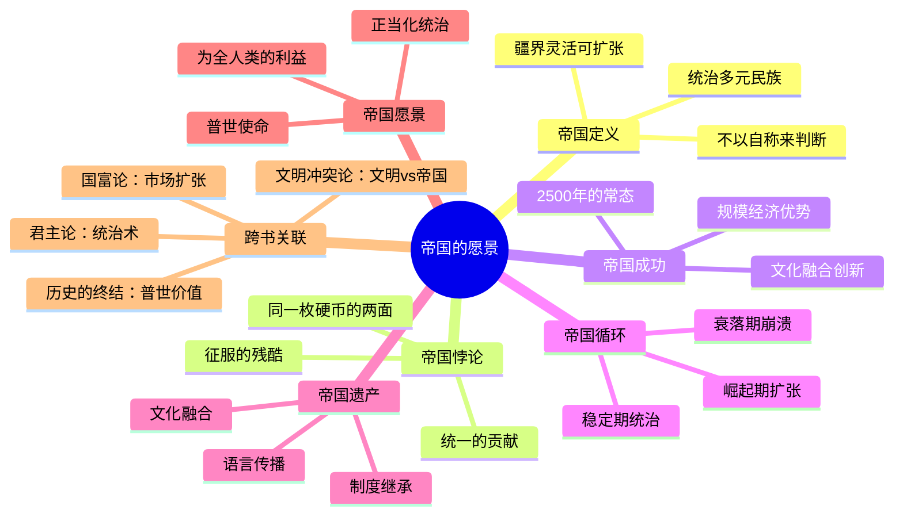

# 第7章 帝国的愿景

## 📍 章节定位

**全书位置**：第三部分"人类的融合统一"的核心章节之一——金钱、帝国、宗教是统一人类的三大力量。

**章节序列**：金钱（第6章）→**帝国**→宗教（第8章），三大虚构秩序之一。

**一句话定位**：
> 帝国是人类历史上最成功的政治模式——它统治多元民族、疆界灵活，通过"邪恶的征服"推动"善意的统一"。

---

## 🎯 核心观点（三层提取）

### 观点1：什么是帝国？——定义与两大特征

| 层次 | 内容 |
|------|------|

**降维翻译**：
- **原文**：帝国是统治多个不同民族的政治秩序，具有文化多元性和疆界灵活性
- **降维**：帝国就是"管很多不一样的人，而且管得越多越好"
- **类比**：就像大公司的并购战略——收购的公司越多越好，不管它们做什么业务

---

### 观点2：帝国的"邪恶"与"贡献"——历史的两面性

| 层次 | 内容 |
|------|------|

**降维翻译**：
- **原文**：帝国既带来征服的残酷，也带来统一的便利
- **降维**：帝国就像"暴力拆迁+重新规划"——拆迁是残酷的，但新小区确实更整齐
- **类比**：就像大公司收购小公司——有人失业（残酷），但产品整合后确实更好用（贡献）

---

### 观点3：帝国是人类历史上最成功的政治模式

| 层次 | 内容 |
|------|------|

**降维翻译**：
- **原文**：帝国是人类历史上最成功的政治模式
- **降维**：帝国就像"超级大国"——能打、能管、能赚钱，所以历史上大多数人都活在帝国里
- **类比**：就像BAT垄断互联网——不是它们善良，是它们效率高

---

### 观点4：帝国的循环——崛起、扩张、衰落

| 层次 | 内容 |
|------|------|

**降维翻译**：
- **原文**：帝国经历崛起、扩张、衰落的循环
- **降维**：帝国就像"创业公司"——起步艰难→做大做强→然后要么转型要么倒闭
- **类比**：就像诺基亚——从木材厂到手机霸主到被微软收购，帝国命运也一样

---

### 观点5：帝国的遗产——文化融合与语言传播

| 层次 | 内容 |
|------|------|

**降维翻译**：
- **原文**：帝国消失后，其文化遗产仍然存在
- **降维**：帝国就像"拆迁后的地基"——房子没了，但地基还在，新房就建在旧地基上
- **类比**：就像前男友——分手了，但他改不掉的习惯你还留着

---

### 观点6：帝国愿景——"为全人类的利益"

| 层次 | 内容 |
|------|------|

**降维翻译**：
- **原文**：帝国用普世愿景来正当化统治
- **降维**：帝国说"我是为了你好"——但到底是谁的好，只有历史知道
- **类比**：就像老板说"996是福报"——他可能真这么想，但你得想想对你是不是福报

---

## 💬 金句库

### 原书金句
> "帝国是人类历史上最成功的政治模式。"

> "帝国统治多个不同民族，疆界可以无限扩张。"

> "征服是残酷的，但征服后的统治往往促进文化交流和技术传播。"

> "过去2500年里，绝大多数人类生活在帝国之中。"

> "帝国会灭亡，但帝国创造的文化会存活。"

> "每个帝国都有自己的'崇高使命'——罗马和平、白人负担、自由民主。"

### 降维金句
> "帝国就是'管很多不一样的人，而且管得越多越好'。"

> "帝国像'暴力拆迁+重新规划'——拆迁残酷，但新小区更整齐。"

> "帝国的'成功'不是道德问题，而是效率问题。"

> "没有永恒的帝国，只有永恒的帝国循环。"

> "帝国就像'拆迁后的地基'——房子没了，地基还在。"

> "帝国说'我是为了你好'——但到底是谁的好，只有历史知道。"

> "2500年来，独立民族国家是新鲜事，帝国才是常态。"

## 🔗 当下映射

### 💰 财富应用

| 场景 | 具体行动 | 预期效果 | 风险提示 |
|------|----------|----------|----------|
| 投资分析 | 用"帝国循环"分析大国兴衰，预判投资趋势 | 理解宏观格局 | 政治因素复杂，谨慎判断 |
| 商业并购 | 理解大公司"帝国战略"（平台化、生态化） | 识别投资标的 | 反垄断风险 |
| 文化产业 | 利用"帝国遗产"概念，分析文化产品传播规律 | 洞察文化趋势 | 避免政治敏感 |

### 💼 职场应用

| 场景 | 具体行动 | 所需能力 | 适用职级 |
|------|----------|----------|----------|
| 战略规划 | 用"帝国愿景"思维设计公司使命愿景 | 战略思维、文化塑造 | 高管 |
| 组织管理 | 理解"多元文化管理"的挑战（帝国统治异族） | 跨文化沟通 | 中层以上 |
| 行业分析 | 用"帝国循环"分析行业巨头兴衰 | 历史思维、趋势洞察 | 全职级 |

### 🏠 生活应用

| 场景 | 具体行动 | 可行性 | 见效时间 |
|------|----------|--------|----------|
| 历史理解 | 用"帝国视角"重新理解世界历史 | 高 | 长期 |
| 国际新闻 | 用"帝国定义"分析大国行为 | 中 | 中期 |
| 批判思维 | 警惕任何"普世使命"的宣称，保持独立判断 | 高 | 短期 |

### 72小时应用计划
1. **今天**：思考你所在的公司/组织是否具有"帝国特征"（多元文化？可扩张边界？）
2. **明天**：用"帝国循环"分析一个行业巨头的兴衰（如诺基亚、柯达）
3. **本周**：观察一个"帝国愿景"的宣称（公司使命、国家政策），思考它到底服务于谁的利益

---

## 🕸️ 章节关联

### 向上：整书关联
- **核心问题**：本章回答"帝国如何作为统一人类的力量之一"——与金钱、宗教并列
- **论证位置**：第三部分"人类的融合统一"的核心章节
- **虚构故事**：帝国是虚构故事的一种——通过"帝国愿景"凝聚多元民族

### 横向：章节序列

| 章节编号 | 章节标题 | 关联类型 | 连接描述 |
|----------|----------|----------|----------|
| 第6章 | 金钱的味道 | 并列 | 金钱、帝国、宗教是统一人类的三大虚构力量 |
| 第8章 | 宗教的法则 | 并列 | 同上，三大力量之一 |
| 第3章 | 人类的融合统一 | 总纲 | 第3章提出框架，第7章深入展开帝国 |
| 第10章 | 科学与帝国 | 延伸 | 科学革命与帝国扩张的互动 |

### 跨书关联

| 书籍 | 概念 | 关系 | 备注 |
|------|------|------|------|
| [[文明冲突论-塞缪尔·亨廷顿-拆解记录]] | 文明断层线 | 对比 | 亨廷顿讲文明冲突，赫拉利讲帝国融合文明 |
| [[历史的终结与最后的人-福山-拆解记录]] | 普世价值 | 互补 | 福山讲自由民主普世化，赫拉利讲帝国如何创造"普世" |
| [[国富论-亚当·斯密-拆解记录]] | 市场扩张 | 互补 | 市场和帝国都是扩张性秩序 |
| [[君主论-马基雅维利-拆解记录]] | 统治术 | 参考 | 马基雅维利讲帝国统治的"技术" |

### 关联可视化

---

## ❓ 问答设计

### Q1: 赫拉利如何定义"帝国"？（记忆型）
**认知层次**: 记忆
**难度**: 低
**答案要点**:
- 帝国是统治多个不同民族的政治秩序
- 两大特征：文化多元性（统治多民族）+ 疆界灵活性（可无限扩张）
- 不以是否自称"帝国"来判断

### Q2: 帝国的"邪恶"和"贡献"分别是什么？（理解型）
**认知层次**: 理解
**难度**: 中
**答案要点**:
- 邪恶：征服战争、文化压迫、民族屠杀
- 贡献：文化交流、技术传播、秩序统一
- 赫拉利强调这是"同一枚硬币的两面"，不是道德辩护，是历史事实

### Q3: 为什么赫拉利说"帝国是人类历史上最成功的政治模式"？（分析型）
**认知层次**: 分析
**难度**: 中
**答案要点**:
- 过去2500年，绝大多数人类生活在帝国中
- 帝国优势：规模经济（大军队能打）、文化融合（多元创新）、秩序稳定
- 这不是道德判断，是效率问题

### Q4: 帝国循环包括哪几个阶段？（理解型）
**认知层次**: 理解
**难度**: 低
**答案要点**:
- 崛起期：军事扩张、资源积累
- 稳定期：统治巩固、文化融合
- 衰落期：过度扩张、内部腐败、外部挑战
- 没有永恒的帝国，只有永恒的循环

### Q5: 什么是"帝国遗产"？（理解型）
**认知层次**: 理解
**难度**: 中
**答案要点**:
- 语言：被统治民族往往采用帝国语言（如拉丁语→罗曼语系）
- 文化：帝国促进文化融合，产生"帝国文化"
- 制度：帝国的行政制度被继承
- 帝国会灭亡，但帝国创造的文化会存活

### Q6: 什么是"帝国愿景"？它有什么作用？（分析型）
**认知层次**: 分析
**难度**: 高
**答案要点**:
- 帝国需要"普世使命"来正当化统治
- 如罗马和平、白人负担、自由民主
- 核心逻辑："我们代表全人类"、"我们的统治是为了你们的利益"
- 是帝国维持统治的意识形态工具

### Q7: 如何用赫拉利的帝国定义来判断当今的大国？（应用型）
**认知层次**: 应用
**难度**: 高
**答案要点**:
- 两个标准：（1）是否统治多个民族？（2）疆界是否可扩张？
- 赫拉利提示：不要看它自称什么，要看它实际做什么
- 应用这个框架分析美国、中国、欧盟等

### Q8: 第7章对2026年有什么启示？（综合型）
**认知层次**: 综合
**难度**: 高
**答案要点**:
- 当今世界可能正在形成新的"帝国格局"（不是传统帝国，但符合定义）
- 技术帝国（科技巨头）、金融帝国（美元体系）、文化帝国（好莱坞/社交媒体）
- 警惕任何"普世使命"的宣称，保持独立判断
- 帝国循环仍在继续：崛起→扩张→衰落

---
