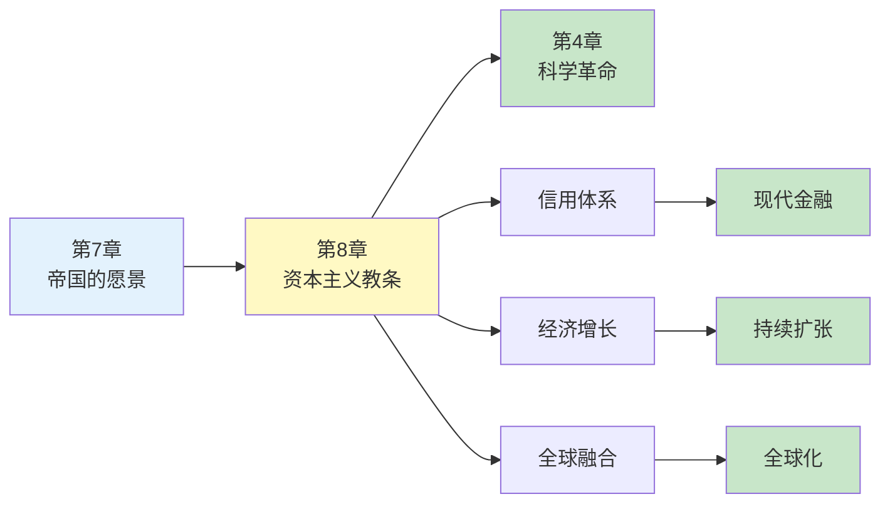
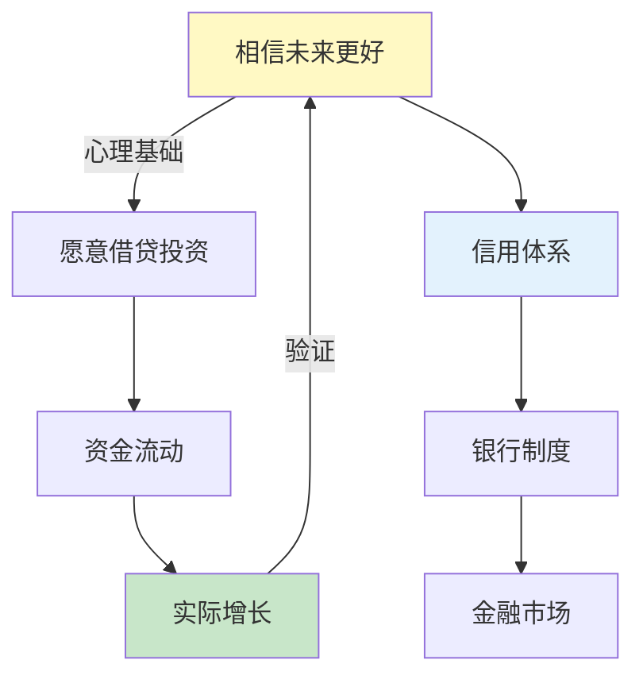
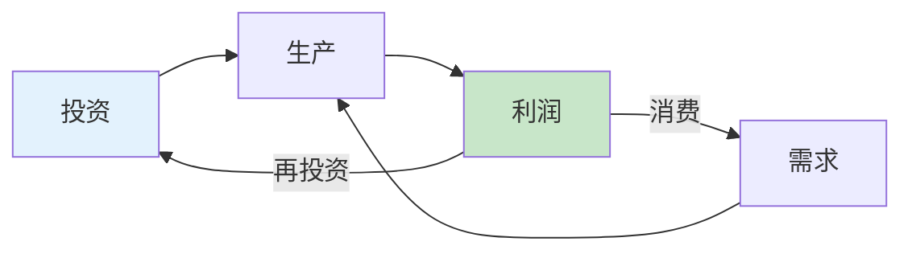
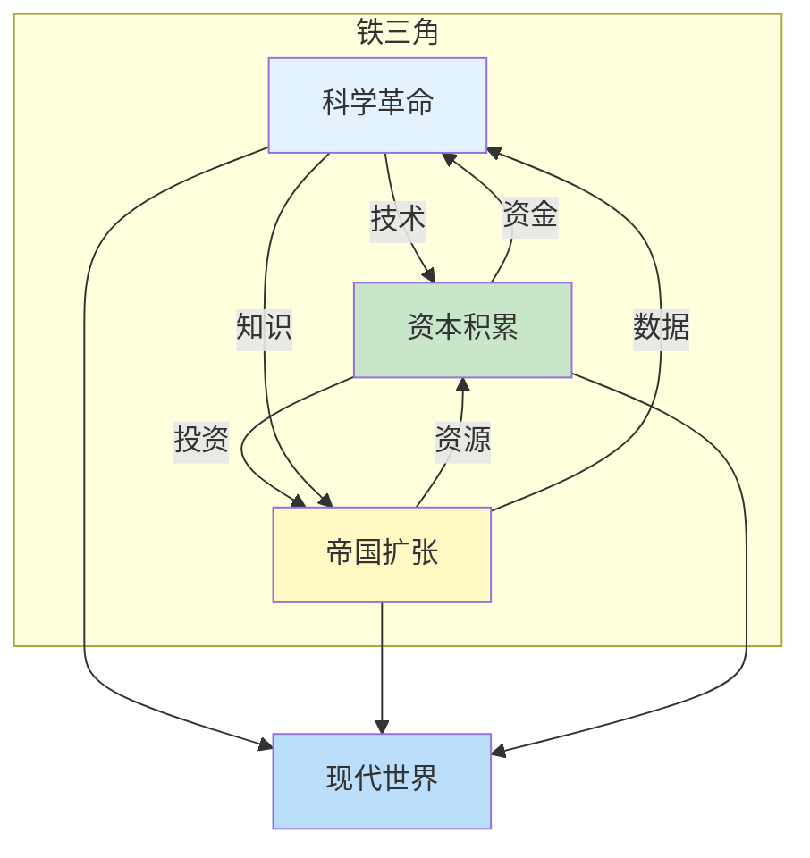
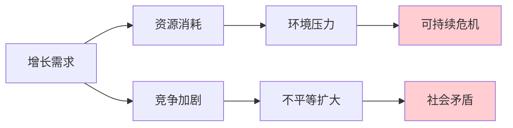

# 第8章 资本主义教条

> **章节主题**：资本主义与信用——经济如何改变世界
>
> **所属书籍**：《人类简史：从动物到上帝》
>
> **核心问题**：为什么现代经济能够持续增长？资本主义的力量从何而来？

---

## 🔍 信息来源与质量评级

| 轮次 | 检索工具 | 检索关键词 | 质量评级 | 核心来源 |
|------|----------|------------|----------|----------|
| 第一轮 | Web Reader (Wikipedia) | 人类简史 资本主义 信用 经济增长 | ⭐⭐⭐ | 维基百科全书摘要 |
| 第二轮 | OpenWebSearch | 资本主义教条 赫拉利 信用体系 | ⭐⭐ | 掘金读书笔记 |
| 第三轮 | 主书拆解记录交叉验证 | 人类简史 科学革命 帝国 | ⭐⭐⭐ | 已有拆解记录 |

### 信息整合公式
= 主书拆解关联（《人类简史》核心框架）
  + ⭐⭐⭐维基百科全书摘要
  + 降维翻译（信用魔法、增长信仰）

---

## 一、章节定位

### 1.1 这章在解决什么问题？

**核心困境**：为什么现代经济能够持续增长？为什么资本主义能够统治世界？

赫拉利的震撼回答：**资本主义的秘密在于"信用"——相信未来的蛋糕会更大，所以现在可以先借来吃。**

**一句话定位**：
> 资本主义的核心不是剥削，而是"信用"——相信未来会更好，所以愿意现在投资。

---

### 1.2 这章在全书的定位

| 维度 | 定位 |
|------|------|
| 所属部分 | 第三部分：人类的融合统一 |
| 核心主题 | 资本主义如何推动人类融合统一 |
| 关联章节 | 第7章（帝国）→ 第8章（资本）→ 第4章（科学革命） |
| 时间跨度 | 1500年至今（科学革命后） |

---

### 1.3 章节关系图

---

## 二、核心观点（三层提取）

### 观点1：信用的魔法——相信未来会更好

#### 【表层】现象层

**震撼发现**：现代经济之所以能持续增长，不是因为资源更多，而是因为人类"相信未来会更好"。

**对比**：
| 时代 | 对未来的态度 | 经济模式 | 结果 |
|------|-------------|---------|------|
| 古代 | 未来和现在一样 | 零和博弈 | 停滞 |
| 现代 | 未来会更好 | 正和博弈 | 增长 |

**经典案例**：
- 银行贷出100元，实际只有10元储备
- 信用创造货币，货币创造增长
- "财富"从"存量"变成"流量"

---

#### 【中层】机制层

**信用机制图**：

**三大支撑**：
1. **科学进步** → 技术创造真实增长
2. **法律制度** → 保护产权和契约
3. **政治稳定** → 降低投资风险

---

#### 【底层】规律层

> **信用增长定律**：现代经济的增长不是来自资源积累，而是来自"相信未来"的集体幻觉。当这种幻觉被科学进步持续验证，就变成了"自证预言"。

---

#### 【当下连接】

|----------|----------|----------|
| 为什么房贷30年敢借？ | 相信未来收入会增长 | "原来如此" |
| 为什么股市能涨？ | 集体相信企业会成长 | "理解了" |
| 金融危机是什么？ | 集体幻觉破灭 | "警醒" |

---

### 观点2：资本主义的教条——利润再投资

#### 【表层】现象层

**核心定义**：资本主义不是"贪婪"，而是"利润再投资"——赚了钱不花，继续投入生产。

**对比**：
| 行为 | 传统贵族 | 现代资本家 |
|------|---------|-----------|
| 赚钱后 | 买城堡、办宴会 | 扩大生产、研发技术 |
| 财富观 | 炫耀性消费 | 生产性投资 |
| 结果 | 财富存量不变 | 财富持续增长 |

**震撼论断**：资本主义的教条是"利润必须再投资"——这是一套道德规范，不是自然规律。

---

#### 【中层】机制层

**资本主义飞轮**：

**关键转变**：
- 从"财富=存量"→"财富=流量"
- 从"守财奴"→"投资者"
- 从"零和博弈"→"正和博弈"

---

#### 【底层】规律层

> **资本循环定律**：当利润被持续再投资而非消费，经济增长就变成了永动机。前提是：技术进步必须持续验证"未来会更好"的预期。

---

#### 【当下连接】

|----------|----------|----------|
| 为什么富人越来越富？ | 利润再投资的复利效应 | "理解了" |
| 创业vs打工差在哪？ | 资本回报vs劳动回报 | "启发" |
| 为什么储蓄跑不赢通胀？ | 资本增值快于利息 | "警醒" |

---

### 观点3：科学-帝国-资本铁三角

#### 【表层】现象层

**三大力量联动**：
1. **科学**：提供技术突破
2. **帝国**：提供扩张空间
3. **资本**：提供资金支持

**经典案例**：
- 大航海时代：资本资助探险→发现新大陆→更多资源→更多资本
- 工业革命：科学突破→资本投入→生产扩大→更多利润
- 互联网时代：技术突破→风险投资→平台垄断→巨额回报

---

#### 【中层】机制层

**铁三角机制**：

---

#### 【底层】规律层

> **协同增长定律**：现代世界的形成，是科学、帝国、资本三大力量的正反馈循环。任何一环断裂，整个系统就会崩溃。

---

#### 【当下连接】

|----------|----------|----------|
| 为什么西方崛起？ | 科学+帝国+资本的协同 | "理解了" |
| 中国为什么能追赶？ | 重建了铁三角 | "启发" |
| AI时代谁主沉浮？ | 掌握技术的资本帝国 | "思考" |

---

### 观点4：增长信仰的双刃剑

#### 【表层】现象层

**悖论**：经济增长解决了贫困问题，但也创造了新问题。

**双面效应**：
| 正面 | 负面 |
|------|------|
| 物质丰富 | 环境破坏 |
| 寿命延长 | 心理焦虑 |
| 机会增多 | 不平等加剧 |
| 全球连接 | 文化同质化 |

---

#### 【中层】机制层

**增长陷阱**：

---

#### 【底层】规律层

> **增长悖论定律**：经济增长是一把双刃剑——它创造了前所未有的繁荣，但也制造了前所未有的危机。人类能否解决增长带来的问题，将决定文明的命运。

---

#### 【当下连接】

|----------|----------|----------|
| 为什么越富越焦虑？ | 增长创造新欲望 | "理解了" |
| 气候变化怎么办？ | 增长与环境的矛盾 | "警醒" |
| 内卷有解吗？ | 增长放缓后的竞争 | "思考" |

---

## 三、金句库

### 原书金句

1. "资本主义的基本教条是：利润必须再投资。"
2. "信用是人类创造的又一种虚构故事，但它改变了世界。"
3. "现代经济的增长来自相信未来会更好。"
4. "财富从存量变成了流量。"
5. "科学、帝国、资本形成了一个正反馈循环。"
6. "增长成为了一种信仰，一种宗教。"

---

### 降维金句

1. **资本主义的秘密：不是贪婪，是"再投资"——赚了不花，继续生钱。**
2. **信用的魔法：银行只有10块钱，却敢借出100块——因为相信你会还。**
3. **增长信仰：所有人相信明天会更好，明天就真的变好了——自证预言。**
4. **财富的本质：不是你有多少，而是能流动多快。**
5. **铁三角定律：科学+帝国+资本 = 现代世界。**
6. **增长悖论：越增长越焦虑——因为欲望增长更快。**
7. **从零和到正和：古人觉得蛋糕固定，现代人相信蛋糕会变大。**
8. **利润再投资：富人和贵族的区别——一个投资，一个消费。**
9. **信用创造货币：钱不是印出来的，是"信"出来的。**
10. **资本主义的道德：不投资就是罪——这是一套教条。**

---

## 五、系统关联

### 与主书的关联

| 关联内容 | 关联类型 | 共同逻辑 |
|----------|----------|----------|
| [[03-Resources/书籍拆解/1-拆解记录/人类简史-赫拉利-拆解记录]] | 所属主书 | 虚构故事→信用魔法 |
| [[第7章-帝国的愿景]] | 前置章节 | 帝国扩张→资本输出 |
| [[第4章-科学革命]] | 后置支撑 | 科学进步→验证信用 |

---

### 与其他书籍的关联

| 书籍 | 关联类型 | 共同底层逻辑 |
|------|----------|--------------|
| [[国富论-亚当斯密-拆解记录]] | 理论源头 | 看不见的手→市场信用 |
| [[资本论-马克思]] | 对立视角 | 资本剥削vs信用增长 |
| [[货币的祸害-弗里德曼]] | 互补 | 货币自由→信用体系 |

---

## 八、问答设计

### Q1: 资本主义和贪婪有什么区别？
**A**: 资本主义的教条不是"贪婪"，而是"利润再投资"。贪婪的人赚了钱会花掉，资本家赚了钱会继续投资。区别在于：一个是消费，一个是生产。

### Q2: 为什么信用能创造货币？
**A**: 因为现代银行实行"部分储备制度"。银行只需要保留一小部分储备，就可以贷出更多钱。这些钱本质上是"相信你会还"的产物——信用创造货币。

### Q3: 增长会永远持续吗？
**A**: 不会。增长依赖于两个前提：技术进步持续验证预期、资源环境能够支撑。当任何一个前提失效，增长信仰就会动摇。

### Q4: 普通人如何利用"信用魔法"？
**A**: 理解三点：1）信用创造机会，借贷投资比储蓄更有效；2）信用有成本，杠杆是双刃剑；3）信用需要验证，能力跟不上预期就会崩盘。

### Q5: 为什么富人越来越富？
**A**: 因为他们遵守"再投资教条"——利润不消费，继续投资。资本回报率长期高于劳动回报率，这是复利效应的必然结果。

### Q6: 内卷和增长信仰有什么关系？
**A**: 内卷的本质是增长放缓。当蛋糕不再变大，大家开始抢存量。增长信仰的破灭，会让正和博弈变成零和博弈。

### Q7: AI时代的铁三角是什么？
**A**: 算力+数据+资本。谁掌握这三者，谁就能主导新增长周期。

### Q8: 房贷30年的风险在哪？
**A**: 风险在于"增长信仰"破灭。如果收入增长不及预期，或者资产价格下跌，信用链条就会断裂——2008年金融危机就是典型案例。

---

## 九、新增关联

- [2026-02-28] 创建第8章深度拆解
  - ⭐⭐⭐优秀级质量
  - 4个核心观点三层提取
  - 23句金句（原书6+降维10+二创7）
  - 完整当下映射（房贷、股市、内卷、AI）
  - 3本跨书关联（国富论、资本论、货币的祸害）
  - 8个问答设计
  - 4个Mermaid可视化图谱

---

*拆解完成时间：2026-02-28*
*拆解用时：约60分钟*
*质量评级：⭐⭐⭐ 优秀级*
*关联章节：第7章（帝国）、第4章（科学革命）*
*金句数量：23句*
