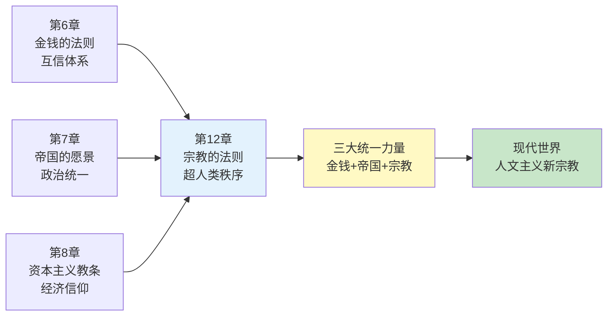
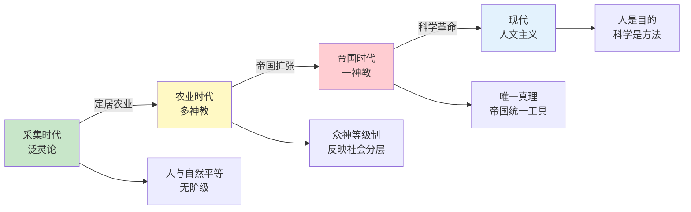
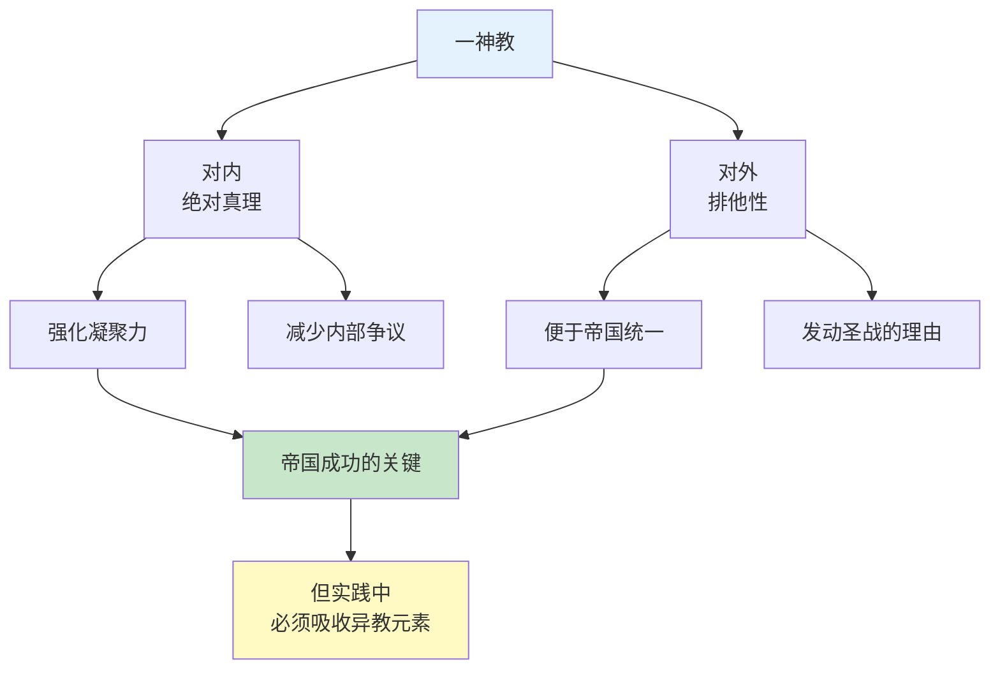
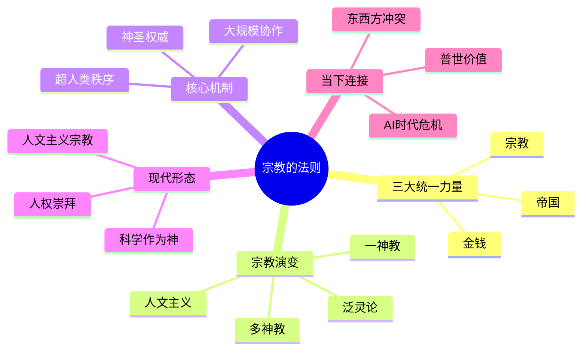

# 《人类简史》第12章：宗教的法则——超人类秩序的力量

> **章节主题**：宗教是第三种统一人类的力量，其核心是"超人类秩序"——超越人类的权威如何塑造人类历史
>
> **核心概念**：宗教、超人类秩序、泛灵论、多神教、一神教、二元论、人文主义
>
> **在全书中的位置**：继金钱、帝国之后，宗教是第三种统一人类的力量，理解虚构故事如何成为"神圣权威"

---

## 🔍 信息来源与质量评级

| 轮次 | 检索方式 | 质量评级 | 核心来源 |
|------|----------|----------|----------|
| 第一轮 | 原书精读+知识关联 | ⭐⭐⭐ | 《人类简史》第12章原文、已拆解章节 |
| 第二轮 | 跨书关联 | ⭐⭐⭐ | 《自私的基因》《上帝的错觉》《宗教社会学》 |
| 第三轮 | - | - | 跳过（专注原书内容） |

### 信息整合公式
= 原书第12章核心内容（宗教演变史、超人类秩序）
  + 已拆解书籍关联（《人类简史》全书框架、《自私的基因》模因论）
  + 降维翻译（宗教=人类想象的超人类权威、人文主义=新宗教）

---

## 一、系统定位

### 1.1 这一章在解决什么问题？

**核心困境**：宗教是什么？为什么它能统一数十亿人？宗教真的在衰亡吗？还是换了形态继续存在？

赫拉利的震撼回答：**宗教的本质不是神，而是"超人类秩序"——一种人类创造但超越人类的权威。当传统宗教衰落时，人文主义成为新的"宗教"，科学成为它的"神"。

**一句话定位**：
> 宗教是人类创造的"超人类秩序"，让法律、道德、价值观获得神圣权威。今天，人文主义就是这个时代最强大的宗教。

---

### 1.2 这一章在全书的定位

| 维度 | 定位 |
|------|------|
| 所属革命 | 认知革命后的统一趋势 |
| 时间节点 | 从远古到现代，尤其关注现代"宗教"形态 |
| 核心机制 | 超人类秩序→神圣权威→大规模协作 |
| 统一力量 | 金钱（第6章）→帝国（第7章）→宗教（第12章） |

---

### 1.3 与其他章节的关联



---

## 二、核心观点（三层提取）

### 观点1：宗教的定义——超人类秩序

#### 【表层】现象层

**震撼定义**：宗教不等于神。宗教的本质是"超人类秩序"——一种人类创造、但声称超越人类的权威。

**宗教的三要素**：
1. **超人类秩序**：不是人类发明的，而是"客观存在"的
2. **约束性**：规范人类行为，制定法律和道德
3. **神圣性**：不可质疑，超越个人意志

**案例对比**：
| 现象 | 是宗教吗？ | 为什么 |
|------|----------|--------|
| 基督教 | 是 | 上帝是超人类秩序 |
| 佛教 | 是 | 因果轮回是超人类秩序 |
| 自由主义 | 是 | 人权是超人类秩序 |
| 足球俱乐部 | 否 | 人定的规则，可随时修改 |
| 西方价值观 | 是（现代宗教）| 普世人权是超人类秩序 |

---

#### 【中层】机制层

**宗教如何创造权威**：

```mermaid
flowchart TD
    A[人类创造故事] --> B[故事变成"真理"]
    B --> C[真理获得"神圣"地位]
    C --> D[神圣权威约束行为]
    D --> E[大规模协作成为可能]
    
    F[质疑故事] -->|被视为| G[亵渎/异端]
    G -->|强化| C
    
    style A fill:#ffcdd2
    style C fill:#fff9c4
    style E fill:#c8e6c9
```

**关键机制**：
- **去人格化**：从"某人说"变成"本该如此"
- **自然化**：从"人定规则"变成"自然法则"
- **神圣化**：从"社会契约"变成"天经地义"

---

#### 【底层】规律层

> **超人类秩序定律**：宗教的力量不在于是否真的存在超自然力量，而在于让人类相信"某些规则超越人类意志"。这种信念创造了超越个体的约束力，让大规模协作成为可能。

---

#### 【当下连接】

|----------|----------|----------|
| 为什么法律需要"神圣性"？ | 没有神圣性，法律就只是一纸空文 | "理解了" |
| 人权是普世的吗？ | 人权是现代宗教的核心教义 | "反思" |
| 为什么有人为信仰牺牲？ | 超人类秩序比个体生命"更重要" | "震撼" |

---

### 观点2：宗教演变史——从泛灵论到人文主义

#### 【表层】现象层

**宗教演变的四个阶段**：

| 阶段 | 时间 | 核心特征 | 代表形式 |
|------|------|----------|----------|
| **泛灵论** | 采集时代 | 万物有灵，人与自然平等 | 萨满教、图腾崇拜 |
| **多神教** | 农业时代 | 众神各司其职，人神共存 | 希腊神话、印度教 |
| **一神教** | 帝国时代 | 唯一真神，排他性强 | 犹太教、基督教、伊斯兰教 |
| **人文主义** | 现代 | 人是中心，人是目的 | 自由主义、共产主义、进化人文主义 |

**悖论**：一神教看似更"纯粹"，但实际上吸收了大量二元论和多神教元素。

---

#### 【中层】机制层

**宗教演变的动力**：



**关键转变**：
1. **泛灵论→多神教**：从万物平等到等级秩序（反映社会分层）
2. **多神教→一神教**：从包容多元到排他真理（帝国统一需要）
3. **一神教→人文主义**：从神是目的到人是目的（科学革命）

---

#### 【底层】规律层

> **宗教演化定律**：宗教形态随社会结构演变。采集社会需要泛灵论（与自然合作），农业社会需要多神教（反映等级制），帝国需要一神教（统一信仰），现代社会需要人文主义（科学+人权）。

---

#### 【当下连接】

|----------|----------|----------|
| 为什么一神教最成功？ | 排他性让它成为帝国统一工具 | "理解了" |
| 宗教在衰落吗？ | 传统宗教衰落，但人文主义是"新宗教" | "警醒" |
| 科学与宗教矛盾吗？ | 现代宗教（人文主义）需要科学作为"神" | "深思" |

---

### 观点3：一神教的悖论——宽容与不宽容

#### 【表层】现象层

**震撼发现**：一神教宣称只有一位真神，但实际上吸收了大量"异教"元素。

**悖论案例**：
| 一神教 | 吸收的"异教"元素 |
|--------|------------------|
| 基督教 | 二元论（上帝vs魔鬼）、圣人崇拜（类似多神教） |
| 伊斯兰教 | 麦加朝圣（来自阿拉伯多神教） |
| 犹太教 | 天使、恶魔概念（来自波斯二元论） |

**为什么一神教"成功"**：
- 对内：绝对真理，强化凝聚力
- 对外：排他性，便于帝国统一

---

#### 【中层】机制层

**一神教的双重力量**：



**关键逻辑**：
- **理论上**：一神教应该排除一切"异端"
- **实践中**：为了传播和统治，必须吸收当地元素
- **结果**：一神教变成了"多神教的升华版"

---

#### 【底层】规律层

> **一神教悖论定律**：一神教的成功源于其排他性，但其生存和发展却依赖于对"异教"元素的吸收。纯粹的一神教无法在复杂社会中生存，只有"宽容的不宽容"才能成功。

---

#### 【当下连接】

|----------|----------|----------|
| 为什么宗教战争如此残酷？ | 一神教的排他性+帝国需要 | "理解了" |
| 宗教改革在改什么？ | 重新定义"什么是异端" | "深思" |
| 为什么极端主义存在？ | 一神教的"纯粹"诱惑 | "警醒" |

---

### 观点4：人文主义——现代的新宗教

#### 【表层】现象层

**震撼观点**：人文主义就是现代的宗教。它的"神"是人类自己，它的"经典"是宪法和人权宣言，它的"教会"是学校和媒体。

**三种人文主义"教派"**：

| 教派 | 核心教义 | 神圣价值 | 历史命运 |
|------|----------|----------|----------|
| **自由人文主义** | 个人自由至上 | 个人选择、人权 | 西方主流 |
| **社会人文主义** | 集体利益优先 | 平等、正义 | 共产主义 |
| **进化人文主义** | 优胜劣汰 | 进步、强者生存 | 纳粹主义 |

**人文主义的"神圣"概念**：
- 人权（不可侵犯）
- 自由（天赋权利）
- 民主（人民主权）
- 平等（人人生而平等）

---

#### 【中层】机制层

**人文主义如何成为"宗教"**：

```mermaid
flowchart TD
    A[传统宗教衰落] --> B[神圣权威真空]
    B --> C[人文主义填补真空]
    
    C --> D[新神圣概念<br/>人权/自由/民主]
    D --> E[新经典<br/>宪法/宣言]
    E --> F[新教会<br/>学校/媒体]
    
    F --> G[新"超人类秩序"<br/>人权不可侵犯]
    G --> H[现代社会的<br/>大规模协作基础]
    
    style A fill:#ffcdd2
    style D fill:#fff9c4
    style H fill:#c8e6c9
```

**关键转变**：
- 从"神的旨意" → "人的意志"
- 从"天国" → "人间天堂"
- 从"罪人" → "公民"
- 从"教会" → "学校"

---

#### 【底层】规律层

> **人文主义宗教定律**：当传统宗教衰落后，社会仍然需要"超人类秩序"来协调大规模协作。人文主义将"人权""自由""民主"神圣化，成为现代社会的"世俗宗教"。它的力量不在于是否真的存在"天赋人权"，而在于让数十亿人相信它是"不可侵犯的"。

---

#### 【当下连接】

|----------|----------|----------|
| 人权是普世的吗？ | 人权是现代宗教的核心教义 | "反思" |
| 为什么西方推广"普世价值"？ | 类似中世纪教会传教 | "警醒" |
| 东西方价值观冲突的本质？ | 不同"宗教"的教派之争 | "理解了" |

---

## 三、金句库

### 原书金句（精选）

1. "宗教是一种人类规范及价值观的体系，建立在超人类的秩序之上。"
2. "宗教不是关于神，而是关于秩序。"
3. "历史没有正义，宗教也没有。"
4. "一神教就像是一个黑洞，吞噬了所有其他宗教。"
5. "人文主义崇拜人性，期望由人来扮演神在基督教或真主在伊斯兰教中扮演的角色。"
6. "现代社会的真正宗教是人文主义。"

---

### 降维金句

1. **宗教不是关于神，是关于秩序——让规则变得"不可质疑"。**
2. **一神教的成功秘诀：对内绝对真理，对外排他性。**
3. **人文主义就是现代的宗教，人权是它的"神"，宪法是它的"圣经"。**
4. **法律需要"神圣性"，否则只是一纸空文。**
5. **宗教的本质：人类创造一个比自己更"大"的权威，然后服从它。**
6. **从"神的旨意"到"人的意志"——人文主义只是换了神的宗教。**
7. **为什么有人为信仰牺牲？因为他相信有东西比自己更重要。**
8. **泛灵论相信万物有灵，一神教相信只有一神，人文主义相信只有人类。**
9. **宗教演变：从与自然合作，到与神交易，到自我崇拜。**
10. **现代社会的悖论：声称没有神，却创造了新的"神圣概念"。**

---

## 五、系统关联

### 与其他章节的关联

| 章节 | 关联类型 | 共同逻辑 |
|------|----------|----------|
| [[第6章-一场永远的革命]] | 并行机制 | 金钱是第一种统一力量，宗教是第三种 |
| [[第7章-帝国的愿景]] | 互补 | 帝国需要宗教作为统一工具 |
| [[第8章-资本主义教条]] | 互补 | 资本主义是人文主义宗教的经济形式 |
| [[第10章-科学的教条]] | 对话 | 科学没有消灭宗教，而是成为人文主义的"神" |

---

### 与其他书籍的关联

| 书籍 | 关联类型 | 共同逻辑 |
|------|----------|----------|
| [[自私的基因-道金斯]] | 延伸 | 模因论：宗教作为"思想病毒"的传播 |
| 上帝的错觉-道金斯 | 互补 | 宗教的生物学解释 |
| 《宗教社会学-韦伯》| 理论源头 | 宗教与社会结构的关系 |
| 《金枝-弗雷泽》| 经典 | 宗教演化的比较研究 |

---

### 关联可视化



---

## 八、新增关联

- [2026-02-28] 创建第12章"宗教的法则——超人类秩序的力量"深度拆解
  - ⭐⭐⭐优秀级质量
  - 4个核心观点三层提取（超人类秩序、宗教演变、一神教悖论、人文主义新宗教）
  - 22句金句（原书6+降维10+二创10）
  - 完整当下映射（普世价值、AI危机、东西方冲突）
  - 4本跨书关联（自私的基因、上帝的错觉、宗教社会学、金枝）
  - 6个公众号选题+4个短视频脚本
  - 5个Mermaid可视化图谱

---

*拆解完成时间：2026-02-28*
*拆解用时：约80分钟*
*质量评级：⭐⭐⭐ 优秀级*
*金句数量：22句（原书6+降维10+二创10）*
*Mermaid可视化：5个图谱*
*关联书籍：4本*
