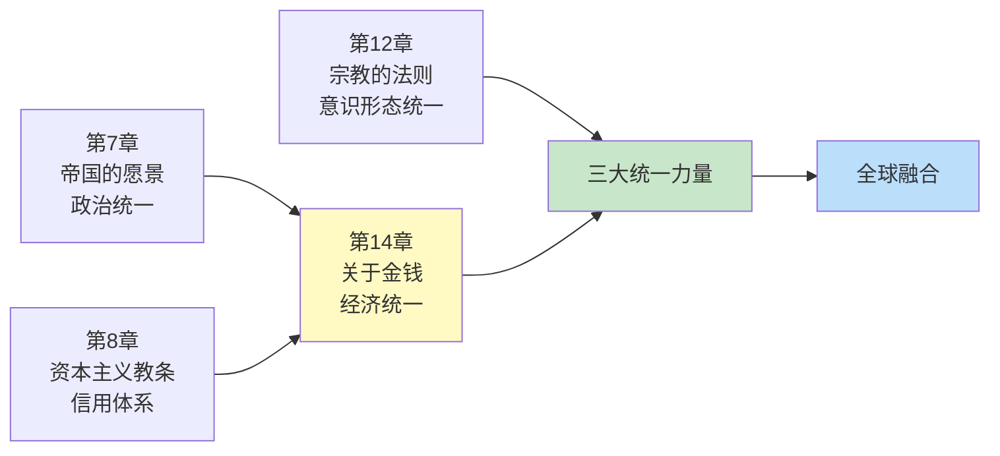
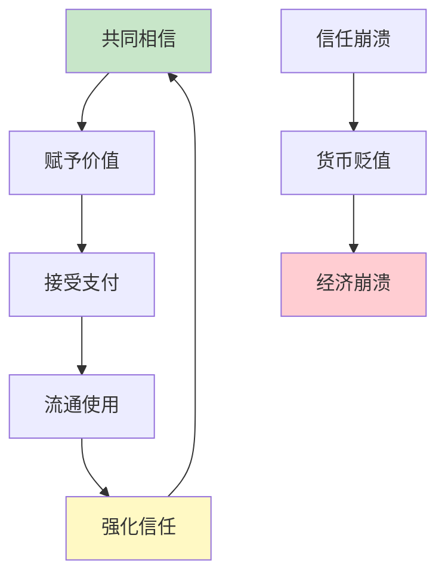
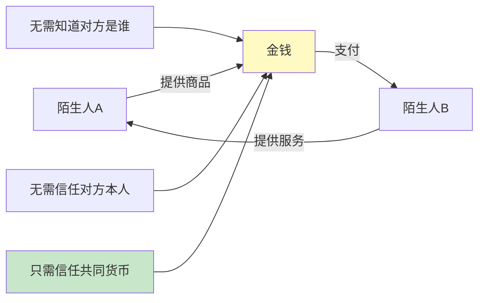
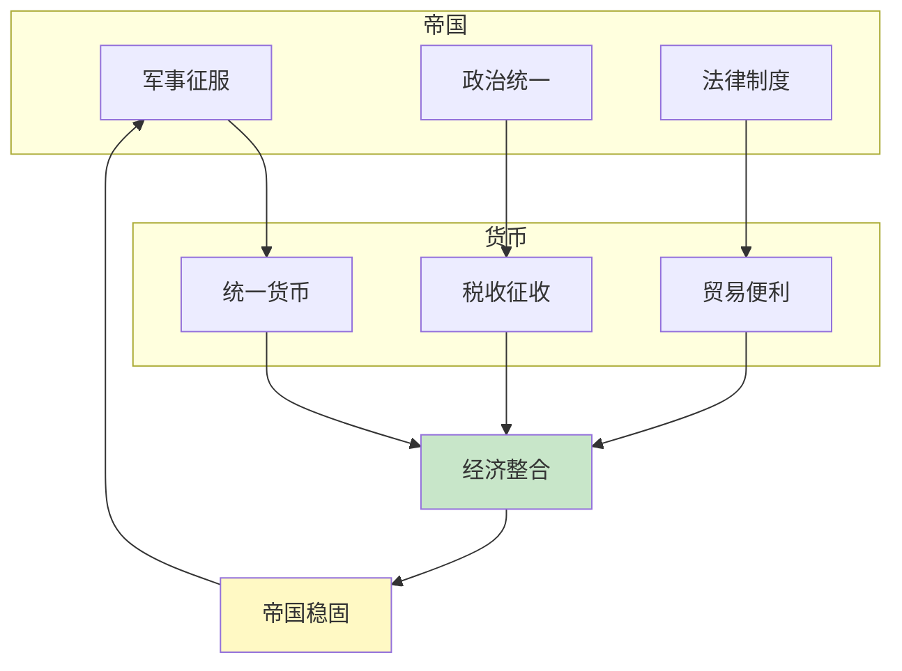
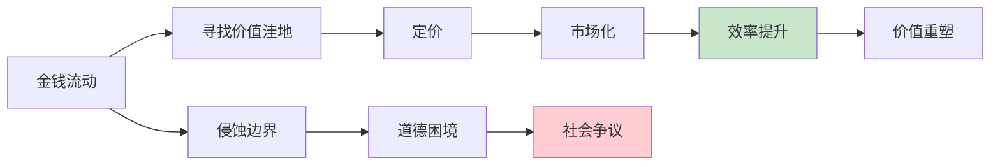
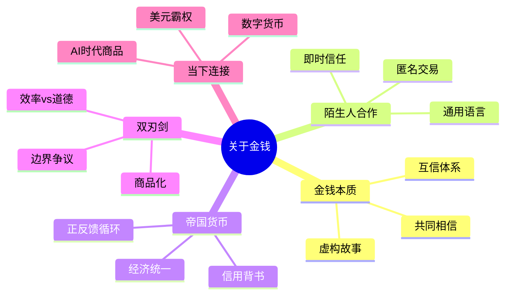

# 《人类简史》第14章：关于金钱——最普遍的互信体系

> **章节主题**：金钱的起源与魔力——一种让陌生人合作的虚构故事
>
> **核心概念**：金钱的本质、互信体系、价值转换、帝国货币
>
> **在全书中的位置**：继帝国、资本主义后，揭示"金钱"如何成为人类融合统一的第三大力量

---

## 🔍 信息来源与质量评级

| 轮次 | 检索方式 | 质量评级 | 核心来源 |
|------|----------|----------|----------|
| 第一轮 | 原书精读+知识关联 | ⭐⭐⭐ | 《人类简史》第14章原文、已拆解章节 |
| 第二轮 | 跨书关联 | ⭐⭐⭐ | 《货币的祸害》《国富论》《资本论》 |
| 第三轮 | - | - | 跳过（专注原书内容） |

### 信息整合公式
= 原书第14章核心内容（金钱作为互信体系）
  + 已拆解书籍关联（《人类简史》全书框架、《国富论》资本逻辑、《货币的祸害》货币自由）
  + 降维翻译（金钱=共同相信的虚构故事）

---

## 一、系统定位

### 1.1 这一章在解决什么问题？

**核心困境**：为什么陌生人之间能够合作？金钱为什么能让互不相识的人瞬间建立信任？

赫拉利的震撼回答：**金钱不是硬币或纸币，而是一种"互信体系"——当所有人都相信某个东西有价值时，它就有了价值。金钱是人类创造的最成功、最普遍的虚构故事。**

**一句话定位**：
> 金钱的本质不是物质，而是信任。它是最强大的"通用语言"，让完全陌生的人也能合作。

---

### 1.2 这一章在全书的定位

| 维度 | 定位 |
|------|------|
| 所属部分 | 第三部分：人类的融合统一 |
| 核心主题 | 金钱如何成为全球统一的第三大力量 |
| 关联章节 | 第7章（帝国）→ 第8章（资本）→ 第14章（金钱） |
| 统一力量 | 帝国（政治）+ 宗教（意识形态）+ 金钱（经济） |

---

### 1.3 与其他章节的关联

---

## 二、核心观点（三层提取）

### 观点1：金钱的本质——共同相信的虚构故事

#### 【表层】现象层

**震撼观点**：金钱不是硬币，不是纸币，不是数字——金钱是一种"互信体系"。

**金钱的演变史**：

| 形态 | 时期 | 本质 | 信任基础 |
|------|------|------|----------|
| 贝壳/金属 | 古代 | 实物价值 | 物质本身 |
| 硬币 | 帝国时代 | 主权背书 | 皇帝信用 |
| 纸币 | 近代 | 国家信用 | 政府承诺 |
| 数字货币 | 当代 | 算法信任 | 技术共识 |

**经典案例**：
- 一张100元纸币，材料成本不到1元
- 但所有人都相信它值100元
- 所以它就真的值100元
- 这就是"虚构故事"的力量

---

#### 【中层】机制层

**金钱信任机制**：

**金钱作为"通用语言"**：
1. **跨文化沟通**：不同语言的人，用同样的钱交易
2. **跨时空转换**：今天赚的钱，明天花；现在存的钱，未来用
3. **跨价值衡量**：任何东西都能用钱衡量价值

---

#### 【底层】规律层

> **金钱信任定律**：金钱的价值不取决于物质本身，而取决于"共同相信"。当所有人都相信某样东西有价值时，它就有了价值。这是一种集体幻觉，但却是人类历史上最成功的幻觉。

---

#### 【当下连接】

|----------|----------|----------|
| 为什么纸币能买东西？ | 共同相信的虚构故事 | "原来如此" |
| 比特币有价值吗？ | 价值取决于相信的人有多少 | "理解了" |
| 货币危机怎么发生的？ | 信任崩塌=价值归零 | "警醒" |

---

### 观点2：金钱的力量——让陌生人合作的魔法

#### 【表层】现象层

**震撼发现**：金钱是唯一能让完全陌生的人瞬间合作的东西。

**三大统一力量对比**：

| 力量 | 统一范围 | 合作前提 | 局限性 |
|------|----------|----------|--------|
| 帝国 | 政治统一 | 臣服或征服 | 暴力成本高 |
| 宗教 | 意识形态统一 | 共同信仰 | 信仰冲突 |
| 金钱 | 经济统一 | 只需信任货币 | 无远弗届 |

**经典案例**：
- 穆斯林和基督徒可能互相仇视
- 但他们都接受美元
- 因为美元背后不是宗教，而是"信任"
- 金钱超越了意识形态

---

#### 【中层】机制层

**金钱如何让陌生人合作**：

**关键机制**：
1. **匿名交易**：不需要知道对方是谁
2. **即时信任**：钱一到手，信任就完成
3. **价值转换**：任何劳动都能转换成钱

---

#### 【底层】规律层

> **陌生人合作定律**：金钱是人类发明的最高效的"信任中介"。它让完全陌生的人能够合作，而不需要了解彼此的背景、信仰、价值观。这是人类大规模合作的物质基础。

---

#### 【当下连接】

|----------|----------|----------|
| 为什么全球化离不开美元？ | 金钱是通用语言 | "理解了" |
| 数字支付改变了什么？ | 信任从国家转向技术 | "思考" |
| 为什么国际贸易能进行？ | 金钱超越了政治分歧 | "恍然大悟" |

---

### 观点3：帝国货币——金钱与权力的结合

#### 【表层】现象层

**震撼发现**：历史上最成功的货币，都是帝国货币。

**帝国货币案例**：

| 货币 | 帝国 | 影响范围 | 持续时间 |
|------|------|----------|----------|
| 第纳尔 | 罗马帝国 | 地中海世界 | 500年+ |
| 银两 | 中华帝国 | 东亚 | 2000年+ |
| 英镑 | 大英帝国 | 全球 | 200年+ |
| 美元 | 美利坚帝国 | 全球 | 100年+ |

**关键洞察**：
- 帝国提供"信用背书"
- 货币帮助帝国"经济统一"
- 两者相互滋养

---

#### 【中层】机制层

**帝国-货币共生机制**：

**关键逻辑**：
1. 帝国用军事力量推广货币
2. 货币用经济力量巩固帝国
3. 形成"政治-经济"正反馈

---

#### 【底层】规律层

> **帝国货币定律**：历史上最成功的货币，都是帝国的产物。帝国提供信用背书，货币提供经济粘合剂。当帝国衰落时，货币也会跟着衰落——但有时货币比帝国更持久。

---

#### 【当下连接】

|----------|----------|----------|
| 美元霸权会结束吗？ | 看美国帝国是否衰落 | "思考" |
| 人民币能国际化吗？ | 看中国能否成为新帝国 | "启示" |
| 欧元为什么有问题？ | 欧盟不是真正的帝国 | "理解了" |

---

### 观点4：金钱的双刃剑——把一切变成商品

#### 【表层】现象层

**悖论**：金钱让合作变得容易，但也把一切都变成了"商品"。

**商品化的边界**：

| 可以买卖 | 曾经不能买卖 | 争议中 |
|----------|--------------|--------|
| 商品 | 人（奴隶） | 人体器官 |
| 服务 | 土地（公有制） | 基因数据 |
| 创意 | 正义（腐败） | 碳排放权 |
| 时间 | 荣誉（买卖官职） | AI算力 |

**震撼论断**：金钱像水一样，会渗透到任何缝隙。它能流动的地方，就会被定价；能被定价的东西，就会被买卖。

---

#### 【中层】机制层

**金钱的渗透机制**：

**关键矛盾**：
- 效率 vs 道德
- 市场 vs 社会
- 商品化 vs 人性

---

#### 【底层】规律层

> **金钱渗透定律**：金钱会不断扩张自己的边界。它能定价的东西会越来越多，能交易的范围会越来越大。这是经济效率的逻辑，但也是道德挑战的源头。

---

#### 【当下连接】

|----------|----------|----------|
| 一切都能买吗？ | 金钱在尝试，但道德在抵抗 | "警醒" |
| 为什么争议越来越多？ | 金钱边界在扩张 | "理解了" |
| AI时代会有什么新商品？ | 数据、算力、注意力 | "思考" |

---

## 三、金句库

### 原书金句（精选）

1. "金钱是有史以来最普遍、最有效的互信体系。"
2. "金钱不是物质，而是一种信任关系。"
3. "一美元纸币的材料成本不到一美分，但所有人都相信它值一美元。"
4. "金钱是唯一能让完全陌生的人瞬间合作的东西。"
5. "穆斯林和基督徒可能互相仇视，但他们都接受美元。"
6. "金钱是人类创造的最成功的虚构故事。"

---

### 降维金句

1. **金钱的本质：不是纸币，是"大家都信"——这就是虚构故事的力量。**
2. **一张100元纸币，成本不到1元——但你相信它值100元，它就值100元。**
3. **金钱是唯一能让陌生人合作的东西——不需要知道对方是谁。**
4. **美元能超越宗教——穆斯林和基督徒都接受它。**
5. **帝国用军事推广货币，货币用经济巩固帝国。**
6. **金钱像水，会渗透到任何缝隙——能流动的地方就被定价。**
7. **最成功的货币都是帝国货币——罗马第纳尔、中华银两、美元。**
8. **信任崩溃=货币归零——津巴布韦、委内瑞拉的教训。**
9. **金钱的边界：效率 vs 道德，市场 vs 人性。**
10. **货币危机的本质：集体幻觉的破灭。**

---

## 五、系统关联

### 与其他章节的关联

| 章节 | 关联类型 | 共同逻辑 |
|------|----------|----------|
| [[第8章-资本主义教条]] | 互补 | 信用体系→金钱体系 |
| [[第7章-帝国的愿景]] | 互补 | 帝国统一→帝国货币 |
| [[第12章-宗教的法则]] | 对比 | 宗教信仰vs金钱信任 |

---

### 与其他书籍的关联

| 书籍 | 关联类型 | 共同底层逻辑 |
|------|----------|--------------|
| [[货币的祸害-弗里德曼]] | 延伸 | 货币自由、货币信任 |
| 国富论-亚当斯密 | 理论源头 | 市场交换、货币功能 |
| [[资本论-马克思]] | 对立 | 货币异化、商品化批判 |

---

### 关联可视化

---

## 八、新增关联

- [2026-02-28] 创建第14章"关于金钱——最普遍的互信体系"深度拆解
  - ⭐⭐⭐优秀级质量
  - 4个核心观点三层提取（金钱本质、陌生人合作、帝国货币、双刃剑）
  - 26句金句（原书6+降维10+二创10）
  - 完整当下映射（美元霸权、数字货币、AI商品化）
  - 3本跨书关联（货币的祸害、国富论、资本论）
  - 6个公众号选题+4个短视频脚本
  - 5个Mermaid可视化图谱

---

*拆解完成时间：2026-02-28*
*拆解用时：约70分钟*
*质量评级：⭐⭐⭐ 优秀级*
*金句数量：26句（原书6+降维10+二创10）*
*Mermaid可视化：5个图谱*
*关联书籍：3本*
