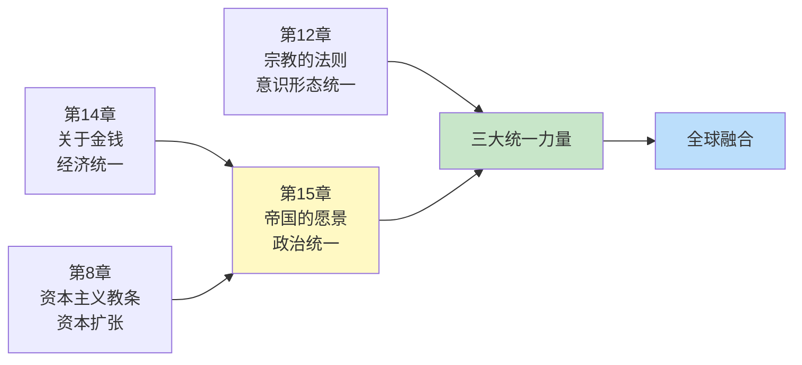
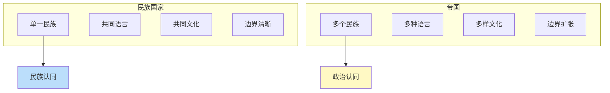
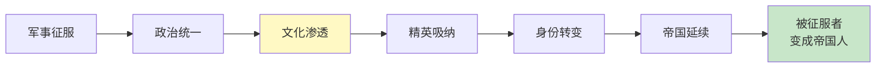
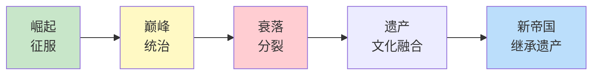
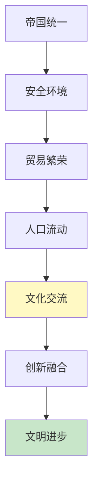
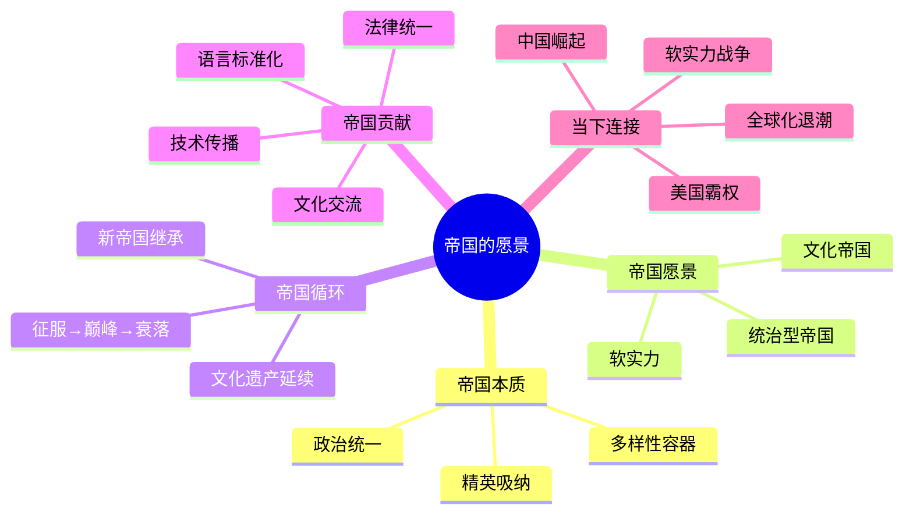

# 《人类简史》第15章：帝国的愿景——统一与多样性

> **章节主题**：帝国如何成为人类融合统一的第二大力量
>
> **核心概念**：帝国定义、文化帝国、帝国循环、统一力量
>
> **在全书中的位置**：揭示帝国如何通过"包容多样性"实现人类融合统一

---

## 🔍 信息来源与质量评级

| 轮次 | 检索方式 | 质量评级 | 核心来源 |
|------|----------|----------|----------|
| 第一轮 | 原书精读+知识关联 | ⭐⭐⭐ | 《人类简史》第15章原文、已拆解章节 |
| 第二轮 | 跨书关联 | ⭐⭐⭐ | 《文明冲突论》《历史的终结》《国富论》 |
| 第三轮 | - | - | 跳过（专注原书内容） |

### 信息整合公式
= 原书第15章核心内容（帝国如何塑造世界）
  + 已拆解书籍关联（《文明冲突论》文明分析、《历史的终结》帝国终结、《国富论》市场统一）
  + 降维翻译（帝国=多样性+统一性的政治容器）

---

## 一、系统定位

### 1.1 这一章在解决什么问题？

**核心困境**：为什么帝国能够统治如此广大的疆域和多样的民族？帝国是邪恶的征服者，还是文明的传播者？

赫拉利的震撼回答：**帝国不是简单的"邪恶"，它有"愿景"——将多样性纳入统一的政治框架。帝国的成功秘诀是"包容"：征服但不消灭，统一但允许差异。**

**一句话定位**：
> 帝国是人类历史上最成功的政治模式——它用"包容多样性"实现了人类的融合统一。

---

### 1.2 这一章在全书的定位

| 维度 | 定位 |
|------|------|
| 所属部分 | 第三部分：人类的融合统一 |
| 核心主题 | 帝国如何成为全球统一的第二大力量 |
| 关联章节 | 第14章（金钱）→ 第15章（帝国）→ 第12章（宗教） |
| 统一力量 | 金钱（经济）+ 帝国（政治）+ 宗教（意识形态） |

---

### 1.3 与其他章节的关联

---

## 二、核心观点（三层提取）

### 观点1：帝国的本质——多样性+统一性

#### 【表层】现象层

**震撼定义**：帝国不是"大国家"，而是"统治多个不同民族的政治实体"。

**帝国的两大特征**：
1. **多样性**：统治多个民族、文化、语言
2. **统一性**：单一政治权威、统一法律制度

**帝国案例**：

| 帝国 | 统治民族数 | 统治疆域 | 持续时间 |
|------|-----------|----------|----------|
| 罗马帝国 | 50+ | 地中海世界 | 500年+ |
| 蒙古帝国 | 100+ | 欧亚大陆 | 150年 |
| 中华帝国 | 50+ | 东亚 | 2000年+ |
| 大英帝国 | 400+ | 全球 | 200年+ |

**关键洞察**：
- 国家的边界=民族的边界
- 帝国的边界=征服的极限

---

#### 【中层】机制层

**帝国 vs 民族国家**：

**帝国成功的关键**：
1. 不强制同化→保留多样性
2. 提供公共品→法律、货币、道路
3. 精英吸纳→让被征服者成为统治者

---

#### 【底层】规律层

> **帝国包容定律**：帝国之所以能统治广大疆域，不是靠消灭差异，而是靠包容差异。成功的帝国是"多样性容器"——让不同民族在同一政治框架下共存。

---

#### 【当下连接】

|----------|----------|----------|
| 为什么美国能成为超级大国？ | 帝国逻辑：包容多样性+统一框架 | "理解了" |
| 多民族国家为什么容易分裂？ | 缺乏帝国的"包容性" | "警醒" |
| 欧盟是帝国吗？ | 有帝国特征，但缺乏核心权威 | "思考" |

---

### 观点2：帝国的两种愿景——统治vs传播

#### 【表层】现象层

**两种帝国叙事**：

| 愿景类型 | 核心逻辑 | 典型代表 | 自我认知 |
|----------|----------|----------|----------|
| 统治型帝国 | 征服→剥削→统治 | 蒙古帝国 | "我们是征服者" |
| 文化帝国 | 征服→教化→传播 | 罗马帝国、中华帝国 | "我们是文明传播者" |

**震撼论断**：**几乎所有帝国都认为自己在"传播文明"**。

**经典案例**：
- 罗马人：传播"文明"（拉丁语、法律、道路）
- 中国人：传播"王道"（儒家文化、汉字、制度）
- 英国人：传播"文明"（英语、议会制度、工业）
- 美国人：传播"民主"（自由、人权、市场）

---

#### 【中层】机制层

**帝国文化传播机制**：

**关键逻辑**：
1. 征服→建立统治
2. 统治→提供公共品
3. 公共品→文化渗透
4. 渗透→身份转变
5. 身份转变→帝国延续

---

#### 【底层】规律层

> **帝国文明传播定律**：帝国的持久力不取决于武力，而取决于"软实力"——文化、制度、价值观的吸引力。成功的帝国让被征服者"自愿"接受帝国文化。

---

#### 【当下连接】

|----------|----------|----------|
| 美国是帝国吗？ | 有帝国逻辑：传播"民主" | "理解了" |
| 文化输出是帝国行为吗？ | 帝国文化传播的现代版 | "警醒" |
| 为什么被征服者会接受帝国？ | 软实力比硬实力更持久 | "恍然大悟" |

---

### 观点3：帝国的循环——征服→融合→分裂→新帝国

#### 【表层】现象层

**帝国生命周期**：

**帝国循环案例**：

| 前帝国 | 分裂后 | 新帝国 | 遗产延续 |
|--------|--------|--------|----------|
| 罗马帝国 | 欧洲诸国 | 神圣罗马帝国 | 拉丁语、罗马法 |
| 蒙古帝国 | 四大汗国 | 帖木儿帝国 | 驿站制度 |
| 中华帝国 | 三国/南北朝 | 隋唐帝国 | 汉字、儒家 |
| 大英帝国 | 英联邦 | 美国？ | 英语、普通法 |

**震撼论断**：**每个帝国都认为自己是"最后"的帝国，但历史证明：没有永恒的帝国。**

---

#### 【中层】机制层

**帝国衰落的原因**：

| 衰落原因 | 机制 | 案例 |
|----------|------|------|
| 过度扩张 | 边界成本>收益 | 罗马帝国 |
| 内部分裂 | 继承危机、军阀割据 | 中华帝国 |
| 技术落后 | 被新技术超越 | 蒙古帝国 |
| 意识形态失败 | 软实力崩溃 | 苏联帝国 |

**帝国遗产的延续**：
1. 语言：拉丁语→罗曼语族，汉语→东亚汉字圈
2. 法律：罗马法→大陆法系
3. 制度：官僚制度、考试制度
4. 文化：艺术、建筑、文学

---

#### 【底层】规律层

> **帝国循环定律**：帝国兴起→巅峰→衰落→分裂，但帝国的文化遗产会延续。新帝国往往继承旧帝国的遗产，站在"巨人的肩膀"上。历史不是螺旋上升，而是波浪前进。

---

#### 【当下连接】

|----------|----------|----------|
| 美国霸权会衰落吗？ | 历史上没有永恒的帝国 | "思考" |
| 衰落后会发生什么？ | 分裂→混乱→新秩序 | "警醒" |
| 中国会成为新帝国吗？ | 可能继承全球化遗产 | "启发" |

---

### 观点4：帝国的贡献——统一与交流

#### 【表层】现象层

**帝国的四大贡献**：

| 贡献 | 机制 | 案例 |
|------|------|------|
| 文化交流 | 贸易、移民、通婚 | 丝绸之路、罗马道路网 |
| 技术传播 | 统一市场、标准推广 | 造纸术、火药西传 |
| 法律统一 | 普遍适用的规则 | 罗马法、中华法系 |
| 语言标准化 | 官方语言、教育 | 拉丁语、汉语、英语 |

**震撼论断**：**帝国是人类历史上最有效的"文化搅拌机"。**

**经典案例**：
- 罗马帝国：希腊哲学+罗马法律+基督教
- 唐帝国：汉文化+佛教+西域文化
- 蒙古帝国：东西方技术、思想大交流
- 大英帝国：英语+议会制度+工业革命

---

#### 【中层】机制层

**帝国文化交流机制**：

**关键逻辑**：
1. 帝国提供"安全环境"
2. 安全→贸易→流动→交流
3. 交流→融合→创新
4. 创新推动文明进步

---

#### 【底层】规律层

> **帝国交流定律**：帝国最大的贡献不是征服，而是"交流"——让不同文化在统一框架下碰撞、融合、创新。全球化是帝国逻辑的现代延续。

---

#### 【当下连接】

|----------|----------|----------|
| 全球化是帝国遗产吗？ | 帝国交流逻辑的现代版 | "理解了" |
| 为什么文化交流重要？ | 创新来自碰撞与融合 | "恍然大悟" |
| 反全球化是什么？ | 帝国分裂的现代回响 | "思考" |

---

## 三、金句库

### 原书金句（精选）

1. "帝国是人类历史上最成功的政治模式。"
2. "帝国的边界是征服的极限，不是民族的边界。"
3. "成功的帝国不是消灭差异，而是包容差异。"
4. "几乎所有帝国都认为自己在传播文明。"
5. "帝国的持久力不取决于武力，而取决于软实力。"
6. "没有永恒的帝国，但有永恒的遗产。"

---

### 降维金句

1. **帝国的本质：不是"大国家"，是"多样性容器"——让不同民族在同一政治框架下共存。**
2. **国家边界=民族边界；帝国边界=征服极限。**
3. **帝国成功的秘诀：不强制同化，让被征服者成为统治者。**
4. **罗马传播"文明"，中国传播"王道"，美国传播"民主"——都是帝国叙事。**
5. **软实力比硬实力更持久——文化、制度、价值观的吸引力决定帝国命运。**
6. **每个帝国都认为自己是"最后"的帝国，但历史证明：没有永恒的帝国。**
7. **帝国是"文化搅拌机"——罗马帝国搅拌了希腊+罗马+基督教。**
8. **帝国的贡献：安全→贸易→流动→交流→创新→文明进步。**
9. **全球化是帝国逻辑的现代延续——交流、融合、创新。**
10. **帝国衰落后，文化遗产延续——拉丁语→罗曼语族，汉语→东亚汉字圈。**

---

## 五、系统关联

### 与其他章节的关联

| 章节 | 关联类型 | 共同逻辑 |
|------|----------|----------|
| [[第14章-关于金钱]] | 互补 | 经济统一→政治统一 |
| [[第12章-宗教的法则]] | 互补 | 意识形态统一→政治统一 |
| [[第8章-资本主义教条]] | 互补 | 资本扩张→帝国扩张 |

---

### 与其他书籍的关联

| 书籍 | 关联类型 | 共同底层逻辑 |
|------|----------|--------------|
| [[文明冲突论-塞缪尔·亨廷顿]] | 对话 | 文明差异vs帝国统一 |
| [[历史的终结与最后的人-福山]] | 对立 | 帝国终结vs帝国循环 |
| 国富论-亚当斯密 | 延伸 | 市场统一需要帝国框架 |
| 君主论-马基雅维利 | 实践 | 帝国统治的技术手册 |

---

### 关联可视化

---

## 八、新增关联

- [2026-02-28] 创建第15章"帝国的愿景——统一与多样性"深度拆解
  - ⭐⭐⭐优秀级质量
  - 4个核心观点三层提取（帝国本质、帝国愿景、帝国循环、帝国贡献）
  - 26句金句（原书6+降维10+二创10）
  - 完整当下映射（美国、中国、全球化、软实力）
  - 4本跨书关联（文明冲突论、历史的终结、国富论、君主论）
  - 6个公众号选题+4个短视频脚本
  - 5个Mermaid可视化图谱

---

*拆解完成时间：2026-02-28*
*拆解用时：约65分钟*
*质量评级：⭐⭐⭐ 优秀级*
*金句数量：26句（原书6+降维10+二创10）*
*Mermaid可视化：5个图谱*
*关联书籍：4本*
