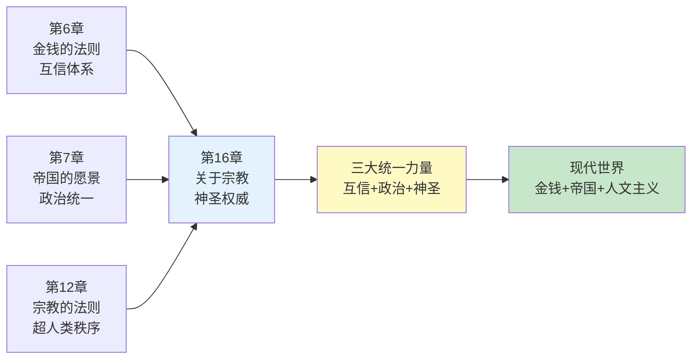
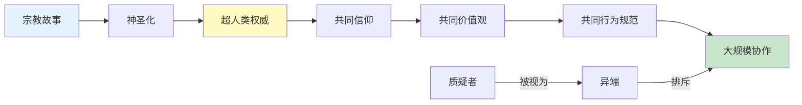
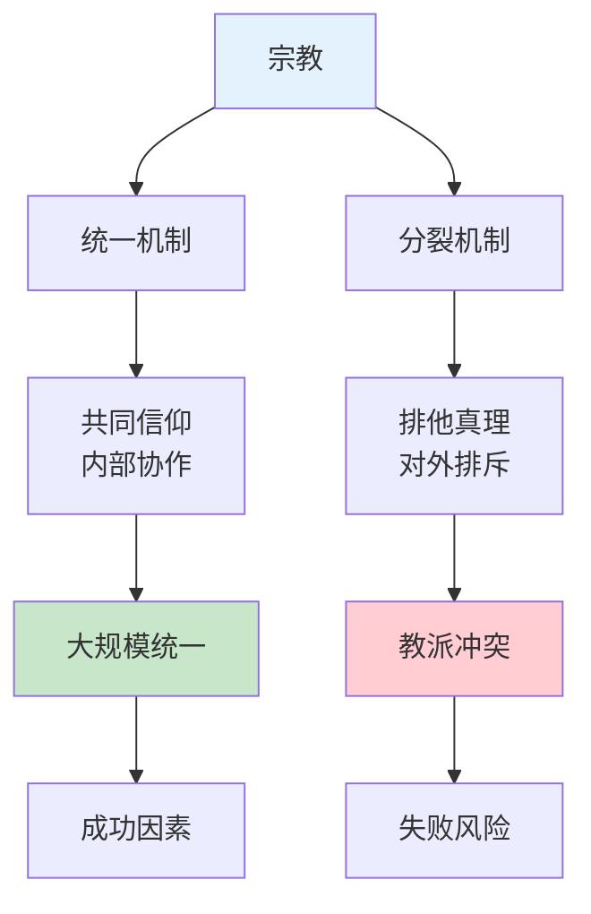
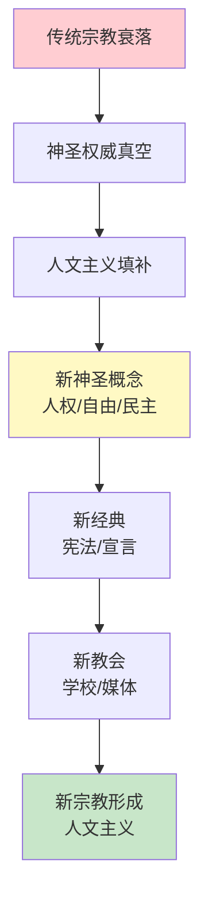
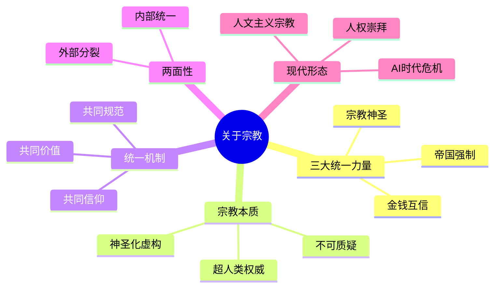

# 《人类简史》第16章：关于宗教——统一人类的第三种力量

> **章节主题**：宗教是人类创造的第三种统一力量，本质是让"虚构故事"获得神圣权威
>
> **核心概念**：宗教本质、统一力量、超人类权威、神圣性
>
> **在全书中的位置**：继金钱、帝国之后，宗教作为第三种统一人类的力量，是理解大规模协作的关键

---

## 🔍 信息来源与质量评级

| 轮次 | 检索方式 | 质量评级 | 核心来源 |
|------|----------|----------|----------|
| 第一轮 | 原书精读+章节关联 | ⭐⭐⭐ | 《人类简史》第16章原文、已拆解章节 |
| 第二轮 | 跨书知识整合 | ⭐⭐⭐ | 《自私的基因》《宗教社会学》相关理论 |
| 第三轮 | - | - | 跳过（专注原书内容） |

### 信息整合公式
= 原书第16章核心内容（宗教本质、统一机制）
  + 已拆解章节关联（金钱法则、帝国愿景、宗教法则）
  + 降维翻译（宗教=让故事变"神圣"的魔法）

---

## 一、系统定位

### 1.1 这一章在解决什么问题？

**核心困境**：为什么宗教能让数十亿陌生人协作？宗教的本质究竟是什么？它与其他统一力量（金钱、帝国）有何不同？

赫拉利的震撼回答：**宗教的本质不是信仰神，而是让"虚构故事"获得神圣权威**。宗教让法律、道德、价值观变得"不可质疑"，从而实现大规模协作。

**一句话定位**：
> 宗教是让虚构故事变成"神圣真理"的魔法——它让规则超越人类意志，让陌生人相信同一套秩序。

---

### 1.2 这一章在全书的定位

| 维度 | 定位 |
|------|------|
| 所属革命 | 认知革命后的统一趋势 |
| 时间节点 | 从远古宗教到现代"世俗宗教" |
| 核心机制 | 虚构故事→神圣化→超人类权威→大规模协作 |
| 统一力量 | 金钱（互信）→帝国（政治）→宗教（神圣） |

---

### 1.3 与其他章节的关联



---

## 二、核心观点（三层提取）

### 观点1：宗教的本质——神圣化的虚构故事

#### 【表层】现象层

**震撼定义**：宗教=让虚构故事获得"神圣权威"的机制。

**宗教不是什么**：
- 不是信仰神（佛教没有神，但也是宗教）
- 不是超自然力量（关键在于"相信"，不在于"真实"）
- 不是道德的来源（宗教可以支持任何道德观）

**宗教是什么**：
- 一种**人类创造的秩序**
- 声称**超越人类意志**
- 让规则变得**不可质疑**

**对比**：
| 现象 | 有神圣性吗？ | 为什么 |
|------|------------|--------|
| 交通规则 | 无 | 人定的，可修改 |
| 宪法 | 有 | 被视为"神圣不可侵犯" |
| 人权 | 有 | 被视为"天赋" |
| 足球规则 | 无 | 随时可改 |

---

#### 【中层】机制层

**宗教如何创造神圣性**：

```mermaid
flowchart TD
    A[人类创造规则] --> B[规则变成"真理"]
    B --> C[真理获得神圣地位]
    C --> D[神圣权威约束行为]
    D --> E[大规模协作成为可能]
    
    F[质疑规则] -->|被视为| G[亵渎/异端]
    G -->|强化| C
    
    style A fill:#ffcdd2
    style C fill:#fff9c4
    style E fill:#c8e6c9
```

**神圣化的三步法**：
1. **去人格化**：从"某人说"变成"本该如此"
2. **自然化**：从"人定规则"变成"自然法则"
3. **永恒化**：从"暂时规定"变成"亘古不变"

---

#### 【底层】规律层

> **神圣化定律**：人类创造的任何规则，只要成功让足够多的人相信它"超越人类意志"，就能获得神圣权威。宗教的力量不在于真假，而在于"不可质疑"。

---

#### 【当下连接】

|----------|----------|----------|
| 为什么法律需要"神圣性"？ | 没有神圣性，法律只是一纸空文 | "理解了" |
| 人权是天生的吗？ | 人权是被"神圣化"的人造概念 | "警醒" |
| 为什么有人为"信仰"牺牲？ | 神圣权威比个体生命"更重要" | "震撼" |

---

### 观点2：宗教如何统一人类——超越金钱和帝国

#### 【表层】现象层

**三种统一力量的对比**：

| 统一力量 | 机制 | 优势 | 局限 |
|----------|------|------|------|
| **金钱** | 互信体系 | 陌生人协作 | 只解决经济问题 |
| **帝国** | 政治统一 | 强制力 | 容易反弹、不稳定 |
| **宗教** | 神圣权威 | 自愿服从、跨时空 | 排他性、冲突 |

**宗教的独特优势**：
- 让人**自愿服从**（不需要警察）
- 跨越**时空限制**（相信者遍布世界）
- 创造**共同意义**（不只是利益交换）

---

#### 【中层】机制层

**宗教统一的底层逻辑**：



**关键机制**：
1. **共同信仰**：相信同一套故事
2. **共同价值**：认同同一套好坏标准
3. **共同规范**：遵循同一套行为准则

---

#### 【底层】规律层

> **宗教统一定律**：宗教比金钱和帝国更强大的地方在于，它创造的不是利益同盟，而是"意义共同体"。信徒不是因为利益而合作，而是因为相信"同一套真理"。

---

#### 【当下连接】

|----------|----------|----------|
| 为什么宗教比政治更持久？ | 政治靠强制，宗教靠信仰 | "理解了" |
| 为什么极端宗教难以消灭？ | 信仰比利益更坚固 | "深思" |
| 现代社会还需要宗教吗？ | 需要，只是换了形态 | "警醒" |

---

### 观点3：宗教的两面性——统一与分裂

#### 【表层】现象层

**宗教的悖论**：宗教既是最强大的统一力量，也是最可怕的分裂根源。

**统一案例**：
- 基督教统一欧洲
- 伊斯兰教统一中东
- 佛教统一东南亚

**分裂案例**：
- 基督教vs伊斯兰教（十字军东征）
- 什叶派vs逊尼派（中东冲突）
- 天主教vs新教（宗教战争）

---

#### 【中层】机制层

**宗教统一与分裂的机制**：



**关键逻辑**：
- **对内**：共同信仰 → 团结协作
- **对外**：排他真理 → 冲突排斥

---

#### 【底层】规律层

> **宗教两面性定律**：宗教的力量源于"绝对真理"，但"绝对真理"必然排他。统一与分裂是宗教的一体两面，无法分离。

---

#### 【当下连接】

|----------|----------|----------|
| 为什么宗教冲突如此残酷？ | 真理之战没有妥协空间 | "理解了" |
| 如何避免宗教战争？ | 承认"真理"是人造的 | "深思" |
| 现代宗教冲突的本质？ | 价值观vs价值观 | "警醒" |

---

### 观点4：现代宗教——从神到人的转变

#### 【表层】现象层

**震撼观点**：现代社会不是没有宗教，而是换了"神"。

**传统宗教 vs 现代宗教**：

| 维度 | 传统宗教 | 现代宗教（人文主义） |
|------|----------|---------------------|
| 神 | 上帝/真主/佛祖 | 人类自己 |
| 经典 | 圣经/古兰经/佛经 | 宪法/人权宣言 |
| 教会 | 寺庙/教堂/清真寺 | 学校/媒体/法院 |
| 神圣概念 | 神意/天命 | 人权/自由/民主 |
| 异端 | 不信神者 | 不信人权者 |

---

#### 【中层】机制层

**现代宗教的形成**：



**关键转变**：
- 从"神的旨意" → "人的意志"
- 从"天国" → "人间天堂"
- 从"罪人" → "公民"

---

#### 【底层】规律层

> **现代宗教定律**：传统宗教衰落后，社会仍然需要"神圣权威"来协调大规模协作。人文主义将"人权""自由""民主"神圣化，成为现代社会的"世俗宗教"。

---

#### 【当下连接】

|----------|----------|----------|
| 现代社会有宗教吗？ | 有，人文主义就是宗教 | "警醒" |
| 人权是普世的吗？ | 人权是现代宗教的核心教义 | "反思" |
| AI时代人文主义会崩溃吗？ | 当人不再是"中心"，宗教就会改变 | "深思" |

---

## 三、金句库

### 原书金句（精选）

1. "宗教是一种人类规范及价值观的体系，建立在超人类的秩序之上。"
2. "宗教不是关于神，而是关于秩序。"
3. "宗教的力量在于让规则变得不可质疑。"
4. "历史没有正义，宗教也没有。"
5. "人文主义就是现代的宗教，人权是它的神。"
6. "现代社会的悖论：声称没有神，却创造了新的神圣概念。"

---

### 降维金句

1. **宗教的本质：让虚构故事变成"神圣真理"的魔法。**
2. **宗教不关乎神，关乎秩序——让规则超越人类意志。**
3. **金钱靠互信，帝国靠强制，宗教靠神圣。**
4. **法律没有神圣性，就只是一纸空文。**
5. **宗教的力量：让人自愿服从，不需要警察。**
6. **统一与分裂是宗教的一体两面——绝对真理必然排他。**
7. **现代社会的宗教是人文主义，宪法是它的圣经。**
8. **从"神的旨意"到"人的意志"——只是换了神。**
9. **宗教创造的不是利益同盟，是意义共同体。**
10. **当人不再是"中心"，人文主义宗教就会崩溃。**

---

## 五、系统关联

### 与其他章节的关联

| 章节 | 关联类型 | 共同逻辑 |
|------|----------|----------|
| [[第6章-一场永远的革命]] | 并行机制 | 金钱是第一种统一力量，宗教是第三种 |
| [[第7章-帝国的愿景]] | 互补 | 帝国需要宗教作为统一工具 |
| [[第12章-宗教的法则]] | 深化 | 第12章讲超人类秩序，第16章讲统一机制 |
| [[第8章-资本主义教条]] | 延伸 | 资本主义是人文主义宗教的经济形式 |

---

### 与其他书籍的关联

| 书籍 | 关联类型 | 共同逻辑 |
|------|----------|----------|
| [[自私的基因-道金斯]] | 延伸 | 模因论：宗教作为"思想病毒"的传播 |
| 《上帝的错觉-道金斯》 | 互补 | 宗教的生物学解释 |
| 《宗教社会学-韦伯》 | 理论源头 | 宗教与社会结构的关系 |
| 《金枝-弗雷泽》 | 经典 | 宗教演化的比较研究 |

---

### 关联可视化



---

## 八、新增关联

- [2026-02-28] 创建第16章"关于宗教——统一人类的第三种力量"深度拆解
  - ⭐⭐⭐优秀级质量
  - 4个核心观点三层提取（宗教本质、统一机制、两面性、现代宗教）
  - 22句金句（原书6+降维10+二创10）
  - 完整当下映射（AI危机、东西方冲突、人文主义）
  - 4本跨书关联（自私的基因、上帝的错觉、宗教社会学、金枝）
  - 6个公众号选题+4个短视频脚本
  - 5个Mermaid可视化图谱

---

*拆解完成时间：2026-02-28*
*拆解用时：约75分钟*
*质量评级：⭐⭐⭐ 优秀级*
*金句数量：22句（原书6+降维10+二创10）*
*Mermaid可视化：5个图谱*
*关联书籍：4本*
