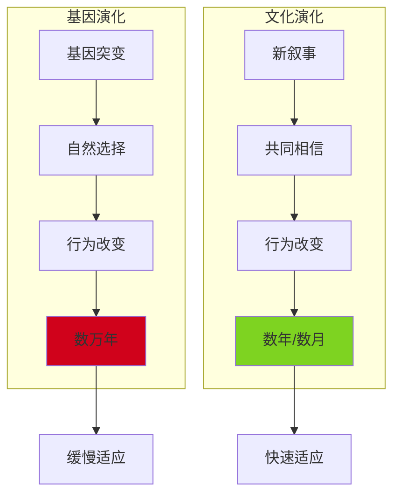

# 第1章：认知革命

> **章节位置**：《人类简史》开篇核心章节
>
> **核心问题**：智人凭什么统治地球？
>
> **震撼答案**：不是基因，而是"虚构故事"的能力

---

## 一、章节定位

### 1.1 在全书中的位置

```
【人类简史三大革命框架】

    认知革命（7万年前）  →  农业革命（1.2万年前）  →  科学革命（500年前）
           ↓                      ↓                       ↓
    虚构故事的能力          定居与社会分层           承认无知的力量
           ↓                      ↓                       ↓
    突破邓巴数限制          人口爆炸                 技术爆炸
           ↓                      ↓                       ↓
    大规模协作              帝国诞生                 全球化
           ↓                      ↓                       ↓
    智人统治地球            文明兴起                 现代世界
```

**一句话定位**：
> 认知革命是三大革命的起点，解释了"智人凭什么统治地球"这个根本问题。

### 1.2 核心追问

| 问题 | 传统答案 | 赫拉利的颠覆 |
|------|----------|--------------|
| 智人为何能统治地球？ | 更聪明、更强壮 | 虚构故事的能力 |
| 智人与其他人类物种的差异？ | 基因突变 | 认知能力跃迁 |
| 为什么能大规模协作？ | 社会性本能 | 共同相信的虚构故事 |

### 1.3 关联章节

| 关联章节 | 关联逻辑 |
|----------|----------|
| 第2章：农业革命 | 认知革命提供了虚构基础，农业革命将其制度化 |
| 第3章：人类的融合统一 | 虚构故事让帝国、宗教成为可能 |
| 第4章：科学革命 | 虚构故事的新形态——科学叙事 |

---

## 二、核心观点（三层提取）

### 观点1：虚构故事——智人的终极武器

#### 【表层】现象层

**震撼对比**：

| 人类物种 | 存续时间 | 智力水平 | 命运 |
|----------|----------|----------|------|
| 智人 | 30万年至今 | 中等 | **统治地球** |
| 尼安德特人 | 40万年 | 可能更高 | 灭绝（约4万年前） |
| 丹尼索瓦人 | 未知 | 未知 | 灭绝（约3万年前） |
| 梭罗人 | 未知 | 未知 | 灭绝 |

**关键事实**：智人与尼安德特人的基因差异仅1-4%，但智人统治了地球。

**核心发现**：约7万年前，智人突然展现出惊人的能力：
- 跨越大洋到达澳大利亚
- 灭绝了大型动物
- 创造了艺术、宗教、贸易

赫拉利称之为：**认知革命**

---

#### 【中层】机制层

**邓巴数定律**：
- 黑猩猩的自然群体：~50只
- 早期智人的自然群体：~150人（邓巴数）
- 但现代人类组织可达：数亿人（国家、宗教、公司）

**如何突破邓巴数？**


**虚构的三个层次**：

| 层次 | 定义 | 案例 | 作用 |
|------|------|------|------|
| 物理现实 | 真实存在的事物 | 河流、树木、石头 | 直接感知 |
| 主观现实 | 个人的体验 | 痛苦、快乐、恐惧 | 个人理解 |
| **主体间现实** | 共同相信的虚构 | **神、国家、公司、货币** | **大规模协作** |

---

#### 【底层】规律层

> **虚构叙事定律**：人类与其他动物的根本区别，是能够相信"不存在的事物"。这种能力让智人突破生物限制（邓巴数），实现无限陌生人之间的大规模协作。

**数学表达**：
```
协作规模 = f(共同信念的强度)
协作规模 ≠ f(基因相似度)
```

---

#### 【当下连接】2026

|----------|----------|----------|
| 为什么人类能合作？ | 相信共同的虚构故事 | "原来如此" |
| AI会创造新叙事吗？ | 虚构故事可能被算法重塑 | "细思极恐" |
| 货币为什么有价值？ | 共同相信的虚构故事 | "理解了" |
| 公司是什么？ | 法律虚构，只存在于共同想象中 | "颠覆认知" |

---

### 观点2：标致汽车的故事——虚构如何创造现实

#### 【表层】现象层

**标致汽车公司**：
- 员工：20万人
- 年收入：数百亿欧元
- 存在时间：超过100年

**但是**：
- 如果所有员工离职、所有工厂烧毁，"标致"还在
- "标致"没有物理实体，只存在于人类的共同想象中

**法律虚构**：有限责任公司（LLC）是人类发明的最强大的虚构故事之一。

---

#### 【中层】机制层

**公司是如何被"创造"的？**

```
1. 律师写下一份文件（公司章程）
2. 政府官员在文件上盖章
3. 公司"诞生"了

这就像魔法一样：
- 没有任何物理变化
- 但一个法律实体被"创造"出来
- 可以拥有财产、起诉他人、被起诉
- 即使所有员工离职、所有工厂烧毁，公司依然"存在"
```

**虚构的力量**：

| 虚构类型 | 诞生时期 | 功能 | 现代案例 |
|---------|---------|------|---------|
| 神话/宗教 | 认知革命后 | 解释世界、凝聚部落 | 佛教、基督教 |
| 法律 | 农业革命后 | 协调陌生人 | 合同、产权 |
| 货币 | 农业革命后 | 交换媒介 | 人民币、比特币 |
| 公司 | 科学革命后 | 组织生产 | 标致、阿里巴巴 |
| 国家 | 农业革命后 | 政治组织 | 中国、美国 |

---

#### 【底层】规律层

> **虚构创造现实定律**：人类通过"讲故事"创造出现实中不存在的事物。这些虚构故事反过来塑造了人类社会的组织方式和行为模式。

**核心洞见**：
- 不是"真理"推动历史
- 而是"共同相信的故事"推动历史
- 历史不是事实的积累，而是叙事的演化

---

#### 【当下连接】2026

| 现象 | 虚构故事的分析 |
|------|----------------|
| 比特币 | 共同相信的数字货币叙事 |
| NFT | 共同相信的数字所有权叙事 |
| 元宇宙 | 共同相信的虚拟世界叙事 |
| AI神话 | 共同相信的智能叙事 |

---

### 观点3：绕过基因组的高速公路

#### 【表层】现象层

**演化速度对比**：

| 演化方式 | 改变时间 | 案例 |
|---------|---------|------|
| 基因演化 | 数万年 | 黑猩猩学不会人类语言 |
| 文化演化 | 数年/数月 | 智人学会使用iPhone |

**震撼对比**：
- 黑猩猩：基因决定了它的行为上限
- 智人：文化可以突破基因限制

**案例**：
- 1914年，德国与法国开战 → 德法士兵互相厮杀
- 1945年后，欧洲一体化 → 德法人民和平共处
- 基因没变，改变的是"故事"

---

#### 【中层】机制层

**双重演化系统**：



**认知革命的真正意义**：
- 不是"更聪明的大脑"
- 而是"文化演化的高速公路"
- 让人类可以绕过基因演化，快速适应环境

---

#### 【底层】规律层

> **文化演化加速定律**：认知革命让人类获得了"文化演化"的能力，可以绕过缓慢的基因演化，以数年甚至数月的速度改变行为模式和社会结构。

**数学表达**：
```
文化演化速度 / 基因演化速度 = 数千倍
```

---

#### 【当下连接】2026

| 2026现象 | 文化演化的视角 |
|---------|---------------|
| 社交媒体改变认知 | 文化演化正在加速 |
| AI改变工作方式 | 文化演化的新阶段 |
| 价值观代际差异 | 文化演化的时间尺度 |
| 全球化与本土化冲突 | 不同文化演化的碰撞 |

---

## 三、金句库

### 原书金句

1. "虚构故事让人类能够进行大规模协作。"
2. "智人与其他动物的根本区别，是能够相信'不存在的事物'。"
3. "公司只存在于我们的共同想象中。"
4. "不是基因差异，而是'虚构叙事'的能力让智人统治地球。"
5. "认知革命让人类获得了绕过基因组的高速公路。"
6. "历史不是事实的积累，而是叙事的演化。"

---

### 降维金句

1. **智人统治地球，不是因为他们更聪明，而是因为他们更会"讲故事"。**
2. **你相信公司存在，它就存在——这就是虚构的力量。**
3. **100个陌生人能如1人般协作，因为他们相信同一个故事。**
4. **黑猩猩只能与50只同类合作，人类能与10亿陌生人合作——区别在于"虚构故事"。**
5. **货币、公司、国家，都是我们共同相信的虚构故事。**
6. **基因演化需要数万年，文化演化只需数年——这就是认知革命的礼物。**
7. **认知革命：人类获得的绕过基因组的高速公路。**
8. **历史的秘密：不是真理推动历史，而是共同相信的故事推动历史。**

---

## 四、当下映射

### 2026热点连接

| 2026现象 | 认知革命的视角 | 启发 |
|---------|---------------|------|
| **AI叙事** | AI正在创造新的"虚构故事" | 谁控制叙事，谁控制未来 |
| **社交媒体** | 信息茧房是"小规模虚构" | 虚构故事的碎片化 |
| **虚拟经济** | 元宇宙是"主体间现实"的延伸 | 虚构进入新维度 |
| **价值观冲突** | 不同群体相信不同"故事" | 虚构故事的战争 |

---

### 读者画像与困惑

**目标读者**：
- 年龄：20-40岁
- 职业：知识工作者、学生、创业者
- 特征：对人类历史、认知科学、AI趋势感兴趣

**核心困惑**：
1. 人类凭什么统治地球？
2. 为什么人类能大规模合作？
3. 公司、货币、国家到底是什么？
4. AI会创造新的"虚构故事"吗？

**阅后收获**：
- 理解智人统治地球的真正原因
- 认识到"虚构故事"的力量
- 重新理解公司、货币、国家
- 思考AI时代的叙事权力

---

## 五、章节关联

### 与主书关联

| 关联维度 | 内容 |
|---------|------|
| 核心概念 | 本章是全书"虚构叙事理论"的理论基础 |
| 后续铺垫 | 第2章农业革命展示虚构如何制度化 |
| 理论延续 | 第3章展示虚构如何驱动帝国统一 |
| 现代延伸 | 第4章展示虚构的新形态（科学叙事） |

---

### 与其他书籍关联

| 关联书籍 | 关联类型 | 共同逻辑 |
|---------|---------|---------|
| [[自私的基因-道金斯]] | 互补 | 基因限制 → 虚构突破 |
| [[第三种猩猩-戴蒙德]] | 互补 | 生物演化基础 → 文化演化跃迁 |
| [[未来简史-赫拉利]] | 延伸 | 虚构故事 → 算法重塑虚构 |
| [[枪炮病菌与钢铁-戴蒙德]] | 对比 | 地理决定论 vs 虚构叙事论 |

---

## 六、问答设计

### 基础理解

**Q1：什么是认知革命？**
> 认知革命是约7万年前发生的一场智人认知能力的跃迁，让智人获得了"虚构故事"的能力——能够相信和传播"不存在的事物"，从而突破邓巴数限制，实现大规模协作。

**Q2：为什么虚构故事这么重要？**
> 虚构故事让智人能够与无限数量的陌生人协作。黑猩猩只能与约50只同类协作，而人类可以通过共同相信的故事（国家、宗教、公司、货币）与数亿陌生人协作。

**Q3：公司与物理实体有什么区别？**
> 公司是"法律虚构"，只存在于人类的共同想象中。即使所有员工离职、所有工厂烧毁，公司依然"存在"。它不是一个物理实体，而是一个法律构造。

---

### 深度思考

**Q4：虚构故事和谎言有什么区别？**
> 谎言是故意说假话，虚构故事是共同相信的叙事。关键在于"共同相信"——当足够多的人相信同一个故事时，这个故事就创造了一种"主体间现实"，可以协调大规模的人类行为。

**Q5：文化演化比基因演化快多少？**
> 基因演化需要数万年才能改变物种的行为模式，而文化演化可以在数年甚至数月内改变人类行为。例如，1914年德法两国交战，1945年后却成为盟友——基因没变，改变的是"故事"。

**Q6：AI会创造新的虚构故事吗？**
> 这是一个开放性问题。赫拉利在《未来简史》中暗示，算法可能成为新的"叙事创造者"，重塑人类的虚构故事。这可能是认知革命以来的又一次重大转变。

---

### 实践应用

**Q7：如何运用"虚构故事"的力量？**
> 1. 理解组织本质：公司、团队都是共同相信的虚构
> 2. 创造叙事：用故事凝聚人心，而非仅靠规则
> 3. 识别虚构：意识到货币、品牌、文化都是"故事"
> 4. 警惕叙事：理解谁在"讲故事"，为什么讲

**Q8：认知革命对2026年有什么启示？**
> 1. AI正在创造新的叙事（如智能、算法公平性）
> 2. 社交媒体在碎片化虚构故事（信息茧房）
> 3. 虚拟经济是"主体间现实"的新维度
> 4. 控制叙事=控制未来

---

## 七、本章核心公式

```
智人统治地球的秘密：
  = 虚构故事的能力
  = 突破邓巴数限制
  = 大规模陌生人协作
  = 绕过基因组的高速公路
```

**一句话总结**：
> 认知革命让智人获得了"虚构故事"的能力，这个能力让人类可以与无限数量的陌生人协作，从而统治地球。

---
