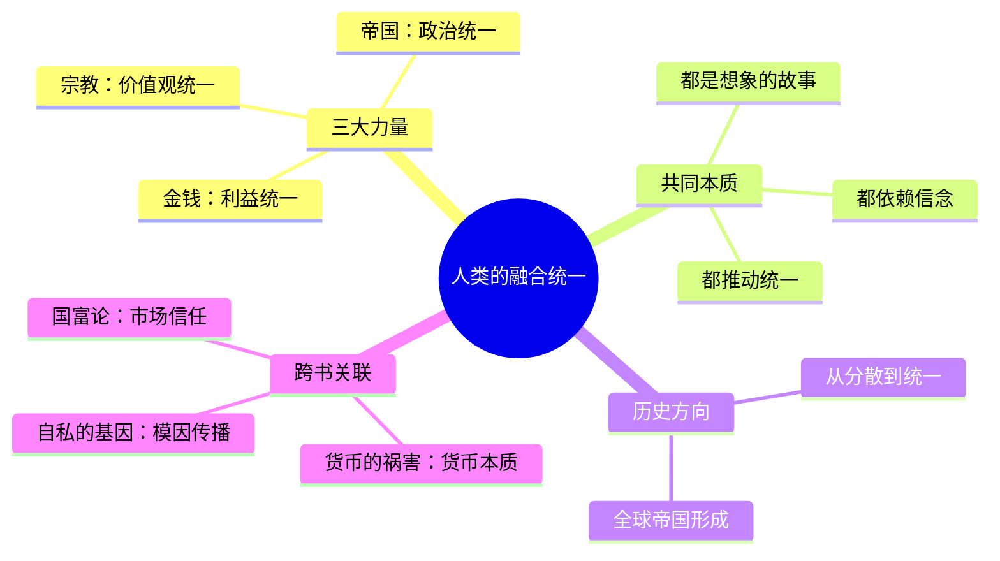

# 第3章 人类的融合统一

## 📍 章节定位

**全书位置**：认知革命后，智人如何通过三大虚拟力量实现全球统一。

**章节序列**：第三部分核心章节，解释"为什么是我们统治地球而非其他物种"。

**一句话定位**：
> 金钱、帝国、宗教，是人类大规模合作的三大虚拟引擎——它们都是"想象的秩序"。

---

## 🎯 核心观点（三层提取）

### 观点1：金钱是唯一普遍的信任系统

| 层次 | 内容 |
|------|------|

**降维翻译**：
- **原文**：金钱是有史以来最普遍、最有效的互信系统
- **降维**：钱是唯一让仇人也能做生意的东西
- **类比**：就像支付宝——你不信任卖家，卖家不信任你，但你们都信任支付宝

---

### 观点2：帝国是人类统一的第一个引擎

| 层次 | 内容 |
|------|------|

**降维翻译**：
- **原文**：帝国是政治统一的力量，它将不同的民族纳入一个政治共同体
- **降维**：帝国就是"你不服我打到你服，服了就是一家人"
- **类比**：就像公司并购——收购你，消化你，最后你就是我的一部分

---

### 观点3：宗教是价值观统一的超级力量

| 层次 | 内容 |
|------|------|

**降维翻译**：
- **原文**：宗教是一种想象的秩序，它将人类的社会规范赋予神圣的地位
- **降维**：宗教就是把"我们这么干"变成"老天爷让咱们这么干"
- **类比**：就像公司文化——不只是规定，而是"我们就是这么做事的"

---

### 观点4：三大力量正在推动全球统一

| 层次 | 内容 |
|------|------|

**降维翻译**：
- **原文**：金钱、帝国、宗教正在将全人类纳入一个单一的全球秩序
- **降维**：人类正在变成一个巨大的"地球国"——同样的钱、同样的法、同样的价值观
- **类比**：就像秦始皇统一六国，只是这次是全地球

---

### 观点5：这些秩序都是"虚构的故事"

| 层次 | 内容 |
|------|------|

**降维翻译**：
- **原文**：这些秩序之所以有效，是因为足够多的人相信它们
- **降维**：只要你信，假的也能变成真的
- **类比**：就像游戏规则——都是人编的，但玩的时候比命还重要

---

## 💬 金句库

### 原书金句
> "金钱是有史以来最普遍、最有效的互信系统。"

> "基督徒和穆斯林可以在宗教上互相仇视，却仍然可以在经济上亲密合作。"

> "帝国是政治统一的力量，它将不同的民族纳入一个政治共同体。"

> "宗教是一种想象的秩序，它将人类的社会规范赋予神圣的地位。"

> "人类历史只有一个方向：从分散走向统一。"

### 降维金句
> "钱是唯一让仇人也能握手的东西。"

> "帝国：打到你服，服了就是一家人。"

> "宗教就是把人定的规矩说成是老天爷定的。"

> "这世界上没什么真假，只有信的人多不多。"

> "人类最厉害的能力：相信不存在的东西。"

## 🔗 当下映射

### 💰 财富应用

| 场景 | 具体行动 | 预期效果 | 风险提示 |
|------|----------|----------|----------|
| 理解货币 | 认识到法币本质是"信任系统"，而非"有价值的东西" | 更理性看待通胀、汇率波动 | 不要过度质疑，信任系统需要参与者相信 |
| 跨境交易 | 利用美元等全球货币的普遍信任进行跨境业务 | 降低交易成本，扩大市场 | 注意汇率风险和政治风险 |
| 投资思考 | 理解"共识价值"（如加密货币、黄金）的底层逻辑 | 更好判断资产价值来源 | 共识可能崩塌，需警惕 |

### 💼 职场应用

| 场景 | 具体行动 | 所需能力 | 适用职级 |
|------|----------|----------|----------|
| 企业文化 | 理解"企业文化"本质是小型"宗教"——统一价值观 | 文化塑造与传播 | 管理层 |
| 跨部门协作 | 用"共同利益"（金钱逻辑）打破部门墙 | 利益设计能力 | 中层以上 |
| 并购整合 | 借鉴"帝国同化"逻辑：征服→融合→统一 | 整合与变革管理 | 高层 |

### 🏠 生活应用

| 场景 | 具体行动 | 可行性 | 见效时间 |
|------|----------|--------|----------|
| 理解社会 | 认识到很多"规则"只是"大家都相信的故事" | 高 | 长期认知改变 |
| 家庭决策 | 用"共同利益"统一家庭成员目标 | 中 | 中期 |
| 国际视野 | 理解全球化是历史大势，非个人意志可逆转 | 高 | 长期 |

### 72小时应用计划
1. **今天**：观察一个你参与的"信任系统"（公司、社群、平台），思考它靠什么维持
2. **明天**：找到一个"敌人也能合作"的场景，用金钱/利益逻辑分析
3. **本周**：用"帝国同化"的视角分析一个你熟悉的并购/整合案例

---

## 🕸️ 章节关联

### 向上：整书关联
- **核心问题**：本章回答"人类如何实现大规模合作"——通过金钱、帝国、宗教三大虚拟力量
- **论证位置**：是"认知革命"的自然延伸，智人用故事创造了秩序

### 横向：章节序列

| 章节编号 | 章节标题 | 关联类型 | 连接描述 |
|----------|----------|----------|----------|
| 第2章 | 认知革命 | 基础 | 第2章讲"故事"的起源，第3章讲"故事"的三种形态 |
| 第4章 | 科学革命 | 对比 | 第4章讲"科学"如何挑战"宗教"的权威 |
| 第20章 | 智人末日 | 延伸 | 三大力量的未来走向 |

### 跨书关联

| 书籍 | 概念 | 关系 | 备注 |
|------|------|------|------|
| [[货币的祸害-弗里德曼]] | 货币本质 | 深化 | 弗里德曼从经济学角度分析货币，赫拉利从人类学角度 |
| [[国富论-亚当·斯密]] | 市场信任 | 互补 | 斯密讲"看不见的手"，赫拉利讲"看不见的信任" |
| [[自私的基因-道金斯]] | 模因（Meme） | 呼应 | 道金斯讲"思想复制"，赫拉利讲"故事传播" |

### 关联可视化

---

## ❓ 问答设计

### Q1: 金钱为什么能跨越宗教和文化的边界？（记忆型）
**认知层次**: 记忆
**难度**: 低
**答案要点**:
- 金钱只需要信任"系统"，不需要信任"人"
- 仇敌可以在宗教上互相憎恨，却在经济上亲密合作
- 金钱是最普遍的信任系统

### Q2: 赫拉利认为帝国的本质是什么？（理解型）
**认知层次**: 理解
**难度**: 中
**答案要点**:
- 帝国是"政治统一"的力量
- 通过"征服+同化"实现统治
- 不是消灭差异，而是把差异纳入更大的秩序
- "你和我们不一样，但你可以变成我们"

### Q3: 宗教如何实现价值观统一？（理解型）
**认知层次**: 理解
**难度**: 中
**答案要点**:
- 宗教将"人类秩序"神圣化
- 让社会规范变成宇宙法则
- 人们遵守不是因为恐惧，而是相信"这是对的"
- 让陌生人愿意为陌生人牺牲

### Q4: 为什么说金钱、帝国、宗教都是"虚构的故事"？（分析型）
**认知层次**: 分析
**难度**: 高
**答案要点**:
- 美元只是一张纸，美国只是一个概念
- 这些秩序有效不是因为真实，而是"足够多人相信"
- 信念创造了现实
- 人类是唯一能相信"不存在的东西"的物种

### Q5: 三大力量如何推动全球统一？（分析型）
**认知层次**: 分析
**难度**: 高
**答案要点**:
- 金钱统一利益——全球贸易网络
- 帝国统一政治——国际法、联合国
- 宗教统一价值观——人权、自由等普世价值
- 三股力量交织，形成"全球帝国"

### Q6: 第3章的观点如何应用到企业文化？（应用型）
**认知层次**: 应用
**难度**: 中
**答案要点**:
- 企业文化本质是小型"宗教"——统一价值观
- 薪酬体系是"金钱"——统一利益
- 组织架构是"帝国"——统一管理
- 三者结合才能实现大规模协作

### Q7: 如何用"帝国同化"的逻辑理解并购？（应用型）
**认知层次**: 应用
**难度**: 高
**答案要点**:
- 征服：收购完成
- 融合：文化碰撞、人员整合
- 统一：形成新的企业文化
- 失败的并购往往在"融合"环节出问题

### Q8: 赫拉利认为人类历史的方向是什么？你同意吗？（综合型）
**认知层次**: 综合
**难度**: 高
**答案要点**:
- 方向：从分散走向统一
- 证据：货币全球化、政治国际化、价值观普世化
- 思考：这是历史规律还是西方中心主义？
- 反例：民族主义复兴、文化冲突加剧
- 综合：大趋势是统一，但过程充满冲突和反复

---
