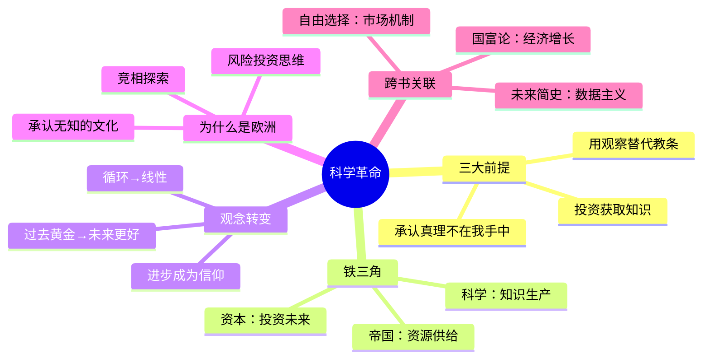

# 第4章 科学革命

## 📍 章节定位

**全书位置**：三大革命的最后一环，解释"为什么是欧洲引领了现代世界"。

**章节序列**：认知革命→农业革命→**科学革命**，人类从"讲故事"到"承认无知"的跃迁。

**一句话定位**：
> 科学革命的秘诀不是"掌握真理"，而是"承认无知"——并愿意用实验去验证。

---

## 🎯 核心观点（三层提取）

### 观点1：科学革命的三大前提

| 层次 | 内容 |
|------|------|

**降维翻译**：
- **原文**：科学首先是要承认自己的无知
- **降维**：聪明人不是"知道得多"，而是"知道自己不知道"
- **类比**：就像面试——说"我不知道但我可以去学"比"胡编乱造"更有价值

---

### 观点2：科学与帝国的联姻

| 层次 | 内容 |
|------|------|

**降维翻译**：
- **原文**：科学与帝国形成相互促进的正向循环
- **降维**：科学家出脑子，帝国出钱，最后一起"发财"
- **类比**：就像现在的"产学研"——企业出钱，大学出技术，最后一起上市

---

### 观点3：科学与资本的结合

| 层次 | 内容 |
|------|------|

**降维翻译**：
- **原文**：科学革命与资本主义相互促进
- **降维**：科学家画饼，资本家买单，最后一起分蛋糕
- **类比**：就像风投和创业公司——一个敢想，一个敢投

---

### 观点4：进步的概念——从循环到线性

| 层次 | 内容 |
|------|------|

**降维翻译**：
- **原文**：现代性相信进步是线性和必然的
- **降维**：古人觉得"一代不如一代"，现代人觉得"明天会更好"
- **类比**：就像房价——你信它会涨，它就真的涨

---

### 观点5：为什么是欧洲？

| 层次 | 内容 |
|------|------|

**降维翻译**：
- **原文**：欧洲的崛起源于承认无知的文化
- **降维**：中国觉得自己啥都懂，欧洲承认自己啥都不懂，结果欧洲赢了
- **类比**：就像考试——说"我不知道"的人会去学习，说"我全懂"的人会挂科

---

### 观点6：科学与宗教的矛盾统一

| 层次 | 内容 |
|------|------|

**降维翻译**：
- **原文**：科学解决事实问题，宗教解决价值问题
- **降维**：科学告诉你"怎么做"，宗教告诉你"该不该做"
- **类比**：就像程序员和产品经理——一个负责"能做"，一个负责"该做"

---

## 💬 金句库

### 原书金句
> "科学首先是要承认自己的无知。"

> "过去500年，人类的力量有了前所未有的惊人成长。"

> "现代科学与先前知识体系的不同，在于承认自己的无知。"

> "帝国与科学之间，形成了一种共生关系。"

> "资本主义的中心原则是：经济增长是可能的。"

### 降维金句
> "聪明人不是知道得多，是知道自己不知道。"

> "科学家出脑子，帝国出钱，最后一起发财。"

> "古人觉得一代不如一代，现代人觉得明天会更好。"

> "承认'我不知道'，比坚信'我全知道'更有可能发现新世界。"

> "科学告诉你怎么做，宗教告诉你该不该做。"

> "中国觉得自己啥都懂，欧洲承认自己啥都不懂——结果欧洲赢了。"

> "不是欧洲人更聪明，是欧洲更会承认无知。"

## 🔗 当下映射

### 💰 财富应用

| 场景 | 具体行动 | 预期效果 | 风险提示 |
|------|----------|----------|----------|
| 投资思维 | 用"承认无知"的态度做投资决策，避免过度自信 | 减少重大决策失误 | 谦逊不等于犹豫不决 |
| 技术投资 | 理解"科学-资本"循环，识别有投资价值的技术方向 | 把握时代红利 | 技术风险+市场风险 |
| 认知升级 | 持续学习，承认"我不知道"，投资自己的知识体系 | 长期复利效应 | 学习方向选择很重要 |

### 💼 职场应用

| 场景 | 具体行动 | 所需能力 | 适用职级 |
|------|----------|----------|----------|
| 技术创新 | 用科学方法验证假设，而非拍脑袋决策 | 实验思维、数据分析 | 中层以上 |
| 战略规划 | 用"承认无知"的态度评估市场，避免战略盲区 | 市场洞察、谦逊心态 | 高层 |
| 团队管理 | 鼓励"承认不知道"的文化，而非装懂文化 | 心理安全感建设 | 管理层 |

### 🏠 生活应用

| 场景 | 具体行动 | 可行性 | 见效时间 |
|------|----------|--------|----------|
| 个人成长 | 承认"我不知道"，主动学习新领域 | 高 | 长期 |
| 人际关系 | 承认错误比固执己见更有力量 | 中 | 中期 |
| 消费决策 | 用科学方法（比较、测试）而非冲动消费 | 高 | 短期 |

### 72小时应用计划
1. **今天**：找出一个你"装懂"的领域，承认"我不知道"，开始学习
2. **明天**：用"假设-验证"的科学方法，做一个小决策
3. **本周**：分析一个"知识-权力-资本"循环的案例（如AI创业）

---

## 🕸️ 章节关联

### 向上：整书关联
- **核心问题**：本章回答"为什么是欧洲引领了现代世界"——承认无知的文化+科学与帝国资本的结合
- **论证位置**：三大革命的最后一环，从"虚构故事"到"承认无知"的跃迁

### 横向：章节序列

| 章节编号 | 章节标题 | 关联类型 | 连接描述 |
|----------|----------|----------|----------|
| 第2章 | 认知革命 | 基础 | 第2章讲"虚构故事"的力量，第4章讲"承认无知"如何改变故事 |
| 第3章 | 人类的融合统一 | 铺垫 | 第3章讲金钱/帝国/宗教统一世界，第4章讲科学如何加速这一进程 |
| 第20章 | 智人末日 | 延伸 | 科学革命的终极后果——智神还是无用阶级？ |

### 跨书关联

| 书籍 | 概念 | 关系 | 备注 |
|------|------|------|------|
| [[自由选择-弗里德曼]] | 市场机制 | 互补 | 弗里德曼讲市场如何协调，赫拉利讲科学如何赋能 |
| [[国富论-亚当·斯密]] | 经济增长 | 延伸 | 斯密讲分工创造财富，赫拉利讲科学-资本如何创造增长 |
| [[未来简史-赫拉利]] | 数据主义 | 延伸 | 科学革命的下一站：算法取代人类决策 |

### 关联可视化

---

## ❓ 问答设计

### Q1: 科学革命的核心前提是什么？（记忆型）
**认知层次**: 记忆
**难度**: 低
**答案要点**:
- 承认真理不在我手中→承认无知
- 用观察和实验替代教条
- 愿意投入资源获取知识

### Q2: 科学与帝国是如何形成共生关系的？（理解型）
**认知层次**: 理解
**难度**: 中
**答案要点**:
- 科学需要资源→帝国提供资源
- 帝国需要技术→科学提供技术
- 形成正向循环：知识→力量→资源→更多知识

### Q3: 为什么赫拉利认为"承认无知"比"掌握真理"更重要？（理解型）
**认知层次**: 理解
**难度**: 中
**答案要点**:
- "掌握真理"的思维导致停滞（经典不可超越）
- "承认无知"的思维驱动探索（真理等待发现）
- 认知谦逊是竞争优势

### Q4: 为什么是欧洲而非中国引领了科学革命？（分析型）
**认知层次**: 分析
**难度**: 高
**答案要点**:
- 中国：天朝上国心态→无所不知→无需探索
- 欧洲：承认无知→竞相探索→发现新世界
- 郑和vs哥伦布：宣示国威vs风险投资

### Q5: 科学与宗教是什么关系？（分析型）
**认知层次**: 分析
**难度**: 高
**答案要点**:
- 科学回答"是什么"（事实判断）
- 宗教回答"应该怎样"（价值判断）
- 二者既冲突又共生：科学需要伦理框架

### Q6: "进步"的概念是如何变化的？（理解型）
**认知层次**: 理解
**难度**: 中
**答案要点**:
- 传统社会：黄金时代在过去→循环史观
- 现代社会：最好的时代在未来→线性史观
- 进步成为信仰，让"投资未来"合理化

### Q7: 如何用"承认无知"的思维改进投资决策？（应用型）
**认知层次**: 应用
**难度**: 高
**答案要点**:
- 避免过度自信，承认"我不知道"
- 用实验思维验证假设
- 分散风险，承认预测的局限

### Q8: 科学革命对AI时代有什么启示？（综合型）
**认知层次**: 综合
**难度**: 高
**答案要点**:
- 承认无知仍是稀缺能力
- 科学方法（假设-验证）比答案更重要
- 事实判断vs价值判断的分野更加重要
- 进步的信念需要新的伦理框架

---
