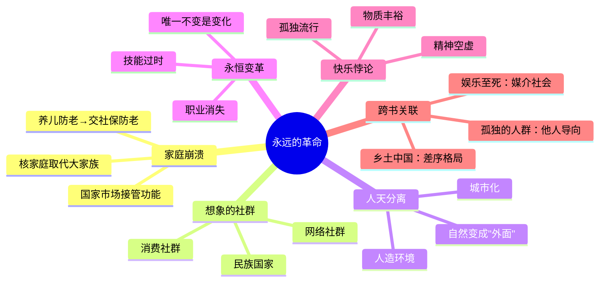

# 第6章 一场永远的革命

## 📍 章节定位

**全书位置**：工业革命之后，社会结构如何被彻底颠覆——家庭崩溃、国家市场崛起、人与自然关系断裂。

**章节序列**：工业的巨轮→**社会革命**，从"能量革命"到"社会重组"的延伸。

**一句话定位**：
> 工业革命不只改变了生产方式，它摧毁了延续数万年的家庭和社群结构，创造了"永远在变"的现代性。

---

## 🎯 核心观点（三层提取）

### 观点1：家庭和社群的崩溃——延续数万年的社会结构被瓦解

| 层次 | 内容 |
|------|------|

**降维翻译**：
- **原文**：工业革命瓦解了传统的家庭和社群结构
- **降维**：以前"养儿防老"，现在"交社保防老"
- **类比**：就像外包——以前家里做饭，现在点外卖，家庭厨房形同虚设

---

### 观点2：国家与市场的崛起——取代家庭的新"父母"

| 层次 | 内容 |
|------|------|

**降维翻译**：
- **原文**：国家和市场接管了传统家庭的功能
- **降维**：国家是你的"老爸"，市场是你的"保姆"，家庭变成了"旅馆"
- **类比**：就像打车——以前靠"亲戚借车"，现在靠"滴滴"，关系没了，但效率高了

---

### 观点3：想象的社群——填补情感真空的替代品

| 层次 | 内容 |
|------|------|

**降维翻译**：
- **原文**：想象的社群填补了传统社群消失后的情感空白
- **降维**：以前是"乡亲"，现在是"网友"——都是"自己人"，但见都没见过
- **类比**：就像粉丝追星——从没见过偶像，但觉得"我们是一伙的"

---

### 观点4：人与自然关系的断裂——从"自然的一部分"到"自然的敌人"

| 层次 | 内容 |
|------|------|

**降维翻译**：
- **原文**：工业革命使人类与自然脱节
- **降维**：以前人住在自然里，现在自然住在人外面
- **类比**：就像笼养的鸡——从没见过草地，但觉得"这样挺安全"

---

### 观点5：永远的革命——现代性的本质是"持续变化"

| 层次 | 内容 |
|------|------|

**降维翻译**：
- **原文**：现代性意味着持续不断的变革
- **降维**：以前"一辈子干一行"，现在"十年换三个职业"
- **类比**：就像软件更新——还没学会旧版本，新版本又来了

---

### 观点6：这个时代更快乐吗？——物质丰裕与精神空虚的悖论

| 层次 | 内容 |
|------|------|

**降维翻译**：
- **原文**：物质进步不一定带来幸福
- **降维**：钱多了，朋友少了；活长了，但不一定更开心
- **类比**：就像刷短视频——停不下来，但刷完觉得空虚

---

## 💬 金句库

### 原书金句
> "工业革命不只是生产的革命，更是社会结构的革命。"

> "国家和市场接管了传统家庭的功能。"

> "现代人失去了家庭和社群，却得到了个人自由。"

> "想象的社群填补了真实社群消失后的空白。"

> "现代性的本质是持续的变化——稳定是例外，变化是常态。"

### 降维金句
> "以前'养儿防老'，现在'交社保防老'。"

> "国家是你的'老爸'，市场是你的'保姆'，家庭变成了'旅馆'。"

> "以前是'乡亲'，现在是'网友'——都是'自己人'，但见都没见过。"

> "以前人住在自然里，现在自然住在人外面。"

> "以前'一辈子干一行'，现在'十年换三个职业'。"

> "钱多了，朋友少了；活长了，但不一定更开心。"

> "刷短视频停不下来，刷完觉得空虚——现代生活的缩影。"

## 🔗 当下映射

### 💰 财富应用

| 场景 | 具体行动 | 预期效果 | 风险提示 |
|------|----------|----------|----------|
| 独居经济 | 理解"家庭瓦解"带来的新消费场景（一人食、宠物经济、孤独经济） | 把握消费趋势 | 不要过度押注单一赛道 |
| 社群创业 | 创建"想象的社群"（粉丝圈、兴趣社区）来商业变现 | 建立用户粘性 | 社群运营成本高 |
| 技能投资 | 接受"永远在变"的现实，持续学习新技能 | 保持竞争力 | 学习方向选择很重要 |

### 💼 职场应用

| 场景 | 具体行动 | 所需能力 | 适用职级 |
|------|----------|----------|----------|
| 团队建设 | 创建"想象的社群"（团队文化）来增强归属感 | 文化建设、情感连接 | 管理层 |
| 职业规划 | 接受"职业会消失"的现实，培养可迁移能力 | 学习能力、适应力 | 全职级 |
| 产品设计 | 理解"孤独经济"，设计满足情感需求的产品 | 用户心理洞察 | 产品经理 |

### 🏠 生活应用

| 场景 | 具体行动 | 可行性 | 见效时间 |
|------|----------|--------|----------|
| 情感管理 | 承认"孤独是常态"，主动建立真实连接而非虚拟社交 | 高 | 中期 |
| 技能迭代 | 每年学习一个新技能，接受"永远在变" | 中 | 长期 |
| 自然连接 | 每周花时间在自然中，对抗"人天分离" | 高 | 短期 |

### 72小时应用计划
1. **今天**：统计你的"真实社交"vs"虚拟社交"时间比例，反思是否过度依赖想象的社群
2. **明天**：联系一个很久没见的家人/朋友，建立真实连接
3. **本周**：花半天时间在自然中（公园、郊外），体验"人天连接"

---

## 🕸️ 章节关联

### 向上：整书关联
- **核心问题**：本章回答"工业革命如何重塑人类社会结构"——家庭崩溃、国家市场崛起、人天分离
- **论证位置**：工业革命的延伸，从"能量革命"到"社会革命"

### 横向：章节序列

| 章节编号 | 章节标题 | 关联类型 | 连接描述 |
|----------|----------|----------|----------|
| 第5章 | 工业的巨轮 | 前提 | 第5章讲能量革命，第6章讲社会革命的后果 |
| 第3章 | 人类的融合统一 | 对比 | 第3章讲金钱/帝国/宗教统一世界，第6章讲这些力量如何瓦解家庭 |
| 第7章 | 智人末日 | 延伸 | 社会革命的终极后果——人类改造自己 |

### 跨书关联

| 书籍 | 概念 | 关系 | 备注 |
|------|------|------|------|
| 乡土中国 | 差序格局 | 对比 | 费孝通讲传统中国的家庭结构，赫拉利讲它如何被瓦解 |
| 孤独的人群-里斯曼 | 他人导向 | 延伸 | 里斯曼讲现代人的性格变化，与赫拉利的社会变革呼应 |
| 娱乐至死-波兹曼 | 媒介社会 | 互补 | 波兹曼讲媒介如何改变人，赫拉利讲技术如何改变社会 |

### 关联可视化

---

## ❓ 问答设计

### Q1: 工业革命如何瓦解了传统家庭结构？（记忆型）
**认知层次**: 记忆
**难度**: 低
**答案要点**:
- 工业化需要流动性劳动力，家庭成为负担
- 国家和市场接管了家庭功能（教育、医疗、养老）
- 核家庭取代大家族，且核家庭也在瓦解

### Q2: 什么是"想象的社群"？它为什么出现？（理解型）
**认知层次**: 理解
**难度**: 中
**答案要点**:
- 真实社群（家庭、宗族、村落）消失后的情感替代品
- 基于想象的共同点，而非真实血缘/地缘
- 例如：民族国家、消费社群、网络社群
- 填补人类对归属感的进化需求

### Q3: 国家和市场是如何取代家庭功能的？（理解型）
**认知层次**: 理解
**难度**: 中
**答案要点**:
- 国家提供公共服务：学校、医院、社保
- 市场提供商品服务：外卖、保洁、育儿
- 个人从"家庭成员"变成"公民/消费者"
- 效率更高，但情感连接更弱

### Q4: 赫拉利为什么说"现代性的本质是持续的变化"？（分析型）
**认知层次**: 分析
**难度**: 高
**答案要点**:
- 现代社会建立在"不断进步"的信念上
- 技术持续进步→职业消失、技能过时
- 稳定是例外，变化是常态
- 没有任何东西能持续一辈子

### Q5: 为什么物质丰裕不等于更幸福？（分析型）
**认知层次**: 分析
**难度**: 高
**答案要点**:
- 物质进步→期望水涨船高→永远不满足
- 社群崩溃→孤独感增加
- 人类的快乐机制不适应"孤独的丰裕"
- 抑郁、焦虑、孤独比例创历史新高

### Q6: "人天分离"是什么意思？有什么后果？（分析型）
**认知层次**: 分析
**难度**: 高
**答案要点**:
- 人类从"自然的一部分"变成"自然的征服者"
- 住在人造环境（城市、空调房）中
- 自然变成"资源库"和"垃圾场"
- 后果：气候变化、生态崩溃、心理异化

### Q7: 如何在"永远的革命"中保持心理健康？（应用型）
**认知层次**: 应用
**难度**: 高
**答案要点**:
- 接受"变化是常态"，培养适应力
- 主动建立真实连接，减少虚拟社交依赖
- 定期接触自然，对抗"人天分离"
- 降低对物质的期望，追求内在满足

### Q8: 第6章对2026年有什么启示？（综合型）
**认知层次**: 综合
**难度**: 高
**答案要点**:
- AI时代会加速"永远在变"——更多职业消失
- "想象的社群"会更流行——虚拟社区、元宇宙
- "人天分离"会加剧——更多人在虚拟世界生活
- 快乐悖论会更尖锐——物质更丰裕，精神更空虚

---
