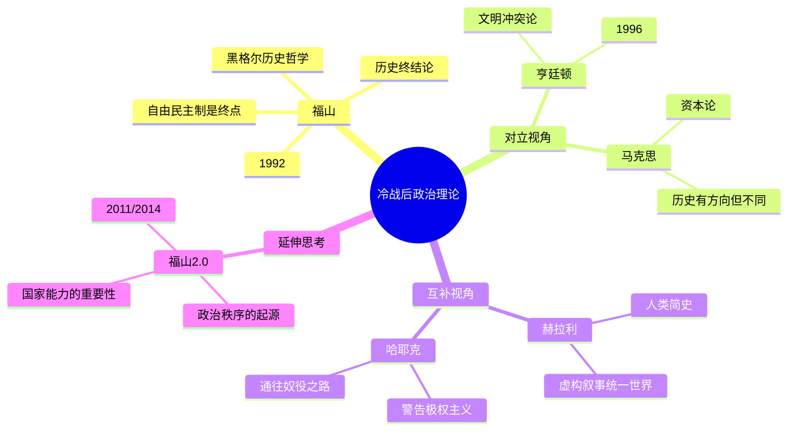

# 《历史的终结与最后的人》读书笔记

## 这本书要解决什么问题？

**核心困境**：冷战结束了，柏林墙倒了，苏联解体了。然后呢？人类社会的方向在哪里？自由民主制是终点站，还是又一个中转站？

福山的回答极具震撼力：**自由民主制可能是人类意识形态演化的终点，但这背后隐藏着"最后的人"的危机——一个物质丰裕但精神空虚的人类群体，可能亲手重新开启历史。**

**一句话定位**：
> 历史的终结不是事件的结束，而是意识形态斗争的终结——但"最后的人"可能比我们想象的更危险。

### 作者站在什么位置说这些话？

| 维度 | 定位 |
|------|------|
| 主领域 | 政治哲学、国际关系理论 |
| 跨界领域 | 历史哲学、政治社会学、冷战研究 |
| 作者背景 | 日裔美籍政治学者，师从亨廷顿，新保守主义代表人物 |
| 理论谱系 | 黑格尔-科耶夫历史哲学的现代诠释者 |
| 历史语境 | 1992年出版，冷战刚结束，苏联刚解体，西方世界沉浸在"胜利"的亢奋中。福山站在这个节点上，提出的不是庆祝，而是一个更深层的问题：如果真的赢了，然后呢？ |

### 和其他书有什么关系？

| 关联书籍 | 关联关系 | 共同底层逻辑 |
|----------|----------|--------------|
| [[历史的教训-杜兰特]] | 互补视角 | 历史有周期（杜兰特）vs 历史有方向（福山） |
| [[人类简史-赫拉利]] | 对立视角 | 虚构叙事驱动统一（赫拉利）vs 自由民主终结历史（福山） |
| [[文明冲突论-塞缪尔·亨廷顿]] | 师生对话 | 历史终结论（福山）vs 文明冲突论（亨廷顿） |
| [[周期]] | 对立视角 | 历史在摆动（马克斯）vs 历史在前进（福山） |
| [[通往奴役之路-哈耶克]] | 互补视角 | 警告计划经济（哈耶克）vs 警告"最后的人"（福山） |

### 知识网络图

---

## 作者的核心论点

### 历史终结论：自由民主制是终点吗？

1989年夏天，福山在《国家利益》杂志上发表了一篇文章，标题带了个问号：《历史的终结？》。三年后，问号去掉了，变成了这本《历史的终结与最后的人》。一个三十多岁的学者，站在冷战结束的历史节点上，提出了一个让整个学术界炸锅的命题：自由民主制可能是人类意识形态发展的终点。

福山的论证不是拍脑袋。他从两条线索同时推进。一条来自黑格尔：人类历史的根本动力是"承认的斗争"（Thymos）——人渴望被他人承认为有尊严的存在。另一条来自现代自然科学：技术进步推动经济发展，经济发展催生中产阶级，中产阶级要求政治参与。两条线索交汇在一个结论上：自由民主制同时满足了人类的物质需求（通过市场经济）和承认需求（通过民主制度），所以意识形态演化到这里，就到头了。

> **历史终点定律**：当一个政治制度同时满足人类的两个基本需求——物质需求（通过市场经济）和承认需求（通过民主制度）时，历史就到达了意识形态演化的终点。

福山特别强调一点：历史终结不等于事件停止。9·11会发生，俄乌冲突会发生，但这些是"事件"，不是"历史"——因为不再有意识形态层面的根本冲突。就像一条河到了大海，水还在流，但方向已经不再改变了。

这个观点打碎了我的一个假设。我一直以为"历史终结"意味着世界和平、万事大吉。但福山说的是：大家不再争论"主义"了，不等于世界就太平了。争论的层次降级了，从"该走什么路"变成了"这条路怎么走"。

但福山真正深刻的地方，不在于他预言了终点，而在于他警告了终点之后的危险。

### "最后的人"：吃饱了撑着的文明危机

翻开尼采的《查拉图斯特拉如是说》，你会看到一段讽刺："看哪，我给你们看最后的人。他们眨着眼说：'我们发明了幸福。'"福山借用了这个概念，提出了一个反直觉的洞见：**即使历史真的终结了，这也不是值得庆祝的事情。**

"最后的人"是什么样子？失去了英雄主义和冒险精神，沉溺于消费主义和舒适生活，没有更高的价值追求，容易被"重新开始历史"的诱惑所动摇。用大白话说就是：吃饱了、喝足了、无聊了。

2026年的"最后的人"现象遍地可见。消费主义空虚——购物、刷短视频、打游戏，仍然不快乐。躺平文化——越来越多的年轻人选择躺平，不是因为懒，是因为"奋斗没有意义"。极端主义抬头——部分年轻人加入极端组织，不是因为缺钱，而是因为缺"意义"。

福山的逻辑链条是这样的：自由民主制满足了基本需求 → 人类失去追求伟大事业的动机 → 沉溺于舒适 → 内心空虚 → 开始渴望"重新开始历史" → 通过战争、暴力或其他极端形式寻求承认。

> **最后的人定律**：当人类满足了所有基本需求后，会陷入意义危机。这种危机可能驱使人类重新开启历史——通过战争、暴力或其他极端形式寻求"承认"。

下次遇到那种"什么都不缺但就是不快乐"的状态，我不会再简单地归结为矫情。这可能就是"最后的人"的困境——物质丰裕和精神空虚，是一枚硬币的两面。

福山的警告引出了一个更深的问题：如果自由民主制确实有缺陷，那缺陷出在哪里？这促使福山自己重新审视了整个理论。

### 福山2.0：从"终点"到"长治久安"

1992年之后，福山没有躺在"历史终结论"上吃老本。他先后出版了《我们的后人类未来》（2002）、《政治秩序的起源》（2011）、《政治秩序与政治衰败》（2014）。核心问题变了：从"历史是否终结"转向"什么制度能长治久安"。

福山2.0的核心框架是"政治三维论"：一个稳定的政治制度必须同时具备国家能力、法治、民主问责三大要素。缺任何一个，都会出问题。弱国家强民主→民粹化、政治衰败；强国家弱法治→极权主义；强民主弱国家→无能政府。

| 维度 | 1.0版（1992） | 2.0版（2011-2014） |
|------|---------------|-------------------|
| 核心命题 | 自由民主制是历史终点 | 什么制度能长治久安 |
| 关键要素 | 自由 + 民主 | 国家 + 法治 + 民主问责 |
| 问题意识 | 历史是否终结？ | 政治为什么会衰败？ |
| 中国观察 | 中国将走向民主化 | 中国是唯一可能替代西方的模式 |

> **政治三维平衡定律**：一个稳定的政治制度必须同时具备国家能力、法治和民主问责三大要素。缺少任何一个，都会导致政治衰败。

我以前一直觉得民主就是万能药，现在意识到这完全错了。有了民主没有国家能力，结果就是民粹化；有了国家能力没有法治，结果就是极权。政治制度就像三脚凳，国家、法治、民主，缺一不可。

不过，福山2.0也带来了一个尴尬的问题：如果终点还不够好，那批评者说的"历史没有终结"是不是更有道理？

### 批评与回应：福山错了吗？

2001年9月11日，两架飞机撞向世贸中心。批评者欢呼："历史终结论终结了！"2022年，俄乌冲突爆发，西方自由民主制暴露出"丑态百出"。中国崛起，证明了非民主模式也能成功。美国政治极化，民主制度内部危机四伏。

福山怎么回应？他做了一个关键区分："事件"不等于"历史"。9·11、俄乌冲突是事件，但它们没有提出替代自由民主制的意识形态方案。恐怖主义不是一种政治制度，普京也没有提出一种比自由民主更好的治理模式。

| 批评类型 | 批评内容 | 福山回应 |
|----------|----------|----------|
| 事实错误 | 9·11、俄乌冲突证明历史还在继续 | "事件"≠"历史"。历史终结是指意识形态演化的终止 |
| 中国反例 | 中国证明了非民主模式也能成功 | 承认中国是"唯一可能的替代模式"，但质疑其长期可持续性 |
| 西方危机 | 美国政治极化、民粹主义抬头 | 承认"政治衰退"，但仍坚信自由民主制是最好的选择 |
| 西方中心主义 | 用西方标准衡量全世界 | 否认，认为自由民主制"满足全人类的基本需求" |

> **理论修正定律**：一个伟大的理论不因为它被现实挑战而失去价值，而在于它如何回应挑战。福山从"历史终结论"到"政治秩序论"，展示了理论的自我修正能力。

---

## 这本书的局限

> 福山的历史终结论是从冷战结束这个特殊时刻出发的，带着那个时代的乐观滤镜。

| 批评点 | 谁在批评 | 怎么说 | 实际情况 |
|--------|---------|--------|---------|
| 历史没有终结 | 几乎所有人 | 9·11、俄乌、中国崛起都证明历史在继续 | 福山的区分有道理（事件≠历史），但确实显得牵强 |
| 西方中心主义 | 非西方学者 | 用西方标准衡量全世界 | 自由民主制确实有普世吸引力，但路径不一定相同 |
| 忽视文明差异 | 亨廷顿 | 文明之间的冲突不会因为意识形态趋同而消失 | 亨廷顿的预言（9·11）比福山更准确 |
| 忽视技术变量 | 未来学家 | 生物技术和AI可能彻底改变人性 | 福山2002年就意识到了这一点，写了《我们的后人类未来》 |
| 过于乐观 | 左翼学者 | 自由民主制内部问题重重（不平等、民粹） | 福山2.0承认了这一点，补充了"政治衰退"概念 |

**一句话总结局限性**：
> 福山最大的盲点不是预测错了，而是低估了"终点"本身的脆弱性——自由民主制赢了冷战，但可能在和平时期自我瓦解。

---

## 最值得记住的话

**原书说的**：
1. "自由民主制可能是人类意识形态发展的终点和人类最后一种统治形式。"
2. "历史终结后，仍会有事件发生，但不再有意识形态层面的根本冲突。"
3. "'最后的人'失去了英雄主义和冒险精神，沉溺于消费主义和舒适生活。"
4. "生物技术可能改变人性，从而重新开启历史。"
5. "政治制度的稳定性，取决于国家能力、法治和民主问责三大要素的平衡。"
6. "承认的需求是人类政治行为的深层动力。"
7. "历史不是事件的记录，而是意识形态演化的过程。"

**翻译成人话**：
1. 历史终结不是世界和平，而是大家不再争论主义了
2. 最后的人不是幸福的人，而是无聊的人
3. 你以为有民主就够了？还得有强大的国家能力
4. 9·11、俄乌冲突、中国崛起，这些是"事件"，不是"历史"
5. 自由民主制不是完美的，但是没有更好的选择
6. 政治制度就像三脚凳，国家、法治、民主，缺一不可
7. 躺平不是懒，是"最后的人"的空虚感
8. 福山最大的贡献不是预言，而是让我们思考：历史终点之后，人类还剩下什么
9. 当AI能写诗、能绘画、能写代码，"承认的需求"在哪里满足？
10. 历史终结论不是预言书，而是思考工具

---

## 讲给没读过的人听

1989年，一个叫福山的年轻人写了篇文章，说人类历史的意识形态斗争可能要结束了——自由民主制赢了。三年后，他把这篇文章扩写成了一本书。

但你别以为他在庆祝。他其实很担心。他借用尼采的概念，提出了"最后的人"：当所有人都吃饱了、自由了、安全了，人会变得怎样？答案是——无聊、空虚、失去意义感。然后人就会去寻找刺激，甚至愿意通过战争和暴力来重新找到活着的感觉。

后来发生了很多事：9·11、俄乌冲突、中国崛起。大家都说福山错了。但福山说：你们误解了。"历史终结"不是说世界和平了，而是说大家不再争论"该走什么路"了。恐怖主义不是一种新的政治制度，普京也没有提出比自由民主更好的方案。

更有意思的是，福山自己也在进化。他从"历史是否终结"转向了一个更务实的问题：什么制度能长治久安？他的答案是三脚凳——国家能力、法治、民主问责，缺一不可。

---

## 用来检验理解的问题

**基础回忆**：
1. Q: 福山说的"历史终结"是什么意思？
   A: 不是事件停止，而是意识形态演化的终止——不再有关于"该走什么路"的根本性争论。

2. Q: 福山认为推动历史走向终点的两大力量是什么？
   A: 承认的斗争（Thymos，来自黑格尔）和现代自然科学的逻辑（推动经济发展→中产阶级→民主诉求）。

3. Q: "最后的人"是什么意思？
   A: 尼采的概念，指在历史终结后失去英雄主义和冒险精神、沉溺于舒适和消费主义的人类。

**理解验证**：
1. Q: 为什么福山说9·11不是"历史没有终结"的证据？
   A: 因为恐怖主义没有提出替代自由民主制的意识形态方案——它是暴力事件，不是制度竞争。

2. Q: 福山1.0和2.0的核心区别是什么？
   A: 1.0问"历史是否终结"，2.0问"什么制度能长治久安"。2.0补充了国家能力的重要性。

3. Q: 为什么"最后的人"可能比"历史的终结"更危险？
   A: 因为"最后的人"的无聊和空虚可能驱使人类主动重新开启历史——通过战争或极端行为。

**实际应用**：
1. Q: 用政治三维论分析中国和美国各自的短板。
   A: 美国强于法治和民主但国家能力被极化削弱；中国强于国家能力但法治和民主问责不足。

2. Q: 2026年的"躺平"文化和"最后的人"有什么关系？
   A: 躺平可能是"最后的人"症状的一种表现——物质丰裕但精神空虚，失去了更高追求的动力。

**深度分析**：
1. Q: 福山和亨廷顿的师生分歧，谁更接近2026年的现实？
   A: 两者都有部分正确。世界既没有完全趋同（福山），也没有完全分裂（亨廷顿），而是"有限趋同+有界冲突"。

2. Q: AI技术会如何影响"历史终结论"？
   A: 福山2002年就预言生物技术可能重新开启历史。AI可能改变"承认的需求"的满足方式，甚至改变人性本身。

---

## 和其他书的对话

杜兰特和福山在历史观上完全对立。杜兰特说历史像钟摆，自由与集中来回摆动，永不停息。福山说历史有方向，朝向自由民主制，终将到达终点。一个说"历史在循环"，一个说"历史在前进"。2026年的现实？两者都有道理——经济确实在周期中摆动（杜兰特），但民主制度确实在缓慢扩张（福山）。

亨廷顿是福山的老师，但师生在历史走向上完全分歧。福山说世界将趋同，自由民主制是终点；亨廷顿说世界将分裂，文明断层线会成为战线。1990年代福山主导，2001年9·11之后亨廷顿主导。2026年？世界既没有完全趋同，也没有完全分裂。读了福山，你应该去读亨廷顿——因为只有把两种视角放在一起，才能看清全貌。

赫拉利和福山都认为人类在趋同，但驱动力不同。赫拉利说虚构叙事（宗教、国家、金钱）驱动人类统一；福山说承认的需求和物质需求驱动历史进步。赫拉利是从认知心理学切入，福山是从政治哲学切入。一个告诉你人类怎么走到今天，一个告诉你人类可能停在哪里。

哈耶克和福山在不同的时代捍卫同一件事——自由。哈耶克1944年警告计划经济和极权主义的危险，福山1992年警告"最后的人"的空虚。一个告诉你不要走向奴役，一个告诉你即使自由了也别高兴太早。

---

*拆解日期：2026-02-15*
*下次回访：1周后回顾「讲给没读过的人听」和「检验问题」*
