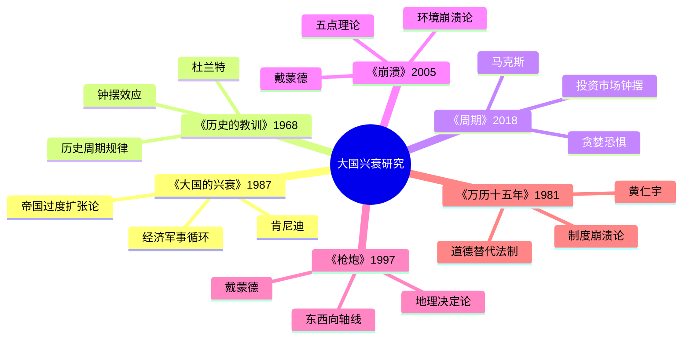

# 《大国的兴衰》拆解记录

## 这本书要解决什么问题？

**核心困境**：为什么有些国家会崛起，有些国家会衰落？西班牙曾经是日不落帝国，现在只是欧洲的普通国家。英国曾经控制全球四分之一土地，现在GDP还不如印度。苏联曾经是超级大国，1991年一夜解体。美国现在是唯一超级大国，但31万亿美元债务让很多人担心——下一个会是谁？

肯尼迪的回答一针见血：**大国的兴衰，本质上是"过度扩张"与"经济基础"的博弈。当军事承诺扩张速度超过经济基础增长速度时，衰落的钟声就已经敲响。**

**一句话定位**：
> 野心比钱包大，早晚要破产——这是500年大国史反复验证的铁律。

### 作者站在什么位置说这些话？

| 维度 | 定位 |
|------|------|
| 主领域 | 大国兴衰理论、国际关系史 |
| 跨界领域 | 经济学、军事学、地缘政治、历史学 |
| 作者背景 | 耶鲁大学历史学教授、国际关系专家、沃尔夫森历史奖得主（1988） |
| 理论贡献 | "帝国过度扩张论"（Imperial Overstretch） |
| 历史语境 | 1987年出版，冷战末期。肯尼迪预测苏联即将衰落，引发巨大争议。1991年苏联解体，预言应验，书成为全球畅销书。但肯尼迪同时警告美国也可能过度扩张——35年后，这个警告正在被验证 |
| 时间范围 | 1500-2000年（500年大国竞争史） |

### 和其他书有什么关系？

| 关联书籍 | 关联关系 | 共同底层逻辑 |
|----------|----------|--------------|
| [[历史的教训-杜兰特-拆解记录]] | 互补 | 杜兰特讲历史周期规律（时间维度），肯尼迪讲经济军事循环（系统维度） |
| [[周期-拆解记录]] | 互补 | 马克斯讲市场钟摆（贪婪恐惧），肯尼迪讲兴衰钟摆（过度扩张） |
| [[崩溃-戴蒙德-拆解记录]] | 互补 | 戴蒙德讲环境崩溃（生态压力），肯尼迪讲战略崩溃（军事压力） |
| [[枪炮病菌与钢铁-戴蒙德-拆解记录]] | 互补 | 戴蒙德讲地理决定成功（起始条件），肯尼迪讲战略决定兴衰（过程选择） |
| [[万历十五年-黄仁宇-拆解记录]] | 互补 | 黄仁宇讲制度崩溃（道德替代法制），肯尼迪讲战略崩溃（过度扩张） |
| [[国富论-亚当·斯密-拆解记录]] | 互补 | 斯密讲市场机制（看不见的手），肯尼迪讲国家机制（看得见的战略） |

### 知识网络图

---

## 作者的核心论点

### 帝国过度扩张：野心比钱包大的致命陷阱

1607年，西班牙帝国——当时世界上最大的帝国——宣布破产。为什么？不是因为敌人太强大，不是因为国王太愚蠢，是因为战线太长了。西班牙同时征服美洲、控制欧洲殖民地、对抗法国、压制新教势力。军事开支超过经济收入，最终崩溃。

肯尼迪发现这不是西班牙独有的问题，而是所有帝国的共同陷阱。

**哈布斯堡帝国（16-17世纪）**：同时对抗法国、奥斯曼帝国、新教势力，战线太长，最终衰落。

**西班牙帝国（16世纪）**：征服美洲、控制欧洲殖民地，军事开支超过经济收入，1607年破产。

**英国帝国（19世纪末-20世纪初）**：控制全球殖民地，海军支出巨大，一战、二战加速衰落。

**苏联（1970-1980年代）**：冷战军备竞赛、入侵阿富汗，军事开支占GDP 15-20%，经济崩溃。

**美国（2001年后）**：反恐战争、全球干预，军费从GDP 3%升至4-5%，债务激增到31万亿美元。

> **肯尼迪定律**：当一个国家的军事承诺扩张速度超过其经济基础增长速度时，衰落的钟声就已经敲响。

过度扩张的恶性循环是这样的：经济增长 → 军事野心膨胀 → 战线扩张 → 军事开支激增 → 经济资源被抽离 → 国内投资减少 → 经济增长放缓 → 军事优势削弱 → 帝国衰落。

| 2026年案例 | 历史隐喻 | 警示 |
|------------|----------|------|
| 美国债务危机（31万亿美元） | 西班牙帝国1607年破产 | 军事开支不可持续 |
| 中国军费增长（年均7%） | 苏联1970年代军备竞赛 | 经济与军事需平衡 |
| 俄罗斯入侵乌克兰 | 苏联入侵阿富汗 | 过度扩张加速崩溃 |

这个观点打碎了我对"强国"的迷信。我一直以为强国可以无限扩张，只要军事够强大就能维持霸权。但肯尼迪让我看到，霸权的根基是经济，不是军事——没有钱，打不了仗。

过度扩张只是肯尼迪理论的第一层。他还要解释：为什么经济基础决定军事能力？

### 经济基础决定军事能力：没有钱打不了仗

肯尼迪做了一个500年的对比研究，发现一个规律：每个时代的霸主，首先是经济最强者，然后才是军事最强者。

| 时代 | 领先国家 | 经济实力 | 军事能力 | 结果 |
|------|----------|----------|----------|------|
| 16世纪 | 哈布斯堡帝国 | 欧洲最强 | 四面出击 | 衰落 |
| 17世纪 | 荷兰 | 贸易强国 | 海军强大 | 短期领先 |
| 18-19世纪 | 英国 | 工业革命 | 全球霸主 | 兴起 |
| 20世纪初 | 英国 | 经济放缓 | 军事吃力 | 一战后衰落 |
| 20世纪中叶 | 美国 | 经济第一 | 军事第一 | 超级大国 |

为什么经济决定军事？因为军事是花钱的。海军需要造船、陆军需要装备、海外部署需要后勤。没钱，一切都是空谈。

更关键的是：军事开支会抽离经济资源。造一艘航母的钱，可以建多少学校、修多少铁路？军事投入过多，民用投入就减少，长期经济增长就放缓。这就是过度扩张的机制。

> **经济-军事定律**：在大国竞争中，经济基础决定军事能力的上限，资源分配决定实现程度。

| 2026年案例 | 历史隐喻 | 警示 |
|------------|----------|------|
| 中国GDP增长（5%） | 19世纪英国工业革命 | 经济是军事基础 |
| 美国军费（8000亿美元） | 20世纪美国超级大国 | 军事需要经济支撑 |
| 俄罗斯经济制裁 | 苏联1980年代经济危机 | 军事不能脱离经济 |

下次看到"军费增长"的新闻，我不会简单地欢呼"国力增强"。肯尼迪让我意识到，军费增长是一把双刃剑——短期增强军事，长期可能削弱经济。

但肯尼迪最深刻的发现，不是经济决定军事，而是兴衰本身就是一个循环。

### 大国的兴衰循环：霸主的宿命

肯尼迪总结出了大国兴衰的"生命周期"：兴起期（经济增长→军事扩张）→ 霸主期（经济第一+军事第一）→ 过度扩张期（军事承诺>经济能力）→ 衰落期（经济放缓+军事吃力）→ 崩溃期（经济崩溃+军事瓦解）。

每个霸主都走同样的路：西班牙、英国、苏联。美国呢？肯尼迪1987年就警告美国可能正在过度扩张。35年后，美国31万亿美元债务、全球干预成本激增——这个警告正在被验证。

| 阶段 | 特征 | 历史案例 |
|------|------|----------|
| 兴起期 | 经济增长 → 军事扩张 | 哈布斯堡帝国（1519-1555） |
| 霸主期 | 经济第一 + 军事第一 | 英国（1815-1914） |
| 过度扩张期 | 军事承诺 > 经济能力 | 西班牙（1580-1600） |
| 衰落期 | 经济放缓 + 军事吃力 | 英国（1918-1945）、苏联（1970-1991） |
| 崩溃期 | 经济崩溃 + 军事瓦解 | 哈布斯堡帝国（1648）、苏联（1991） |

> **兴衰循环定律**：大国的兴衰不是偶然，而是过度扩张的循环——每个霸主都会走向过度扩张，每个过度扩张都会导致衰落。

我以前一直以为历史是"偶然"的——西班牙衰落是因为运气不好，苏联解体是因为戈尔巴乔夫太软弱。但肯尼迪让我看到，衰落是"必然"的——过度扩张导致资源失衡，失衡导致衰落，这是系统性的规律。

但肯尼迪也发现了一个打破循环的可能性：技术革命。

### 技术革命改变兴衰规则：弯道超车的机会

肯尼迪注意到，每次技术革命都会改变大国兴衰的游戏规则。

| 技术革命 | 时间 | 领先国家 | 兴衰影响 |
|------|------|----------|----------|
| 地理大发现 | 15-16世纪 | 葡萄牙、西班牙 | 海洋霸权兴起 |
| 工业革命 | 18-19世纪 | 英国 | 全球霸主崛起 |
| 第二次工业革命 | 19-20世纪 | 德国、美国 | 新兴大国挑战 |
| 核技术 | 20世纪中 | 美国、苏联 | 冷战两极格局 |
| 信息革命 | 20世纪末 | 美国 | 唯一超级大国 |
| AI革命 | 21世纪 | 美国、中国 | 新兴大国竞争 |

工业革命让英国崛起，核技术让美苏争霸，信息革命让美国独霸。AI革命呢？肯尼迪写书时没有AI，但他的理论告诉我们：AI正在改变大国兴衰的规则——谁掌握AI，谁就可能弯道超车。

> **技术革命定律**：每次技术革命都会改变大国兴衰的游戏规则——新兴大国可以通过技术弯道超车，旧霸主可能因技术落后而衰落。

| 2026年案例 | 历史隐喻 | 警示 |
|------------|----------|------|
| AI技术竞赛（中美） | 工业革命（英美） | 新技术决定新霸主 |
| 量子技术竞争（中美欧） | 核技术（美苏） | 技术革命改变游戏规则 |
| 无人机战争（俄乌） | 航母时代（美vs日） | 新军事技术改变战场 |

---

## 这本书的局限

> 肯尼迪的过度扩张理论解释了500年大国史，但2026年的世界有新变量。

| 批评点 | 谁在批评 | 怎么说 | 实际情况 |
|--------|---------|--------|---------|
| 美国没有衰落 | 美国乐观主义者 | 1987年说美国要衰落，35年后美国还是超级大国 | 美国确实没有崩溃，但31万亿美元债务是过度扩张的症状 |
| 中国反例 | 中国学者 | 中国军费增长、一带一路扩张，但没有衰落 | 中国还在兴起期，尚未进入过度扩张期 |
| 忽视制度因素 | 制度经济学家 | 肯尼迪只讲经济军事，忽视了制度的重要性 | 制度确实是重要因素，但肯尼迪的方法论是从经济军事角度分析 |
| 技术变量缺失 | 未来学家 | 1987年没有预测到AI、互联网的影响 | 肯尼迪确实没有预测AI，但他的框架可以容纳技术革命 |
| 过度悲观 | 批评者 | 说苏联要衰落是对的，但说美国也要衰落可能太悲观 | 35年后美国的债务危机验证了警告 |

**一句话总结局限性**：
> 肯尼迪的过度扩张理论是铁律，但2026年的大国竞争有新变量——AI、网络战、太空竞赛可能改变游戏规则。

---

## 最值得记住的话

**原书说的**：
1. "当军事承诺扩张速度超过经济基础增长速度时，衰落的钟声就已经敲响。"
2. "大国的兴衰，本质上是经济基础与军事承诺的博弈。"
3. "过度扩张是所有帝国的致命陷阱。"
4. "经济基础决定军事能力的上限，资源分配决定实现程度。"
5. "霸主的宿命：扩张 → 过度 → 衰落。"

**翻译成人话**：
1. 野心比钱包大，早晚要破产
2. 没有钱，打不了仗——经济是军队的血液
3. 强国的生命周期：兴起 → 霸主 → 过度扩张 → 衰落 → 崩溃
4. 新科技 = 新赛道——谁掌握了新技术，谁就能弯道超车
5. 历史押韵了500年，从西班牙到苏联，没有例外
6. 别看美国军费全球第一，看它的31万亿美元债务
7. 苏联1991年崩溃，不是因为敌人太强，是因为钱包不够
8. 技术革命改变大国兴衰的游戏规则
9. 经济基础决定军事能力的上限
10. 历史押韵，但不会重复——2026年的兴衰，有新变量

---

## 讲给没读过的人听

1987年，一个叫肯尼迪的历史学家写了一本书，预测苏联即将衰落。四年后的1991年，苏联解体了。书成为全球畅销书。

但肯尼迪更重要的警告，不是关于苏联，而是关于美国。他说：大国的衰落，不是偶然，而是过度扩张的循环。当军事承诺扩张速度超过经济基础增长速度时，衰落的钟声就敲响了。

历史反复验证了这个规律。西班牙1607年破产，不是因为敌人太强，是因为战线太长、开支太大。英国一战后衰落，不是因为德国太强，是因为全球殖民地成本太高。苏联1991年崩溃，不是因为美国太强，是因为军备竞赛抽干了经济。

美国呢？肯尼迪1987年就警告：全球干预、军费激增，可能正在过度扩张。35年后，美国31万亿美元债务——这个警告正在被验证。

肯尼迪不是悲观主义者。他发现了一个打破循环的机会：技术革命。工业革命让英国崛起，信息革命让美国独霸。AI革命呢？谁掌握AI，谁就可能弯道超车。

---

## 用来检验理解的问题

**基础回忆**：
1. Q: 肯尼迪定律是什么？
   A: 当一个国家的军事承诺扩张速度超过其经济基础增长速度时，衰落的钟声就已经敲响。

2. Q: 过度扩张的恶性循环是什么？
   A: 经济增长 → 军事野心膨胀 → 战线扩张 → 军事开支激增 → 经济资源被抽离 → 国内投资减少 → 经济增长放缓 → 军事优势削弱 → 帝国衰落。

3. Q: 大国兴衰的"生命周期"是什么？
   A: 兴起期 → 霸主期 → 过度扩张期 → 衰落期 → 崩溃期。

**理解验证**：
1. Q: 为什么经济基础决定军事能力？
   A: 军事是花钱的。海军需要造船、陆军需要装备、海外部署需要后勤。没钱，一切空谈。更重要的是，军事开支抽离经济资源，长期削弱经济增长。

2. Q: 为什么技术革命能改变兴衰规则？
   A: 新技术=新赛道。新兴大国可以通过技术弯道超车，旧霸主可能因技术落后而衰落。工业革命让英国崛起，信息革命让美国独霸。

3. Q: 苏联1991年崩溃的根本原因是什么？
   A: 不是敌人太强，是过度扩张。冷战军备竞赛、入侵阿富汗，军事开支占GDP 15-20%，抽干了经济。

**实际应用**：
1. Q: 用肯尼迪定律分析美国的现状。
   A: 31万亿美元债务、全球干预成本激增、军费占GDP 4-5%，这些都是过度扩张的症状。但美国还在霸主期，尚未进入衰落期。

2. Q: 中国军费增长7%，是在过度扩张吗？
   A: 中国GDP增长5%，军费增长7%，略高于经济增长但仍在可控范围。中国还在兴起期，尚未进入过度扩张期。

**深度分析**：
1. Q: 肯尼迪1987年预测美国衰落，35年后美国还是超级大国，他错了吗？
   A: 预测的是"趋势"，不是"时间"。美国确实出现了过度扩张的症状（31万亿美元债务），但尚未崩溃。

2. Q: AI革命如何改变大国兴衰规则？
   A: AI是新技术赛道。谁掌握AI，谁可能在军事和经济上弯道超车。这可能是打破兴衰循环的机会，也可能加剧竞争。

---

## 和其他书的对话

杜兰特和肯尼迪都在讲历史规律，但维度不同。杜兰特说历史像钟摆，自由与集中来回摆动。肯尼迪说大国像循环，兴起→霸主→过度扩张→衰落→崩溃。一个是时间维度（周期规律），一个是系统维度（经济军事循环）。读了杜兰特理解历史的节奏，读了肯尼迪理解霸权的代价。

马克斯和肯尼迪都在讲"钟摆"，但对象不同。马克斯讲市场钟摆——贪婪与恐惧来回摆动。肯尼迪讲大国钟摆——扩张与衰落循环摆动。市场钟摆源于人性，大国钟摆源于战略错误。读了马克斯理解投资的节奏，读了肯尼迪理解国家的命运。

戴蒙德和肯尼迪都讲"崩溃"，但原因不同。戴蒙德讲环境崩溃——生态压力+人类选择。肯尼迪讲战略崩溃——军事压力+过度扩张。环境崩溃是生态问题，战略崩溃是军事问题。读了戴蒙德理解环境的代价，读了肯尼迪理解战争的代价。

《枪炮、病菌与钢铁》和《大国的兴衰》形成起跑线vs路径的关系。戴蒙德讲地理决定起跑线——欧亚大陆的优势。肯尼迪讲战略决定路径——过度扩张的陷阱。地理给你机会，怎么跑决定成败。

---

*拆解日期：2026-02-15*
*下次回访：1周后回顾「讲给没读过的人听」和「检验问题」*