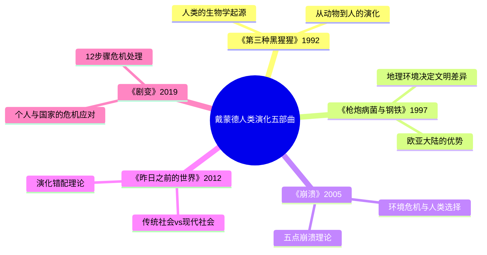

# 《昨日之前的世界》读书笔记

## 这本书要解决什么问题？

**核心困境**：2026年，我们都在问——为什么这么抑郁？为什么这么焦虑？为什么大城市里的人越来越孤独？为什么物质越来越丰富，幸福感却越来越低？

戴蒙德的回答一针见血：**我们的身体和脑子在数百万年的演化中适应了传统社会的生活方式，但我们却在几千年内突然进入了现代社会——这就是演化错配（Evolutionary Mismatch）。**

**一句话定位**：
> 传统社会是人类演化史上最长时间段（99.9%），现代只是极小的一部分（0.1%）——我们的身体和脑子还生活在"昨日之前的世界"。

### 作者站在什么位置说这些话？

| 维度 | 定位 |
|------|------|
| 主领域 | 演化心理学、人类学 |
| 跨界领域 | 社会学、营养学、语言学、儿童发展学 |
| 作者背景 | 加州大学洛杉矶分校地理学教授、演化生物学家、普利策奖得主（《枪炮、病菌与钢铁》） |
| 调查基础 | 在新几内亚部落近50年的田野调查，涵盖39个传统社会案例 |
| 历史语境 | 2012年出版，处于发达国家普遍面临心理健康危机、育儿焦虑、老龄化问题的时代。戴蒙德站在演化心理学视角，提供了一个"向后看"的解决方案 |

### 和其他书有什么关系？

| 关联书籍 | 关联关系 | 共同底层逻辑 |
|----------|----------|--------------|
| [[枪炮病菌与钢铁-戴蒙德]] | 同一作者，互补 | 《枪炮》讲地理决定成功，《昨日》讲传统社会的智慧 |
| [[崩溃-戴蒙德]] | 同一作者，互补 | 《崩溃》讲社会如何选择失败，《昨日》讲传统社会如何生存 |
| [[人类简史-赫拉利]] | 互补 | 赫拉利讲"虚构叙事"驱动文明，戴蒙德讲"演化环境"塑造人类 |
| [[枪炮病菌与钢铁-戴蒙德]] | 同一作者 | 从人类的生物学起源到传统社会的实践智慧 |
| [[枪炮病菌与钢铁-戴蒙德]] | 同一作者 | 《昨日》讲传统社会的智慧，《剧变》讲现代社会的危机应对 |

### 知识网络图

---

## 作者的核心论点

### 演化错配：你的身体还生活在原始社会

先看一组时间数据：传统社会（狩猎采集）占人类历史的99.9%，从600万年前到1.1万年前；农业社会占0.09%，1.1万年前到500年前；现代社会占0.01%，500年前至今。用大白话说就是：人类99.9%的时间都生活在"昨日之前的世界"，现代只是一个极短的实验。

这个比例意味着什么？意味着我们的身体和脑子是在99.9%的时间里演化出来的，只适应了传统社会的环境——小社群、母乳喂养到4岁、自然饮食、密切社交。但我们现在却生活在完全相反的环境中——大都市、6个月断奶、加工食品、社交疏离。

戴蒙德举了一个震撼的例子：昆族（Kung）儿童的生存数据。断奶越晚，存活率越高：3岁断奶90%存活率，2岁断奶70%存活率，1岁断奶50%存活率。母乳是唯一的完美营养来源，母乳中的抗体保护儿童，长期母乳喂养让免疫系统发育完善。现代社会6个月就断奶，然后用配方奶粉和加工食品，结果呢？过敏儿童增多，免疫力下降，消化问题频发。

> **演化错配定律**：人类的身体和脑子适应了数百万年的传统社会环境，却在几千年内突然进入现代社会——这就是现代问题的根源。

| 2026年案例 | 演化错配 | 传统智慧解决方案 |
|------------|----------|----------|
| 抑郁焦虑 | 社交疏离（杜宾150定律被打破） | 建立小社群、线下社交 |
| 肥胖流行 | 高糖高脂渴望（演化适应） | 自然饮食、减少加工食品 |
| 育儿焦虑 | 断奶太早、缺乏社群支持 | 延长母乳喂养、建立育儿社群 |
| 老龄化危机 | 传统智慧传承中断 | 重新认识老年人价值 |

这个观点打碎了我的一个假设。我一直以为现代生活方式是"进步"，是人类摆脱原始状态的胜利。但戴蒙德让我看到，现代生活方式可能是在和演化作对——我们用0.1%的时间违背了99.9%的演化经验。

戴蒙德没有停留在宏观理论。他把演化错配拆解成了具体的领域——育儿、社交、老年、冲突——每个领域都有一部数百万年的"教科书"。

### 育儿智慧：一部10万年的育儿宝典

传统社会怎么育儿？母乳喂养到3-4岁，生育间隔3.5-4年，与父母同睡，全村带娃，儿童早期自主。现代社会怎么育儿？6个月就断奶，生育间隔2-2.5年，独立睡眠，核心家庭独力，过度保护。

| 维度 | 传统社会 | 现代社会 |
|------|----------|----------|
| 母乳喂养 | 3-4岁断奶 | 6个月就断奶 |
| 生育间隔 | 3.5-4年 | 2-2.5年 |
| 睡眠方式 | 与父母同睡 | 独立睡眠 |
| 社群支持 | 全村带娃 | 核心家庭独力 |
| 儿童自主 | 早期自主 | 过度保护 |

戴蒙德的结论很直接：现代育儿是在和演化作对。6个月断奶违背了数百万年的育儿经验。过早添加辅食导致过敏、消化问题。缺乏社群支持导致育儿焦虑、产后抑郁。

> **传统育儿定律**：人类的演化已经优化了数百万年的育儿方式——违背这些方式，就是拿孩子的健康冒险。

下次看到育儿焦虑的文章，我不会再简单地归结为"父母不够专业"。这可能是一个结构性的问题——我们剥离了数百万年演化出来的育儿支持系统（全村带娃），然后让两个成年人独自扛下所有压力。

育儿只是演化错配的一个方面。另一个更隐蔽的错配发生在社交领域——我们的大脑根本没有能力处理现代社会的社交规模。

### 杜宾150定律：大城市孤独的根源

你有没有发现，大城市里的人越来越孤独？朋友圈几百个联系人，但真正能说心里话的可能不超过5个。社交媒体让我们看起来"认识"很多人，但实际上大多数都是陌生人。

这不是你的问题，这是演化错配。人类大脑的社交能力上限是150人——这就是著名的"杜宾150定律"。这个数字来自人类大脑前额叶的容量限制，超过这个数量，我们就无法维持稳定的社交关系。

传统社会的社交网络是什么样的？社群规模小于150人，每个人都认识每个人，社交边界清晰（朋友、敌人、陌生人），社交规则明确（礼仪、禁忌）。现代社会呢？大城市超过1000万人，大部分人都是陌生人，社交边界模糊，社交规则复杂且不断变化。

有趣的是，戴蒙德发现：巴布亚新几内亚人移民到西方后，最满意的一点竟然是"匿名性"——不用总是符合礼仪，不用认识所有人。这说明传统社会的密切社交也有代价：没有隐私，必须时刻遵守规则。

> **杜宾150定律**：人类大脑的社交能力上限是150人——超过这个数量，就是违反演化规律。

| 2026年案例 | 杜宾150定律 | 解决方案 |
|------------|-------------|----------|
| 社交媒体成瘾 | 寻求虚假社交感 | 建立真实的小社群 |
| 城市孤独 | 大城市>1000万人 | 建立线下小社群 |
| 社交焦虑 | 认识的人太多 | 减少社交圈、深交而非广交 |
| 社交疏离 | 缺乏真实连接 | 回归小社群、面对面互动 |

我以前一直觉得"孤独"是个人的性格问题，需要心理治疗或者"变得更外向"。但戴蒙德让我看到，城市孤独是演化错配的必然结果——不是你不够外向，是你的大脑根本处理不了大城市里的社交规模。

但演化错配不止影响年轻人。另一个被忽视的群体——老年人——同样承受着错配的代价。

### 老年人的价值：传统社会的智慧传承者

现代社会怎么对待老人？退休、养老院、独居、边缘化。老人被视为"负担"，需要被照顾，而不是能贡献什么。传统社会呢？尊重、智慧传承者、传授生存技能、调解冲突、维持秩序。

| 维度 | 传统社会 | 现代社会 |
|------|----------|----------|
| 老人地位 | 尊重、智慧传承者 | 边缘化、负担 |
| 老人作用 | 传授生存技能、历史、文化 | 退休、被照顾 |
| 老年方式 | 与家人同住、参与社区 | 养老院、独居 |
| 死亡观念 | 自然过程、庆祝长寿 | 恐惧死亡、医疗过度治疗 |

传统社会中，老年人是"活着的图书馆"。他们掌握着生存技能、历史记忆、文化传承。年轻人依赖他们。现代社会把老年人边缘化，结果是什么？智慧传承中断，社会失去稳定性，青年困惑迷茫。

> **老年人价值定律**：传统社会的老年人是智慧的载体——把他们边缘化，就是让社会失去稳定器。

这个观点打碎了我对"退休"的迷信。我一直以为退休是好事，是辛苦工作一辈子后的回报。但戴蒙德让我看到，"退休"可能是演化错配的表现——老年人应该继续贡献智慧，而不是被"存放"在养老院。

戴蒙德还发现了一个有趣的对比：传统社会的冲突解决机制，可能比现代社会更有效。

### 冲突解决：传统社会的和平智慧

传统社会的战争是什么样的？小规模冲突，几十人vs几十人；明确的边界，谁是朋友、谁是敌人、谁是陌生人；有效的解决机制，赔偿、和解、复仇；长期累积的战争死亡率，平均25%。

现代社会的战争是什么样的？大规模冲突，数千万人vs数千万人；模糊的边界，全球化的"敌人"；缺乏有效的解决机制；一次性世界大战的死亡率，5-8%。

看起来传统社会更危险？25%比5-8%高多了。但戴蒙德指出一个关键区别：传统社会的冲突有边界、有机制、可以解决。现代社会的冲突没有边界、没有机制、可能升级到核战争。

传统社会的冲突解决机制是什么样的？赔偿——用财物补偿受害方；和解——通过仪式恢复关系；复仇——有限度的报复，有明确规则。现代社会呢？国际法庭效率低下，联合国机制瘫痪，核威慑只能防止战争而不能解决冲突。

> **冲突解决定律**：传统社会的冲突解决机制（赔偿、和解、复仇）是演化的智慧——现代社会失去了这些机制，所以更危险。

| 2026年案例 | 冲突机制 | 启示 |
|------------|----------|------|
| 地缘政治冲突 | 缺乏有效解决机制 | 学习传统社会的冲突解决智慧 |
| 社交网络冲突 | 全球化的"敌人" | 建立小社群，减少大规模冲突 |
| 肾病冲突 | 缺乏调解机制 | 建立传统社会的和解机制 |
| 社会分裂 | 模糊的边界 | 明确社群边界，减少冲突 |

---

## 这本书的局限

> 戴蒙德的演化错配理论提供了一个解释现代问题的框架，但这个框架有边界。

| 批评点 | 谁在批评 | 怎么说 | 实际情况 |
|--------|---------|--------|---------|
| 浪漫化传统社会 | 人类学家、原住民权益组织 | 把传统社会描绘得太美好，忽视了其中的暴力、压迫 | 传统社会确实有暴力，但戴蒙德的目的不是浪漫化，而是找可借鉴的智慧 |
| 选择性案例 | 学术批评者 | 只选择支持观点的39个社会，忽视了其他案例 | 田野调查确实有限，但戴蒙德承认了这一点 |
| 过度简化现代问题 | 社会学家 | 把抑郁、焦虑等都归结为演化错配，忽视了社会结构因素 | 演化错配是重要因素，但不是唯一因素 |
| 复古不可能 | 现代主义者 | 我们不可能回到小社群、断奶到4岁 | 戴蒙德说的是"学习智慧"，不是"复古" |
| 忽视个体差异 | 心理学家 | 不是所有人都适应小社群、密切社交 | 巴布亚新几内亚人移民后最满意的是"匿名性"，说明传统社会也有代价 |

**一句话总结局限性**：
> 戴蒙德的解决方案（向传统社会学习）有价值，但不能简单复古——现代社会的"匿名性"和"个人自由"同样是演化的适应。

---

## 最值得记住的话

**原书说的**：
1. "我们的身体和脑子适应了数百万年的传统社会环境，却在几千年内突然进入现代社会——这就是演化错配。"
2. "传统社会是人类演化史上最长时间段（99.9%），现代只是极小的一部分（0.1%。"
3. "母乳喂养到3-4岁不是落后，而是符合演化规律的科学选择。"
4. "人类大脑的社交能力上限是150人——超过这个数量，就是违反演化规律。"
5. "传统社会的老年人是智慧的载体，把他们边缘化，就是让社会失去稳定器。"

**翻译成人话**：
1. 你的身体还生活在原始社会，但你却强迫它适应现代生活
2. 传统社会是人类99.9%的演化史，现代只是0.1%的实验——结果实验出问题了
3. 6个月断奶是在和演化作对——我们违背了数百万年的育儿经验
4. 超过150人的社交圈，你的大脑就处理不了了——这就是城市孤独的根源
5. 传统社会把老人当宝贝，现代社会把老人当累赘——这是又一个演化错配
6. 传统社会的战争是小吵小闹，现代社会的战争是毁灭世界
7. 我们不需要复古，但我们需要理解传统社会的智慧
8. 2026年的抑郁、焦虑、肥胖、社会疏离，都是演化错配的症状
9. 老年人不是累赘，是智慧的载体
10. 不是你不努力，是演化不支持你现在的生活方式

---

## 讲给没读过的人听

2026年，你可能会问：为什么这么抑郁？为什么这么焦虑？为什么大城市里的人越来越孤独？

戴蒙德的答案可能会让你意外：你的身体还生活在原始社会。

看一组数据：人类99.9%的时间都生活在"昨日之前的世界"——小社群、母乳喂养到4岁、自然饮食、密切社交。现代社会只占0.01%的时间。我们的身体和脑子是在99.9%的时间里演化出来的，只适应了传统社会。但我们现在却生活在完全相反的环境中——大城市、6个月断奶、加工食品、社交疏离。这就是演化错配。

演化错配是什么意思？就像你把一只热带植物突然搬到北极，它会死掉。不是因为植物有问题，是因为环境不对。人类没有死掉，但出现了各种问题：抑郁、焦虑、肥胖、孤独。

戴蒙德不是说我们要复古——回到小社群、断奶到4岁、住在部落里。他说的是：理解传统社会的智慧，找到适应演化的现代生活方式。比如，建立小社群、减少加工食品、延长母乳喂养、让老年人继续贡献智慧。

---

## 用来检验理解的问题

**基础回忆**：
1. Q: 演化错配是什么？
   A: 人类的身体和脑子在99.9%的时间里适应了传统社会环境，但我们在0.01%的时间里突然进入了现代社会，导致各种问题。

2. Q: 杜宾150定律是什么？
   A: 人类大脑的社交能力上限是150人，超过这个数量就无法维持稳定的社交关系。

3. Q: 传统社会育儿和现代育儿的核心区别是什么？
   A: 母乳喂养时长（传统3-4年vs现代6个月）、社群支持（全村带娃vs核心家庭独力）。

**理解验证**：
1. Q: 为什么6个月断奶是在"和演化作对"？
   A: 演化优化了数百万年的育儿方式，母乳喂养到3-4岁让免疫系统发育完善，6个月断奶违背了这个规律。

2. Q: 为什么大城市里的人越来越孤独？
   A: 大城市超过1000万人，远超人类大脑的社交能力上限150人，这是演化错配的必然结果。

3. Q: 传统社会的老年人为什么被尊重？
   A: 他们是智慧的载体，传授生存技能、历史记忆、文化传承，年轻人依赖他们。

**实际应用**：
1. Q: 如果你感到城市孤独，根据戴蒙德的理论应该怎么做？
   A: 建立真实的小社群（不超过150人），线下面对面社交，深交而非广交。

2. Q: 如果你有育儿焦虑，戴蒙德会建议什么？
   A: 延长母乳喂养，建立育儿社群支持，减少过度保护让儿童早期自主。

**深度分析**：
1. Q: 戴蒙德说"学习传统社会智慧"而不是"复古"，这个区分为什么重要？
   A: 现代社会的"匿名性"和"个人自由"同样是演化的适应（巴布亚新几内亚人移民后最满意的就是匿名性），不能简单复古。

2. Q: 演化错配理论能解释所有现代问题吗？
   A: 不能。演化错配是重要因素，但社会结构、经济因素、个体差异同样重要。

---

## 和其他书的对话

《枪炮、病菌与钢铁》和《昨日之前的世界》是戴蒙德的两部曲。《枪炮》讲地理环境决定文明差异——为什么西方征服世界；《昨日》讲演化环境塑造人类——为什么现代人有各种问题。地理决定起跑线，演化决定生理和心理基础。读了《枪炮》理解文明的兴衰，读了《昨日》理解个体的困境。

赫拉利和戴蒙德都使用大历史视角，但切入点不同。赫拉利说虚构叙事（宗教、国家、金钱）驱动人类统一，戴蒙德说演化环境塑造人类的生理和心理。赫拉利是从认知心理学切入，戴蒙德是从演化生物学切入。赫拉利告诉你人类怎么走到今天，戴蒙德告诉你人类为什么会感到痛苦。

《崩溃》和《昨日》形成一个问题-解决方案的闭环。《崩溃》讲社会如何选择失败——环境压力+人类错误；《昨日》讲传统社会如何生存——演化适应的智慧。读了《崩溃》理解风险，读了《昨日》找到智慧。

---

*拆解日期：2026-02-15*
*下次回访：1周后回顾「讲给没读过的人听」和「检验问题」*