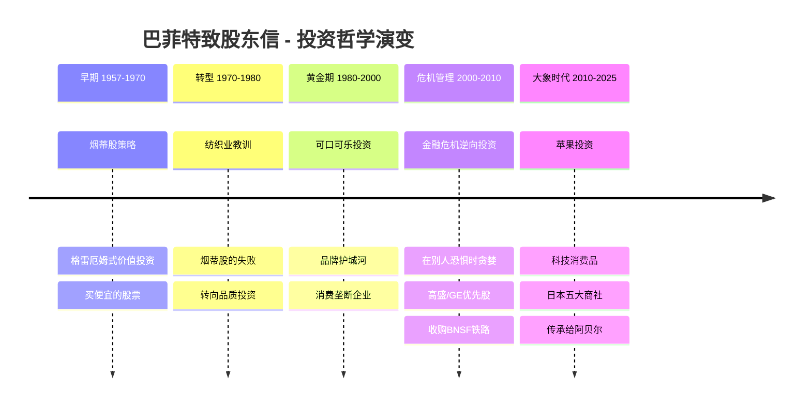
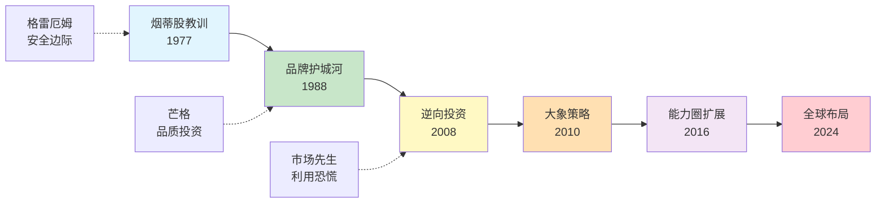

# 巴菲特致股东信知识库

> [!guide] **导读入口**
> **[[深度拆解/巴菲特致股东信-拆解记录|开始阅读 → 巴菲特致股东信完整拆解]]**
> 系统定位、核心框架、投资体系知识网络、全书精华提炼——建议从这里开始。

---

> **作者**: 沃伦·巴菲特（Warren Buffett）
> **时间跨度**: 1956-2025年（69年）
> **收录**: **81** 篇信件 | **35** 个投资概念 | **61** 家公司 | **7** 位关键人物 | **4,194+** 条交叉链接
> **深度拆解**: 6个关键年份 | **英文原文**: 48年完整收录
> **最后更新**: 2026-04-07

---

## 📬 信件总览

### 合伙人信（1956-1969）· 17篇

| 年份 | 标题 | 链接 |
|------|------|------|
| 1956 | 有限合伙协议 | [[信件/合伙人信/1956-有限合伙协议|1956]] |
| 1957 | 巴菲特致合伙人信 | [[信件/合伙人信/1957-巴菲特致合伙人信|1957]] |
| 1958 | 巴菲特致合伙人信 | [[信件/合伙人信/1958-巴菲特致合伙人信|1958]] |
| 1959 | 巴菲特致合伙人信 | [[信件/合伙人信/1959-巴菲特致合伙人信|1959]] |
| 1960 | 巴菲特致合伙人信 | [[信件/合伙人信/1960-巴菲特致合伙人信|1960]] |
| 1961 | 巴菲特致合伙人信 | [[信件/合伙人信/1961-巴菲特致合伙人信|1961]] |
| 1961年中 | 巴菲特致合伙人信 | [[信件/合伙人信/1961年中-巴菲特致合伙人信|1961年中]] |
| 1962 | 巴菲特致合伙人信 | [[信件/合伙人信/1962-巴菲特致合伙人信|1962]] |
| 1962年11月 | 巴菲特致合伙人信 | [[信件/合伙人信/1962年11月-巴菲特致合伙人信|1962.11]] |
| 1962年12月 | 巴菲特致合伙人信 | [[信件/合伙人信/1962年12月-巴菲特致合伙人信|1962.12]] |
| 1962年中 | 巴菲特致合伙人信 | [[信件/合伙人信/1962年中-巴菲特致合伙人信|1962年中]] |
| 1963 | 巴菲特致合伙人信 | [[信件/合伙人信/1963-巴菲特致合伙人信|1963]] |
| 1963年11月 | 巴菲特致合伙人信 | [[信件/合伙人信/1963年11月-巴菲特致合伙人信|1963.11]] |
| 1963年12月 | 巴菲特致合伙人信 | [[信件/合伙人信/1963年12月-巴菲特致合伙人信|1963.12]] |
| 1963年中 | 巴菲特致合伙人信 | [[信件/合伙人信/1963年中-巴菲特致合伙人信|1963年中]] |
| 1964 | 巴菲特致合伙人信 | [[信件/合伙人信/1964-巴菲特致合伙人信|1964]] |
| 1964年中 | 巴菲特致合伙人信 | [[信件/合伙人信/1964年中-巴菲特致合伙人信|1964年中]] |

> 📖 合伙人信时期完整分析：[[合伙人信时期汇总|合伙人信时期汇总]]

### 伯克希尔股东信（1965-2024）· 60篇

| 年份 | 链接 | | 年份 | 链接 | | 年份 | 链接 |
|------|------|-|------|------|-|------|------|
| 1965 | [[信件/伯克希尔信/1965-巴菲特致股东信|1965]] | | 1985 | [[信件/伯克希尔信/1985-巴菲特致股东信|1985]] | | 2005 | [[信件/伯克希尔信/2005-巴菲特致股东信|2005]] |
| 1966 | [[信件/伯克希尔信/1966-巴菲特致股东信|1966]] | | 1986 | [[信件/伯克希尔信/1986-巴菲特致股东信|1986]] | | 2006 | [[信件/伯克希尔信/2006-巴菲特致股东信|2006]] |
| 1967 | [[信件/伯克希尔信/1967-巴菲特致股东信|1967]] | | 1987 | [[信件/伯克希尔信/1987-巴菲特致股东信|1987]] | | 2007 | [[信件/伯克希尔信/2007-巴菲特致股东信|2007]] |
| 1968 | [[信件/伯克希尔信/1968-巴菲特致股东信|1968]] | | 1988 | [[信件/伯克希尔信/1988-巴菲特致股东信|1988]] ⭐ | | 2008 | [[信件/伯克希尔信/2008-巴菲特致股东信|2008]] ⭐ |
| 1969 | [[信件/伯克希尔信/1969-巴菲特致股东信|1969]] | | 1989 | [[信件/伯克希尔信/1989-巴菲特致股东信|1989]] | | 2009 | [[信件/伯克希尔信/2009-巴菲特致股东信|2009]] |
| 1970 | [[信件/伯克希尔信/1970-巴菲特致股东信|1970]] | | 1990 | [[信件/伯克希尔信/1990-巴菲特致股东信|1990]] | | 2010 | [[信件/伯克希尔信/2010-巴菲特致股东信|2010]] ⭐ |
| 1971 | [[信件/伯克希尔信/1971-巴菲特致股东信|1971]] | | 1991 | [[信件/伯克希尔信/1991-巴菲特致股东信|1991]] | | 2011 | [[信件/伯克希尔信/2011-巴菲特致股东信|2011]] |
| 1972 | [[信件/伯克希尔信/1972-巴菲特致股东信|1972]] | | 1992 | [[信件/伯克希尔信/1992-巴菲特致股东信|1992]] | | 2012 | [[信件/伯克希尔信/2012-巴菲特致股东信|2012]] |
| 1973 | [[信件/伯克希尔信/1973-巴菲特致股东信|1973]] | | 1993 | [[信件/伯克希尔信/1993-巴菲特致股东信|1993]] | | 2013 | [[信件/伯克希尔信/2013-巴菲特致股东信|2013]] |
| 1974 | [[信件/伯克希尔信/1974-巴菲特致股东信|1974]] | | 1994 | [[信件/伯克希尔信/1994-巴菲特致股东信|1994]] | | 2014 | [[信件/伯克希尔信/2014-巴菲特致股东信|2014]] |
| 1975 | [[信件/伯克希尔信/1975-巴菲特致股东信|1975]] | | 1995 | [[信件/伯克希尔信/1995-巴菲特致股东信|1995]] | | 2015 | [[信件/伯克希尔信/2015-巴菲特致股东信|2015]] |
| 1976 | [[信件/伯克希尔信/1976-巴菲特致股东信|1976]] | | 1996 | [[信件/伯克希尔信/1996-巴菲特致股东信|1996]] | | 2016 | [[信件/伯克希尔信/2016-巴菲特致股东信|2016]] ⭐ |
| 1977 | [[信件/伯克希尔信/1977-巴菲特致股东信|1977]] ⭐ | | 1997 | [[信件/伯克希尔信/1997-巴菲特致股东信|1997]] | | 2017 | [[信件/伯克希尔信/2017-巴菲特致股东信|2017]] |
| 1978 | [[信件/伯克希尔信/1978-巴菲特致股东信|1978]] | | 1998 | [[信件/伯克希尔信/1998-巴菲特致股东信|1998]] | | 2018 | [[信件/伯克希尔信/2018-巴菲特致股东信|2018]] |
| 1979 | [[信件/伯克希尔信/1979-巴菲特致股东信|1979]] | | 1999 | [[信件/伯克希尔信/1999-巴菲特致股东信|1999]] | | 2019 | [[信件/伯克希尔信/2019-巴菲特致股东信|2019]] |
| 1980 | [[信件/伯克希尔信/1980-巴菲特致股东信|1980]] | | 2000 | [[信件/伯克希尔信/2000-巴菲特致股东信|2000]] | | 2020 | [[信件/伯克希尔信/2020-巴菲特致股东信|2020]] |
| 1981 | [[信件/伯克希尔信/1981-巴菲特致股东信|1981]] | | 2001 | [[信件/伯克希尔信/2001-巴菲特致股东信|2001]] | | 2021 | [[信件/伯克希尔信/2021-巴菲特致股东信|2021]] |
| 1982 | [[信件/伯克希尔信/1982-巴菲特致股东信|1982]] | | 2002 | [[信件/伯克希尔信/2002-巴菲特致股东信|2002]] | | 2022 | [[信件/伯克希尔信/2022-巴菲特致股东信|2022]] |
| 1983 | [[信件/伯克希尔信/1983-巴菲特致股东信|1983]] | | 2003 | [[信件/伯克希尔信/2003-巴菲特致股东信|2003]] | | 2023 | [[信件/伯克希尔信/2023-巴菲特致股东信|2023]] |
| 1984 | [[信件/伯克希尔信/1984-巴菲特致股东信|1984]] | | 2004 | [[信件/伯克希尔信/2004-巴菲特致股东信|2004]] | | 2024 | [[信件/伯克希尔信/2024-巴菲特致股东信|2024]] ⭐ |

> ⭐ 标记为已深度拆解的关键年份

### 特别信件 · 4篇

| 年份 | 标题 | 链接 |
|------|------|------|
| 2014 | 伯克希尔的过去现在与未来 | [[信件/特别信件/2014-伯克希尔的过去现在与未来|查看]] |
| 2014 | 副董事长的思考 | [[信件/特别信件/2014-副董事长的思考|查看]] |
| 2025 | 感恩节致辞 | [[信件/特别信件/2025-感恩节致辞|查看]] |
| 2025 | 感恩节致辞（续） | [[信件/特别信件/2025-感恩节致辞_2|查看]] |

---

## 💡 核心投资概念 · 35个

> 按26封信件中出现频率排序

| 概念 | 提及次数 | | 概念 | 提及次数 | | 概念 | 提及次数 |
|------|----------|-|------|----------|-|------|----------|
| [[概念词条/内在价值|内在价值]] | 76 | | [[概念词条/留存收益|留存收益]] | 43 | | [[概念词条/纺织业务|纺织业务]] | - |
| [[概念词条/管理层|管理层]] | 69 | | [[概念词条/通货膨胀|通货膨胀]] | 41 | | [[概念词条/股东导向|股东导向]] | - |
| [[概念词条/复利|复利]] | 64 | | [[概念词条/买入价格|买入价格]] | - | | [[概念词条/股息|股息]] | 53 |
| [[概念词条/账面价值|账面价值]] | 61 | | [[概念词条/企业文化|企业文化]] | - | | [[概念词条/能力圈|能力圈]] | - |
| [[概念词条/承保纪律|承保纪律]] | 55 | | [[概念词条/低估|低估]] | 51 | | [[概念词条/衍生品|衍生品]] | - |
| [[概念词条/资本配置|资本配置]] | 54 | | [[概念词条/品牌|品牌]] | - | | [[概念词条/透视盈余|透视盈余]] | - |
| [[概念词条/护城河|护城河]] | 53 | | [[概念词条/商业模式|商业模式]] | - | | [[概念词条/集中投资|集中投资]] | 44 |
| [[概念词条/回购|回购]] | 48 | | [[概念词条/商誉|商誉]] | - | | [[概念词条/安全边际|安全边际]] | - |
| [[概念词条/分散投资|分散投资]] | 44 | | [[概念词条/市场预测|市场预测]] | - | | [[概念词条/市场先生|市场先生]] | - |
| [[概念词条/杠杆|杠杆]] | 43 | | [[概念词条/市盈率|市盈率]] | - | | [[概念词条/保险浮存金|保险浮存金]] | 50 |
| [[概念词条/竞争优势|竞争优势]] | - | | [[概念词条/收购|收购]] | - | | [[概念词条/有效市场|有效市场]] | - |
| [[概念词条/特许经营权|特许经营权]] | - | | [[概念词条/长期持有|长期持有]] | - | | | |

> 📖 概念总览：[[核心概念词条|核心概念词条（精选10个）]]

---

## 🏢 公司索引 · 61家

> 按26封信件中出现频率排序（前20）

| 公司 | 提及次数 | | 公司 | 提及次数 | | 公司 | 提及次数 |
|------|----------|-|------|----------|-|------|----------|
| [[公司词条/伯克希尔哈撒韦|伯克希尔哈撒韦]] | 75 | | [[公司词条/富国银行|富国银行]] | 36 | | [[公司词条/通用再保险|通用再保险]] | 27 |
| [[公司词条/盖可保险|盖可保险]] | 75 | | [[公司词条/内布拉斯加家具店|内布拉斯加家具店]] | 45 | | [[公司词条/大都会通信|大都会通信]] | 26 |
| [[公司词条/可口可乐|可口可乐]] | 72 | | [[公司词条/华盛顿邮报|华盛顿邮报]] | 45 | | [[公司词条/BNSF铁路|BNSF铁路]] | 25 |
| [[公司词条/喜诗糖果|喜诗糖果]] | 64 | | [[公司词条/波仙珠宝|波仙珠宝]] | 31 | | [[公司词条/韦斯科|韦斯科]] | 25 |
| [[公司词条/国民保险公司|国民保险公司]] | 51 | | [[公司词条/穆迪|穆迪]] | 29 | | | |
| [[公司词条/美国运通|美国运通]] | 47 | | | | | | |

### 按行业分类

**保险与金融**
[[公司词条/盖可保险|盖可保险]] · [[公司词条/国民保险公司|国民保险]] · [[公司词条/通用再保险|通用再保险]] · [[公司词条/美国运通|美国运通]] · [[公司词条/富国银行|富国银行]] · [[公司词条/美国银行|美国银行]] · [[公司词条/纽约梅隆银行|纽约梅隆]] · [[公司词条/美国合众银行|美国合众]] · [[公司词条/高盛|高盛]] · [[公司词条/穆迪|穆迪]] · [[公司词条/州立农业保险|州立农业]] · [[公司词条/所罗门|所罗门]] · [[公司词条/房地美|房地美]] · [[公司词条/伯克希尔哈撒韦能源|伯克希尔能源]]

**消费与零售**
[[公司词条/可口可乐|可口可乐]] · [[公司词条/苹果|苹果]] · [[公司词条/喜诗糖果|喜诗糖果]] · [[公司词条/冰雪皇后|冰雪皇后]] · [[公司词条/内布拉斯加家具店|内布拉斯加家具店]] · [[公司词条/鲜果布衣|鲜果布衣]] · [[公司词条/波仙珠宝|波仙珠宝]] · [[公司词条/世界图书百科全书|世界图书]] · [[公司词条/吉列|吉列]] · [[公司词条/卡夫亨氏|卡夫亨氏]] · [[公司词条/费希海默制服|费希海默]]

**能源与工业**
[[公司词条/伯克希尔哈撒韦|伯克希尔哈撒韦]] · [[公司词条/BNSF铁路|BNSF铁路]] · [[公司词条/中美能源|中美能源]] · [[公司词条/西方石油|西方石油]] · [[公司词条/雪佛龙|雪佛龙]] · [[公司词条/康菲石油|康菲石油]] · [[公司词条/中国石油|中国石油]] · [[公司词条/精密铸件|精密铸件]] · [[公司词条/路博润|路博润]] · [[公司词条/伊斯卡|伊斯卡]] · [[公司词条/马蒙集团|马蒙集团]] · [[公司词条/约翰斯曼维尔|约翰斯曼维尔]] · [[公司词条/森林河公司|森林河]] · [[公司词条/飞安公司|飞安]] · [[公司词条/麦克莱恩|麦克莱恩]]

**媒体与通信**
[[公司词条/华盛顿邮报|华盛顿邮报]] · [[公司词条/大都会通信|大都会通信]] · [[公司词条/布法罗新闻报|布法罗新闻]] · [[公司词条/特许通讯|特许通讯]] · [[公司词条/威瑞森通讯|威瑞森]]

**日本五大商社**
[[公司词条/伊藤忠商事|伊藤忠]] · [[公司词条/三井物产|三井]] · [[公司词条/三菱商事|三菱]]

**其他/控股**
[[公司词条/克莱顿房屋|克莱顿]] · [[公司词条/威利家居|威利]] · [[公司词条/利捷航空|利捷]] · [[公司词条/蓝筹印花|蓝筹印花]] · [[公司词条/斯科特费泽|斯科特费泽]] · [[公司词条/科比吸尘器|科比]] · [[公司词条/德克斯特鞋业|德克斯特]] · [[公司词条/通用汽车|通用汽车]] · [[公司词条/通用电气|通用电气]] · [[公司词条/IBM|IBM]] · [[公司词条/比亚迪|比亚迪]] · [[公司词条/美国家庭服务|美国家庭]] · [[公司词条/国民保险公司|国民保险]] · [[公司词条/韦斯科|韦斯科]]

> 📖 公司总览：[[重要公司词条|重要公司词条（精选10家）]]

---

## 👤 人物索引 · 7位

| 人物 | 提及次数 | 角色 |
|------|----------|------|
| [[关键人物词条#芒格|芒格]] | 50 | 黄金搭档、副董事长 |
| [[关键人物词条#阿吉特·贾恩|阿吉特·贾恩]] | 40 | 保险帝国掌门人 |
| [[关键人物词条#格雷厄姆|格雷厄姆]] | 32 | 价值投资之父 |
| [[关键人物词条#格雷格·阿贝尔|格雷格·阿贝尔]] | 24 | 继任者 |
| [[关键人物词条#B夫人|B夫人]] | 18 | 内布拉斯加家具店创始人 |
| [[关键人物词条#托德·库姆斯|托德·库姆斯]] | 12 | 投资经理 |
| [[关键人物词条#泰德·韦施勒|泰德·韦施勒]] | 10 | 投资经理 |

> 📖 完整档案：[[关键人物词条|关键人物词条]]

---

## 🔍 关键年份深度拆解 · 6篇

| 年份 | 主题 | 核心收获 |
|------|------|----------|
| [[深度拆解/1977-纺织业转型|1977]] | 纺织业转型 | 烟蒂股教训 · 资本配置 · 保险浮存金 · 能力圈觉醒 |
| [[深度拆解/1988-可口可乐投资|1988]] | 可口可乐投资 | 品牌护城河 · 消费垄断 · 定价权 · 永久持有 |
| [[深度拆解/2008-金融危机|2008]] | 金融危机 | 逆向投资 · 优先股策略 · 现金为王 · 非对称风险 |
| [[深度拆解/2010-收购BNSF|2010]] | 收购BNSF | 大象策略 · 基础设施护城河 · 全押美国 |
| [[深度拆解/2016-苹果投资|2016]] | 苹果投资 | 能力圈扩展 · 生态系统护城河 · 科技消费品 |
| [[深度拆解/2024-最新股东信|2024]] | 最新股东信 | 现金之王 · 日本商社 · 芒格遗产 · 传承永恒 |

---

## 🔤 英文信件原文

> 官方来源：Berkshire Hathaway

| 时期 | 格式 | 年份范围 | 说明 |
|------|------|----------|------|
| HTML | 网页 | 1977-2006 | 30封，已本地保存 |
| PDF | 文档 | 2007-2024 | 18封，链接至官网 |
| 早期 | - | 1965-1976 | 不在官网，中文版见信件目录 |
| 合伙人 | - | 1956-1969 | 不在官网，中文版见信件目录 |

> 📖 英文信件完整索引：[[英文信件原文/索引|英文信件索引]]

---

## 📊 数据分析与可视化

- [[数据分析与图表|数据分析与图表]] - 投资组合、收益对比、概念频率
- [[索引|知识库索引]] - 4,194+交叉链接完整索引

---

## 🗺️ 投资哲学演变时间线

---

## 🔗 核心概念关联图

---

## 📖 关联书籍

- 巴菲特致股东信 - 主拆解笔记
- 《聪明的投资者》 - 理论源头
- 《滚雪球》 - 传记背景
- 《穷查理宝典》 - 黄金搭档

---

## 🌐 外部资源

> **巴菲特知识库**：[[index]]
> **英文原文**：见 英文信件原文/ 目录
