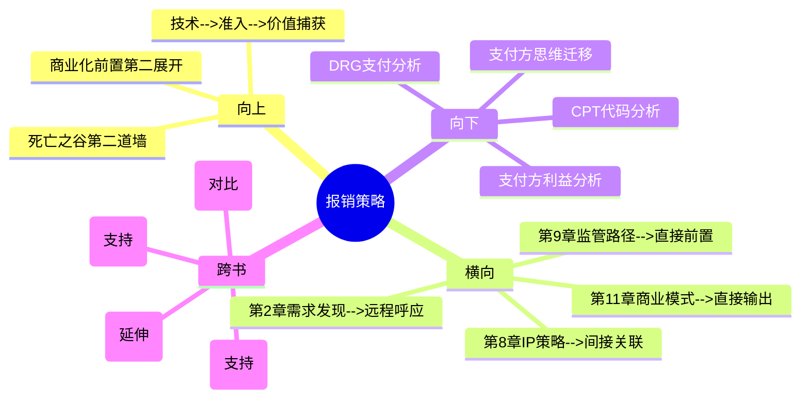

# 第10章 Implement - 报销策略（Reimbursement）

## 章节定位

### 全书位置
> 本章是Implement阶段的第二环，承接第9章监管审批，回答"FDA批了之后，谁来买单"。这是"死亡之谷"的第二道墙——比监管更难跨越的是支付体系。

- **全书核心问题**: 为什么95%的医疗创新想法最终夭折？如何系统性提高落地率？
- **本章回答的问题**: 医疗产品即使获得了FDA批准，怎样才能让医院和患者愿意并且能够购买？谁来为它付钱、付多少钱、通过什么渠道付？
- **角色类型**: 核心概念型
- **论证位置**: 全书三步法第三步（Implement）的第二环——第9章解决"能不能获批"，本章解决"能不能报销"。两者共同构成"死亡之谷"，本章是第二道也是更难跨越的一道

### 章节序列
| 方向 | 章节标题 | 逻辑连接 |
|------|----------|----------|
| 前章 | 第9章 监管路径（Regulatory） | 直接前置：完成监管审批后面临下一道墙——医保报销。两道墙合称"死亡之谷" |
| 后章 | 第11章 商业模式（Business Model） | 直接后续：报销路径确定后，需要设计完整的商业模式来最大化价值捕获 |

### 一句话定位
> 本章是"死亡之谷"第二道墙的深度拆解，确立"医疗产品的商业价值 = 技术价值 × 报销可达性"的核心公式——通过CPT代码、DRG支付、覆盖决策三大支付体系的解析，揭示报销策略必须在发明阶段就纳入产品设计约束。

---

## 核心观点

### 第一层：表层案例

| 案例名称 | 简要描述 | 关键引文 |
|----------|----------|----------|
| FDA批了但卖不动 | 某医疗器械获得FDA批准，但没有合适的CPT代码，医院做手术无法向医保申请费用覆盖，最终产品无人问津 | "即使FDA批了，没有合适的医保报销代码，医院不会买" |
| CPT代码争夺战 | 创新团队花费数年时间、数十万美元申请新的CPT代码，期间产品无法正常收费销售 | CPT代码申请周期可能比FDA审批还长 |
| DRG支付困局 | 某新技术能改善患者预后，但被打包在DRG支付标准内，医院使用该技术的成本高于DRG支付额，因此拒绝采购 | DRG支付模式下，医院的激励是"少花钱"而非"用好技术" |

### 第二层：中层机制

| 机制名称 | 组成要素 | 因果链条 | 证据来源 |
|----------|----------|----------|----------|
| 报销前置机制 | 在发明阶段就问"谁会为它付钱、付多少钱、通过什么渠道付"，而非产品上市后再找支付方 | 报销策略早期确定 → 产品设计和定价据此调整 → 避免获批后因无法报销而无法商业化 | FDA批了但卖不动案例、CPT代码争夺战 |
| 编码-覆盖-支付三阶机制 | CPT代码（做什么项目）→ CMS/N商保覆盖决策（给不给报）→ DRG/按项目付费（付多少钱） | 有代码是前提 → 覆盖决策是关键 → 支付额是最终决定因素 | CPT代码案例、DRG支付困局 |
| 价值-可达性乘法机制 | 医疗产品商业价值 = 技术价值 × 报销可达性 | 技术价值再高，报销可达性为零则商业价值为零 | 全书商业化前置论点 |

### 第三层：底层规律

| 规律陈述 | 抽象层级 | 知识连接 | 适用范围 |
|----------|----------|----------|----------|
| **支付方定律**：在多方参与的医疗体系中，"谁使用"和"谁付钱"通常不是同一个人。产品必须同时满足使用者（医生/医院）的价值诉求和支付方（医保/商保/患者）的价值诉求 | 医疗经济学/博弈论 | 委托代理理论（使用者≠决策者≠支付方）、三赢模型 | 医疗保险、B2B2C模式、政府采购 |
| **编码前置定律**：在编码驱动的支付体系中，编码（CPT/DRG）不是事后的行政手续，而是产品定义的一部分。没有编码的产品在支付体系中"不存在" | 制度经济学/系统设计 | 制度定义现实（Searle的社会实在理论）、标准化理论 | 所有依赖编码/标准分类的行业 |
| **商业价值乘法定律**：在受支付约束的行业，商业价值不是技术价值的线性函数，而是技术价值与可达性的乘积。任一因子为零，结果为零 | 系统论/价值评估 | 乘法约束模型、木桶理论 | 医疗、教育、公益等受第三方支付约束的行业 |

---

## 降维翻译

### 观点1: 支付方定律

#### 原文表达
> "在医疗体系中，使用产品的人（医生）、购买产品的人（医院）、为产品付钱的人（医保/商保/患者）通常不是同一方。产品必须同时满足不同角色的价值诉求。"

#### 认知转变
从"产品好用医生就会买"到"产品必须同时让三方都满意"——医疗产品不是"用户说了算"，是"三方博弈的结果"。

#### 降维翻译（中学生能懂）
在大多数行业，谁用产品谁就决定买不买。但医疗行业完全不是这样。医生决定用什么器械，但医院决定是否采购，医保决定是否报销，患者决定是否配合治疗。这四方的利益经常不一致——医生想要最好的技术，医院想要最便宜的设备，医保想要最少的花费，患者想要最好的效果。如果你的产品只对医生好但对医保来说是额外支出，医保就不会覆盖它，医院就不会买。所以医疗创新团队不能只问"医生喜不喜欢这个产品"，必须同时问"医院觉得划算吗""医保愿意报销吗""患者愿意接受吗"。

#### 日常类比（奶奶能懂）
就像一家请客吃饭。点菜的是客人（医生），但买单的是主人（医保），做饭的是厨师（医院），最后吃的是老人孩子（患者）。如果客人点的菜主人觉得太贵，这道菜就上不了桌。医疗产品就像这道菜，必须让点菜的人和买单的人都满意才行。

#### 检验
- Q: 为什么医疗产品不能只关注"医生喜不喜欢"？
- A: 因为医生用产品但不买单，买单的是医院和医保。如果医保不报销，医院即使想用也用不起。产品必须同时满足使用者和支付方的需求。

### 观点2: 编码前置定律

#### 原文表达
> "CPT代码和DRG分类不是产品上市后的行政手续，而是产品定义的一部分。在支付体系中，没有编码的产品等于不存在。"

#### 认知转变
从"编码是事后的行政手续"到"编码是产品在支付体系中的身份证"——没有编码的产品在支付体系中是隐形人。

#### 降维翻译（中学生能懂）
CPT代码是美国医疗体系中的"服务项目编号"。每个医疗服务和操作都有一个对应的CPT代码，医保根据这个代码决定给多少钱。如果你的创新技术没有对应的CPT代码，医院做了这个手术也没法向医保申请费用——等于医院要自掏腰包。申请新CPT代码通常需要1-2年，比FDA审批还慢。所以Biodesign强调：在发明阶段就要考虑"这个产品有没有对应的CPT代码"。如果没有，要么调整产品设计使其能归入现有编码，要么提前开始申请新编码。编码不是产品做完了去填的表格，而是产品能不能在支付体系中"存在"的前提。

#### 日常类比（奶奶能懂）
就像去超市买东西，每件商品都有条形码。没有条形码的商品，收银台扫不了价，你也没法付钱。CPT代码就是医疗产品在医保系统中的条形码——没有这个码，产品在支付系统中就是隐形的，再好的技术也收不到钱。

#### 检验
- Q: 为什么编码要在发明阶段就考虑？
- A: 因为申请新CPT代码需要1-2年，如果等产品上市了才发现没有合适的编码，产品无法收费销售。编码申请周期甚至比FDA审批还长，必须提前规划。

### 观点3: 商业价值乘法定律

#### 原文表达
> "医疗产品的商业价值 = 技术价值 × 报销可达性。技术价值再高，如果报销路径不通，商业价值为零。"

#### 认知转变
从"技术越好商业价值越高"到"技术价值必须乘以报销可达性才是真实商业价值"——乘法比加法更残酷，一个零因子就让一切归零。

#### 降维翻译（中学生能懂）
大多数人评估一个医疗产品的价值时只看"技术好不好"——能治多少人、效果提升多少、安全性如何。但在医疗行业，这种评估方式是错的。正确的方式是：商业价值 = 技术价值 × 报销可达性。如果技术价值是9分但报销可达性是0分（没有医保覆盖），商业价值 = 9 × 0 = 0。一个技术上90分但完全无法报销的产品，不如一个技术上60分但有完善报销路径的产品。这就是为什么很多"技术上完美"的医疗器械最终失败——不是技术不够好，是报销路径为零。

#### 日常类比（奶奶能懂）
就像一条河上有座很漂亮的桥，但如果河两岸没有路，没人能走到桥上去。桥再漂亮（技术价值高），没有路通到桥上（报销可达性为零），这座桥对谁都没用。商业价值不是桥有多美，而是"桥有多美 × 路有多通"。

#### 检验
- Q: 为什么商业价值是乘法而不是加法？
- A: 因为乘法反映的是"缺一不可"的约束关系——技术价值和报销可达性不是两个独立加分项，而是互相依赖的必要条件。任何一个为零，整个产品就没有商业价值。

---

## 知识锚点

### 原书精华
| 锚点 | 记忆场景 |
|------|----------|
| "即使FDA批了，没有合适的医保报销代码，医院不会买" | 团队以为拿到FDA批准就万事大吉时 |
| "谁会为它付钱、付多少钱、通过什么渠道付" | 讨论产品商业可行性时 |
| "医疗产品的商业价值 = 技术价值 × 报销可达性" | 评估产品商业价值时 |
| "编码驱动的支付体系中，没有编码的产品等于不存在" | 产品设计不考虑编码问题时 |

### 降维锚点
| 锚点 | 来源观点 | 记忆场景 |
|------|----------|----------|
| "请客点菜和买单的不是同一个人——菜再好主人不买单也上不了桌" | 支付方定律 | 解释为什么产品不能只满足医生需求时 |
| "没有条形码的商品，收银台扫不了价" | 编码前置定律 | 说明CPT代码的重要性时 |
| "桥再漂亮，河两岸没有路也没人走" | 商业价值乘法定律 | 纠正"技术好=商业好"的错误认知时 |
| "乘法比加法更残酷——一个零因子让一切归零" | 商业价值乘法定律 | 评估产品风险时 |
| "编码不是表格，是产品在支付体系中的身份证" | 编码前置定律 | 纠正对编码角色的认知时 |

### 对比锚点
| 锚点 | 创作角度 | 记忆场景 |
|------|----------|----------|
| 普通人：技术好就能卖好；Biodesign：技术好×报销通 = 卖得好 | 对比 | 纠正技术至上思维时 |
| FDA批了只是拿到了入场券，报销代码才是售票窗口 | 对比 | 讨论监管和报销的关系时 |
| 使用者≠购买者≠支付方——医疗产品的"三权分立" | 对比 | 分析医疗市场复杂性时 |

---

## 当下映射

### 财富应用
| 场景 | 具体行动 | 预期效果 | 风险提示 |
|------|----------|----------|----------|
| 医疗赛道投资 | 评估项目时，要求团队回答"三个报销问题"：谁付钱、付多少、什么渠道，而非仅看技术优势 | 识别有支付意识的团队，避免投资"技术好但报不了销"的项目 | 早期项目报销策略可能未完全成型，需要判断是"暂时不完善"还是"根本没考虑" |
| 个人健康管理 | 了解常用医疗服务的CPT代码和医保覆盖规则，在就医时做出更经济的选择 | 减少不必要的自费支出，提高医保使用效率 | 医保政策因地区而异，需要查当地具体规定 |

### 职场应用
| 场景 | 具体行动 | 所需能力 | 适用职级 |
|------|----------|----------|----------|
| 医疗产品定价 | 将CPT代码分析和DRG支付分析纳入产品定价流程，确保定价与支付体系匹配 | 医保政策理解、定价策略 | 产品经理/商务总监 |
| 市场调研 | 在市场调研中增加"支付方分析"维度：研究医保覆盖政策、商保报销趋势、患者支付意愿 | 市场调研、政策解读 | 市场分析师/战略分析师 |
| 跨部门协作 | 建立"技术+监管+报销"三维度信息同步机制，确保产品设计方案与报销策略一致 | 项目管理、跨职能沟通 | 项目负责人 |

### 生活应用
| 场景 | 具体行动 | 可行性 | 见效时间 |
|------|----------|--------|----------|
| 消费决策的"支付方分析" | 做重大消费决策时，分析"使用者"和"买单者"是否一致，如果不同步如何协调 | 高，立即开始 | 决策冲突即时减少 |

### 72小时行动计划
1. 今天：对自己关注的医疗产品，查询其是否有对应的CPT代码或DRG支付标准
2. 明天：分析一个医疗产品的"三方角色"——谁使用、谁购买、谁付钱，三方利益是否一致
3. 本周内：创建一个简化的"报销策略检查清单"，包含：CPT代码状态、覆盖决策状态、支付额估算、患者自费比例

---

## 章节关联

### 向上关联 --> 整书
- **贡献**: 完成"死亡之谷"两道墙的第二道，是全书"商业化前置"总论点的第二个具体展开。本章和第9章共同回答"从原型到市场最难的关卡是什么"
- **位置**: 全书论证链条中"技术可行性→市场准入→价值捕获"的中间环节——第9章解决准入，本章解决价值捕获的支付路径

### 横向关联 --> 章节间
| 章节编号 | 章节标题 | 关联类型 | 连接描述 |
|----------|----------|----------|----------|
| 第9章 | 监管路径（Regulatory） | 直接前置 | 第9章解决"能不能获批"，本章解决"能不能报销"——两道墙合称"死亡之谷"，本章是更难跨越的一道 |
| 第11章 | 商业模式（Business Model） | 直接输出 | 本章确定的报销路径是第11章商业模式设计的关键输入——报销方式决定收入模式和定价策略 |
| 第8章 | 知识产权策略 | 间接关联 | 第8章的IP保护为报销谈判提供差异化筹码——有专利保护的产品在编码申请中更具说服力 |
| 第2章 | 需求发现 | 远程呼应 | 第2章发现的临床需求必须包含"谁愿意为此付钱"的验证——需求发现时就应初步判断报销可行性 |

### 向下关联 --> 具体应用
| 应用场景 | 难度 | 前置知识 |
|----------|------|----------|
| CPT代码检索和分析 | 中 | 美国医保编码体系基础 |
| DRG支付政策分析 | 高 | 医院支付体系、DRG分组逻辑 |
| 支付方利益分析 | 低 | 基础利益相关方分析方法 |
| "支付方思维"迁移到非医疗行业 | 低 | 识别B2B2C模式中的三方角色 |

### 跨书关联 --> 知识网络
| 书籍 | 概念 | 关系 | 备注 |
|------|------|------|------|
| 创新者的处方-Christensen | 医疗支付体系结构性问题 | 支持 | Christensen详细分析了美国医保体系的结构性缺陷，Biodesign提供在该体系下操作的方法 |
| 精益创业-Eric Ries | 客户验证 | 对比 | 精益创业的"客户验证"关注终端用户，在医疗行业需要扩展为"支付方验证" |
| 商业模式新生代-Osterwalder | 收入流设计 | 延伸 | Osterwalder的商业模式画布中"收入流"在医疗行业需要细化为CPT/DRG/自费的多元收入流 |
| 系统之美-Donella Meadows | 系统中的激励机制 | 支持 | Meadows分析系统中激励机制如何影响行为，完美解释DRG支付下医院为何倾向于"少花钱" |

### 关联可视化

---

## 问答设计

### Q1: 医疗产品报销中的"三方角色"分别是谁？各自的诉求是什么？
**认知层次**: 记忆
**难度**: 低
**答案要点**:
- 使用者：医生/护士——诉求：产品好用、提高手术效率、改善患者预后
- 购买者：医院/医疗机构——诉求：成本可控、投资回报率高、符合采购政策
- 支付方：医保/商保/患者——诉求：费用合理、临床必要性明确、性价比合理
- 三方利益经常不一致，产品必须同时满足三方诉求才能成功商业化

### Q2: CPT代码在医疗产品商业化中起什么作用？为什么要在发明阶段就考虑？
**认知层次**: 理解
**难度**: 中
**答案要点**:
- CPT代码是医疗服务的"项目编号"，医保根据代码决定给多少钱
- 没有CPT代码的产品，医院无法向医保申请费用覆盖
- 申请新CPT代码通常需要1-2年，比FDA审批还慢
- 在发明阶段考虑编码问题，可以提前申请或调整产品设计归入现有编码

### Q3: 为什么说"商业价值 = 技术价值 × 报销可达性"是乘法而不是加法？
**认知层次**: 分析
**难度**: 高
**答案要点**:
- 乘法反映"缺一不可"的约束关系——两个因子是必要条件而非可替代的加分项
- 技术价值再高（9分），报销可达性为零，商业价值 = 9 × 0 = 0
- 加法会误导人认为"技术很好可以弥补报销不足"，但现实中报销为零时技术再好也卖不动
- 这个公式揭示了医疗行业创新的核心约束——不是技术能力，是支付路径

### Q4: DRG支付模式下，为什么医院可能拒绝使用能改善患者预后的新技术？
**认知层次**: 分析
**难度**: 高
**答案要点**:
- DRG（诊断相关组）支付是"打包付费"——医院按诊断类别收取固定金额
- 新技术的成本如果超过DRG支付额，医院使用该技术的每一例都亏钱
- 医院的激励是"在DRG支付额内控制成本"，而非"用最好的技术"
- 解决方案：证明新技术能缩短住院天数或减少并发症，从而降低总成本

### Q5: 如何把"支付方思维"应用到非医疗行业的B2B2C产品中？
**认知层次**: 应用
**难度**: 中
**答案要点**:
- 核心逻辑：识别"使用者"和"买单者"是否一致，如果不一致如何同时满足
- 教育科技产品：使用者是学生和老师，买单者是学校/教育局——产品要对老师好用，对学校省钱
- 企业SaaS：使用者是员工，买单者是老板——产品要提高员工效率，同时让老板看到ROI
- 智能家居：使用者是老人，买单者是子女——产品要老人会用，让子女觉得值得
- 关键方法：为每个角色定义独立的价值主张，不能只用一套说辞

---

## 拆解质量自检

### 必检项
- [x] Frontmatter 格式正确
- [x] 章节定位一句话清晰
- [x] 三层提取完整（每层 >= 3个元素）
- [x] 所有核心观点有完整三层翻译和认知转变
- [x] 知识锚点 >= 8条
- [x] 三大维度映射完整
- [x] 四向关联完整
- [x] 问答设计 >= 5个
- [x] 有72小时应用计划
- [x] 有Mermaid可视化

### 优质项（优秀标准）
- [x] 三层提取完整（每层 >= 3个元素）
- [x] 所有核心观点有完整三层翻译
- [x] 三大维度映射完整
- [x] 四向关联完整
- [x] 知识锚点 >= 8条
- [x] 问答设计 >= 5个
- [x] 有72小时应用计划
- [x] 有Mermaid可视化
- [x] links包含主拆解记录和第9章
- [x] tags使用层级格式
- [x] 每个观点有认知转变描述
- [x] 与第9章建立"死亡之谷"两道墙的直接关联
- [x] 与第11章建立报销→商业模式的直接输出关联
- [x] 与第2章建立远程呼应
