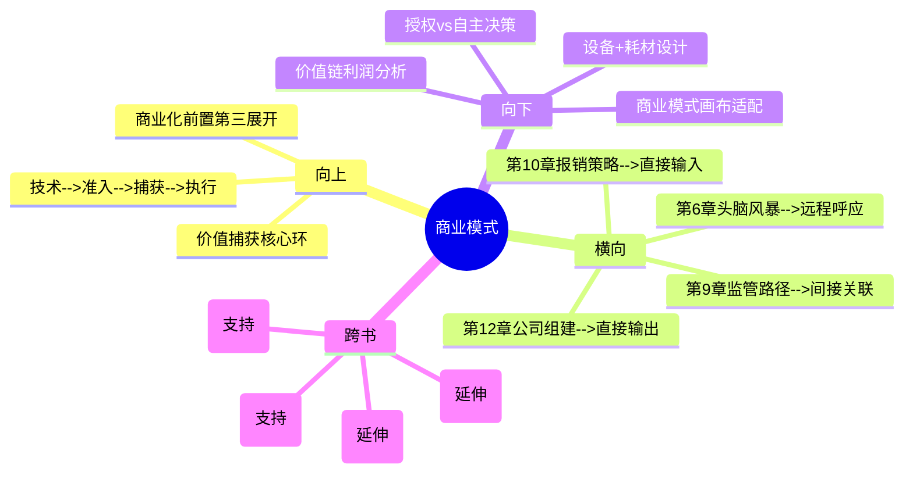

# 第11章 Implement - 商业模式（Business Model）

## 章节定位

### 全书位置
> 本章是Implement阶段的第三环，承接第10章报销策略，回答"产品能获批、能报销之后，用什么模式赚钱"。这是从"市场准入"到"价值捕获"的关键跃迁。

- **全书核心问题**: 为什么95%的医疗创新想法最终夭折？如何系统性提高落地率？
- **本章回答的问题**: 医疗创新产品应该采用什么样的商业模式？一次性销售、设备+耗材、还是授权给大公司？商业模式如何决定融资策略和组织架构？
- **角色类型**: 核心方法论型
- **论证位置**: 全书三步法第三步（Implement）的第三环——第9章解决"能不能获批"，第10章解决"能不能报销"，本章解决"怎么赚钱"。三者依次构成"死亡之谷→价值捕获"的完整通路。商业模式决定了公司的融资策略、组织架构和最终命运

### 章节序列
| 方向 | 章节标题 | 逻辑连接 |
|------|----------|----------|
| 前章 | 第10章 报销策略（Reimbursement） | 直接前置：报销路径确定了收入来源的性质，本章据此设计商业模式和收入模式 |
| 后章 | 第12章 公司组建（Company Formation） | 直接后续：商业模式确定后，需要组建匹配的团队和公司架构来执行 |

### 一句话定位
> 本章是"价值捕获"的深度拆解，确立"商业模式必须在原型阶段就开始设计"的核心观点——通过一次性销售、设备+耗材、授权授权三种核心模式的对比，以及从技术到患者的价值链分析，揭示商业模式不是商业计划书的附件，而是创新设计的一部分。

---

## 核心观点

### 第一层：表层案例

| 案例名称 | 简要描述 | 关键引文 |
|----------|----------|----------|
| 设备+耗材的剃刀模式 | 以较低价格销售设备（如手术机器人），通过持续销售高利润的专用耗材（如一次性手术器械）获取长期收入 | "设备+耗材模式的本质是用设备锁定客户，用耗材创造持续收入" |
| 一次性销售vs持续收入 | 某团队做出一次性销售的诊断设备，收入波动大、估值低；另一团队采用设备+耗材模式，收入稳定、估值高3倍 | 商业模式直接影响公司估值和融资能力 |
| 授权给大公司的路径 | 学术团队发现创新技术后选择不自己开公司，而是将专利授权给美敦力/强生等大公司，获得预付款+销售分成 | 授权模式降低了执行复杂度，但牺牲了长期收益上限 |

### 第二层：中层机制

| 机制名称 | 组成要素 | 因果链条 | 证据来源 |
|----------|----------|----------|----------|
| 商业模式前置机制 | 在原型阶段就设计商业模式，而非产品上市后再决定 | 商业模式早期确定 → 产品设计据此调整（设备与耗材的接口设计、一次性vs可重复使用的选择） → 避免后期商业模式不匹配导致返工 | 设备+耗材案例、一次性销售vs持续收入 |
| 价值链分析机制 | 从技术到患者手中的每一个环节——研发、审批、生产、分销、使用、报销——逐一分析价值创造点和价值损耗点 | 识别价值链中的瓶颈和利润分配不均 → 优化商业模式以捕获最大价值份额 | 价值链分析框架 |
| 模式-融资联动机制 | 商业模式决定融资策略和组织架构——一次性销售需要大资金备货，设备+耗材需要长期资本耐心，授权模式需要IP管理能力 | 商业模式选择 → 融资金额和轮次不同 → 团队能力需求不同 → 公司架构不同 | 三种模式的融资对比 |

### 第三层：底层规律

| 规律陈述 | 抽象层级 | 知识连接 | 适用范围 |
|----------|----------|----------|----------|
| **商业模式前置定律**：商业模式不是产品完成后的"怎么卖"问题，而是产品设计阶段的"做成什么样"问题。商业模式反哺技术设计，约束技术选择 | 商业模式设计/产品战略 | 约束优化理论（约束定义解空间）、价值捕获理论（Teece） | 所有硬件产品、SaaS产品、平台型产品 |
| **模式-架构共演定律**：商业模式决定了公司的组织架构、融资策略和团队能力需求。选择商业模式等于选择公司的"基因" | 组织理论/战略管理 | 康威定律（组织设计决定产品设计）、资源基础理论（能力决定战略） | 所有创业公司 |
| **价值链利润分配定律**：在从技术到患者的价值链中，价值创造和价值捕获不是均匀分布的。找到价值链中利润分配最不均的环节，那里就是商业模式创新的机会 | 产业经济学/价值链分析 | 微笑曲线理论（高附加值在两端）、波特价值链 | 所有存在多层中间环节的行业 |

---

## 降维翻译

### 观点1: 商业模式前置定律

#### 原文表达
> "商业模式必须在原型阶段就开始设计，而非产品完成后的补充工作。商业模式决定了产品应该是做成什么样子——一次性使用还是可重复使用、独立设备还是需要配套耗材。"

#### 认知转变
从"先做好产品再想怎么卖"到"怎么卖决定了产品该做成什么样"——商业模式不是销售的包装纸，是产品的骨架。

#### 降维翻译（中学生能懂）
大多数人认为商业模式是产品做出来之后的事——"东西做出来了，现在想想怎么卖"。Biodesign说这个想法完全错了。商业模式决定了产品应该被设计成什么样。举个例子：如果商业模式是一次性销售，那产品应该做得越耐用越好，因为卖一台就赚一台的钱。但如果商业模式是"设备+耗材"（像打印机和墨盒），那设备反而应该做得便宜一些，把利润放在持续销售的耗材上。这两种商业模式对应的产品设计完全不同——而且一旦产品做完了再想改商业模式，几乎不可能。所以Biodesign要求：在做原型的时候就要同时想好商业模式，因为商业模式会反哺产品设计。

#### 日常类比（奶奶能懂）
就像开餐馆。你不会先把菜谱全定好了再去想是开快餐店还是高级餐厅。快餐店的菜谱和高级餐厅的菜谱从一开始就不一样——快餐要做得快、成本低，高级餐厅要做得精致、成本高。商业模式就是你决定开什么类型的餐馆，这个决定要在设计菜谱（产品）之前就做好。

#### 检验
- Q: 为什么商业模式要在原型阶段就设计？
- A: 因为商业模式决定了产品的技术规格——一次性销售的产品追求单台利润最大化，设备+耗材模式追求设备铺量和耗材复购。如果等产品做完了再选商业模式，产品可能根本不匹配所选模式的盈利逻辑。

### 观点2: 模式-架构共演定律

#### 原文表达
> "商业模式决定了公司的组织架构、融资策略和团队能力需求。选择商业模式等于选择公司的'基因'。"

#### 认知转变
从"商业模式只是赚钱方式"到"商业模式定义公司的基因"——商业模式不是表面的销售策略，是公司深层的组织DNA。

#### 降维翻译（中学生能懂）
不同的商业模式需要的公司是完全不同的。一次性销售模式需要：强大的销售团队（每单金额大但频率低）、大量备货资金、供应链管理能力强。设备+耗材模式需要：设备安装和维护团队、耗材生产和销售网络、长期资本耐心（前几年可能亏损，靠耗材逐步回本）。授权模式需要：IP管理能力、法律团队、与大公司谈判的能力，但不需要生产、销售、售后团队。你选的商业模式不仅决定了"怎么赚钱"，更决定了"需要什么样的团队、融多少资、公司长什么样"。所以选择商业模式是创业中最关键的决策之一——它定义了公司的基因。

#### 日常类比（奶奶能懂）
就像选职业。当医生和当开餐馆的老板，需要的能力、资金、人脉完全不同。你选的不只是"怎么赚钱"，而是"成为什么样的人"。商业模式就是创业公司的"职业选择"——选了设备+耗材模式，公司就成了"长期服务型"；选了一次性销售，公司就成了"交易型"。

#### 检验
- Q: 为什么商业模式决定了公司的"基因"？
- A: 因为不同商业模式需要的团队能力、资金规模、融资节奏、组织架构完全不同。选了商业模式就等于选了公司的"物种类型"，后续所有决策都围绕这个基因展开。中途改变商业模式就像让医生改行做厨师——几乎要重建整个公司。

### 观点3: 价值链利润分配定律

#### 原文表达
> "在从技术到患者手中的价值链中，价值创造和价值捕获不是均匀分布的。识别价值链中利润分配最不均的环节，就是商业模式创新的机会。"

#### 认知转变
从"关注自己的技术值多少钱"到"关注整个价值链中钱被谁赚走了"——赚钱的关键不是你的技术多好，而是你在价值链中站对了位置。

#### 降维翻译（中学生能懂）
一个医疗器械从发明到患者使用，中间经过很多环节：研发→临床试验→FDA审批→生产→分销→医院采购→医生使用→患者受益→医保报销。每个环节都创造了价值，但每个环节赚到的钱不一样。Biodesign建议你画一条价值链，标出每个环节的成本和利润分配。如果发现某个环节占据了大部分利润但技术含量很低（比如分销商赚了很多但只做了物流），那里就可能是商业模式创新的机会——你可以绕过这个环节直接卖给终端用户，或者把这个环节变成自己的收入来源。价值链分析帮你看清"钱从哪来、到哪去、谁在中间赚了大钱"。

#### 日常类比（奶奶能懂）
就像种菜到卖菜。菜农种菜很辛苦但赚得少，批发商转一手赚一点，菜市场摊贩再赚一点，最后超市卖给你的价格可能是菜农收入的十倍。如果你能分析出钱主要被谁赚走了，你就知道该在哪个环节做生意了。价值链分析就是看清这条"赚钱链"。

#### 检验
- Q: 价值链分析怎么帮到商业模式设计？
- A: 价值链分析帮你找到两个东西：一是价值链中利润分配最厚的环节（可以直接进入），二是价值链中效率最低、成本最高的环节（可以优化并从中获利）。找到这两个机会点，商业模式就有方向了。

---

## 知识锚点

### 原书精华
| 锚点 | 记忆场景 |
|------|----------|
| "商业模式必须在原型阶段就开始设计" | 团队等产品做完了才开始想商业模式时 |
| "设备+耗材模式的本质是用设备锁定客户，用耗材创造持续收入" | 讨论产品收入模式时 |
| "选择商业模式等于选择公司的基因" | 评估不同商业模式的长期影响时 |
| "商业模式决定了融资策略和组织架构" | 讨论公司需要融多少钱、招什么人时 |

### 降维锚点
| 锚点 | 来源观点 | 记忆场景 |
|------|----------|----------|
| "商业模式不是包装纸，是骨架" | 商业模式前置定律 | 纠正"先做产品再想商业模式"时 |
| "开餐馆要先决定是快餐还是高级餐厅，菜谱才不一样" | 商业模式前置定律 | 解释为什么商业模式要早期确定时 |
| "选商业模式就像选职业——选的不只是赚钱方式，是成为什么样的人" | 模式-架构共演定律 | 讨论商业模式对公司的长期影响时 |
| "种菜到卖菜的赚钱链——分析钱被谁赚走了" | 价值链利润分配定律 | 做价值链分析时 |
| "商业模式是公司的物种DNA，中途换模式等于物种变异" | 模式-架构共演定律 | 解释为什么不能轻易改变商业模式时 |

### 对比锚点
| 锚点 | 创作角度 | 记忆场景 |
|------|----------|----------|
| 传统思维：产品→销售模式；Biodesign：商业模式→产品设计 | 对比 | 评估产品-商业模式匹配度时 |
| 一次性销售：卖一台赚一台；设备+耗材：设备铺量，耗材赚钱 | 对比 | 讨论收入模式选择时 |
| 自己做：高收益高复杂度；授权：低收益低复杂度 | 对比 | 决定自主商业化还是授权时 |

---

## 当下映射

### 财富应用
| 场景 | 具体行动 | 预期效果 | 风险提示 |
|------|----------|----------|----------|
| 创业项目评估 | 评估创业项目时，重点分析其商业模式而非技术方案——设备+耗材模式通常比一次性销售模式有更高估值 | 识别商业模式优秀的创业项目，投资回报更稳定可预测 | 设备+耗材模式前期亏损周期长，需要确认团队有足够的资本耐心 |
| 个人副业选择 | 选择副业方向时，优先考虑"设备+耗材"类型的模式（持续收入）而非一次性交易模式 | 建立可预测的持续收入流，降低收入波动风险 | 持续收入模式需要长期积累客户，不适合需要快速现金流的情况 |

### 职场应用
| 场景 | 具体行动 | 所需能力 | 适用职级 |
|------|----------|----------|----------|
| 产品战略 | 在产品开发早期引入商业模式设计，用价值链分析找到最优价值捕获点 | 商业模式设计、价值链分析 | 产品总监/战略负责人 |
| 创业决策 | 面临"自主商业化 vs 授权"选择时，用模式-架构共演框架分析两种模式需要的团队能力、资金需求、时间周期 | 战略分析、资源评估 | 创始人/CTO |
| 竞品分析 | 将竞品的商业模式纳入竞品研究，不仅分析产品功能，还分析收入模式和价值链定位 | 商业模式分析 | 战略分析师 |

### 生活应用
| 场景 | 具体行动 | 可行性 | 见效时间 |
|------|----------|--------|----------|
| 个人收入模式设计 | 分析自己的收入来源，从"一次性交易"向"持续收入"模式迁移（如从接项目到做订阅服务） | 中，需要3-6个月过渡 | 收入稳定性3-6个月改善 |

### 72小时行动计划
1. 今天：对自己关注的产品或项目，画出从"技术"到"终端用户"的完整价值链，标注每个环节的成本和利润分配
2. 明天：分析该产品/项目当前的商业模式（一次性/持续收入/授权），评估是否与产品设计匹配
3. 本周内：用"模式-架构共演"框架，列出如果选择某种商业模式，需要的团队能力、融资需求、组织架构

---

## 章节关联

### 向上关联 --> 整书
- **贡献**: 完成"价值捕获"的核心环节，是全书"商业化前置"总论点的第三个具体展开。本章将第9章的监管路径和第10章的报销策略整合为完整的商业化方案
- **位置**: 全书论证链条"技术可行性→市场准入→价值捕获→组织执行"的第三环——本章解决价值捕获，下一章（第12章）解决组织执行

### 横向关联 --> 章节间
| 章节编号 | 章节标题 | 关联类型 | 连接描述 |
|----------|----------|----------|----------|
| 第10章 | 报销策略（Reimbursement） | 直接输入 | 第10章确定的报销路径是本章商业模式设计的核心输入——报销方式决定了收入模式和定价策略 |
| 第12章 | 公司组建（Company Formation） | 直接输出 | 本章确定的商业模式是第12章组建团队、融资策略、组织架构的直接输入 |
| 第9章 | 监管路径（Regulatory） | 间接关联 | 第9章的审批路径影响产品上市时间，进而影响商业模式的现金流预测和融资策略 |
| 第6章 | 头脑风暴 | 远程呼应 | 第6章头脑风暴评分矩阵中的"商业可行性"维度需要本章的商业模式分析来支撑 |

### 向下关联 --> 具体应用
| 应用场景 | 难度 | 前置知识 |
|----------|------|----------|
| 设备+耗材模式设计 | 中 | 产品架构设计基础 |
| 授权vs自主商业化决策 | 中 | IP价值评估基础 |
| 价值链利润分配分析 | 中 | 产业经济分析基础 |
| 商业模式画布在医疗行业的适配 | 低 | 商业模式画布基础 |

### 跨书关联 --> 知识网络
| 书籍 | 概念 | 关系 | 备注 |
|------|------|------|------|
| 商业模式新生代-Osterwalder | 商业模式画布九要素 | 延伸 | 画布是通用框架，Biodesign将其适配到医疗行业，增加了监管和报销两个特殊维度 |
| 从0到1-Peter Thiel | 垄断与竞争 | 延伸 | Thiel强调追求垄断地位，Biodesign的"设备+耗材"模式是实现客户锁定和垄断的有效手段 |
| 好战略坏战略-Richard Rumelt | 战略连贯性 | 支持 | Rumelt认为好战略需要"诊断-方针-连贯行动"，商业模式是连贯行动的核心载体 |
| 创新者的窘境-Clayton Christensen | 价值网络 | 支持 | Christensen的"价值网络"概念与Biodesign的价值链分析高度一致——企业被其所处的价值网络约束 |

### 关联可视化

---

## 问答设计

### Q1: Biodesign提出的三种主要商业模式各有什么特点？
**认知层次**: 记忆
**难度**: 低
**答案要点**:
- 一次性销售：每卖一台获得一次收入，收入波动大，估值相对较低，需要强大销售团队
- 设备+耗材（剃刀模式）：设备低价铺量，通过持续销售专用耗材获得长期收入，收入稳定可预测，估值高
- 授权给大公司：获得预付款+销售分成，不需要自建生产/销售/售后团队，收益上限较低但风险也低

### Q2: 为什么说"商业模式决定了产品设计"？
**认知层次**: 理解
**难度**: 中
**答案要点**:
- 一次性销售模式要求产品追求单台利润最大化，倾向于高端耐用
- 设备+耗材模式要求设备低价、耗材高利润，设计上设备与耗材要形成技术锁定
- 授权模式要求产品有清晰的核心创新点可被专利保护，因为授权价值主要在IP
- 如果产品做完了再选商业模式，产品可能完全不匹配盈利逻辑

### Q3: 如何用价值链分析找到商业模式创新机会？
**认知层次**: 应用
**难度**: 中
**答案要点**:
- 画出从技术到终端用户的完整价值链
- 标注每个环节的成本和利润分配
- 找到利润分配最厚的环节（可直接进入）和效率最低的环节（可优化获利）
- 绕过中间低效环节直接连接终端用户
- 将价值链中的瓶颈转化为收入来源

### Q4: "模式-架构共演"怎么解释创业公司的失败模式？
**认知层次**: 分析
**难度**: 高
**答案要点**:
- 很多创业公司失败是因为商业模式和组织架构不匹配
- 例如：选了设备+耗材模式但团队是一次性销售基因（只会做交易不会做长期服务）
- 或：选了授权模式但团队全是工程师没有IP管理和商务谈判能力
- 商业模式定义了公司需要的"物种基因"，基因不匹配必然失败
- 中途改变商业模式几乎要重建团队，成本极高

### Q5: 在原型阶段设计商业模式，具体应该做什么？
**认知层次**: 创造
**难度**: 高
**答案要点**:
- 用价值链分析画出从技术到终端用户的价值链
- 列出2-3种可选商业模式，分析每种模式需要的产品设计差异
- 用"模式-架构共演"框架分析每种模式需要的团队能力、融资需求、组织架构
- 在原型设计评审中纳入商业模式维度——原型不仅验证技术可行性，也验证商业模式匹配度
- 建立"技术-商业模式"联合评分矩阵，两个维度都通过才进入下一阶段

---

## 拆解质量自检

### 必检项
- [x] Frontmatter 格式正确
- [x] 章节定位一句话清晰
- [x] 三层提取完整（每层 >= 3个元素）
- [x] 所有核心观点有完整三层翻译和认知转变
- [x] 知识锚点 >= 8条
- [x] 三大维度映射完整
- [x] 四向关联完整
- [x] 问答设计 >= 5个
- [x] 有72小时应用计划
- [x] 有Mermaid可视化

### 优质项（优秀标准）
- [x] 三层提取完整（每层 >= 3个元素）
- [x] 所有核心观点有完整三层翻译
- [x] 三大维度映射完整
- [x] 四向关联完整
- [x] 知识锚点 >= 8条
- [x] 问答设计 >= 5个
- [x] 有72小时应用计划
- [x] 有Mermaid可视化
- [x] links包含主拆解记录和第10章
- [x] tags使用层级格式
- [x] 每个观点有认知转变描述
- [x] 与第10章建立直接输入关联
- [x] 与第12章建立直接输出关联
- [x] 与第6章建立远程呼应
