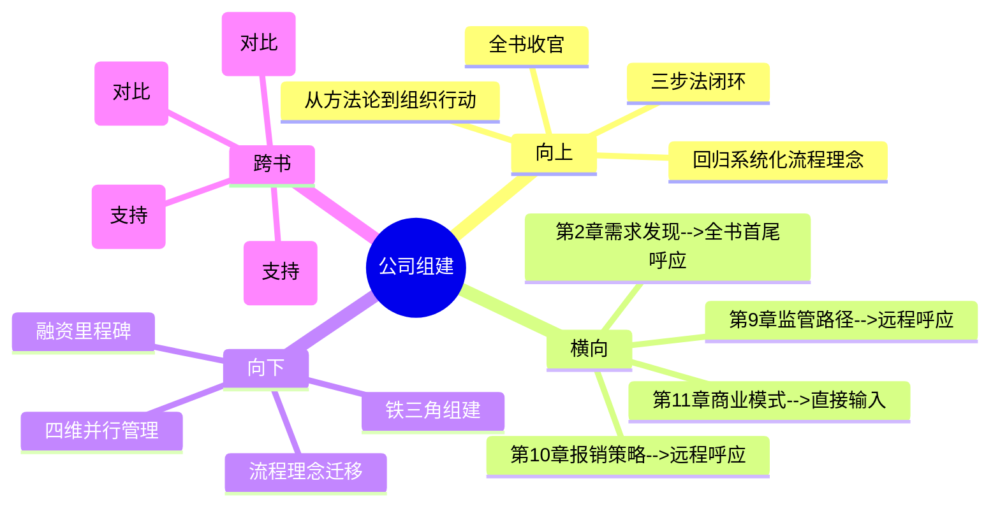

# 第12章 Implement - 公司组建（Company Formation）

## 章节定位

### 全书位置
> 本章是全书三步法的最后一环，也是全书的收官章节。承接第11章商业模式，回答"有了监管路径、报销策略、商业模式之后，谁来执行"。这是全书从"方法论"落地到"组织与行动"的最终环节，同时回到Biodesign的核心理念完成闭环。

- **全书核心问题**: 为什么95%的医疗创新想法最终夭折？如何系统性提高落地率？
- **本章回答的问题**: 从学术项目到商业公司，如何组建团队、获取融资、建立组织架构，在监管、报销、商业、团队四个维度同时推进？
- **角色类型**: 整合升华型（全书收官）
- **论证位置**: 全书三步法第三步（Implement）的最终环，也是全书论证的终点。本章不仅解决"怎么组建公司"的实操问题，更回到Biodesign的核心理念——系统化流程——完成全书闭环。前11章讲了"做什么"和"怎么做"，本章讲"谁来做"和"用什么组织形式做"

### 章节序列
| 方向 | 章节标题 | 逻辑连接 |
|------|----------|----------|
| 前章 | 第11章 商业模式（Business Model） | 直接前置：商业模式决定了公司需要的团队类型、融资策略和组织架构 |
| 后章 | 无（全书收官） | 收尾：本章完成全书三步法闭环，回到Biodesign核心理念 |

### 一句话定位
> 本章是全书的收官之作，确立"创业公司不是做出产品就行，而是监管、报销、商业、团队四个维度同时推进"的全书总结性观点——通过创始团队组建、融资策略、股权结构的系统方法，回到Biodesign的核心理念：医疗创新不是灵感乍现，而是一套可学习、可复制、可管理的系统工程流程。

---

## 核心观点

### 第一层：表层案例

| 案例名称 | 简要描述 | 关键引文 |
|----------|----------|----------|
| 学术项目到商业公司 | 斯坦福大学教授的临床创新技术，通过Biodesign流程孵化为公司，但面临"学术思维"向"商业思维"的巨大转变 | "创业公司不是'做出产品就行'" |
| 铁三角团队组建 | 成功的医疗创业团队通常需要三个核心角色：CEO（商业运营）、CTO（技术研发）、CMO（临床医学），缺一不可 | "关键人物：CEO、CTO、CMO铁三角" |
| 融资路线图 | 种子轮（验证概念）→A轮（验证产品）→B轮（验证市场）→IPO/并购（退出），每个阶段需要不同的里程碑和估值逻辑 | 融资阶段与里程碑对应关系 |

### 第二层：中层机制

| 机制名称 | 组成要素 | 因果链条 | 证据来源 |
|----------|----------|----------|----------|
| 四维度并行推进机制 | 监管、报销、商业、团队四个维度同时推进，而非线性执行 | 四个维度互相依赖、互为约束 → 任一维度滞后都导致整体停滞 → 必须在创意阶段就四维同步规划 | 学术到商业转型案例 |
| 铁三角组建机制 | CEO（商业能力：融资、谈判、战略）+ CTO（技术能力：研发、原型、工程）+ CMO（医学能力：临床洞察、KOL网络、临床策略） | 三角缺一 → 技术再好缺商业卖不出去 → 商业再好缺技术做不出来 → 技术商业都有缺医学无法通过审批 | 铁三角团队组建案例 |
| 融资里程碑机制 | 每轮融资对应明确的里程碑：种子轮完成概念验证、A轮完成原型验证、B轮完成监管获批和初步商业化 → 里程碑达成决定下一轮估值 | 里程碑清晰 → 融资可预期 → 估值合理 → 公司健康增长 | 融资路线图案例 |

### 第三层：底层规律

| 规律陈述 | 抽象层级 | 知识连接 | 适用范围 |
|----------|----------|----------|----------|
| **四维并行定律**：在复杂创新环境中，成功不是单点突破的结果，而是多系统同步推进的结果。监管、报销、商业、团队四个维度必须像交响乐一样协调演奏，而非轮流独奏 | 复杂系统理论/创业管理 | 交响乐理论（多声部协调）、系统论（子系统同步） | 所有复杂环境下的创业活动 |
| **互补基因定律**：创始团队不是"找相似的人"，而是"找互补的人"。铁三角（商业+技术+医学）的互补性比任何单一维度的卓越更重要 | 组织行为学/团队动力学 | 贝尔宾团队角色理论、互补性匹配理论 | 所有跨学科创业团队组建 |
| **流程即理念定律**：Biodesoin方法论的真正价值不是某个具体工具，而是"系统化流程"这个理念本身。流程的价值在于它让创新从不可控的艺术变成可管理的工程 | 方法论哲学/知识管理 | 可重复性理论（流程化使能力可迁移）、知识显性化理论 | 所有领域的专业能力建设 |

---

## 降维翻译

### 观点1: 四维并行定律

#### 原文表达
> "创业公司不是'做出产品就行'，需要在监管、报销、商业、团队四个维度同时推进。四个维度中的任何一个失败，整个公司就会失败。"

#### 认知转变
从"做好产品就能成功"到"四个维度必须像交响乐一样协调"——创业不是单项赛跑，是四项全能。

#### 降维翻译（中学生能懂）
很多人以为创业就是：想出一个好点子 → 做出产品 → 大卖。Biodesign说在医疗行业，这个想法天真得可怕。实际上你要同时推进四件事：监管（能不能获批）、报销（能不能报销）、商业（怎么赚钱）、团队（谁来做）。这四件事不是"做完一个再做下一个"，而是"四个同时做"。因为如果产品做出来了但审批没过，公司等死；如果审批过了但医保不报销，医院不买；如果都搞定了但团队没有商业能力，公司还是活不下去。创业不是单项比赛跑得快就行，是四项全能——四项都必须及格，任何一项零分就全盘皆输。

#### 日常类比（奶奶能懂）
就像做一桌宴席。不是光菜做得好吃就行——菜要好吃（技术）、要符合客人口味（报销）、要定价合理（商业）、要有好厨师和服务员（团队）。你光菜做得好，其他三项不行，这桌宴席还是失败的。而且这四项必须同时准备好，不能等菜都凉了才想起来找服务员。

#### 检验
- Q: 为什么四个维度必须同时推进而不能先后执行？
- A: 因为四个维度互相影响。监管路径影响产品设计，报销策略影响定价，商业模式影响融资，团队能力影响所有维度的执行质量。如果串行执行，后面发现的问题需要前面的方案大改，成本极高。并行执行虽然管理复杂，但总风险最低。

### 观点2: 互补基因定律

#### 原文表达
> "成功的医疗创业团队需要三个核心角色：CEO（商业运营）、CTO（技术研发）、CMO（临床医学）。三角缺一，公司必败。"

#### 认知转变
从"找能力强的人"到"找能力互补的人"——团队不是全明星阵容，是拼图。

#### 降维翻译（中学生能懂）
很多学术出身的创业者有一个致命误区：找和自己能力相似的人一起干——教授找教授，工程师找工程师。Biodesign说这是错的。成功的医疗创业需要三个完全不同能力的人组成"铁三角"：CEO负责商业——融资、谈判、公司战略；CTO负责技术——研发、原型、工程实现；CMO负责医学——临床洞察、专家网络、临床试验策略。这三个人必须能力互补，不能重叠。一个纯技术的团队做不出能卖的产品，一个纯商业的团队做不出能用的产品，一个没有医学视野的团队过不了FDA审批。团队不是找最厉害的人，而是找能互相补位的人。

#### 日常类比（奶奶能懂）
就像组成一个家庭。光有会赚钱的不行，还要有会管家的、会教育的。三个人各干各的强项，这个家才运转得好。团队也是一样——不是找三个都会赚钱的，是找赚钱的、管家的、教育的各一个。

#### 检验
- Q: 为什么找互补的人比找能力强的人更重要？
- A: 因为创业需要多种能力同时在线。三个能力强但能力重叠的人，缺了某个关键维度（比如医学或商业），公司在那方面就是零分。三个能力互补的人即使每个人不是最顶尖，组合起来也能覆盖所有关键维度。

### 观点3: 流程即理念定律

#### 原文表达
> "Biodesign方法论的真正价值不是某个具体工具或模板，而是'系统化流程'这个理念本身——医疗创新不是灵感乍现的随机事件，而是一套可以被学习、被复制、被管理的系统工程流程。"

#### 认知转变
从"流程是一堆工具模板"到"流程本身就是一种思维方式和组织能力"——流程不是工具箱，是操作系统。

#### 降维翻译（中学生能懂）
整本Biodesign讲了很多工具——需求陈述模板、打分卡、头脑风暴规则、专利检索方法、FDA分类指南。但所有这些工具背后只有一个核心理念：医疗创新不是天才灵光一现的随机事件，而是一套可以被任何人学习、被任何团队复制、被任何管理者监控的系统工程流程。流程的价值不在于告诉你"做什么"，而在于它提供了一个让不同专业的人能在同一个框架下协作的语言和节奏。有了流程，创新不再依赖某个天才的直觉，而是依赖一套可重复的方法。这就是为什么斯坦福Biodesign能培养出数千人、孵化100多家公司——不是因为参与者都是天才，而是因为流程让普通人也能做出天才的决策。

#### 日常类比（奶奶能懂）
就像做菜。没有流程的时候，做菜全靠厨师的"手感"和"经验"——只有少数大师能做出一桌好菜。有了标准化流程（食谱），普通人也能做出八九不离十的味道。Biodesoin的流程就是医疗创新的"食谱"——它不保证每道菜都是米其林三星，但保证每道菜都不会难吃，而且任何一个学了这套流程的人都能做出及格以上的菜。流程的价值是把"手艺"变成"工艺"。

#### 检验
- Q: 为什么说Biodesign的真正价值是"系统化流程"理念而不是具体工具？
- A: 因为工具会随着时代变化而过时（FDA政策会变、医保编码会变），但"用系统化流程管理创新"这个理念不会过时。工具教会你"怎么做这道题"，流程教会你"怎么学会做新题"。前者是答案，后者是能力。

---

## 知识锚点

### 原书精华
| 锚点 | 记忆场景 |
|------|----------|
| "创业公司不是'做出产品就行'" | 团队过度关注产品研发而忽视其他维度时 |
| "关键人物：CEO、CTO、CMO铁三角" | 讨论创业团队组建时 |
| "医疗创新不是灵感乍现的随机事件，而是一套可学习、可复制、可管理的系统工程流程" | 全书收官、总结Biodesoin核心理念时 |
| "种子轮→A轮→B轮→IPO/并购，每个阶段需要不同里程碑" | 讨论融资策略时 |

### 降维锚点
| 锚点 | 来源观点 | 记忆场景 |
|------|----------|----------|
| "创业是四项全能，不是单项赛跑——四项都必须及格" | 四维并行定律 | 纠正"做好产品就行"的思维时 |
| "团队是拼图，不是全明星——找能补位的人，不是找最强的人" | 互补基因定律 | 讨论团队组建标准时 |
| "流程不是工具箱，是操作系统" | 流程即理念定律 | 解释Biodesoin方法论的核心价值时 |
| "流程把'手艺'变成'工艺'" | 流程即理念定律 | 讨论流程vs经验时 |
| "交响乐不是轮流独奏，是多声部协调" | 四维并行定律 | 解释为什么四个维度要并行时 |
| "像做宴席——菜好吃只是四分之一" | 四维并行定律 | 说明四维度缺一不可时 |

### 对比锚点
| 锚点 | 创作角度 | 记忆场景 |
|------|----------|----------|
| 传统创业：天才+灵感；Biodesoin：流程+系统 | 对比 | 讨论创新方法论时 |
| 学术思维：做出好东西就行；商业思维：做出能卖的东西 | 对比 | 学术人员转向创业时 |
| 铁三角不是"三个聪明人"，是"三种不同能力的人" | 对比 | 组建创始团队时 |
| Identify找到方向，Invent设计方案，Implement打开市场——全书闭环 | 对比 | 全书收官、总结三步法时 |

---

## 当下映射

### 财富应用
| 场景 | 具体行动 | 预期效果 | 风险提示 |
|------|----------|----------|----------|
| 创业项目评估 | 评估医疗创业项目时，检查团队是否有"铁三角"（商业+技术+医学），而非仅看技术方案 | 识别团队完整的创业项目，降低因团队能力缺失导致的投资风险 | 早期团队可能尚未完全组建，需要评估创始人的"补位能力"和招聘计划 |
| 融资阶段判断 | 根据项目当前里程碑判断其应处融资阶段（种子/A/B轮），验证估值合理性 | 避免为未达里程碑的项目支付过高估值 | 不同赛道里程碑标准有差异，需要行业基准数据 |

### 职场应用
| 场景 | 具体行动 | 所需能力 | 适用职级 |
|------|----------|----------|----------|
| 创业团队组建 | 用"铁三角"框架评估现有团队的能力缺口，优先补缺失维度而非增强已有维度 | 团队诊断、人才评估 | 创始人/联合创始人 |
| 个人职业定位 | 在创业团队中明确自己的角色定位（CEO型/CTO型/CMO型），强化核心能力而非追求全能 | 自我认知、能力评估 | 所有创业团队成员 |
| 跨职能协作 | 在现有组织中建立"四维度并行"的项目管理模式，打破部门壁垒 | 项目管理、跨部门沟通 | 中层管理者以上 |

### 生活应用
| 场景 | 具体行动 | 可行性 | 见效时间 |
|------|----------|--------|----------|
| 个人目标的"四维度"分析 | 做任何重大人生规划（转行/创业/投资）时，用"四维度"框架分析：能力准备度、资源准备度、风险评估、执行路径 | 高，立即开始 | 规划质量即时提升 |

### 72小时行动计划
1. 今天：用"铁三角"框架分析自己参与的团队或关注的项目，识别能力缺口（缺商业/缺技术/缺医学）
2. 明天：做一个个人能力定位——明确自己在创业或项目中的角色类型（CEO型/CTO型/CMO型），制定能力强化计划
3. 本周内：用"四维度并行"框架，对当前关注的项目做一个四维评估：监管/报销/商业/团队，每个维度打分1-10，找出最短板

---

## 章节关联

### 向上关联 --> 整书
- **贡献**: 全书收官。本章完成三步法闭环，回答全书核心问题"为什么95%的医疗创新想法最终夭折"——因为大多数团队只关注技术，忽略了监管、报销、商业、团队四维并行。同时回到Biodesoin的核心理念：系统化流程，完成全书从"方法论"到"组织行动"的最终落地
- **位置**: 全书论证链条的终点——Identify（找到正确方向）→ Invent（设计正确方案）→ Implement（用正确组织和流程推向市场）。本章是"正确组织"的最终答案

### 横向关联 --> 章节间
| 章节编号 | 章节标题 | 关联类型 | 连接描述 |
|----------|----------|----------|----------|
| 第11章 | 商业模式（Business Model） | 直接输入 | 第11章确定的商业模式是本章团队组建和融资策略的直接输入——商业模式决定需要什么样的人 |
| 第9章 | 监管路径 | 远程呼应 | 第9章的监管路径决定了团队需要什么样的法规事务能力 |
| 第10章 | 报销策略 | 远程呼应 | 第10章的报销策略决定了团队需要什么样的商务和医保事务能力 |
| 第2章 | 需求发现 | 全书首尾呼应 | 第2章从临床观察出发、从需求驱动开始；本章回到组织建设和系统化流程——全书形成"从临床洞察到商业公司"的完整闭环 |

### 向下关联 --> 具体应用
| 应用场景 | 难度 | 前置知识 |
|----------|------|----------|
| 创业铁三角组建 | 中 | 人才评估、团队诊断 |
| 融资里程碑规划 | 中 | 融资阶段知识、里程碑设定 |
| 四维度并行管理 | 高 | 项目管理、跨职能协作 |
| "流程即理念"迁移到个人能力建设 | 低 | 自我管理能力 |

### 跨书关联 --> 知识网络
| 书籍 | 概念 | 关系 | 备注 |
|------|------|------|------|
| 从0到1-Peter Thiel | 创始团队 | 对比 | Thiel强调创始人的独特洞察力是创业成功的关键（天才驱动），Biodesoin强调系统化流程使普通人也能成功（流程驱动）——两种创业哲学的终极碰撞 |
| 精益创业-Eric Ries | 创业方法论 | 对比 | 精益创业的MVP+迭代适合试错成本低的行业，Biodesoin的四维并行适合试错成本高的行业——但底层逻辑一致：用系统方法降低失败率 |
| 从优秀到卓越-Jim Collins | 先人后事 | 支持 | Collins的"先让合适的人上车"与Biodesoin的"铁三角组建"高度一致——团队建设优先于战略执行 |
| 好战略坏战略-Richard Rumelt | 战略与执行 | 支持 | Rumelt认为好战略需要"诊断-方针-连贯行动"，本章的四维并行和铁三角是"连贯行动"的组织保障 |

### 关联可视化

---

## 问答设计

### Q1: Biodesoin提出的创业团队"铁三角"是哪三个角色？各自的核心能力是什么？
**认知层次**: 记忆
**难度**: 低
**答案要点**:
- CEO（首席执行官）：商业能力——融资、谈判、战略规划、公司运营
- CTO（首席技术官）：技术能力——研发、原型设计、工程实现
- CMO（首席医学官）：医学能力——临床洞察、KOL专家网络、临床试验策略
- 三角缺一不可，三者能力必须互补

### Q2: 为什么说"创业公司不是做出产品就行"？
**认知层次**: 理解
**难度**: 中
**答案要点**:
- 产品做出来只是第一步，还需要：监管审批（能不能获批）、医保报销（能不能覆盖）、商业变现（怎么赚钱）、团队执行（谁来做）
- 四个维度中任何一个失败，公司就会失败
- 很多团队技术能力很强但在其他维度完全缺失
- 创业是四项全能，不是单项赛跑

### Q3: 医疗创业的融资里程碑体系是什么？
**认知层次**: 理解
**难度**: 中
**答案要点**:
- 种子轮：验证概念可行性，需要初步数据和原型方向
- A轮：验证产品可行性，需要功能性原型和初步临床数据
- B轮：验证市场可行性，需要FDA获批和初步商业化数据
- IPO/并购：退出，需要规模化收入和明确的盈利路径
- 每个阶段的里程碑达成程度决定下一轮的估值

### Q4: 如何理解"Biodesoin的真正价值是系统化流程理念而非具体工具"？
**认知层次**: 分析
**难度**: 高
**答案要点**:
- 工具会过时（政策变、编码变），但"用流程管理创新"的理念不会过时
- 流程把创新从依赖天才直觉的"艺术"变成可复制可管理的"工程"
- 流程提供了一套共同语言，让不同专业的人能在同一框架下协作
- 斯坦福Biodesoin能培养数千人、孵化100多家公司，靠的不是天才而是流程
- 这是全书从第1章到第12章的核心理念闭环

### Q5: 全书三步法（Identify→Invent→Implement）形成了怎样的论证闭环？
**认知层次**: 分析
**难度**: 高
**答案要点**:
- Identify（识别）：第2-5章，解决"做什么"——从临床观察中发现需求、筛选、侦察、定义
- Invent（发明）：第6-8章，解决"怎么做"——头脑风暴产生方案、原型验证可行性、IP建立保护
- Implement（实施）：第9-12章，解决"怎么卖"——监管审批、报销策略、商业模式、公司组建
- 三步法形成"方向→方案→市场"的完整逻辑链
- 全书从第2章的临床洞察出发，到第12章的商业公司落地，完成"从临床到商业"的全流程闭环
- 核心理念贯穿始终：医疗创新不是灵感乍现，而是可学习、可复制、可管理的系统工程流程

### Q6: 如何在非医疗行业的创业中应用"四维并行"思维？
**认知层次**: 应用
**难度**: 中
**答案要点**:
- 核心逻辑：识别所在行业的"四个关键约束维度"，确保并行推进
- 互联网行业：技术实现、用户增长、商业模式、团队能力
- 硬件行业：产品设计、供应链、渠道分销、团队能力
- 金融行业：产品开发、合规审批、渠道获客、团队能力
- 关键是找到你所在行业的"四维"，然后用并行而非串行的方式推进
- 这比线性执行降低总体风险，虽然管理复杂度更高

---

## 拆解质量自检

### 必检项
- [x] Frontmatter 格式正确
- [x] 章节定位一句话清晰
- [x] 三层提取完整（每层 >= 3个元素）
- [x] 所有核心观点有完整三层翻译和认知转变
- [x] 知识锚点 >= 8条
- [x] 三大维度映射完整
- [x] 四向关联完整
- [x] 问答设计 >= 5个
- [x] 有72小时应用计划
- [x] 有Mermaid可视化

### 优质项（优秀标准）
- [x] 三层提取完整（每层 >= 3个元素）
- [x] 所有核心观点有完整三层翻译
- [x] 三大维度映射完整
- [x] 四向关联完整
- [x] 知识锚点 >= 8条
- [x] 问答设计 >= 5个
- [x] 有72小时应用计划
- [x] 有Mermaid可视化
- [x] links包含主拆解记录和第11章
- [x] tags使用层级格式
- [x] 每个观点有认知转变描述
- [x] 与第11章建立直接输入关联
- [x] 第2章全书首尾呼应
- [x] 回归Biodesoin核心理念"系统化流程"
- [x] 三步法闭环总结
- [x] 跨书关联包含与Thiel创业哲学的终极对比

### 收官特殊项
- [x] 体现"回到Biodesoin核心理念"
- [x] 全书三步法闭环总结（Identify→Invent→Implement）
- [x] 从"方法论"到"组织行动"的最终落地
- [x] 全书首尾呼应（第2章需求发现→第12章公司组建）
