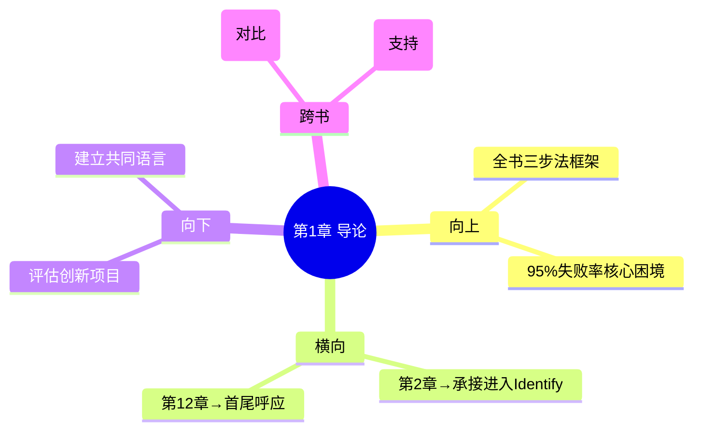

# 第1章 Introduction - 导论与全书概览

## 📍 章节定位

### 全书位置
> 本章是全书的开篇导论，回答"为什么需要Biodesign方法论"，确立三步法框架（Identify→Invent→Implement），为后续11章奠定基础。

- **全书核心问题**: 为什么95%以上的医疗创新想法最终夭折？如何系统性提高落地率？
- **本章回答的问题**: 为什么传统的"灵感驱动"创新模式在医疗领域行不通？需要什么替代方案？
- **角色类型**: 开篇定位型
- **论证位置**: 全书第一步，定义问题和框架，后续所有章节都在这三步法内展开

### 章节序列
| 方向 | 章节标题 | 逻辑连接 |
|------|----------|----------|
| 前章 | 无（全书开篇） | 开篇 |
| 后章 | 第2章 需求发现（Need Finding） | 承接：从框架概述进入第一步具体执行 |

### 一句话定位
> 本章是全书的"电梯演讲"——用最短的篇幅揭示医疗创新的根本矛盾，并给出三步法答案，为读者建立全局视角后再进入细节。

---

## 🎯 核心观点

### 第一层：表层案例

| 案例名称 | 简要描述 | 关键引文 |
|----------|----------|----------|
| 95%失败率 | 每年海量医疗创新想法产生，但极少能从实验室走到临床使用 | "医疗创新的最大问题不是缺少好想法，而是缺少把好想法变成产品的方法" |
| 斯坦福Biodesign项目 | 15年培养数千人、孵化100+公司、融资超30亿美元的实践验证 | "Biodesign不是一套理论，是一套经过反复验证的操作手册" |
| 传统创新模式vs系统化模式 | 个人英雄主义创新（依赖天才直觉）vs 可复制流程（任何团队都能执行） | "如果一个方法只能被少数人掌握，那它不是方法，是天赋" |

### 第二层：中层机制

| 机制名称 | 组成要素 | 因果链条 | 证据来源 |
|----------|----------|----------|----------|
| 跨学科断裂机制 | 医生有洞察→不懂工程；工程师有技术→不了解临床；投资人有钱→不知道投什么 | 信息不对称 → 方向错误 → 资源浪费 → 项目夭折 | 95%失败率、跨学科团队案例 |
| 三步法框架机制 | Identify（识别）→ Invent（发明）→ Implement（实施），线性流程但内部有反馈循环 | 先搞清楚做什么→再想怎么做→最后解决能不能卖 | Biodesign Fellowship 15年实践 |
| 流程可复制机制 | 标准化格式（需求陈述）+ 标准化工具（评分卡）+ 标准化阶段门控 | 消除个人差异 → 提高基线水平 → 任何团队都能达到及格线 | 数千人培养记录、100+公司孵化 |

### 第三层：底层规律

| 规律陈述 | 抽象层级 | 知识连接 | 适用范围 |
|----------|----------|----------|----------|
| **系统替代天赋定律**：当一个问题足够复杂时，系统化流程的产出优于天才直觉 | 系统论/组织行为学 | 系统之美（系统优于个体）、[[原则]]（流程化决策） | 医疗创新、复杂产品开发、组织管理 |
| **框架先行定律**：在进入细节之前，先建立全局框架，认知效率提升数倍 | 认知科学/信息论 | 认知负荷理论、结构化学习 | 任何复杂知识体系的学习和传授 |
| **流程即民主化定律**：把依赖天赋的能力转化为可学习的流程，本质是知识民主化 | 教育哲学/创新社会学 | 杜威实用主义教育、精益创业 | 创新教育、组织能力建设 |

---

## 💬 降维翻译

### 观点1: 系统替代天赋

#### 原文表达
> "Biodesign的核心信念是：医疗创新不是天才的专属领域，而是一套可以被学习、被复制、被管理的系统化流程。"

#### 降维翻译（中学生能懂）
大多数人觉得创新靠灵感，靠聪明人的灵光一闪。但Biodesign说：不是。在医疗这种试错成本极高的领域，靠灵感等于赌博。他们把整个创新过程拆成三个明确的步骤，每个步骤都有具体的方法和工具，任何一个受过训练的团队都能执行。

#### 日常类比（奶奶能懂）
就像做饭。有的厨师靠天赋和感觉，做出绝世好菜但只有他一个人能做；有的厨师写菜谱，规定放几勺盐、煮几分钟，谁照着做都能做出八九不离十的味道。Biodesign就是写菜谱。

#### 检验
- Q: 如果一个中学生问你"系统化创新"是什么意思？
- A: 就是不靠运气和灵感，把创新变成一步一步的流程，谁照着做都能做出好结果。就像做数学题有解题步骤一样，创新也有步骤。

### 观点2: 框架先行

#### 原文表达
> "三步法框架为读者建立全局视角：先知道整体地图，再走进每条街道。"

#### 降维翻译（中学生能懂）
读一本讲复杂方法的书，如果一上来就钻进细节，读者会迷路。所以作者先画一张地图——就三步：识别需求、发明方案、实施商业化。后面的所有章节都是在这三步下面的细分。先看到森林，再看树木。

#### 日常类比（奶奶能懂）
就像去一个从没去过的城市，先看一张地图知道东南西北，然后再决定走哪条街。如果一上来就给你看某条街的路牌，你只会更糊涂。

#### 检验
- Q: 为什么学复杂东西要先看框架？
- A: 因为人的脑子一次只能装有限的东西。先给框架等于给了"抽屉"，后面的知识才知道往哪个抽屉里放。没有框架的知识就是一堆散落的零件，装了也会忘。

### 观点3: 跨学科断裂

#### 原文表达
> "医疗创新需要临床洞察、工程能力、商业头脑三者的融合。但现实中这三种能力分散在不同的人身上，形成了创新的最大瓶颈。"

#### 降维翻译（中学生能懂）
医疗创新需要三种人：医生知道病人需要什么，工程师知道怎么把东西做出来，商人知道怎么把东西卖出去。但问题是这三拨人各说各的话，互相听不懂。Biodesign就是要让他们用同一种语言说话。

#### 日常类比（奶奶能懂）
就像盖房子需要设计师、施工队和包工头。设计师画的是艺术图，施工队看的是结构图，包工头算的是账本。如果各看各的，房子一定盖歪。需要一个让三个人都能看懂的共同图纸。

#### 检验
- Q: 为什么跨学科合作这么难？
- A: 不是因为他们笨，是因为每个行业有自己的"方言"。医生说的"好用"和工程师理解的"好用"根本不是一回事。好的流程就是一张"翻译字典"。

---

## ✨ 知识锚点

### 原书精华
| 锚点 | 记忆场景 |
|------|----------|
| "医疗创新的最大问题不是缺少好想法，而是缺少把好想法变成产品的方法" | 看到又一个"好创意"失败时 |
| "如果一个方法只能被少数人掌握，那它不是方法，是天赋" | 反思"天才崇拜"时 |
| "Biodesign不是一套理论，是一套经过反复验证的操作手册" | 有人质疑方法论太"学术"时 |

### 降维锚点
| 锚点 | 来源观点 | 记忆场景 |
|------|----------|----------|
| "不靠灵感，靠流程" | 系统替代天赋定律 | 团队讨论"我们需要一个idea"时 |
| "先画地图，再走街道" | 框架先行定律 | 学习任何复杂体系时 |
| "让不同方言的人说同一种话" | 跨学科断裂机制 | 跨部门协作卡壳时 |

### 对比锚点
| 锚点 | 创作角度 | 记忆场景 |
|------|----------|----------|
| 天赋 vs 流程：一个天花板高但基线低，一个天花板和基线都高 | 对比 | 讨论"招牛人还是建体系"时 |
| 灵感驱动 vs 系统驱动：前者适合低风险行业，后者适合高试错成本行业 | 对比 | 对比互联网和医疗创新时 |

---

## 🔗 当下映射

### 💰 财富应用
| 场景 | 具体行动 | 预期效果 | 风险提示 |
|------|----------|----------|----------|
| 评估创业项目 | 用三步法框架快速判断项目：需求清楚吗？方案明确吗？商业化路径想好了吗？三步缺一步就不投 | 避免投"只有技术没有市场"的项目 | 对早期项目过于严格可能错过机会 |

### 💼 职场应用
| 场景 | 具体行动 | 所需能力 | 适用职级 |
|------|----------|----------|----------|
| 产品/项目管理 | 把任何复杂项目按三步法拆解：先明确做什么（Identify），再设计方案（Invent），最后推进落地（Implement） | 结构化思维、跨学科沟通 | 所有管理层级 |
| 团队建设 | 识别团队的三种核心能力缺口（临床/工程/商业），有针对性地补人或培养 | 人才评估、组织设计 | 部门负责人以上 |

### 🏠 生活应用
| 场景 | 具体行动 | 可行性 | 见效时间 |
|------|----------|--------|----------|
| 个人重大决策（换城市/换行业） | 用三步法：先搞清楚自己到底要什么（Identify）→ 想出几个可行方案（Invent）→ 评估每个方案的实施条件（Implement） | 高，立即开始 | 决策质量即时提升 |

### 72小时行动计划
1. 明天：用三步法框架重新审视手头的一个项目/产品，检查哪一步最薄弱
2. 本周内：在下次跨部门会议中，尝试用标准化的"问题陈述"格式替代模糊描述
3. 需要准备资源：建立团队共同的术语表和需求陈述模板

---

## 🕸️ 章节关联

### 向上关联 → 整书
- **贡献**: 确立全书三步法框架和核心问题，是后续所有11章的"容器"
- **位置**: 开篇定位，定义"做什么"的方向和"为什么这么做"的理由

### 横向关联 → 章节间
| 章节编号 | 章节标题 | 关联类型 | 连接描述 |
|----------|----------|----------|----------|
| 第2章 | 需求发现 | 承接→递进 | 本章给出Identify框架→第2章进入Identify第一步的具体执行 |
| 第12章 | 公司组建 | 首尾呼应 | 本章提出系统化愿景→第12章展示系统化落地的终极形态 |

### 向下关联 → 具体应用
| 应用场景 | 难度 | 前置知识 |
|----------|------|----------|
| 用三步法评估任何创新项目 | 低 | 无 |
| 建立团队共同语言 | 中 | 基础沟通技巧 |

### 跨书关联 → 知识网络
| 书籍 | 概念 | 关系 | 备注 |
|------|------|------|------|
| 精益创业-Eric Ries-拆解记录 | MVP验证 vs 系统化流程 | 对比 | 精益创业用快速迭代替代系统化规划，Biodesign用系统化规划替代盲目试错 |
| 系统之美-Donella Meadows | 系统优于个体 | 支持 | 系统论为"流程优于天赋"提供理论支撑 |

### 关联可视化

---

## ❓ 问答设计

### Q1: Biodesign三步法是什么？
**认知层次**: 记忆
**难度**: 低
**答案要点**:
- Identify（识别需求）：发现和精确定义高价值的临床需求
- Invent（发明方案）：将需求转化为创新的解决方案
- Implement（实施商业化）：将方案变成能上市的产品

### Q2: 为什么作者强调"流程"而不是"天赋"？
**认知层次**: 理解
**难度**: 中
**答案要点**:
- 医疗创新的试错成本极高（涉及人命）
- 天赋不可复制，流程可以被任何团队学习
- 斯坦福Biodesign项目15年验证了流程的可复制性
- 知识民主化比精英主义更有社会价值

### Q3: 跨学科断裂如何导致95%的失败率？
**认知层次**: 分析
**难度**: 中
**答案要点**:
- 医生有临床洞察但不懂工程实现
- 工程师有技术能力但不了解真实需求
- 投资人有资金但无法判断方向
- 三方各自行动，信息不对称导致方向错误和资源浪费

### Q4: 三步法框架对非医疗领域的创新有什么启发？
**认知层次**: 应用
**难度**: 中
**答案要点**:
- 核心逻辑可迁移：先明确做什么→再设计方案→最后解决落地
- 替换场景：手术室→用户场景；FDA审批→行业准入壁垒
- 工具通用：需求陈述模板、评分卡、头脑风暴规则

### Q5: "框架先行"的认知科学依据是什么？
**认知层次**: 分析
**难度**: 高
**答案要点**:
- 认知负荷理论：人脑工作记忆容量有限，框架降低认知负荷
- 图式理论：先建立心理图式，后续信息才有"锚点"可以挂载
- 没有框架的知识是散落的零件，有框架的知识是组装的机器

---

## ✅ 拆解质量自检

### 必检项
- [x] Frontmatter 格式正确
- [x] 章节定位一句话清晰
- [x] 三层提取完整（每层 >= 3个元素）
- [x] 所有核心观点有完整三层翻译
- [x] 知识锚点 >= 8条
- [x] 三大维度映射完整
- [x] 四向关联完整
- [x] 问答设计 >= 5个
- [x] 有72小时应用计划
- [x] 有Mermaid可视化
