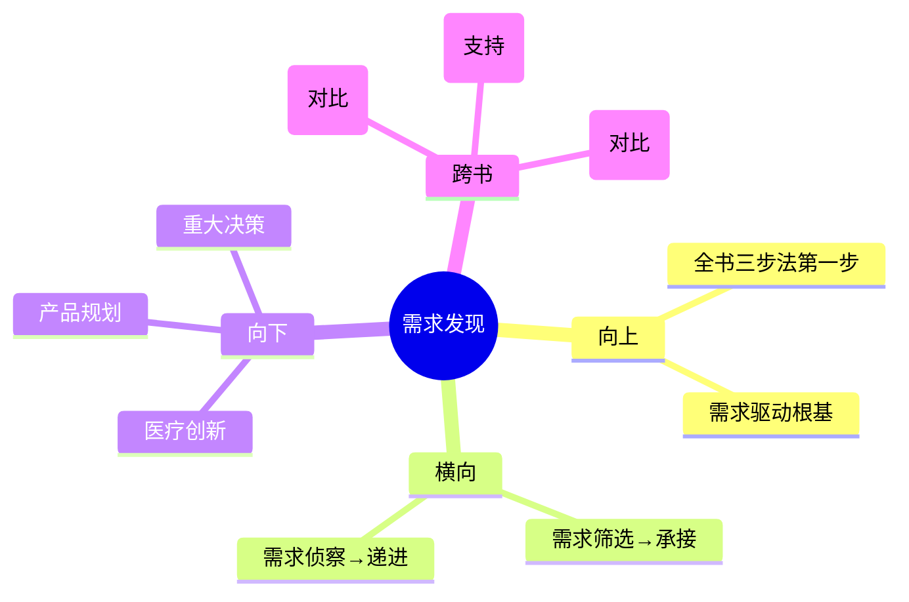

# 第2章 Identify - 需求发现（Need Finding）

## 📍 章节定位

### 全书位置
> 本章是全书开篇定位，回答"如何发现真正值得解决的医疗需求"，为后续Invent和Implement阶段奠定基础。

- **全书核心问题**: 为什么95%的医疗创新想法最终夭折？如何系统性提高落地率？
- **本章回答的问题**: 创新团队怎样才能找到"值得做"的需求，而不是"听起来有趣"的需求？
- **角色类型**: 核心概念型
- **论证位置**: 全书三步法（Identify→Invent→Implement）的第一步，方向错了后面全白费

### 章节序列
| 方向 | 章节标题 | 逻辑连接 |
|------|----------|----------|
| 前章 | 无（全书第一部分开篇） | 开篇 |
| 后章 | 需求筛选（Need Screening） | 承接：发现需求后如何筛选 |

### 一句话定位
> 本章是全书三步法的第一步，回答"如何从临床观察中发现高价值需求"，确立了Biodesign方法论的根基——需求驱动而非技术驱动。

---

## 🎯 核心观点

### 第一层：表层案例

| 案例名称 | 简要描述 | 关键引文 |
|----------|----------|----------|
| 心导管室观察 | 研究员连续数周坐在手术室角落，不带任何技术方案，只记录医生的抱怨和低效操作 | "好的需求陈述是创新过程中最重要的一份文档" |
| EndoVascular创始人故事 | Paul Yock通过观察传统血管手术，发现腔内替代方案的机会 | "你发现的第一个需求几乎从不是最好的需求" |
| 300→1筛选漏斗 | Fellow每年发现300-500个临床需求，最终只选1-2个深入研究 | 筛选标准：临床价值、商业潜力、技术可行性、竞争格局 |

### 第二层：中层机制

| 机制名称 | 组成要素 | 因果链条 | 证据来源 |
|----------|----------|----------|----------|
| 需求驱动发现机制 | 临床观察→需求记录→标准化陈述 | 沉浸式观察 → 发现真实痛点 → 精准定义问题 → 避免技术偏见 | 心导管室案例、筛选漏斗 |
| 需求陈述格式化机制 | 动作+人群+特征的三段式结构 | 标准化格式 → 所有人统一理解 → 不限制后续创意空间 | 需求陈述模板 |
| 直觉偏差纠正机制 | 量化评分卡替代个人偏好 | 多维度量化 → 强制客观评估 → 避免"这个想法听起来很酷"陷阱 | 评分卡打分流程 |

### 第三层：底层规律

| 规律陈述 | 抽象层级 | 知识连接 | 适用范围 |
|----------|----------|----------|----------|
| **问题定义定律**：创新成功率与问题定义的精度成正比，与解决方案的先进性无关 | 创新理论/系统论 | 精益创业（MVP前先定义问题）、系统之美（结构定义行为） | 所有创新领域，不限于医疗 |
| **信息先行定律**：创意的质量 = 信息输入质量 × 流程结构化程度 | 认知科学/创造力研究 | 创造力（Csikszentmihalyi）、[[思考快与慢]]（直觉偏差） | 头脑风暴、产品设计、战略规划 |
| **过滤放大定律**：创新不是"找到好想法"，而是"从大量噪音中过滤出信号" | 信息论/决策科学 | 香农信息论（信号与噪声）、贝叶斯决策理论 | 投资决策、人才选拔、战略规划 |

---

## 💬 降维翻译

### 观点1: 需求驱动发现机制

#### 原文表达
> "Biodesign的创新流程始于需要而非解决方案。团队通过沉浸式临床观察发现未被满足的医疗需求，并以标准化的需求陈述格式定义问题。"

#### 降维翻译（中学生能懂）
大多数人创新是从"我有个好技术"开始，然后到处找它能用在哪。Biodesign完全反过来——先去医院坐着看，看医生在手术中抱怨什么、哪里效率低、哪个环节经常出错。先把问题搞清楚，再想解决方案。

#### 日常类比（奶奶能懂）
就像修水管。你不会先买一把新扳手然后到处找能修的东西。你会先看哪里在漏水、漏得多严重、为什么漏，然后再决定用什么工具修。

#### 检验
- Q: 如果一个中学生问你"需求驱动"是什么意思？
- A: 就是先搞清楚问题是什么，再想怎么解决。很多人一上来就想解决方案，但其实连问题都没搞对。

### 观点2: 直觉偏差纠正机制

#### 原文表达
> "使用量化评分卡对需求进行系统性评估，避免个人直觉偏差影响决策质量。"

#### 降维翻译（中学生能懂）
人的直觉在判断"这个想法好不好"时经常出错——会高估技术可行性，低估审批难度。用打分卡强制给每个维度打分，靠数据不靠感觉。

#### 日常类比（奶奶能懂）
就像买菜，不能光看哪个颜色好看就买哪个。要看价格、新鲜度、营养、家里需不需要，每项都打个分，最后选总分最高的。

#### 检验
- Q: 为什么要用打分卡？
- A: 因为人的直觉会骗自己——觉得"这个想法很酷"就忽略了它可能根本做不出来或者卖不出去。

---

## ✨ 知识锚点

### 原书精华
| 锚点 | 记忆场景 |
|------|----------|
| "好的需求陈述是创新过程中最重要的一份文档" | 团队讨论"先做技术方案还是先定义问题"时 |
| "你发现的第一个需求几乎从不是最好的需求" | 自己急着确定方向、想停止探索时 |
| "需求驱动而非技术驱动" | 看到有人"拿着锤子找钉子"时 |

### 降维锚点
| 锚点 | 来源观点 | 记忆场景 |
|------|----------|----------|
| "先搞清楚问题，再想解决方案" | 需求驱动发现机制 | 任何需要做决策的场景 |
| "300个需求只选1个——不是找不到好想法，是好想法太多" | 筛选漏斗 | 需要"做减法"的场景 |
| "打分卡帮你抵御'这个想法听起来很酷'的诱惑" | 直觉偏差纠正 | 团队讨论中被情绪带动时 |

### 对比锚点
| 锚点 | 创作角度 | 记忆场景 |
|------|----------|----------|
| 普通人：有了方案找问题；Biodesign：找到问题再想方案 | 对比 | 反思自己是否"拿着锤子找钉子" |
| 精益创业：快速试错；Biodesign：先摸清再做 | 对比 | 讨论不同行业的创新策略时 |

---

## 🔗 当下映射

### 💰 财富应用
| 场景 | 具体行动 | 预期效果 | 风险提示 |
|------|----------|----------|----------|
| 投资决策 | 用需求筛选的逻辑评估创业项目：先看"解决什么问题"，再看"用什么技术" | 避免被"技术很酷但没市场"的项目忽悠 | 过度关注问题定义可能错过技术突破型机会 |

### 💼 职场应用
| 场景 | 具体行动 | 所需能力 | 适用职级 |
|------|----------|----------|----------|
| 产品规划 | 做产品前先做"需求发现周"——观察真实用户使用场景，记录所有痛点，用打分卡排序 | 用户观察、数据分析 | 产品经理/项目负责人 |
| 团队管理 | 用标准化"需求陈述"格式让团队成员对"要解决什么问题"有统一理解 | 沟通、结构化思维 | 所有管理层级 |

### 🏠 生活应用
| 场景 | 具体行动 | 可行性 | 见效时间 |
|------|----------|--------|----------|
| 重大决策（买房/换工作） | 先写"需求陈述"：我要什么（动作）+ 对谁（我自己/家庭）+ 关键特征（在什么条件下） | 高，立即开始 | 决策质量即时提升 |

### 72小时行动计划
1. 明天：回顾最近一次产品/项目决策，写下"需求陈述"格式的问题定义
2. 本周内：对团队现有的3个产品想法，用打分卡做一次量化评估
3. 需要准备资源：建立团队的需求评分卡模板（4个维度：用户价值、市场规模、可行性、竞争格局）

---

## 🕸️ 章节关联

### 向上关联 → 整书
- **贡献**: 确立Biodesign方法论的根基——需求驱动。如果这一步错了，后面Invent和Implement全是白费
- **位置**: 全书三步法的第一步，定义了"做什么"的方向

### 横向关联 → 章节间
| 章节编号 | 章节标题 | 关联类型 | 连接描述 |
|----------|----------|----------|----------|
| 第1章 | Biodesign概述 | 承接 | 本章是概述中Identify阶段的具体展开 |
| 需求筛选章 | Need Screening | 承接→递进 | 本章发现需求→下一章筛选需求 |
| 需求侦察章 | Need Scouting | 递进 | 本章定性发现→下一章定量调查 |

### 向下关联 → 具体应用
| 应用场景 | 难度 | 前置知识 |
|----------|------|----------|
| 医疗创新项目的需求发现 | 低 | 无 |
| 互联网产品的用户调研 | 中 | 基础用户研究方法 |
| 非营利组织的社会问题发现 | 低 | 无 |

### 跨书关联 → 知识网络
| 书籍 | 概念 | 关系 | 备注 |
|------|------|------|------|
| 精益创业-Eric Ries | MVP前先定义问题 | 对比 | 精益创业用MVP验证假设，Biodesign用观察发现问题 |
| 创新者的窘境-Clayton Christensen | Jobs-to-be-Done | 支持 | Christensen的JTBD理论与需求定义高度一致 |
| 从0到1-Peter Thiel | 秘密发现 | 对比 | Thiel靠天才直觉发现秘密，Biodesign靠系统观察发现问题 |

### 关联可视化

---

## ❓ 问答设计

### Q1: 需求驱动的"需求"指的是什么？
**认知层次**: 记忆
**难度**: 低
**答案要点**:
- 不是"用户想要什么"，而是"用户在做什么时遇到了什么困难"
- 是客观存在的痛点，不是用户主观表达的愿望
- 需要通过沉浸式观察发现，不是通过问卷调查获得

### Q2: 为什么需求定义中不能包含技术方案？
**认知层次**: 理解
**难度**: 中
**答案要点**:
- 包含技术方案会限制后续创意空间
- 需求定义回答"做什么"，技术方案回答"怎么做"
- 一旦技术方案进入需求定义，团队就不再探索其他可能
- 标准格式：动作+人群+特征，不包含工具/技术

### Q3: 直觉偏差在创新中具体表现为哪些？
**认知层次**: 分析
**难度**: 中
**答案要点**:
- 高估技术可行性（"这个技术我们能做出来"）
- 高估市场规模（"这个市场很大"）
- 低估监管成本（"审批很快就能搞定"）
- 低估报销难度（"医院肯定会买"）
- 量化评分卡强制纠正这些偏差

### Q4: 如何在非医疗领域应用"需求发现"方法？
**认知层次**: 应用
**难度**: 中
**答案要点**:
- 核心逻辑不变：沉浸式观察→记录痛点→标准化定义→量化筛选
- 替换场景：手术室→用户实际使用场景
- 替换评估维度：临床价值→用户价值；报销策略→商业模式
- 工具不变：打分卡、需求陈述模板

### Q5: 需求发现和头脑风暴的关系是什么？
**认知层次**: 分析
**难度**: 高
**答案要点**:
- 需求发现在前，头脑风暴在后
- 需求发现是"找钉子"，头脑风暴是"想锤子"
- 没有高质量的需求发现，头脑风暴就是闭门造车
- Biodesign要求：先做一周调研，再开一小时头脑风暴
- 信息输入质量决定了头脑风暴的输出质量

---

## ✅ 拆解质量自检

### 必检项
- [x] Frontmatter 格式正确
- [x] 章节定位一句话清晰
- [x] 三层提取完整（每层 >= 3个元素）
- [x] 所有核心观点有完整三层翻译
- [x] 知识锚点 >= 5条
- [x] 三大维度映射完整
- [x] 四向关联完整
- [x] 问答设计 >= 5个
- [x] 有72小时应用计划
- [x] 有Mermaid可视化
