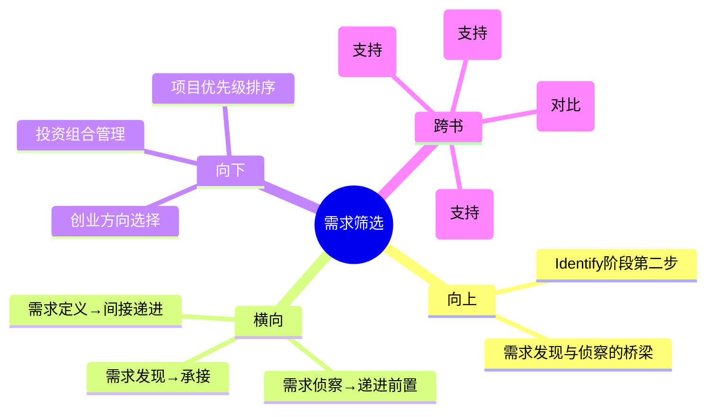

# 第3章 Identify - 需求筛选（Need Screening）

## 章节定位

### 全书位置
> 本章是Identify阶段的第二步，承接需求发现阶段的300-500个原始需求，回答"如何从海量需求中筛选出最值得投入的方向"。

- **全书核心问题**: 为什么95%的医疗创新想法最终夭折？如何系统性提高落地率？
- **本章回答的问题**: 面对300到500个临床需求，团队怎样用客观标准而不是个人偏好选出真正值得做的1到2个？
- **角色类型**: 方法论工具型
- **论证位置**: 全书三步法Identify阶段的第二环——发现需求之后、深入调查之前，是决定资源投向的关键闸门

### 章节序列
| 方向 | 章节标题 | 逻辑连接 |
|------|----------|----------|
| 前章 | 第2章 需求发现（Need Finding） | 前置：发现300-500个原始需求后需要筛选机制 |
| 后章 | 第4章 需求侦察（Need Scouting） | 承接：筛选出Top 10后进入深度调查 |

### 一句话定位
> 本章是需求管理的"粗滤器"，用量化评分卡将直觉决策转变为数据决策，确立"快速打分和深度调查必须分离"的核心定律。

---

## 核心观点

### 第一层：表层案例

| 案例名称 | 简要描述 | 关键引文 |
|----------|----------|----------|
| 斯坦福评分卡筛选 | Fellow对300-500个需求进行1-10分量化打分，最终筛出Top 10进入下一阶段 | "数据筛选定律：快速打分和深度调查必须分开执行" |
| 直觉偏差的代价 | 团队凭直觉选择"听起来很酷"的需求，最终因低估监管成本或高估技术可行性而失败 | 人的直觉系统性高估技术可行性和市场规模，低估监管成本和报销难度 |
| 强制客观评估 | 每个维度1-10分，不允许模糊评价，强制团队给出具体数值 | 评分维度：临床价值、商业潜力、技术可行性、竞争格局 |

### 第二层：中层机制

| 机制名称 | 组成要素 | 因果链条 | 证据来源 |
|----------|----------|----------|----------|
| 量化评分机制 | 四维评分卡+1-10分量表+强制排序 | 多维评分 → 消除单一偏好 → 产出可比排序 → 支撑理性决策 | 斯坦福筛选流程 |
| 直觉偏差识别机制 | 识别四种系统性偏差（高估技术/市场，低估监管/报销） | 认知偏差识别 → 评分权重校准 → 降低系统性误判 | 偏差模式总结 |
| 步骤分离机制 | 需求筛选（快速打分）与需求侦察（深度调查）严格分离 | 筛选阶段快速过滤 → 侦察阶段深度验证 → 避免混淆两种判断模式 | 步骤独立设计 |

### 第三层：底层规律

| 规律陈述 | 抽象层级 | 知识连接 | 适用范围 |
|----------|----------|----------|----------|
| **数据筛选定律**：创新决策的质量取决于筛选流程的独立性——快速打分和深度调查必须分开执行，否则直觉偏差会污染整个流程 | 决策科学/认知心理学 | 《思考，快与慢》（系统1与系统2）、贝叶斯决策理论 | 投资决策、人才筛选、项目优先级排序 |
| **偏差对称定律**：人在评估机会时存在对称性偏差——高估有利面（技术可行性、市场规模），低估不利面（监管成本、报销难度），这种偏差在所有受监管行业都成立 | 行为经济学/认知偏差研究 | 丹尼尔卡尼曼乐观偏差、规划谬误（Planning Fallacy） | 创业评估、政策制定、个人重大决策 |
| **粗滤精滤定律**：任何复杂的筛选问题都需要两个阶段的过滤器——第一阶段追求覆盖率和速度（粗滤），第二阶段追求准确率和深度（精滤），混淆两者会导致效率和质量同时下降 | 信息论/系统工程 | 信号处理中的粗筛与精筛、机器学习中的候选生成与精排 | 搜索引擎、推荐系统、战略规划 |

---

## 降维翻译

### 观点1: 量化评分机制

#### 原文表达
> "使用结构化评分卡对每个需求进行多维度量化评估，每个维度1-10分，最终产出可比排序。"

#### 认知转变
从"这个想法听起来很好"到"这个想法在四个维度上各得几分"——用数字取代感受，让比较成为可能。

#### 降维翻译（中学生能懂）
面对300多个想法，你不可能每个都深入研究。Biodesign的做法是给每个想法从四个角度打分：它解决了多大的临床问题？能赚多少钱？技术上能不能做出来？有没有人在做竞争对手？每个角度1到10分，加总分排序。听起来不浪漫，但比凭感觉靠谱得多。

#### 日常类比（奶奶能懂）
就像相亲，不能光看"感觉对不对"。要看对方的人品、经济条件、性格合不合、家庭关系，每项都打个分。不是说要冷冰冰地算分，而是防止你因为"他笑起来很好看"就忽略了其他重要的东西。

#### 检验
- Q: 为什么要用数字打分而不是讨论？
- A: 因为讨论容易被最会说话的人主导，而且人的感受会骗自己。打分卡强制每个人面对同样的标准。

### 观点2: 直觉偏差识别机制

#### 原文表达
> "人的直觉在评估创新机会时系统性地高估技术可行性和市场规模，低估监管成本和报销难度。"

#### 认知转变
从"我相信自己的判断"到"我知道我的判断有特定方向的偏差"——不是否定直觉，而是理解它的系统性偏差模式并加以纠正。

#### 降维翻译（中学生能懂）
当你听到一个好想法时，你的大脑会自动让它听起来比实际更好。你会想"技术上肯定能做出来"（实际很难）、"市场肯定很大"（实际很小），同时忽略"审批要花两年"和"医院不一定愿意买单"。Biodesign的评分卡就是强制你把这四件事都想清楚再打分。

#### 日常类比（奶奶能懂）
就像你逛街看到一件衣服打折，脑子里会想"好便宜啊一定要买"，但不会想"我家里有类似的三件"和"买回去可能一次都不穿"。评分卡就是提醒你把这些也想进去。

#### 检验
- Q: 四种偏差具体指什么？
- A: 高估技术可行性（觉得能做出来其实很难）、高估市场规模（觉得很大其实很小）、低估监管成本（觉得很快其实很慢）、低估报销难度（觉得好卖其实很难卖）。

### 观点3: 步骤分离机制

#### 原文表达
> "需求筛选和需求侦察是两个完全独立的步骤，不能混在一起执行。"

#### 认知转变
从"筛选和调查是一回事"到"快速过滤和深度验证必须分离"——混淆两种判断模式会导致在错误方向上浪费资源或在正确方向上犹豫不决。

#### 降维翻译（中学生能懂）
筛选是"快速看一眼哪些明显不行"，侦察是"对剩下的做深度调查"。很多人把这两步混在一起——要么在明显不行的想法上花了太多时间研究，要么因为调查不够深而错过了好机会。Biodesyn要求这两步完全分开：先用评分卡快速筛出Top 10，然后只对这10个做深入调查。

#### 日常类比（奶奶能懂）
就像选学校。第一步是看分数够不够、学费能不能承受，先把明显不行的排除掉。第二步才是去校园看看、找学长聊聊、了解专业怎么样。如果你第一步就去每所学校参观，时间根本不够用；如果你第一步排除了但第二步不深入看，可能会选错。

#### 检验
- Q: 为什么不能把筛选和调查混在一起？
- A: 因为两者的目的完全不同——筛选追求速度（快速排除），调查追求深度（深入了解）。混在一起会导致既不够快也不够深。

---

## 知识锚点

### 原书精华
| 锚点 | 记忆场景 |
|------|----------|
| "快速打分和深度调查必须分开执行" | 团队在"这个要不要深入研究"上争论不休时 |
| "人的直觉系统性地高估技术可行性和市场规模" | 自己对某个项目产生"一定能成"的直觉时 |
| "评分卡强制客观评估，每个维度1-10分" | 需要量化决策但团队只有定性讨论时 |
| "300-500个需求最终只留下Top 10" | 觉得"好想法太少"而不是"好想法太多"时 |

### 降维锚点
| 锚点 | 来源观点 | 记忆场景 |
|------|----------|----------|
| "用数字取代感受，让比较成为可能" | 量化评分机制 | 需要在多个选项中做选择时 |
| "警惕四种偏差：高估好的，低估难的" | 直觉偏差识别机制 | 评估任何新项目或投资机会时 |
| "先粗筛再精滤，顺序不能颠倒" | 步骤分离机制 | 任何多阶段决策流程 |
| "好想法不值钱，筛选好想法的流程才值钱" | 数据筛选定律 | 团队讨论"哪个想法更好"时 |

### 对比锚点
| 锚点 | 创作角度 | 记忆场景 |
|------|----------|----------|
| 普通人：拍脑袋选；Biodesign：打分卡选 | 对比 | 反思自己的决策流程是否太随意 |
| 筛选阶段：求快不求准；侦察阶段：求准不求快 | 对比 | 设计任何多阶段决策流程时 |
| 直觉偏差：所有人都中招，承认它才能纠正它 | 认知偏差 | 自己做乐观判断时自我提醒 |

---

## 当下映射

### 财富应用
| 场景 | 具体行动 | 预期效果 | 风险提示 |
|------|----------|----------|----------|
| 股票/基金投资 | 建立四维评分卡：行业空间、竞争优势、估值合理性、风险因素，每只候选标的1-10分 | 避免因为"这只股票听起来很厉害"而忽视基本面 | 评分维度需要根据投资风格调整 |
| 创业方向选择 | 用Biodesign评分逻辑评估2-3个创业方向：用户痛点程度、市场规模、执行难度、竞争格局 | 用系统方法替代"我觉得这个方向好" | 评分只是工具，最终需要深度验证 |
| 房产投资决策 | 对候选房产按地段、增值潜力、租售比、持有成本四维打分 | 减少因情感偏好导致的非理性购房 | 评分需要基于真实数据而非估计 |

### 职场应用
| 场景 | 具体行动 | 所需能力 | 适用职级 |
|------|----------|----------|----------|
| 项目优先级排序 | 对团队待选项目用评分卡排序，替代"谁的声音大听谁的" | 数据分析、结构化思维 | 项目经理/部门负责人 |
| 人才招聘 | 对候选人在核心能力维度上1-10分打分，避免"这个候选人感觉很好"的模糊判断 | 评估标准制定能力 | 所有面试官 |
| 供应商选择 | 用多维度评分卡替代最低价中标 | 成本分析、风险评估 | 采购/供应链 |

### 生活应用
| 场景 | 具体行动 | 可行性 | 见效时间 |
|------|----------|--------|----------|
| 重大消费决策 | 对大额消费按需求程度、性价比、替代方案、长期价值四维打分 | 高，立即开始 | 下次大额消费时 |
| 职业规划 | 对2-3个职业方向用评分卡评估：成长空间、个人匹配度、收入潜力、转型成本 | 高 | 1-2周内 |
| 教育资源选择 | 对学校/课程按教学质量、成本、时间投入、长期回报打分 | 高 | 下次做教育决策时 |

### 72小时行动计划
1. 今天：回顾当前正在考虑的2-3个重要决策，识别自己是否存在"高估有利面、低估不利面"的偏差
2. 明天：为团队的项目选择建立一个四维评分卡模板，对现有候选项目做一次量化打分
3. 本周内：检查自己最近的决策流程，确认"快速筛选"和"深度调查"是否有明确的分界

---

## 章节关联

### 向上关联 → 整书
- **贡献**: 为Identify阶段提供"从海量到精选"的过滤机制，是需求发现和需求侦察之间的关键桥梁
- **位置**: 全书三步法Identify阶段的第二步——没有有效筛选，再好的需求发现也会被淹没；没有有效筛选，后续侦察资源会被浪费

### 横向关联 → 章节间
| 章节编号 | 章节标题 | 关联类型 | 连接描述 |
|----------|----------|----------|----------|
| 第2章 | 需求发现（Need Finding） | 承接 | 第2章产出300-500个原始需求 → 本章提供筛选机制将其压缩到Top 10 |
| 第4章 | 需求侦察（Need Scouting） | 递进→前置 | 本章输出Top 10 → 第4章对这10个做深度调查，筛选质量直接决定侦察效率 |
| 第5章 | 需求定义（Need Specification） | 间接递进 | 筛选和侦察最终选出的1-2个需求 → 第5章将其标准化为需求陈述 |

### 向下关联 → 具体应用
| 应用场景 | 难度 | 前置知识 |
|----------|------|----------|
| 创业方向筛选 | 低 | 无，直接可用评分卡模板 |
| 投资组合管理 | 中 | 基础投资知识 |
| 个人重大决策 | 低 | 无 |
| 产品功能优先级 | 中 | 产品管理基础 |

### 跨书关联 → 知识网络
| 书籍 | 概念 | 关系 | 备注 |
|------|------|------|------|
| 思考快与慢-丹尼尔卡尼曼 | 系统1与系统2 | 支持 | 卡尼曼的直觉偏差理论为Biodesign的量化筛选提供认知科学基础 |
| 精益创业-Eric Ries | 假设验证 | 对比 | 精益创业用MVP快速验证，Biodesign用评分卡预先筛选——两种降低失败率的策略 |
| 原则-Ray Dalio | 决策系统化 | 支持 | Dalio的"用公式做决策"与Biodesign评分卡逻辑一致 |
| 穷查理宝典-芒格 | 多元思维模型 | 支持 | 评分卡的四个维度本质上是四个思维模型的综合应用 |

### 关联可视化

---

## 问答设计

### Q1: 需求筛选的四个评分维度是什么？
**认知层次**: 记忆
**难度**: 低
**答案要点**:
- 临床价值：影响的患者数量、现有方案的差距、改善空间
- 商业潜力：市场规模、付费方、收入模式
- 技术可行性：以当前技术水平解决问题的难度
- 竞争格局：现有竞争者、专利壁垒、进入门槛
- 每个维度1-10分，总分排序

### Q2: 人的直觉在评估创新机会时有哪些系统性偏差？
**认知层次**: 理解
**难度**: 中
**答案要点**:
- 高估技术可行性——"这个技术我们肯定能做出来"
- 高估市场规模——"这个市场非常大"
- 低估监管成本——"审批很快就能搞定"
- 低估报销难度——"医院/医保肯定会买单"
- 这些偏差源于人的乐观倾向和确认偏误

### Q3: 为什么快速打分和深度调查必须分开执行？
**认知层次**: 分析
**难度**: 高
**答案要点**:
- 两者的目标不同：筛选追求速度（覆盖300-500个需求），侦察追求深度（深入10个需求）
- 混在一起会导致：在明显不行的想法上浪费调研时间，或者因为调研不够深入而错过好机会
- 分开执行保证了两个阶段各自优化自己的目标函数
- 这本质上是"粗滤"和"精滤"的分离，在信息论和系统工程中是通用原则

### Q4: 如何在非医疗领域应用需求筛选的评分卡方法？
**认知层次**: 应用
**难度**: 中
**答案要点**:
- 核心逻辑不变：多维评分 → 量化比较 → 排序筛选
- 替换维度：临床价值 → 用户价值/社会价值；商业潜力 → 经济回报；技术可行性 → 执行难度；竞争格局 → 竞争程度
- 关键原则：评分标准必须在接触具体信息之前确定，否则直觉偏差会污染打分过程
- 适用场景：创业方向选择、投资决策、项目优先级排序

### Q5: 如果团队成员对同一个维度的打分差异很大，怎么处理？
**认知层次**: 分析
**难度**: 高
**答案要点**:
- 差异本身是价值——它暴露了团队成员掌握的信息不同
- 处理方法：先让每个人解释打分依据，补充缺失信息，然后重新打分
- 如果仍有差异，取平均值或中位数
- 重要的是强制每个人给出具体分数，而不是停留在"我觉得还可以"的模糊讨论
- 这个讨论过程本身就是团队对齐认知的过程

---

## 拆解质量自检

### 必检项
- [x] Frontmatter 格式正确
- [x] 章节定位一句话清晰
- [x] 三层提取完整（每层 >= 3个元素）
- [x] 所有核心观点有完整三层翻译和认知转变
- [x] 知识锚点 >= 8条
- [x] 三大维度映射完整
- [x] 四向关联完整
- [x] 问答设计 >= 5个
- [x] 有72小时应用计划
- [x] 有Mermaid可视化
- [x] links包含主拆解记录
- [x] tags使用层级格式
- [x] 与第2章建立横向关联
- [x] 与第4章建立递进关联
- [x] 每个观点有认知转变描述
- [x] 无Emoji符号
