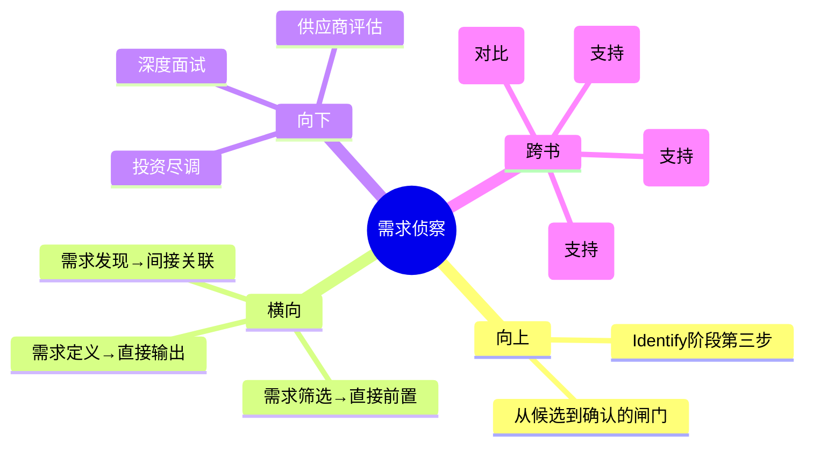

# 第4章 Identify - 需求侦察（Need Scouting）

## 章节定位

### 全书位置
> 本章是Identify阶段的第三步，承接需求筛选产出的Top 10需求，回答"如何对候选需求进行深度验证以确保最终选择的质量"。

- **全书核心问题**: 为什么95%的医疗创新想法最终夭折？如何系统性提高落地率？
- **本章回答的问题**: 筛选出的10个候选需求，怎样通过深度调查（专利检索、专家访谈、竞品分析、成本估算）选出最终的1-2个？
- **角色类型**: 方法论执行型
- **论证位置**: 全书三步法Identify阶段的第三环——从"快速过滤"转向"深度验证"，侦察深度直接决定最终选择的质量

### 章节序列
| 方向 | 章节标题 | 逻辑连接 |
|------|----------|----------|
| 前章 | 第3章 需求筛选（Need Screening） | 前置：第3章产出Top 10，本章对这10个做深度调查 |
| 后章 | 第5章 需求定义（Need Specification） | 承接：侦察验证后最终选出的1-2个需求进入标准化定义 |

### 一句话定位
> 本章是需求管理的"精滤器"，完成从"快速过滤"到"深度验证"的范式转换，确立侦察深度决定最终选择质量的核心规律。

---

## 核心观点

### 第一层：表层案例

| 案例名称 | 简要描述 | 关键引文 |
|----------|----------|----------|
| 专利检索排查 | 对每个候选需求进行系统专利检索，确认是否存在专利壁垒或可规避空间 | 专利壁垒高度是竞争格局评估的核心维度 |
| 专家深度访谈 | 访谈临床专家、行业从业者、监管人员，验证需求的真实性和市场可行性 | 侦察不是看论文，而是找真正在这个领域干活的人聊 |
| 竞品成本分析 | 分析现有竞品的定价、成本结构、市场份额，估算新进入者的盈利空间 | 侦察深度决定最终选择的质量 |

### 第二层：中层机制

| 机制名称 | 组成要素 | 因果链条 | 证据来源 |
|----------|----------|----------|----------|
| 深度调查机制 | 专利检索+专家访谈+竞品分析+成本估算 | 多维深度调查 → 暴露隐藏风险 → 淘汰伪需求 → 确认真需求 | 侦察四件套 |
| 范式转换机制 | 从筛选阶段的"快速覆盖"转向侦察阶段的"深度验证" | 筛选重速度（300→10） → 侦察重深度（10→1-2） → 两种模式切换决定决策质量 | 步骤独立设计 |
| 信息验证机制 | 用一手信息（专家访谈）验证二手信息（文献/报告），用硬数据（专利/财务）验证软判断 | 二手信息 → 一手验证 → 硬数据校准 → 形成可靠判断 | 侦察方法论 |

### 第三层：底层规律

| 规律陈述 | 抽象层级 | 知识连接 | 适用范围 |
|----------|----------|----------|----------|
| **侦察深度定律**：最终选择的质量不取决于候选数量，取决于对每个候选的调查深度——10个需求每个花100小时深度调查，优于100个需求每个花10小时浅层调查 | 决策质量理论 | 格雷沙姆定律（劣币驱逐良币的反面——深度驱逐浅度）、《信号与噪声》 | 投资尽调、人才深度面试、战略决策 |
| **范式转换定律**：决策流程中不同阶段需要不同的认知模式——筛选阶段追求速度和覆盖率，侦察阶段追求准确性和深度，成功切换是高质量决策的关键 | 认知科学/决策理论 | 双过程理论（系统1与系统2）、探索与利用权衡 | 任何多阶段决策流程 |
| **信息层级定律**：信息可靠性分为三层——二手信息（报告/文献）提供方向、一手信息（访谈/观察）验证判断、硬数据（专利/财务数据）提供约束，高质量决策必须跨越三个层级 | 信息科学/认识论 | 证据层级（Evidence Hierarchy）、三角验证法 | 投资研究、新闻调查、学术综述 |

---

## 降维翻译

### 观点1: 深度调查机制

#### 原文表达
> "对筛选出的候选需求进行专利检索、专家访谈、竞品分析和成本估算的系统性深度调查。"

#### 认知转变
从"这个需求看起来不错"到"我查了专利、问了专家、分析了竞品、算了成本——现在我知道它为什么不错或不行了"——用系统调查替代表面判断。

#### 降维翻译（中学生能懂）
筛选阶段你已经把300个需求缩小到了10个。接下来不是随便选一个就开干，而是对这10个逐个做深度调查：查专利看有没有人在做、找这个行业里真正干活的人聊、分析现有竞争者的产品怎么样、估算如果做出来要花多少钱。这比筛选阶段花的时间多得多，但正是这些深度调查决定了你最终选的对不对。

#### 日常类比（奶奶能懂）
就像选结婚对象。相亲筛选阶段你看照片、看基本信息，从100个人里选出10个觉得还行的。接下来不是直接结婚，而是和这10个人逐个深入了解——看他的朋友圈、了解他的家庭、知道他真实的生活习惯。这一步花的时间比筛选阶段长得多，但正是这一步决定了你最终选的人对不对。

#### 检验
- Q: 侦察阶段和筛选阶段最大区别是什么？
- A: 筛选是"快速看一眼排除不行的"，侦察是"深入了解每一个，直到能做出可靠判断"。筛选像相亲看照片，侦察像深入了解一个人。

### 观点2: 范式转换机制

#### 原文表达
> "需求侦察与需求筛选是独立步骤，必须完成从快速过滤到深度验证的范式转换。"

#### 认知转变
从"筛选和侦察都是调查"到"这是两种完全不同的认知模式"——切换认知模式的能力比调查技能本身更重要。

#### 降维翻译（中学生能懂）
筛选阶段你追求的是速度——300个需求每个可能只看5分钟就打完了分。到了侦察阶段，你必须切换到完全不同的模式——每个需求可能要花几十个小时，查专利、访谈专家、分析数据。这两种模式不能混着用。用筛选的速度做侦察，调查就不够深；用侦察的深度做筛选，时间根本不够用。

#### 日常类比（奶奶能懂）
就像淘金。筛选阶段你用大筛子在河沙里筛，把明显不是金子的石头扔掉，这个动作要快。侦察阶段你用放大镜仔细看剩下的那些"可能是金子的"颗粒，这个动作要慢。你用筛沙子的速度去看金子，会看走眼；你用看金子的速度去筛沙子，一辈子筛不完。

#### 检验
- Q: 为什么不能用同一种方式做筛选和侦察？
- A: 因为两者的目标完全矛盾——一个要快（覆盖大量），一个要深（深入了解）。用同一种方式做两件事，两件事都做不好。

### 观点3: 信息层级定律

#### 原文表达
> "高质量侦察必须跨越二手信息、一手信息和硬数据三个层级，用硬数据校准判断。"

#### 认知转变
从"看几篇报告就够了"到"必须用一手访谈验证报告，用硬数据校准判断"——信息的层级决定了判断的可靠度。

#### 降维翻译（中学生能懂）
调查一个需求时，你不能只看论文和行业报告（二手信息），还要找到真正在这个领域工作的人聊（一手信息），更要查专利数据、财务数据、临床数据（硬数据）。报告告诉你"大概方向"，专家告诉你"真实情况"，数据告诉你"客观约束"。只靠报告做判断，就像只看菜单不看菜的质量。

#### 日常类比（奶奶能懂）
就像买二手房。你看中介的介绍（二手信息），然后去实地看房、跟邻居聊（一手信息），再查房屋产权、建筑质量检测报告（硬数据）。只看中介介绍就买房，大概率会后悔。

#### 检验
- Q: 三种信息各有什么作用？
- A: 二手信息帮你快速了解方向，一手信息告诉你真实情况（经常和报告写的不一样），硬数据提供客观约束（专利有没有、成本能不能覆盖）。

---

## 知识锚点

### 原书精华
| 锚点 | 记忆场景 |
|------|----------|
| "侦察深度决定最终选择的质量" | 团队急于从候选中做选择时 |
| "从快速过滤转向深度验证" | 反思自己是否在同一个模式里做所有决策时 |
| "专利检索、专家访谈、竞品分析、成本估算——侦察四件套" | 需要深度调查任何商业机会时 |
| "不要只看报告，去找真正干活的人聊" | 做研究只查资料不做访谈时 |

### 降维锚点
| 锚点 | 来源观点 | 记忆场景 |
|------|----------|----------|
| "10个需求每个花100小时，优于100个需求每个花10小时" | 侦察深度定律 | 在"多而浅"和"少而深"之间做选择时 |
| "筛选像淘沙，侦察像验金——工具不同、速度不同、标准不同" | 范式转换定律 | 设计多阶段决策流程时 |
| "二手信息给方向，一手信息验真伪，硬数据定约束" | 信息层级定律 | 做任何调查研究时 |
| "报告说的好听不算数，专家说的真实情况算数，硬数据的客观事实才算数" | 信息验证机制 | 评估商业计划或投资标的时 |

### 对比锚点
| 锚点 | 创作角度 | 记忆场景 |
|------|----------|----------|
| 筛选：300→10，每个5分钟；侦察：10→1-2，每个50小时 | 对比 | 理解两种模式的资源投入差异 |
| 普通人：看了报告就做判断；Biodesign：报告+访谈+数据三角验证 | 对比 | 反思自己的信息收集是否太单薄 |
| 侦察阶段发现"这个需求其实是伪需求" = 成功，不是失败 | 认知转变 | 团队因排除一个需求而沮丧时 |

---

## 当下映射

### 财富应用
| 场景 | 具体行动 | 预期效果 | 风险提示 |
|------|----------|----------|----------|
| 股票深度尽调 | 对筛选出的候选标的：查财报（硬数据）、调研行业从业者（一手信息）、读研报（二手信息） | 避免因为"研报说好"就买入，用三角验证提高判断可靠度 | 尽调需要时间，不适合短线交易 |
| 加盟/创业投资 | 对候选项目：实地走访现有加盟商、查品牌方财务数据、分析竞品表现 | 避免被招商PPT忽悠，发现隐藏风险 | 需要投入调研时间，但远低于投资损失 |
| 房地产投资 | 对候选物业：查产权和法律文件、实地多次考察不同时段、调研周边租售市场 | 避免因为"中介说好"就做决策 | 需要专业辅助（律师、评估师） |

### 职场应用
| 场景 | 具体行动 | 所需能力 | 适用职级 |
|------|----------|----------|----------|
| 关键岗位面试 | 对终选候选人：深度背景调查、实际任务测试、多轮不同维度面试 | 面试设计、信息验证能力 | HR/部门负责人 |
| 供应商评估 | 对候选供应商：实地考察工厂、查资质证书、访谈现有客户、对比竞品供应商 | 供应链管理、风险评估 | 采购/供应链 |
| 合作伙伴选择 | 对候选合作伙伴：查商业信誉、了解团队真实能力、评估资源互补性 | 商务尽调能力 | 创始人/业务负责人 |

### 生活应用
| 场景 | 具体行动 | 可行性 | 见效时间 |
|------|----------|--------|----------|
| 重大医疗决策 | 对治疗方案：查临床指南（二手）、找主治医生深度沟通（一手）、看疗效统计数据（硬数据） | 高 | 下次面临医疗决策时 |
| 教育机构选择 | 对候选机构：实地听课、和在读学员聊、查师资和升学数据 | 高 | 下次做教育决策时 |
| 重大消费决策 | 对高价商品：查评测报告、找真实用户聊、看客观测试数据 | 高 | 下次大额消费时 |

### 72小时行动计划
1. 今天：回顾最近一次重要决策，评估当时使用的信息层级——是否只用了一手或二手信息，缺少硬数据验证
2. 明天：对当前正在考虑的1-2个重要选项，建立"侦察四件套"检查清单（专利/数据检索、专家访谈、竞品分析、成本估算）
3. 本周内：实践一次范式切换——先快速列出所有选项（筛选模式），然后对Top 3逐一做深度调查（侦察模式），记录两种模式的切换体验

---

## 章节关联

### 向上关联 → 整书
- **贡献**: 为Identify阶段提供"从精选到确认"的验证机制，是从候选需求到最终选择的最后一道闸门
- **位置**: 全书三步法Identify阶段的第三步——侦察质量决定了进入Invent阶段的需求质量，需求质量决定了整个创新项目的天花板

### 横向关联 → 章节间
| 章节编号 | 章节标题 | 关联类型 | 连接描述 |
|----------|----------|----------|----------|
| 第2章 | 需求发现（Need Finding） | 间接关联 | 第2章发现的原始需求质量决定了第4章侦察的起点质量——垃圾进、垃圾出 |
| 第3章 | 需求筛选（Need Screening） | 直接前置 | 第3章输出Top 10 → 第4章对这10个做深度调查，筛选的准确度直接决定侦察的效率 |
| 第5章 | 需求定义（Need Specification） | 直接输出 | 第4章最终确认的1-2个需求 → 第5章将其标准化为不含技术方案的需求陈述 |

### 向下关联 → 具体应用
| 应用场景 | 难度 | 前置知识 |
|----------|------|----------|
| 投资项目尽调 | 中 | 基础财务分析 |
| 关键人才深度面试 | 低 | 面试方法基础 |
| 供应商深度评估 | 中 | 供应链管理基础 |
| 个人重大决策验证 | 低 | 无 |

### 跨书关联 → 知识网络
| 书籍 | 概念 | 关系 | 备注 |
|------|------|------|------|
| 信号与噪声-Nate Silver | 预测与验证 | 支持 | Silver强调用硬数据验证预测，与Biodesign的信息层级定律一致 |
| 原则-Ray Dalio | 极致透明与深度了解 | 支持 | Dalio的"了解人要通过深度互动和观察"与专家访谈方法论一致 |
| 思考快与慢-丹尼尔卡尼曼 | 系统2的深度思考 | 支持 | 侦察阶段本质上是系统2的全面启动 |
| 精益创业-Eric Ries | 客户开发访谈 | 对比 | 精益创业的客户访谈用于验证假设，Biodesign的专家访谈用于发现真实约束 |

### 关联可视化

---

## 问答设计

### Q1: 需求侦察的"四件套"是什么？
**认知层次**: 记忆
**难度**: 低
**答案要点**:
- 专利检索：确认是否存在专利壁垒或可规避空间
- 专家访谈：访谈临床专家、行业从业者、监管人员验证需求真实性
- 竞品分析：分析现有竞品的定价、成本结构、市场份额
- 成本估算：估算新进入者的研发、生产、市场准入成本

### Q2: 需求筛选和需求侦察的本质区别是什么？
**认知层次**: 理解
**难度**: 中
**答案要点**:
- 目标不同：筛选追求速度和覆盖率（300→10），侦察追求准确性和深度（10→1-2）
- 方法不同：筛选用量化评分卡快速打分，侦察用专利检索、专家访谈等深度调查
- 资源投入不同：筛选每个需求几分钟，侦察每个需求几十小时
- 认知模式不同：筛选是模式识别（快速判断），侦察是深度分析（系统思考）

### Q3: 为什么侦察阶段发现"这个需求其实是伪需求"是成功而不是失败？
**认知层次**: 分析
**难度**: 高
**答案要点**:
- 侦察的目的就是排除伪需求——排除本身就是价值
- 在投入研发资源之前排除错误方向，节省的成本远大于侦察的投入
- 一个伪需求被排除，意味着资源可以集中到真正值得做的需求上
- 侦察阶段排除的每一个伪需求，都提高了最终选择的胜率

### Q4: 如何为非医疗领域的商业机会设计"侦察四件套"？
**认知层次**: 应用
**难度**: 中
**答案要点**:
- 专利检索 → 知识产权/壁垒检索（专利、商标、版权、行业准入资质）
- 专家访谈 → 行业从业者/客户/供应商深度访谈
- 竞品分析 → 市场竞品对比分析（产品、定价、市场份额、用户评价）
- 成本估算 → 进入成本估算（研发、生产、营销、渠道、合规）
- 核心原则不变：二手信息→一手信息→硬数据的三角验证

### Q5: 如果侦察后发现多个需求都很有价值，但资源只够做一个，怎么最终决策？
**认知层次**: 分析
**难度**: 高
**答案要点**:
- 回到第3章的评分卡，用侦察阶段收集的深度数据更新评分
- 引入额外决策维度：团队能力匹配度、时间窗口紧迫性、战略协同性
- 考虑"组合决策"——两个需求是否可以共享资源或分阶段执行
- 最终决策不应回到直觉，而应基于更新后的量化分析
- 如果确实难以区分，选择侦察阶段暴露风险最少、最可控的那个

---

## 拆解质量自检

### 必检项
- [x] Frontmatter 格式正确
- [x] 章节定位一句话清晰
- [x] 三层提取完整（每层 >= 3个元素）
- [x] 所有核心观点有完整三层翻译和认知转变
- [x] 知识锚点 >= 8条
- [x] 三大维度映射完整
- [x] 四向关联完整
- [x] 问答设计 >= 5个
- [x] 有72小时应用计划
- [x] 有Mermaid可视化
- [x] links包含主拆解记录
- [x] tags使用层级格式
- [x] 与第3章建立直接前置关联
- [x] 与第5章建立直接输出关联
- [x] 每个观点有认知转变描述
- [x] 无Emoji符号
