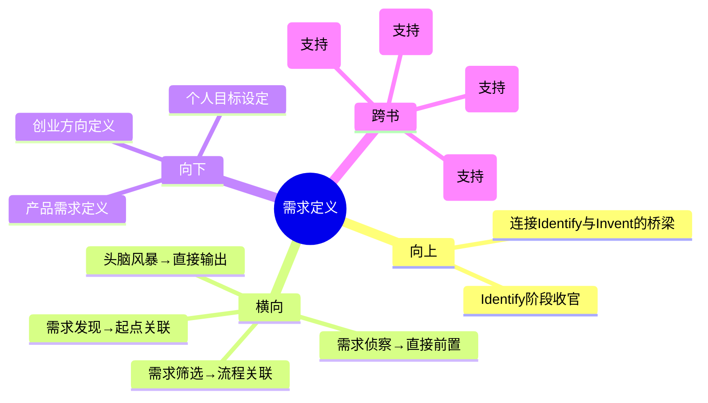

# 第5章 Identify - 需求定义（Need Specification）

## 章节定位

### 全书位置
> 本章是Identify阶段的最后一步，承接需求侦察确认的1-2个最终需求，回答"如何将验证过的需求转化为标准化的需求陈述，为后续Invent阶段奠定基础"。

- **全书核心问题**: 为什么95%的医疗创新想法最终夭折？如何系统性提高落地率？
- **本章回答的问题**: 经过深度调查确认的需求，怎样写成一份能让整个团队统一理解、又不限制后续创意空间的标准化文档？
- **角色类型**: 核心概念型
- **论证位置**: 全书三步法Identify阶段的收官之作——需求定义的质量直接决定了后续发明阶段的方向正确性和创意空间

### 章节序列
| 方向 | 章节标题 | 逻辑连接 |
|------|----------|----------|
| 前章 | 第4章 需求侦察（Need Scouting） | 前置：侦察验证后最终确认的1-2个需求进入标准化定义 |
| 后章 | 头脑风暴（Brainstorming，Invent阶段） | 承接：标准化需求陈述是头脑风暴的唯一输入 |

### 一句话定位
> 本章是Identify阶段的收官环节，将验证过的需求转化为"动作+人群+特征"的标准化陈述，确立"好的需求陈述是创新过程中最重要的文档"的核心定律。

---

## 核心观点

### 第一层：表层案例

| 案例名称 | 简要描述 | 关键引文 |
|----------|----------|----------|
| 心律不齐消融导管 | 需求陈述"帮助医生在消融手术中更快更准确地定位导管"最终引导团队发明新型导管，被强生收购 | "好的需求陈述是创新过程中最重要的文档——它比商业计划书更重要" |
| 三段式需求陈述 | 标准化格式：动作（做什么）+ 目标人群（对谁做）+ 关键特征（在什么条件下做），禁止包含技术方案 | 需求定义中不能包含技术方案 |
| 问题与方案分离 | 需求陈述纯粹描述问题，不暗示任何解决方案，为后续头脑风暴保留最大创意空间 | 纯粹描述问题，不限制后续创意空间 |

### 第二层：中层机制

| 机制名称 | 组成要素 | 因果链条 | 证据来源 |
|----------|----------|----------|----------|
| 需求陈述格式化机制 | 三段式结构（动作+人群+特征）+ 禁止技术方案约束 | 标准化格式 → 所有人统一理解 → 不预设方案 → 保留创意空间 | 需求陈述模板 |
| 问题方案分离机制 | 需求定义阶段与方案生成阶段严格分离 | 先定义"做什么" → 再想"怎么做" → 避免过早锁定方案 → 发现更优解 | 心律不齐案例 |
| 文档优先级机制 | 需求陈述的优先级高于商业计划书和技术方案 | 需求陈述是创新的起点 → 所有后续工作基于此 → 定义错误则后续全偏 | "比商业计划书更重要" |

### 第三层：底层规律

| 规律陈述 | 抽象层级 | 知识连接 | 适用范围 |
|----------|----------|----------|----------|
| **问题定义定律**：创新的成功率与问题定义的精度成正比，与技术方案的先进性无关。精确的问题定义是高质量创新的前提条件 | 创新理论/系统论 | 系统之美（结构定义行为）、精益创业（问题假设先于解决方案） | 所有创新领域 |
| **创意空间定律**：问题定义中对解决方案的任何约束都会指数级缩小后续创意空间。最开放的问题定义产生最丰富的创意集合 | 创造力研究/约束理论 | TRIZ理论（矛盾分离）、创造力（Csikszentmihalyi） | 产品设计、艺术创作、战略规划 |
| **文档优先级定律**：在创新流程中，定义问题的文档比描述方案的文档更重要，因为问题定义是方向性的，方案描述是执行性的——方向错了执行再好也没用 | 管理学/战略理论 | 好战略坏战略（诊断先于行动）、德鲁克（做正确的事vs正确地做事） | 项目管理、战略规划、组织变革 |

---

## 降维翻译

### 观点1: 需求陈述格式化机制

#### 原文表达
> "使用标准化的三段式需求陈述格式：动作（做什么）+ 目标人群（对谁做）+ 关键特征（在什么条件下做），需求定义中不应包含具体技术方案。"

#### 认知转变
从"我要做一个什么样的产品"到"我要帮谁在什么情况下解决什么问题"——把注意力从方案转移到问题本身。

#### 降维翻译（中学生能懂）
写需求陈述的时候，只说三件事：要做什么（动作）、对谁做（人群）、在什么条件下做（特征）。绝对不能说"用什么技术做"。比如不是"我要做一个电动牙刷"，而是"我要帮助成年人在刷牙时更有效地清除牙菌斑，在家中日常使用"。前者锁死了方案，后者给后续创意留了无限空间。

#### 日常类比（奶奶能懂）
就像告诉装修师傅你要什么。你不能说"我要买某某品牌的瓷砖贴在厨房"——那是方案。你应该说"我要让厨房的墙面容易擦洗，在做饭的时候"。师傅听到这个，可能会推荐瓷砖，也可能会推荐其他更好的材料。你只说你要什么效果，不说怎么做。

#### 检验
- Q: 为什么要禁止在需求陈述中包含技术方案？
- A: 因为一旦写了技术方案，团队就不再想其他可能了。需求陈述应该只说"做什么"，不说"怎么做"。

### 观点2: 问题方案分离机制

#### 原文表达
> "需求定义纯粹描述问题，不暗示任何解决方案，为后续创意保留最大空间。"

#### 认知转变
从"问题里天然带着方案"到"问题和方案必须严格分离"——问题定义的质量与方案开放性成正比。

#### 降维翻译（中学生能懂）
很多时候我们描述问题的方式已经把解决方案偷偷塞进去了。比如"我们的问题是缺少一个手机App"——这不是问题，这是方案。真正的问题应该是"用户在做某件事时遇到了什么困难"。Biodesign要求把这两件事彻底分开：先纯粹描述问题（不带任何方案暗示），然后才开始想解决方案。心律不齐消融导管的团队就是这样——他们只写了"帮助医生更快更准确地定位导管"，没有说"用机械结构"还是"用传感器"还是"用软件"，最终发明的方案比任何人最初想到的都好。

#### 日常类比（奶奶能懂）
就像去看病。你不能跟医生说"我的问题是缺一种叫阿莫西林的药"。你应该说"我肚子疼、发烧、没胃口"。让医生来判断用什么药。如果你直接说缺什么药，你可能就错过了真正对症的治疗方案。

#### 检验
- Q: 问题定义中不小心包含了方案暗示怎么办？
- A: 把方案暗示删掉，只保留问题描述。检查标准：如果一个人看了需求陈述就能猜到你要用什么技术，说明描述里包含了方案暗示。

### 观点3: 文档优先级机制

#### 原文表达
> "好的需求陈述是创新过程中最重要的文档——它比商业计划书更重要。"

#### 认知转变
从"商业计划书是最重要的创业文档"到"需求定义文档比商业计划书更重要"——方向定义的价值大于执行规划的价值。

#### 降维翻译（中学生能懂）
大多数人创业时第一份认真写的文档是商业计划书——分析市场、算财务、写营销策略。Biodesign说不对，最重要的文档是需求陈述——用一两句话把你到底在解决什么问题说清楚。因为商业计划书再详细，如果解决的是错误的问题，一切都是白费。需求陈述是方向，商业计划书是路线——方向错了，路线再精确也到不了目的地。

#### 日常类比（奶奶能懂）
就像出门旅行。需求陈述是你决定"我要去北京"。商业计划书是你规划"坐什么车、住什么酒店、花多少钱"。如果你其实应该去上海，那在北京的所有规划做得再细也没用。

#### 检验
- Q: 为什么需求陈述比商业计划书更重要？
- A: 因为需求陈述决定了方向（解决什么问题），商业计划书只是规划了执行路径（怎么解决）。方向错了，执行再好也没用。

---

## 知识锚点

### 原书精华
| 锚点 | 记忆场景 |
|------|----------|
| "好的需求陈述是创新过程中最重要的文档——它比商业计划书更重要" | 团队急着写商业计划书却还没定义清楚问题时 |
| "需求定义中不应包含技术方案" | 讨论问题时不自觉跳到解决方案时 |
| "动作+人群+特征——三段式需求陈述" | 需要统一团队对问题的理解时 |
| "纯粹描述问题，不限制后续创意空间" | 头脑风暴前检查需求定义是否过于狭窄时 |

### 降维锚点
| 锚点 | 来源观点 | 记忆场景 |
|------|----------|----------|
| "先说清楚要什么效果，再说用什么工具——顺序不能反" | 需求陈述格式化机制 | 任何需要定义问题的场景 |
| "问题里偷偷塞进方案，是创新者最常见的错误" | 问题方案分离机制 | 反思自己的问题描述时 |
| "方向定义的价值大于执行规划——方向错了执行再好也没用" | 文档优先级机制 | 团队在细节上争论却忘了检查方向时 |
| "一两句话的需求陈述，决定了后续几百页的方案文档有没有价值" | 文档优先级机制 | 评估项目文档优先级时 |

### 对比锚点
| 锚点 | 创作角度 | 记忆场景 |
|------|----------|----------|
| 普通人：问题里带着方案；Biodesign：问题和方案严格分离 | 对比 | 检查自己的问题描述是否隐含方案 |
| 商业计划书回答"怎么做"，需求陈述回答"做什么"——"做什么"先于"怎么做" | 对比 | 讨论项目文档优先级时 |
| 心律不齐案例：只说"帮助医生定位导管"，结果发明了被强生收购的方案 | 案例 | 团队质疑"需求定义太模糊"时 |

---

## 当下映射

### 财富应用
| 场景 | 具体行动 | 预期效果 | 风险提示 |
|------|----------|----------|----------|
| 创业方向验证 | 用三段式格式写下创业需求陈述，检查是否隐含了方案假设 | 避免因为"方案绑定"错过更优商业模式 | 需求陈述需要后续验证，不是一次性文档 |
| 投资项目评估 | 要求创业团队用需求陈述格式描述他们解决的问题，而非描述产品功能 | 快速判断团队是否想清楚了核心问题 | 有些团队表达能力弱但问题确实存在，需要辨别 |
| 个人副业方向 | 用需求陈述定义副业方向：帮谁（人群）+ 解决什么（动作）+ 在什么场景（特征） | 避免副业方向模糊不清导致难以执行 | 需求陈述只是起点，需要后续市场调研验证 |

### 职场应用
| 场景 | 具体行动 | 所需能力 | 适用职级 |
|------|----------|----------|----------|
| 产品需求文档 | 在PRD开头用三段式格式写需求陈述，禁止包含具体功能描述 | 需求分析、结构化表达 | 产品经理 |
| 项目立项 | 立项报告第一段用需求陈述定义项目要解决的问题，而非直接描述项目方案 | 问题定义能力 | 所有项目负责人 |
| 团队目标对齐 | 用标准化需求陈述让团队成员对"我们要解决什么问题"有统一理解 | 沟通、结构化思维 | 团队负责人 |

### 生活应用
| 场景 | 具体行动 | 可行性 | 见效时间 |
|------|----------|--------|----------|
| 个人目标设定 | 用三段式格式写个人目标：做什么（动作）+ 对谁（自己/家人）+ 什么条件下（特征） | 高，立即开始 | 目标清晰度即时提升 |
| 家庭决策 | 对重大决策（搬家、换学校）先写需求陈述统一全家理解 | 高 | 下次家庭决策时 |
| 学习计划 | 用需求陈述定义学习目标：我要掌握什么（动作）+ 用于什么场景（特征） | 高 | 学习方向明确时 |

### 72小时行动计划
1. 今天：回顾你当前正在做的项目/产品，用三段式格式重写需求陈述，检查是否隐含了方案假设
2. 明天：找出团队最近一次项目讨论中"问题和方案混在一起"的例子，用需求陈述格式重新定义问题
3. 本周内：建立团队的需求陈述模板，要求所有新项目的立项文档第一段必须是标准化的需求陈述

---

## 章节关联

### 向上关联 → 整书
- **贡献**: 完成Identify阶段的最终产出——标准化需求陈述，是连接Identify和Invent阶段的桥梁。需求陈述的质量直接决定了后续所有创新工作的方向正确性
- **位置**: 全书三步法Identify阶段的收官之作——从发现问题（第2章）到筛选问题（第3章）到验证问题（第4章）到定义问题（第5章），形成一个完整的需求管理闭环

### 横向关联 → 章节间
| 章节编号 | 章节标题 | 关联类型 | 连接描述 |
|----------|----------|----------|----------|
| 第2章 | 需求发现（Need Finding） | 起点关联 | 第2章发现的原始需求是整个流程的起点，需求定义的质量受发现质量的约束 |
| 第3章 | 需求筛选（Need Screening） | 流程关联 | 第3章的评分卡确保进入定义阶段的需求是经过量化筛选的，不是凭直觉选择的 |
| 第4章 | 需求侦察（Need Scouting） | 直接前置 | 第4章深度验证后确认的1-2个需求是第5章定义的唯一输入——没有经过侦察验证的需求不应被定义 |
| 头脑风暴章 | Brainstorming（Invent阶段） | 直接输出 | 第5章产出的标准化需求陈述是头脑风暴的唯一输入——需求陈述的质量决定了头脑风暴的方向和质量 |

### 向下关联 → 具体应用
| 应用场景 | 难度 | 前置知识 |
|----------|------|----------|
| 产品需求定义 | 低 | 无，直接可用三段式模板 |
| 创业方向定义 | 中 | 基础商业思维 |
| 个人目标设定 | 低 | 无 |
| 项目立项文档 | 低 | 无 |

### 跨书关联 → 知识网络
| 书籍 | 概念 | 关系 | 备注 |
|------|------|------|------|
| 精益创业-Eric Ries | 问题假设先于解决方案 | 支持 | 精益创业的"问题-方案适配"与Biodesign需求定义逻辑一致 |
| 好战略坏战略-Richard Rumelt | 诊断先于行动 | 支持 | Rumelt的战略核心环"诊断-指导方针-连贯行动"中，诊断即问题定义 |
| 创新者的窘境-Clayton Christensen | Jobs-to-be-Done | 支持 | Christensen的JTBD理论本质上也是标准化的需求定义格式 |
| 系统之美-德内拉梅多斯 | 结构定义行为 | 支持 | 问题定义的结构决定了后续创意空间的结构 |

### 关联可视化

---

## 问答设计

### Q1: 标准化的需求陈述格式是什么？
**认知层次**: 记忆
**难度**: 低
**答案要点**:
- 三段式结构：动作（做什么）+ 目标人群（对谁做）+ 关键特征（在什么条件下做）
- 禁止包含具体技术方案
- 示例："一种能够帮助医生在心律失常消融手术中更快、更准确地定位并维持导管接触目标组织的方法，适用于接受射频消融治疗的心房颤动患者，在现有电生理实验室中使用"

### Q2: 为什么需求定义中不能包含技术方案？
**认知层次**: 理解
**难度**: 中
**答案要点**:
- 包含技术方案会限制后续的创意空间
- 需求定义回答"做什么"，技术方案回答"怎么做"，两者必须分离
- 一旦技术方案进入需求定义，团队就不再探索其他可能的解决方案
- 心律不齐案例证明：不包含方案的需求定义最终引导团队发明了超出所有人预期的方案

### Q3: 如何判断一个需求陈述中是否隐含了方案假设？
**认知层次**: 分析
**难度**: 高
**答案要点**:
- 检查标准：如果一个人看了需求陈述就能猜到你要用什么技术，说明包含了方案暗示
- 常见隐含方案的语言："通过App"、"用AI"、"自动化"、"数字化"——这些词都暗示了技术方案
- 正确做法：用效果描述替代技术描述——不说"用App提醒"，而说"帮助患者按时服药"
- 团队审查：让非技术背景的团队成员读需求陈述，问他们"你觉得我们要用什么技术"——如果他们能猜到具体技术，说明定义太窄

### Q4: 为什么需求陈述比商业计划书更重要？
**认知层次**: 理解
**难度**: 中
**答案要点**:
- 需求陈述决定方向（解决什么问题），商业计划书规划执行路径（怎么解决和怎么赚钱）
- 方向错了，执行再好也没用——解决了错误的问题，商业模式再完美也失败
- 需求陈述是创新过程的起点和锚点，所有后续工作（头脑风暴、原型设计、商业建模）都基于此
- 商业计划书可以修改和调整，但如果需求定义本身就是错的，所有调整都是在错误的方向上优化

### Q5: 在非医疗领域如何应用需求陈述的三段式格式？
**认知层次**: 应用
**难度**: 中
**答案要点**:
- 格式通用：动作+人群+特征，不限于医疗领域
- 互联网产品示例："一种帮助上班族在通勤路上高效利用碎片时间的方法，适用于每天通勤时间30分钟以上的城市上班族，在移动网络环境下使用"
- 教育产品示例："一种帮助小学生更有效地掌握数学基本概念的方法，适用于8-10岁的小学生，在家庭作业辅导场景中使用"
- 关键原则不变：只描述要解决的问题，不包含具体的产品形态或技术方案

---

## 拆解质量自检

### 必检项
- [x] Frontmatter 格式正确
- [x] 章节定位一句话清晰
- [x] 三层提取完整（每层 >= 3个元素）
- [x] 所有核心观点有完整三层翻译和认知转变
- [x] 知识锚点 >= 8条
- [x] 三大维度映射完整
- [x] 四向关联完整
- [x] 问答设计 >= 5个
- [x] 有72小时应用计划
- [x] 有Mermaid可视化
- [x] links包含主拆解记录
- [x] tags使用层级格式
- [x] 与第4章建立直接前置关联
- [x] 与第2、3章建立流程关联
- [x] 与Invent阶段建立直接输出关联
- [x] 每个观点有认知转变描述
- [x] 无Emoji符号
