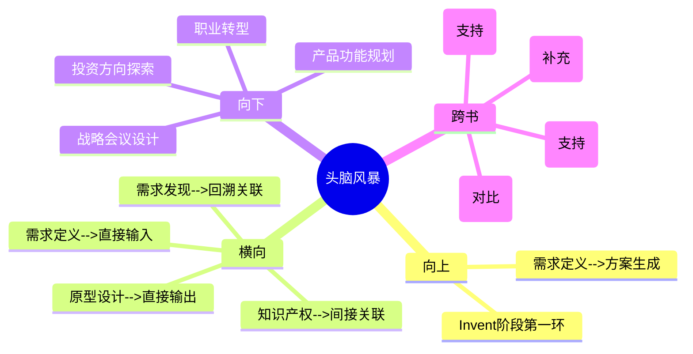

# 第6章 Invent - 头脑风暴（Brainstorming）

## 章节定位

### 全书位置
> 本章是Invent阶段的开篇，承接第5章产出的标准化需求陈述，回答"如何从一个好问题生成大量有潜力的解决方案"。这是Identify向Invent跨越的关键环节。

- **全书核心问题**: 为什么95%的医疗创新想法最终夭折？如何系统性提高落地率？
- **本章回答的问题**: 有了一个精确定义的医疗需求后，怎样才能生成足够多且足够好的解决方案，而不是被第一个想到的方案锁死？
- **角色类型**: 核心方法论型
- **论证位置**: 全书三步法第二步（Invent）的第一环——方向已经确定（第5章需求定义），现在要生成解决方案。这环的产出质量直接决定了后续原型设计和IP策略的素材池深度

### 章节序列
| 方向 | 章节标题 | 逻辑连接 |
|------|----------|----------|
| 前章 | 第5章 需求定义（Need Specification） | 直接前置：标准化需求陈述是头脑风暴的唯一输入 |
| 后章 | 第7章 原型设计（Prototyping） | 承接：头脑风暴筛选出的2-3个方向进入快速原型验证 |

### 一句话定位
> 本章是Invent阶段的创意引擎，确立"创意生成是一门有纪律的技术"的核心观点——通过信息先行的结构化发散和评分矩阵的量化收敛，将一个好问题转化为一批高质量的解决方案候选。

---

## 核心观点

### 第一层：表层案例

| 案例名称 | 简要描述 | 关键引文 |
|----------|----------|----------|
|  Stanford Biodesign头脑风暴会 | 团队在需求定义完成后召开结构化头脑风暴，目标产出50-100个想法，而非通常会议的三四个 | "头脑风暴不是随便聊聊，是有纪律的技术" |
| 四规则实践 | 先发散后收敛、禁止批评、站在巨人肩膀上（先做一周调研）、多维度刺激，每轮头脑风暴严格执行 | 数量目标50-100个想法 |
| 评分矩阵收敛 | 发散后用评分矩阵评估每个想法：需求满足度、技术可行性、成本可控性、专利可保护性，最终选出2-3个做原型 | 用量化评估替代主观偏好 |

### 第二层：中层机制

| 机制名称 | 组成要素 | 因果链条 | 证据来源 |
|----------|----------|----------|----------|
| 信息先行机制 | 一周需求侦察 → 多维信息输入 → 创意发散 | 充分信息输入 → 创意组合空间扩大 → 产出质量提升 → 避免闭门造车 | 四规则之"站在巨人肩膀上" |
| 发散收敛双过程机制 | 严格分离发散阶段（只产出）和收敛阶段（只评估） | 阶段分离 → 避免过早评判扼杀创意 → 保证数量 → 量化收敛保证质量 | 先发散后收敛规则、数量目标50-100 |
| 批评免疫机制 | 发散阶段禁止任何批评，最疯狂的想法也记录 | 禁止批评 → 心理安全 → 参与者敢提出非常规想法 → 突破思维惯性 | 禁止批评规则 |

### 第三层：底层规律

| 规律陈述 | 抽象层级 | 知识连接 | 适用范围 |
|----------|----------|----------|----------|
| **创意结构化定律**：高质量创新 = 高质量信息输入 × 结构化发散流程 × 量化收敛评估。三个因子中任何一个为零，结果为零 | 创造力理论/系统论 | 《创造力》（Csikszentmihalyi）、《思考快与慢》（系统1/系统2）、信息论 | 头脑风暴、产品设计、战略规划 |
| **信息先行定律**：创意的质量取决于信息输入的质量，而非参与者的聪明程度。信息不充分时的创意生成等于在有限空间内做排列组合 | 认知科学/知识论 | 《直觉泵》（Dennett）、《穷查理宝典》（多元思维模型） | 创意生成、决策制定、学习设计 |
| **数量质量转化定律**：创意的数量与质量不是对立关系而是因果关系——产出量越大，出现高质量创意的概率越高。数量目标不是形式主义，而是概率论的必然 | 概率论/创造力研究 | 西蒙顿创造力理论（数量与质量正相关）、《天才源自刻意练习》 | 创意工作、内容创作、实验设计 |

---

## 降维翻译

### 观点1: 创意结构化定律

#### 原文表达
> "头脑风暴的质量取决于三个要素：信息输入的质量、发散流程的结构化程度、收敛评估的量化水平。三者缺一不可。"

#### 认知转变
从"头脑风暴靠的是参与者的聪明才智和灵感"到"头脑风暴是一个三因子乘法——信息、流程、评估，任何一个因子为零结果为零"——创意不是天赋，是结构。

#### 降维翻译（中学生能懂）
大多数人的头脑风暴是这样的：大家坐在会议室里，什么前期准备都没做，主持人说"大家随便想"，然后资历最深的人先说了三个想法，其他人附和，最后就这三四个想法被记下来。Biodesign的做法完全不同——头脑风暴之前，团队已经花了一周时间做调研：了解现有方案、查相关专利、看跨行业有没有类似技术。发散阶段只产出想法不做评判，数量目标50到100个。然后收敛阶段用评分矩阵给每个想法打分。创意的质量不取决于谁更聪明，而是取决于：你带了多少信息进来、发散流程有没有结构、收敛评估是不是量化。

#### 日常类比（奶奶能懂）
就像做饭。信息输入是你冰箱里有什么食材——如果只有白菜和豆腐，再好的厨师也做不出满汉全席。结构化发散是你做菜的方法——先炒什么后炒什么、火候怎么控制。量化收敛是你尝味道——咸了淡了要有标准判断，不是凭感觉说"大概行了"。食材不行、方法不行、判断不行，任何一个不行，菜就不行。

#### 检验
- Q: 为什么头脑风暴前必须先做调研？
- A: 因为创意本质上是已有信息的重新组合。没有信息储备的头脑风暴，参与者只能在脑子里已有的那点东西上打转，等于闭门造车。

### 观点2: 发散收敛双过程机制

#### 原文表达
> "头脑风暴必须严格分为发散和收敛两个阶段。发散阶段只追求数量，不做任何评判。收敛阶段用评分矩阵量化评估，从大量想法中筛选出最优候选。"

#### 认知转变
从"发散和收敛可以同时进行"到"发散和收敛必须严格分离，交替进行会同时失去数量和的质"——边想边评判是头脑风暴最大的杀手。

#### 降维翻译（中学生能懂）
想象你在挖金子。发散阶段是疯狂地挖——不管挖到的是金子、石头还是泥土，先全部挖出来，目标是挖一大堆。收敛阶段是把挖出来的东西放到筛子里，用标准判断哪些是金子、哪些是石头。如果边挖边评判——每挖一铲子就停下来仔细看"这块是不是金子"——你一天挖不了几铲子，大部分时间花在犹豫上。Biodesign规定发散阶段的目标是50到100个想法，不管多疯狂都记下来。收敛阶段才开始用评分矩阵一个个过。两个阶段分开执行，顺序不能颠倒，不能在发散中途插入评判。

#### 日常类比（奶奶能懂）
就像收庄稼。发散阶段是收割——不管麦子长得好不好，先全部割下来堆在场院里。收敛阶段是脱粒——用筛子把好麦子和瘪麦粒分开。如果你割一把就停下来挑一把，一天下来地还没收完天就黑了。

#### 检验
- Q: 为什么不能在发散阶段评判想法？
- A: 因为评判会触发心理防御——一旦被否定，人就不敢再提非常规想法了。而且评判消耗认知资源，让你产出想法的速度急剧下降。

### 观点3: 数量质量转化定律

#### 原文表达
> "头脑风暴的数量目标不是形式主义——产出量越大，出现高质量创意的概率越高。"

#### 认知转变
从"重质量轻数量"到"数量是质量的概率前提"——不是一定要平庸的多，而是只有足够多才可能出现好的。

#### 降维翻译（中学生能懂）
很多人觉得头脑风暴要"少而精"，三四个好想法就够了。但从概率角度，这完全不成立。假设一个好想法出现的概率是5%，产出10个想法至少有一个好想法的概率只有40%，产出50个想法的概率是92%，产出100个想法的概率是99.4%。所以Biodesign要求50到100个想法——这不是拍脑袋定的数字，而是基于概率论的必然。前20个想法通常是你脑子里已有的老想法，第20到50个开始有变体，第50个以后才开始出现真正跳出框框的东西。

#### 日常类比（奶奶能懂）
就像撒网捕鱼。只撒三网，大概率捕不到什么好鱼。撒五十网一百网，大鱼自然就进网了。不是你撒的每一网都厉害，而是撒得足够多，总有大鱼会出现。

#### 检验
- Q: 为什么前20个想法通常不是好想法？
- A: 因为前20个是你大脑里最"近"的路径——平时想过的、见过的、习惯的方案。需要产出到一定数量之后，大脑才会被迫走出舒适区，开始真正创新。

---

## 知识锚点

### 原书精华
| 锚点 | 记忆场景 |
|------|----------|
| "头脑风暴不是随便聊聊，是有纪律的技术" | 团队把头脑风暴当成"随便聊聊"时 |
| "创意结构化定律：高质量创新 = 高质量信息输入 × 结构化发散流程 × 量化收敛评估" | 评估头脑为什么会失败时 |
| "先做一周调研，再开一小时头脑风暴。顺序不能反过来" | 看到有人直接开会想方案时 |
| "数量目标50-100个——前20个是已知的，好想法在后面" | 团队在产出十几个想法就想停下来时 |

### 降维锚点
| 锚点 | 来源观点 | 记忆场景 |
|------|----------|----------|
| "食材不行、方法不行、判断不行，任何一个不行，菜就不行" | 创意结构化定律 | 解释三因子乘法关系时 |
| "先收割再脱粒——边割边挑，一天下来地没收完" | 发散收敛双过程机制 | 团队想边想边评判时 |
| "撒网捕鱼，撒得足够多，大鱼自然会进网" | 数量质量转化定律 | 质疑数量目标时 |
| "信息输入质量决定了创意空间的边界" | 信息先行定律 | 讨论为什么头脑风暴产出平庸时 |

### 对比锚点
| 锚点 | 创作角度 | 记忆场景 |
|------|----------|----------|
| 普通头脑风暴：资历最深的人先发言，其他人附和，最后三四个想法；Biodesign：先调研、发散50-100个、量化收敛 | 对比 | 反思团队头脑风暴为什么低效时 |
| 精益创业：用MVP快速试错来筛选想法；Biodesign：用评分矩阵在纸上先筛一遍，再选2-3个做原型 | 对比 | 讨论不同行业的创意筛选策略时 |
| "重质不重量"的直觉 vs "数量是质量的概率前提"的科学 | 对比 | 说服团队接受数量目标时 |

---

## 当下映射

### 财富应用
| 场景 | 具体行动 | 预期效果 | 风险提示 |
|------|----------|----------|----------|
| 投资方向探索 | 对感兴趣的赛道做结构化头脑风暴：先一周调研（看行业报告、竞品、专利、技术趋势），再产出50-100个投资方向假设，用评分矩阵收敛 | 避免被第一个"看起来不错"的方向锁死，系统性扩大投资机会集 | 评分维度需要包含退出路径和流动性考量 |
| 商业模式创新 | 对现有业务模式做头脑风暴：从定价、渠道、客户细分、价值主张四个维度各产出10-20个变体 | 发现被忽略的商业模式可能性 | 收敛阶段要考虑执行资源和能力约束 |

### 职场应用
| 场景 | 具体行动 | 所需能力 | 适用职级 |
|------|----------|----------|----------|
| 产品功能规划 | 对"如何解决用户X问题"做结构化头脑风暴：先调研用户场景和竞品方案，再发散50-100个功能想法，用评分矩阵（用户价值、开发成本、差异化、可行性）收敛 | 用户研究、结构化思维、数据分析 | 产品经理/创意负责人 |
| 战略会议设计 | 将传统战略会议改为"先调研后发散再收敛"结构，会前一周发送阅读材料，会议分两轮进行 | 会议设计、引导技巧 | 中高层管理者 |
| 跨部门协作 | 用头脑风暴四规则作为跨部门会议的通用协议，减少部门壁垒带来的创意压制 | 引导能力、冲突管理 | 项目经理/跨部门负责人 |

### 生活应用
| 场景 | 具体行动 | 可行性 | 见效时间 |
|------|----------|--------|----------|
| 职业转型方向 | 对"我适合做什么"做个人头脑风暴：先一周调研（了解自己能力、市场机会、行业趋势），再列出50-100个可能的方向，用评分矩阵（兴趣匹配、收入潜力、能力匹配、风险）收敛 | 高，个人可独立完成 | 1-2周内产出清晰方向 |
| 家庭重大决策 | 对"是否搬家/换城市"做家庭头脑风暴：先收集信息（房价、学校、工作机会、生活质量），再列出所有可能的方案，量化评估 | 高 | 决策质量即时提升 |

### 72小时行动计划
1. 今天：回顾最近一次团队头脑风暴，对照"创意结构化定律"三因子评估：信息输入够吗？流程有结构吗？收敛量化了吗？
2. 明天：为下一个需要创意的场景（产品功能、投资方向、个人决策）设计一个结构化头脑风暴计划：明确调研清单、数量目标、评分维度
3. 本周内：创建一个团队头脑风暴模板，包含四规则卡片和评分矩阵模板，要求所有创意会议强制使用

---

## 章节关联

### 向上关联 --> 整书
- **贡献**: 构成Invent阶段的第一环，将Identify阶段产出的需求定义转化为解决方案候选池。没有高质量的头脑风暴，后续原型设计和IP策略将缺乏素材
- **位置**: 全书三步法第二步（Invent）的起点——Identify阶段确定了"做什么"（需求定义），本章开始解决"怎么做"（方案生成）

### 横向关联 --> 章节间
| 章节编号 | 章节标题 | 关联类型 | 连接描述 |
|----------|----------|----------|----------|
| 第5章 | 需求定义（Need Specification） | 直接输入 | 第5章的标准化需求陈述是本章头脑风暴的唯一输入——需求定义的质量决定了头脑风暴的方向 |
| 第7章 | 原型设计（Prototyping） | 直接输出 | 本章收敛阶段筛选出的2-3个方向是第7章原型设计的输入——没有经过结构化的头脑风暴，原型设计将缺乏方向 |
| 第8章 | 知识产权策略（IP Strategy） | 间接关联 | 本章产生的方案候选是第8章专利布局的素材——头脑风暴阶段就应考虑专利可保护性 |
| 第2章 | 需求发现（Need Finding） | 回溯关联 | 本章"信息先行"原则是对第2章"临床观察"方法论的复用——都是先充分获取信息再产生输出 |

### 向下关联 --> 具体应用
| 应用场景 | 难度 | 前置知识 |
|----------|------|----------|
| 产品功能头脑风暴 | 低 | 无，直接可用四规则模板 |
| 投资方向探索 | 中 | 基础行业分析能力 |
| 个人职业转型 | 低 | 无 |
| 战略会议设计 | 中 | 会议引导技巧 |

### 跨书关联 --> 知识网络
| 书籍 | 概念 | 关系 | 备注 |
|------|------|------|------|
| 精益创业-Eric Ries | MVP快速试错 | 对比 | 精益创业用市场试错筛选想法，Biodesign用评分矩阵在内部先筛 |
| 创新者的窘境-Clayton Christensen | 破坏性创新的发现 | 补充 | Christensen讲什么方向值得创新，Biodesign讲怎么生成方案 |
| 思考快与慢-Daniel Kahneman | 系统1/系统2 | 支持 | 发散阶段用系统1（快速联想），收敛阶段用系统2（理性评估），阶段分离对应双系统切换 |
| 穷查理宝典-Charlie Munger | 多元思维模型 | 支持 | "多维度刺激"规则本质上是强制引入多元思维模型 |

### 关联可视化

---

## 问答设计

### Q1: Biodesign头脑风暴的四个核心规则是什么？
**认知层次**: 记忆
**难度**: 低
**答案要点**:
- 先发散后收敛：严格分为两个阶段，不能交替进行
- 禁止批评：发散阶段任何想法不被否定
- 站在巨人肩膀上：头脑风暴前先做一周调研
- 多维度刺激：从材料、软件、放大缩小等角度刻意刺激思考

### Q2: 为什么"信息输入质量"比"参与者聪明程度"更重要？
**认知层次**: 理解
**难度**: 中
**答案要点**:
- 创意本质上是已有信息的重新组合
- 信息输入不足时，再聪明的人也只能在有限空间内排列组合
- 充分的信息输入扩大了创意的组合空间，从根本上提高了高质量创意出现的概率
- 这就是为什么Biodesign要求先做一周调研再开头脑风暴

### Q3: 创意结构化定律的三个因子为什么是乘法关系而不是加法关系？
**认知层次**: 分析
**难度**: 高
**答案要点**:
- 乘法关系意味着任何一个因子为零，结果为零
- 信息输入为零：闭门造车，产出全是老想法
- 结构化流程为零：混乱无序，发散收敛混在一起，同时失去数量和质量的
- 量化评估为零：主观拍板，好想法可能被错误淘汰
- 加法关系意味着一个因子可以弥补另一个因子的不足，但实践中三个因子缺一不可

### Q4: 如果团队只有2小时，怎么执行一个"迷你版"的结构化头脑风暴？
**认知层次**: 应用
**难度**: 中
**答案要点**:
- 调研前置：将一周调研压缩为会前30分钟的个人独立阅读（提前发送材料）
- 缩短发散：30分钟发散，目标不是50-100个而是20-30个
- 加速收敛：30分钟用简化评分矩阵（3个维度）快速打分
- 剩余时间：讨论Top 3方向，明确下一步验证计划
- 关键：即使时间紧，也不能跳过调研或混合发散收敛

### Q5: 头脑风暴阶段产生的想法，如何与第7章原型设计衔接？
**认知层次**: 分析
**难度**: 高
**答案要点**:
- 头脑风暴收敛阶段选出2-3个最高分方向
- 这2-3个方向带着评分数据进入原型设计阶段
- 评分数据帮助原型设计团队确定"最值得验证的假设是什么"
- 原型设计不是对所有想法做原型，而是对评分最高的2-3个方向做最低成本验证
- 原型设计阶段的验证结果会反馈回头脑风暴评分，形成迭代循环

---

## 拆解质量自检

### 必检项
- [x] Frontmatter 格式正确
- [x] 章节定位一句话清晰
- [x] 三层提取完整（每层 >= 3个元素）
- [x] 所有核心观点有完整三层翻译和认知转变
- [x] 知识锚点 >= 8条
- [x] 三大维度映射完整
- [x] 四向关联完整
- [x] 问答设计 >= 5个
- [x] 有72小时应用计划
- [x] 有Mermaid可视化
- [x] links包含主拆解记录和第5章
- [x] tags使用层级格式
- [x] 与第5章建立直接输入关联
- [x] 与第7章建立直接输出关联
- [x] 每个观点有认知转变描述
- [x] 无Emoji符号（除章节结构标记外）
