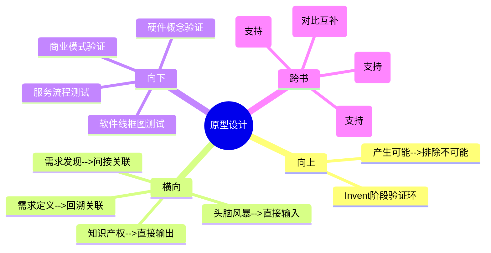

# 第7章 Invent - 原型设计（Prototyping）

## 章节定位

### 全书位置
> 本章是Invent阶段的第二环，承接第6章头脑风暴筛选出的2-3个方案方向，回答"如何用最低成本快速验证方案的核心假设"。这是从想法走向现实的关键转换点。

- **全书核心问题**: 为什么95%的医疗创新想法最终夭折？如何系统性提高落地率？
- **本章回答的问题**: 有了几个有潜力的解决方案方向后，怎样才能快速判断哪个方向真正可行，而不是花几个月甚至几年在错误的方向上？
- **角色类型**: 核心方法论型
- **论证位置**: 全书三步法第二步（Invent）的中枢——头脑风暴产出了方向（第6章），本章用原型验证方向，验证结果直接决定哪些方向值得进入知识产权策略（第8章）和后续实施阶段

### 章节序列
| 方向 | 章节标题 | 逻辑连接 |
|------|----------|----------|
| 前章 | 第6章 头脑风暴（Brainstorming） | 直接前置：头脑风暴筛选出的2-3个方向是原型设计的输入 |
| 后章 | 第8章 知识产权策略（IP Strategy） | 承接：验证可行的方案方向进入专利布局和IP策略设计 |

### 一句话定位
> 本章是Invent阶段的验证引擎，确立"与其争论100次，不如做一个粗糙的原型让所有人试一下"的核心观点——通过从概念模型到临床原型的渐进验证，用最低成本在最早期验证最关键的假设。

---

## 核心观点

### 第一层：表层案例

| 案例名称 | 简要描述 | 关键引文 |
|----------|----------|----------|
| 跨学科团队原型沟通 | 医生、工程师、商科学生对同一方案有不同理解，做一个粗糙原型后所有人立刻达成共识 | "与其争论100次，不如做一个粗糙的原型让所有人试一下" |
| 三阶原型体系 | 从概念模型（纸面/泡沫）到功能原型（能工作）到临床原型（接近最终产品），逐级递进验证不同层次的假设 | 概念模型 --> 功能原型 --> 临床原型的渐进体系 |
| 快速迭代循环 | 设计一个简单原型 --> 让目标用户试用 --> 收集反馈 --> 修改原型 --> 再测试，每次迭代只验证一个关键假设 | 设计-测试-学习的快速循环 |

### 第二层：中层机制

| 机制名称 | 组成要素 | 因果链条 | 证据来源 |
|----------|----------|----------|----------|
| 渐进验证机制 | 概念模型验证"方向对不对" --> 功能原型验证"能不能工作" --> 临床原型验证"医生能不能用" | 低精度原型先验证大方向 --> 方向正确再投入更高精度 --> 避免在错误方向上浪费高精度原型成本 | 三阶原型体系 |
| 关键假设优先机制 | 识别最关键的不确定性假设 --> 设计原型专门验证这个假设 --> 验证通过再验证下一个 | 每个原型只验证一个关键假设 --> 成本最低 --> 速度最快 --> 学习最明确 | 快速迭代循环 |
| 沟通媒介机制 | 原型作为跨学科团队的共同语言 | 文字和图纸无法跨越专业壁垒 --> 实物原型让所有人有共同参照物 --> 消除语言差异 --> 加速决策 | 跨学科团队案例 |

### 第三层：底层规律

| 规律陈述 | 抽象层级 | 知识连接 | 适用范围 |
|----------|----------|----------|----------|
| **成本递增定律**：原型的精度每提升一个等级，成本和时间呈指数级增长。因此必须在最低精度级别验证最关键假设，精度提升的顺序不可颠倒 | 工程学/经济学 | 精益创业MVP理论、实物期权理论（延迟高成本投入） | 产品开发、建筑设计、服务设计 |
| **实物沟通定律**：在跨学科协作中，实物原型的沟通效率远超文字和图纸。因为实物同时激活了视觉、触觉和空间认知，而文字只激活语言认知 | 认知科学/传播学 | 《设计心理学》（Norman）、具身认知理论 | 团队协作、产品设计、教育 |
| **迭代加速定律**：设计-测试-学习循环的迭代速度与创新成功率成正比。迭代越快，在相同时间和预算内能验证的假设越多，方向错误的概率越低 | 系统论/控制论 | 控制论反馈循环、贝叶斯更新理论 | 产品开发、科学研究、政策制定 |

---

## 降维翻译

### 观点1: 渐进验证机制

#### 原文表达
> "原型设计遵循从概念模型到功能原型再到临床原型的渐进路径。每一级原型验证不同层次的假设，精度逐级提升，成本也逐级增长。"

#### 认知转变
从"原型应该尽可能做得像最终产品"到"原型应该在满足验证目标的前提下尽可能粗糙"——原型不是产品的缩小版，是假设的测试工具。

#### 降维翻译（中学生能懂）
Biodesign把原型分成三个等级。第一级是概念模型——用纸、泡沫、胶带做一个大概形状，目的是验证"这个东西的方向对不对"。比如想做一个新的手术器械，先用泡沫雕一个大致形状让医生握一下，看他觉得大小合不合适。这一步可能只要花几十块钱、一两个小时。第二级是功能原型——用3D打印或者简单电路让它能实际工作，验证"这个东西能不能实现核心功能"。这一步花几千块、一两周。第三级是临床原型——用接近最终产品的材料和工艺制作，验证"医生在真实手术中能不能用好"。这一步花几万甚至几十万、几个月。关键是顺序不能颠倒——如果你直接做第三级原型，花了十万块发现方向不对，这十万块就白花了。应该先用几十块的概念模型确认方向，方向对了再做功能原型，功能验证了再做临床原型。

#### 日常类比（奶奶能懂）
就像做新菜。概念模型是你先在脑子里想一下"辣椒放多少、先炒什么后炒什么"。功能原型是你先用少量食材试做一次，尝尝味道对不对。临床原型是你请一桌客人来吃，看大家的反应。你不能直接跳过试做就请客——万一做砸了，浪费食材还丢面子。

#### 检验
- Q: 为什么不能一开始就做高精度原型？
- A: 因为高精度原型成本高、制作时间长。如果方向本身是错的，高精度原型做得越精细，浪费越大。应该先用低成本原型验证方向，方向对了再逐步提升精度。

### 观点2: 关键假设优先机制

#### 原文表达
> "每个原型应该只验证一个最关键的假设。识别出最大的不确定性，设计专门的原型来验证它，验证通过后再处理下一个假设。"

#### 认知转变
从"原型要验证所有功能"到"每个原型只验证一个最关键的假设"——原型不是测试清单，是假设验证器。

#### 降维翻译（中学生能懂）
假设你想做一个新的智能手表。你可能有十个不确定的事：表带舒不舒服？屏幕够不够亮？电池能不能撑一天？老人会不会用？但这些不确定性的"致命程度"不一样。如果电池只能撑两小时，其他功能再好这个产品也失败——所以"电池续航"是最关键的假设。你应该先做一个最简单的原型只验证电池能不能撑一天，而不是花两个月把所有功能都做出来再一起测试。每次只验证一个假设，验证完了再验证下一个。这样如果你的产品在第二个假设就失败了，你只浪费了验证第一个假设的成本，没有浪费后面八个假设的成本。

#### 日常类比（奶奶能懂）
就像看病。你身上有十个不舒服的地方，但医生不会一下子给你开十种药。他会先找出最严重的那个症状，做了检查确认原因，治好了再看下一个。如果最严重的问题解决了，有些小毛病可能自己就好了。

#### 检验
- Q: 怎么判断哪个假设是最关键的？
- A: 问自己"如果这个假设不成立，整个方案还能不能继续"。如果答案是否定的，这个假设就是最关键的。通常与核心价值主张直接相关。

### 观点3: 实物沟通定律

#### 原文表达
> "与其争论100次，不如做一个粗糙的原型让所有人试一下。原型是跨学科团队最高效的沟通媒介。"

#### 认知转变
从"原型是技术验证工具"到"原型首先是沟通工具，其次才是验证工具"——原型最大的价值是让不同专业的人能在同一个参照物上对话。

#### 降维翻译（中学生能懂）
一个团队里有医生、工程师、商科学生。讨论一个新产品时，医生说"这个应该更灵活"，工程师理解的是"需要加一个万向节"，商科学生理解的是"成本会增加"。三个人说的完全不是一个东西，但都用了"灵活"这个词。这种情况下开十次会也达不成共识。但是如果用泡沫做一个粗糙的模型放在桌上，医生说"我握的时候这里不舒服"，工程师立刻知道要改哪里，商科学生立刻知道改动对成本的影响。一个实物原型抵得上一百次会议。因为实物是所有人都能感知到的共同参照物，不需要翻译。

#### 日常类比（奶奶能懂）
就像一家人商量买什么沙发。光靠嘴说"要软的、要大的、要耐脏的"，每个人想的不一样。不如直接去家具城坐一坐，摸一摸，谁都觉得好的那个就是对的。实物比描述靠谱一百倍。

#### 检验
- Q: 原型在沟通上的价值为什么比验证本身还大？
- A: 因为在跨学科团队中，不同专业的人有不同的语言体系。文字和图纸在不同专业之间的翻译损耗极大。实物原型绕过了语言翻译，直接成为所有人的共同参照物。一个粗糙原型的沟通效率可能等于几十页文档加十次会议。

---

## 知识锚点

### 原书精华
| 锚点 | 记忆场景 |
|------|----------|
| "与其争论100次，不如做一个粗糙的原型让所有人试一下" | 团队在方案上反复争论无法达成共识时 |
| "概念模型 --> 功能原型 --> 临床原型，顺序不可颠倒" | 有人想跳过概念模型直接做高保真原型时 |
| "每个原型只验证一个最关键假设" | 原型设计想要包含太多功能时 |
| "原型首先是沟通工具，其次才是验证工具" | 跨学科团队沟通出现理解分歧时 |

### 降维锚点
| 锚点 | 来源观点 | 记忆场景 |
|------|----------|----------|
| "几十块的概念模型验证方向，十万块的临床原型验证细节——顺序颠倒就是浪费" | 渐进验证机制 | 讨论原型精度选择时 |
| "看病先治最严重的症状，原型先验最关键的假设" | 关键假设优先机制 | 面对多个不确定性不知从何下手时 |
| "光说买什么沙发不如去坐一坐——实物比描述靠谱一百倍" | 实物沟通定律 | 团队对方案理解不一致时 |
| "原型不是产品的缩小版，是假设的测试工具" | 渐进验证机制 | 有人追求原型"做得像"时 |

### 对比锚点
| 锚点 | 创作角度 | 记忆场景 |
|------|----------|----------|
| 传统原型：尽可能接近最终产品；Biodesign原型：在满足验证目标的前提下尽可能粗糙 | 对比 | 评估原型设计方向时 |
| 精益创业MVP：面向市场的可销售最小产品；Biodesign原型：面向团队内部的概念验证工具 | 对比 | 讨论MVP和原型的区别时 |
| "争论100次" vs "试一下"——语言和实物的沟通效率差100倍 | 对比 | 团队陷入文字争论时 |

---

## 当下映射

### 财富应用
| 场景 | 具体行动 | 预期效果 | 风险提示 |
|------|----------|----------|----------|
| 创业项目验证 | 对商业模式做"概念模型"——用纸笔画出商业流程，找目标客户确认价值主张，再投入开发成本 | 避免在错误商业模式上投入过多资金 | 概念模型也需要真实用户反馈，不能只在团队内部讨论 |
| 投资尽职调查 | 要求创业团队提供"概念模型"级别的产品演示而非PPT，直观感受产品方向是否合理 | 快速识别方向错误的项目 | 早期项目原型粗糙是正常的，不能因为原型粗糙就否定项目 |

### 职场应用
| 场景 | 具体行动 | 所需能力 | 适用职级 |
|------|----------|----------|----------|
| 产品设计评审 | 在评审会上用低保真原型（纸面/线框图）替代PPT展示，让所有参与者直接"试用"而非"听讲" | 原型制作、引导讨论 | 产品经理/设计师 |
| 跨部门项目 | 对复杂方案制作"泡沫级"概念模型，让非技术背景的部门能快速理解方案核心价值 | 快速原型制作、信息简化 | 项目经理/业务负责人 |
| 用户研究 | 用概念模型做早期用户测试，在投入开发成本之前收集真实反馈 | 用户测试设计、反馈分析 | 用户研究员/产品经理 |

### 生活应用
| 场景 | 具体行动 | 可行性 | 见效时间 |
|------|----------|--------|----------|
| 装修方案确认 | 用纸板在房间里摆放家具和隔断的实际尺寸，确认布局合理性，而不是只在图纸上看 | 高，纸板随时可得 | 装修决策时 |
| 礼物选择 | 做一个粗糙的礼物组合样品（把想买的几样东西摆在一起），请朋友试"感受"这个组合是否合适 | 高 | 下次送礼时 |
| 个人项目启动 | 对想做的个人项目（App、课程、写作），先用最低成本做一个"概念模型"试水，再决定是否投入大量时间 | 高 | 项目启动前 |

### 72小时行动计划
1. 今天：回顾当前项目，列出所有不确定的假设，按"致命程度"排序，找出最关键的1-2个
2. 明天：为最关键的假设设计一个"概念模型"级别的验证方案——用纸、泡沫、线框图或任何最低成本的方式
3. 本周内：在下次团队讨论中，带一个粗糙原型替代PPT或文档，观察团队的讨论效率和共识速度是否有提升

---

## 章节关联

### 向上关联 --> 整书
- **贡献**: 构成Invent阶段的验证中枢，将第6章产生的方案候选转化为经过验证的可行方向。原型验证的结果决定了哪些方案值得进入后续的知识产权策略和商业化阶段
- **位置**: 全书三步法第二步（Invent）的验证环——头脑风暴负责"产生可能"，原型设计负责"排除不可能"，两者配合大幅降低创新失败率

### 横向关联 --> 章节间
| 章节编号 | 章节标题 | 关联类型 | 连接描述 |
|----------|----------|----------|----------|
| 第6章 | 头脑风暴（Brainstorming） | 直接输入 | 第6章收敛阶段筛选出的2-3个方向是本章原型设计的输入——每个方向带着评分数据进入原型验证 |
| 第8章 | 知识产权策略（IP Strategy） | 直接输出 | 本章验证可行的方案方向是第8章专利布局的输入——只有经过原型验证的方案才值得投入专利资源 |
| 第5章 | 需求定义（Need Specification） | 回溯关联 | 原型验证的核心标准是"是否满足需求定义"——需求陈述是原型验证的参照基准 |
| 第2章 | 需求发现（Need Finding） | 间接关联 | 原型的最终测试对象是第2章中发现需求的原始用户群体——回到临床场景中验证 |

### 向下关联 --> 具体应用
| 应用场景 | 难度 | 前置知识 |
|----------|------|----------|
| 硬件产品概念验证 | 低 | 基础手工制作能力 |
| 软件产品线框图测试 | 低 | 基础设计工具使用 |
| 服务流程角色扮演 | 低 | 无 |
| 商业模式画布验证 | 中 | 商业模式基础知识 |

### 跨书关联 --> 知识网络
| 书籍 | 概念 | 关系 | 备注 |
|------|------|------|------|
| 精益创业-Eric Ries | MVP最小可行产品 | 对比与互补 | MVP是面向市场的原型，Biodesign原型是面向团队内部的原型——两者结合可覆盖从内部验证到市场验证的全链条 |
| 设计心理学-Don Norman | 以用户为中心的设计 | 支持 | Norman强调通过原型和测试理解用户真实需求，与原型设计的"回到临床场景"逻辑一致 |
| 系统之美-德内拉梅多斯 | 反馈循环 | 支持 | 设计-测试-学习循环本质上是一个反馈循环系统，迭代速度决定系统收敛速度 |
| 创新者的方法-Nathan Furr | 原型验证不确定性 | 支持 | Furr同样强调用原型验证最大不确定性，与关键假设优先机制一致 |

### 关联可视化

---

## 问答设计

### Q1: Biodesign的三阶原型体系是什么？
**认知层次**: 记忆
**难度**: 低
**答案要点**:
- 概念模型：用纸、泡沫等低成本材料制作，验证"方向对不对"
- 功能原型：用3D打印或简单电路制作，验证"能不能工作"
- 临床原型：用接近最终产品的材料工艺制作，验证"用户在真实场景中能不能用好"
- 三级精度递增，成本指数增长，顺序不可颠倒

### Q2: 为什么"每个原型只验证一个最关键假设"？
**认知层次**: 理解
**难度**: 中
**答案要点**:
- 多假设同时验证会导致无法判断哪个假设导致了失败或成功
- 每个原型只验证一个假设，成本最低、结论最明确
- 关键假设的判断标准：如果这个假设不成立，整个方案还能不能继续
- 验证完最关键的再验证次关键的，形成有序的验证序列

### Q3: 原型作为沟通媒介的价值为什么有时超过验证本身？
**认知层次**: 分析
**难度**: 高
**答案要点**:
- 跨学科团队中，不同专业的人有不同的语言体系
- 文字和图纸在不同专业之间翻译损耗极大
- 实物原型绕过了语言翻译，成为所有人的共同参照物
- 一个粗糙原型的沟通效率可能等于几十页文档加十次会议
- "与其争论100次，不如做一个粗糙的原型让所有人试一下"

### Q4: 如何在软件产品开发中应用三阶原型体系？
**认知层次**: 应用
**难度**: 中
**答案要点**:
- 概念模型：纸面线框图或手绘草图，验证信息架构和核心流程
- 功能原型：可点击的交互原型（Figma等工具），验证用户交互和功能逻辑
- 临床原型：接近最终产品的可运行版本（MVP），验证真实用户的使用体验和技术可行性
- 同样遵循成本递增、顺序不可颠倒的原则

### Q5: 原型验证的结果如何反馈回头脑风暴阶段？
**认知层次**: 分析
**难度**: 高
**答案要点**:
- 原型验证可能发现某个方向不可行，需要回到头脑风暴选择下一个方向
- 原型验证可能发现新的用户需求或约束条件，这些新信息可以重新输入头脑风暴
- 原型验证的评分数据（如需求满足度、技术可行性）会更新头脑风暴评分矩阵
- 设计-测试-学习循环不是单向流程，而是迭代循环——验证结果会重新触发创意生成
- 这种循环保证了创新流程的自我修正能力

---

## 拆解质量自检

### 必检项
- [x] Frontmatter 格式正确
- [x] 章节定位一句话清晰
- [x] 三层提取完整（每层 >= 3个元素）
- [x] 所有核心观点有完整三层翻译和认知转变
- [x] 知识锚点 >= 8条
- [x] 三大维度映射完整
- [x] 四向关联完整
- [x] 问答设计 >= 5个
- [x] 有72小时应用计划
- [x] 有Mermaid可视化
- [x] links包含主拆解记录和第6章
- [x] tags使用层级格式
- [x] 与第6章建立直接输入关联
- [x] 与第8章建立直接输出关联
- [x] 每个观点有认知转变描述
- [x] 无Emoji符号（除章节结构标记外）
