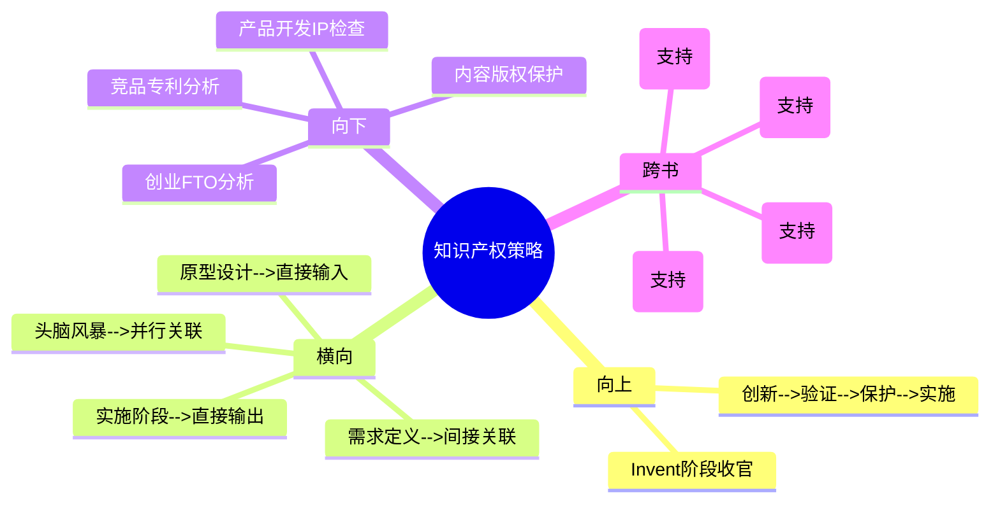

# 第8章 Invent - 知识产权策略（IP Strategy）

## 章节定位

### 全书位置
> 本章是Invent阶段的收官环节，承接第7章原型验证可行的方案方向，回答"如何将知识产权策略嵌入创新流程而非事后补充"。这是发明阶段向实施阶段过渡的桥梁。

- **全书核心问题**: 为什么95%的医疗创新想法最终夭折？如何系统性提高落地率？
- **本章回答的问题**: 知识产权在创新流程中应该什么时候介入？怎样用专利策略建立竞争壁垒而不是仅仅做"法律手续"？
- **角色类型**: 核心方法论型
- **论证位置**: 全书三步法第二步（Invent）的最后一环——方案已经过原型验证（第7章），在正式进入实施阶段（监管、报销、商业化）之前，必须建立知识产权保护。IP策略的质量决定了后续商业化阶段的竞争壁垒强度

### 章节序列
| 方向 | 章节标题 | 逻辑连接 |
|------|----------|----------|
| 前章 | 第7章 原型设计（Prototyping） | 直接前置：验证可行的方案方向进入IP策略设计和专利布局 |
| 后章 | 实施阶段（Implement） | 承接：完成IP布局后进入监管路径、报销策略、商业化实施 |

### 一句话定位
> 本章是Invent阶段的保护环，确立"知识产权不是事后的法律手续，而是创新流程的并行组成部分"的核心观点——通过专利检索、FTO分析、权利要求设计，在早期就建立竞争壁垒并反哺产品设计决策。

---

## 核心观点

### 第一层：表层案例

| 案例名称 | 简要描述 | 关键引文 |
|----------|----------|----------|
| IP策略反哺产品设计 | 团队在头脑风暴阶段就考虑专利可保护性，发现某个技术方向已有密集专利布局后主动调整设计方向 | "好的IP策略可以在早期就建立竞争壁垒" |
| FTO自由实施分析 | 在方案确定后做FTO分析，排查是否存在侵权风险，避免产品上市后被诉讼 | 专利检索和FTO分析是产品上市的必经流程 |
| 专利布局影响产品设计 | 权利要求的设计直接影响产品的技术路线选择——有时为了避免专利侵权需要重新设计核心部件 | 专利策略影响产品设计决策 |

### 第二层：中层机制

| 机制名称 | 组成要素 | 因果链条 | 证据来源 |
|----------|----------|----------|----------|
| IP并行机制 | 知识产权策略与头脑风暴、原型设计同步进行，而非在所有技术方案确定后才开始 | IP早期介入 --> 方案选择时就考虑专利可保护性 --> 避免在已有专利壁垒的方向上浪费时间 --> 提高创新效率 | IP反哺产品设计案例 |
| FTO风险排查机制 | 系统性检索现有专利 --> 分析是否存在侵权风险 --> 如有风险则设计绕开方案或获取授权 | FTO分析 --> 识别法律风险 --> 提前规避或谈判 --> 避免产品上市后的诉讼和禁售 | FTO自由实施分析 |
| 权利要求设计机制 | 精心设计的权利要求范围 --> 既保护核心技术又不过度宽泛被无效 --> 为后续产品线扩展预留空间 | 权利要求质量决定保护强度 --> 过窄保护不足 --> 过宽容易被挑战 --> 需要精准设计 | 专利布局影响产品设计 |

### 第三层：底层规律

| 规律陈述 | 抽象层级 | 知识连接 | 适用范围 |
|----------|----------|----------|----------|
| **IP并行定律**：在知识密集型创新中，知识产权策略必须与创新流程并行执行，而非事后补充。IP介入的时间点决定了创新效率和竞争壁垒强度 | 创新管理/战略理论 | 实物期权理论（早期布局增加未来选择权）、资源基础理论（IP作为核心竞争力） | 医药、科技、材料、软件等知识密集型行业 |
| **壁垒前置定律**：竞争壁垒的建立越早成本越低。在创意阶段建立的专利壁垒比在产品上市后建立的壁垒成本低一个数量级，且效果更好 | 竞争战略/博弈论 | 波特竞争战略（进入壁垒）、先发优势理论 | 所有受知识产权保护的领域 |
| **法律技术互塑定律**：知识产权策略和技术设计是互相塑造的关系——技术路线受专利格局约束，专利布局受技术可能性驱动。两者不能独立决策 | 法律与技术的交叉研究 | 制度经济学（制度约束行为）、共同演化理论 | 专利密集型产品开发 |

---

## 降维翻译

### 观点1: IP并行定律

#### 原文表达
> "知识产权不是事后的法律手续，而是创新流程的并行组成部分。IP策略应该在头脑风暴和原型设计阶段就同步介入。"

#### 认知转变
从"等产品做出来再申请专利"到"从头脑风暴开始就同步考虑IP"——IP不是终点站的检票口，是全程的导航仪。

#### 降维翻译（中学生能懂）
大多数创业团队的做法是：先花两三年把产品做出来，然后找律师说"帮我申请个专利"。Biodesign说这个顺序完全错了。正确的做法是：在头脑风暴产生想法的时候，就同步做专利检索——看看这个方向有没有人已经申请了专利。如果有密集的专利布局，这个方向可能就不值得做了，因为就算你做出来也绕不开别人的专利。在原型设计阶段，也要考虑"这个技术方案能不能被专利保护"。有些技术方案可能技术上可行，但专利保护范围太窄，竞争对手很容易绕开，这样的方案商业价值就很低。IP策略和创新流程应该是两条并行的轨道，从第一天就开始同步运行，而不是等产品做完了再补做IP。

#### 日常类比（奶奶能懂）
就像盖房子之前要先查清楚这块地是谁的。你不能先把房子盖好了再去查地契——万一发现这块地是别人的，房子白盖了。IP策略就是查地契，应该在盖房子（做产品）之前就开始查，而且边盖边查。

#### 检验
- Q: 为什么IP策略不能等产品做出来后再做？
- A: 因为如果产品方向本身踩了别人的专利，做出来也无法上市。早期同步做IP检索可以避免在侵权方向上浪费时间和资金。而且早期建立专利壁垒的成本远低于后期。

### 观点2: FTO风险排查机制

#### 原文表达
> "自由实施分析（FTO）是产品上市前的必经流程——系统性检索现有专利，分析是否存在侵权风险，如有风险则设计绕开方案或获取授权。"

#### 认知转变
从"专利是自己保护自己"到"专利更是排查别人的地雷"——FTO不是进攻武器，是防御雷达。

#### 降维翻译（中学生能懂）
FTO（Freedom to Operate，自由实施）分析回答的问题是：我做出来的产品，会不会侵犯别人已经有的专利？做法是系统地检索所有相关专利，逐一比对你的产品和这些专利的权利要求。如果发现有可能侵权，你有两个选择：一是修改设计绕开别人的专利（design around），二是找专利持有者谈判获取授权（license）。FTO分析不是可做可不做的——如果跳过这一步直接上市，竞争对手可能会在你产品开始赚钱的时候发起专利诉讼，要求法院禁售你的产品。那个时候你所有的投入都打水漂了。FTO就像雷区探测器——你不需要知道每颗地雷在哪里，但你必须知道有没有地雷区。

#### 日常类比（奶奶能懂）
就像开车前要检查路线上有没有封路或施工。如果你不看导航直接开，开到半路发现路封了，掉头回来浪费的时间比出发前查导航多十倍。FTO就是出发前查路况。

#### 检验
- Q: FTO分析如果发现侵权风险怎么办？
- A: 两个选择：修改产品设计绕开专利（design around），或者找专利持有者谈判获取授权许可（license）。选择哪个取决于成本和商业策略。

### 观点3: 法律技术互塑定律

#### 原文表达
> "专利策略影响产品设计决策——权利要求的设计直接决定技术路线选择。"

#### 认知转变
从"技术决定一切，法律只是善后"到"法律和技术互相塑造——专利格局反过来约束技术路线"——技术不是独立于法律环境的自由空间。

#### 降维翻译（中学生能懂）
技术工程师和专利律师在大多数公司是两个独立的部门，互相不太交流。工程师做技术决策时不考虑专利格局，律师做专利文件时不太理解技术细节。Biodesign说这两个人必须坐在一起工作。因为专利格局会反过来影响技术路线的选择——如果某个技术方向上已经有大量专利，最好的技术方案可能不是技术性能最优的那个，而是"性能足够好且专利风险最低"的那个。反过来说，专利律师在设计权利要求时，也需要工程师帮助理解技术的核心创新点在哪里，才能写出保护范围最合适的权利要求。技术决定你能做什么，法律决定你能做什么且不被起诉。两者必须同时考虑。

#### 日常类比（奶奶能懂）
就像在拥挤的集市里摆摊。你想摆的位置（技术方案）不光要考虑哪里客流大（技术性能），还要考虑哪里不挡别人的道、不违规（法律约束）。最好的位置不是客流最大的那个，而是"客流够大又不违规"的那个。

#### 检验
- Q: 为什么说法律和技术是互相塑造的？
- A: 因为专利格局限制了技术路线的选择空间，而技术可能性又决定了专利可以保护的范围。两者不是独立决策的——技术工程师的选择受法律环境约束，专利律师的文件质量依赖技术理解。

---

## 知识锚点

### 原书精华
| 锚点 | 记忆场景 |
|------|----------|
| "知识产权不是事后的法律手续，而是创新流程的并行组成部分" | 团队等产品做完了才想到申请专利时 |
| "好的IP策略可以在早期就建立竞争壁垒" | 讨论创业项目的护城河时 |
| "专利策略影响产品设计决策" | 工程师做技术方案不考虑专利格局时 |
| "FTO分析是产品上市前的必经流程" | 团队想跳过专利检索直接推向市场时 |

### 降维锚点
| 锚点 | 来源观点 | 记忆场景 |
|------|----------|----------|
| "盖房子之前先查地契，边盖边查——不能盖好了再查" | IP并行定律 | 解释为什么IP要早期介入时 |
| "FTO是雷区探测器——不需要知道每颗地雷在哪，但必须知道有没有地雷区" | FTO风险排查机制 | 说服团队做FTO分析时 |
| "在集市摆摊，最好的位置不是客流最大的，是客流够大又不违规的" | 法律技术互塑定律 | 讨论技术方案选择标准时 |
| "IP不是终点站的检票口，是全程的导航仪" | IP并行定律 | 纠正"先做产品再申请专利"的错误认知时 |

### 对比锚点
| 锚点 | 创作角度 | 记忆场景 |
|------|----------|----------|
| 传统做法：先做产品后申请专利；Biodesign：IP与创新流程并行 | 对比 | 评估团队IP成熟度时 |
| 专利不是进攻武器而是防御雷达——FTO排查比申请专利更重要 | 对比 | 讨论IP策略优先级时 |
| 技术最优不等于商业最优——"性能足够好且专利风险最低"才是最优 | 对比 | 工程师追求极致技术性能时 |

---

## 当下映射

### 财富应用
| 场景 | 具体行动 | 预期效果 | 风险提示 |
|------|----------|----------|----------|
| 创业项目IP评估 | 投资前要求创业团队展示FTO分析报告和专利布局计划，而非仅看技术方案 | 识别有法律风险的创业项目，避免投资后遭遇专利诉讼 | 早期项目FTO可能不完善，需要区分"暂时不做"和"完全不做" |
| 个人知识产权意识 | 对自己产生的创新想法（内容、产品、方法），养成先检索再深入的习惯 | 避免重复劳动，确保创新方向有保护空间 | 专利检索有专业门槛，复杂情况需要律师协助 |

### 职场应用
| 场景 | 具体行动 | 所需能力 | 适用职级 |
|------|----------|----------|----------|
| 产品开发流程 | 在产品开发流程中嵌入IP检查点：概念阶段做专利检索，原型阶段做FTO分析，上市前做侵权排查 | IP基础知识、专利检索能力 | 产品经理/技术负责人 |
| 创新团队组建 | 在创新团队中纳入有IP意识的成员（或外部顾问），从头脑风暴阶段就开始考虑专利可保护性 | 团队设计、跨职能协作 | 团队负责人/创新主管 |
| 竞品分析 | 将竞品专利分析纳入常规的竞品研究流程，不仅分析产品功能，还分析专利布局 | 专利分析、竞争情报 | 战略分析师/产品经理 |

### 生活应用
| 场景 | 具体行动 | 可行性 | 见效时间 |
|------|----------|--------|----------|
| 个人创作保护 | 发布原创内容（文章、视频、课程）前，了解基本的版权保护方式和平台规则 | 高，了解基础知识即可 | 发布前 |
| 副业方向选择 | 选择副业方向时，简单检索该领域是否有专利或版权壁垒，避免进入高度保护的市场 | 高，Google Patents免费可用 | 副业启动前 |

### 72小时行动计划
1. 今天：对自己正在做的项目或想做的创新方向，在Google Patents上做简单的专利检索，了解该方向的专利密集程度
2. 明天：检查团队的产品开发流程，找出"IP介入"的时间点——如果是在产品完成后才介入，设计一个将IP检查嵌入早期阶段的方案
3. 本周内：创建一个简化的FTO检查清单，包含：核心功能是否涉及他人专利、是否需要设计绕开方案、是否需要获取授权

---

## 章节关联

### 向上关联 --> 整书
- **贡献**: 完成Invent阶段的最后一环，为方案建立法律保护壁垒。IP策略的质量直接决定了进入实施阶段后的竞争环境——没有IP保护的方案在商业化阶段极易被竞争对手复制
- **位置**: 全书三步法第二步（Invent）的收官——需求定义（第5章）确定了方向，头脑风暴（第6章）产生了方案，原型设计（第7章）验证了可行性，IP策略（本章）建立了保护，然后进入实施阶段

### 横向关联 --> 章节间
| 章节编号 | 章节标题 | 关联类型 | 连接描述 |
|----------|----------|----------|----------|
| 第7章 | 原型设计（Prototyping） | 直接输入 | 第7章验证可行的方案方向是本章IP策略的输入——只有经过验证的方案才值得投入专利资源 |
| 第6章 | 头脑风暴（Brainstorming） | 并行关联 | 本章IP检索应该在第6章头脑风暴阶段就同步开始——评分矩阵中的"专利可保护性"维度需要IP数据支撑 |
| 第5章 | 需求定义（Need Specification） | 间接关联 | 需求定义中排除技术方案的设计为IP策略保留了最大的专利布局空间 |
| 实施阶段 | Regulatory/Reimbursement | 直接输出 | 本章完成的IP布局是进入实施阶段的前提条件之一——没有IP保护的产品在监管和商业化阶段处于极度弱势 |

### 向下关联 --> 具体应用
| 应用场景 | 难度 | 前置知识 |
|----------|------|----------|
| 创业项目FTO分析 | 中 | 基础专利检索能力 |
| 产品开发IP检查点设计 | 中 | 产品开发流程知识 |
| 竞品专利分析 | 中 | 专利阅读能力 |
| 个人内容版权保护 | 低 | 基础版权知识 |

### 跨书关联 --> 知识网络
| 书籍 | 概念 | 关系 | 备注 |
|------|------|------|------|
| 创新者的窘境-Clayton Christensen | 竞争壁垒与护城河 | 支持 | Christensen强调建立竞争壁垒的重要性，IP是壁垒的技术化实现 |
| 从0到1-Peter Thiel | 垄断与竞争 | 支持 | Thiel认为好的企业应该追求垄断地位，专利是实现技术垄断的合法手段 |
| 好战略坏战略-Richard Rumelt | 战略的核心环 | 支持 | Rumelt的"诊断-指导方针-连贯行动"中，IP策略是连贯行动的重要组成部分 |
| 竞争战略-Michael Porter | 进入壁垒 | 支持 | 波特五种力量中的进入壁垒，专利是最有效的进入壁垒之一 |

### 关联可视化

---

## 问答设计

### Q1: 为什么知识产权策略不能等产品做出来后再做？
**认知层次**: 记忆
**难度**: 低
**答案要点**:
- IP策略需要与创新流程并行执行，从头脑风暴阶段就开始
- 早期做专利检索可以避免在已有专利壁垒的方向上浪费时间
- 早期建立专利壁垒的成本远低于后期
- 如果产品做出来后发现侵权，所有投入可能打水漂

### Q2: FTO分析的目的是什么？发现侵权风险后怎么处理？
**认知层次**: 理解
**难度**: 中
**答案要点**:
- FTO分析目的是排查产品是否会侵犯他人现有专利
- 发现侵权风险后有两个处理方案：一是设计绕开方案（design around），修改产品技术路线避免侵权；二是获取授权许可（license），与专利持有者谈判
- FTO不是进攻武器而是防御雷达，是产品上市前的必经流程

### Q3: 为什么说"专利策略影响产品设计决策"？
**认知层次**: 分析
**难度**: 高
**答案要点**:
- 专利格局限制了技术路线的选择空间
- 技术方案最优不等于商业最优——"性能足够好且专利风险最低"才是最优选择
- 权利要求的设计需要考虑技术的核心创新点，这反过来影响工程师的技术决策
- 法律和技术必须互相塑造，不能独立决策

### Q4: 头脑风暴评分矩阵中的"专利可保护性"维度怎么评估？
**认知层次**: 应用
**难度**: 中
**答案要点**:
- 专利检索：该方向是否已有密集专利布局？是否有可专利的创新点？
- 保护范围：如果能申请专利，保护范围能有多宽？竞争对手容易绕开吗？
- 侵权风险：该方向是否可能侵犯他人现有专利？
- 评估结果影响方案排名——专利可保护性高的方案在评分矩阵中得分更高

### Q5: IP策略与第7章原型设计的迭代循环如何配合？
**认知层次**: 分析
**难度**: 高
**答案要点**:
- 原型设计验证技术可行性，IP策略验证法律可行性——两个验证并行进行
- 原型迭代中发现的技术变化需要实时同步给IP团队，更新专利检索和权利要求设计
- 如果IP分析发现某个技术方向有专利壁垒，原型设计需要调整方向验证替代方案
- IP策略和原型设计形成一个反馈循环：技术验证 --> IP检查 --> 调整方向 --> 再验证 --> 再检查
- 这种配合确保了方案在技术和法律两个维度上都可行

---

## 拆解质量自检

### 必检项
- [x] Frontmatter 格式正确
- [x] 章节定位一句话清晰
- [x] 三层提取完整（每层 >= 3个元素）
- [x] 所有核心观点有完整三层翻译和认知转变
- [x] 知识锚点 >= 8条
- [x] 三大维度映射完整
- [x] 四向关联完整
- [x] 问答设计 >= 5个
- [x] 有72小时应用计划
- [x] 有Mermaid可视化
- [x] links包含主拆解记录和第7章
- [x] tags使用层级格式
- [x] 与第7章建立直接输入关联
- [x] 与第6章建立并行关联
- [x] 与实施阶段建立直接输出关联
- [x] 每个观点有认知转变描述
- [x] 无Emoji符号（除章节结构标记外）
