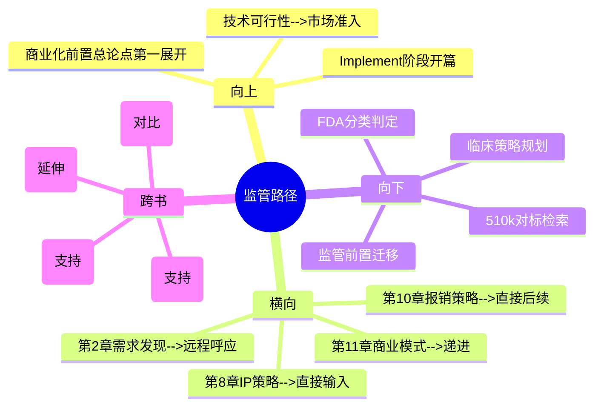

# 第9章 Implement - 监管路径（Regulatory）

## 章节定位

### 全书位置
> 本章是全书三步法第三步（Implement）的开篇，承接第8章IP策略建立的保护壁垒，回答"医疗创新从原型到市场的第一道关卡是什么"。这是全书从"能不能做出来"转向"能不能卖出去"的关键转折点。

- **全书核心问题**: 为什么95%的医疗创新想法最终夭折？如何系统性提高落地率？
- **本章回答的问题**: 医疗创新的"死亡之谷"真正在哪里？监管路径如何在创新早期就影响产品设计？
- **角色类型**: 核心概念型（Implement阶段开篇）
- **论证位置**: 全书三步法第三步（Implement）的第一环——方案经过IP保护（第8章），现在面临从实验室走向市场的第一道墙：FDA监管。本章确立"监管不是事后的审批流程，而是创新的并行约束条件"这一核心观点

### 章节序列
| 方向 | 章节标题 | 逻辑连接 |
|------|----------|----------|
| 前章 | 第8章 知识产权策略（IP Strategy） | 直接前置：完成IP布局后，方案面临下一个市场准入关卡——监管审批 |
| 后章 | 第10章 报销策略（Reimbursement） | 直接后续：监管审批通过后，下一道墙是医保报销——两道墙合称"死亡之谷" |

### 一句话定位
> 本章是全书从"技术可行性"转向"市场准入"的转折点，确立"医疗创新的死亡之谷不在研发而在监管"的核心认知——通过FDA审批分类（510(k)、PMA、De Novo）和监管前置思维，揭示商业化可行性必须在发明阶段就纳入设计约束。

---

## 核心观点

### 第一层：表层案例

| 案例名称 | 简要描述 | 关键引文 |
|----------|----------|----------|
| 死亡之谷的真实位置 | 团队花两年做出完美原型后，迎面撞上FDA审批1-3年、花费数百万美元，公司资金耗尽 | "医疗创新的失败大多不是因为技术不行，而是因为团队不理解监管和报销的现实" |
| 510(k) vs PMA路径选择 | 同一类心脏器械，走510(k)路径6个月获批，走PMA路径3年获批且需要大规模临床试验 | 同一产品走不同审批路径，方案设计完全不同 |
| De Novo路径案例 | 全新类型的医疗设备，没有已上市的对标产品（predicate device），必须走De Novo路径建立新的产品分类 | De Novo路径是介于510(k)和PMA之间的第三条路 |

### 第二层：中层机制

| 机制名称 | 组成要素 | 因果链条 | 证据来源 |
|----------|----------|----------|----------|
| 监管前置机制 | 在发明阶段就确定产品属于FDA哪一类、需要何种临床数据、预计审批时间 | 监管路径早期确定 → 产品设计和临床试验方案据此调整 → 避免后期返工和时间资金浪费 | 死亡之谷案例、路径选择对比 |
| FDA分类决策机制 | 510(k)证明与已上市产品"实质等同" → PMA证明"安全有效"需临床试验 → De Novo建立新分类 | 产品分类决定审批时间（6个月 vs 3年+）、成本（数十万 vs 数千万美元）、风险 | FDA三种审批路径对比 |
| 商业化并行约束机制 | 监管、报销、IP三个维度同步推进，而非线性执行 | 三者并行 → 任一维度失败都导致全盘失败 → 任一维度信息都反哺产品设计 | 全书Implement阶段架构 |

### 第三层：底层规律

| 规律陈述 | 抽象层级 | 知识连接 | 适用范围 |
|----------|----------|----------|----------|
| **监管前置定律**：在受监管行业，市场准入条件（监管+报销）必须在创意设计阶段就纳入约束，而非产品完成后的补充工作。准入条件定义的不是"能不能卖"，而是"能不能做" | 监管科学/创新管理 | 系统约束理论（约束定义解空间）、实物期权理论（早期决策影响后续选择权） | 医药、医疗器械、金融科技、航空等所有受监管行业 |
| **路径分岔定律**：同一需求走不同审批路径，产品设计方案完全不同。路径选择不是"审批策略"问题，而是"产品设计"问题 | 决策科学/产品设计 | 路径依赖理论（早期选择锁定后续可能性）、约束优化理论 | 所有存在多种合规路径的行业 |
| **并行约束定律**：受监管行业的创新不是"先做好产品再搞定准入"，而是"技术、监管、报销、商业四个维度同时推进"。任一维度为零，结果为零 | 系统论/复杂项目管理 | 乘法模型（结果 = 各因子乘积）、木桶理论（最短板决定容量） | 医疗、金融、教育等强监管领域的任何创新 |

---

## 降维翻译

### 观点1: 监管前置定律

#### 原文表达
> "监管路径不是产品完成后的审批流程，而是创新设计的前置约束条件。在发明阶段就必须考虑产品属于哪一类监管分类、需要何种临床数据、预计审批时间多长。"

#### 认知转变
从"监管是事后的审批关卡"到"监管是设计的起点约束"——监管不是终点站的安检门，是出发前的路线规划。

#### 降维翻译（中学生能懂）
大多数人以为医疗器械的创新流程是：想出一个好点子 → 花两年做出来 → 交给FDA审批 → 开始卖。Biodesign说这个顺序是致命的。正确的顺序是：在想出点子的那一刻，就要同时问：这个产品在FDA眼里算哪一类？需要临床试验吗？大概要多久才能批？如果答案是"需要大规模临床试验、预计三年审批"，那你的产品设计可能就要完全重来——因为创业公司的资金撑不了三年。所以在头脑风暴和原型设计阶段，监管路径就必须和设计方案一起考虑。监管不是"做完了去盖章"，而是"做之前就要想清楚"。

#### 日常类比（奶奶能懂）
就像去国外旅行。你不会先买好所有机票酒店到了机场再去查要不要签证。签证是你出发前就必须考虑的事——没有签证，机票再便宜也白搭。监管就是那个签证，得在规划路线的时候就想好。

#### 检验
- Q: 为什么监管不能等产品做出来后再考虑？
- A: 因为监管路径决定了产品需要什么级别的临床数据、设计什么级别的试验、准备多少时间和资金。如果产品做完了才发现审批要三年、花费上千万，创业公司早就破产了。监管路径影响的是"做什么产品"的决策，不是"怎么卖产品"的决策。

### 观点2: 路径分岔定律

#### 原文表达
> "同一类产品，走510(k)路径和走PMA路径，产品方案设计完全不同。路径选择不仅影响审批时间，更影响产品的技术路线和临床验证策略。"

#### 认知转变
从"审批路径是行政选择"到"审批路径是设计约束"——路径不是最后选的，是一开始就定死的。

#### 降维翻译（中学生能懂）
FDA有三种审批路径：510(k)是最快的，只要证明你的产品和市面上已有的某个产品"差不多"，大概6个月就能批；PMA是最严的，要证明你的产品"安全且有效"，需要做大规模临床试验，花3年以上、数千万美元；De Novo是中间路线，适用于全新类型的产品。关键是：你走哪条路，不是产品做完了再选的，而是在设计产品的时候就必须定的。因为走510(k)的产品需要找一个"对标产品"来比较，设计时就处处参考它；走PMA的产品需要做临床试验，设计时就要考虑临床数据怎么收集；走De Novo的产品需要建立全新的分类标准，设计时就要考虑怎么证明它是"安全有效的全新类别"。三条路对应的产品设计方案完全不同。

#### 日常类比（奶奶能懂）
就像考驾照。考小汽车驾照和考大卡车驾照是完全不同的训练方案。你不会先把车学会了再去选考哪种驾照——因为你考哪种驾照，决定了你一开始就学什么车、练什么科目。审批路径就是驾照类型，决定了你从第一天开始学什么。

#### 检验
- Q: 为什么说路径选择影响产品设计而不仅仅是审批策略？
- A: 因为不同路径要求不同的证据——510(k)要求"和已有产品相似"，PMA要求"临床试验证明安全有效"。这意味着产品的技术规格、功能设计、临床验证方案都要根据路径来定。选错路径等于产品做完了发现证据不够，要重做。

### 观点3: 并行约束定律

#### 原文表达
> "在受监管行业，商业化可行性（监管+报销+采购）必须在创意阶段就纳入设计约束，而非产品完成后的补充工作。技术、监管、报销、商业四个维度必须同时推进。"

#### 认知转变
从"先做好产品，再搞定市场"到"市场准入条件定义产品能做成什么样"——商业化不是创新的第二步，是创新的并行轨道。

#### 降维翻译（中学生能懂）
传统创新思维是线性的：技术研发 → 做出原型 → 申请审批 → 搞定报销 → 开始卖。Biodesign说在医疗行业这种线性思维必死无疑。正确的方式是四个维度同时推进：技术团队做原型的同时，监管团队在研究审批路径，报销团队在研究医保代码，商业团队在设计商业模式。四个维度不是先后关系，而是并列关系。因为如果技术方案做得很完美但报销代码申请不下来，医院不会买；如果审批通过了但商业模式不对，公司融不到资。四个维度就像桌子的四条腿，缺一不可，而且必须同时安装。

#### 日常类比（奶奶能懂）
就像盖一栋楼。你不会先把楼盖好了再去想水电怎么接、消防怎么过检、有没有人愿意租。水电、消防、招商这些事必须在画图纸的时候就一起考虑。楼的结构（技术产品）、水电管线（监管路径）、消防系统（报销策略）、招商方案（商业模式）必须同时设计。

#### 检验
- Q: 四个维度为什么不能先后执行而要并行？
- A: 因为每个维度的信息都会影响其他维度的决策。监管路径影响产品设计，报销策略影响定价，商业模式影响融资。如果串行执行，后面发现的问题需要前面的方案返工，成本呈指数增长。并行执行虽然管理复杂度高，但总体风险和成本最低。

---

## 知识锚点

### 原书精华
| 锚点 | 记忆场景 |
|------|----------|
| "医疗创新的失败大多不是因为技术不行，而是因为团队不理解监管和报销的现实" | 团队过度关注技术研发而忽视市场准入时 |
| "同一需求走不同审批路径，方案设计完全不同" | 讨论产品技术路线时 |
| "商业化可行性是创新的并行约束，而非第二步" | 纠正"先做产品再想商业化"的思维时 |

### 降维锚点
| 锚点 | 来源观点 | 记忆场景 |
|------|----------|----------|
| "签证是出发前就必须考虑的，不是到了机场才办的" | 监管前置定律 | 解释为什么监管要早期介入时 |
| "考小汽车和大卡车驾照从第一天学的就不一样" | 路径分岔定律 | 讨论审批路径对产品设计的影时 |
| "盖楼的水电消防招商必须和建筑结构一起设计" | 并行约束定律 | 说服团队并行推进四个维度时 |
| "监管不是终点站的安检门，是出发前的路线规划" | 监管前置定律 | 纠正对监管角色的认知时 |
| "四条腿的桌子必须同时安装，不能装好三条再装第四条" | 并行约束定律 | 解释为什么不能串行执行时 |

### 对比锚点
| 锚点 | 创作角度 | 记忆场景 |
|------|----------|----------|
| 传统思维：技术→监管→报销→商业；Biodesign：四轨并行 | 对比 | 评估团队创新流程成熟度时 |
| 死亡之谷不在实验室门口，在FDA和医保局的门口 | 对比 | 讨论创新失败原因时 |
| 路径选择不是审批策略问题，是产品设计问题 | 对比 | 工程师认为"审批是法务的事"时 |

---

## 当下映射

### 财富应用
| 场景 | 具体行动 | 预期效果 | 风险提示 |
|------|----------|----------|----------|
| 医疗赛道投资 | 评估医疗创业项目时，要求团队展示监管路径分析（FDA分类、预计时间、临床需求），而不仅是技术方案 | 识别有市场准入意识的团队，避免投资"技术好但批不下来"的项目 | 早期项目监管分析可能不完善，需要区分"暂时不做"和"完全不做" |
| 个人职业选择 | 进入医疗行业前，了解目标公司的产品处于哪个监管阶段（临床前/临床试验/已获批），判断职业风险 | 选择处于合适监管阶段的公司，降低因审批失败导致公司倒闭的风险 | 不同监管阶段各有机会，需综合判断 |

### 职场应用
| 场景 | 具体行动 | 所需能力 | 适用职级 |
|------|----------|----------|----------|
| 产品开发流程设计 | 在产品开发流程中嵌入监管检查点：概念阶段确定FDA分类，原型阶段规划临床策略，上市前完成审批 | 监管基础知识、FDA分类体系 | 产品经理/法规事务负责人 |
| 跨部门协作 | 建立"技术+监管+报销+商业"四维同步推进的项目架构，每个维度设专人负责，定期同步信息 | 项目管理、跨职能沟通 | 项目负责人/创新主管 |
| 竞品分析 | 将竞品的监管路径（510(k)/PMA/De Novo）纳入竞品研究，分析其审批时间和临床策略 | 监管情报分析 | 战略分析师/产品经理 |

### 生活应用
| 场景 | 具体行动 | 可行性 | 见效时间 |
|------|----------|--------|----------|
| 重大决策的前置约束分析 | 做任何重大决策（创业/投资/转行）前，先识别"监管类约束"——那些不可改变的硬性条件，在决策初期就纳入 | 高，立即开始 | 决策质量即时提升 |

### 72小时行动计划
1. 今天：对自己参与或关注的医疗相关项目，快速查询其产品在FDA的分类（Class I/II/III）和审批路径（510(k)/PMA/De Novo）
2. 明天：检查团队的产品开发流程，找出"监管介入"的时间点——如果是在产品完成后才介入，设计一个将监管检查嵌入概念阶段的方案
3. 本周内：创建一个简化的"监管路径检查清单"，包含：FDA分类、对标产品（如有）、临床数据需求、预计审批时间、预计成本

---

## 章节关联

### 向上关联 --> 整书
- **贡献**: 开启全书三步法第三步（Implement），完成从"技术可行性"到"市场准入"的关键转折。本章确立的"监管前置"观点是全书"商业化前置"总论点的第一个具体展开
- **位置**: 全书论证链条的第三个转折点——Identify定义方向、Invent设计方案、Implement打开市场。本章是打开市场的第一把钥匙

### 横向关联 --> 章节间
| 章节编号 | 章节标题 | 关联类型 | 连接描述 |
|----------|----------|----------|----------|
| 第8章 | 知识产权策略（IP Strategy） | 直接输入 | 第8章建立的IP保护是进入监管阶段的前提——没有IP保护的产品在审批后面临被复制风险 |
| 第10章 | 报销策略（Reimbursement） | 直接后续 | 本章解决"能不能获批"，第10章解决"能不能报销"——两者共同构成"死亡之谷"的两道墙 |
| 第11章 | 商业模式（Business Model） | 递进 | 本章的监管路径决定了产品的市场定位，直接影响第11章的商业模式选择 |
| 第2章 | 需求发现 | 远程呼应 | 第2章发现的临床需求，本章回答"这个需求对应的产品能通过监管审批吗"——形成闭环 |

### 向下关联 --> 具体应用
| 应用场景 | 难度 | 前置知识 |
|----------|------|----------|
| 医疗产品FDA分类判定 | 中 | FDA监管基础、产品分类体系 |
| 510(k)对标产品检索 | 中 | FDA数据库使用、实质等同概念 |
| 临床策略规划 | 高 | 临床试验设计基础、统计学 |
| 非医疗行业的"监管前置"迁移 | 低 | 识别所在行业的监管体系 |

### 跨书关联 --> 知识网络
| 书籍 | 概念 | 关系 | 备注 |
|------|------|------|------|
| 精益创业-Eric Ries | MVP vs 监管前置 | 对比 | 精益创业鼓励快速发布MVP试错，但在医疗行业MVP本身需要审批——两种方法因行业而异 |
| 从0到1-Peter Thiel | 垄断与监管 | 延伸 | Thiel认为好企业追求垄断，但在医疗行业垄断需要先过监管——监管是实现垄断的必经之路 |
| 系统之美-Donella Meadows | 系统约束 | 支持 | Meadows的"约束定义系统行为"理论完美解释监管为什么是设计的起点而非终点 |
| 创新者的处方-Christensen | 医疗创新体系 | 支持 | Christensen分析医疗体系结构性问题，Biodesign提供在现有体系中操作的微观方法 |

### 关联可视化

---

## 问答设计

### Q1: FDA的三种医疗器械审批路径分别是什么？核心区别在哪里？
**认知层次**: 记忆
**难度**: 低
**答案要点**:
- 510(k)：证明与已上市产品"实质等同"，约6个月，成本较低
- PMA（上市前审批）：证明"安全且有效"，需要大规模临床试验，3年以上，成本数千万美元
- De Novo：适用于全新类型产品，建立新的产品分类，时间和成本介于510(k)和PMA之间
- 核心区别：需要的证据类型不同（等同证明 vs 临床证据 vs 新分类证明）

### Q2: 为什么说"医疗创新的死亡之谷不在研发而在监管和报销"？
**认知层次**: 理解
**难度**: 中
**答案要点**:
- 技术研发的失败率高但成本相对可控，失败也能快速止损
- 监管审批可能花1-3年、数百万到数千万美元，且失败意味着之前所有投入归零
- 即使审批通过，没有医保报销代码，医院不会购买，产品依然无法商业化
- 很多团队在研发阶段很专业，但对监管和报销完全不了解，导致"技术完美但卖不出去"

### Q3: 监管路径的选择如何影响产品设计？
**认知层次**: 分析
**难度**: 高
**答案要点**:
- 走510(k)路径需要找到"对标产品"，产品设计要处处参考对标产品的特征
- 走PMA路径需要做临床试验，产品设计要考虑临床数据收集的可行性
- 走De Novo路径需要建立新分类标准，产品设计要证明"全新的安全有效性"
- 路径选择决定了产品功能、技术规格、验证策略，不是审批时才选的事

### Q4: "并行约束定律"在非医疗行业如何迁移应用？
**认知层次**: 应用
**难度**: 中
**答案要点**:
- 核心逻辑：识别所在行业的"准入条件"，在创意设计阶段就纳入约束
- 金融行业：合规要求（如金融牌照、数据隐私）在产品设计时就考虑
- 教育行业：教育资质、内容审核标准在课程开发时就纳入
- 食品行业：食品安全标准、生产许可在配方设计时就考虑
- 关键转变：从"先做出来再搞定准入"到"准入条件定义产品能做成什么样"

### Q5: 如何在创业团队中建立"四维并行"的项目架构？
**认知层次**: 创造
**难度**: 高
**答案要点**:
- 四个维度：技术研发、监管路径、报销策略、商业模式
- 每个维度设专人负责（可以是兼职或外部顾问），不能只设技术负责人
- 建立定期同步机制（如每周四维同步会），各维度信息实时共享
- 决策矩阵包含四个维度的评分，任一维度不通过则方案需调整
- 项目里程碑按四维并行设置，不按线性顺序设置
- 关键认知转变：管理者要从"管一个项目"变为"管四个并行子项目"

---

## 拆解质量自检

### 必检项
- [x] Frontmatter 格式正确
- [x] 章节定位一句话清晰
- [x] 三层提取完整（每层 >= 3个元素）
- [x] 所有核心观点有完整三层翻译和认知转变
- [x] 知识锚点 >= 8条
- [x] 三大维度映射完整
- [x] 四向关联完整
- [x] 问答设计 >= 5个
- [x] 有72小时应用计划
- [x] 有Mermaid可视化

### 优质项（优秀标准）
- [x] 三层提取完整（每层 >= 3个元素）
- [x] 所有核心观点有完整三层翻译
- [x] 三大维度映射完整
- [x] 四向关联完整
- [x] 知识锚点 >= 8条
- [x] 问答设计 >= 5个
- [x] 有72小时应用计划
- [x] 有Mermaid可视化
- [x] links包含主拆解记录和第8章
- [x] tags使用层级格式
- [x] 每个观点有认知转变描述
