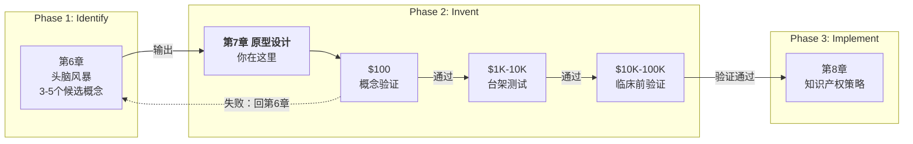

# 第7章 原型设计（Prototyping）

> 原型做得越精致，你越舍不得承认它有问题——这章教你用最低价格买到最贵的信息。

---

## 核心洞察压缩表

| 洞察 | 一句话 | 最反直觉的点 |
|------|--------|------------|
| **信息购买定律** | 失败不是浪费，是用$100买到别人花$100K才买到的信息 | 越精致的原型越让你不想放弃——沉没成本才是真正的杀手 |
| **最致命假设优先** | 5-10个假设中，那个"如果不成立全盘皆输"的就是第一个要验证的 | 大多数团队先验证最容易的假设；这恰恰是最危险的顺序 |
| **生死门机制** | 三级之间不是线性递进，是花钱资格的筛选 | 通过不是"继续做"，是"你有资格花十倍的钱验证下一个假设了" |

---

## 这章在说什么？

**核心问题**：头脑风暴产出了3-5个候选概念，但纸上的方案不等于能用的产品——怎么用最少的钱、最快的时间，判断哪个概念真的值得保护？

斯坦福 Biodesign 团队曾经花6个月做了一套精密的不锈钢介入装置原型，花了$80,000（案例见 Biodesign 2nd ed., Ch.7）。拿去做动物实验时发现：导管根本弯不到需要的角度。$80,000和6个月白费了。这不是个案——医疗器械行业每年有大量类似的故事在上演。

### 章节坐标

| 方向 | 章节 | 衔接 |
|------|------|------|
| 前一章 | [[Biodesign-第6章-头脑风暴]] | 头脑风暴筛出的概念是原型的输入 |
| 后一章 | [[Biodesign-第8章-知识产权策略]] | 验证通过的概念才值得花专利费保护 |

（三级原型的具体参数——预算、时间、验证什么——详见[[Biodesign医疗科技创新流程]]规律二。以下聚焦这章最容易被忽视的三个认知盲区。）

### 最佳阅读路径

| 你的问题 | 重点看本章哪里 |
|----------|--------------|
| 已有想法但还没验证 | "洞察一"和"72小时行动" |
| 不知道先验证什么假设 | "洞察二" |
| 正在犹豫要不要继续投入项目 | "洞察三"的门机制 |

---

## 这章真正解决什么问题

这章回答的不是"怎么做原型"——而是**怎么用最少的钱判断你的想法到底是金子还是石头**。三级原型的本质是一套信息购买系统：每一级都在回答"要不要继续投入"这个问题。

三级之间用"门"连接：概念验证通过→获得做台架测试的资格；台架通过→获得做临床前验证的资格。任何一级失败，回到上一级。这不是官僚流程，是经济理性——在每一级花掉十倍预算之前，你必须确信上一级的答案是对的。

以下三个洞察分别回答：为什么你会忍不住跳过原型直接做大方案？为什么你总是先验证最容易的假设？为什么原型通过了不等于应该继续？

---

## 真正改变认知的3个洞察

### 洞察一：失败是你的产品——但沉没成本会阻止你认账

**先停一下。你的团队刚花了两周做了一个$200的概念验证原型。测试结果：力学原理完全不成立。你会怎么做？**

大多数人会说"换个方向"。但如果他们花的是$200,000和八个月呢？他们会说"再投一点也许就行"。

这就是沉没成本陷阱。2022年发表在 *Angewandte Chemie* 上的研究（Ployanskiy et al.）专门分析了药物和医疗器械研发中的沉没成本偏见：即使在有明确数据证明项目不可行的情况下，已经投入的金钱和时间会系统性地扭曲团队的判断。投得越多，越不愿意承认失败。

三级原型策略的设计，本质上是在对抗这个心理陷阱。它通过强制分阶段投入（$100 → $1K → $10K），在每一级设置一个"继续还是放弃"的决策点。但 Biodesign 教科书没有说透的是：**这套机制只在理性层面有效。沉没成本的威力恰恰在于它绕过理性。** 一个团队如果在概念验证阶段投入的不是$100而是$5,000（因为他们"忍不住做得更精致"），沉没成本偏见就已经启动了。

所以"每一级只验证一个假设"这条规则，不只是效率问题——它是心理防线。原型越粗糙，你越容易做出理性的放弃决策。

> **信息购买定律**：每一次原型失败都是一次信息购买。$100的原型失败了，你花$100买到了"这条路走不通"。同一个信息，如果等到$100K阶段才发现，价格贵了一千倍。

打个比方：这就像试吃。聪明的做法是每样菜夹一小口尝尝味道，好吃再拿大盘。但如果你一上来就每样菜装一大盘——即使发现不好吃，你也会逼自己吃完，因为"已经拿了"。

**最容易讲不清楚的地方**：很多人会说"Fail Forward 不就是早失败嘛"——错。关键不是"早"，是**低成本**。早不等于便宜——你完全可以第一个月就花$50K做失败。Fail Forward 的本质是"用最低价格购买最贵的信息"，而不仅仅是"早发现"。区分这两件事的关键在于：你在做原型之前，有没有先列出所有假设、找到最致命的那个、然后用最简陋的材料只验证这一个问题。如果没有这个过程，"早失败"只是"早浪费钱"。

以前评估项目进度，第一眼看"做到第几级了"。现在第一眼看"每级花了多少钱、验证了几个假设"。如果一个团队在概念验证阶段花了超过$500，要么假设太多，要么原型做得太精致——两个都是红灯。说到这里，你可能会问：那怎么判断哪个假设最该先验证？这正是下一个洞察要回答的。

### 洞察二：先验证最容易的假设——这是最危险的策略

大多数团队做原型时有一个自然的倾向：先验证最容易通过的那个假设。为什么？因为"看到进展"让人有信心，投资人喜欢好消息，团队成员需要士气。

但这是最危险的顺序。

假设你的新型心脏封堵器有7个技术假设。假设A（材料强度）验证通过的概率是90%，假设B（在弯曲血管中的导航性）通过概率只有30%。如果你先验证A——$100，通过了！团队很开心。再验证另一个容易的——又通过了！士气高涨。然后你验证B——失败。前面的"好消息"全白费了，因为B如果不成立，A通过了也没用。你花了钱和时间，买到了一堆"对最终决策没有影响的信息"。

Biodesign 的方法：**先验证最致命的假设——就是那个"如果不成立，整个方案就不成立"的假设。**

> **致命假设优先定律**：假设之间存在逻辑依赖链——某个假设如果不成立，其他假设通过也毫无意义。先验证那个"一票否决"的假设，不管它多难验证。

怎么找？问一个问题：如果这个假设不成立，项目还能继续吗？如果答案是"不能"——这就是你第一个要验证的。不管它多难验证。

打个比方：你在盖一栋楼。地基能不能承重、地下有没有断层——这些是最致命的假设。外墙刷什么颜色——这是最容易验证的假设。你不会先刷完外墙再去勘测地基。但在创新项目中，人们经常在干这种事。

**最容易讲不清楚的地方**：有人会问"最致命的假设不也得分轻重缓急吗"——不需要。每级只验证**一个**假设，就是最致命的那个。如果最致命的假设通过了，它就不再是致命的了——下一个最致命的自然浮出水面。这就像剥洋葱：你不需要一次剥好多层，每层剥掉一层，下一层自然暴露。如果一开始就想排优先级，你会在排序上花太多时间，不如直接问"哪个假设死了项目就死了"。

这改变了我的工作习惯——以前拿到一个新想法，本能反应是"先做个demo看看效果"。现在第一件事是：列出所有假设，标出最致命的那个，用最糙的材料只验证它。效果和demo是以后的事。

找到了最致命的假设，下一个问题是：验证完了怎么办？这引出了本章最容易被误解的机制。

### 洞察三：通过不是"继续做"，是"获得花更多钱的资格"

大多数人把三级原型理解为一条流水线：做完第一级做第二级，做完第二级做第三级，最终做出产品。

**这不是流水线，是收费站。**

每一级原型的通过标准不是"做得不错，继续加油"。而是："你现在有资格花十倍的钱去验证下一个假设了。" 注意——"有资格"，不是"应该"。通过概念验证，意味着最致命的技术假设被证实了，你现在可以投入$1K-$10K做台架测试。但这一级也可能告诉你：虽然原理可行，但在模拟生理条件下性能不够。这时候，不是"改进一下继续"，而是**回到概念阶段重新想**。

三级之间的"门"是单向的：通过了才能进下一级，但任何一级失败都要回到上一级。记住：经济逻辑在上一节已说透——这里要强调的是一个被忽视的语义陷阱。

> **门机制定律**：原型验证的每一级是一扇门，通过=获得花钱资格，失败=回到上一级。没有"差不多通过了"——要么通过，要么不通过。

打个比方：这就像考驾照。科目一（理论）通过了，你获得上路练车的资格——不是说你会开车了，是说你有资格在教练陪同下练车了。科目二（场地）通过了，你获得上大路的资格。每一级都是一个门槛，不是终点。你不会说"科目一差不多过了"就跳到科目三。

**最容易讲不清楚的地方**：很多人会说"失败了回去改改不就行了"——这不是"改改"的问题。失败意味着你的核心假设错了。如果概念验证失败，要改的不是原型，是**概念本身**。可能需要回到第6章重新头脑风暴。这是最痛苦的决定——但$100阶段做这个决定，比$100K阶段做，容易一千倍。

下次看到一个团队说"原型做到第几级了"，我不会只问进度——我会问：每一级验证了什么假设？通过标准是什么？有没有哪一级"差不多通过"就往下推了？最后一个问题的答案如果是"有"，项目可能已经走上了斜路。

---

## 做完后怎么验证自己真的用对了

**72小时行动完成后**：
- 把你的"最致命假设"和验证结果拿给一个不了解你项目的人看。问对方："你觉得我下一个该验证什么？"如果对方说的和你计划的不一样 → 说明你假设之间的逻辑关系没理清，回去重排

**刻意练习5次后**：
- 找一个全新的问题（不是医疗器械领域），限时5分钟列出所有假设并标出最致命的一个。如果5分钟内找不出来 → 说明你还在凭直觉而非逻辑判断"致命性"，再练5次

**Day 7 回访时**：
- 不看笔记，先尝试回答 Day 7 的跨场景题。答不出来的地方 = 没真懂的，回去重读对应段落

---

## 这章哪里可能不够

### 批评

| 批评点 | 来源 | 实际情况 |
|--------|------|---------|
| 三级原型是线性门控模型，对数字健康/SaMD不适用 | BME Frontiers (2024), BMJ Health & Care Informatics: "Biodesign in the Generative AI Era" (2024, doi:10.1136/bmjhci-2024-101409) | 软件可以快速迭代发布，不需要"通过一级再做下一级"。Biodesign 第二版增加了数字健康章节，但三级原型框架核心仍以物理设备为主 |
| "Fail Fast"在医疗硬件中适用性有限——硬件错误不可逆 | Zewski Corp: "Fail Fast, Fail Safe: The Engineering of Testing Medical Devices"; 《The Strategy Institute》: "Fail Fast or Fail Smart?" | 软件改个版本号就修好了，硬件"一旦造出来"就是那个形状。更准确的说法是"fail fast, fail safe"——早失败且安全地失败 |
| 沉没成本偏见是心理问题，方法论解决不了 | Ployanskiy et al., "Sunk-Cost Bias and Knowing When to Terminate a Research Project", Angew. Chem. Int. Ed. 2022, 61, e202208429 | 知道"应该早放弃"和"真的早放弃"是两回事。三级原型是理性工具，但团队决策不是纯理性的。需要配合组织文化（奖励"主动终止"）和独立评审人机制 |
| 资源受限环境无法执行标准三级流程 | Stanford Biodesign Annual Report 2024, p.12-14 (Global Health Innovation); MediGate: MedTech Innovation Process (Springer, 2024) | 标准流程假设有3D打印机、动物实验室、多学科团队。在很多地区，台架测试的设备都找不到。需要降级版流程 |

**一句话价值边界**：三级原型是目前最成熟的医疗设备验证方法论，但它假设你有充足的资源、面对的是物理设备、团队的决策是理性的。超出任何一个假设，都需要调整。

### 极限压力测试

选"最致命假设优先"这个原则，找一个完全不懂创新方法论的朋友，用5分钟讲给对方听。讲完后观察：

1. 对方能不能用自己的话复述"什么是致命假设"？
2. 对方有没有追问"怎么判断哪个假设最致命"？
3. 对方能不能举一个自己工作中的类似例子？

### 几句值得画线的句子

1. "Fail forward — create versions that don't yet work to discover what changes are necessary."
   → 烂原型比完美PPT有用一百倍。

2. "The purpose of prototyping is not to build a product. It is to answer a question."
   → 做原型是为了回答问题，不是为了做产品。

3. "A prototype that is too polished can be just as dangerous as no prototype at all."
   → 原型太精致和没有原型一样危险——精致会骗你继续投入。

4. "Every dollar spent on prototyping should be traceable to a specific assumption being tested."
   → 花在原型上的每一块钱都应该能追溯到"在验证什么假设"。

5. "The best time to kill a project is when it has failed the cheapest test."
   → 杀死项目的最佳时机，是它刚在最便宜的测试中失败的那一刻。

---

## 读完必须做的第一件事

### 认知刷新表

| 旧直觉 | 新洞察 | 行动 |
|--------|--------|------|
| 原型做得越精致越好 | 原型越精致，沉没成本偏见越强，越不想放弃 | 做原型前先问：我在验证什么假设？$100能验证就别花$1K |
| 先做容易的，积累信心 | 先做最致命的——不成立的假设越早暴露越便宜 | 列出所有假设，标出"不成立就全盘皆输"的那个 |
| 三级是流水线，做完了就做完 | 三级是收费站——通过是花钱资格，失败要回上一级 | 每级定义通过/不通过标准，不通过就回去，不要硬推 |
| 失败了就是白做了 | 失败是信息购买——关键是趁便宜的时候失败 | 把失败看成"花$100买到了别人花$100K才买到的信息" |

### 72小时真实任务

**以下三个任务选一个，必须在72小时内完成：**

**任务A**：拿你正在做的一个项目（或最近想验证的一个想法），花30分钟做一件事：列出所有技术/市场/用户假设（至少5个），标出最致命的那个（"如果不成立，全盘皆输"），然后写一句话："$XX就能验证它。" 写完后拿给一个不了解你项目的人看，问："你觉得我标的最致命的假设对吗？"如果他指出另一个假设更致命 → 你的判断有盲区，重排。

**任务B**：如果你没有在做的项目，找一个你身边的产品或服务（比如你公司的某个功能、你常用的某个App），用"假设逆向"的方法拆解它：这个产品当时一定做了哪些假设？哪个是最致命的？现在这个假设成立吗？写下来，3条以上。

**任务C**：找一件你正在犹豫要不要继续投入的事情（工作项目、学习计划、甚至个人决策），用三级原型的逻辑重新审视：你的"概念验证"做了吗？最致命的假设验证了吗？如果没验证，你凭什么继续投入？写下来，然后做一个决定——继续还是停止。

### 薄弱环节刻意练习

运用这章内容最反人性的卡点：**在做原型之前，先停下来列出假设。**

大多数人的本能是"先动手做"。这章要求你先停下来思考——这是反人性的。练习方法：接下来5次遇到"先做个看看"的冲动时，强制自己先写3分钟：我在验证什么假设？最致命的是哪个？$XX能验证？写完再动手。5次之后，这会成为习惯。

### 三分钟讲给朋友听

你决定学冲浪。教练说：先在岸上练平衡（$0），再在浅水区试站起来（小擦伤风险），最后去深水区冲浪（有真正的危险）。每一级通过了，你才有资格进入下一级——但通过不意味着你已经是冲浪高手，只意味着你准备好了面对更大的挑战。

如果岸上平衡都没练好就冲进深水区——那就是大多数失败项目的写照。不是因为深水区可怕，是因为你跳过了验证自己"能不能站住"这个最致命的假设。

原型设计就是这套逻辑搬到创新上：**每一级验证一个假设，通过了才有资格花更多钱验证下一个。不通过就停下来，别硬推。**

核心就一句话：**每一级原型都是一次独立的赌注，上一级的投入和下一级的决策无关。**

**讲完后卡点自检**：

| 卡点 | 你卡在这里说明 | 回去看 |
|------|-------------|--------|
| "为什么最致命的假设要最先验证"讲不清楚 | 你没理解假设之间的逻辑依赖关系 | 洞察二"心脏封堵器"的例子 |
| "沉没成本怎么影响决策"说服不了对方 | 你把沉没成本当成理性问题，没意识到它是心理陷阱 | 洞察一"花$200 vs $200,000"的对比 |
| "通过为什么不是继续做"解释不了 | 你把三级原型理解成流水线，不是收费站 | 洞察三"门机制" |
| "数字健康为什么不适用三级原型"说不出口 | 你没理解物理设备和软件的试错成本差异 | 批评部分第一点 |

卡住不是坏事——卡住的地方就是你还以为懂了但其实没懂的地方。回去重读对应段落，用自己的话重讲一遍。

### 检索闪卡（遮挡答案，先痛苦回忆）

#### Day 1（理解机制）

1. Q: 为什么原型做得太精致反而是坏事？
   A: 精致=高沉没成本。沉没成本会扭曲你的判断——投得越多，越不愿意承认失败。$100的原型失败了你会说"换个方向"，$100K的原型失败了你会说"再投一点也许就行"。

2. Q: 三级原型之间是什么关系？不是什么关系？
   A: 是"门"（收费站的门控）关系，不是流水线关系。通过=获得花十倍钱的资格，失败=回到上一级重新来。不是"做完了做下一个"，是"通过了才能花更多钱"。

3. Q: Fail Forward 的本质是什么？"早失败"和它有什么区别？
   A: 本质是"用最低价格购买最贵的信息"。早失败≠便宜失败——你完全可以在第一个月就花$50K做失败。关键不是时间早晚，是成本高低。区分标志：做原型之前有没有先列假设、找最致命的、用最简陋材料只验证这一个问题。

#### Day 7（跨场景应用）

1. Q: 把"最致命假设优先"原则迁移到软件开发、求职、投资三个领域，它分别变成什么？
   A: 软件开发：先验证技术架构的瓶颈（不是先做UI）。求职：先确认目标公司真的在招人（不是先花两周改简历）。投资：先验证退出的可能性（不是先分析财务模型）。

2. Q: 一个团队说"我们原型已经做到台架阶段了"，你会问什么问题来判断他们做得对不对？
   A: 三个问题：（1）概念验证验证了什么假设？通过了吗？（2）台架测试在验证什么？通过标准是什么？（3）有没有哪一级是"差不多通过"就往下推的？最后一个问题如果是"有"，项目可能已经在斜路上。

3. Q: 你怎么向老板解释"我们的原型失败了，但这是好消息"？
   A: 我们花$200验证了最致命的假设，发现不成立。如果我们直接做台架原型（$10K+），发现同样的问题，损失大50倍。这次失败帮我们省了至少$10K和2个月。

#### Day 30（边界与反例）

1. Q: 三级原型策略在什么情况下不仅无效，反而有害？
   A: 两种场景。（1）数字健康/软件——可以快速迭代发布，强行套用三级门控会拖慢速度。（2）极度不确定的突破性创新——你连"最致命的假设"是什么都不知道，因为假设本身就是模糊的。三级原型需要"已知假设列表"作为前提。

2. Q: 如果你只能记住这章的一句话，应该是哪句？
   A: "每一级原型都是一次独立的赌注，上一级的投入和下一级的决策无关。" 沉没成本、门机制、信息购买——全都建立在这个前提上。

---

*拆解日期：2026-04-17*
*回访节奏：72小时 → 1周 → 1月*
*重点复习：三分钟讲解 + 检索闪卡*
