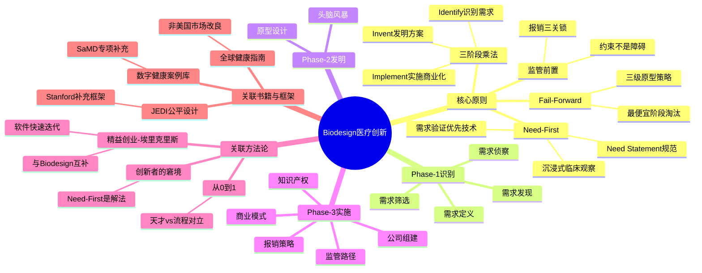

# 《Biodesign 医疗科技创新流程》

> **一句话**：医疗创新95%的死因不是技术不行，而是从一开始就在解决一个没人真正需要的问题——这本书教你如何系统性地避免这个死因。

---

## 四个核心规律

| 规律 | 一句话 | 最反直觉的点 |
|---------|--------|------------|
| **Need-First** | 从需求出发，不从技术出发 | 拿着锤子的人满世界看什么都像钉子——放下锤子才能看见整面墙 |
| **三阶段乘法** | 成功 = 需求 × 技术 × 商业，缺一项归零 | 不是加法——三项中任何一项为零，全部归零 |
| **监管前置** | 监管是设计约束，不是障碍 | 在发明阶段就规划 FDA 路径和报销，否则做完再发现路不对，项目从第一天就死了 |
| **跨学科团队** | 最小可行团队：CEO+CTO+医学顾问 | 临床洞察不能外包——第三版原型的反馈只有全程参与的医生才能给 |

---

## 章节映射

| 阶段 | 章 | 核心问题 | 关键产出 | 章节笔记 |
|------|---|---------|---------|---------|
| Phase 1: Identify | 第2章 需求发现 | 临床现场到底在烦什么？ | 100+需求池 | [[Biodesign-第2章-需求发现]] |
| | 第3章 需求筛选 | 哪个需求最值得做？ | 1-3个核心需求 | [[Biodesign-第3章-需求筛选]] |
| | 第4章 需求侦察 | 利益相关方各自怎么看？ | 需求全景图 | [[Biodesign-第4章-需求侦察]] |
| | 第5章 需求定义 | 怎么把需求写清楚？ | Need Statement | [[Biodesign-第5章-需求定义]] |
| Phase 2: Invent | 第6章 头脑风暴 | 100个想法怎么筛到3个？ | 3-5个候选概念 | [[Biodesign-第6章-头脑风暴]] |
| | 第7章 原型设计 | $100能验证什么假设？ | 1个验证通过的概念 | [[Biodesign-第7章-原型设计]] |
| Phase 3: Implement | 第8章 知识产权 | 怎么护住自己的发明？ | IP护城河 | [[Biodesign-第8章-知识产权策略]] |
| | 第9章 监管路径 | FDA走哪条路最快？ | 监管批准策略 | [[Biodesign-第9章-监管路径]] |
| | 第10章 报销策略 | 谁来买单？ | 报销可行性确认 | [[Biodesign-第10章-报销策略]] |
| | 第11章 商业模式 | 自己做还是授权出去？ | 商业模式画布 | [[Biodesign-第11章-商业模式]] |
| | 第12章 公司组建 | 先找谁？先融哪轮？ | 公司成立 | [[Biodesign-第12章-公司组建]] |

---

## 知识网络图

---

## 这本书真正解决什么问题

全球每年冒出海量医疗创新想法，95%以上最终夭折。烧掉的钱以十亿美元计。但这不是最扎心的——扎心的是，这些失败大多不是技术不行，而是**从一开始就在解决一个没人真正需要的问题**。整个医疗创新领域存在一个系统性的自杀模式：工程师闷头做产品，做完拿去找医生，医生说"我不需要这个"。这个故事反复上演。

这本书的核心主张：**95%的创新失败可以被预防**——前提是你愿意放弃"灵光一现"的幻想，改用一套可训练、可复制的系统流程。

**Paul Yock**，斯坦福 Biodesign 中心创始人，心血管介入先驱，执业医生兼发明家，孵化50+公司，融资超10亿美元。他和团队代表的是美国"学术-临床-产业"三位一体模式。**但你要知道他的利益立场**——他信奉"系统化流程"，天然排斥"天才直觉论"。这套方法论的有效性边界：有充足资源、面向美国市场、解决已知临床问题的渐进式设备创新。超出此边界，这套方法帮不了你。

### 别从头读到尾

| 你的处境 | 直接翻到 |
|----------|---------|
| 有技术想找应用场景 | 第2-5章（Identify）——你最需要学的是"放下技术，先看人" |
| 有想法想验证 | 第6-7章（Invent）——用$100在1周内验证最致命的假设 |
| 做完原型不知道怎么上市 | 第8-12章（Implement）——IP、监管、报销、商业模式四个关卡 |
| 只想30分钟了解全书 | 第1章 + 这篇拆解 |

### 决策速查表

| 你正在做的 | 关键决策 | 直接翻到 |
|----------|---------|---------|
| 选择研究方向 | 从需求出发还是从技术出发？ | 规律一（Need-First） |
| 筛选需求 | 六维矩阵哪些维度权重最高？ | 第3章 |
| 选择概念 | 概念筛选四维矩阵怎么打分？ | 第6章 |
| 设计原型 | 三级原型，先验证什么？ | 第7章 |
| 保护发明 | Provisional Patent 还是直接申请？ | 第8章 |
| 选择监管路径 | 能走 510(k) 吗？有 predicate device 吗？ | 第9章 |
| 规划报销 | 有现成 CPT 编码吗？医保覆盖吗？ | 第10章 |
| 组建团队 | CEO+CTO+医学顾问三个角色齐了吗？ | 第12章 |

### 这本书和哪些书有关系

**精益创业-Eric Ries**（互补）——精益创业是"先开枪再瞄准"，软件不怕打偏，改版本就行。Biodesign 是"先瞄准再开枪"，医疗器械打偏可能出人命。做数字医疗（软件+硬件），两本都要读——硬件用 Biodesign，软件用精益创业。

**创新者的窘境-Clayton Christensen**（互补但含张力）——Christensen 问"为什么大企业错过破坏性创新"，Biodesign 的 Need-First 是一种解法：因为大企业从内部技术出发，不从外部需求出发。但张力在于——Biodesign 擅长解决已知问题（增量创新），Christensen 关注的是创造人们还不知道自己需要的新品类。

**[[从0到1-彼得蒂尔]]**（对立）——Thiel 信任天才直觉，Biodesign 信任结构化流程。在医疗器械领域，我更信任后者——"秘密"藏在手术室的细节里，不在咖啡馆的灵光一现中。

---

## 真正改变认知的3个规律

### 规律一：放下锤子，才能看见整面墙

2001年，一支斯坦福团队进入心导管室。他们的任务：研究新型支架技术。连续蹲了几周，一个"跑偏"的细节反复出现——医生处理导管相关血流感染的时间和资源，远超手术本身。这个偏离原计划的观察后来催生了一个全新产品方向。而他们最初想研究的支架？市场早已饱和。

**先停一下。如果你是这支团队，带着"研究支架"的任务进了医院，却反复看到感染问题——你会追这个"跑偏"的线索吗？**

大多数人不会。这就是问题所在。

为什么从需求出发比从技术出发成功率高？很多人觉得这不过是"找准市场"的老生常谈。但真正的机制更深——从技术出发时，你的大脑会自动过滤掉"用不上我技术的场景"。你带着锤子，满世界看什么都像钉子，但只有钉子入得了你的眼。放下锤子，你才能看见整面墙。

Stanford Biodesign 20年数据验证：需求驱动的项目成功率远高于技术驱动的项目。这不是鸡汤，是统计学。

> **Need-First 定律**：创新成功率与"需求验证投入"成正比，与"技术酷炫程度"成反比。

翻译成中学生能听的话：去医院蹲着看，看医生和病人在烦什么。烦的就是需求。你的技术只是解决需求的工具之一，别拿工具来找问题。

**最容易讲不清楚的地方**：很多人会说"就是找准市场嘛"——错。市场调研告诉你什么存在，不告诉你什么让人痛苦。Need-First 关注的是"烦"，不是"有没有"。护士每天擦30秒接口，她已经习惯了，不会在问卷上勾选"我很烦"——你只有蹲在那里亲眼看到才会知道。

这打碎了我对"技术驱动创新"的迷信——以前评估一个项目，第一眼看技术参数。现在第一眼应该问：你们观察了多少个临床场景？听到了多少个真实的抱怨？

说到这里，有人可能会问：那 m RNA 疫苗、CRISPR 这种先有技术再找应用的创新怎么解释？好问题。这正是下一个规律要回答的——Biodesign 不是万能的，但先搞清楚它为什么有效，才能知道它在哪里失效。

### 规律二：创新不是黑箱，是乘法

"创新是黑箱"——进去一个人，出来一个发明，中间发生了什么靠天赋和运气。Biodesign 说：不是黑箱，是三段透明的流水线。但不是"加法"，是**乘法**。

**第一段 Identify（识别）**：全职驻扎医院6-8周，每天记录3-5个 candidate needs，累计100+需求池。六维矩阵筛到1-3个核心需求。写成 Need Statement——只描述问题，绝不夹带技术方案。

**第二段 Invent（发明）**：先发散（100+想法，禁止评判）再收敛。胜出概念进入三级原型：proof-of-concept（$100，1-2周）→ bench-top（$1K-10K，1-3月）→ pre-clinical（$10K-100K，3-6月）。每一级只验证一个关键假设。

**第三段 Implement（实施）**：IP保护、FDA监管路径、医保报销策略、商业模式、公司组建。

为什么是乘法不是加法？三项中任何一项为零，结果就是零。需求为零 = 没人要。技术为零 = 做不出来。商业为零 = 卖不出去。三项都必须大于零。

> **三阶段乘法定律**：成功 = 精准需求 × 可行技术 × 可执行商业路径。缺一项归零。

> **Fail Forward 经济学**：$100能回答的问题不要花$100K。三级原型（$100 → $1K → $10K）确保在最便宜的阶段淘汰不可行方案。

> **报销三关锁**：Coding（有没有编码）→ Coverage（保不保）→ Payment（保多少）。三关顺序锁死，任何一关不过产品就卖不动。

打个比方：盖房子需要地基（需求）、结构（技术）、卖房许可证（商业）。地基不稳，楼盖多漂亮都得拆。没有许可证，楼盖了也住不进去。三个条件不是加分项，是乘数。

**最容易讲不清楚的地方**：有人会问"那有一个乘数特别高不就行了？"——不行。需求验证做到100分、技术做到满分，但报销无望，结果还是零。乘法没有"弥补"机制，只有"归零"机制。

读之前觉得创新就是"有个好点子然后做出来"。读完后意识到——如果你只看到一个点子就开始做，你可能连"问题是什么"都没搞清楚。创新可以被系统化执行，"等灵感"恰恰是大多数项目失败的原因。

有了系统还不够。下一个规律解决一个反直觉的问题：什么时候该停下来不做。

### 规律三：技术完美但报销无望——不要做

你花了两百万美元和两年时间做出一个完美的医疗器械原型。拿去找 FDA，对方说："这个只能走 PMA 路径，需要再做一轮完整临床试验，三年，五百万起。"你只有种子轮的钱。项目从第一天就注定死了。

这不是假设，是医疗创新领域反复发生的真实死因。为什么？因为大多数工程师把监管当成"做完了再去应付的官僚手续"。

这本书的立场：**监管和报销是产品设计的一部分，必须在发明阶段就规划。** 背后的逻辑是一条从 FDA 倒推到产品设计的因果链：监管路径 → 临床证据量 → 试验规模和成本 → 融资需求 → 商业模式。你在 Invent 阶段选了一个只能走 PMA 的概念（1-3年，$500K-2M+），却只有种子轮的钱——钱不够，路不对，项目死。

如果技术完美但报销无望：**不要做。** 或者用 Bridge 策略——先打现金支付市场（整形美容、屈光手术），积累数据和收入，再回头攻医保。

> **监管前置定律**：监管不是创新的障碍，是设计约束。越早纳入约束，越少走弯路。

"障碍"是你做完产品再去跨越的墙。"约束"是你设计产品时就要考虑的边界。就像造车必须考虑道路限高——你不能造完了再抱怨桥太矮。

**最容易讲不清楚的地方**：很多人会说"监管当然重要，做完了再去批就行"——这就是没懂。关键不是"重不重要"，是"什么时候纳入"。做完再去批，你可能发现产品需要重新设计——从零开始。发明阶段就纳入约束，你从一开始就不会走进死胡同。

下次遇到一个"技术很酷"的医疗创新项目，我不会先看技术参数，我会先问三个问题：走什么监管路径？有对应报销编码吗？谁来买单？三个都答不上来，技术再好也别碰。

### 规律四：你会造车不等于你会卖车

A 团队：五个顶尖工程师。做出技术参数完美的产品。临床医生不买账，FDA 路径选错，报销策略为零。产品很好，公司死了。

B 团队：工程师+临床医生+商业人员+监管专家。产品参数略逊。但从一开始就瞄准了真实临床需求、最短监管路径、最优报销策略。产品一般，公司活了。

这不是假设。Stanford Biodesign Fellowship 20年反复验证：医疗器械创新跨越四个知识维度——临床（什么问题值得解决）、工程（怎么解决）、商业（能不能卖出去）、法律（IP 和监管怎么处理）。没有任何单一专业能独立覆盖这四个维度。

他们提出**最小可行团队**：CEO（商业/融资）+ CTO（技术/产品）+ 医学顾问（KOL/临床验证）。三个核心角色缺一不可。

有人问：医学顾问能不能外包？不能。临床洞察不是"咨询一次就搞定"的——它是在持续的产品迭代中反复验证的。你在第三版原型时发现临床场景和第一版的假设完全不同，这种洞察只有全程跟着项目走的医生才能提供。一个电话解决不了。

> **跨学科必需定律**：单专业团队的"盲区"恰好就是创新失败的"死因"。

打个比方：造一台医疗设备就像盖一栋楼——有人负责"该不该造"（医生），有人负责"怎么造"（工程师），有人负责"造完怎么卖"（商业）。缺一个这栋楼就塌。

**最容易讲不清楚的地方**：有人会说"核心团队就工程师，其他外包不就行了"——临床洞察不是"咨询一次就搞定"的。你在第三版原型时发现临床场景和第一版假设完全不同，这种洞察只有全程跟着项目走的医生才能提供。外包的顾问不会陪你改到第三版。

下次评估一个医疗创新团队，我不会再只看技术背景——而是先问三个问题：临床顾问是谁？谁负责监管策略？谁来跟 FDA 沟通？三个都答不上来，团队再强也别投。

---

## 做完后怎么验证自己真的用对了

> 拆解不是终点，知识必须形成闭环。以下是对每个行动的反馈检验设计。

**Need Statement 写完后**（72小时行动A的闭环）：
- 拿给一个不懂你项目的人看，问"你觉得我在解决什么问题？"
- 如果对方说出的答案和你想的不一样 → 你的 Need Statement 夹带了方案，重写
- 如果对方能用自己的话复述 → 说明需求定义干净
- **重写3次仍不合格** → 说明你对需求的理解还停留在表面，回去重新观察

**刻意练习5次后**（薄弱环节练习的闭环）：
- 找一个新问题（不在之前练过的5个里），限时3分钟写 Need Statement
- 如果3分钟内能写出不夹带方案的版本 → 练习有效，这个卡点已突破
- 如果还是忍不住写"我需要一个XX系统" → 再练5次，这次每个写完后先读一遍，划掉所有技术名词

**Day 7 回访时**（间隔检验的闭环）：
- 不要翻看拆解记录，先尝试回答 Day 7 的跨场景题
- 答不出来的地方就是没真懂的，回对应章节重读，不要只看拆解记录
- 能答出来的 → 在实际工作中找一个场景试着用一次

---

## 这本书哪里可能误导你

### 外部批评

| 批评点 | 谁在批评 | 实际情况 |
|--------|---------|---------|
| Need-First 倾向于解决已知问题，可能错过技术驱动的范式转移 | 创新理论学者（2024 scoping review） | mRNA疫苗、CRISPR、AI影像诊断都是先有技术再找应用。Biodesign 对这类创新指导有限 |
| 临床观察受观察者背景影响，存在隐性偏见 | Stanford Biodesign JEDI 框架 + BME Frontiers (2024) | 斯坦福医院的需求和社区医院完全不同。设备可能嵌入种族、性别、经济偏见。Stanford 已启动 Health Equity 项目应对 |
| 整套流程围绕美国医疗体系设计，对其他国家适用性差 | 全球健康研究者 | Stanford 发布了 Global Health Innovation Guidebook 承认局限。新加坡、东非在尝试改良版 |
| 标准流程过于设备导向，对数字健康、SaMD 指导不足 | PMC/NIH (2023) | 第二版增加了数字健康章节，但框架核心仍以物理设备为主 |
| CMS 报销审批速度（3-5年）才是创新真正的瓶颈 | Josh Makower 本人（NEJM Catalyst 访谈） | 即使流程完美，美国医疗系统的结构性问题非方法论能解决 |

**一句话价值边界**：Biodesign 是目前最成熟的医疗器械创新方法论，但它只在"有充足资源、面向美国市场、解决已知问题的渐进式设备创新"这个范围内有效。超出此边界，你需要其他工具。

### 极限压力测试

选这本书中你最认同的 Need-First 原则，找一个完全不懂医疗创新的朋友，用5分钟讲给对方听。讲完后观察：

1. **对方能不能用自己的话复述？** 如果复述不出来说明你的类比不够好
2. **对方有没有提出追问或反驳？** 如果只有"有道理"三个字，说明你没讲到反直觉的部分
3. **对方能不能举一个自己生活中的类似例子？** 如果能，说明规律真正被理解了

### 几句值得画线的句子

1. "The need is the need. Everything else is negotiable."
   → 需求就是需求，其他一切都可以商量。

2. "Innovation is a discipline, not a gift."
   → 创新是手艺，不是天赋。

3. "Fail forward — create versions that don't yet work to discover what changes are necessary."
   → 烂原型比完美PPT有用一百倍。

4. "A well-defined need is half the solution."
   → 需求定义清楚了，方案就成了一半。

5. "The best innovators are not the ones with the best ideas, but the ones who best understand the problem."
   → 最好的创新者不是点子最多的，是最懂问题的。

---

## 读完必须做的第一件事

### 认知刷新表

| 旧直觉 | 新洞察 | 行动 |
|--------|--------|------|
| 创新需要天才灵感 | 创新是可训练的系统流程 | 拿你正在考虑的创新想法，用 Need Statement 格式重写（只描述问题，不含任何方案） |
| 先有技术再找应用 | 先有需求再找技术 | 看到新技术先问"它解决什么已验证的需求" |
| FDA 是创新的敌人 | 监管是设计约束，越早纳入越好 | 概念阶段就画"监管→证据→成本→融资"因果链 |
| 做出好产品就成功了 | 好产品到好生意还过报销、商业模式关 | 用 Coding-Coverage-Payment 三关检验你的项目 |
| 创业团队就是一群工程师 | 跨学科团队是必需品 | 用"CEO+CTO+医学顾问"模型检查你的团队 |

### 72小时真实任务

**以下三个任务选一个，必须在72小时内完成。不是想一想，是做出来：**

**任务A**：拿你正在做的项目（或最近想到的一个创新点子），按 Biodesign 的格式写一份 Need Statement。格式："[方法] 对于 [目标人群] 谁需要 [解决什么问题]，关键结果是 [量化指标]。"
**硬约束：Need Statement 中不能出现任何技术方案。** 写完拿给一个不了解你项目的人看，问："看完这句话，你觉得我在解决什么问题？"如果对方说不清楚，重写。

**任务B**：如果你没有在做的项目，花一个下午去你熟悉的某个场景（办公室、实验室、医院、学校），不带任何预设，记录3个"人们在烦什么"的观察。注意：记录的是"什么让人烦"，不是"我想怎么解决"。

**任务C**：去 FDA 510(k) 数据库（搜索 "FDA 510k database"），搜索你感兴趣的领域，看有没有同类产品先例。有就记录名称和审批时间——这个信息直接决定你的监管策略和融资计划。

### 薄弱环节刻意练习

运用 Biodesign 最反人性的卡点：**Need Statement 中不夹带技术方案。**

大多数人写的时候会不自觉地写成："我需要一个基于AI的系统来帮助医生诊断X病"——这已经包含了技术方案（AI）。正确写法："医生在诊断X病时准确率只有60%，需要一个方法将准确率提升到90%以上。"

**练习**：拿你熟悉的5个问题，分别用两种方式写——第一种允许包含技术方案，第二种只描述问题。对比两者，反复练5次。检验标准：给一个不了解背景的人看你的 Need Statement，如果对方问"你打算用什么技术"，说明你写对了（因为没包含技术方案）。

### 三分钟讲给朋友听

想象你在一家医院急诊室蹲了一个月。护士每次给病人换输液管时，都要花30秒用酒精棉签擦接口。不是因为她手慢——是因为如果接口感染了，病人可能因此丧命。每年美国因此死亡的人数超过车祸。

你问护士："有没有不用擦的接口？"她说没有。

这就是一个 Need——真实的、量化的、有人愿意付钱解决的。

这本书教你怎么系统性地找到这样的 Need，然后发明解决方案，最后把方案变成能持续运营的产品。核心就一句话：**别从你想用的技术出发，从别人真正在烦什么出发。**

**讲完后卡点自检**：如果你讲到以下任何一处卡住了，说明你还没真懂——

| 卡点 | 你卡在这里说明 | 回去看 |
|------|-------------|--------|
| "为什么从需求出发比从技术出发好"讲不清楚 | 你没理解 Need-First 的底层机制（大脑会自动过滤不相关的场景） | 规律一第二段 |
| "为什么是乘法不是加法"解释不了 | 你把三阶段当成并列步骤，没意识到三项缺一归零 | 规律二的乘法逻辑 |
| "监管为什么要在发明阶段就规划"说服不了对方 | 你还没内化"约束 vs 障碍"的区别 | 规律三的因果链 |
| "为什么医学顾问不能外包"说不出口 | 你把临床洞察当成一次性的信息，不是持续迭代的验证 | 规律四"第三版原型"的例子 |

卡住不是坏事——卡住的地方就是你还以为懂了但其实没懂的地方。回去重读对应段落，用自己的话重讲一遍。

### 检索闪卡（遮挡答案，先痛苦回忆）

#### Day 1（理解机制）

1. Q: 写 Need Statement 时最常犯的错误是什么？为什么这个错误致命？
   A: 在需求描述中夹带技术方案。致命因为一旦带上技术方案，观察范围立即收窄——只会看到能用这个技术的场景，看不到其他更好的解决路径。

2. Q: 三级原型策略每一级花多少钱、多长时间、验证什么？
   A: PoC（$100，1-2周，核心概念能否跑通）→ Bench-top（$1K-10K，1-3月，关键功能达标）→ Pre-clinical（$10K-100K，3-6月，近真实环境表现）。每级只验证一个关键假设。

3. Q: 为什么是乘法不是加法？
   A: 三个乘数中任何一项为零结果就是零。需求为零 = 没人要。技术为零 = 做不出来。商业为零 = 卖不出去。不是加分项，是乘数。

#### Day 7（跨场景应用）

1. Q: 把 Need-First 定律迁移到餐饮、教育、建筑领域，它分别变成什么？
   A: 餐饮：先看周围的人想吃什么，不是先学厨艺再找客人。教育：先了解学生在挣扎什么，不是先设计课程再找学生。建筑：先理解这块地上的人需要什么空间，不是先画蓝图再找基地。

2. Q: 中国医疗器械公司的产品经理，Biodesign 哪些步骤直接用、哪些必须改？
   A: 直接用：临床观察、三级原型。必须改：监管（FDA→NMPA）、报销（CMS→国家医保+集采）、资源门槛（基层医院无法承受6-8周全职驻扎）。

3. Q: AI 辅助诊断团队来找你说准确率98%，你用 Biodesign 框架会问什么？
   A: 准确率是技术参数不是需求。问：（1）瓶颈真的是准确率吗？可能是周转时间或漏诊率。（2）SaMD 还是 IVD？需要多少临床证据？（3）有 CPT 编码吗？医保覆盖吗？（4）医学顾问是谁？

#### Day 30（边界与反例）

1. Q: Need-First 在什么极端场景下不仅无效，反而有害？
   A: 两种场景。（1）范式转移型创新（CRISPR、mRNA疫苗）——先有突破性技术再找应用场景，Need-First 会让你在已知需求里打转，错过这类机会。（2）资源极度受限环境——沉浸式观察需要多学科团队和6-8周投入，根本不可能实现。

2. Q: 如果你只能记住这本书的一句话，应该是哪句？
   A: "The need is the need. Everything else is negotiable." 三阶段法、监管前置、跨学科团队全部建立在这个前提上。需求定义错了，后面做的一切都是浪费。

---

*拆解日期：2026-04-17*
*回访节奏：72小时 → 1周 → 1月*
*重点复习：三分钟讲解 + 检索闪卡*

---

## 延伸阅读

- [[医疗金融]] — 医疗金融领域10本核心著作书单，覆盖医疗保健财务、健康经济学、医保支付与报销，与本书第8-12章（Implement阶段）直接互补
