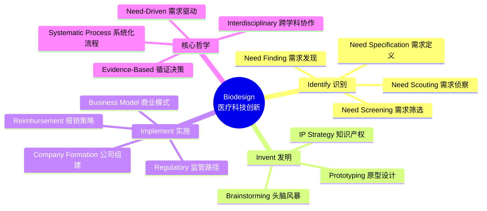

# 《Biodesign医疗科技创新流程》拆解记录

## 这本书要解决什么问题？

**核心困境**：全球每年产生海量医疗技术创新想法，但95%以上最终夭折。医生有临床洞察不知道怎么变成产品，工程师懂技术但不了解真实需求，投资人不知道该投什么方向。整个领域存在一个根本断层——**想法很多，能落地的极少**。作者追问的核心问题是：为什么有些团队能把一个临床观察变成拯救数百万人的医疗器械，而绝大多数团队在研发中途就失败了？

**一句话定位**：
> 医疗科技创新不是"灵感乍现"的随机事件，而是一套可以被学习、被复制、被管理的**系统工程流程**——从临床观察到产品上市，每一步都有方法论支撑，任何受过训练的团队都能执行。

### 作者站在什么位置说这些话？

| 维度 | 定位 |
|------|------|
| 主领域 | 生物医学工程 / 医疗器械创新 |
| 跨界领域 | 临床医学、商业管理、知识产权法、监管科学 |
| 作者背景 | Paul Yock：斯坦福大学生物设计项目创始人，心血管介入领域先驱，创办30+医疗科技公司；Joshua Makower：执业心血管介入医生兼连续创业者；Todd Brinton：生物医学工程师。三人构成"医生+工程师+创业者"的完美三角 |
| 历史语境 | 2009年首版，基于斯坦福Biodesign Fellowship项目15年实践经验。该项目培养了数千人，孵化了100+公司，融资超过30亿美元。代表了"学术-临床-产业"三位一体的美国创新模式。局限性在于高度依赖美国医疗体系（FDA、CMS报销）和斯坦福级别的资源投入 |

### 和其他书有什么关系？

| 关联书籍 | 关联关系 | 共同底层逻辑 |
|----------|----------|--------------|
| 精益创业-Eric Ries-拆解记录 | 方法论互补 | 都用系统化方法降低创新失败率，但精益创业面向互联网软件（快速试错），Biodesign面向受监管的医疗器械（稳准先行） |
| 创新者的窘境-Clayton Christensen-拆解记录 | 理论对立与互补 | Christensen关注大企业为何错过破坏性创新，Biodesign关注小团队如何系统性发现创新机会 |
| 从0到1-Peter Thiel-拆解记录 | 视角对立 | Thiel强调"天才直觉"和"秘密发现"，Biodesign强调"可复制流程"和"系统观察"——两种创新哲学的碰撞 |
| 创新者的处方-Clayton Christensen | 理论互补 | Christensen的医疗创新理论偏宏观战略，Biodesign提供可操作的微观执行框架 |

### 知识网络图

---

## 作者的核心论点

### 一、创新的起点不是技术，而是被精确定义的"临床需求"

2000年代初，斯坦福Biodesign的研究员们被派到心导管室里，不带任何技术方案，只带一双眼睛。他们坐在角落里连续几周观察——看医生怎么操作器械、怎么抱怨、怎么在手术中临时解决各种麻烦。积累了上百个"不方便"之后，其中一个反复出现的痛点是：现有的心律不齐消融导管需要在心脏里反复定位，手术时间动辄数小时，医生的手部疲劳度极高。

团队把这个观察写成了一个标准化陈述："一种能够帮助医生在心律失常消融手术中更快、更准确地定位并维持导管接触目标组织的方法，适用于接受射频消融治疗的心房颤动患者，在现有电生理实验室中使用。"

注意这个陈述里**没有任何技术方案**。它只说了"做什么"、"对谁做"、"在什么场景下做"。正是这个纯粹描述问题的需求定义，最终引导团队发明了一种新型消融导管，后来被强生收购。

为什么会这样有效？因为绝大多数创新失败的根源是"拿着锤子找钉子"——工程师先有了技术方案，然后到处找它的应用场景。Biodesign强制倒过来：先花大量时间搞清楚钉子在哪里、钉子有多大、钉子有多深，然后再决定用什么工具。需求定义的精度直接决定了后续研发方向是否正确。

> **需求驱动定律**：创新的成功率与需求定义的精度成正比，与技术方案的先进性无关。精确的需求定义 = 动作 + 目标人群 + 关键特征，且不应包含具体技术方案。

以前我总以为创新就是"想出好点子"，现在意识到这完全错了。点子不值钱，值钱的是把问题描述清楚的能力。下次做项目我不会再一上来就讨论"用什么技术"，而是先逼团队回答：**我们到底在解决谁的什么具体问题？** 如果这个问题回答不清楚，再好的技术方案也是浪费时间。

有了精确的需求定义，下一步问题来了——你怎么从上百个需求里挑出那一个值得做的？

### 二、好想法不值钱——用数据筛选比用直觉判断靠谱得多

斯坦福Biodesign的Fellow每年在医院里会发现300到500个临床需求。如果每个都做，资源根本不够。他们的做法是让所有人倒吸一口凉气：**用一套量化评分卡给每个需求打分，不管这个想法听起来多激动人心。**

评分维度包括：
- **临床价值**：影响的病人有多少？现有方案有多差？改善空间有多大？
- **商业潜力**：市场规模多大？谁会为此买单（患者、医院还是保险公司）？
- **技术可行性**：以当前技术水平，解决这个问题有多难？
- **竞争格局**：有没有人在做？专利壁垒有多高？

每个维度1到10分，总分排名。300多个需求最终只留下1到2个进入深度研究。

人的直觉在判断创新机会时系统性地高估两件事——技术可行性和市场规模，同时低估两件事——监管成本和报销难度。量化评分卡强制把思维拉回现实。

更重要的是，"需求筛选"和"需求侦察"是两个完全独立的步骤。筛选是快速打分，筛出Top 10；侦察是对这Top 10做深度调查——查专利、访谈专家、分析竞品、估算成本。很多团队把这两步混在一起，要么在明显不行的想法上浪费了调研时间，要么因为调研不够深入而错过好机会。

> **数据筛选定律**：创新决策的质量取决于筛选流程的独立性——快速打分和深度调查必须分开执行，且打分标准必须在看到数据之前确定，否则直觉偏差会污染整个流程。

下次遇到需要决策的场景，我不会再凭感觉拍板，而是先问自己：**打分标准是什么？这些标准在接触具体信息之前确定了吗？** 这套方法让我意识到，好的决策不是"选对了"，而是"选的流程对了"。

但这只是发现问题。发现了问题之后，怎么把解决方案从脑子里变成产品？这引出了作者最精彩的一个方法论。

### 三、头脑风暴不是"随便聊聊"——创意生成是一门有纪律的技术

大多数人开"头脑风暴会"的结果是：资历最深的人先发言，其他人附和，最后得出三四个差不多的想法。Biodesign的做法像一场精心设计的科学实验。

他们的规则反直觉：
1. **先发散、后收敛**：前30分钟只产出想法，不做任何评判。数量目标50到100个。
2. **禁止批评**：任何想法在发散阶段都不被否定，最疯狂的想法也记录下来。
3. **站在巨人肩膀上**：每次头脑风暴前，团队已经做了一周的"需求侦察"——了解现有方案、相关专利、跨行业技术。创意不是从零开始的灵感，而是在已知信息基础上的重新组合。
4. **多维度刺激**：刻意从不同角度看问题——从材料角度想呢？从软件角度想呢？把问题放大10倍想呢？

然后收敛阶段用评分矩阵评估每个想法：是否满足需求定义？技术可行性？成本可控？专利可保护？最终选出2到3个方向做快速原型。

创意的质量不取决于参与者的聪明程度，而取决于输入信息的质量和流程的结构化程度。信息不充分时头脑风暴等于闭门造车，没有结构时头脑风暴等于少数人主导。

> **创意结构化定律**：高质量创新 = 高质量信息输入 × 结构化发散流程 × 量化收敛评估。三个因子中任何一个为零，结果为零。

回想自己参加过的无数次头脑风暴，基本都输在第一个因子——信息输入不足。大家坐在会议室里凭空想，没有人先去了解用户真正在经历什么。Biodesign的做法让我彻底改变了习惯：**先做一周调研，再开一小时头脑风暴。** 顺序不能反过来。

有了好的创意，怎么判断它能不能变成一个真正的生意？这才是最难的。

### 四、医疗创新的"死亡之谷"不在研发，而在监管和报销

这是全书最让人清醒的一个观点。

很多团队花两三年做出了一个技术上完美的医疗器械原型，然后迎面撞上三堵墙：FDA审批花一到三年、花费数百万美元；即使FDA批了，没有合适的医保报销代码，医院不会买；即使医院愿意买，采购流程需要18个月的委员会审批，创业公司早就没钱了。

Biodesign用了一个形象的比喻：医疗创新的"死亡之谷"不在从想法到原型的阶段，而在从原型到市场的阶段。

所以在"实施"阶段，Biodesign做了三件大多数创新方法论不做的事。

**监管路径前置**——在发明阶段就考虑：这个产品属于FDA哪一类？需要临床试验吗？预计多长时间？同一需求，走510(k)路径和走PMA路径，方案设计完全不同。

**报销策略前置**——不仅问"这个产品能不能做出来"，还要问"谁会为它付钱、付多少钱、通过什么渠道付"。如果医保不覆盖，产品再好也卖不动。

**商业模式设计**——是做一次性销售？设备加耗材模式？还是授权给大公司？这决定了公司的融资策略和组织架构。

> **商业化前置定律**：在受监管行业，市场准入条件（监管+报销+采购）必须在创意阶段就纳入设计约束，而非产品完成后的"补充工作"。商业化可行性不是创新的"第二步"，而是创新的"并行约束"。

这个观点彻底改变了我对"创新"的理解——以前觉得创新就是"做出好产品"，现在意识到在医疗行业，创新 = 好产品 × 能获批 × 能报销 × 能卖出去。四个条件缺一不可，而且每一个都必须从一开始就考虑。

### 五、跨学科团队不是"找几个人一起干活"——用共同语言消解专业壁垒

把医生、工程师、商科学生放在同一个房间并不自动产生好结果。医生说的"好用"和工程师理解的"好用"完全不是一回事。Biodesign发现，跨学科协作的最大障碍不是知识差异，而是语言差异。

于是他们发展出一套"共同语言系统"：用标准化的需求陈述格式让所有人对"问题是什么"有统一理解；用决策矩阵和评分卡让不同专业背景的人能用同一套标准讨论方案；用原型作为沟通媒介——与其争论100次，不如做一个粗糙的原型让所有人试一下。

创新发生在不同话语体系的交界处。每个人都在自己的专业语言里思考，但真正的突破需要一种让所有人能互相听懂的语言。

> **语言统一性定律**：跨学科团队的创新效率与团队共享语言的完备程度成正比。好的创新流程本身就是最好的共同语言——它让不同专业的人能在同一个框架下做决策。

这解释了一个常见现象：为什么很多"全明星团队"反而做不出东西？因为每个明星都在用自己的语言体系，没人能真正听懂对方在说什么。流程的价值不仅是告诉你"做什么"，更是提供一个让所有人能"用同一种语言讨论做什么"的平台。

---

## 这本书的局限

> 没有任何书是完美的。这一节专门记录对本书的批评、争议和局限性。

| 批评点 | 谁在批评 | 怎么说 | 实际情况 |
|--------|---------|--------|---------|
| 偏向渐进式创新 | 破坏性创新研究者 | Biodesign的"需求观察"方法天然倾向于发现现有流程中的小痛点，容易错过颠覆性技术机会。它优化的是"已知的未知"，而非探索"未知的未知" | 确实如此。它擅长找到"现有手术中少花30分钟"的需求，但很难催生"彻底改变治疗方式"的突破 |
| 资源门槛高 | 发展中国家创新者 | 整套流程需要全职团队在医院驻扎数月，需要原型实验室、法律咨询、专利检索——这是富国精英的游戏 | 斯坦福项目本身需要大量资金，但方法论核心（需求定义、筛选流程）可以低成本执行 |
| 数字健康覆盖不足 | 数字健康创业者 | 第二版出版时数字健康还未爆发，对软件类医疗创新（AI诊断、远程医疗）的适配性有限 | 斯坦福Biodesign Center已在2020年后扩展Digital Health方向，但书中方法论需要读者自行适配 |
| 美国中心主义 | 非美国市场从业者 | 整个监管和报销章节基于FDA和美国医保体系，对欧洲CE、中国NMPA等其他监管体系参考价值有限 | 但流程框架（监管前置、报销前置）的逻辑可以迁移到其他监管体系 |
| 过度结构化 | 创意驱动型创业者 | 严格的流程和评分卡可能扼杀"疯狂但有潜力"的想法，把创新变成一种官僚程序 | 作者实际上在头脑风暴章节强调"禁止批评"，但整体框架确实偏向保守 |

**一句话总结局限性**：
> Biodesign是一套经过验证的、降低创新失败率的系统化方法，但它更适合"在已知框架内做优化"的渐进式创新，而非"打破框架"的颠覆式创新。它告诉你如何正确地做事，但不一定帮你判断是否在做正确的事。

---

## 最值得记住的话

**原书说的**：
1. "好的需求陈述是创新过程中最重要的一份文档——它比商业计划书更重要。"
2. "你发现的第一个需求几乎从不是最好的需求。"
3. "医疗创新的失败大多不是因为技术不行，而是因为团队不理解监管和报销的现实。"
4. "头脑风暴的质量取决于信息输入的质量——先做调研，再做创意。"
5. "在医疗创新中，'能不能做出来'只占成功的三分之一，另外三分之二是'能不能获批'和'能不能卖出去'。"

**翻译成人话**：
1. 把问题写清楚，比想解决方案重要100倍
2. 别急着抓住第一个好主意，继续找，更好的在后面
3. 技术好没用，搞不定审批和医保，产品就是废铁
4. 没有信息储备的头脑风暴等于凭空瞎想
5. 做产品只是三分之一的工作，剩下三分之二是搞定政策和渠道

---

## 讲给没读过的人听

> 选这本书最核心的一个观点，用中学生能懂的语言讲清楚。

你有没有想过，为什么那么多医疗发明最终没有变成医院里能用的产品？不是技术不好，而是因为发明的人搞错了顺序。

大多数人做创新的顺序是：我有一个技术→看看能用在哪→做出来→想办法卖。但这个顺序在医疗领域必死无疑。

Biodesign教的顺序完全反过来：先去医院坐着看，看医生在手术中抱怨什么、哪里效率低、哪个环节经常出错→把发现的所有问题列个清单，用统一的标准打分→选出最重要的一个，写成一个不包含任何技术方案的"问题描述"→然后才开始想解决方案。

为什么这个顺序这么重要？因为它保证你在解决一个"真实存在、有人愿意付钱、市场够大"的问题，而不是在为一个不存在的需求发明一个没人需要的东西。就像盖房子之前先确认地基在哪，而不是先设计屋顶再找地。

---

## 用来检验理解的问题

**基础回忆**：
1. Q: Biodesign流程的三个主要阶段是什么？
   A: Identify（识别需求）、Invent（发明方案）、Implement（实施商业化）

2. Q: 一个标准的需求陈述应该包含哪些要素？
   A: 动作（做什么）+ 目标人群（对谁做）+ 关键特征（在什么条件下做），不包含具体技术方案

3. Q: "需求筛选"和"需求侦察"的区别是什么？
   A: 筛选是快速量化打分（300→10），侦察是对Top候选的深度调查（10→1-2），两者必须分开执行

4. Q: 头脑风暴的四个核心规则是什么？
   A: 先发散后收敛、禁止批评、站在巨人肩膀上（先调研）、多维度刺激

**理解验证**：
5. Q: 为什么需求定义中不能包含技术方案？
   A: 包含技术方案会限制后续的创意空间，团队可能错过更优解决方案。需求定义回答"做什么"，而非"怎么做"

6. Q: 为什么"信息输入质量"比"参与者聪明程度"更重要？
   A: 创意本质上是已知信息的重新组合。信息输入不足时，再聪明的人也只能在有限空间内思考

7. Q: 医疗创新的"死亡之谷"在哪里？为什么？
   A: 在从原型到市场的阶段，因为FDA审批、医保报销、医院采购等市场准入壁垒比技术研发更难逾越

8. Q: 为什么跨学科团队需要"共同语言"？
   A: 不同专业的人用不同的话语体系思考，创新发生在话语体系的交界处。没有共同语言就无法协作

**实际应用**：
9. Q: 在做非医疗类硬件产品时，Biodesign的哪些方法可以直接借用？
   A: 需求发现（观察用户真实场景）、需求定义格式（动作+人群+特征，不含方案）、头脑风暴的信息先行原则、筛选评分卡

10. Q: 团队有10个产品想法，资源只够做2个，怎么套用Biodesign的筛选方法？
    A: 建立评分维度（市场规模、用户痛点程度、技术可行性、竞争格局），每个维度1-10分，排序后选Top 2，再做深度验证

11. Q: "商业化前置"思维怎么应用到互联网产品开发中？
    A: 在设计功能时就考虑：谁会为这个功能付费？获客成本多少？留存率目标多少？而非做完功能后再想"怎么变现"

12. Q: Biodesign和精益创业在处理"不确定性"上有什么本质区别？
    A: Biodesign用流程前置减少不确定性（先调研清楚再动手），精益创业用快速迭代应对不确定性（先动手再验证调整）。前者成本高但失败率低，后者成本低但试错次数多

---

## 和其他书的对话

### 和精益创业-Eric Ries-拆解记录

这两本书都在回答同一个问题：怎么降低创新的失败率？但给出的答案几乎是对立的。

精益创业说：别想太多，先做一个最简版本（MVP），扔到市场上去试，根据反馈快速调整。核心是"快"和"试"。

Biodesign说：不行，在医疗领域你不能"快速试错"——你不能用人体来做A/B测试。核心是"稳"和"准"。

这两种方法没有谁对谁错，适用场景不同。做互联网产品，试错成本低，精益创业更合适；做医疗器械，试错成本可能是人命，Biodesign更合适。但如果把两者的思维结合起来——在前期用Biodesign的方法把需求摸透，在后期用精益创业的MVP思路做快速验证——可能是最理想的组合。

共同底层逻辑：创新不是碰运气，而是可以被管理的系统性活动。只是管理的策略因行业而异。

### 和创新者的窘境-Clayton Christensen-拆解记录

Christensen提出了一个Biodesign没能回答的问题：当整个行业都被现有框架困住的时候，怎么跳出框架创新？

Biodesign擅长在现有医疗体系内找到改进空间，但如果问题本身是"这个体系需要被推翻"呢？比如Christensen讲的便携式超声设备——它不是让现有超声"更好用"，而是创造了一个全新的市场。

如果斯坦福的Fellows只在现有手术室里观察，他们能找到"让普通人也做得起超声"这种需求吗？大概率不能。因为这种需求不是"医生在手术中的抱怨"，而是一种结构性洞察。

所以，Biodesign教你在框架内做到极致，Christensen教你什么时候该跳出框架。两本书互补。

### 和从0到1-Peter Thiel-拆解记录

Peter Thiel会怎么看Biodesign？他可能会说：你这套流程只能做出从1到N的改进，做不出从0到1的突破。

Thiel的创新哲学核心是"发现秘密"——找到那些被所有人忽视但价值巨大的真相。他认为好的创新来自独特的洞察力，而非标准化的流程。

这个批评有一定道理。Biodesign确实偏向保守——它降低的是失败率，但同时也可能降低了成功的天花板。不过反过来想：Thiel的方法依赖天才的直觉，不可复制；Biodesign的方法依赖流程，可以被任何人学习。一个社会的创新体系需要Thiel式的天才来突破边界，也需要Biodesign式的流程来提升整体基线。

---

*拆解日期：2026-04-15*
*下次回访：2026-04-22 回顾「讲给没读过的人听」和「检验问题」*
